# ProtoSnap LilyPad 开发简单连接指南

> 原文：<https://learn.sparkfun.com/tutorials/protosnap-lilypad-development-simple-hookup-guide>

## 介绍

有兴趣进 LilyPad 吗？或者是 Arduino 引起了你的兴趣？只是想给你的背心增加一点白色发光的热情？以上全部？ProtoSnap LilyPad Simple 是探索这些主题的绝佳工具。

[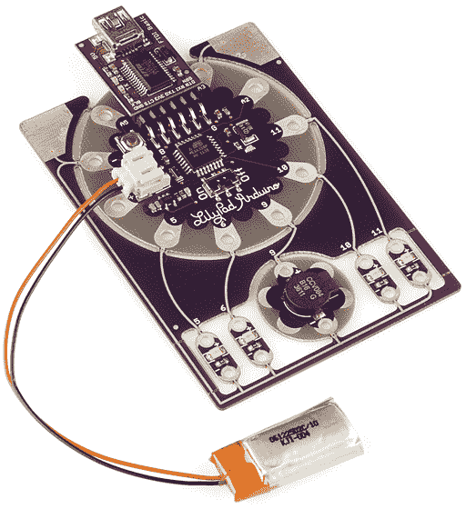](https://www.sparkfun.com/products/11201)

本教程旨在让读者熟悉各种主题，包括:led，LilyPad，Arduino，蜂鸣器，以及一般的电路。我将介绍一些基础知识，比如 ProtoSnap 上的所有铜走线是怎么回事，以及 LED 的作用。我们还将讨论将您的第一个 Arduino 草图加载到 ProtoSnap 上所需的步骤。

接下来，我们将实际演示如何使用 ProtoSnap 制作一些东西。我们将把碎片拆开来建造一个高科技的纤维激光枪！

[](https://cdn.sparkfun.com/assets/9/8/e/a/f/51df2fecce395fe828000000.png)

在我们开始之前，我想说一件事。您可能已经看过这个警告几次了，但我想重申一下:

# ***不要把 ProtoSnap 拆了！还没有。***

然后继续...

### 开始之前

本教程建立在从基础电子学到缝纫的一些概念上。如果您还没有，回顾一下这些教程可能会有所帮助:

*   [电子纺织品基础知识](https://learn.sparkfun.com/tutorials/e-textile-basics) -学习可穿戴电子产品的基础知识。
*   [用导电线缝合](https://learn.sparkfun.com/tutorials/sewing-with-conductive-thread)——在教程的后半部分，我们将拆开原型搭扣，然后再把它们缝合在一起。本教程解释了导电线的基本工作。
*   萤火虫罐 -这是最基本的电子纺织品电路之一。在全力以赴使用这个示例之前，您可能想尝试一下这个示例。

有几个通用的电子概念可能有助于了解:

*   什么是 Arduino？-proto snap lily pad 开发简单板有 Arduino！如果你不清楚 Arduino 到底是什么，可以看看这个教程。
*   [电压、电流、电阻和欧姆定律](https://learn.sparkfun.com/tutorials/voltage-current-resistance-and-ohms-law) -管理所有电路的基本规则，无论它们是耐磨的还是焊接的。
*   [串联和并联电路](https://learn.sparkfun.com/tutorials/series-and-parallel-circuits) -这有助于对串联和并联电路有一个非常基本的了解

## 硬件解释

ProtoSnap LilyPad Simple 是三个独特的 LilyPad 板的大杂烩。每块电路板都连接在一起，因此您可以探索、试验和测试您的 Arduino 程序，而不必担心将任何电路板连接在一起。

### LilyPad Arduino 简易板

[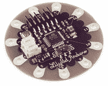](https://www.sparkfun.com/products/10274)

LilyPad Arduino Simple 是 ProtoSnap 操作的大脑。这块电路板的核心是位于中央的那个小小的黑色[芯片](https://learn.sparkfun.com/tutorials/integrated-circuits)——一个 **ATmega328 微处理器**。微处理器是一种微型计算机，可以通过编程与发光二极管、蜂鸣器和许多其他外围设备进行交互。ATmega328 是我们最喜欢的微控制器之一，它有一套很好的输入和输出，许多功能，它与 Arduino 软件配合得非常好。

环绕 LilyPad Arduino 简单板的**花瓣**是微处理器的输入和输出。+和-花瓣是芯片的电源输入，而各种 A#和#标签是输出引脚。

该板的其他关键组件是它的两个[连接器](https://learn.sparkfun.com/tutorials/connector-basics)。有一个米色的 2 针 **JST 连接器**，它与包含的 LiPo 电池匹配。面向电路板顶部的尖尖的 6 针连接器是 **FTDI 编程接头**。这个连接器与附带的 LilyPad FTDI 板接口，我们将在下面进一步讨论。

除此之外，还有一个复位按钮，开/关开关(只有在电路板使用电池电源时才能工作)，以及两个指示灯(它们很小，当电路板关闭时很难发现)。

### LilyPad LED 板

[](https://www.sparkfun.com/products/10081)

led 是发光二极管的缩写，是所有好的、闪亮的电子项目的核心。他们是完美的电源指示器，调试，或只是添加一点 zazz 到您的项目。

发光二极管有各种各样与光相关的用途。毫无疑问，你习惯于在发光显示器(时钟、交通灯、标志、LCD 背光)或节能光源(手电筒、建筑照明)中看到它们，但它们也有不太明显的光相关用途，如红外遥控器、鼠标移动探测器，它们甚至可以隐藏在芯片内(光隔离器)。

led 有两个引脚:阳极(+)和阴极(-)。当你给发光二极管施加适当的功率时，它就会发光。

[](https://cdn.sparkfun.com/assets/7/3/d/8/9/51df1970ce395f2228000000.png)

LilyPad LED 板有两个标记为+和-的花瓣。当 ProtoSnap 保持未咬合状态时，+引脚分别连接到 LilyPad Arduino Simple 板上的不同引脚，而-引脚全部接地。

[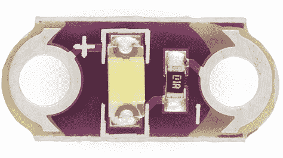](https://cdn.sparkfun.com/assets/3/8/0/d/e/51df19aace395ffa28000000.png)

除了 LED，LilyPad LED 板还包括一个限流电阻(那些微小的黑色矩形)。这些电阻是任何 LED 电路的重要组成部分，有助于确保您不会烧毁 LED。

### LilyPad 蜂鸣器板

[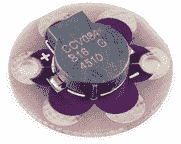](https://www.sparkfun.com/products/8463)

最后我们到了蜂鸣器。对于任何想要制造噪音的项目来说，这是必不可少的一部分，即使这种噪音是世界上最烦人的声音(老实说，听起来不会比这更好)。

像这样的蜂鸣器可以产生我们大部分听觉范围内的频率。给它输入一系列音调，你就可以制作音乐旋律、特殊效果声音、闹钟或任何你的项目需要的其他声音相关的应用程序。

这个蜂鸣器板有两个花瓣:一个加号(+)和一个减号(-)。在 ProtoSnap 上运行时,-引脚接地,+引脚连接到 LilyPad Arduino Simple 上的一个引脚。你可以对 LilyPad Arduino 进行简单的编程，在不同的频率下切换+引脚，以创建不同的音调。

### LilyPad FTDI 基本分线点

[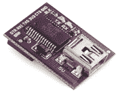](https://www.sparkfun.com/products/10275)

该板有三个不同的用途。首先，它可以为 LilyPad Arduino Simple 提供动力。为你的项目提供[能源](https://learn.sparkfun.com/tutorials/how-to-power-a-project)是你将做出的最重要的决定之一。FTDI Basic 将从计算机的 USB 端口获取电源，并将其中继到 LilyPad Arduino。

虽然为电路板供电很重要，但这才是电池的真正用途。FTDI 基本板的主要目的是帮助**编程**你的 LilyPad Arduino Simple。Arduino 软件与该板接口，该板又与您的 LilyPad Simple 板接口。

最后，如果一个 LiPo 电池连接到 LilyPad Arduino Simple 板，来自 FTDI Basic 的电源将用于为该电池充电。

这块板上有几个 led，标有 *TX* 和 *RX* ，当数据从你的电脑传输到 Arduino 时，它们会闪烁，反之亦然。当你把代码上传到板上的时候，看看他们会不会疯狂地眨眼。

### 锂聚合物(脂)电池

[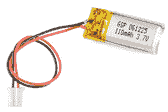](https://www.sparkfun.com/products/731)

这个小小的[脂肪电池](../battery-technologies/lithium-polymer)为大多数 LilyPad 项目提供必要的电力。电池让您可以自由地远程运行您的项目，而不必从短裤中拿出 USB 电缆四处走动。

我们喜欢脂肪电池，因为它们将大量的能量装入一个小包装中，通常很容易使用，最重要的是，它们可以充电。

这种单细胞 LiPo 将根据其电荷产生大约 3.6V 至 4.2V 之间的**电压**。附带的电池的额定**容量**为 110 毫安时，应该足以为你的项目供电至少三个小时左右(假设你只是在大声播放 led 和蜂鸣器)，甚至更长时间。

最终，LiPo 电池会放电到无法为 ProtoSnap 供电的程度。为了给 LiPo 电池充电，你需要将它连接到 LilyPad Arduino Simple 板，同时将该板插入 FTDI 基本插座(应该连接到 USB 电缆)...它应该连接到计算机的 USB 端口。大量的连接)。LilyPad Arduino Simple 上的**橙色充电 LED 指示灯**会在电池充电时亮起，一旦电池充满就会熄灭。电池从没电到充满电大约需要一个小时。

脂肪电池是美妙的，但如果处理不当，它们会很危险。不要用 exacto 刀去刺它，只按上面的详细说明充电。

## 原型电路

ProtoSnap 的伟大之处在于，我上面提到的所有单独出售的电路板都是混在一起并连接在一起的。在对 Arduino 板进行编程之前，了解所有这些板是如何连接在一起的非常重要。

[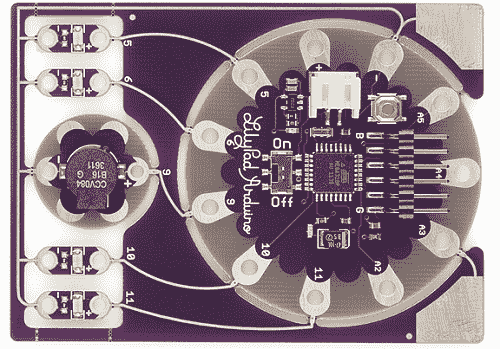](https://cdn.sparkfun.com/assets/b/3/9/2/3/51df1c67ce395fc228000000.png)

Arduino Simple 板上的每个引脚都有一个独特的编号，Arduino 代码中会引用该编号。请注意板上的白色引脚标签——特别是那些标有 *5* 、 *6* 、 *9* 、 *10* 、 *11* 、 *A2* 、 *A3* 、 *A4* 和 *A5* 的标签——这些都是引脚编号。它们会在你的 Arduino 草图中被反复使用。

在 ProtoSnap 上，这些引脚连接到 led 或蜂鸣器(或者，在某些情况下，什么也没有)。如果你想控制一个 LED，或者激活蜂鸣器，知道它们连接到哪个管脚是很重要的。有几种方法可以发现这一点:你可以实际看到并追踪这些线——从一个花瓣到另一个花瓣的青铜色的弯曲线——或者你可以参考 pin 码。或者，您可以查看这张方便的表格:

| **Arduino Pin 码** | **组件** | **输入还是输出？** |
| five | 最左侧的 LED | 输出 |
| six | 中左 LED | 输出 |
| Ten | 中右 LED | 输出 |
| Eleven | 最右侧的 LED | 输出 |
| nine | 门铃 | 输出 |
| A3 号 | 触摸传感器 | 投入 |
| Thirteen | 板载绿色 LED | 输出 |

为了清楚起见，这些引脚中的任何一个都可以配置为输入或输出。输入/输出栏实际上只适用于使用这个电路的情况。

名称中带有“A”的输入是模拟输入。他们很特别。它们可以做数字输入可以做的一切，但它们也可以用作模数转换器。ADC 可以读取一系列电压，而不仅仅是读取高电平或低电平。这使得它们可以方便地检测模拟输入(如板载触摸传感器)。

## 启动它

事不宜迟，让我们插上电池，尽情享受闪亮的 led 吧！取出电池和 ProtoSnap 板，**将电池的白色连接器**插入 LilyPad Simple 的米黄色连接器。确保电池连接器上的槽口与主板连接器上的反向槽口相匹配。如果还没有，将开/关**开关**切换到开的位置。

[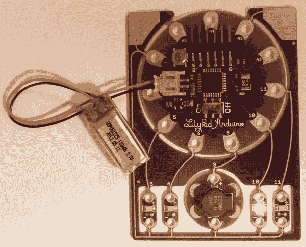](https://cdn.sparkfun.com/assets/e/2/5/1/9/51df22d3ce395f5928000000.png)

原型快照应贯穿其[示例草图](https://cdn.sparkfun.com/assets/8/4/4/9/f/51df251ece395f9928000001.zip)。发光二极管将依次亮起，蜂鸣器将发出蜂鸣声，然后什么也不会发生。*貌似*没什么那是。尝试同时触摸这两个巨大的银色角垫(标有 *GND* 和 *A3* )。

[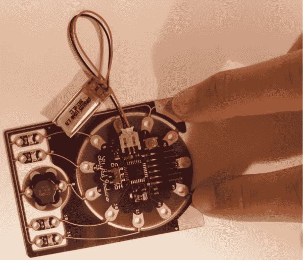](https://cdn.sparkfun.com/assets/7/f/f/f/2/51df2328ce395f5c28000000.png)

原来，示例草图有一些非常漂亮的代码，可以将不同级别的触摸感应转换成优美的合成器声音。

如果你想重新体验闪烁的感觉，按下**重置**按钮(这是一个银色环绕的金色小圆圈，靠近 FTDI 连接器)。在按下重置按钮时要小心，并确保你已经将 ProtoSnap 放在一个坚固、水平的平台上(根据经验，我只是稍微用力按下重置按钮，就取消了 ProtoSnap 的接地痕迹)。

## 上传 Arduino 草图

一旦你厌倦了这个例子(好像！)，你无疑会渴望编写并上传你自己的代码。所以，让我们开门见山。

### 安装 Arduino

从现在开始，你需要安装**Arduino**。你可以从 [Arduino 的下载页面](http://arduino.cc/en/Main/Software)获取该软件的最新版本。查看我们的 Arduino 安装指南( [Windows](../installing-arduino/windows) 、 [Mac](../installing-arduino/mac) 或 [Linux](../installing-arduino/linux) )以获得安装 ide 的帮助。当那些教程谈到插入 Arduino 到[安装驱动](https://learn.sparkfun.com/tutorials/how-to-install-ftdi-drivers)时，插入 FTDI 基本板。

懂吗？现在，打开一个 Arduino 窗口。你会看到类似这样的信息:

[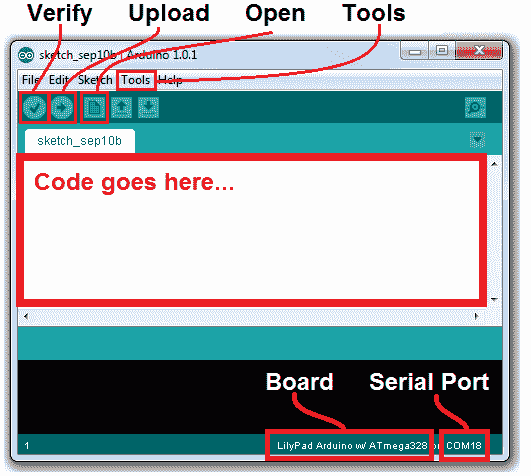](https://cdn.sparkfun.com/assets/d/4/e/3/c/51df245ece395f0728000001.png)

在上传代码之前，需要进行一些设置。注意我上面的图片中“Board”是如何被正确设置为“LilyPad Arduino w/ ATmega328”的？你的很可能不是那样设置的。要改变这一点，进入**工具**菜单，导航到**电路板下拉菜单**，选择**lily pad Arduino w/atmega 328**。这告诉 Arduino 软件应该为哪种电路板编译代码。

[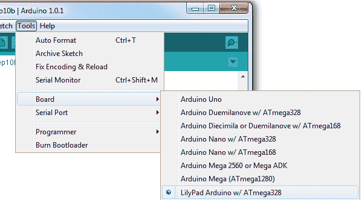](https://cdn.sparkfun.com/assets/4/e/4/6/a/51df24aace395fc328000002.png)

你还需要设置串行端口，这样 Arduino 就知道它在和你漂亮的新 FTDI 基础板对话。再次进入**工具**，在**串口**下选择你的 FTDI 的端口。在 Windows 机器上，这是“COM#”，在 Mac 上，您的端口将是“/dev/tty.usbserial###”。通常在这个菜单下你应该只有一个选择，选择那个。如果你有不止一个(像我一样，我有一个 COM1，这是我的电脑的古老的 RS-232 端口)一点点试错不会有什么坏处，或者你可以在设备管理器中确认。

[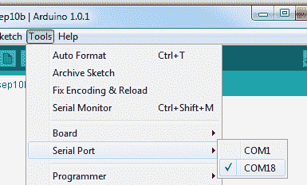](https://cdn.sparkfun.com/assets/4/6/9/9/6/51df24e0ce395ff528000000.png)

### 将 FTDI Basic 连接到 LilyPad Arduino

在你上传代码之前，你需要**将 FTDI Basic** 连接到 LilyPad Arduino Simple 板。LilyPad Simple 上有“B”和“G”标签，它们应该与 FTDI 板上的“BLK”和“GRN”标签对齐。将它们排成一行，并将 FTDI 的母连接器滑动到配套引脚上。

[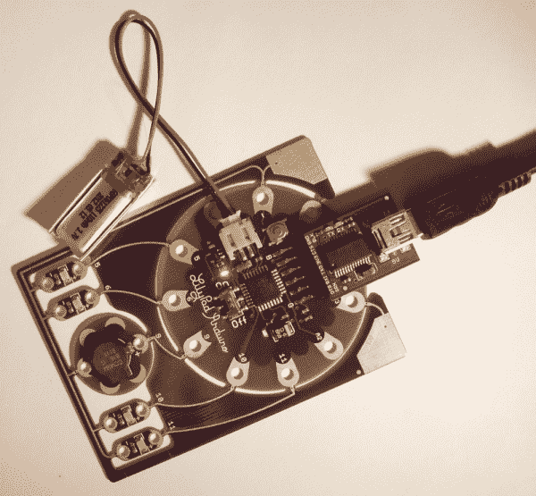](https://cdn.sparkfun.com/assets/6/f/1/3/d/51df2578ce395f2e28000002.png)

当您插入 FTDI 板(假设电池已连接)时，您应该会看到一个橙色 LED 灯亮起，表示电池正在充电。

### 上传代码

太棒了。现在唯一缺少的是代码。这是非常空虚的，当谈到编程食谱。点击[这里](https://cdn.sparkfun.com/assets/f/6/d/d/6/51df28e2ce395f6128000000.zip)下载我们将在教程的后半部分使用的 Raygun 示例代码(或者你可以从下面复制/粘贴)。解压那个文件夹，用 Arduino 打开“Raygun.ino”。

```
language:c
/* RAYGUN!!! Example Code
   By: Nick Poole and Dia Campbell
       SparkFun Electronics
   Date: September 12, 2012
   License: This code is released into the open domain. Please
   use, re-use, and modify this code in any which way you
   require.

   This example code was written specifically for the ProtoSnap
   LilyPad Simple Development Board. After initializing the pins
   in setup(), this code jumps straight into making awesome,
   super-pleasant-sounding Raygun sounds. From time to time, the
   LEDs will sequentially light up (5->6->10->11).

   All sounds are labeled with an approximate onomatopoeia. You 
   can move around the for() loops to make the Raygun that best 
   suits you.
*/

const int buzzer = 9; //Buzzer pin
int freq; //frequency out (don't freak out)

void setup()
{
  // Set LED pins as OUTPUTs:
  pinMode(5, OUTPUT);
  pinMode(6, OUTPUT);
  pinMode(10, OUTPUT);
  pinMode(11, OUTPUT);

  // Set buzzer pin as OUTPUT:
  pinMode(buzzer, OUTPUT);
}

void loop()
{
  // BOOOOOOOOoooooooooo sound (descending) >>>>>>>>>>>>>>>>>>>>>
  // Goes from 1000 Hz to 340 Hz with 2ms delays in between
  for (int b=1000; b>340; b--)
  { 
    tone(buzzer, b);
    delay(2);   
  }
  // End of BOOOOOOOOoooooooooo <<<<<<<<<<<<<<<<<<<<<<<<<<<<<<<<<

  // Now call the ledZap() function. This is a function that we've
  // defined ourselves in the code below. Look under this loop to
  // see what the ledZap() function does.
  ledZap();

  // Turn the buzzer off, this must be called if the tone() 
  // function was not given a duration (the 3rd paramater).
  noTone(buzzer);

  // DSIFGSIVOESRGJIOFDSJGFSD sound (white noise) >>>>>>>>>>>>>>>
  // This for loop plays 5000 random frequenices to create what
  // sounds like white noise.
  for(int i =0;i<5000;i++)
  { 
    freq = random(240,1080);
    tone(buzzer, freq);
  }
  // End of DSIFGSIVOESRGJIOFDSJGFSD <<<<<<<<<<<<<<<<<<<<<<<<<<<<

  noTone(buzzer);  // Turn off the buzzer

  // WAWAWAWAWAWAWAWA sound (pacman waka) >>>>>>>>>>>>>>>>>>>>>>>
  // This set of for loops very quickly sweeps frequencies
  // down then up then down then up (10 iterations of down/up)
  for(int r=0;r<10;r++)
  { 
    for(int c=1000;c>340;c--)
    {
      tone(buzzer, c);
    }
    for(int d=340;d<1000;d++)
    {
      tone(buzzer, d);
    }
  }
  // End of WAWAWAWAWAWAWAWA <<<<<<<<<<<<<<<<<<<<<<<<<<<<<<<<<<<<

  noTone(buzzer);

  ledZap();  // Zzzzzzzap

  // DSIFGSIVOESRGJIOFDSJGFSD sound (white noise) >>>>>>>>>>>>>>>
  // Same as the last DSIFGSIVOESRGJIOFDSJGFSD
  for(int i =0;i<5000;i++)
  { 
    freq = random(240,1080);
    tone(buzzer, freq);
  }
  // End of DSIFGSIVOESRGJIOFDSJGFSD <<<<<<<<<<<<<<<<<<<<<<<<<<<<

  noTone(buzzer);

  // ooooOOOOBooooOOOOB sound (ascending) >>>>>>>>>>>>>>>>>>>>>>>
  // This set of for loops will twice sweep frequencies UP
  // from 340 Hz to 1000 Hz, with a small delay in between
  // each tone.
  for(int s=0;s<2;s++)
  { 
    for(int g=340;g<1000;g++)
    {
      tone(buzzer,g);
      delay(2);
    }
  }
  // end of ooooOOOOBooooOOOOB <<<<<<<<<<<<<<<<<<<<<<<<<<<<<<<<<<

  noTone(buzzer);

  ledZap();  // Raygun be zapping

  // DSIFGSIVOESRGJIOFDSJGFSD sound (white noise) >>>>>>>>>>>>>>>
  // same white noise as usual.
  for(int i =0;i<5000;i++)
  { 

    freq = random(240,1080);
    tone(buzzer, freq);
  }
  // End of DSIFGSIVOESRGJIOFDSJGFSD <<<<<<<<<<<<<<<<<<<<<<<<<<<<

  noTone(buzzer);

  // Now that we've reached the end of loop(), jump back up
  // to the top and do it all over again! Yay!
}

// the ledZap function quickly, and sequentially blinks 
// each LED on and off. It'll blink pin 5, then 6, 10 and 11.
void ledZap()
{
  digitalWrite(5, HIGH);   // set the LED on
  delay(50);              // wait for 50ms
  digitalWrite(5, LOW);    // set the LED off
  delay(50);              // wait for 50ms

  digitalWrite(6, HIGH);   // set the LED on
  delay(50);              // wait for 50ms
  digitalWrite(6, LOW);    // set the LED off
  delay(50);              // wait for 50ms

  digitalWrite(10, HIGH);   // set the LED on
  delay(50);              // wait for 50ms
  digitalWrite(10, LOW);    // set the LED off
  delay(50);              // wait for 50ms

  digitalWrite(11, HIGH);   // set the LED on
  delay(50);              // wait for 50ms
  digitalWrite(11, LOW);    // set the LED off
  delay(50);              // wait for 50ms
} 
```

现在，通过点击向右箭头图标按钮，尝试**上传**代码。给 Arduino 几秒钟编译代码，然后再给几秒钟上传。如果一切顺利，您应该会收到类似这样的问候:

[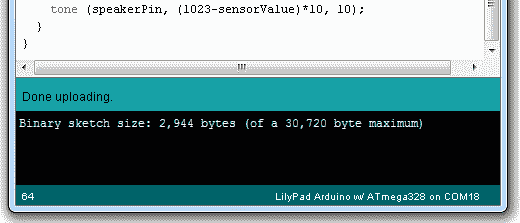](https://cdn.sparkfun.com/assets/a/f/f/8/7/51df25acce395fa428000000.png)

耶！你上传了一些新代码到 LilyPad Arduino Simple。新代码一上传，Arduino Simple 板就应该开始运行我们将在下一部分教程中使用的 Raygun 代码。

如果您在上传时遇到问题，请再次检查板和串行端口是否设置正确。然后，确保 FTDI 基本板正确插入 LilyPad Arduino 简单板(“B”连接“BLK”，“G”连接“GRN”)。如果你仍然没有任何进展，请在下面的评论中告诉我们。您也可以联系我们的[技术支持团队](https://www.sparkfun.com/static/technical_assistance)，他们很乐意为您提供帮助。

* * *

本教程的第一部分到此结束。你已经上传了一些代码到 ProtoSnap(应该还是完整的)。在剩下的页面中，我们将解开开发板，并断开导电线做一些缝纫！

## 喷枪准备

那么，你已经上传了代码，稍微摆弄了一下，你已经熟悉了板上的组件。现在是时候把它拆开，缝上电路了！如果你想使用所有的组件，你需要一些能很好地利用灯光和声音的东西，所以我就直接说出我们都在想的东西——一把激光枪！

[](https://cdn.sparkfun.com/assets/3/1/8/1/2/51df2ad8ce395fea28000001.png)

我开始用一把简单的激光枪画在一块布料上。你可以把这条电路缝在无穷无尽的东西上。随意带着自己的想法奔跑吧！我将向您展示我的电路，但我所做的只是布置元件，并将所有元件缝合到电路板上已经连接的同一引脚上。您完全可以对这个配置进行更改，只要确保如果您更改了 pin，您的代码也会随之更改以反映这一点！

### 所需材料

对于本教程的这一部分，除了您的 ProtoSnap 附带的东西之外，您还需要:

*   剪刀
*   剪钳
*   非导电线
*   不管你把电路缝在什么上面

[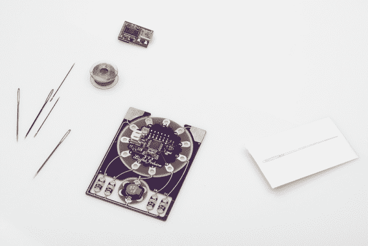](https://cdn.sparkfun.com/assets/f/5/d/7/9/51df2b4bce395fb128000003.png)

## 取消捕捉和跟踪

既然你们已经熟悉了第 1 部分，我就直接开始吧！如果您在这里，您应该已经让您的代码正常工作了，所以继续吧，把 ProtoSnap 的各个部分剪下来。我马上把它们都脱下来。我们会很快将它们全部固定到项目中，因此您不必担心丢失零件。用你的钢丝钳剪断木板之间的连接。小心地做这件事——你不会想切进或折断任何一个你以后要用来缝纫的洞。

[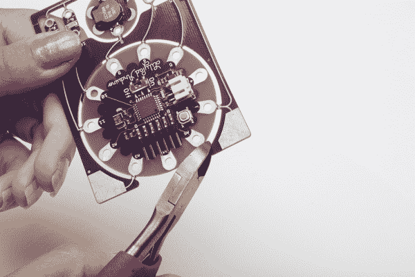](https://cdn.sparkfun.com/assets/b/3/9/3/7/51df2c84ce395f0529000003.JPG)

在你把这些零件拆开后，确保你也把多余的锋利部分剪掉

[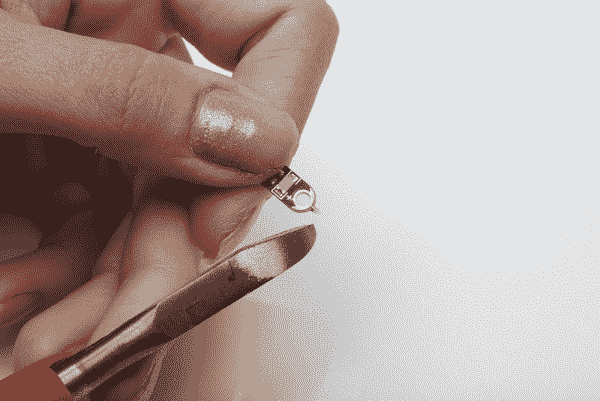](https://cdn.sparkfun.com/assets/d/a/8/7/3/51df2c89ce395fb628000001.JPG)

一旦你所有的部分都被剪开并清理干净，是时候开始缝纫了！从你的非导电线开始。我们将继续将部件固定到您的项目中，以便所有部件都已经按照您需要的方式进行了连接和定向。这将使你的导电线路更容易连接东西，因为它将很容易看到起点和终点。先拿起你的 Arduino 简易板。转动它，使“9”针朝向您希望蜂鸣器移动的位置。在我的情况下，这是对射线枪的尖端。这不需要缝很多针——你当然不需要把木板上的每一个缝洞都钉牢。我只是选了两张相对的，然后把它们缝了起来。

[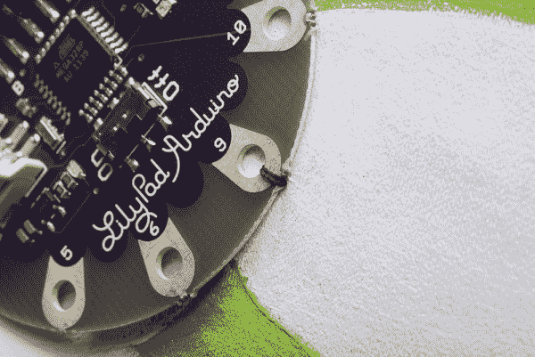](https://cdn.sparkfun.com/assets/6/1/2/6/a/51df2c8bce395f3328000000.JPG)

接下来，让我们按下蜂鸣器。您将希望正极引脚指向 Arduino 上的引脚 9，负极引脚指向前方，指向枪尖。

[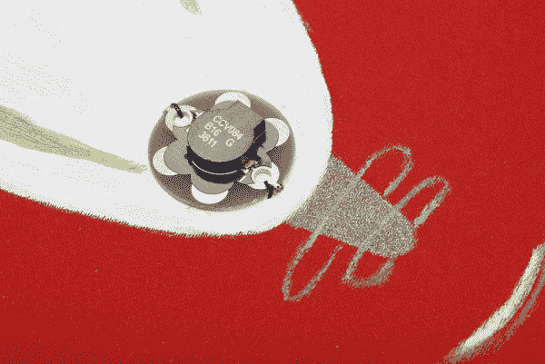](https://cdn.sparkfun.com/assets/0/7/7/2/5/51df2c92ce395f9328000004.JPG)

最后，把发光二极管钉上。你希望它们排成一行，正面朝上，反面朝下

[](https://cdn.sparkfun.com/assets/1/0/6/0/d/51df2c94ce395fba28000003.JPG)

## 缝合积极面

现在开始[缝制导电迹线](https://learn.sparkfun.com/tutorials/sewing-with-conductive-thread)！我知道从蜂鸣器到引脚 9 的走线是一条短而直的走线，但我们现在要跳过这条走线。它必须穿过几条 LED 走线，所以我们先做这些。从最靠近蜂鸣器的 LED 开始，用几针缝合正极端子。

[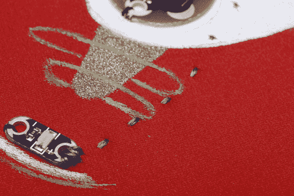](https://cdn.sparkfun.com/assets/3/b/c/a/e/51df2e89ce395ffb28000001.JPG)

从正面孔缝到 Arduino 板的引脚 5。你需要绕过蜂鸣器一点，为负迹线离开蜂鸣器留出空间。当你到达针 5 时，在打结和剪断你的线之前把它缝好几次。

[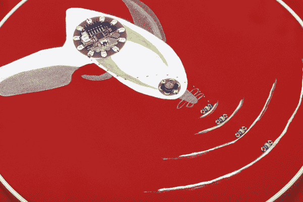](https://cdn.sparkfun.com/assets/8/5/e/2/0/51df2e89ce395fb528000001.JPG)

缝合下一个 LED 的正极，将其连接到引脚 6。

[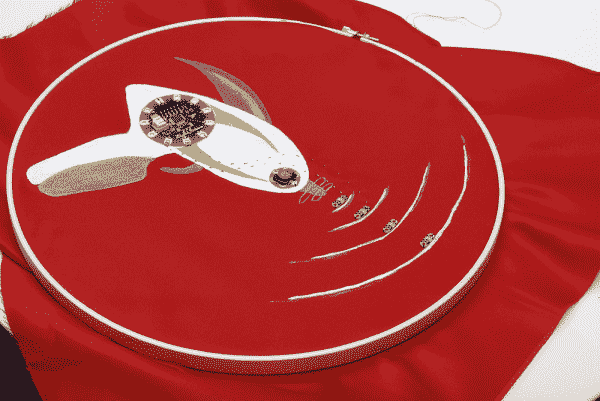](https://cdn.sparkfun.com/assets/7/2/d/0/9/51df2e89ce395f0228000002.JPG)

确保这些痕迹之间保持一定距离——你不想让它们接触。

[](https://cdn.sparkfun.com/assets/9/1/4/5/b/51df2e89ce395f1d28000000.JPG)

缝合第三个 LED 的正极，并将其连接到引脚 10。

[](https://cdn.sparkfun.com/assets/0/2/7/b/9/51df2e89ce395f8f28000000.JPG)

缝合最后一个 LED 的正极，并将其连接到引脚 11。

[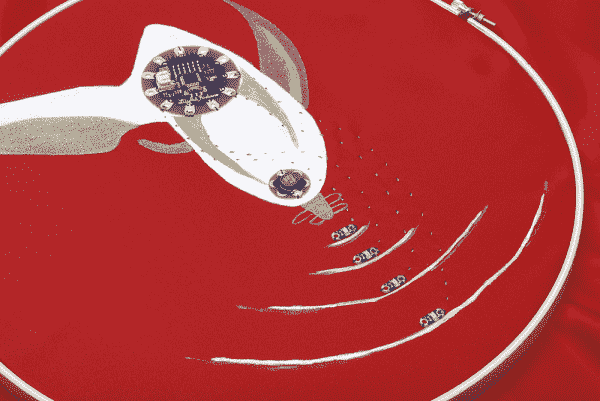](https://cdn.sparkfun.com/assets/2/8/b/e/6/51df2e89ce395ff673000001.JPG)

花一点时间仔细检查你的痕迹没有接触到，无论是正面还是背面。

[](https://cdn.sparkfun.com/assets/0/6/d/7/5/51df2e89ce395f5228000001.JPG)

## 缝制底片

让我们从负迹线(或地)开始！从最远的引出线开始，缝合反面，缝合到下一个引出线，然后缝合反面的孔。继续沿着这条线，缝合每个负极垫，同时将它们相互连接。

[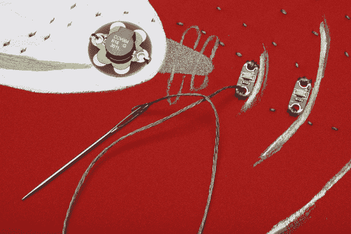](https://cdn.sparkfun.com/assets/1/1/6/4/0/51df2e8ace395f0129000000.JPG)

继续追踪，缝上蜂鸣器的负花瓣。

[](https://cdn.sparkfun.com/assets/c/1/1/e/c/51df2e8ace395f0b29000001.JPG)

继续向下追踪，找到 Arduino 的负极引脚。我忽略了得到这个连接的图片，但是要小心不要碰到其他的痕迹，并且用几针把它固定好。接下来，剪断并打结你的线，准备最后的追踪！把蜂鸣器上的正极针脚缝上。

[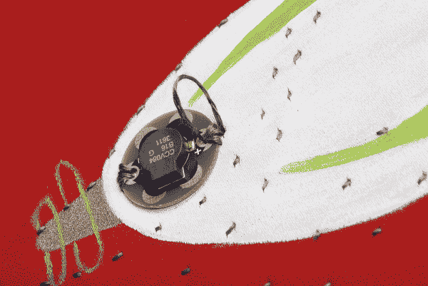](https://cdn.sparkfun.com/assets/5/9/8/3/f/51df2e8ace395fc828000000.JPG)

将电路翻转到背面。您可以看到 led 与引脚 5 和 6 之间的两条走线，它们需要交叉。剪一块毛毡或另一种厚织物，或者如果你喜欢，创建一个替代的桥-你只需要一些东西来隔离这个痕迹和以前的痕迹。

[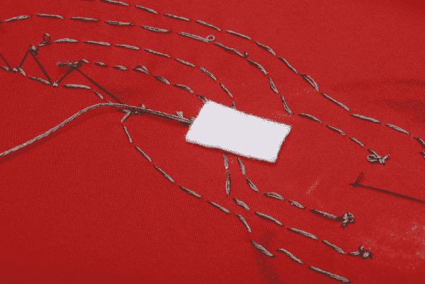](https://cdn.sparkfun.com/assets/8/d/9/9/d/51df2e8ace395fbf28000001.JPG)

如果你用的是毛毡，在纤维的顶层往另一面轻轻缝几针。现在，您已经安全地穿过了前面的针脚，您可以掀起毛毡来确认毛毡上的针脚没有完全穿过。

[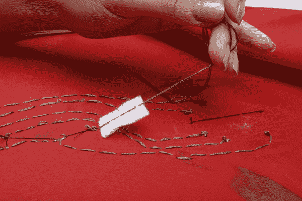](https://cdn.sparkfun.com/assets/9/1/8/2/d/51df2e8ace395f6028000001.JPG)

现在你可以完成跟踪，把它带到针 9，并钉住它。把你的线打结剪断。

就是这样！这些都是你的痕迹，所以你应该可以插上电池，打开开关，检查你的特效！如果你的电路不工作，你可以做一些事情。使用万用表再次检查所有连接是否牢固，并且没有任何短路(迹线接触不应该接触的地方)。)如果你没有万用表，目测一下这些痕迹。如果您的所有跟踪都是正确的，请尝试重新加载快速入门指南第一部分中的代码。应该可以了！享受你的新作品吧！

[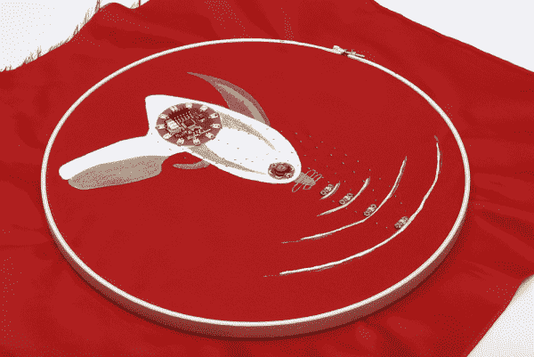](https://cdn.sparkfun.com/assets/1/f/5/a/f/51df2e8ace395f6a28000001.JPG)

## 资源和更进一步

你造了激光枪吗？或者你有自己的设计吗？厉害！如果你有兴趣了解更多关于电子纺织品的知识，请查看以下教程:

*   [LilyPad 设计套件实验 1:点亮一个基本电路](https://learn.sparkfun.com/tutorials/ldk-experiment-1-lighting-up-a-basic-circuit)——lily pad 设计套件系列的第一个实验。在这个练习中，你将学习一个基本的电子纺织品电路是如何工作的，并使用一个硬币电池座和导线点亮一个可缝合的 LED。
*   软电路:LED 感受披萨——在这里我们将学习如何表达你对披萨的感受。电动披萨。
*   [lily pad MP3 播放器入门](https://learn.sparkfun.com/tutorials/getting-started-with-the-lilypad-mp3-player)-lily pad MP3 播放器是一个令人惊叹的小主板，几乎包含了播放音频文件所需的一切。你可以用它来创建各种嘈杂的项目，从 MP3 帽衫到会说话的泰迪熊。你的想象力是唯一的极限！本教程将帮助你开始。
*   魔术师马里奥的魔法翻领花——来自才华横溢的[魔术师马里奥](http://www.mariothemagician.com/)的客座指导。一步一步的教程，把你自己的花和一个可怕的视频演示它的使用！

或者，如果你更倾向于 Arduino 和其他通用电子产品，请查看这些教程:

*   [脉宽调制](https://learn.sparkfun.com/tutorials/pulse-width-modulation) - PWM 是调光和脉冲 led 背后的魔法。
*   [串联和并联电路](https://learn.sparkfun.com/tutorials/series-and-parallel-circuits)——看完这篇教程，你能说出我们在这篇教程的 Raygun 例子中使用的是哪种类型的电路吗？
*   [如何阅读原理图](https://learn.sparkfun.com/tutorials/how-to-read-a-schematic)——学习如何破译原理图，甚至是[proto snap lily pad 开发简单板的](http://cdn.sparkfun.com/datasheets/E-Textiles/Lilypad/LilyPad-Dev-Simple-v12.pdf)。