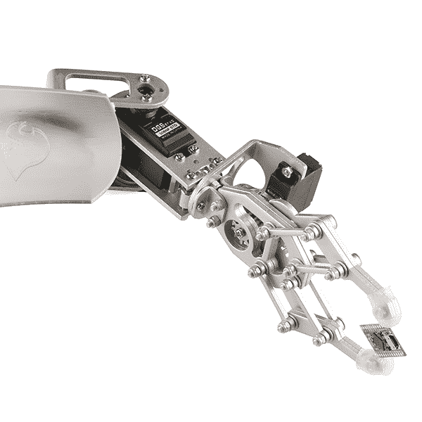
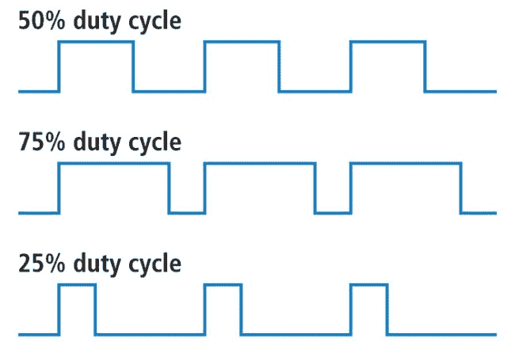
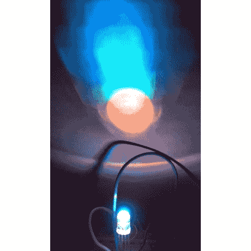
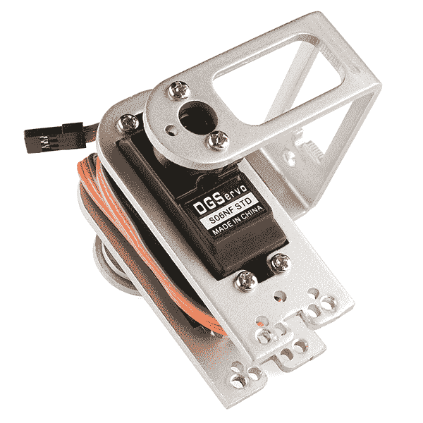

# 脉宽灯

> 原文：<https://learn.sparkfun.com/tutorials/pulse-width-modulation>

## 什么是脉宽调制？

[脉宽调制](http://en.wikipedia.org/wiki/Pulse-width_modulation) (PWM)是一个用来描述一种数字信号的花哨术语。脉宽调制用于各种应用中，包括复杂的控制电路。我们在 SparkFun 使用它们的一个常见方式是控制[RGB led](https://www.sparkfun.com/products/105)的调光或控制[伺服](https://www.sparkfun.com/servos)的方向。我们可以在这两种应用中实现一系列结果，因为脉宽调制允许我们以模拟方式改变信号处于高电平的时间。虽然信号在任何时候都只能为高电平(通常为 5V)或低电平(接地)，但我们可以改变信号在恒定时间间隔内为高电平和低电平的时间比例。

*Robotic claw controlled by a servo motor using pulse-width modulation*

### 推荐阅读

您可能首先考虑的一些背景教程:

*   [电压、电流、电阻和欧姆定律](http://learn.sparkfun.com/tutorials/voltage-current-resistance-and-ohms-law)
*   [模拟 vs 数字](https://learn.sparkfun.com/tutorials/analog-vs-digital)
*   [分压器](https://learn.sparkfun.com/tutorials/voltage-dividers)
*   [数字逻辑](https://learn.sparkfun.com/tutorials/digital-logic)

## 工作周期

当信号为高电平时，我们称之为“准时”。为了描述“准时”的数量，我们使用占空比的概念。占空比以百分比衡量。占空比百分比具体描述了数字信号在一个时间间隔或一段时间内开启的时间百分比。这个周期是波形频率的倒数。

如果一个数字信号一半时间开启，另一半时间关闭，我们可以说该数字信号的占空比为 50%，类似于理想方波。如果百分比高于 50%，数字信号处于高状态的时间比处于低状态的时间长，反之亦然，如果占空比低于 50%。下图说明了这三种情况:

*50%, 75%, and 25% Duty Cycle Examples*

100%占空比相当于将电压设置为 5 伏(高)。0%占空比与信号接地相同。

## 例子

您可以通过调整占空比来控制 LED 的亮度。

*PWM used to control LED brightness*

通过一个 [RGB(红绿蓝)LED](https://www.sparkfun.com/products/105) ，你可以通过调节三种颜色的亮度来控制它们在颜色组合中的比例。

*Basics of color mixing*

如果这三种光等量打开，结果将是不同亮度的白光。蓝色与绿色均匀混合将得到蓝绿色。作为稍微复杂一点的例子，试着把红色完全打开，绿色 50%占空比，蓝色完全关闭，得到橙色。

*PWM can be used to mix RGB color*

当控制 led 以获得适当的调光效果时，方波的频率确实需要足够高。在 1 Hz 时 20%占空比的波对你的眼睛来说会很明显，同时，在 100 Hz 或以上时 20%占空比的波看起来会比完全打开时更暗。本质上，如果你的目标是用 led 实现调光效果，这个周期不能太长。

你也可以使用脉冲宽度调制来控制伺服电机的角度，伺服电机连接在机械手臂上。伺服系统有一根轴，它根据控制线转到特定的位置。我们的[伺服电机](https://www.sparkfun.com/products/9347)有大约 180 度的范围。

频率/周期专用于控制特定的伺服系统。典型的伺服电机期望每 20 ms 更新一次，脉冲在 1 ms 和 2 ms 之间，或者换句话说，在 50 Hz 波形上，占空比在 5%和 10%之间。使用 1.5 毫秒的脉冲，伺服电机将处于自然的 90 度位置。对于 1 毫秒的脉冲，伺服将处于 0 度位置，而对于 2 毫秒的脉冲，伺服将处于 180 度位置。通过用一个介于两者之间的值来更新伺服，可以获得整个运动范围。

*PWM used to hold a servo motor at 90 degrees relative to its bracket*

## 资源和更进一步

脉宽调制用于各种应用中，特别是用于控制。你已经知道它可以用于 led 的调光和控制伺服电机的角度，现在你可以开始探索其他可能的用途。如果你感到迷茫，可以随意查看一下 [SparkFun Inventor 的工具包](https://www.sparkfun.com/products/11227)，里面有使用脉宽调制的例子。如果你准备好立即投入编码并拥有一个 Arduino，请看这里的 [PWM 编码示例](http://arduino.cc/en/Reference/AnalogWrite)。

请随意继续探索:

*   [电机并选择合适的一个](https://learn.sparkfun.com/tutorials/motors-and-selecting-the-right-one)
*   [什么是 Arduino](https://learn.sparkfun.com/tutorials/what-is-an-arduino)
*   [模数转换](https://learn.sparkfun.com/tutorials/analog-to-digital-conversion)
*   [灯](https://learn.sparkfun.com/tutorials/light)
*   [发光二极管](https://learn.sparkfun.com/tutorials/light-emitting-diodes-leds)
*   [红外通信](https://learn.sparkfun.com/tutorials/ir-communication)
*   [交互式悬挂 LED 阵列](https://learn.sparkfun.com/tutorials/interactive-hanging-led-array)

## 有兴趣学习更多基础主题吗？

查看我们的 **[工程要点](https://www.sparkfun.com/engineering_essentials)** 页面，了解电气工程相关基础主题的完整列表。

带我去那里！

