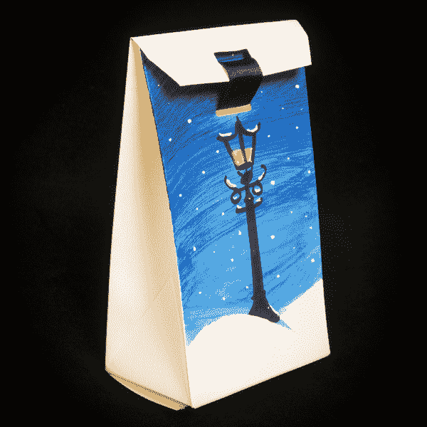

# 快速照明箱

> 原文：<https://learn.sparkfun.com/tutorials/quick-illuminated-boxes>

## 工艺

这个假期我要去一个饼干交易所，我花了一点时间考虑如何在不倾家荡产的情况下给我的盒子添加电子产品。我选定了一个快速而肮脏的方法，我想我应该分享一下。我用这个技巧制作饼干盒，但它也可以制作漂亮的婚礼礼品盒，礼品盒，甚至是 tealight 走道灯的安全替代品！

我买了普通的盒子，但我见过激光切割的盒子，从内部照亮会看起来很漂亮！

你需要盒子或袋子，还有胶带和小刀。下面的愿望清单是我用来做 10 个盒子的零件。你可以修改这些数字来适应你的目的，你需要一个每箱的零件。你也可以使用任何你喜欢的 LED 颜色！