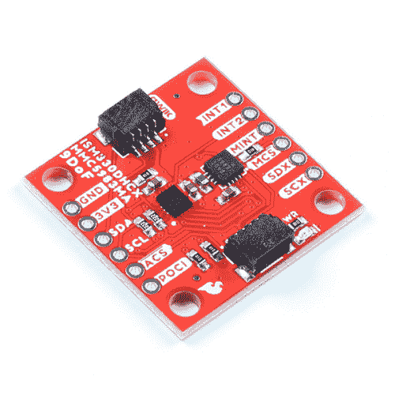

# Qwiic 9DoF - ISM330DHCX，MMC5983MA 连接指南

> 原文：<https://learn.sparkfun.com/tutorials/qwiic-9dof---ism330dhcx-mmc5983ma-hookup-guide>

## 介绍

[spark fun Qwiic 9 DOF-ism 330 dhcx，MMC5983MA](https://www.sparkfun.com/products/19895) 将意法半导体的高性能 ISM330DHCX 3D 数字加速度计和陀螺仪与 MEMSIC 的高灵敏度三轴磁力计相结合，为您提供一款功能超强、易于使用的 qw IIC 分线板。

ISM330DHCX 具有 2/ 4/ 8/ 16 g 的满量程加速度范围和 125/ 250/ 500/ 1000/ 2000/ 4000 dps 的宽角速率范围，以及一组无与伦比的嵌入式功能(机器学习内核、可编程 FSM、FIFO、传感器集线器、事件解码和中断)，能够以极低的功耗提供高性能。此外，MMC5983MA 可以测量 8 高斯(G)满量程范围内的磁场，在 16 位/18 位工作模式下，分辨率为 0.25mG/0.0625mG/LSB，总均方根噪声水平为 0.4 mG，在一个小小的分线板上有 9 个自由度。

 

将**添加到您的[购物车](https://www.sparkfun.com/cart)中！**

### 

[In stock](https://learn.sparkfun.com/static/bubbles/ "in stock") SEN-19895

SparkFun 9DoF IMU 突破将高性能 6DoF IMU 与高灵敏度三轴磁力计结合在一起

$39.951[Favorited Favorite](# "Add to favorites") 6[Wish List](# "Add to wish list")** **[https://www.youtube.com/embed/cGvDd7Nna3E/?autohide=1&border=0&wmode=opaque&enablejsapi=1](https://www.youtube.com/embed/cGvDd7Nna3E/?autohide=1&border=0&wmode=opaque&enablejsapi=1)

### 所需材料

要跟随本教程，您将需要以下材料。你可能不需要所有的东西，这取决于你拥有什么。将它添加到您的购物车，通读指南，并根据需要调整购物车。**