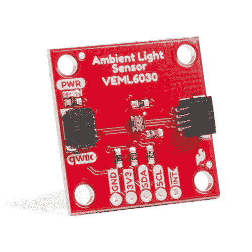

# Qwiic 环境光线传感器(VEML6030)连接指南

> 原文：<https://learn.sparkfun.com/tutorials/qwiic-ambient-light-sensor-veml6030-hookup-guide>

## 介绍

[SparkFun 环境光线传感器(VEML6030)](https://www.sparkfun.com/products/15436) 是一款支持 I C 的环境光线传感器，具有高灵敏度和高精度。它可以读取以勒克斯为单位的环境光，并拥有许多优秀的功能，包括:为可选中断设置高阈值和低阈值的能力，支持个位数微安电流消耗的省电功能，以及从 0 到 120，000 勒克斯的可读范围。我们还编写了一个 Arduino 库，它提供了对所有特性的完全访问，并包含了展示其所有能力的示例代码。跟着来，让我们了解它的所有特性以及如何使用它们！

 

将**添加到您的[购物车](https://www.sparkfun.com/cart)中！**

### 

[Out of stock](https://learn.sparkfun.com/static/bubbles/ "out of stock") SEN-15436

VEML6030 是一款高精度环境光传感器，具有 16 位分辨率。更令人印象深刻的是，它可以探测光线…

$5.95[Favorited Favorite](# "Add to favorites") 13[Wish List](# "Add to wish list")** **[https://www.youtube.com/embed/z06t8706o98/?autohide=1&border=0&wmode=opaque&enablejsapi=1](https://www.youtube.com/embed/z06t8706o98/?autohide=1&border=0&wmode=opaque&enablejsapi=1)

### 所需材料

为了理解本教程中使用的示例代码，您还需要以下材料。你可能不需要所有的东西，这取决于你拥有什么。将它添加到您的购物车，通读指南，并根据需要调整购物车。**