# Qwiic 载板连接指南

> 原文：<https://learn.sparkfun.com/tutorials/qwiic-carrier-board-hookup-guide>

## 介绍

MicroMod Qwiic 载板可用于快速制作其他 Qwiic 器件的原型；它有[单](https://www.sparkfun.com/products/17723)或[双](https://www.sparkfun.com/products/17724)安装配置。就像其他的[微电机载板](https://www.sparkfun.com/categories/tags/carrier-board)一样，用户可以自由开发自己选择的[微电机处理器板](https://www.sparkfun.com/categories/tags/processor-board)。

[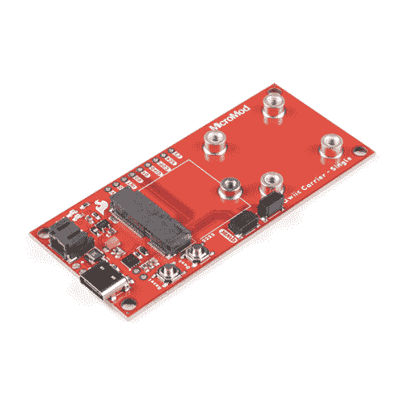](https://www.sparkfun.com/products/17723) 

将**添加到您的[购物车](https://www.sparkfun.com/cart)中！**

### [SparkFun MicroMod Qwiic 载板-单个](https://www.sparkfun.com/products/17723)

[30 available](https://learn.sparkfun.com/static/bubbles/ "30 available") DEV-17723

单个 MicroMod Qwiic 载板可用于快速制作其他 qw IC 器件的原型。

$9.95[Favorited Favorite](# "Add to favorites") 3[Wish List](# "Add to wish list")****[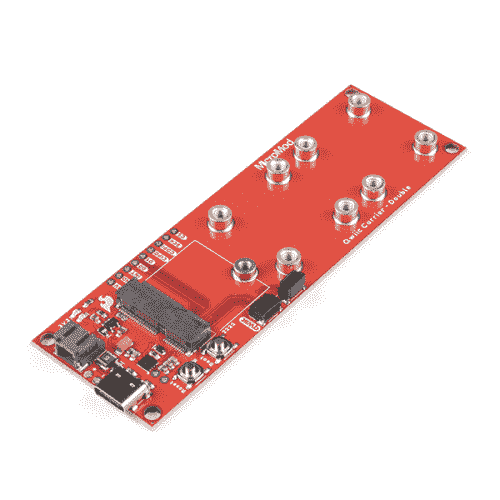](https://www.sparkfun.com/products/17724) 

将**添加到您的[购物车](https://www.sparkfun.com/cart)中！**

### [SparkFun MicroMod Qwiic 载板-双](https://www.sparkfun.com/products/17724)

[In stock](https://learn.sparkfun.com/static/bubbles/ "in stock") DEV-17724

双 MicroMod Qwiic 载板可用于快速制作其他 qw IC 器件的原型。

$11.95[Favorited Favorite](# "Add to favorites") 1[Wish List](# "Add to wish list")**** ****如需快速浏览，请查看我们展示 MicroMod Qwiic 载板的产品视频:

[https://www.youtube.com/embed/9snKiVXC5Vc/?autohide=1&border=0&wmode=opaque&enablejsapi=1](https://www.youtube.com/embed/9snKiVXC5Vc/?autohide=1&border=0&wmode=opaque&enablejsapi=1)

### 所需材料

开始时，用户需要下面列出的一些项目。*(你可能已经拥有了其中的一些物品；通读指南，并相应地修改您的购物车。)*

#### MicroMod 处理器板

与其他[微模块载板](https://www.sparkfun.com/categories/tags/carrier-board)一样，产品运行需要一个[处理器板](https://www.sparkfun.com/categories/tags/processor-board)。用户需要一个处理器板*(自选)*来连接 [MicroMod M.2 连接器](https://www.sparkfun.com/products/16549)；*因为，本产品*不包含一个。以下是几个选项:

[](https://www.sparkfun.com/products/16401) 

将**添加到您的[购物车](https://www.sparkfun.com/cart)中！**

### [SparkFun MicroMod Artemis 处理器](https://www.sparkfun.com/products/16401)

[24 available](https://learn.sparkfun.com/static/bubbles/ "24 available") DEV-16401

该处理器具有 Artemis 模块，能够进行机器学习、蓝牙、I2C、GPIO、PWM、SPI，并打包以适应…

$14.95[Favorited Favorite](# "Add to favorites") 14[Wish List](# "Add to wish list")****[](https://www.sparkfun.com/products/16791) 

将**添加到您的[购物车](https://www.sparkfun.com/cart)中！**

### [SparkFun MicroMod SAMD51 处理器](https://www.sparkfun.com/products/16791)

[Out of stock](https://learn.sparkfun.com/static/bubbles/ "out of stock") DEV-16791

SparkFun MicroMod SAMD51 处理器板采用 32 位 ARM Cortex-M4F MCU，是一款功能强大的微控制器，封装在一个

$18.951[Favorited Favorite](# "Add to favorites") 8[Wish List](# "Add to wish list")****[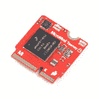](https://www.sparkfun.com/products/18771) 

将**添加到您的[购物车](https://www.sparkfun.com/cart)中！**

### [带版权保护的 SparkFun MicroMod Teensy 处理器](https://www.sparkfun.com/products/18771)

[In stock](https://learn.sparkfun.com/static/bubbles/ "in stock") DEV-18771

这种防复制板利用恩智浦 iMXRT1062 芯片(ARM Cortex-M7)的强大计算能力，并将其与

$24.95[Favorited Favorite](# "Add to favorites") 1[Wish List](# "Add to wish list")****[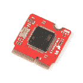](https://www.sparkfun.com/products/21326) 

将**添加到您的[购物车](https://www.sparkfun.com/cart)中！**

### [SparkFun MicroMod STM32 处理器](https://www.sparkfun.com/products/21326)

[In stock](https://learn.sparkfun.com/static/bubbles/ "in stock") DEV-21326

SparkFun MicroMod STM32 处理器板已经准备好用其 ARM Cortex -M4 32 位 RISC 内核震撼您的 MicroMod 世界！

$16.50[Favorited Favorite](# "Add to favorites") 0[Wish List](# "Add to wish list")******** ********#### 所需硬件

将处理器板固定在载板上需要十字螺丝刀。此外，需要 USB-C 电缆将载板连接到计算机。

[](https://www.sparkfun.com/products/14743) 

将**添加到您的[购物车](https://www.sparkfun.com/cart)中！**

### [USB 3.1 线 A 到 C - 3 脚](https://www.sparkfun.com/products/14743)

[In stock](https://learn.sparkfun.com/static/bubbles/ "in stock") CAB-14743

USB C 棒极了。但是，在我们将所有的集线器、充电器和端口转换为 USB C 之前，这是您要使用的电缆…

$5.504[Favorited Favorite](# "Add to favorites") 9[Wish List](# "Add to wish list")****[](https://www.sparkfun.com/products/9146) 

将**添加到您的[购物车](https://www.sparkfun.com/cart)中！**

### [SparkFun 迷你螺丝刀](https://www.sparkfun.com/products/9146)

[In stock](https://learn.sparkfun.com/static/bubbles/ "in stock") TOL-09146

这只是你的基本可逆螺丝刀口袋大小！有平头和十字头可供选择。配有别针和…

$1.053[Favorited Favorite](# "Add to favorites") 11[Wish List](# "Add to wish list")**** ****#### 可选硬件

要为您的 MicroMod 项目连接 qw IC 分线板，需要[qw IC 电缆](https://www.sparkfun.com/categories/tags/qwiic-cables)。用户也可以用 **4-40** 螺丝固定 Qwiic 设备，或者用支架将它们堆叠起来。

[](https://www.sparkfun.com/products/15081) 

将**添加到您的[购物车](https://www.sparkfun.com/cart)中！**

### [SparkFun Qwiic 线缆套件](https://www.sparkfun.com/products/15081)

[In stock](https://learn.sparkfun.com/static/bubbles/ "in stock") KIT-15081

为了更容易上手，我们用 50 毫米到 500 毫米的各种 Qwiic 电缆组装了 Qwiic 电缆套件…

$8.9516[Favorited Favorite](# "Add to favorites") 58[Wish List](# "Add to wish list")****[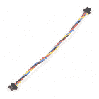](https://www.sparkfun.com/products/17259) 

将**添加到您的[购物车](https://www.sparkfun.com/cart)中！**

### [柔性 Qwiic 线缆- 100mm](https://www.sparkfun.com/products/17259)

[In stock](https://learn.sparkfun.com/static/bubbles/ "in stock") PRT-17259

这种极化 I2C 电缆绝缘是由硅制成的，比我们原来的 Qwiic 电缆更灵活，特别是在

$1.60[Favorited Favorite](# "Add to favorites") 8[Wish List](# "Add to wish list")****[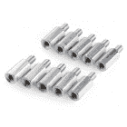](https://www.sparkfun.com/products/10463) 

将**添加到您的[购物车](https://www.sparkfun.com/cart)中！**

### [支座-金属六角(4-40；3/8";10 只装)](https://www.sparkfun.com/products/10463)

[In stock](https://learn.sparkfun.com/static/bubbles/ "in stock") PRT-10463

金属六角公/母支座。#4-40 螺纹，带 3/8”柄和 3/16”螺纹长度。可堆叠成任意长度。…

$4.50[Favorited Favorite](# "Add to favorites") 7[Wish List](# "Add to wish list")****[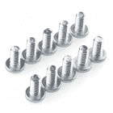](https://www.sparkfun.com/products/10453) 

将**添加到您的[购物车](https://www.sparkfun.com/cart)中！**

### [【十字螺丝头(1/4”，4-40，10 个装)](https://www.sparkfun.com/products/10453)

[In stock](https://learn.sparkfun.com/static/bubbles/ "in stock") PRT-10453

有你的标准飞利浦头 4-40 螺丝。它们有 1/4 英寸长，10 个一包。这是我们使用的螺丝尺寸…

$1.60[Favorited Favorite](# "Add to favorites") 10[Wish List](# "Add to wish list")******** ********一个[单芯锂离子电池](https://www.sparkfun.com/categories/tags/lithium-polymer)可以连接到 Qwiic 载板，以实现便携性。

[](https://www.sparkfun.com/products/13813) 

将**添加到您的[购物车](https://www.sparkfun.com/cart)中！**

### [锂离子电池-1Ah](https://www.sparkfun.com/products/13813)

[In stock](https://learn.sparkfun.com/static/bubbles/ "in stock") PRT-13813

基于锂离子化学的超薄超轻电池。每个电池在 1000 毫安时输出 3.7V 的标称电压！

$10.958[Favorited Favorite](# "Add to favorites") 75[Wish List](# "Add to wish list")****[](https://www.sparkfun.com/products/13851) 

将**添加到您的[购物车](https://www.sparkfun.com/cart)中！**

### [锂离子电池- 400mAh](https://www.sparkfun.com/products/13851)

[In stock](https://learn.sparkfun.com/static/bubbles/ "in stock") PRT-13851

这是一种基于锂离子化学的非常小、非常轻的电池，具有目前最高的能量密度…

$5.5010[Favorited Favorite](# "Add to favorites") 41[Wish List](# "Add to wish list")****[](https://www.sparkfun.com/products/13855) 

将**添加到您的[购物车](https://www.sparkfun.com/cart)中！**

### [锂离子电池- 2Ah](https://www.sparkfun.com/products/13855)

[In stock](https://learn.sparkfun.com/static/bubbles/ "in stock") PRT-13855

这是基于锂离子化学的非常薄、非常轻的电池。每个电池在 200 伏时输出一个标称的 3.7 伏电压…

$13.959[Favorited Favorite](# "Add to favorites") 43[Wish List](# "Add to wish list")****[](https://www.sparkfun.com/products/13853) 

将**添加到您的[购物车](https://www.sparkfun.com/cart)中！**

### [锂离子电池- 110mAh](https://www.sparkfun.com/products/13853)

[In stock](https://learn.sparkfun.com/static/bubbles/ "in stock") PRT-13853

这是一种基于锂离子化学的非常小、非常轻的电池。这是最高的能量密度电流…

$5.503[Favorited Favorite](# "Add to favorites") 22[Wish List](# "Add to wish list")******** ********为了修改跳线，用户将需要[焊接设备](https://www.sparkfun.com/categories/49)和/或[刀](https://www.sparkfun.com/categories/379)。

[](https://www.sparkfun.com/products/14228) 

### [威勒 WLC100 焊台](https://www.sparkfun.com/products/14228)

[Out of stock](https://learn.sparkfun.com/static/bubbles/ "out of stock") TOL-14228

Weller 的 WLC100 是一款多功能的 5 瓦至 40 瓦焊台，非常适合业余爱好者、DIY 爱好者和学生。…

2[Favorited Favorite](# "Add to favorites") 17[Wish List](# "Add to wish list")[](https://www.sparkfun.com/products/9325) 

将**添加到您的[购物车](https://www.sparkfun.com/cart)中！**

### [无铅焊料- 100 克线轴](https://www.sparkfun.com/products/9325)

[In stock](https://learn.sparkfun.com/static/bubbles/ "in stock") TOL-09325

这是带有水溶性树脂芯的无铅焊料的基本线轴。0.031 英寸规格，100 克。这是一个好主意…

$9.957[Favorited Favorite](# "Add to favorites") 33[Wish List](# "Add to wish list")****[](https://www.sparkfun.com/products/14579) 

将**添加到您的[购物车](https://www.sparkfun.com/cart)中！**

### [芯片快克免清洗助焊剂笔- 10mL](https://www.sparkfun.com/products/14579)

[In stock](https://learn.sparkfun.com/static/bubbles/ "in stock") TOL-14579

这款来自 Chip Quik 的 10 毫升免清洗助焊剂笔非常适合您的所有焊接、脱焊、返工和回流目的！

$8.954[Favorited Favorite](# "Add to favorites") 36[Wish List](# "Add to wish list")****[](https://www.sparkfun.com/products/9200) 

将**添加到您的[购物车](https://www.sparkfun.com/cart)中！**

### [爱好刀](https://www.sparkfun.com/products/9200)

[In stock](https://learn.sparkfun.com/static/bubbles/ "in stock") TOL-09200

就像一把 Xacto 刀，只是更好。我们在处理多氯联苯时广泛使用这些技术。这些小刀子很适合切割…

$3.502[Favorited Favorite](# "Add to favorites") 18[Wish List](# "Add to wish list")****** ******### 推荐阅读

[MicroMod 生态系统](https://www.sparkfun.com/micromod)是一种独特的方式，允许用户根据自己的需求定制他们的项目。 [Qwiic 连接系统](https://www.sparkfun.com/qwiic)是与 I ² C 设备接口的简单方法。单击下面的横幅，了解每个系统的更多信息。

[](https://www.sparkfun.com/micromod)

[https://www.youtube.com/embed/4QUJWeSrzD0/?autohide=1&border=0&wmode=opaque&enablejsapi=1](https://www.youtube.com/embed/4QUJWeSrzD0/?autohide=1&border=0&wmode=opaque&enablejsapi=1)

[](https://www.sparkfun.com/qwiic)

[https://www.youtube.com/embed/x0RDEHqFIF8/?autohide=1&border=0&wmode=opaque&enablejsapi=1](https://www.youtube.com/embed/x0RDEHqFIF8/?autohide=1&border=0&wmode=opaque&enablejsapi=1)

对于不熟悉以下概念的用户，我们也建议在继续之前阅读以下教程。

[](https://learn.sparkfun.com/tutorials/serial-communication) [### 串行通信](https://learn.sparkfun.com/tutorials/serial-communication) Asynchronous serial communication concepts: packets, signal levels, baud rates, UARTs and more 100[](https://learn.sparkfun.com/tutorials/i2c) [### I2C](https://learn.sparkfun.com/tutorials/i2c) An introduction to I2C, one of the main embedded communications protocols in use today.[Favorited Favorite](# "Add to favorites") 128[](https://learn.sparkfun.com/tutorials/getting-started-with-micromod) [### MicroMod 入门](https://learn.sparkfun.com/tutorials/getting-started-with-micromod) Dive into the world of MicroMod - a compact interface to connect a microcontroller to various peripherals via the M.2 Connector 3[](https://learn.sparkfun.com/tutorials/designing-with-micromod) [### 用 MicroMod 设计](https://learn.sparkfun.com/tutorials/designing-with-micromod) This tutorial will walk you through the specs of the MicroMod processor and carrier board as well as the basics of incorporating the MicroMod form factor into your own PCB designs 0[](https://learn.sparkfun.com/tutorials/installing-an-arduino-library) [### 安装 Arduino 库](https://learn.sparkfun.com/tutorials/installing-an-arduino-library) How do I install a custom Arduino library? It's easy! This tutorial will go over how to install an Arduino library using the Arduino Library Manager. For libraries not linked with the Arduino IDE, we will also go over manually installing an Arduino library.[Favorited Favorite](# "Add to favorites") 22[](https://learn.sparkfun.com/tutorials/installing-arduino-ide) [### 安装 Arduino IDE](https://learn.sparkfun.com/tutorials/installing-arduino-ide) A step-by-step guide to installing and testing the Arduino software on Windows, Mac, and Linux.[Favorited Favorite](# "Add to favorites") 16[](https://learn.sparkfun.com/tutorials/installing-board-definitions-in-the-arduino-ide) [### 在 Arduino IDE 中安装电路板定义](https://learn.sparkfun.com/tutorials/installing-board-definitions-in-the-arduino-ide) How do I install a custom Arduino board/core? It's easy! This tutorial will go over how to install an Arduino board definition using the Arduino Board Manager. We will also go over manually installing third-party cores, such as the board definitions required for many of the SparkFun development boards.[Favorited Favorite](# "Add to favorites") 3

## 硬件概述

本节将介绍 MicroMod Qwiic 载板上的各种硬件元件和焊接跳线。它还将回顾 M.2 连接器的连接，以及它如何与 MicroMod 处理器接口。

### 电路板尺寸

Qwiic 载板尺寸为:

*   **单个:** 3.15 英寸 x 1.40 英寸(80.00 毫米 x 35.56mm 毫米)
*   **双:** 4.10 英寸 x 1.40 英寸(109.22 毫米 x 35.56mm 毫米)

[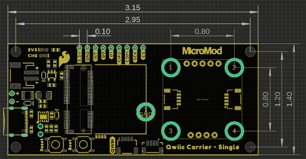](https://cdn.sparkfun.com/assets/learn_tutorials/1/5/9/6/dimensions_single.PNG)[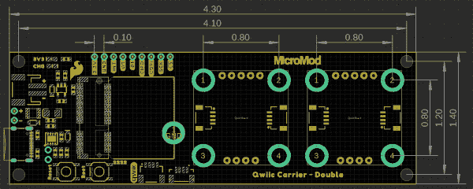](https://cdn.sparkfun.com/assets/learn_tutorials/1/5/9/6/dimensions_double.PNG)*Dimensions of the MicroMod Qwiic Carrier Board. (Click to enlarge)*

这些板还包括用于标准 [4-40 螺钉](https://www.sparkfun.com/products/10453)的安装孔和插件。插入件被布置成安装、附着和/或堆叠兼容(1 英寸×1 英寸)的 Qwiic 板。

[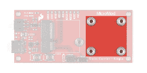](https://cdn.sparkfun.com/assets/learn_tutorials/1/5/9/6/mount_single.jpg)[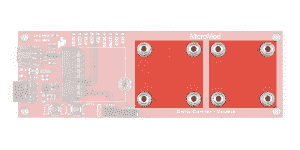](https://cdn.sparkfun.com/assets/learn_tutorials/1/5/9/6/mount_double.jpg)*Mounting areas on the MicroMod Qwiic Carrier Board to attach Qwiic devices. (Click to enlarge)*

### 通用组件

大多数 SparkFun MicroMod 载板都有一些通用组件，所有 MicroMod 载板都有用于处理器板的键控 M.2 MicroMod 连接器。下面的照片和列表概述了 Qwiic 载板和其他 MicroMod 载板之间的常见组件。

*   **M.2 MicroMod 连接器** -这种特殊的键控 M.2 连接器让您可以将您选择的 MicroMod 处理器安装到 Qwiic 载板。
*   **USB-C 连接器** -连接到您的计算机，对您的处理器进行编程，并为主板供电。
*   **3.3V 调节器** -提供调节后的 **3.3V** 和高达 **1A** 的电源。
*   **qw IC 连接器** -标准 qw IC 连接器，用于为您的 MicroMod 项目连接其他 qw IC 设备。
*   **启动/复位按钮** -按下按钮进入处理器的启动模式，并复位您的微模块电路。

[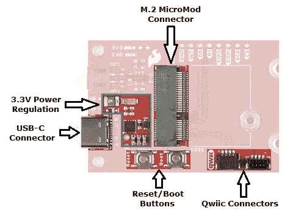](https://cdn.sparkfun.com/assets/learn_tutorials/1/5/9/6/common_components_labeled.jpg)*Common MicroMod components featured on the MicroMod Qwiic Carrier Board. (Click to enlarge)*

### 蓄电池充电器

该板还有一个 MCP73831 单节锂离子/锂聚合物充电 IC，因此您可以为连接的单节 LiPo 电池充电。充电 IC 从 USB 连接接收电源，可提供高达 450mA 的电流为连接的电池充电。

[](https://cdn.sparkfun.com/assets/learn_tutorials/1/5/9/6/charging_circuit.jpg)*Batery charger for the MicroMod Qwiic Carrier Board. (Click to enlarge)*

### 状态指示灯

载板有两个状态指示灯:

*   **PWR** -该 LED 指示电路板顶部何时有 3.3V 电源可用。
*   **CHG** -该 LED 指示充电电路运行的状态。

[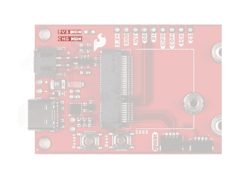](https://cdn.sparkfun.com/assets/learn_tutorials/1/5/9/6/status_LEDs.jpg)*Status LEDs on the MicroMod Qwiic Carrier Board. (Click to enlarge)*

### 焊料跳线

Users who have never worked with soldering jumpers and cutting PCB traces before (or for a quick refresher), check out our [How to Work with Solder Jumpers and PCB Traces](https://learn.sparkfun.com/tutorials/how-to-work-with-jumper-pads-and-pcb-traces) tutorial for detailed instructions and tips.

MicroMod Qwiic 载板上有四个可调的焊接跳线，分别标为 **MEAS** 、 **BYP** 、 **3.3V_VE** 和 **3.3V** 。下表简要概述了它们的功能:

| 跳线名称/标签 | 描述 | 默认状态 |
| 测量值 | 打开该跳线以探测调节器的 **3.3V** 输出端的电流消耗。为了帮助测量电流，看看我们的[如何使用万用表](https://learn.sparkfun.com/tutorials/how-to-use-a-multimeter#measuring-current)教程。 | 关闭的 |
| 旁路/BYP | “保险丝中的硬币”跳线。绕过 **6V/2A** 保险丝，并将 VIN 和 V_USB 连接在一起。**只有当你知道自己在做什么的时候才关门！** | 打开 |
| 电压调节器使能/VE | 电压调节器控制。闭合此跳线以控制低功率应用中的 VREG。 | 打开 |
| 3.3V LED 电源/3V3 LED | 通过 **1K 欧姆**电阻器将 3.3V LED 连接到 **3.3V** 。打开以禁用 LED。 | 关闭的 |

[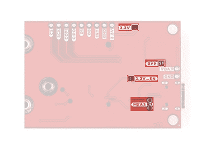](https://cdn.sparkfun.com/assets/learn_tutorials/1/5/9/6/jumpers.jpg)*Jumpers on the MicroMod Qwiic carrier board. (Click to enlarge)*

### 微型引脚排列

由于该载板设计用于所有的 MicroMod 处理器，我们在下表中列出了使用的引脚，因此，如果您愿意，您可以将它们与各自连接指南中的引脚表进行比较。

*   [Qwiic 载板引脚表](#QwiicCB)
*   [微模块通用引脚表](#MMGen)
*   [MicroMod 通用引脚描述](#MMDescript)

| **音频** | **UART** | **GPIO/总线** | **I ² C** | **SDIO** 的缩写形式 | **SPI** | **专用** |

| 功能 | 底部
销 | 顶部
销 | 功能 |
|  |  |  | (未连接) |  | **75** | GND |  |  |  |
|  |  |  | 3.3V | **74** | **73** | G5 /总线 5 |  |  |  |
|  |  |  | RTC _ 3V _ 电池 | **72** | **71** | G6 /总线 6 |  |  |  |
|  |  | SPI_CS1# | SDIO _ 数据 3(输入输出) | **70** | **69** | G7 /总线 7 |  |  |  |
|  |  |  | SDIO _ 数据 2(输入输出) | **68** | **67** | 八国集团(Group of Eight) |  |  |  |
|  |  |  | SDIO _ 数据 1(输入输出) | **66** | **65** | G9 | ADC_D- | CAM_HSYNC |  |
|  |  | 睡吧 | SDIO _ 数据 0(输入输出) | **64** | **63** | G10 | ADC_D+ | CAM_VSYNC |  |
|  |  | SPI COPI1 | SDIO_CMD (I/O) | **62** | **61** | 睡吧 |  |  |  |
|  |  | SPI SCK1 | SDIO_SCK(或) | **60** | **59** | SPI_COPI (O) | LED_DAT |  |  |
|  |  |  | AUD_MCLK (O) | **58** | **57** | SPI_SCK(或) | LED |  |  |
| 凯姆 | PCM_OUT | I2S 出局 | AUD_OUT | **56** | **55** | SPI_CS# |  |  |  |
| cam _ pclk | PCM_IN | I2S 因 | 澳元 _ 美元 | **54** | **53** | I2C_SCL1(输入/输出) |  |  |  |
| PDM_DATA | PCM_SYNC | i2s WS | AUD_LRCLK | **52** | **51** | I2C_SDA1(输入输出) |  |  |  |
| PDM_CLK | PCM_CLK | SCK i2s | 奥德 _BCLK | **50** | **49** | BATT_VIN / 3 (I - ADC) (0 至 3.3V) |  |  |  |
|  |  |  | G4 /总线 4 | **48** | **47** | PWM1 |  |  |  |
|  |  |  | G3 /总线 3 | **46** | **45** | GND |  |  |  |
|  |  |  | G2 /总线 2 | **44** | **43** | CAN_TX |  |  |  |
|  |  |  | G1 /巴士 1 | **42** | **41** | CAN_RX |  |  |  |
|  |  |  | G0 /总线 0 | **40** | **39** | GND |  |  |  |
|  |  |  | 一流的 | **38** | **37** | USBHOST_D- |  |  |  |
|  |  |  | GND | **36** | **35** | USBHOST_D+ |  |  |  |
|  |  |  | A0 | **34** | **33** | GND |  |  |  |
|  |  |  | PWM0 | **32** | **31** | 模块密钥 |  |  |  |
|  |  |  | 模块密钥 | **30** | **29** | 模块密钥 |  |  |  |
|  |  |  | 模块密钥 | **28** | **27** | 模块密钥 |  |  |  |
|  |  |  | 模块密钥 | **26** | **25** | 模块密钥 |  |  |  |
|  |  |  | 模块密钥 | **24** | **23** | SWDIO |  |  |  |
|  |  |  | UART_TX2 (O) | **22** | **21** | SWDCK |  |  |  |
|  |  |  | UART_RX2 (I) | **20** | **19** | UART_RX1 (I) |  |  |  |
|  |  | CAM_TRIG | D1 | **18** | **17** | UART_TX1 (0) |  |  |  |
|  |  |  | I2C INT # | **16** | **15** | UART_CTS1 (I) |  |  |  |
|  |  |  | S7-1200 可编程控制器 | **14** | **13** | UART_RTS1 (O) |  |  |  |
|  |  |  | I2C SDA(输入/输出) | **12** | **11** | 行李箱(I 型开式排放) |  |  |  |
|  |  |  | D0 | **10** | **9** | USB_VIN |  |  |  |
|  |  | 浅部白色甲癣 | G11 | **8** | **7** | GND |  |  |  |
|  |  |  | 复位# (I -开漏) | **6** | **5** | USB_D- |  |  |  |
|  |  |  | 3.3V_EN | **4** | **3** | USB_D+ |  |  |  |
|  |  |  | 3.3V | **2** | **1** | GND |  |  |  |

| 信号群 | 信号 | 输入－输出 | 描述 | 电压 |
| 力量 | 3.3V | 我 | 3.3V 电源 | 3.3V |
| GND |  | 返回电流路径 | 0V |
| USB_VIN | 我 | USB VIN 符合 USB 2.0 规范。
连接到处理器板上需要 5V 电压才能实现 USB 功能的引脚。 | 4.8-5.2V |
| RTC _ 3V _ 电池 | 我 | 3V 由外部纽扣电池或迷你电池提供。最大功耗= 100μa。
连接到引脚，在掉电期间保持 RTC。可以左 NC。 | 3V |
| 3.3V_EN | O | 控制载板的主电压调节器。1V 以上的电压将启用 3.3V 电源路径。 | 3.3V |
| BATT_VIN/3 | 我 | 载板原始电压超过 3。1/3 电阻分压器在载板上实现。
放大整个 0-3.3V 范围所需的模拟信号 | 3.3V |
| 重置 | 重置 | 我 | 处理器的输入。处理器板上带上拉电阻的开漏。拉低复位处理器。 | 3.3V |
| 靴子 | 我 | 处理器的输入。处理器板上带上拉电阻的开漏。拉低使处理器进入特殊启动模式。可以左 NC。 | 3.3V |
| 通用串行总线 | USB_D | 输入－输出 | USB 数据。符合 USB 2.0 规范的差分串行数据接口。如果编程需要 UART，USB 必须连接到处理器板上的 USB 转串行转换 IC。 |  |
| USB 主机 | USBHOST_D | 输入－输出 | 对于支持 USB 主机模式的处理器。USB 数据。符合 USB 2.0 规范的差分串行数据接口。可以左 NC。 |  |
| 能 | CAN_RX | 我 | CAN 总线接收数据。 | 3.3V |
| CAN_TX | O | CAN 总线传输数据。 | 3.3V |
| 通用非同步收发传输器(Universal Asynchronous Receiver/Transmitter) | UART_RX1 | 我 | UART 接收数据。 | 3.3V |
| UART_TX1 | O | UART 发送数据。 | 3.3V |
| UART_RTS1 | O | UART 请求发送。 | 3.3V |
| UART_CTS1 | 我 | UART 清零发送。 | 3.3V |
| UART_RX2 | 我 | 第二个 UART 接收数据。 | 3.3V |
| UART_TX2 | O | 第二个 UART 发送数据。 | 3.3V |
| I2C | i2c _ scl | 输入－输出 | I ² C 时钟。载板上拉的开漏。 | 3.3V |
| I2C SDA | 输入－输出 | I ² C 数据。载板上有上拉电阻的开漏 | 3.3V |
| I2C INT # | 我 | 从载板到处理器的中断通知。载板上拉的开漏。低电平有效 | 3.3V |
| I2C_SCL1 号文件 | 输入－输出 | 2nd I ² C 时钟。载板上拉的开漏。 | 3.3V |
| I2C sda 1 | 输入－输出 | 2nd I ² C 数据。载板上拉的开漏。 | 3.3V |
| 精力 | SPI_COPI | O | SPI 控制器输出/外设输入。 | 3.3V |
| 睡吧，婊子 | 我 | SPI 控制器输入/外设输出。 | 3.3V |
| SPI | O | SPI 时钟。 | 3.3V |
| SPI_CS# | O | SPI 片选。低电平有效。如果不使用硬件 CS，可以路由到 GPIO。 | 3.3V |
| SPI/SDIO | SPI_SCK1/SDIO_CLK | O | 第二个 SPI 时钟。次要用途是 SDIO 钟。 | 3.3V |
| SPI_COPI1/SDIO_CMD | 输入－输出 | 第二 SPI 控制器输出/外设输入。次要用途是 SDIO 命令界面。 | 3.3V |
| spi _ 塞浦路斯 1/SDIO_DATA0 | 输入－输出 | 第二个 SPI 外设输入/控制器输出。次要用途是 SDIO 数据交换位 0。 | 3.3V |
| SDIO_DATA1 | 输入－输出 | SDIO 数据交换位 1。 | 3.3V |
| SDIO_DATA2 | 输入－输出 | SDIO 数据交换位 2。 | 3.3V |
| SPI _ CS1/SDIO _ 数据 3 | 输入－输出 | 第二个 SPI 芯片选择。次要用途是 SDIO 数据交换位 3。 | 3.3V |
| 声音的 | 奥地利马克 | O | 音频主时钟。 | 3.3V |
| AUD _ OUT/PCM _ OUT/i2s _ OUT/CAM _ MCLK | O | 音频数据输出。PCM 同步数据输出。I2S 串行数据输出。相机主时钟。 | 3.3V |
| 澳大利亚/PCM _ IN/i2s _ IN/卡姆 _PCLK | 我 | 音频数据输入。PCM 同步数据输入。I2S 串行数据输入。照相机外围时钟。 | 3.3V |
| AUD _ LRC lk/PCM _ SYNC/i2s _ WS/PDM _ DATA | 输入－输出 | 音频左/右时钟。PCM 同步数据同步。I2S 单词精选。PDM 数据。 | 3.3V |
| 澳大利亚 BCLK/CLK PCM/CLK i2s/CLK PDM | O | 音频位时钟。PCM 时钟。I2S 连续串行时钟。PDM 时钟。 | 3.3V |
| 社署 | SWDIO | 输入－输出 | 串行线调试 I/O。如果处理器板支持 SWD，则连接。可以左 NC。 | 3.3V |
| SWDCK | 我 | 串行线调试时钟。如果处理器板支持 SWD，则连接。可以左 NC。 | 3.3V |
| 物理输出核心 | A0 | 我 | 模数转换器 0。根据需要放大模拟信号，以实现完整的 0-3.3V 范围。 | 3.3V |
| 一流的 | 我 | 模数转换器 1。根据需要放大模拟信号，以实现完整的 0-3.3V 范围。 | 3.3V |
| 脉宽调制（pulse-width modulating 的缩写） | PWM0 | O | 脉宽调制输出 0。 | 3.3V |
| PWM1 | O | 脉宽调制输出 1。 | 3.3V |
| 数字的 | D0 | 输入－输出 | 通用数字输入/输出引脚。 | 3.3V |
| D1/CAM_TRIG | 输入－输出 | 通用数字输入/输出引脚。相机触发器。 | 3.3V |
| 常规/公共汽车 | G0/总线 0 | 输入－输出 | 通用引脚。任何未使用的处理器引脚都应分配给 Gx，具有 ADC + PWM 功能的引脚优先(0、1、2 等。)岗位。目的是保证各 ADC/PWM/数字引脚上的 PWM、ADC 和数字引脚功能。Gx 引脚不保证 ADC/PWM 功能。另一种用途是引脚可以支持快速读/写 8 位或 4 位宽总线。 | 3.3V |
| G1/巴士 1 | 输入－输出 | 3.3V |
| G2/总线 2 | 输入－输出 | 3.3V |
| G3/总线 3 | 输入－输出 | 3.3V |
| G4/总线 4 | 输入－输出 | 3.3V |
| G5/总线 5 | 输入－输出 | 3.3V |
| g6/总线 6 | 输入－输出 | 3.3V |
| G7/总线 7 | 输入－输出 | 3.3V |
| 八国集团(Group of Eight) | 输入－输出 | 通用引脚 | 3.3V |
| G9/ADC_D-/CAM_HSYNC | 输入－输出 | 差分 ADC 输入(如有)。相机水平同步。 | 3.3V |
| G10/ADC_D+/CAM_VSYNC | 输入－输出 | 差分 ADC 输入(如有)。相机垂直同步。 | 3.3V |
| G11/SWO | 输入－输出 | 通用引脚。串行线输出 | 3.3V |

| M.2 连接器针脚# | MicroMod 引脚名称 | 电路板连接 | 描述 |
| one | GND | GND | 接地层。 |
| Two | 3.3V | 3.3V | 通过 USB-C 调节 3.3V。 |
| three | USB_D+ | - | 处理器板的 USB D+连接。 |
| four | 3.3V_EN | - | 稳压器使能输入。 |
| five | USB_D- | - | 处理器板的 USB D 连接。 |
| six | 重置 | 复原按钮 | 连接到复位按钮。复位为低电平有效 |
| nine | USB_VIN | - | USB 输入电压。 |
| Ten | D0 | D0 | 数字 I/O 引脚 |
| Eleven | 靴子 | 启动按钮 | 连接到启动按钮。Boot 为低电平有效。 |
| Twelve | I2C SDA | Qwiic 连接器- SDA | Qwiic 设备的 I ² C 数据信号。 |
| Fourteen | i2c _ scl | Qwiic 连接器- SCL | Qwiic 器件的 I ² C 时钟信号。 |
| Sixteen | I2C 国际机场 | INT | I ² C 中断引脚 |
| Eighteen | D1 | D1 | 数字 I/O 引脚 |
| Fifty-five | SPI_CS | CS | 芯片选择。 |
| Fifty-seven | SPI | 血清肌酸激酶 | SPI 时钟信号。 |
| Fifty-nine | SPI_COPI | 科皮 | SPI 控制器输出/外设输入信号。 |
| Sixty-one | 睡吧，婊子 | 奇波 | SPI 控制器输入/外设输出信号。 |

#### 分线销

Qwiic 载板具有一个 3.3V、一个接地、七个 I/O 分线引脚。上表详细说明了这些引脚的功能。

[](https://cdn.sparkfun.com/assets/learn_tutorials/1/5/9/6/breakout_pins.jpg)*Breakout pins on the MicroMod Qwiic Carrier Board. (Click to enlarge)*

## 硬件装配

对于那些不熟悉 MicroMod 生态系统的人，请务必查看[micro mod 入门指南](https://learn.sparkfun.com/tutorials/getting-started-with-micromod#hardware-hookup)。

[](https://learn.sparkfun.com/tutorials/getting-started-with-micromod) [### MicroMod 入门

#### 2020 年 10 月 21 日](https://learn.sparkfun.com/tutorials/getting-started-with-micromod) Dive into the world of MicroMod - a compact interface to connect a microcontroller to various peripherals via the M.2 Connector 3

### 处理器板

要开始使用 Qwiic 载板，用户需要一个兼容的处理器。将 MicroMod 处理器板以一定的角度插入 M.2 插座，使其边缘连接器对准相应的插槽。

**Note:** The dimensions of the Processor board's edge connector prevents it from mating with the slots of the M.2 socket in reverse. As an extra safeguard, the screw insert is spaced to only match the screw key of MicroMod Processor boards.

正确插入后，处理器板将倾斜放置:

[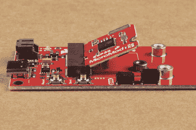](https://cdn.sparkfun.com/assets/learn_tutorials/1/5/9/6/assembly_processor_insert.jpg)*Inserting a processor board into the M.2 socket on the MicroMod Qwiic Carrier Board. (Click to enlarge)*

要固定处理器板，轻轻按住板，用十字螺丝刀(PH0 或 PH1)固定 M.2 螺丝。下面是一个组装好的微模块系统的例子:

[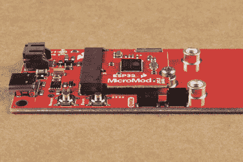](https://cdn.sparkfun.com/assets/learn_tutorials/1/5/9/6/assembly_processor_screw.jpg)*A processor board attached to the MicroMod Qwiic Carrier Board. (Click to enlarge)*

### Qwiic 设备

螺丝插件有[单](https://www.sparkfun.com/products/17723)或[双](https://www.sparkfun.com/products/17724)两种配置，用于将 1 " x 1 " Qwiic 设备连接/安装到 qw ICC 载板。嵌件与 [4-40 螺钉](https://www.sparkfun.com/products/10453)兼容；此外， [4-40 3/8 "支架](https://www.sparkfun.com/products/10463)也可用于垂直堆叠电路板。

为了将 qw IC 设备电子连接到载板，用户将需要[qw IC 电缆](https://www.sparkfun.com/products/15081)。欲了解更多信息，请查看我们的 [Qwiic 生态系统页面](https://www.sparkfun.com/qwiic)。

[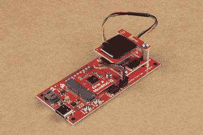](https://cdn.sparkfun.com/assets/learn_tutorials/1/5/9/6/assembly_stack_single.jpg)[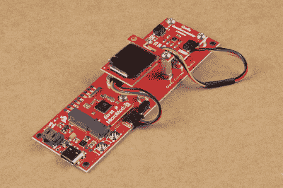](https://cdn.sparkfun.com/assets/learn_tutorials/1/5/9/6/assembly_attach_double.jpg)*Mounting and connecting Qwiic devices to the MicroMod Qwiic Carrier Board. (Click to enlarge)*

### 编程；编排

对 Qwiic 载板上使用的处理器板进行编程；用 USB-C 电缆将板连接到计算机。根据处理器板的不同，用户可能需要安装驱动程序*(如果他们还没有安装)*。

**注意:**确保在 Arduino IDE 中为所选处理器板安装了正确的板定义。要获得安装板定义的帮助，请使用 [MicroMod 处理器板](https://www.sparkfun.com/micromod#processor_boards)登录页面，并查看该硬件的相关连接指南。

[](https://learn.sparkfun.com/tutorials/installing-board-definitions-in-the-arduino-ide) [### 在 Arduino IDE 中安装电路板定义

#### 2020 年 9 月 9 日](https://learn.sparkfun.com/tutorials/installing-board-definitions-in-the-arduino-ide) How do I install a custom Arduino board/core? It's easy! This tutorial will go over how to install an Arduino board definition using the Arduino Board Manager. We will also go over manually installing third-party cores, such as the board definitions required for many of the SparkFun development boards.[Favorited Favorite](# "Add to favorites") 3[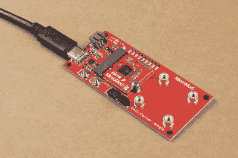](https://cdn.sparkfun.com/assets/learn_tutorials/1/5/9/6/assembly_usb.jpg)*USB connection to the MicroMod Qwiic carrier board for programming the attached processor board. (Click to enlarge)*

## 例子

下面是使用 MicroMod Qwiic 载板创建气泡水平仪的简单演示，使用[加速度计](https://www.sparkfun.com/products/15760)和[有机发光二极管显示器](https://www.sparkfun.com/products/14532)。用户还需要其他零件和附件；除了 Qwiic 载板之外的所有零件都列在下面:

[](https://www.sparkfun.com/products/15081) 

将**添加到您的[购物车](https://www.sparkfun.com/cart)中！**

### [SparkFun Qwiic 线缆套件](https://www.sparkfun.com/products/15081)

[In stock](https://learn.sparkfun.com/static/bubbles/ "in stock") KIT-15081

为了更容易上手，我们用 50 毫米到 500 毫米的各种 Qwiic 电缆组装了 Qwiic 电缆套件…

$8.9516[Favorited Favorite](# "Add to favorites") 58[Wish List](# "Add to wish list")****[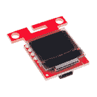](https://www.sparkfun.com/products/14532) 

将**添加到您的[购物车](https://www.sparkfun.com/cart)中！**

### [【spark fun 微有机发光二极管突围(Qwiic)](https://www.sparkfun.com/products/14532)

[In stock](https://learn.sparkfun.com/static/bubbles/ "in stock") LCD-14532

SparkFun Qwiic 微型有机发光二极管突破是 Qwiic 启用版本的流行微视图和微型有机发光二极管显示器！

$18.506[Favorited Favorite](# "Add to favorites") 45[Wish List](# "Add to wish list")****[](https://www.sparkfun.com/products/16781) 

将**添加到您的[购物车](https://www.sparkfun.com/cart)中！**

### [SparkFun MicroMod ESP32 处理器](https://www.sparkfun.com/products/16781)

[In stock](https://learn.sparkfun.com/static/bubbles/ "in stock") WRL-16781

该板将 Espressif 的 ESP32 与我们的 M.2 连接器接口相结合，为我们的 Micro…

$16.951[Favorited Favorite](# "Add to favorites") 6[Wish List](# "Add to wish list")****[](https://www.sparkfun.com/products/14743) 

将**添加到您的[购物车](https://www.sparkfun.com/cart)中！**

### [USB 3.1 线 A 到 C - 3 脚](https://www.sparkfun.com/products/14743)

[In stock](https://learn.sparkfun.com/static/bubbles/ "in stock") CAB-14743

USB C 棒极了。但是，在我们将所有的集线器、充电器和端口转换为 USB C 之前，这是您要使用的电缆…

$5.504[Favorited Favorite](# "Add to favorites") 9[Wish List](# "Add to wish list")****[](https://www.sparkfun.com/products/9146) 

将**添加到您的[购物车](https://www.sparkfun.com/cart)中！**

### [SparkFun 迷你螺丝刀](https://www.sparkfun.com/products/9146)

[In stock](https://learn.sparkfun.com/static/bubbles/ "in stock") TOL-09146

这只是你的基本可逆螺丝刀口袋大小！有平头和十字头可供选择。配有别针和…

$1.053[Favorited Favorite](# "Add to favorites") 11[Wish List](# "Add to wish list")****[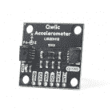](https://www.sparkfun.com/products/15760) 

将**添加到您的[购物车](https://www.sparkfun.com/cart)中！**

### [【三轴加速度计 Breakout-lis2d h12(Qwiic)](https://www.sparkfun.com/products/15760)

[In stock](https://learn.sparkfun.com/static/bubbles/ "in stock") SPX-15760

【qw IIC】(https://www . spark fun . com/qw IIC)又来袭了！这种 MEMS，三轴加速度计由意法半导体公司已经…

$6.95[Favorited Favorite](# "Add to favorites") 5[Wish List](# "Add to wish list")****[](https://www.sparkfun.com/products/10463) 

将**添加到您的[购物车](https://www.sparkfun.com/cart)中！**

### [支座-金属六角(4-40；3/8";10 只装)](https://www.sparkfun.com/products/10463)

[In stock](https://learn.sparkfun.com/static/bubbles/ "in stock") PRT-10463

金属六角公/母支座。#4-40 螺纹，带 3/8”柄和 3/16”螺纹长度。可堆叠成任意长度。…

$4.50[Favorited Favorite](# "Add to favorites") 7[Wish List](# "Add to wish list")****[](https://www.sparkfun.com/products/10453) 

将**添加到您的[购物车](https://www.sparkfun.com/cart)中！**

### [【十字螺丝头(1/4”，4-40，10 个装)](https://www.sparkfun.com/products/10453)

[In stock](https://learn.sparkfun.com/static/bubbles/ "in stock") PRT-10453

有你的标准飞利浦头 4-40 螺丝。它们有 1/4 英寸长，10 个一包。这是我们使用的螺丝尺寸…

$1.60[Favorited Favorite](# "Add to favorites") 10[Wish List](# "Add to wish list")**************** **************注:**我们选择了 [MicroMod ESP32](https://www.sparkfun.com/products/16781) 作为本次演示的处理器板；然而，用户可以自由选择使用[处理器板](https://www.sparkfun.com/categories/tags/processor-board)。

请注意，下面的示例代码旨在对与 Arduino IDE 兼容的处理器板进行编程。因此，像 [RP2040](https://www.sparkfun.com/products/17720) 这样的处理器板将需要额外的努力来适应代码(技术援助，**没有提供**)。

### 装配

组装过程相对简单。用户需要**注意**的主要事情是有机发光二极管显示器相对于加速度计轴的方向。*x 轴应指向有机发光二极管显示屏的右侧，y 轴应指向显示屏的顶部(见下图)。*

[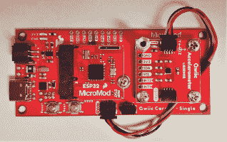](https://cdn.sparkfun.com/assets/learn_tutorials/1/5/9/6/example_accelerometer.jpg)[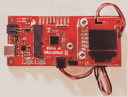](https://cdn.sparkfun.com/assets/learn_tutorials/1/5/9/6/example_OLED_display.jpg)*Mounting and connecting the Qwiic devices to the MicroMod Qwiic Carrier Board. (Click to enlarge)*

一些用户可能会发现，如果有机发光二极管显示器堆叠在加速度计上方，示例代码中气泡的移动会更加直观。

[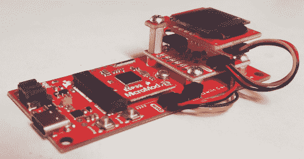](https://cdn.sparkfun.com/assets/learn_tutorials/1/5/9/6/example_assembled.jpg)*Don't forget to daisy-chain the boards together with [Qwiic cables](https://www.sparkfun.com/categories/tags/qwiic-cables). (Click to enlarge)*

### 示例代码

用户可以在此或点击下面的按钮下载[示例代码。除了 RP2040 处理器板，用户只需在上传代码前从 Arduino IDE 的板管理器中选择合适的端口和板。](https://cdn.sparkfun.com/assets/learn_tutorials/1/5/9/6/bubble_level_example.zip)

[Download Example Code](https://cdn.sparkfun.com/assets/learn_tutorials/1/5/9/6/bubble_level_example.zip)

以下部分为可能想要修改代码的用户分解了示例代码执行。请注意，根据我们服务条款的规定，我们不为任何代码修改提供技术支持。

#### 属国

下面是代码的依赖关系，包括库、pin 定义和变量实例。示例代码要求在 Arduino IDE 中安装[微有机发光二极管](https://github.com/sparkfun/SparkFun_Micro_OLED_Arduino_Library)和 [LIS2DH12](https://github.com/sparkfun/SparkFun_LIS2DH12_Arduino_Library) Arduino 库。

**提示:**在 Arduino IDE 中，用户可以点击代码中的链接(即`//Click here to get the library: http://librarymanager/All#SparkFun_LIS2DH12`)在库管理器中调出所需的库。

[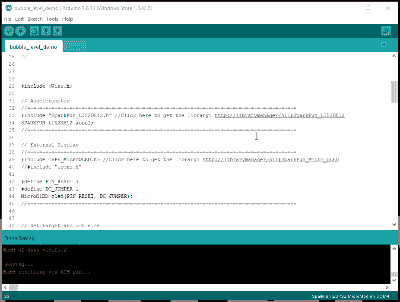](https://cdn.sparkfun.com/assets/learn_tutorials/1/5/9/6/library.gif)
*Clicking the link to pull up the required library in the Arduino IDE. (Click to enlarge)*[](https://learn.sparkfun.com/tutorials/installing-an-arduino-library) [### 安装 Arduino 库

#### 2013 年 1 月 11 日](https://learn.sparkfun.com/tutorials/installing-an-arduino-library) How do I install a custom Arduino library? It's easy! This tutorial will go over how to install an Arduino library using the Arduino Library Manager. For libraries not linked with the Arduino IDE, we will also go over manually installing an Arduino library.[Favorited Favorite](# "Add to favorites") 22

##### **库和引脚定义**

这部分代码包含代码所需的库和引脚定义。

```
language:c
#include <Wire.h>

// Accelerometer
//=-=-=-=-=-=-=-=-=-=-=-=-=-=-=-=-=-=-=-=-=-=-=-=-=-=-=-=-=-=-=-=-=-=-=-=-=-=-=-=-=-=-=-=-=
#include "SparkFun_LIS2DH12.h" //Click here to get the library: http://librarymanager/All#SparkFun_LIS2DH12
SPARKFUN_LIS2DH12 accel;
//=-=-=-=-=-=-=-=-=-=-=-=-=-=-=-=-=-=-=-=-=-=-=-=-=-=-=-=-=-=-=-=-=-=-=-=-=-=-=-=-=-=-=-=-=

// External Display
//=-=-=-=-=-=-=-=-=-=-=-=-=-=-=-=-=-=-=-=-=-=-=-=-=-=-=-=-=-=-=-=-=-=-=-=-=-=-=-=-=-=-=-=-=
#include <SFE_MicroOLED.h> //Click here to get the library: http://librarymanager/All#SparkFun_Micro_OLED
//#include "icons.h"

#define PIN_RESET 7
#define DC_JUMPER 1
MicroOLED oled(PIN_RESET, DC_JUMPER);
//=-=-=-=-=-=-=-=-=-=-=-=-=-=-=-=-=-=-=-=-=-=-=-=-=-=-=-=-=-=-=-=-=-=-=-=-=-=-=-=-=-=-=-=-= 
```

##### **变量**

这部分代码实例化了代码中使用的大多数变量。

```
language:c
// Set target and dot size
int radiusLarge = 10; // Target area 2
int radiusSmall = 4;  // Target area 1
int radiusBubble = 2; // Bubble size

// Set initial roll and pitch measurement
double averagedRoll = 0.0;
double averagedPitch = 0.0; 
```

#### 设置循环

这段代码运行设置*循环*，该循环初始化串行输出、I ² C 连接、有机发光二极管显示操作以及加速度计操作和配置。

```
language:c
void setup()
{
  // Initialize Output for Print Statements
  Serial.begin(115200);
  Serial.println("SparkFun Accel Example");

  // Initialize I2C Connection
  Wire.begin();
  //Wire.setClock(400000);

  beginDisplay(); //Check if an external Qwiic OLED is attached and display splash screen

  // Check for accelerometer
  if (accel.begin() == false)
  {
    Serial.println("Accelerometer not detected. Check address jumper and wiring. Freezing...");
    while (1)
      ;
  }

  // Set sample/data rate for accelerometer
  // The larger the avgAmount the faster we should read the sensor
  //accel.setDataRate(LIS2DH12_ODR_100Hz); //6 measurements a second
  accel.setDataRate(LIS2DH12_ODR_400Hz); //25 measurements a second
} 
```

##### **设置功能**

这些功能在设置*循环*中执行，以初始化有机发光二极管显示 I ² C 连接并显示闪屏。

```
language:c
// Ping an I2C address and see if it responds
bool isConnected(uint8_t deviceAddress)
{
  Wire.beginTransmission(deviceAddress);
  if (Wire.endTransmission() == 0)
    return true;
  return false;
}

void beginDisplay()
{
  // Connect to address display is on by pinging addresses
  // 0x3D is default on Qwiic board
  if (isConnected(0x3D) == true || isConnected(0x3C) == true)
  {
    //Init and display splash
    oled.begin();     // Initialize the OLED
    oled.display();   // Display splash screen
    delay(1200);
    oled.clear(PAGE); // Clear the display's internal memory

    oled.setCursor(15, 7); //x, y
    oled.setFontType(0); //Set font to smallest
    oled.print(F("Bubble"));
    oled.setCursor(19, 20); //x, y
    oled.print(F("Level"));

    oled.display();
    delay(1200);
  }
} 
```

#### 主循环

这段代码运行主循环。该代码检索滚动和俯仰计算，清除显示缓冲区，显示气泡和目标圆或区域。如果气泡的位置在目标区域内，滚动角和俯仰角在屏幕上显示为`X`和`Y`坐标。

```
language:c
void loop()
{
  getAngles(); // Calculate roll and pitch angles based on the acceleromter readings
  oled.clear(PAGE); // Clear the display's internal memory

  // Set dot position
  double bubbleX = LCDWIDTH / 2 - averagedPitch; // Bubble location on x-axis
  double bubbleY = LCDHEIGHT / 2 - averagedRoll; // Bubble location on y-axis

  // Limit bubble position to edge of screen
  if (bubbleX < radiusBubble) { bubbleX = radiusBubble; }
  else if (bubbleX > LCDWIDTH - radiusBubble) { bubbleX = LCDWIDTH - radiusBubble - 1; }
  if (bubbleY < radiusBubble) { bubbleY = radiusBubble; }
  else if (bubbleY > LCDHEIGHT - radiusBubble) { bubbleY = LCDHEIGHT - radiusBubble - 1; }

  // Draw circle relative to dot
  oled.circle(LCDWIDTH / 2, LCDHEIGHT / 2, radiusLarge);
  oled.circle(LCDWIDTH / 2, LCDHEIGHT / 2, radiusSmall);
  oled.circleFill(bubbleX, bubbleY, radiusBubble);

  // Display angle/position once bubble is inside larger target area
  if ( sqrt(averagedPitch * averagedPitch + averagedRoll * averagedRoll) < (radiusLarge - radiusBubble))
  {
    oled.setFontType(0); //Set font to smallest

    oled.setCursor(LCDWIDTH/2 - 21, 0); //x, y
    oled.print("X:");
    oled.print(-averagedPitch);
    oled.setCursor(LCDWIDTH/2 - 21, LCDHEIGHT - 8); //x, y
    oled.print("Y:");
    oled.print(averagedRoll);

//    oled.setCursor(LCDWIDTH/2 - 11, 0); //x, y
//    oled.print(averagedRoll);
//    if (-averagedPitch < 0) { oled.setCursor(LCDWIDTH - 29, LCDHEIGHT/2 - 3); }
//    else { oled.setCursor(LCDWIDTH - 23, LCDHEIGHT/2 - 3); }
//    oled.print(-averagedPitch);
  }

  oled.display();
} 
```

##### **`getAngles()`功能**

该功能在主循环中执行。该代码检索加速度计读数，将读数转换为滚动角和俯仰角，并根据样本集大小计算平均值(`avgAmount = 16`)。

```
language:c
void getAngles()
{
  averagedRoll = 0.0;
  averagedPitch = 0.0;
  const int avgAmount = 16;

  // Average readings after 'avgAmount' samples
  for (int reading = 0 ; reading < avgAmount ; reading++)
  {
    while (accel.available() == false) delay(1); // Wait for accelerometer connection

    // Retrieve data from accelerometer
    float accelX = accel.getX();
    float accelY = accel.getY();
    float accelZ = accel.getZ();

    // Optional modification: https://www.nxp.com/docs/en/application-note/AN3461.pdf
    //int signZ = constrain(accelZ, -1, 1);
    //double roll = atan2(accelY , signZ * sqrt( accelZ * accelZ + .001 *  abs(accelX) ) ) * 57.3;

    // Calculate roll and pitch angles
    double roll = atan2(accelY , accelZ) * 57.3;
    double pitch = atan2((-accelX) , sqrt(accelY * accelY + accelZ * accelZ)) * 57.3;
    if (constrain(accelZ, -1, 1) == -1) { roll = atan2(accelY, -accelZ) * 57.3; } // Invert if upside down

    averagedRoll += roll;
    averagedPitch += pitch;

    // Debug Print Statements
    //Serial.print(roll, 6);
    //Serial.print(", ");
    //Serial.print(pitch, 6);
    //Serial.print(", ");
    //
    //Serial.print(accelX);
    //Serial.print(", ");
    //Serial.print(accelY);
    //Serial.print(", ");
    //Serial.print(accelZ);
    //Serial.println("");
  }

  averagedRoll /= (float)avgAmount;
  averagedPitch /= (float)avgAmount;

  // Debug Print Statements
  //Serial.print(averagedRoll, 6);
  //Serial.print(", ");
  //Serial.print(averagedPitch, 6);
  //Serial.println(", ");

} 
```

### 演示操作

下面是示例代码的运行演示。尽情享受吧！

[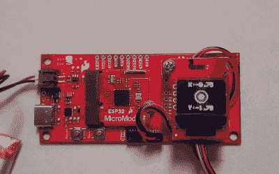](https://cdn.sparkfun.com/assets/learn_tutorials/1/5/9/6/demo.gif)*Demonstration of the bubble level code operating. (Click to enlarge)*

## 解决纷争

**Not working as expected and need help?**

如需技术支持和有关产品运行不正常的更多信息，请查看 [SparkFun 技术支持](https://www.sparkfun.com/technical_assistance)页面，了解一些初步的故障诊断。

[SparkFun Technical Assistance Page](https://www.sparkfun.com/technical_assistance)

要获得额外的帮助， [SparkFun 论坛:MicroMod](https://forum.sparkfun.com/viewforum.php?f=180) 是一个寻找和寻求帮助的好地方。首次用户将需要[创建一个论坛账户](https://forum.sparkfun.com/ucp.php?mode=register)来搜索产品论坛和发布问题。

[SparkFun Forums: MicroMod](https://forum.sparkfun.com/viewforum.php?f=180)

## 资源和更进一步

想了解更多关于 SparkFun Qwiic 载板的信息？查看这些链接！

*   图解的
    *   [单曲](https://cdn.sparkfun.com/assets/9/7/b/3/c/MM_qwiic_carrier_single_schematic.pdf) (PDF)
    *   [双](https://cdn.sparkfun.com/assets/f/e/3/8/f/MM_qwiic_carrier_double_schematic.pdf) (PDF)
*   电路板尺寸
    *   [单曲](https://cdn.sparkfun.com/assets/5/d/6/0/3/MM_qwiic_carrier-single_dimensions.pdf) (PDF)
    *   [双](https://cdn.sparkfun.com/assets/3/f/3/4/3/MM_qwiic_carrier-double_dimensions.pdf) (PDF)
*   Eagle 文件
    *   [单曲](https://cdn.sparkfun.com/assets/a/4/e/8/6/MM_qwiic_carrier-single_eagle_files.zip) (ZIP)
    *   [双](https://cdn.sparkfun.com/assets/5/0/1/b/b/MM_qwiic_carrier-double_eagle_files.zip) (ZIP)
*   [GitHub 硬件回购](https://github.com/sparkfun/MicroMod_Qwiic_Carrier)
*   [演示代码](https://cdn.sparkfun.com/assets/learn_tutorials/1/5/9/6/bubble_level_example.zip)
*   [产品展示视频](https://youtu.be/9snKiVXC5Vc)

MicroMod 文档:

*   [micro mod 入门](https://learn.sparkfun.com/tutorials/getting-started-with-micromod)
*   [用微模块设计](https://learn.sparkfun.com/tutorials/designing-with-micromod)
*   [MicroMod 信息页面](https://www.sparkfun.com/micromod)
*   [MicroMod 论坛](https://forum.sparkfun.com/viewforum.php?f=180)

寻找一些灵感？查看这些其他的[微模块教程](https://learn.sparkfun.com/tutorials/tags/micromod):

[](https://learn.sparkfun.com/tutorials/getting-started-with-micromod) [### MicroMod 入门](https://learn.sparkfun.com/tutorials/getting-started-with-micromod) Dive into the world of MicroMod - a compact interface to connect a microcontroller to various peripherals via the M.2 Connector 3[](https://learn.sparkfun.com/tutorials/micromod-rp2040-processor-board-hookup-guide) [### MicroMod RP2040 处理器板连接指南](https://learn.sparkfun.com/tutorials/micromod-rp2040-processor-board-hookup-guide) This tutorial covers the basic functionality of the MicroMod RP2040 Processor Board and highlights the features of the dual-core ARM Cortex-M0+ processors development board. Get started with the first microcontroller from the Raspberry Pi Foundation 0[](https://learn.sparkfun.com/tutorials/micromod-gnss-function-board---neo-m9n-hookup-guide) [### MicroMod GNSS 功能板- NEO-M9N 连接指南](https://learn.sparkfun.com/tutorials/micromod-gnss-function-board---neo-m9n-hookup-guide) The u-blox NEO-M9N is a powerful GPS unit that now comes populated on a MicroMod Function Board! In this tutorial, we will quickly get you set up using it with the MicroMod ecosystem and Arduino so that you can start reading the output.[Favorited Favorite](# "Add to favorites") 2[](https://learn.sparkfun.com/tutorials/sound-location-with-the-qwiic-sound-trigger-and-the-u-blox-zed-f9x) [### 使用 Qwiic 声音触发器和 u-blox ZED-F9x 进行声音定位](https://learn.sparkfun.com/tutorials/sound-location-with-the-qwiic-sound-trigger-and-the-u-blox-zed-f9x) [Favorited Favorite](# "Add to favorites") 2**************************************************