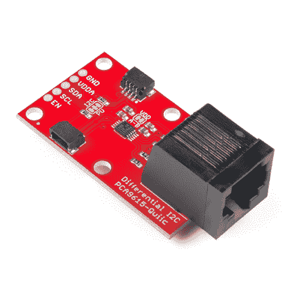
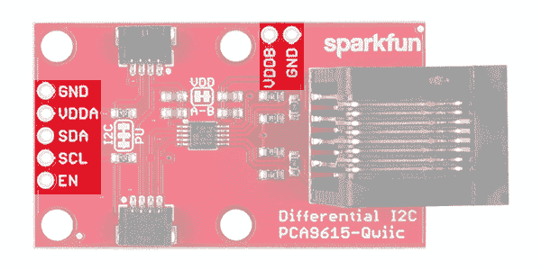
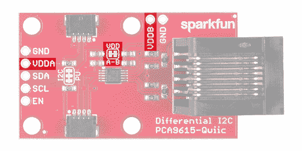
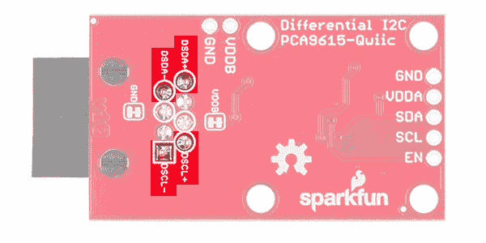
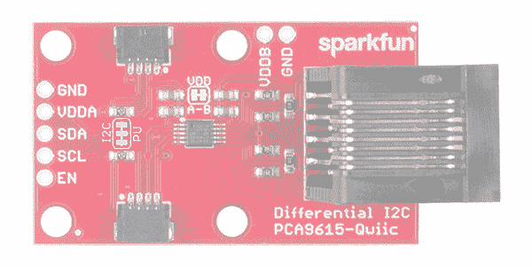
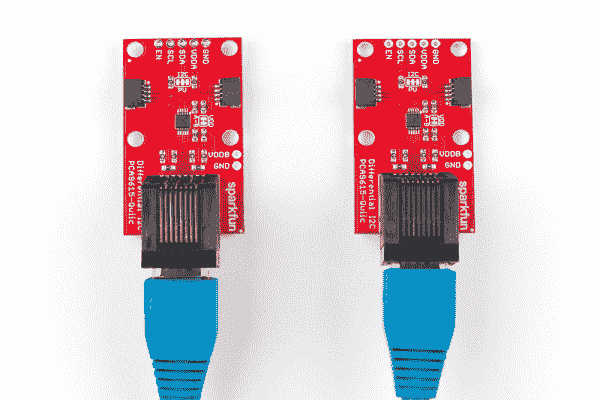
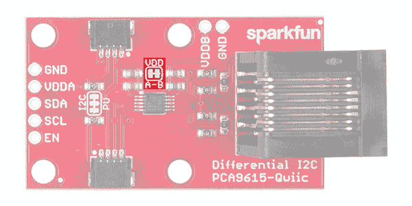
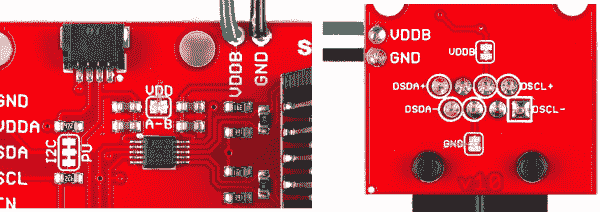
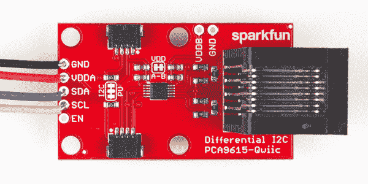

# Qwiic 差分 I2C 总线扩展器(PCA9615)连接指南

> 原文：<https://learn.sparkfun.com/tutorials/qwiic-differential-i2c-bus-extender-pca9615-hookup-guide>

## 介绍

[Qwiic Differential I²C Breakout](https://www.sparkfun.com/products/14589)是扩展 I ² C 通信总线范围的最快和最简单的方法。分线点使用恩智浦的 PCA9615 IC，它将两个默认 I ² C 信号转换为四个差分信号:两个用于 SCL，两个用于 SDA。再加上 [SparkFun 的 Qwiic 连接系统](https://www.sparkfun.com/qwiic)的易用性，differential I ² C 分线板使其更容易连接到系统的其余部分。差分信号通过以太网电缆发送，该电缆通过板载 RJ-45 连接器连接到分线点。差分信号允许 I ² C 信号达到 100 英尺的距离。同时仍然保持它们的信号完整性！

 

### [【斯帕克芬差速器 I2C 分线点- PCA9615 (Qwiic)](https://www.sparkfun.com/products/retired/14589)

[Retired](https://learn.sparkfun.com/static/bubbles/ "Retired") BOB-14589

SparkFun 差分 I2C 突破是扩展 I2C 通信总线范围的最快和最简单的方法。

15 **Retired**[Favorited Favorite](# "Add to favorites") 28[Wish List](# "Add to wish list")

[https://www.youtube.com/embed/Km-XAFcmP6c/?autohide=1&border=0&wmode=opaque&enablejsapi=1](https://www.youtube.com/embed/Km-XAFcmP6c/?autohide=1&border=0&wmode=opaque&enablejsapi=1)

无论您是需要扩大受到电机噪音困扰的自动驾驶汽车上 I ² C 传感器的范围，还是想要在家中或办公室创建一个庞大的传感器网络，Qwiic 差分 I ² C 分线点都是扩大距离和降低噪声敏感度的绝佳解决方案。

### 所需材料

要跟随本项目教程，您将需要以下材料。你可能不需要所有的东西，这取决于你拥有什么。将它添加到您的购物车，通读指南，并根据需要调整购物车。

*   2x [Qwiic 差速器 I ² C 分线点](https://www.sparkfun.com/products/14589)。
*   直通以太网电缆(最长 100 英尺)。
*   一个能够 I ² C 的[微控制器](https://www.sparkfun.com/categories/300)或[单板机](https://www.sparkfun.com/categories/394)
*   I ² C 总线另一端的一个 [I ² C 传感器](https://www.sparkfun.com/categories/tags/i2c)与之通讯。
*   如果使用 Qwiic 连接器，两根 [Qwiic 电缆](https://www.sparkfun.com/search/results?term=qwiic+cable)。

### 工具

根据您的设置，您可能需要一个烙铁、焊料、[通用焊接附件](https://www.sparkfun.com/categories/49)和一把业余爱好刀。

 

### [威勒 WLC100 焊台](https://www.sparkfun.com/products/14228)

[Out of stock](https://learn.sparkfun.com/static/bubbles/ "out of stock") TOL-14228

Weller 的 WLC100 是一款多功能的 5 瓦至 40 瓦焊台，非常适合业余爱好者、DIY 爱好者和学生。…

2[Favorited Favorite](# "Add to favorites") 17[Wish List](# "Add to wish list") 

将**添加到您的[购物车](https://www.sparkfun.com/cart)中！**

### [无铅焊料- 100 克线轴](https://www.sparkfun.com/products/9325)

[In stock](https://learn.sparkfun.com/static/bubbles/ "in stock") TOL-09325

这是带有水溶性树脂芯的无铅焊料的基本线轴。0.031 英寸规格，100 克。这是一个好主意…

$9.957[Favorited Favorite](# "Add to favorites") 33[Wish List](# "Add to wish list")**** 

将**添加到您的[购物车](https://www.sparkfun.com/cart)中！**

### [爱好刀](https://www.sparkfun.com/products/9200)

[In stock](https://learn.sparkfun.com/static/bubbles/ "in stock") TOL-09200

就像一把 Xacto 刀，只是更好。我们在处理多氯联苯时广泛使用这些技术。这些小刀子很适合切割…

$3.502[Favorited Favorite](# "Add to favorites") 18[Wish List](# "Add to wish list")**** ****### 推荐阅读

如果你不熟悉 Qwiic 系统，我们推荐你在这里阅读[以获得一个概述](https://www.sparkfun.com/qwiic)。

|  |
| *[Qwiic 连接系统](https://www.sparkfun.com/qwiic)* |

如果你不熟悉下面的教程，我们也建议你看一看。

 [### 逻辑电平](https://learn.sparkfun.com/tutorials/logic-levels) Learn the difference between 3.3V and 5V devices and logic levels.[Favorited Favorite](# "Add to favorites") 82 [### I2C](https://learn.sparkfun.com/tutorials/i2c) An introduction to I2C, one of the main embedded communications protocols in use today.[Favorited Favorite](# "Add to favorites") 128 [### 如何使用跳线焊盘和 PCB 走线](https://learn.sparkfun.com/tutorials/how-to-work-with-jumper-pads-and-pcb-traces) Handling PCB jumper pads and traces is an essential skill. Learn how to cut a PCB trace, add a solder jumper between pads to reroute connections, and repair a trace with the green wire method if a trace is damaged.[Favorited Favorite](# "Add to favorites") 11 [### Arduino 和光子连接指南的 Qwiic 屏蔽](https://learn.sparkfun.com/tutorials/qwiic-shield-for-arduino--photon-hookup-guide) Get started with our Qwiic ecosystem with the Qwiic shield for Arduino or Photon.[Favorited Favorite](# "Add to favorites") 5 [### 覆盆子酱连接指南的 Qwiic 帽子](https://learn.sparkfun.com/tutorials/qwiic-hat-for-raspberry-pi-hookup-guide) Get started interfacing your Qwiic enabled boards with your Raspberry Pi. This Qwiic connects the I2C bus (GND, 3.3V, SDA, and SCL) on your Raspberry Pi to an array of Qwiic connectors.[Favorited Favorite](# "Add to favorites") 2

## 硬件概述

Qwiic 差分 I ² C 突破的简单性是其最大的吸引力之一。其他 I ² C 通信方式需要将 I ² C 通信打包成另一种协议，无论是 [RS-485](https://en.wikipedia.org/wiki/RS-485) 还是[单线](https://en.wikipedia.org/wiki/1-Wire)。然而，PCA9615 利用差分收发器保持 I ² C 协议。在本节中，我们将更仔细地看一看该板，以便更好地理解它是如何工作的。

### 插脚引线图

下面是板上断开的电镀通孔引脚。I ² C 引脚连接到侧面的两个 Qwiic 连接器。

#### PTH 连接

*   **GND** -地面
*   **VDDA** - **2.3VDC 到 5.5VDC** 。I ² C 母线侧电源。
*   **VDDB** - **3.0VDC 到 5.5VDC** 。差分侧电源。如果跳线“ **VDD A-B** ”没有短路，那么 VDDB 将需要被供电以使差分 I ² C 总线工作。
*   **SDA** - I ² C 数据信号。
*   **SCL** - I ² C 时钟信号。
*   **EN(可选)** - PCA9615 使能(高电平有效，内部上拉)。这用于禁用总线缓冲器，对于故障查找、上电时序控制或通过隔离并非始终需要的部分来重新配置大型总线系统非常有用。

#### Qwiic 连接

*   **GND**——地面。
*   **VDDA** - **2.3VDC 到 5.5VDC** 。I ² C 母线侧电源。如果“ **VDD A-B** ”没有短路，VDDB 将需要单独供电，以便差动 I ² C 总线运行。
*   **SDA** - I ² C 数据信号。
*   **SCL** - I ² C 时钟信号。

### VDDA vs VDDB

为了给电路板供电，VDDA 必须存在，并且与 SDA/SCL 线的逻辑电压相同，而 VDDB 用于给差分 I ² C 总线供电。默认情况下，标有“ **VDD A-B** 的跳线是闭合的，它将 VDD A 轨连接到 VDDB 轨。通过切断跳线，可以将两个供电轨分开，这样一个供电轨可以在 3.3V 下工作，而另一个可以在 5V 下工作。

#### VDDB 和接地跳线

如果连接在扩展 I ² C 总线另一端的传感器数量很少，您可以通过以太网电缆给它们供电。但是，如果连接了多个传感器，建议两端分别供电。为了隔离以太网电缆两端的电源，使用锋利的刀片在标有“ **VDDB** 和“ **GND** ”的跳线的焊盘之间切割小迹线。VDDB 仍会出现在每个板上，但以太网电缆不会传输任何电流来为电缆另一端的设备供电。

### 差分信号

从电路板的底部，我们可以看到 RJ-45 连接器用于差分信号的引脚。该板设计为使用标准以太网电缆。如果定制电缆，请确保为第 1 针和第 2 针( **DSCL-** 、**+**)以及第 7 针和第 8 针(**-**、 **DSDA+** )连接双绞线。

### I ² C 上拉电阻

与大多数 SparkFun I ² C 产品一样，I ² C 总线上有一个用于上拉电阻的跳线。如果多个传感器连接到总线并使能上拉电阻，并联等效电阻将产生过强的上拉电阻，使总线无法正常工作。根据一般经验，如果多个器件连接到总线，禁用除了**一对**外的所有上拉电阻。

## 硬件装配

使用的以太网电缆必须是直通的(即电缆一端的引脚 1 连接到另一端的引脚 1。引脚 2 也是如此，依此类推。).

### I ² C 上拉电阻

记住，每个独立的非差分 I ² C 总线至少需要一组使能的上拉电阻。确保跟踪哪些器件使能了 I ² C 上拉电阻，哪些没有。

### 电源方案

由于有两个电源轨和相当多的跳线，很容易对如何为差分 I ² C 总线扩展器供电感到困惑。在这一节中，我们将介绍为项目提供动力的不同方法。

#### VDD_A == VDD，动力全母线(默认)

*   VDD A 和 VDD B 是相连的。
*   两者均以 3.3V 供电。
*   电源连接到以太网电缆的双绞线，并发送到外围节点。
*   外围节点不需要电源。

* * *

#### VDD_A！= VDD_B，动力全母线

*   VDD·A-B 的跳线痕迹被切断了。
*   单独的电源(3.0-5.5V)提供给 VDD_B，而 VDD_A 保持在 3.3V
*   VDD_B 电压连接到以太网电缆的双绞线上，并发送到外围节点。
*   外围节点不需要电源。

* * *

#### VDD_A == VDD_ B，分别给每个节点供电

*   VDD A 和 VDD B 是相连的。
*   两者均以 3.3V 供电。
*   电路板下面的跳线(VDDB 和 GND)被切断，电源**而不是**连接到以太网电缆。
*   每个外设节点仅由 3.3V 单独供电。差分 I ² C 信号是总线上唯一的连接。

* * *

#### VDD_A！= VDD_ B，分别为每个节点供电

*   VDD·A-B 的跳线痕迹已经在板子顶部被切断了。
*   单独的电源(3.0-5.5V)提供给 VDD_B，而 VDD_A 保持在 3.3V
*   电路板下面的跳线(VDDB 和 GND)被切断，电源**而不是**连接到以太网电缆。
*   每个外设节点仅由 3.3V 单独供电。差分 I ² C 信号是总线上唯一的连接。

* * *

#### VDD_A == VDD_ B，给全车供电(非 Qwiic 选项)

*   VDD A 和 VDD B 是相连的。
*   两者均以 5V 供电。
*   电源连接到以太网电缆的双绞线，并发送到外围节点。
*   外围节点不需要电源。

* * *

#### VDD_A == VDD_ B，分别为每个节点供电(非 Qwiic 选项)

*   VDD A 和 VDD B 是相连的。
*   两者均以 5V 供电。
*   电路板下面的跳线(VDDB 和 GND)被切断，电源**而不是**连接到以太网电缆。
*   每个外设节点仅由 5V 单独供电。差分 I ² C 信号是总线上唯一的连接。

## I2C 总线扩展器示例

对于这个例子，我们将使用我们的[环境组合分线点](https://www.sparkfun.com/products/14348)，使用差分 I ² C 总线扩展器。要按照这个示例进行操作，您需要以下内容:****