# Qwiic 带微型模块的数字桌面标牌

> 原文：<https://learn.sparkfun.com/tutorials/qwiic-digital-desk-sign-with-micromod>

## 介绍

“博比在哪里？”工作时出现的问题。虽然我通常坐在办公桌前，但有时我需要离开去吃午饭，休息 15 分钟，参加一个会议，或者检查库存。为了帮助通知其他人我可能在哪里，我使用 SAMD51 的 USB 主机和 USB 键盘制作了支持 Qwiic 的数字桌面标志，以便在我离开时输入简短的自定义消息！

[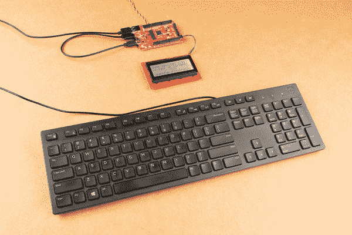](https://cdn.sparkfun.com/assets/learn_tutorials/1/4/0/2/Qwiic_Digital_Desk_Sign_MicroMod_SAMD51_Host_USB_Keyboard_Message.jpg)

### 所需材料

要跟随本教程，您将需要以下材料。你可能不需要所有的东西，这取决于你拥有什么。将它添加到您的购物车，通读指南，并根据需要调整购物车。

[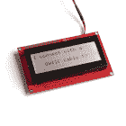](https://www.sparkfun.com/products/16398) 

将**添加到您的[购物车](https://www.sparkfun.com/cart)中！**

### [【spark fun 20 x4 SerLCD-RGB 背光(Qwiic)](https://www.sparkfun.com/products/16398)

[Only 7 left!](https://learn.sparkfun.com/static/bubbles/ "only 7 left!") LCD-16398

SparkFun Qwiic SerLCD 是一款串行启用的 LCD，为添加 20x4 黑色提供了一种简单且经济高效的解决方案…

$26.9512[Favorited Favorite](# "Add to favorites") 16[Wish List](# "Add to wish list")****[](https://www.sparkfun.com/products/16791) 

将**添加到您的[购物车](https://www.sparkfun.com/cart)中！**

### [SparkFun MicroMod SAMD51 处理器](https://www.sparkfun.com/products/16791)

[Out of stock](https://learn.sparkfun.com/static/bubbles/ "out of stock") DEV-16791

SparkFun MicroMod SAMD51 处理器板采用 32 位 ARM Cortex-M4F MCU，是一款功能强大的微控制器，封装在一个

$18.951[Favorited Favorite](# "Add to favorites") 8[Wish List](# "Add to wish list")****[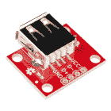](https://www.sparkfun.com/products/12700) 

将**添加到您的[购物车](https://www.sparkfun.com/cart)中！**

### [spark fun USB A 型母突围](https://www.sparkfun.com/products/12700)

[In stock](https://learn.sparkfun.com/static/bubbles/ "in stock") BOB-12700

这个简单的板将母 USB 型连接器的 VCC、GND、D-和 D+引脚连接到 0.1 英寸间距的接头上。如果你想…

$4.956[Favorited Favorite](# "Add to favorites") 26[Wish List](# "Add to wish list")****[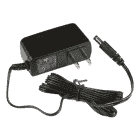](https://www.sparkfun.com/products/15312) 

将**添加到您的[购物车](https://www.sparkfun.com/cart)中！**

### [【墙上适配器电源- 5VDC，2A(桶形插孔)](https://www.sparkfun.com/products/15312)

[In stock](https://learn.sparkfun.com/static/bubbles/ "in stock") TOL-15312

这是一个高品质的开关“壁式电源”交流到 DC 5V 2000 毫安桶形插座壁式电源，专为…

$6.502[Favorited Favorite](# "Add to favorites") 13[Wish List](# "Add to wish list")****[](https://www.sparkfun.com/products/14427) 

将**添加到您的[购物车](https://www.sparkfun.com/cart)中！**

### [Qwiic 线缆- 100mm](https://www.sparkfun.com/products/14427)

[In stock](https://learn.sparkfun.com/static/bubbles/ "in stock") PRT-14427

这是一条 100 毫米长的 4 芯电缆，带有 1 毫米 JST 端接。它旨在将支持 Qwiic 的组件连接在一起…

$1.50[Favorited Favorite](# "Add to favorites") 32[Wish List](# "Add to wish list")****[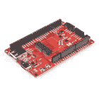](https://www.sparkfun.com/products/16885) 

将**添加到您的[购物车](https://www.sparkfun.com/cart)中！**

### [SparkFun MicroMod ATP 载板](https://www.sparkfun.com/products/16885)

[In stock](https://learn.sparkfun.com/static/bubbles/ "in stock") DEV-16885

如果您需要“大量”带有简单 to 编程、准备上市模块的 GPIO，ATP 是您需要的解决方案。

$19.951[Favorited Favorite](# "Add to favorites") 13[Wish List](# "Add to wish list")****[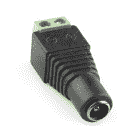](https://www.sparkfun.com/products/10288) 

将**添加到您的[购物车](https://www.sparkfun.com/cart)中！**

### [DC 筒式千斤顶适配器——母](https://www.sparkfun.com/products/10288)

[In stock](https://learn.sparkfun.com/static/bubbles/ "in stock") PRT-10288

此适配器允许您将筒式插孔连接器连接到裸线。一端有螺丝端子，另一端有一个 5.5…

$3.501[Favorited Favorite](# "Add to favorites") 24[Wish List](# "Add to wish list")****[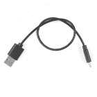](https://www.sparkfun.com/products/15426) 

将**添加到您的[购物车](https://www.sparkfun.com/cart)中！**

### [可逆 USB A 转 C 线- 0.3m](https://www.sparkfun.com/products/15426)

[In stock](https://learn.sparkfun.com/static/bubbles/ "in stock") CAB-15426

这些 0.3 米长的电缆稍加修改后，可以插入其端口，而无需考虑其在…

$4.501[Favorited Favorite](# "Add to favorites") 4[Wish List](# "Add to wish list")**************** ************### 你还需要

**Note:** Not all keyboards are compatible. The code used in this tutorial was tested on the following keyboards listed below. We found that the *Logitech K400 Plus Wireless Touch Keyboard* was not compatible with this project.

你还需要一个 USB 键盘。测试了以下键盘。

*   戴尔 KB216t
*   罗技 K120

### 工具

你需要一个烙铁、焊料和一般的焊接附件。

[](https://www.sparkfun.com/products/116) 

将**添加到您的[购物车](https://www.sparkfun.com/cart)中！**

### [破开头球——直击](https://www.sparkfun.com/products/116)

[In stock](https://learn.sparkfun.com/static/bubbles/ "in stock") PRT-00116

一排标题-打破适应。40 个引脚，可切割成任何尺寸。用于定制 PCB 或通用定制接头。

$1.7520[Favorited Favorite](# "Add to favorites") 133[Wish List](# "Add to wish list")****[](https://www.sparkfun.com/products/115) 

将**添加到您的[购物车](https://www.sparkfun.com/cart)中！**

### [女标题](https://www.sparkfun.com/products/115)

[In stock](https://learn.sparkfun.com/static/bubbles/ "in stock") PRT-00115

单排 40 孔，内螺纹接头。可以用一把钢丝钳切割成合适的尺寸。标准 0.1 英寸间距。我们广泛使用它们…

$1.758[Favorited Favorite](# "Add to favorites") 71[Wish List](# "Add to wish list")****[](https://www.sparkfun.com/products/14456) 

将**添加到您的[购物车](https://www.sparkfun.com/cart)中！**

### [【烙铁- 60W(可调温度)](https://www.sparkfun.com/products/14456)

[In stock](https://learn.sparkfun.com/static/bubbles/ "in stock") TOL-14456

当你不想倾家荡产，但又需要一个可靠的烙铁时，这个可调节温度的烙铁是一个很好的工具…

$16.5016[Favorited Favorite](# "Add to favorites") 43[Wish List](# "Add to wish list")****[](https://www.sparkfun.com/products/9163) 

将**添加到您的[购物车](https://www.sparkfun.com/cart)中！**

### [无铅焊料- 15 克管](https://www.sparkfun.com/products/9163)

[In stock](https://learn.sparkfun.com/static/bubbles/ "in stock") TOL-09163

这是你的无铅焊料的基本管，带有不干净的水溶性树脂芯。0.031 英寸规格，15 克

$3.954[Favorited Favorite](# "Add to favorites") 14[Wish List](# "Add to wish list")****[](https://www.sparkfun.com/products/9146) 

将**添加到您的[购物车](https://www.sparkfun.com/cart)中！**

### [SparkFun 迷你螺丝刀](https://www.sparkfun.com/products/9146)

[In stock](https://learn.sparkfun.com/static/bubbles/ "in stock") TOL-09146

这只是你的基本可逆螺丝刀口袋大小！有平头和十字头可供选择。配有别针和…

$1.053[Favorited Favorite](# "Add to favorites") 11[Wish List](# "Add to wish list")****[](https://www.sparkfun.com/products/15220) 

将**添加到您的[购物车](https://www.sparkfun.com/cart)中！**

### [剥线钳- 20-30AWG](https://www.sparkfun.com/products/15220)

[In stock](https://learn.sparkfun.com/static/bubbles/ "in stock") TOL-15220

这些是 Jonard Industries 的高级剥线钳，具有舒适的弯曲手柄，是一种经济实惠的选择…

$11.951[Favorited Favorite](# "Add to favorites") 8[Wish List](# "Add to wish list")****[](https://www.sparkfun.com/products/8022) 

将**添加到您的[购物车](https://www.sparkfun.com/cart)中！**

### [【黑色连接线(22 AWG)】](https://www.sparkfun.com/products/8022)

[In stock](https://learn.sparkfun.com/static/bubbles/ "in stock") PRT-08022

标准 22 AWG 固体黑色挂钩线。使用这与你的面包板或任何项目，你需要坚固的电线。来了…

$2.951[Favorited Favorite](# "Add to favorites") 19[Wish List](# "Add to wish list")****[](https://www.sparkfun.com/products/8024) 

将**添加到您的[购物车](https://www.sparkfun.com/cart)中！**

### [【挂钩线-黄色(22 AWG)](https://www.sparkfun.com/products/8024)

[In stock](https://learn.sparkfun.com/static/bubbles/ "in stock") PRT-08024

标准 22 AWG 固体黄色挂钩线。使用这与你的面包板或任何项目，你需要坚固的电线。来了…

$2.95[Favorited Favorite](# "Add to favorites") 8[Wish List](# "Add to wish list")**************** ************### 推荐阅读

如果你不熟悉 MicroMod 生态系统，我们推荐你阅读这里的[来了解](https://www.sparkfun.com/micromod)的概况。如果你决定利用 Qwiic 连接器，我们推荐阅读[这里的概述](https://www.sparkfun.com/qwiic)。

| [](https://www.sparkfun.com/micromod) | [](https://www.sparkfun.com/qwiic) |
| *[微模式生态系统](https://www.sparkfun.com/micromod)* | *[Qwiic 连接系统](https://www.sparkfun.com/qwiic)* |

我们还建议在继续之前查看这些教程。如果你在这个项目中使用 Qwiic PIR 运动传感器，你也可以看看它的相关教程。

[](https://learn.sparkfun.com/tutorials/installing-an-arduino-library) [### 安装 Arduino 库](https://learn.sparkfun.com/tutorials/installing-an-arduino-library) How do I install a custom Arduino library? It's easy! This tutorial will go over how to install an Arduino library using the Arduino Library Manager. For libraries not linked with the Arduino IDE, we will also go over manually installing an Arduino library.[Favorited Favorite](# "Add to favorites") 22[](https://learn.sparkfun.com/tutorials/installing-arduino-ide) [### 安装 Arduino IDE](https://learn.sparkfun.com/tutorials/installing-arduino-ide) A step-by-step guide to installing and testing the Arduino software on Windows, Mac, and Linux.[Favorited Favorite](# "Add to favorites") 16[](https://learn.sparkfun.com/tutorials/i2c) [### I2C](https://learn.sparkfun.com/tutorials/i2c) An introduction to I2C, one of the main embedded communications protocols in use today.[Favorited Favorite](# "Add to favorites") 128[](https://learn.sparkfun.com/tutorials/avr-based-serial-enabled-lcds-hookup-guide) [### 基于 AVR 的串行 LCD 连接指南](https://learn.sparkfun.com/tutorials/avr-based-serial-enabled-lcds-hookup-guide) The AVR-based Qwiic Serial Enabled LCDs are a simple and cost effective solution to include in your project. These screens are based on the HD44780 controller, and include ATmega328P with an Arduino compatible bootloader. They accept control commands via Serial, SPI and I2C (via PTH headers or Qwiic connector). In this tutorial, we will show examples of a simple setup and go through each communication option.[Favorited Favorite](# "Add to favorites") 13[](https://learn.sparkfun.com/tutorials/micromod-samd51-processor-board-hookup-guide) [### MicroMod SAMD51 处理器板连接指南](https://learn.sparkfun.com/tutorials/micromod-samd51-processor-board-hookup-guide) This tutorial covers the basic functionality of the MicroMod SAMD51 and highlights the features of the ARM Cortex-M4F development board.[Favorited Favorite](# "Add to favorites") 0[](https://learn.sparkfun.com/tutorials/micromod-all-the-pins-atp-carrier-board) [### 微模压所有引脚(ATP)载板](https://learn.sparkfun.com/tutorials/micromod-all-the-pins-atp-carrier-board) Access All The Pins (ATP) of the MicroMod Processor Board with the Carrier Board 0[](https://learn.sparkfun.com/tutorials/qwiic-pir-hookup-guide) [### Qwiic PIR 连接指南](https://learn.sparkfun.com/tutorials/qwiic-pir-hookup-guide) Get started passively monitoring motion using the Panasonic EKMC and EKMB sensors with the SparkFun Qwiic PIR.[Favorited Favorite](# "Add to favorites") 0

## 硬件装配

如果您还没有，请务必查看【MicroMod 入门:硬件连接以获取有关将处理器板插入载板的信息。

[](https://learn.sparkfun.com/tutorials/getting-started-with-micromod) [### MicroMod 入门

#### 2020 年 10 月 21 日](https://learn.sparkfun.com/tutorials/getting-started-with-micromod) Dive into the world of MicroMod - a compact interface to connect a microcontroller to various peripherals via the M.2 Connector 3

将 MicroMod SAMD51 处理器板连接到 MicroMod ATP 后，您的板应该如下图所示。要编程，请插入 USB-C 电缆。

[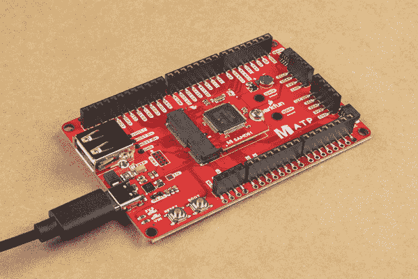](https://cdn.sparkfun.com/assets/learn_tutorials/1/2/1/1/MicroMod_ATP_SAMD51_Processor_Board.jpg)

由于 SAMD51 使用 USB 主机的 USB 连接器，我们将[剥离](https://learn.sparkfun.com/tutorials/working-with-wire#how-to-strip-a-wire)和[焊接](https://learn.sparkfun.com/tutorials/how-to-solder-through-hole-soldering)电线到板上，以连接外部 5V 墙壁适配器。

[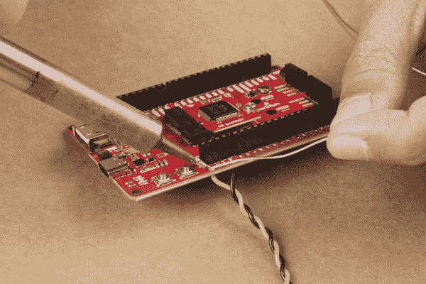](https://cdn.sparkfun.com/assets/learn_tutorials/1/4/0/2/MicroMod_ATP_Solder_Wires.jpg)

然后，我们将剥去电线的另一端，将它们插入一个母筒式插孔适配器，其“ **+** ”连接到 VIN，“T2”—”连接到 GND。我们将把电线缠绕在一起，以固定它们。

[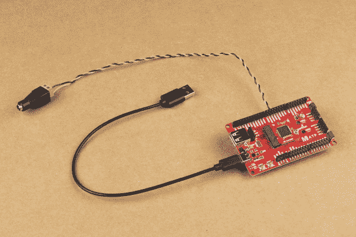](https://cdn.sparkfun.com/assets/learn_tutorials/1/4/0/2/MicroMod_SAMD51_Connect_USB.jpg)

由于 MicroMod SAMD51 主机引脚的设计，我们需要使用公头将另一个 USB 型连接器分接头焊接到 ATP 的主机引脚。如果你有一个适配器来转换 USB 类型 C 到类型 A，你也可以使用它。

[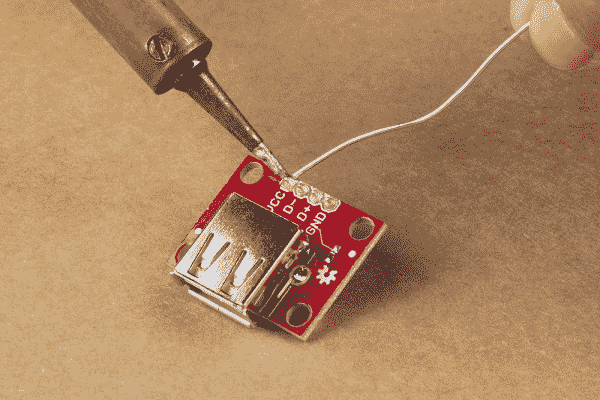](https://cdn.sparkfun.com/assets/learn_tutorials/1/4/0/2/Solder_USB_A_Headers.jpg)

虽然我可以将分线点直接焊接到 ATP 的主机引脚上，但我决定将母接头焊接到电路板上，以便能够轻松断开 USB 键盘。

[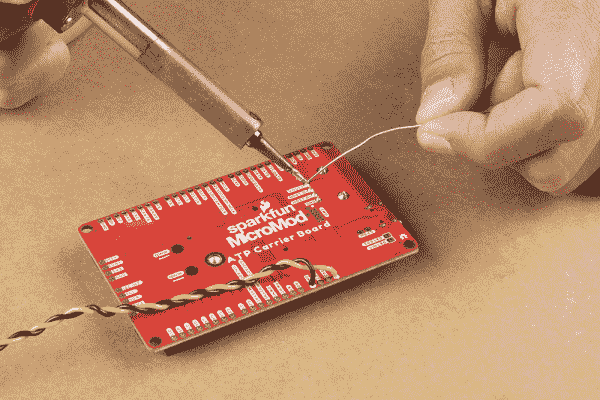](https://cdn.sparkfun.com/assets/learn_tutorials/1/4/0/2/Solder_USB_MicroMod_ATP.jpg)

在 Qwiic SerLCD 和 MicroMod 的标有 **I2C** 的 Qwiic 连接器之间添加一根 Qwiic 电缆

[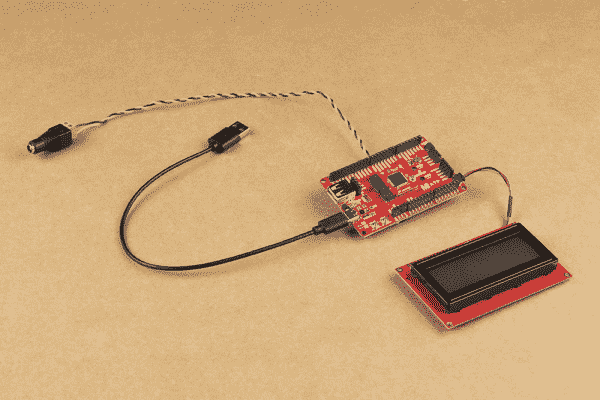](https://cdn.sparkfun.com/assets/learn_tutorials/1/4/0/2/MicroMod_SAMD51_Connect_Connect_SerLCD.jpg)

将键盘插入 USB 分线板。

[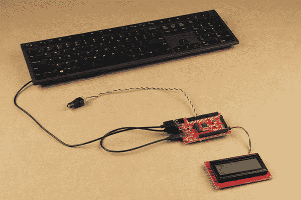](https://cdn.sparkfun.com/assets/learn_tutorials/1/4/0/2/MicroMod_SAMD51_Connect_Connect_Keyboard.jpg)

完成对 SAMD51 的编程后，您可以插入一个 5V 壁式电源适配器。

[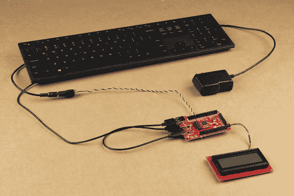](https://cdn.sparkfun.com/assets/learn_tutorials/1/4/0/2/Qwiic_Digital_Desk_Sign_MicroMod_SAMD51_Connect_Power_Supply.jpg)⚡ **Warning!** When programming your SAMD51 MicroMod, make sure to disconnect the 5V adapter to avoid conflicting voltages with the USB port.

为了省电和节省屏幕，您还可以添加 PIR 运动传感器或距离传感器来打开和关闭屏幕。在 MicroMod ATP 和 Qwiic SerLCD 之间增加了一根 Qwiic 电缆和 Qwiic PIR 运动传感器。

[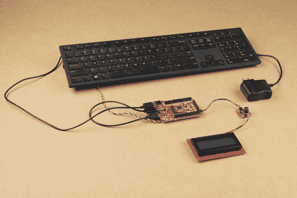](https://cdn.sparkfun.com/assets/learn_tutorials/1/4/0/2/Qwiic_Digital_Desk_Sign__MicroMod_PIR_Motion_Sensor_LCD.jpg)

20x40 SerLCD 平放在桌子上很难看到任何信息，因此最终从一个 SparkFun 纸板盒中切出一块面板来安装该项目。鉴于本教程的范围，我不会在本教程中详细介绍切割纸板或将电子元件安装到面板上。

[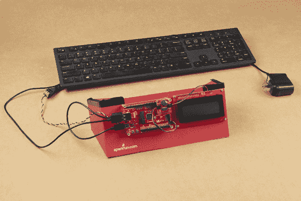](https://cdn.sparkfun.com/assets/learn_tutorials/1/4/0/2/Qwiic_Digital_Desk_Sign__MicroMod_Cardboard_Panel.jpg)

## Arduino 示例代码

**Note:** If this is your first time using Arduino IDE or board add-on, please review the following tutorials.

*   [安装 Arduino IDE](https://learn.sparkfun.com/tutorials/installing-arduino-ide)
*   [在 Arduino IDE 中安装板卡定义](https://learn.sparkfun.com/tutorials/installing-board-definitions-in-the-arduino-ide)
*   [安装 Arduino 库](https://learn.sparkfun.com/tutorials/installing-an-arduino-library/whats-a-library)

示例代码可以在下面的 [GitHub 库](https://github.com/bboyho/Qwiic_Digital_Desk_Sign_with_MicroMod)中找到。该示例包括来自 Arduino 的原始主机键盘代码。代码被修改为使用 20x4 SerLCD，并最终使用 16x2。为了节省电源和屏幕，进一步修改了代码，以便与 Qwiic PIR 运动传感器一起使用，从而切换 RGB LED 和屏幕。对于本项目教程的范围，我们将使用示例 1b 和 2。

[GitHub: Qwiic Digital Desk Sign with MicroMod](https://github.com/bboyho/Qwiic_Digital_Desk_Sign_with_MicroMod)

### Arduino SAMD 插件板

由于我们使用的是 SAMD51，您需要安装插件板。请阅读教程，了解安装电路板定义的说明。

[](https://learn.sparkfun.com/tutorials/micromod-samd51-processor-board-hookup-guide) [### MicroMod SAMD51 处理器板连接指南

#### 2020 年 10 月 21 日](https://learn.sparkfun.com/tutorials/micromod-samd51-processor-board-hookup-guide) This tutorial covers the basic functionality of the MicroMod SAMD51 and highlights the features of the ARM Cortex-M4F development board.[Favorited Favorite](# "Add to favorites") 0

### 附加库

如果您使用的是 Qwiic PIR 运动传感器，请确保按照教程中的[下载并安装该库。](https://learn.sparkfun.com/tutorials/qwiic-pir-hookup-guide#qwiic-pir-arduino-library)

[](https://learn.sparkfun.com/tutorials/qwiic-pir-hookup-guide) [### Qwiic PIR 连接指南

#### 2021 年 3 月 25 日](https://learn.sparkfun.com/tutorials/qwiic-pir-hookup-guide) Get started passively monitoring motion using the Panasonic EKMC and EKMB sensors with the SparkFun Qwiic PIR.[Favorited Favorite](# "Add to favorites") 0

Arduino 库管理器是安装库的最简单的方法。打开库管理器，搜索“ **SparkFun Qwiic PIR Arduino 库**，点击“安装”按钮下载最新版本。如果你喜欢从 [GitHub 库](https://github.com/sparkfun/SparkFun_Qwiic_PIR_Arduino_Library)手动安装这个库，你可以在这里下载:

[Download the Qwiic PIR Arduino Library](https://github.com/sparkfun/SparkFun_Qwiic_PIR_Arduino_Library/archive/master.zip)

## 示例 1b: Qwiic 数字桌面标牌

如果您使用外部 5V 墙壁适配器，请确保在将 USB C 电缆插入计算机的 COM 端口以上传项目代码之前将其断开。让我们把一个项目的草图上传到板上。将以下代码复制并粘贴到 Arduino IDE 中。前往**工具** > **板**选择正确的板定义(在这种情况下， **SparkFun MicroMod SAMD51** )。选择板卡枚举到的正确 COM 端口。点击上传。

```
language:c
/******************************************************************************
  Host Keyboard Controller with Qwiic Serial LCD 16x2 and 20x4
  Date Modified: 5 Aug 2021
  Modified by
  Ho Yun "Bobby" Chan
  Keyboard Controller Code Originally created 8 Oct 2012
  by Cristian Maglie

  ========== DESCRIPTION==========

  This project code takes input from a USB keyboard with
  the SAMD51's USB host pins and outputs characters to
  the Qwiic RGB Serial Enabled LCD 20x4\. Leave a message
  behind as you walk away from your desk!

  Note: Not all keyboards are compatible. This code was tested on the following
  keyboards.

      - Dell KB216t
      - Logitech K120

  This example also builds off the example from Arduino which
  originally showed the output of a USB Keyboard connected to
  the Native USB port on an Arduino Due (SAMD21) Board.

  http://arduino.cc/en/Tutorial/KeyboardController

  This code is part of the public domain.

******************************************************************************/

#include <KeyboardController.h> // Require keyboard control library
#include <Wire.h> //Needed for I2C to SerLCD

#define SerLCD_Address 0x72  //If using SerLCD with I2C
#define SERIAL_PORT_MONITOR Serial1 //debug via hardware UART pins

//assuming that we are using a SerLCD 20x4 screen
//these variables keep track of cursor location
int row = 0;
int remappedRow = row;
int column = 0;

//depending on what screen you are using, we are counting 0 as well
//int maxRow = 1;     // for 16x2
int maxRow = 3;        //for 20x4
//int maxColumn = 15; // for 16x2
int maxColumn = 19;    //for 20x4

boolean rgb_backlight = true; //used for function keys to immediately turn on/off backlight
boolean blink_box = true; //used to keep track of blink box as a "cursor"

//values to keep track of rgb backlight
int rVal = 157; //128 = Off, 157 = 100%
int gVal = 187; //158 = Off, 187 = 100%
int bVal = 217; //188 = Off, 217 = 100%

//values used to turn off rgb in Power Save Mode
int rVal_OFF = 128;
int gVal_OFF = 158;
int bVal_OFF = 188;

int lcdContrast = 40; //used to keep track of contast: Range is 255 to 0, 40 is default

// Initialize USB Controller
USBHost usb;

// Attach keyboard controller to USB
KeyboardController keyboard(usb);

//boolean capsLock = false; //used to keep track of capsLock, this is not used in this code
boolean numLock = false; //display numbers if numLock on, we'll assume that the keyboard resets every time so it's off by default

// This function intercepts key press
void keyPressed() {
  SERIAL_PORT_MONITOR.print("Pressed:  ");
  //printKey(); //disabled so we are not sending two key presses to the SerLCD
}

// This function intercepts key release
void keyReleased() {
  SERIAL_PORT_MONITOR.print("Released: ");
  printKey();
}

void printKey() {
  // getOemKey() returns the OEM-code associated with the key
  int tempKey = keyboard.getOemKey();
  SERIAL_PORT_MONITOR.print(" key:");
  SERIAL_PORT_MONITOR.print(tempKey);

  // getModifiers() returns a bits field with the modifiers-keys
  int mod = keyboard.getModifiers();
  SERIAL_PORT_MONITOR.print(" mod:");
  SERIAL_PORT_MONITOR.print(mod);

  SERIAL_PORT_MONITOR.print(" => ");

  if (mod & LeftCtrl)
    SERIAL_PORT_MONITOR.print("L-Ctrl ");
  if (mod & LeftShift)
    SERIAL_PORT_MONITOR.print("L-Shift ");
  if (mod & Alt)
    SERIAL_PORT_MONITOR.print("Alt ");
  if (mod & LeftCmd)
    SERIAL_PORT_MONITOR.print("L-Cmd ");
  if (mod & RightCtrl)
    SERIAL_PORT_MONITOR.print("R-Ctrl ");
  if (mod & RightShift)
    SERIAL_PORT_MONITOR.print("R-Shift ");
  if (mod & AltGr)
    SERIAL_PORT_MONITOR.print("AltGr ");
  if (mod & RightCmd)
    SERIAL_PORT_MONITOR.print("R-Cmd ");

  // getKey() returns the ASCII translation of OEM key
  // combined with modifiers.
  SERIAL_PORT_MONITOR.write(keyboard.getKey());
  SERIAL_PORT_MONITOR.println();

  /*
    USB SCAN CODES TO KEYCAP (US LAYOUT)
    https://www.win.tue.nl/~aeb/linux/kbd/scancodes-10.html

      CHARACTER KEYS
      USB SCAN CODE = KEYCAP

      4 to 29 = 'a' to 'z' and 'A' to 'Z' with Shift/CapsLock
      30 to 39 = '1' to '9', '0', and '!@#$%^&*()' with Shift
      40 = 'Enter'
      42 = 'Backspace'
      44 = 'Space'
      45 = '-' or '_' with Shift
      46 = '=' or '+' with Shift
      47 = '[' or '{' with Shift
      48 = ']' or '}' with Shift
      49 = '\' or '|' with Shift
      51 = ';' or ':' with Shift
      52 = `'` or '"' with Shift
      53 = '`' or '~' with Shift
      54 = ',' or '<' with Shift
      55 = '.' or '>' with Shift
      56 = '/' or '?' with Shift

      CURSOR CONTROL D-PAD (US LAYOUT)
      79 = `→` (e.g. right)
      80 = `←` (e.g. left)
      81 = `↓` (e.g. down)
      82 = `↑` (e.g. up)

      NUMERIC KEYPAD (US LAYOUT), NUMLOCK MUST BE ENABLED
      83 = 'NumLock'
      84 = '/'
      85 = '*'
      86 = '-'
      87 = '+'
      88 = 'Enter'
      89 = 'End'             or '1' w/ NumLock
      90 = '↓' (e.g. down)   or '2' w/ NumLock
      91 = 'Page Down'       or '3' w/ NumLock
      92 = '←' (e.g. left)   or '4' w/ NumLock
      93 =                      '5' w/ NumLock
      94 = '→' (e.g. right)  or '6' w/ NumLock
      95 = 'Home'             or '7' w/ NumLock
      96 = '↑' (e.g. up)      or '8' w/ NumLock
      97 = 'Page Up'          or '9' w/ NumLock
      98 = 'Insert'           or '0' w/ NumLock
      99 = 'Delete'           or '.' w/ NumLock

      OTHER
      41 = 'Escape'
      73 = 'Insert'
      74 = 'Home'
      75 = 'Page Up'
      76 = 'Delete'
      77 = 'End'
      78 = 'Page Down'

      FUNCTION KEYS
      58 = `F1`
      59 = `F2`
      60 = `F3`
      61 = `F4`
      62 = `F5`
      63 = `F6`
      64 = `F7`
      65 = `F8`
      66 = `F9`
      67 = `F10`
      68 = `F11`
      69 = `F12`

  */

  //----------TYPEWRITER AND KEYPAD KEYS (QWERTY, US LAYOUT) ----------
  if ((tempKey >= 4 && tempKey <= 39) ||
      (tempKey >= 44 && tempKey <= 49) ||
      (tempKey >= 51 && tempKey <= 56) ||
      (tempKey >= 84 && tempKey <= 87) ||
      ((tempKey >= 89 && tempKey <= 97) && numLock == true) ||
      tempKey == 73 ||
      tempKey == 98 ||
      (tempKey == 99 && numLock == true)) {

    Wire.beginTransmission(SerLCD_Address);

    if ( (tempKey == 49) && ((mod == 2) || (mod == 32)) ) {
      //Note: When sending the pipeline character(`|`),
      //we'll need to send 2x since the character
      //is also used as a setting character.
      Wire.write(keyboard.getKey());
      delay(50);//short delay before sending next line
      Wire.write(keyboard.getKey());
    }
    else if ((tempKey == 49) && (mod == 0)) {
      //Note: When sending back slash (`\`),
      //we will load the custom character using
      //printCustomChar() through I2C
      printCustomChar(0);
    }
    else if ( (tempKey == 53) && ((mod == 2) || (mod == 32)) ) {
      //Note: When sending tilde (`~`),
      //we will load the custom character using
      //printCustomChar() through I2C
      printCustomChar(1);
    }
    else if (tempKey == 73) {
      //Note: When sending 'insert',
      //we will load the custom character '♥' using
      //printCustomChar() through I2C
      printCustomChar(2);
    }
    else if (tempKey == 98 && numLock == false) {
      //Note: When sending keypad insert,
      //we will load the custom character '♡' using
      //printCustomChar() through I2C
      printCustomChar(3);
    }
    else {
      Wire.write(keyboard.getKey());
    }

    //after typing the cursor will move automatically to
    //next position so let's keep track of it
    if (column < maxColumn) {
      //if we are not at the end of the row, move cursor to next position
      column = column + 1;
    }
    else {
      //if we are at the end of the row, reset cursor to the beginning of the row
      column = 0;

      if (row < maxRow) {
        //if we are not on the last line, move cursor to the next line
        row = row + 1;
      }
      else {
        //if we are on the last line, move cursor to the first line
        row = 0;
      }
    }

    //remap according to SerLCD's line number
    if (row == 0) {
      remappedRow = 0;
    }
    else if (row == 1) {
      remappedRow = 64;
    }
    else if (row == 2) {
      remappedRow = 20;
    }
    else if (row == 3) {
      remappedRow = 84;
    }

    Wire.write(254); //Send command character
    Wire.write(128 + remappedRow + column); //update cursor position
    Wire.endTransmission(); //Stop I2C transmission

  }

  /*NOTE: These keys move the cursor so it is kept
    as separate condition statements. We will
    also include most of the numLock keys when 'NUMLOCK'
    is disabled.*/
  else if ((tempKey >= 79 && tempKey <= 82) ||
           tempKey == 40 ||
           tempKey == 74 ||
           tempKey == 77 ||
           tempKey == 75 ||
           tempKey == 78 ||
           tempKey == 83 ||
           tempKey == 88 ||
           ((tempKey >= 89 && tempKey <= 97) && numLock == false) ) {

    //move cursor based on d-pad or Enter key

    //----------NUMLOCK KEY----------
    if (tempKey == 83) {
      numLock = !numLock;// change state of numLock if pressed by inverting it
    }

    //----------LEFT KEY----------
    else if ((tempKey == 80) || (tempKey == 92 && numLock == false)) {

      if (column > 0) {
        //if we are at the beginning of the row
        column = column - 1;
      }
      else {
        //if we are at the end of the row
        column = maxColumn;

        if (row > 0) {
          //if we are not on the last line move up a line
          row = row - 1;
        }
        else {
          //if we are on the last line
          row = maxRow;
        }
      }
    }

    //----------RIGHT KEY----------
    else if ( (tempKey == 79) || (tempKey == 94 && numLock == false) ) {

      if (column < maxColumn) {
        //if we are at the before the end of the row
        column = column + 1;
      }
      else {
        //if we are at the end of the row, reset cursor position
        column = 0;

        if (row < maxRow) {
          //move to next line if we are before the last line
          row = row + 1;
        }
        else {
          //move to the first line if we have reached the end
          row = 0;
        }
      }
    }

    //----------UP KEY----------
    else if ( (tempKey == 82) || (tempKey == 96 && numLock == false) ) {
      if (row > 0) {
        //if we are not on the first line
        row = row - 1;
      }
      else {
        //if we are on the first line, move cursor to the last line
        row = maxRow;
      }
    }

    //----------DOWN KEY----------
    else if ( (tempKey == 81) || (tempKey == 90 && numLock == false) ) {
      if (row < maxRow) {
        //if we are not on the first line
        row = row + 1;
      }
      else {
        //if we are on the last line, move cursor to the first line
        row = 0;
      }
    }

    //----------ENTER KEY----------
    else if (tempKey == 40 || tempKey == 88) {
      //move to the first position of the next line
      column = 0;
      if (row < maxRow) {
        //if we are not on the first line, move cursor to the next line
        row = row + 1;
      }
      else {
        //if we are on the last line, move cursor to the first line
        row = 0;
      }
    }

    //----------HOME KEY----------
    else if (tempKey == 74 || (tempKey == 95 && numLock == false) ) {
      //move to the first position of the next line
      column = 0;
    }

    //----------END KEY----------
    else if (tempKey == 77 || (tempKey == 89 && numLock == false)) {
      //move to the first position of the next line
      column = maxColumn;
    }

    //----------PAGE UP KEY----------
    else if (tempKey == 75 || (tempKey == 97 && numLock == false)) {
      //move to the top row
      row = 0;
    }

    //----------PAGE DOWN KEY----------
    else if (tempKey == 78 || (tempKey == 91 && numLock == false)) {
      //move to the bottom row
      row = maxRow;
    }

    else if (tempKey == 93 && numLock == false ) {
      blink_box = !blink_box;// change state of blink_box if pressed by inverting it

      Wire.beginTransmission(SerLCD_Address);
      Wire.write(254); //Send command character

      if (blink_box == false) {
        Wire.write( (1 << 3) | (1 << 2) ); //Cursor off, blinking box off
      }
      else {
        //if blink_box == true

        Wire.write( (1 << 3) | (1 << 2) | (1 << 0) ); //Cursor off, blinking box on
      }

      Wire.endTransmission(); //Stop I2C transmission

    }

    //remap according to SerLCD's line number
    if (row == 0) {
      remappedRow = 0;
    }
    else if (row == 1) {
      remappedRow = 64;
    }
    else if (row == 2) {
      remappedRow = 20;
    }
    else if (row == 3) {
      remappedRow = 84;
    }

    Wire.beginTransmission(SerLCD_Address);
    Wire.write(254); //Send command character
    Wire.write(128 + remappedRow + column); //update cursor position
    Wire.endTransmission(); //Stop I2C transmission

  }

  //----------ESCAPE KEY----------
  else if (tempKey == 41) {
    //Make the escape key clear screen and reset cursor position.
    Wire.beginTransmission(SerLCD_Address);
    Wire.write('|'); //Put LCD into setting mode
    Wire.write('-'); //Send clear display command
    //Control the cursor
    Wire.write(254); //Send command character
    Wire.write( (1 << 3) | (1 << 2) | (1 << 0) ); //Cursor on, blinking box on
    blink_box = true;
    // reset cursor position to (0,0) after using clear display command
    row = 0;
    remappedRow = row;
    column = 0;

    Wire.write(254); //Send command character
    Wire.write(128 + remappedRow + column); //update cursor position
    Wire.endTransmission(); //Stop I2C transmission

  }

  //----------BACKSPACE KEY----------
  else if (tempKey == 42) {
    //Backspace
    //- 'Delete' by replacing with 'Space',
    //- move backward,
    //- then move backward again since cursor moves after sending character

    for (int i = 0 ; i < 2; i++) {

      if (i == 0) {
        //"Delete character" by replacing character with a space
        //and then moving cursor backwards after this condition statement.
        //We do this only once.

        Wire.beginTransmission(SerLCD_Address);
        Wire.write(32); //Send 'Space' Character
        Wire.endTransmission(); //Stop I2C transmission

        //cursor moved automatically to next position so let's keep track of it
        if (column < maxColumn) {
          column = column + 1;
        }
        else {
          column = 0;

          if (row < maxRow) {
            row = row + 1;
          }
          else {
            row = 0;
          }
        }
      }

      //For backspace, we are replacing the current position
      //with a space. This moves the cursor forward once space
      //To correct this, we are going to move backward twice
      //with the help of the for() loop.
      if (column > 0) {
        column = column - 1;
      }
      else {
        column = maxColumn;

        if (row > 0) {
          row = row - 1;
        }
        else {
          row = maxRow;
        }
      }

      //remap according to SerLCD's line number
      if (row == 0) {
        remappedRow = 0;
      }
      else if (row == 1) {
        remappedRow = 64;
      }
      else if (row == 2) {
        remappedRow = 20;
      }
      else if (row == 3) {
        remappedRow = 84;
      }

      Wire.beginTransmission(SerLCD_Address);
      Wire.write(254); //Send command character
      Wire.write(128 + remappedRow + column); //update cursor position
      Wire.endTransmission(); //Stop I2C transmission
      delay(50);

    }//end for() loop for controlling cursor with 'Backspace'
  }//end condition statement for 'Backspace'

  //----------DELETE KEY----------
  else if (tempKey == 76 || (tempKey == 99 && numLock == false) ) {
    //'Delete'
    //- 'Delete' by replacing with 'Space',
    //- move backward again since cursor moves after sending character
    //Note: Delete for the SerLCD is not like the traditional
    //forward delete key. For the SerLCD, we are simply
    //going to delete the character at the cursor position.
    //The characters ahead of the cursor will not be shifted
    //to the left.

    Wire.beginTransmission(SerLCD_Address);
    Wire.write(32); //Send 'Space' Character

    //cursor moved automatically to next position so let's keep track of it
    if (column < maxColumn) {
      column = column + 1;
    }
    else {
      column = 0;

      if (row < maxRow) {
        row = row + 1;
      }
      else {
        row = 0;
      }
    }

    //move cursor back to where it was
    if (column > 0) {
      column = column - 1;
    }
    else {
      column = maxColumn;

      if (row > 0) {
        row = row - 1;
      }
      else {
        row = maxRow;
      }
    }

    //remap according to SerLCD's line number
    if (row == 0) {
      remappedRow = 0;
    }
    else if (row == 1) {
      remappedRow = 64;
    }
    else if (row == 2) {
      remappedRow = 20;
    }
    else if (row == 3) {
      remappedRow = 84;
    }

    Wire.write(254); //Send command character
    Wire.write(128 + remappedRow + column); //update cursor position
    Wire.endTransmission(); //Stop I2C transmission

  }//end condition statement for 'Delete'

  else if (tempKey == 58) {
    //`F1`
    //rVal-

    if (rVal > 128) {
      rVal = rVal - 1;
    }
    else {
      rVal = 128;
    }

    Wire.beginTransmission(SerLCD_Address);
    Wire.write('|'); //Put LCD into setting mode
    Wire.write(rVal); //Update red value
    Wire.endTransmission(); //Stop I2C transmission

  }

  else if (tempKey == 59) {
    //`F2`
    //rVal+

    if (rVal < 157 ) {
      rVal = rVal + 1;
    }
    else {
      rVal = 157;
    }

    Wire.beginTransmission(SerLCD_Address);
    Wire.write('|'); //Put LCD into setting mode
    Wire.write(rVal); //Update red value
    Wire.endTransmission(); //Stop I2C transmission
  }

  else if (tempKey == 60) {
    //`F3`
    //gVal-

    if (gVal > 158 ) {
      gVal = gVal - 1;
    }
    else {
      gVal = 158;
    }

    Wire.beginTransmission(SerLCD_Address);
    Wire.write('|'); //Put LCD into setting mode
    Wire.write(gVal); //Update green value
    Wire.endTransmission(); //Stop I2C transmission

  }

  else if (tempKey == 61) {
    //`F4`
    //gVal+

    if (gVal < 187 ) {
      gVal = gVal + 1;
    }
    else {
      gVal = 187;
    }

    Wire.beginTransmission(SerLCD_Address);
    Wire.write('|'); //Put LCD into setting mode
    Wire.write(gVal); //Update green value
    Wire.endTransmission(); //Stop I2C transmission

  }

  else if (tempKey == 62) {
    //`F5`
    //bVal-

    if (bVal > 188 ) {
      bVal = bVal - 1;
    }
    else {
      bVal = 188;
    }

    Wire.beginTransmission(SerLCD_Address);
    Wire.write('|'); //Put LCD into setting mode
    Wire.write(bVal); //Update blue value
    Wire.endTransmission(); //Stop I2C transmission
  }

  else if (tempKey == 63) {
    //`F6`
    //bVal+

    if (bVal < 217 ) {
      bVal = bVal + 1;
    }
    else {
      bVal = 217;
    }

    Wire.beginTransmission(SerLCD_Address);
    Wire.write('|'); //Put LCD into setting mode
    Wire.write(bVal); //Update blue value
    Wire.endTransmission(); //Stop I2C transmission

  }

  else if (tempKey == 64) {
    //`F7`
    //backlight ON/OFF

    if (rVal == 128 && gVal == 158 &&  bVal == 188)
    { //if all values are off, we will turn it all ON in the next condition statement
      rgb_backlight = 0;
    }
    else {
      //if any of the LEDs is partially on, we will turn it all OFF in the next condition statement
      rgb_backlight = 1;
    }

    if (rgb_backlight == 0)
    { // rgb_backlight == false //OFF, so turn ON

      rgb_backlight = 1;// set it ON
      rVal = 157;
      gVal = 187;
      bVal = 217;

      Wire.beginTransmission(SerLCD_Address);

      Wire.write('|'); //Put LCD into setting mode
      Wire.write(rVal); //Set red backlight

      Wire.write('|'); //Put LCD into setting mode
      Wire.write(gVal); //Set green backlight

      Wire.write('|'); //Put LCD into setting mode
      Wire.write(bVal); //Set blue backlight

      Wire.endTransmission(); //Stop I2C transmission

    }
    else
    { // rgb_backlight == true //ON, so turn OFF

      rgb_backlight = 0;// set it OFF
      rVal = 128;
      gVal = 158;
      bVal = 188;

      Wire.beginTransmission(SerLCD_Address);

      Wire.write('|'); //Put LCD into setting mode
      Wire.write(rVal); //Set red backlight

      Wire.write('|'); //Put LCD into setting mode
      Wire.write(gVal); //Set green backlight

      Wire.write('|'); //Put LCD into setting mode
      Wire.write(bVal); //Set blue backlight

      Wire.endTransmission(); //Stop I2C transmission

    }

  }

  else if (tempKey == 65) {
    //`F8`
    //set custom color, let's set it to cyan (0%, 100%, 100%)

    rVal = 128;
    gVal = 187;
    bVal = 217;

    Wire.beginTransmission(SerLCD_Address);

    Wire.write('|'); //Put LCD into setting mode
    Wire.write(rVal); //Set red backlight

    Wire.write('|'); //Put LCD into setting mode
    Wire.write(gVal); //Set green backlight

    Wire.write('|'); //Put LCD into setting mode
    Wire.write(bVal); //Set blue backlight
    Wire.endTransmission(); //Stop I2C transmission

  }

  else if (tempKey == 66) {
    //`F9`
    //Custom Message 1

    Wire.beginTransmission(SerLCD_Address);
    Wire.write('|'); //Put LCD into setting mode
    Wire.write('-'); //Send clear display command

    // reset cursor position to (0,0) after using clear display command
    row = 0;
    remappedRow = row;
    column = 0;

    if (maxRow == 3 && maxColumn == 19) {
      //Note: We'll send the lines in separate I2C transmissions
      //instead of all at once. Sending several lines freezes the SerLCD.

      Wire.print("Gone dancing! I'll  ");
      Wire.endTransmission(); //Stop I2C transmission
      delay(50);//short delay before sending next line

      Wire.beginTransmission(SerLCD_Address);
      Wire.print("be back at 12:30pm! ");
      Wire.endTransmission(); //Stop I2C transmission
      delay(50);//short delay before sending next line

      Wire.beginTransmission(SerLCD_Address);
      Wire.print("         =)         ");
      Wire.endTransmission(); //Stop I2C transmission
      delay(50);//short delay before sending next line

      Wire.beginTransmission(SerLCD_Address);
      Wire.print("SparkFun Electronics");
      Wire.endTransmission(); //Stop I2C transmission
      delay(50);//short delay before sending next line

      //move cursor position so it's out of the way of the text;
      row = 2;
      remappedRow = 20;
      column = 19;
    }
    else {
      //Note: We'll send the lines in separate I2C transmissions
      //instead of all at once. Sending several lines freezes the SerLCD.

      Wire.print("Gone dancing!   ");
      Wire.endTransmission(); //Stop I2C transmission
      delay(50);//short delay before sending next line

      Wire.beginTransmission(SerLCD_Address);
      Wire.print("BRB at 12:30pm! ");
      Wire.endTransmission(); //Stop I2C transmission
      delay(50);//short delay before sending next line

      //move cursor position so it's out of the way of the text;
      row = 1;
      remappedRow = 64;
      column = 15;
    }

    Wire.beginTransmission(SerLCD_Address);

    Wire.write(254); //Send command character
    Wire.write(128 + remappedRow + column); //update cursor position
    Wire.endTransmission(); //Stop I2C transmission
    delay(50);//short delay before sending next line

  }

  else if (tempKey == 67) {
    //`F10`
    //Custom Message 2

    Wire.beginTransmission(SerLCD_Address);
    Wire.write('|'); //Put LCD into setting mode
    Wire.write('-'); //Send clear display command

    // reset cursor position to (0,0) after using clear display command
    row = 0;
    remappedRow = row;
    column = 0;

    if (maxRow == 3 && maxColumn == 19) {

      //Note: We'll send the lines in separate I2C transmissions
      //instead of all at once. Sending several lines freezes the SerLCD.

      Wire.print("Out for lunch! I'll ");
      Wire.endTransmission(); //Stop I2C transmission
      delay(50);//short delay before sending next line

      Wire.beginTransmission(SerLCD_Address);
      Wire.print("be back at  2:00pm! ");
      Wire.endTransmission(); //Stop I2C transmission
      delay(50);//short delay before sending next line

      Wire.beginTransmission(SerLCD_Address);
      Wire.print("        ^_^         ");
      Wire.endTransmission(); //Stop I2C transmission
      delay(50);//short delay before sending next line

      Wire.beginTransmission(SerLCD_Address);
      Wire.print("SparkFun Electronics");
      Wire.endTransmission(); //Stop I2C transmission
      delay(50);//short delay before sending next line

      //move cursor position so it's out of the way of the text;
      row = 2;
      remappedRow = 20;
      column = 19;
    }
    else {
      //Note: We'll send the lines in separate I2C transmissions
      //instead of all at once. Sending several lines freezes the SerLCD.

      Wire.print("Out for lunch!  ");
      Wire.endTransmission(); //Stop I2C transmission
      delay(50);//short delay before sending next line

      Wire.beginTransmission(SerLCD_Address);
      Wire.print("BRB at  2:00pm! ");
      Wire.endTransmission(); //Stop I2C transmission
      delay(50);//short delay before sending next line

      //move cursor position so it's out of the way of the text;
      row = 1;
      remappedRow = 64;
      column = 15;
    }

    Wire.beginTransmission(SerLCD_Address);

    Wire.write(254); //Send command character
    Wire.write(128 + remappedRow + column); //update cursor position
    Wire.endTransmission(); //Stop I2C transmission
    delay(50);//short delay before sending next line

  }

  else if (tempKey == 68) {
    //`F11`
    //Custom Message 3

    Wire.beginTransmission(SerLCD_Address);
    Wire.write('|'); //Put LCD into setting mode
    Wire.write('-'); //Send clear display command

    // reset cursor position to (0,0) after using clear display command
    row = 0;
    remappedRow = row;
    column = 0;

    if (maxRow == 3 && maxColumn == 19) {

      //Note: We'll send the lines in separate I2C transmissions
      //instead of all at once. Sending several lines freezes the SerLCD.

      Wire.print("In a meeting! I'll  ");
      Wire.endTransmission(); //Stop I2C transmission
      delay(50);//short delay before sending next line

      Wire.beginTransmission(SerLCD_Address);
      Wire.print("be back at  2:00pm! ");
      Wire.endTransmission(); //Stop I2C transmission
      delay(50);//short delay before sending next line

      Wire.beginTransmission(SerLCD_Address);
      Wire.print("                    ");
      Wire.endTransmission(); //Stop I2C transmission
      delay(50);//short delay before sending next line

      Wire.beginTransmission(SerLCD_Address);
      Wire.print("SparkFun Electronics");
      Wire.endTransmission(); //Stop I2C transmission
      delay(50);//short delay before sending next line

      //move cursor position so it's out of the way of the text;
      row = 2;
      remappedRow = 20;
      column = 19;
    }
    else {
      //Note: We'll send the lines in separate I2C transmissions
      //instead of all at once. Sending several lines freezes the SerLCD.

      Wire.print("In a meeting!   ");
      Wire.endTransmission(); //Stop I2C transmission
      delay(50);//short delay before sending next line

      Wire.beginTransmission(SerLCD_Address);
      Wire.print("BRB at  2:00pm! ");
      Wire.endTransmission(); //Stop I2C transmission
      delay(50);//short delay before sending next line

      //move cursor position so it's out of the way of the text;
      row = 1;
      remappedRow = 64;
      column = 15;
    }

    Wire.beginTransmission(SerLCD_Address);

    Wire.write(254); //Send command character
    Wire.write(128 + remappedRow + column); //update cursor position
    Wire.endTransmission(); //Stop I2C transmission
    delay(50);//short delay before sending next line

  }

  else if (tempKey == 69) {
    //`F12`
    //Custom Message 4

    Wire.beginTransmission(SerLCD_Address);
    Wire.write('|'); //Put LCD into setting mode
    Wire.write('-'); //Send clear display command

    // reset cursor position to (0,0) after using clear display command
    row = 0;
    remappedRow = row;
    column = 0;

    if (maxRow == 3 && maxColumn == 19) {

      //Note: We'll send the lines in separate I2C transmissions
      //instead of all at once. Sending several lines freezes the SerLCD.

      Wire.print("Bobby's desk is here");
      Wire.endTransmission(); //Stop I2C transmission
      delay(50);//short delay before sending next line

      Wire.beginTransmission(SerLCD_Address);
      Wire.print("   Working remote!  ");
      Wire.endTransmission(); //Stop I2C transmission
      delay(50);//short delay before sending next line

      Wire.beginTransmission(SerLCD_Address);
      Wire.print(" See you virtually! ");
      Wire.endTransmission(); //Stop I2C transmission
      delay(50);//short delay before sending next line

      Wire.beginTransmission(SerLCD_Address);
      Wire.print("SparkFun Electronics");
      Wire.endTransmission(); //Stop I2C transmission
      delay(50);//short delay before sending next line

      //move cursor position so it's out of the way of the text;
      row = 2;
      remappedRow = 20;
      column = 19;
    }
    else {
      //Note: We'll send the lines in separate I2C transmissions
      //instead of all at once. Sending several lines freezes the SerLCD.

      Wire.print("Bobby's desk is ");
      Wire.endTransmission(); //Stop I2C transmission
      delay(50);//short delay before sending next line

      Wire.beginTransmission(SerLCD_Address);
      Wire.print("here!GoneVirtual");
      Wire.endTransmission(); //Stop I2C transmission
      delay(50);//short delay before sending next line

      //move cursor position so it's out of the way of the text;
      row = 1;
      remappedRow = 64;
      column = 15;
    }

    Wire.beginTransmission(SerLCD_Address);

    Wire.write(254); //Send command character
    Wire.write(128 + remappedRow + column); //update cursor position
    Wire.endTransmission(); //Stop I2C transmission
    delay(50);//short delay before sending next line

  }

  delay(50); //The maximum update rate of OpenLCD is about 100Hz (10ms). A smaller delay will cause flicker

}

//Set Custom Characters for 5x8 Character Position
//'\'
//0x0,0x10,0x8,0x4,0x2,0x1,0x0,0x0
//%0,%10000,%1000,%100,%10,%1,%0,%0
byte back_slash[8] = {
  0b00000,
  0b10000,
  0b01000,
  0b00100,
  0b00010,
  0b00001,
  0b00000,
  0b00000
};

//'~'
//0x0,0x0,0x0,0x8,0x15,0x2,0x0,0x0
//%0,%0,%1000,%10101,%10,%0,%0,%0
byte tilde[8] = {
  0b00000,
  0b00000,
  0b01000,
  0b10101,
  0b00010,
  0b00000,
  0b00000,
  0b00000
};

//'♥'
//0x0,0x0,0xa,0x1f,0x1f,0xe,0x4,0x0
//%0,%0,%1010,%11111,%11111,%1110,%100,%0
byte heart[8] = {
  0b00000,
  0b00000,
  0b01010,
  0b11111,
  0b11111,
  0b01110,
  0b00100,
  0b00000
};

//'♡'
//0x0,0x0,0xa,0x15,0x11,0xa,0x4,0x0
//%0,%0,%1010,%10101,%10001,%1010,%100,%0
byte empty_heart[8] = {
  0b00000,
  0b00000,
  0b01010,
  0b10101,
  0b10001,
  0b01010,
  0b00100,
  0b00000
};

//Given a character number (0 to 7 is valid)
//Given an 8 byte array
//Record this data as a custom character to CGRAM
void loadCustomCharacter(byte charNumber, byte charData[])
{
  if (charNumber > 7) charNumber = 7; //Error correction

  Wire.write('|'); //Send setting character
  Wire.write(27 + charNumber); //27 is the first custom character spot

  for (byte x = 0 ; x < 8 ; x++) //There are 8 bytes of data we need to load
    Wire.write(charData[x]); //Write 8 bytes of graphic data to display
}

//Display a given custom character that was previously loaded into CGRAM
void printCustomChar(byte charNumber)
{
  if (charNumber > 7) charNumber = 7; //Error correction

  Wire.write('|'); //Send setting character
  Wire.write(35 + charNumber); //Tell LCD to display custom char # 0-7
}

void setup() {
  SERIAL_PORT_MONITOR.begin(115200);
  //while (!SERIAL_PORT_MONITOR); // Wait for serial port to connect - used on Leonardo, Teensy and other boards with built-in USB CDC serial connection
  SERIAL_PORT_MONITOR.println("Keyboard Controller Program started");

  if (usb.Init() == -1)
    SERIAL_PORT_MONITOR.println("OSC did not start.");

  delay(3000);//wait a second for the SerLCD to initialize before setting it up

  Wire.begin(); //Join the I2C bus
  Wire.setClock(400000);   // Set clock speed to be the fastest for better communication (fast mode)

  Wire.beginTransmission(SerLCD_Address);
  //Send custom characters to display
  //These are recorded to SerLCD and are remembered even after power is lost
  //There is a maximum of 8 custom characters that can be recorded
  loadCustomCharacter(0, back_slash);
  delay(50);
  loadCustomCharacter(1, tilde);
  delay(50);
  Wire.endTransmission(); //Stop I2C transmission

  Wire.beginTransmission(SerLCD_Address);
  loadCustomCharacter(2, heart);
  delay(50);
  loadCustomCharacter(3, empty_heart);
  delay(50);

  Wire.write('|'); //Put LCD into setting mode
  Wire.write(rVal); //Set red backlight

  Wire.write('|'); //Put LCD into setting mode
  Wire.write(gVal); //Set green backlight

  Wire.write('|'); //Put LCD into setting mode
  Wire.write(bVal); //Set blue backlight

  Wire.endTransmission(); //Stop I2C transmission

  delay(50);//short delay before sending next line

  Wire.beginTransmission(SerLCD_Address);
  Wire.write('|'); //Put LCD into setting mode
  Wire.write('-'); //Send clear display command
  //Control the cursor
  Wire.write(254); //Send command character
  Wire.write( (1 << 3) | (1 << 2) | (1 << 0) ); //Cursor on, blinking box on
  blink_box = true;
  Wire.endTransmission(); //Stop I2C transmission

  delay(50); //short delay before sending next line

}

void loop() {
  // Process USB tasks
  usb.Task();

}

//Given a number, i2cSendValue chops up an integer into four values and sends them out over I2C
void i2cSendValue(int value)
{
  Wire.beginTransmission(SerLCD_Address); // transmit to device #1

  Wire.write('|'); //Put LCD into setting mode
  Wire.write('-'); //Send clear display command

  Wire.endTransmission(); //Stop I2C transmission
} 
```

**Note:** Since we are using the USB pins on the SAMD51 for host mode, you'll notice that port will disappear as it is running the sketch. If you need to upload code again to the board, you will need to [hit the reset button twice to enter bootloader mode](https://learn.sparkfun.com/tutorials/micromod-samd51-processor-board-hookup-guide/uf2-bootloader--drivers) in order to upload code to the SAMD51 again.

### 你应该看到什么

从计算机上拔下 USB 电缆，并将其插入 MicroMod ATP 的主机端口。使用 5V 壁式适配器给主板加电。使用 USB 键盘键入自定义消息，以查看 Qwiic SerLCD 上的输出！

[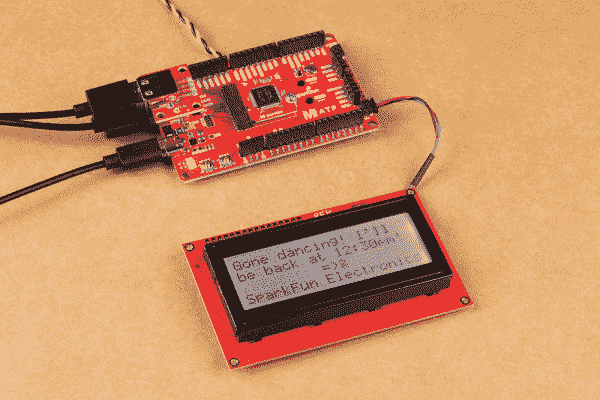](https://cdn.sparkfun.com/assets/learn_tutorials/1/4/0/2/Qwiic_Digital_Desk_Sign_Message_MicroMod_SAMD51.jpg)

使用 d-pad 移动光标并调整消息。

[](https://cdn.sparkfun.com/assets/learn_tutorials/1/4/0/2/Qwiic_Digital_Desk_Sign_Message_Lunch_MicroMod_SAMD51.jpg)

## 示例 2:带 PIR 的 Qwiic 数字桌面标牌

如果您使用外部 5V 墙壁适配器，请确保在将 USB C 电缆插入计算机的 COM 端口以上传项目代码之前将其断开。让我们把一个项目的草图上传到板上。将以下代码复制并粘贴到 Arduino IDE 中。前往**工具** > **板**选择正确的板定义(在这种情况下， **SparkFun MicroMod SAMD51** )。选择板卡枚举到的正确 COM 端口。点击上传。

```
language:c
/******************************************************************************
  Host Keyboard Controller with Qwiic Serial LCD and Qwiic PIR
  Date Modified: 5 Aug 2021
  Modified by
  Ho Yun "Bobby" Chan
  Keyboard Controller Code Originally created 8 Oct 2012
  by Cristian Maglie

  ========== DESCRIPTION==========

  This project code takes input from a USB keyboard with
  the SAMD51's USB host pins and outputs characters to
  the Qwiic RGB Serial Enabled LCD 4x20\. Leave a message
  behind as you walk away from your desk!

  Note: Not all keyboards are compatible. This code was tested on the following
  keyboards.

      - Dell KB216t
      - Logitech K120

  This example also builds off the example from Arduino which
  originally showed the output of a USB Keyboard connected to
  the Native USB port on an Arduino Due (SAMD21) Board.

  http://arduino.cc/en/Tutorial/KeyboardController

  This code is part of the public domain.

******************************************************************************/

#include <KeyboardController.h> // Require keyboard control library
#include <SparkFun_Qwiic_PIR.h>
QwiicPIR pir;

//#include <Wire.h> //Was needed for I2C to SerLCD and Qwiic PIR but it is defined in the Qwiic PIR library so we comment it out

#define SerLCD_Address 0x72  //If using SerLCD with I2C
#define SERIAL_PORT_MONITOR Serial1 //debug via hardware UART pins

//assuming that we are using a SerLCD 20x4 screen
//these variables keep track of cursor location
int row = 0;
int remappedRow = row;
int column = 0;

//depending on what screen you are using, we are counting 0 as well
//int maxRow = 1;     // for 16x2
int maxRow = 3;        //for 20x4
//int maxColumn = 15; // for 16x2
int maxColumn = 19;    //for 20x4

boolean rgb_backlight = true; //used for function keys to immediately turn on/off backlight
boolean blink_box = true; //used to keep track of blink box as a "cursor"

//values to keep track of rgb backlight
int rVal = 157; //128 = Off, 157 = 100%
int gVal = 187; //158 = Off, 187 = 100%
int bVal = 217; //188 = Off, 217 = 100%

//values used to turn off rgb in Power Save Mode
int rVal_OFF = 128;
int gVal_OFF = 158;
int bVal_OFF = 188;

int lcdContrast = 40; //used to keep track of contast: Range is 255 to 0, 40 is default

boolean activity = true; //used to keep track of movement or keyboard presses
const int noActivityMillis = 10000; //used to compare amount of time when no activity to turn of screen
int currentMillis = 0;  //get time based on how long the Arduino has been running
int lastActivityMillis = 0;

// Initialize USB Controller
USBHost usb;

// Attach keyboard controller to USB
KeyboardController keyboard(usb);

//boolean capsLock = false; //used to keep track of capsLock, this is not used in this code
boolean numLock = false; //display numbers if numLock on, we'll assume that the keyboard resets every time so it's off by default

// This function intercepts key press
void keyPressed() {
  SERIAL_PORT_MONITOR.print("Pressed:  ");
  //printKey(); //disabled so we are not sending two key presses to the SerLCD
}

// This function intercepts key release
void keyReleased() {
  SERIAL_PORT_MONITOR.print("Released: ");
  printKey();
}

void printKey() {
  activity = true;

  // getOemKey() returns the OEM-code associated with the key
  int tempKey = keyboard.getOemKey();
  SERIAL_PORT_MONITOR.print(" key:");
  SERIAL_PORT_MONITOR.print(tempKey);

  // getModifiers() returns a bits field with the modifiers-keys
  int mod = keyboard.getModifiers();
  SERIAL_PORT_MONITOR.print(" mod:");
  SERIAL_PORT_MONITOR.print(mod);

  SERIAL_PORT_MONITOR.print(" => ");

  if (mod & LeftCtrl)
    SERIAL_PORT_MONITOR.print("L-Ctrl ");
  if (mod & LeftShift)
    SERIAL_PORT_MONITOR.print("L-Shift ");
  if (mod & Alt)
    SERIAL_PORT_MONITOR.print("Alt ");
  if (mod & LeftCmd)
    SERIAL_PORT_MONITOR.print("L-Cmd ");
  if (mod & RightCtrl)
    SERIAL_PORT_MONITOR.print("R-Ctrl ");
  if (mod & RightShift)
    SERIAL_PORT_MONITOR.print("R-Shift ");
  if (mod & AltGr)
    SERIAL_PORT_MONITOR.print("AltGr ");
  if (mod & RightCmd)
    SERIAL_PORT_MONITOR.print("R-Cmd ");

  // getKey() returns the ASCII translation of OEM key
  // combined with modifiers.
  SERIAL_PORT_MONITOR.write(keyboard.getKey());
  SERIAL_PORT_MONITOR.println();

  /*
    USB SCAN CODES TO KEYCAP (US LAYOUT)
    https://www.win.tue.nl/~aeb/linux/kbd/scancodes-10.html

      CHARACTER KEYS
      USB SCAN CODE = KEYCAP

      4 to 29 = 'a' to 'z' and 'A' to 'Z' with Shift/CapsLock
      30 to 39 = '1' to '9', '0', and '!@#$%^&*()' with Shift
      40 = 'Enter'
      42 = 'Backspace'
      44 = 'Space'
      45 = '-' or '_' with Shift
      46 = '=' or '+' with Shift
      47 = '[' or '{' with Shift
      48 = ']' or '}' with Shift
      49 = '\' or '|' with Shift
      51 = ';' or ':' with Shift
      52 = `'` or '"' with Shift
      53 = '`' or '~' with Shift
      54 = ',' or '<' with Shift
      55 = '.' or '>' with Shift
      56 = '/' or '?' with Shift

      CURSOR CONTROL D-PAD (US LAYOUT)
      79 = `→` (e.g. right)
      80 = `←` (e.g. left)
      81 = `↓` (e.g. down)
      82 = `↑` (e.g. up)

      NUMERIC KEYPAD (US LAYOUT), NUMLOCK MUST BE ENABLED
      83 = 'NumLock'
      84 = '/'
      85 = '*'
      86 = '-'
      87 = '+'
      88 = 'Enter'
      89 = 'End'             or '1' w/ NumLock
      90 = '↓' (e.g. down)   or '2' w/ NumLock
      91 = 'Page Down'       or '3' w/ NumLock
      92 = '←' (e.g. left)   or '4' w/ NumLock
      93 =                      '5' w/ NumLock
      94 = '→' (e.g. right)  or '6' w/ NumLock
      95 = 'Home'             or '7' w/ NumLock
      96 = '↑' (e.g. up)      or '8' w/ NumLock
      97 = 'Page Up'          or '9' w/ NumLock
      98 = 'Insert'           or '0' w/ NumLock
      99 = 'Delete'           or '.' w/ NumLock

      OTHER
      41 = 'Escape'
      73 = 'Insert'
      74 = 'Home'
      75 = 'Page Up'
      76 = 'Delete'
      77 = 'End'
      78 = 'Page Down'

      FUNCTION KEYS
      58 = `F1`
      59 = `F2`
      60 = `F3`
      61 = `F4`
      62 = `F5`
      63 = `F6`
      64 = `F7`
      65 = `F8`
      66 = `F9`
      67 = `F10`
      68 = `F11`
      69 = `F12`

  */

  //----------TYPEWRITER AND KEYPAD KEYS (QWERTY, US LAYOUT) ----------
  if ((tempKey >= 4 && tempKey <= 39) ||
      (tempKey >= 44 && tempKey <= 49) ||
      (tempKey >= 51 && tempKey <= 56) ||
      (tempKey >= 84 && tempKey <= 87) ||
      ((tempKey >= 89 && tempKey <= 97) && numLock == true) ||
      tempKey == 73 ||
      tempKey == 98 ||
      (tempKey == 99 && numLock == true)) {

    Wire.beginTransmission(SerLCD_Address);

    if ( (tempKey == 49) && ((mod == 2) || (mod == 32)) ) {
      //Note: When sending the pipeline character(`|`),
      //we'll need to send 2x since the character
      //is also used as a setting character.
      Wire.write(keyboard.getKey());
      delay(50);//short delay before sending next line
      Wire.write(keyboard.getKey());
    }
    else if ((tempKey == 49) && (mod == 0)) {
      //Note: When sending back slash (`\`),
      //we will load the custom character using
      //printCustomChar() through I2C
      printCustomChar(0);
    }
    else if ( (tempKey == 53) && ((mod == 2) || (mod == 32)) ) {
      //Note: When sending tilde (`~`),
      //we will load the custom character using
      //printCustomChar() through I2C
      printCustomChar(1);
    }
    else if (tempKey == 73) {
      //Note: When sending 'insert',
      //we will load the custom character '♥' using
      //printCustomChar() through I2C
      printCustomChar(2);
    }
    else if (tempKey == 98 && numLock == false) {
      //Note: When sending keypad insert,
      //we will load the custom character '♡' using
      //printCustomChar() through I2C
      printCustomChar(3);
    }
    else {
      Wire.write(keyboard.getKey());
    }

    //after typing the cursor will move automatically to
    //next position so let's keep track of it
    if (column < maxColumn) {
      //if we are not at the end of the row, move cursor to next position
      column = column + 1;
    }
    else {
      //if we are at the end of the row, reset cursor to the beginning of the row
      column = 0;

      if (row < maxRow) {
        //if we are not on the last line, move cursor to the next line
        row = row + 1;
      }
      else {
        //if we are on the last line, move cursor to the first line
        row = 0;
      }
    }

    //remap according to SerLCD's line number
    if (row == 0) {
      remappedRow = 0;
    }
    else if (row == 1) {
      remappedRow = 64;
    }
    else if (row == 2) {
      remappedRow = 20;
    }
    else if (row == 3) {
      remappedRow = 84;
    }

    Wire.write(254); //Send command character
    Wire.write(128 + remappedRow + column); //update cursor position
    Wire.endTransmission(); //Stop I2C transmission

  }

  /*NOTE: These keys move the cursor so it is kept
    as separate condition statements. We will
    also include most of the numLock keys when 'NUMLOCK'
    is disabled.*/
  else if ((tempKey >= 79 && tempKey <= 82) ||
           tempKey == 40 ||
           tempKey == 74 ||
           tempKey == 77 ||
           tempKey == 75 ||
           tempKey == 78 ||
           tempKey == 83 ||
           tempKey == 88 ||
           ((tempKey >= 89 && tempKey <= 97) && numLock == false) ) {

    //move cursor based on d-pad or Enter key

    //----------NUMLOCK KEY----------
    if (tempKey == 83) {
      numLock = !numLock;// change state of numLock if pressed by inverting it
    }

    //----------LEFT KEY----------
    else if ((tempKey == 80) || (tempKey == 92 && numLock == false)) {

      if (column > 0) {
        //if we are at the beginning of the row
        column = column - 1;
      }
      else {
        //if we are at the end of the row
        column = maxColumn;

        if (row > 0) {
          //if we are not on the last line move up a line
          row = row - 1;
        }
        else {
          //if we are on the last line
          row = maxRow;
        }
      }
    }

    //----------RIGHT KEY----------
    else if ( (tempKey == 79) || (tempKey == 94 && numLock == false) ) {

      if (column < maxColumn) {
        //if we are at the before the end of the row
        column = column + 1;
      }
      else {
        //if we are at the end of the row, reset cursor position
        column = 0;

        if (row < maxRow) {
          //move to next line if we are before the last line
          row = row + 1;
        }
        else {
          //move to the first line if we have reached the end
          row = 0;
        }
      }
    }

    //----------UP KEY----------
    else if ( (tempKey == 82) || (tempKey == 96 && numLock == false) ) {
      if (row > 0) {
        //if we are not on the first line
        row = row - 1;
      }
      else {
        //if we are on the first line, move cursor to the last line
        row = maxRow;
      }
    }

    //----------DOWN KEY----------
    else if ( (tempKey == 81) || (tempKey == 90 && numLock == false) ) {
      if (row < maxRow) {
        //if we are not on the first line
        row = row + 1;
      }
      else {
        //if we are on the last line, move cursor to the first line
        row = 0;
      }
    }

    //----------ENTER KEY----------
    else if (tempKey == 40 || tempKey == 88) {
      //move to the first position of the next line
      column = 0;
      if (row < maxRow) {
        //if we are not on the first line, move cursor to the next line
        row = row + 1;
      }
      else {
        //if we are on the last line, move cursor to the first line
        row = 0;
      }
    }

    //----------HOME KEY----------
    else if (tempKey == 74 || (tempKey == 95 && numLock == false) ) {
      //move to the first position of the next line
      column = 0;
    }

    //----------END KEY----------
    else if (tempKey == 77 || (tempKey == 89 && numLock == false)) {
      //move to the first position of the next line
      column = maxColumn;
    }

    //----------PAGE UP KEY----------
    else if (tempKey == 75 || (tempKey == 97 && numLock == false)) {
      //move to the top row
      row = 0;
    }

    //----------PAGE DOWN KEY----------
    else if (tempKey == 78 || (tempKey == 91 && numLock == false)) {
      //move to the bottom row
      row = maxRow;
    }

    else if (tempKey == 93 && numLock == false ) {
      blink_box = !blink_box;// change state of blink_box if pressed by inverting it

      Wire.beginTransmission(SerLCD_Address);
      Wire.write(254); //Send command character

      if (blink_box == false) {
        Wire.write( (1 << 3) | (1 << 2) ); //Cursor off, blinking box off
      }
      else {
        //if blink_box == true

        Wire.write( (1 << 3) | (1 << 2) | (1 << 0) ); //Cursor off, blinking box on
      }

      Wire.endTransmission(); //Stop I2C transmission

    }

    //remap according to SerLCD's line number
    if (row == 0) {
      remappedRow = 0;
    }
    else if (row == 1) {
      remappedRow = 64;
    }
    else if (row == 2) {
      remappedRow = 20;
    }
    else if (row == 3) {
      remappedRow = 84;
    }

    Wire.beginTransmission(SerLCD_Address);
    Wire.write(254); //Send command character
    Wire.write(128 + remappedRow + column); //update cursor position
    Wire.endTransmission(); //Stop I2C transmission

  }

  //----------ESCAPE KEY----------
  else if (tempKey == 41) {
    //Make the escape key clear screen and reset cursor position.
    Wire.beginTransmission(SerLCD_Address);
    Wire.write('|'); //Put LCD into setting mode
    Wire.write('-'); //Send clear display command
    //Control the cursor
    Wire.write(254); //Send command character
    Wire.write( (1 << 3) | (1 << 2) | (1 << 0) ); //Cursor on, blinking box on
    blink_box = true;
    // reset cursor position to (0,0) after using clear display command
    row = 0;
    remappedRow = row;
    column = 0;

    Wire.write(254); //Send command character
    Wire.write(128 + remappedRow + column); //update cursor position
    Wire.endTransmission(); //Stop I2C transmission

  }

  //----------BACKSPACE KEY----------
  else if (tempKey == 42) {
    //Backspace
    //- 'Delete' by replacing with 'Space',
    //- move backward,
    //- then move backward again since cursor moves after sending character

    for (int i = 0 ; i < 2; i++) {

      if (i == 0) {
        //"Delete character" by replacing character with a space
        //and then moving cursor backwards after this condition statement.
        //We do this only once.

        Wire.beginTransmission(SerLCD_Address);
        Wire.write(32); //Send 'Space' Character
        Wire.endTransmission(); //Stop I2C transmission

        //cursor moved automatically to next position so let's keep track of it
        if (column < maxColumn) {
          column = column + 1;
        }
        else {
          column = 0;

          if (row < maxRow) {
            row = row + 1;
          }
          else {
            row = 0;
          }
        }
      }

      //For backspace, we are replacing the current position
      //with a space. This moves the cursor forward once space
      //To correct this, we are going to move backward twice
      //with the help of the for() loop.
      if (column > 0) {
        column = column - 1;
      }
      else {
        column = maxColumn;

        if (row > 0) {
          row = row - 1;
        }
        else {
          row = maxRow;
        }
      }

      //remap according to SerLCD's line number
      if (row == 0) {
        remappedRow = 0;
      }
      else if (row == 1) {
        remappedRow = 64;
      }
      else if (row == 2) {
        remappedRow = 20;
      }
      else if (row == 3) {
        remappedRow = 84;
      }

      Wire.beginTransmission(SerLCD_Address);
      Wire.write(254); //Send command character
      Wire.write(128 + remappedRow + column); //update cursor position
      Wire.endTransmission(); //Stop I2C transmission
      delay(50);

    }//end for() loop for controlling cursor with 'Backspace'
  }//end condition statement for 'Backspace'

  //----------DELETE KEY----------
  else if (tempKey == 76 || (tempKey == 99 && numLock == false) ) {
    //'Delete'
    //- 'Delete' by replacing with 'Space',
    //- move backward again since cursor moves after sending character
    //Note: Delete for the SerLCD is not like the traditional
    //forward delete key. For the SerLCD, we are simply
    //going to delete the character at the cursor position.
    //The characters ahead of the cursor will not be shifted
    //to the left.

    Wire.beginTransmission(SerLCD_Address);
    Wire.write(32); //Send 'Space' Character

    //cursor moved automatically to next position so let's keep track of it
    if (column < maxColumn) {
      column = column + 1;
    }
    else {
      column = 0;

      if (row < maxRow) {
        row = row + 1;
      }
      else {
        row = 0;
      }
    }

    //move cursor back to where it was
    if (column > 0) {
      column = column - 1;
    }
    else {
      column = maxColumn;

      if (row > 0) {
        row = row - 1;
      }
      else {
        row = maxRow;
      }
    }

    //remap according to SerLCD's line number
    if (row == 0) {
      remappedRow = 0;
    }
    else if (row == 1) {
      remappedRow = 64;
    }
    else if (row == 2) {
      remappedRow = 20;
    }
    else if (row == 3) {
      remappedRow = 84;
    }

    Wire.write(254); //Send command character
    Wire.write(128 + remappedRow + column); //update cursor position
    Wire.endTransmission(); //Stop I2C transmission

  }//end condition statement for 'Delete'

  else if (tempKey == 58) {
    //`F1`
    //rVal-

    if (rVal > 128) {
      rVal = rVal - 1;
    }
    else {
      rVal = 128;
    }

    Wire.beginTransmission(SerLCD_Address);
    Wire.write('|'); //Put LCD into setting mode
    Wire.write(rVal); //Update red value
    Wire.endTransmission(); //Stop I2C transmission

  }

  else if (tempKey == 59) {
    //`F2`
    //rVal+

    if (rVal < 157 ) {
      rVal = rVal + 1;
    }
    else {
      rVal = 157;
    }

    Wire.beginTransmission(SerLCD_Address);
    Wire.write('|'); //Put LCD into setting mode
    Wire.write(rVal); //Update red value
    Wire.endTransmission(); //Stop I2C transmission
  }

  else if (tempKey == 60) {
    //`F3`
    //gVal-

    if (gVal > 158 ) {
      gVal = gVal - 1;
    }
    else {
      gVal = 158;
    }

    Wire.beginTransmission(SerLCD_Address);
    Wire.write('|'); //Put LCD into setting mode
    Wire.write(gVal); //Update green value
    Wire.endTransmission(); //Stop I2C transmission

  }

  else if (tempKey == 61) {
    //`F4`
    //gVal+

    if (gVal < 187 ) {
      gVal = gVal + 1;
    }
    else {
      gVal = 187;
    }

    Wire.beginTransmission(SerLCD_Address);
    Wire.write('|'); //Put LCD into setting mode
    Wire.write(gVal); //Update green value
    Wire.endTransmission(); //Stop I2C transmission

  }

  else if (tempKey == 62) {
    //`F5`
    //bVal-

    if (bVal > 188 ) {
      bVal = bVal - 1;
    }
    else {
      bVal = 188;
    }

    Wire.beginTransmission(SerLCD_Address);
    Wire.write('|'); //Put LCD into setting mode
    Wire.write(bVal); //Update blue value
    Wire.endTransmission(); //Stop I2C transmission
  }

  else if (tempKey == 63) {
    //`F6`
    //bVal+

    if (bVal < 217 ) {
      bVal = bVal + 1;
    }
    else {
      bVal = 217;
    }

    Wire.beginTransmission(SerLCD_Address);
    Wire.write('|'); //Put LCD into setting mode
    Wire.write(bVal); //Update blue value
    Wire.endTransmission(); //Stop I2C transmission

  }

  else if (tempKey == 64) {
    //`F7`
    //backlight ON/OFF

    if (rVal == 128 && gVal == 158 &&  bVal == 188)
    { //if all values are off, we will turn it all ON in the next condition statement
      rgb_backlight = 0;
    }
    else {
      //if any of the LEDs is partially on, we will turn it all OFF in the next condition statement
      rgb_backlight = 1;
    }

    if (rgb_backlight == 0)
    { // rgb_backlight == false //OFF, so turn ON

      rgb_backlight = 1;// set it ON
      rVal = 157;
      gVal = 187;
      bVal = 217;

      Wire.beginTransmission(SerLCD_Address);

      Wire.write('|'); //Put LCD into setting mode
      Wire.write(rVal); //Set red backlight

      Wire.write('|'); //Put LCD into setting mode
      Wire.write(gVal); //Set green backlight

      Wire.write('|'); //Put LCD into setting mode
      Wire.write(bVal); //Set blue backlight

      Wire.endTransmission(); //Stop I2C transmission

    }
    else
    { // rgb_backlight == true //ON, so turn OFF

      rgb_backlight = 0;// set it OFF
      rVal = 128;
      gVal = 158;
      bVal = 188;

      Wire.beginTransmission(SerLCD_Address);

      Wire.write('|'); //Put LCD into setting mode
      Wire.write(rVal); //Set red backlight

      Wire.write('|'); //Put LCD into setting mode
      Wire.write(gVal); //Set green backlight

      Wire.write('|'); //Put LCD into setting mode
      Wire.write(bVal); //Set blue backlight

      Wire.endTransmission(); //Stop I2C transmission

    }

  }

  else if (tempKey == 65) {
    //`F8`
    //set custom color, let's set it to cyan (0%, 100%, 100%)

    rVal = 128;
    gVal = 187;
    bVal = 217;

    Wire.beginTransmission(SerLCD_Address);

    Wire.write('|'); //Put LCD into setting mode
    Wire.write(rVal); //Set red backlight

    Wire.write('|'); //Put LCD into setting mode
    Wire.write(gVal); //Set green backlight

    Wire.write('|'); //Put LCD into setting mode
    Wire.write(bVal); //Set blue backlight
    Wire.endTransmission(); //Stop I2C transmission

  }

  else if (tempKey == 66) {
    //`F9`
    //Custom Message 1

    Wire.beginTransmission(SerLCD_Address);
    Wire.write('|'); //Put LCD into setting mode
    Wire.write('-'); //Send clear display command

    // reset cursor position to (0,0) after using clear display command
    row = 0;
    remappedRow = row;
    column = 0;

    if (maxRow == 3 && maxColumn == 19) {
      //Note: We'll send the lines in separate I2C transmissions
      //instead of all at once. Sending several lines freezes the SerLCD.

      Wire.print("Gone dancing! I'll  ");
      Wire.endTransmission(); //Stop I2C transmission
      delay(50);//short delay before sending next line

      Wire.beginTransmission(SerLCD_Address);
      Wire.print("be back at 12:30pm! ");
      Wire.endTransmission(); //Stop I2C transmission
      delay(50);//short delay before sending next line

      Wire.beginTransmission(SerLCD_Address);
      Wire.print("         =)         ");
      Wire.endTransmission(); //Stop I2C transmission
      delay(50);//short delay before sending next line

      Wire.beginTransmission(SerLCD_Address);
      Wire.print("SparkFun Electronics");
      Wire.endTransmission(); //Stop I2C transmission
      delay(50);//short delay before sending next line

      //move cursor position so it's out of the way of the text;
      row = 2;
      remappedRow = 20;
      column = 19;
    }
    else {
      //Note: We'll send the lines in separate I2C transmissions
      //instead of all at once. Sending several lines freezes the SerLCD.

      Wire.print("Gone dancing!   ");
      Wire.endTransmission(); //Stop I2C transmission
      delay(50);//short delay before sending next line

      Wire.beginTransmission(SerLCD_Address);
      Wire.print("BRB at 12:30pm! ");
      Wire.endTransmission(); //Stop I2C transmission
      delay(50);//short delay before sending next line

      //move cursor position so it's out of the way of the text;
      row = 1;
      remappedRow = 64;
      column = 15;
    }

    Wire.beginTransmission(SerLCD_Address);

    Wire.write(254); //Send command character
    Wire.write(128 + remappedRow + column); //update cursor position
    Wire.endTransmission(); //Stop I2C transmission
    delay(50);//short delay before sending next line

  }

  else if (tempKey == 67) {
    //`F10`
    //Custom Message 2

    Wire.beginTransmission(SerLCD_Address);
    Wire.write('|'); //Put LCD into setting mode
    Wire.write('-'); //Send clear display command

    // reset cursor position to (0,0) after using clear display command
    row = 0;
    remappedRow = row;
    column = 0;

    if (maxRow == 3 && maxColumn == 19) {

      //Note: We'll send the lines in separate I2C transmissions
      //instead of all at once. Sending several lines freezes the SerLCD.

      Wire.print("Out for lunch! I'll ");
      Wire.endTransmission(); //Stop I2C transmission
      delay(50);//short delay before sending next line

      Wire.beginTransmission(SerLCD_Address);
      Wire.print("be back at  2:00pm! ");
      Wire.endTransmission(); //Stop I2C transmission
      delay(50);//short delay before sending next line

      Wire.beginTransmission(SerLCD_Address);
      Wire.print("        ^_^         ");
      Wire.endTransmission(); //Stop I2C transmission
      delay(50);//short delay before sending next line

      Wire.beginTransmission(SerLCD_Address);
      Wire.print("SparkFun Electronics");
      Wire.endTransmission(); //Stop I2C transmission
      delay(50);//short delay before sending next line

      //move cursor position so it's out of the way of the text;
      row = 2;
      remappedRow = 20;
      column = 19;
    }
    else {
      //Note: We'll send the lines in separate I2C transmissions
      //instead of all at once. Sending several lines freezes the SerLCD.

      Wire.print("Out for lunch!  ");
      Wire.endTransmission(); //Stop I2C transmission
      delay(50);//short delay before sending next line

      Wire.beginTransmission(SerLCD_Address);
      Wire.print("BRB at  2:00pm! ");
      Wire.endTransmission(); //Stop I2C transmission
      delay(50);//short delay before sending next line

      //move cursor position so it's out of the way of the text;
      row = 1;
      remappedRow = 64;
      column = 15;
    }

    Wire.beginTransmission(SerLCD_Address);

    Wire.write(254); //Send command character
    Wire.write(128 + remappedRow + column); //update cursor position
    Wire.endTransmission(); //Stop I2C transmission
    delay(50);//short delay before sending next line

  }

  else if (tempKey == 68) {
    //`F11`
    //Custom Message 3

    Wire.beginTransmission(SerLCD_Address);
    Wire.write('|'); //Put LCD into setting mode
    Wire.write('-'); //Send clear display command

    // reset cursor position to (0,0) after using clear display command
    row = 0;
    remappedRow = row;
    column = 0;

    if (maxRow == 3 && maxColumn == 19) {

      //Note: We'll send the lines in separate I2C transmissions
      //instead of all at once. Sending several lines freezes the SerLCD.

      Wire.print("In a meeting! I'll  ");
      Wire.endTransmission(); //Stop I2C transmission
      delay(50);//short delay before sending next line

      Wire.beginTransmission(SerLCD_Address);
      Wire.print("be back at  2:00pm! ");
      Wire.endTransmission(); //Stop I2C transmission
      delay(50);//short delay before sending next line

      Wire.beginTransmission(SerLCD_Address);
      Wire.print("                    ");
      Wire.endTransmission(); //Stop I2C transmission
      delay(50);//short delay before sending next line

      Wire.beginTransmission(SerLCD_Address);
      Wire.print("SparkFun Electronics");
      Wire.endTransmission(); //Stop I2C transmission
      delay(50);//short delay before sending next line

      //move cursor position so it's out of the way of the text;
      row = 2;
      remappedRow = 20;
      column = 19;
    }
    else {
      //Note: We'll send the lines in separate I2C transmissions
      //instead of all at once. Sending several lines freezes the SerLCD.

      Wire.print("In a meeting!   ");
      Wire.endTransmission(); //Stop I2C transmission
      delay(50);//short delay before sending next line

      Wire.beginTransmission(SerLCD_Address);
      Wire.print("BRB at  2:00pm! ");
      Wire.endTransmission(); //Stop I2C transmission
      delay(50);//short delay before sending next line

      //move cursor position so it's out of the way of the text;
      row = 1;
      remappedRow = 64;
      column = 15;
    }

    Wire.beginTransmission(SerLCD_Address);

    Wire.write(254); //Send command character
    Wire.write(128 + remappedRow + column); //update cursor position
    Wire.endTransmission(); //Stop I2C transmission
    delay(50);//short delay before sending next line

  }

  else if (tempKey == 69) {
    //`F12`
    //Custom Message 4

    Wire.beginTransmission(SerLCD_Address);
    Wire.write('|'); //Put LCD into setting mode
    Wire.write('-'); //Send clear display command

    // reset cursor position to (0,0) after using clear display command
    row = 0;
    remappedRow = row;
    column = 0;

    if (maxRow == 3 && maxColumn == 19) {

      //Note: We'll send the lines in separate I2C transmissions
      //instead of all at once. Sending several lines freezes the SerLCD.

      Wire.print("Bobby's desk is here");
      Wire.endTransmission(); //Stop I2C transmission
      delay(50);//short delay before sending next line

      Wire.beginTransmission(SerLCD_Address);
      Wire.print("   Working remote!  ");
      Wire.endTransmission(); //Stop I2C transmission
      delay(50);//short delay before sending next line

      Wire.beginTransmission(SerLCD_Address);
      Wire.print(" See you virtually! ");
      Wire.endTransmission(); //Stop I2C transmission
      delay(50);//short delay before sending next line

      Wire.beginTransmission(SerLCD_Address);
      Wire.print("SparkFun Electronics");
      Wire.endTransmission(); //Stop I2C transmission
      delay(50);//short delay before sending next line

      //move cursor position so it's out of the way of the text;
      row = 2;
      remappedRow = 20;
      column = 19;
    }
    else {
      //Note: We'll send the lines in separate I2C transmissions
      //instead of all at once. Sending several lines freezes the SerLCD.

      Wire.print("Bobby's desk is ");
      Wire.endTransmission(); //Stop I2C transmission
      delay(50);//short delay before sending next line

      Wire.beginTransmission(SerLCD_Address);
      Wire.print("here!GoneVirtual");
      Wire.endTransmission(); //Stop I2C transmission
      delay(50);//short delay before sending next line

      //move cursor position so it's out of the way of the text;
      row = 1;
      remappedRow = 64;
      column = 15;
    }

    Wire.beginTransmission(SerLCD_Address);

    Wire.write(254); //Send command character
    Wire.write(128 + remappedRow + column); //update cursor position
    Wire.endTransmission(); //Stop I2C transmission
    delay(50);//short delay before sending next line

  }

  delay(50); //The maximum update rate of OpenLCD is about 100Hz (10ms). A smaller delay will cause flicker

}

//Set Custom Characters for 5x8 Character Position
//'\'
//0x0,0x10,0x8,0x4,0x2,0x1,0x0,0x0
//%0,%10000,%1000,%100,%10,%1,%0,%0
byte back_slash[8] = {
  0b00000,
  0b10000,
  0b01000,
  0b00100,
  0b00010,
  0b00001,
  0b00000,
  0b00000
};

//'~'
//0x0,0x0,0x0,0x8,0x15,0x2,0x0,0x0
//%0,%0,%1000,%10101,%10,%0,%0,%0
byte tilde[8] = {
  0b00000,
  0b00000,
  0b01000,
  0b10101,
  0b00010,
  0b00000,
  0b00000,
  0b00000
};

//'♥'
//0x0,0x0,0xa,0x1f,0x1f,0xe,0x4,0x0
//%0,%0,%1010,%11111,%11111,%1110,%100,%0
byte heart[8] = {
  0b00000,
  0b00000,
  0b01010,
  0b11111,
  0b11111,
  0b01110,
  0b00100,
  0b00000
};

//'♡'
//0x0,0x0,0xa,0x15,0x11,0xa,0x4,0x0
//%0,%0,%1010,%10101,%10001,%1010,%100,%0
byte empty_heart[8] = {
  0b00000,
  0b00000,
  0b01010,
  0b10101,
  0b10001,
  0b01010,
  0b00100,
  0b00000
};

//Given a character number (0 to 7 is valid)
//Given an 8 byte array
//Record this data as a custom character to CGRAM
void loadCustomCharacter(byte charNumber, byte charData[])
{
  if (charNumber > 7) charNumber = 7; //Error correction

  Wire.write('|'); //Send setting character
  Wire.write(27 + charNumber); //27 is the first custom character spot

  for (byte x = 0 ; x < 8 ; x++) //There are 8 bytes of data we need to load
    Wire.write(charData[x]); //Write 8 bytes of graphic data to display
}

//Display a given custom character that was previously loaded into CGRAM
void printCustomChar(byte charNumber)
{
  if (charNumber > 7) charNumber = 7; //Error correction

  Wire.write('|'); //Send setting character
  Wire.write(35 + charNumber); //Tell LCD to display custom char # 0-7
}

void setup() {
  SERIAL_PORT_MONITOR.begin(115200);
  //while (!SERIAL_PORT_MONITOR); // Wait for serial port to connect - used on Leonardo, Teensy and other boards with built-in USB CDC serial connection
  SERIAL_PORT_MONITOR.println("Keyboard Controller Program started");

  if (usb.Init() == -1)
    SERIAL_PORT_MONITOR.println("OSC did not start.");

  delay(3000);//wait a second for the SerLCD to initialize before setting it up

  Wire.begin(); //Join the I2C bus
  Wire.setClock(400000);   // Set clock speed to be the fastest for better communication (fast mode)

  Wire.beginTransmission(SerLCD_Address);
  //Send custom characters to display
  //These are recorded to SerLCD and are remembered even after power is lost
  //There is a maximum of 8 custom characters that can be recorded
  loadCustomCharacter(0, back_slash);
  delay(50);
  loadCustomCharacter(1, tilde);
  delay(50);
  Wire.endTransmission(); //Stop I2C transmission

  Wire.beginTransmission(SerLCD_Address);
  loadCustomCharacter(2, heart);
  delay(50);
  loadCustomCharacter(3, empty_heart);
  delay(50);

  Wire.write('|'); //Put LCD into setting mode
  Wire.write(rVal); //Set red backlight

  Wire.write('|'); //Put LCD into setting mode
  Wire.write(gVal); //Set green backlight

  Wire.write('|'); //Put LCD into setting mode
  Wire.write(bVal); //Set blue backlight

  Wire.endTransmission(); //Stop I2C transmission

  delay(50);//short delay before sending next line

  Wire.beginTransmission(SerLCD_Address);
  Wire.write('|'); //Put LCD into setting mode
  Wire.write('-'); //Send clear display command
  //Control the cursor
  Wire.write(254); //Send command character
  Wire.write( (1 << 3) | (1 << 2) | (1 << 0) ); //Cursor on, blinking box on
  blink_box = true;
  Wire.endTransmission(); //Stop I2C transmission

  delay(50); //short delay before sending next line

  //check if pir will acknowledge over I2C
  if (pir.begin() == false) {
    SERIAL_PORT_MONITOR.println("Device did not acknowledge! Freezing.");
    Wire.beginTransmission(SerLCD_Address);
    Wire.print("PIR !Connected");
    Wire.endTransmission(); //Stop I2C transmission
    while (1);
  }

  SERIAL_PORT_MONITOR.println("PIR acknowledged. Waiting 30 Seconds while PIR warms up");
  Wire.beginTransmission(SerLCD_Address);
  Wire.print("Waiting 30 secs for PIR up");
  Wire.endTransmission(); //Stop I2C transmission
  for (uint8_t seconds = 0; seconds < 30; seconds++)
  {
    SERIAL_PORT_MONITOR.println(seconds);

    delay(1000);
  }

  SERIAL_PORT_MONITOR.println("PIR warm!");

  //Use this function call to change the debounce time of the PIR sensor
  //The parameter is the debounce time in milliseconds
  pir.setDebounceTime(500);

  Wire.beginTransmission(SerLCD_Address);
  Wire.write('|'); //Put LCD into setting mode
  Wire.write('-'); //Send clear display command
  Wire.endTransmission(); //Stop I2C transmission
  delay(50); //short delay before sending next line

  Wire.beginTransmission(SerLCD_Address);
  Wire.write('|'); //Send command character
  Wire.write('/'); //disable system messages since current buffer on the SerLCD does not save what is on screen or custom characters correctly
  Wire.endTransmission(); //Stop I2C transmission
  delay(50); //short delay before sending next line

}

void loop() {
  if (activity == true) {

    lastActivityMillis = millis(); //save time when event occurred

    if (lcdContrast != 5) {

      //turn on screen once
      Wire.beginTransmission(SerLCD_Address);
      //Control the cursor and display
      Wire.write('|'); //Put LCD into setting mode
      Wire.write(24); //Value to change contrast
      Wire.write(5); //Contrast from 255 to 0; 5 is default

      //turn on backlight to previous value
      Wire.write('|'); //Put LCD into setting mode
      Wire.write(rVal); //Set red backlight

      Wire.write('|'); //Put LCD into setting mode
      Wire.write(gVal); //Set green backlight

      Wire.write('|'); //Put LCD into setting mode
      Wire.write(bVal); //Set blue backlight

      Wire.endTransmission(); //Stop I2C transmission

      lcdContrast = 5;
    }
    activity = false; //reset flag
  }
  else {
    //check time to see if we are over 10s
    currentMillis = millis();

    if ( ( currentMillis - lastActivityMillis ) < noActivityMillis ) {
      //do nothing since t < 10s
    }
    else {
      //it's been over 10s then let's turn off screen

      if (lcdContrast != 255) {
        //turn off screen once
        Wire.beginTransmission(SerLCD_Address);
        //display off by turning contrast off
        Wire.write('|'); //Put LCD into setting mode
        Wire.write(24); //Value to change contrast
        Wire.write(255);//Contrast from 255 to 0; 5 is default

        delay(50);

        Wire.write('|'); //Put LCD into setting mode
        Wire.write(rVal_OFF); //Set red backlight

        Wire.write('|'); //Put LCD into setting mode
        Wire.write(gVal_OFF); //Set green backlight

        Wire.write('|'); //Put LCD into setting mode
        Wire.write(bVal_OFF); //Set blue backlight

        Wire.endTransmission(); //Stop I2C transmission
        lcdContrast = 255;
      }
    }
  }

  delay(50);

  // Process USB tasks
  usb.Task();

  //check if there is an available PIR event, and tell us what it is!
  if (pir.available()) {
    if (pir.objectDetected()) {
      SERIAL_PORT_MONITOR.println("Object Detected");
      activity = true;
    }
    if (pir.objectRemoved()) {
      SERIAL_PORT_MONITOR.println("Object Removed");
    }
    pir.clearEventBits();
  }

}

//Given a number, i2cSendValue chops up an integer into four values and sends them out over I2C
void i2cSendValue(int value)
{
  Wire.beginTransmission(SerLCD_Address); // transmit to device #1

  Wire.write('|'); //Put LCD into setting mode
  Wire.write('-'); //Send clear display command

  Wire.endTransmission(); //Stop I2C transmission
} 
```

**Note:** Since we are using the USB pins on the SAMD51 for host mode, you'll notice that port will disappear as it is running the sketch. If you need to upload code again to the board, you will need to [hit the reset button twice to enter bootloader mode](https://learn.sparkfun.com/tutorials/micromod-samd51-processor-board-hookup-guide/uf2-bootloader--drivers) in order to upload code to the SAMD51 again.

### 你应该看到什么

从计算机上拔下 USB 电缆，并将其插入 MicroMod ATP 的主机端口。使用 5V 壁式适配器给主板加电。您应该会看到类似于示例 1b 的内容。但是，只要键盘或动作没有活动，RGB 字符 LCD 就会关闭。这将节省一点电力，并在字符 LCD 亮起并显示自定义消息时吸引某人的注意力。

## 让它变得更好

总有改进的空间。项目完成后，我意识到项目还可以改进。下面列出了未来版本中可能实现的升级和改进。

*   高效 Arduino 代码
    *   在完成了在串行字符 LCD 上显示消息的代码后，我发现还有一个 [SerLCD Arduino 库](https://github.com/sparkfun/SparkFun_SerLCD_Arduino_Library)来控制串行字符 LCD。本教程中使用的示例可以用最新的 SerLCD Arduino 库函数进行更新，以减少代码中的冗余。
    *   我还可以创建模块化函数来移动串行字符 LCD 上的光标，以减少代码中的冗余。
    *   为了使代码更有效，运行速度稍快，并节省处理器上的空间，我可以只在调试代码时使用`#ifdef`的使用`Serial.print()`。代价是这会产生更多的代码行。*显示屏对按钮的按下反应缓慢。调整每个 I ² C 传输之间的延迟并使用 SerLCD Arduino 库可以增加发送的字符数量以提高性能。
*   更多宏以包含更多预定义的消息
    *   预定义的消息仅限于功能键。我可以通过使用按钮组合来包含更多预定义的消息。
*   替代处理器
    *   在编写代码时，唯一拥有 USB 主机的处理器是 MicroMod SAMD51 处理器板。现在，MicroMod Teensy 处理器板已经上市，可以修改代码以使用 [PJRC 的 USB 主机库](https://github.com/PaulStoffregen/USBHost_t36)，它可以有额外的键盘支持。还有 MicroMod RP2040 处理器板也通过[rasbbery Pi Pico SDK](https://github.com/raspberrypi/pico-examples/tree/f800a7e3031e278062639e070c5764adb4a8a0fc#usb-host)提供主机支持。
*   替代显示器
    *   16x2 和 20x4 字符液晶显示器只能在显示屏上显示有限数量的字符。使用与 SparkFun 目录不同的[显示器可以根据显示器的类型留出更多空间来添加更长的消息或添加复杂的动画。](https://www.sparkfun.com/categories/76)

## 解决纷争

**Not working as expected and need help?**

If you need technical assistance and more information on a product that is not working as you expected, we recommend heading on over to the [SparkFun Technical Assistance](https://www.sparkfun.com/technical_assistance) page for some initial troubleshooting.

[SparkFun Technical Assistance Page](https://www.sparkfun.com/technical_assistance)

If you don't find what you need there, the [SparkFun Forums](https://forum.sparkfun.com/index.php) are a great place to find and ask for help. If this is your first visit, you'll need to [create a Forum Account](https://forum.sparkfun.com/ucp.php?mode=register) to search product forums and post questions.

[Create New Forum Account](https://forum.sparkfun.com/ucp.php?mode=register)   [Log Into SparkFun Forums](https://forum.sparkfun.com/index.php)

*   USB 键盘不兼容
    *   并非所有 USB 键盘都与 USBHost Arduino 库兼容。尝试使用不同的键盘。另一种选择是使用 MicroMod Teensy 处理器板，它有额外的键盘支持。

## 资源和更进一步

要了解更多信息，请查看下面关于这个项目的参考资料！

*   [GitHub 回购](https://github.com/bboyho/Qwiic_Digital_Desk_Sign_with_MicroMod)

寻找更多与 USB 主机相关的灵感？尝试用另一个支持 USB 主机的处理器板替换 MicroMod SAMD51 处理器。当然，您需要查看处理器的规格和连接指南，以了解该功能是否可用。举几个例子，Teensy、STM32 和 RP2040 都支持 USB 主机。但是，您需要根据处理器板调整 USB 主机库的代码。或者尝试使用 mbed 的 USB 主机库和 [mbed 入门套件](https://learn.sparkfun.com/tutorials/mbed-starter-kit-experiment-guide/experiment-6-usb-host-and-threading)！

[](https://learn.sparkfun.com/tutorials/mbed-starter-kit-experiment-guide) [### mbed 入门套件实验指南](https://learn.sparkfun.com/tutorials/mbed-starter-kit-experiment-guide) This Experiment Guide will get you started with the wonderful world of mbed microcontrollers. Need to find that next step after mastering the Arduino? This a great place to take those skills to the next level.[Favorited Favorite](# "Add to favorites") 8[](https://learn.sparkfun.com/tutorials/micromod-teensy-processor-hookup-guide) [### MicroMod Teensy 处理器连接指南](https://learn.sparkfun.com/tutorials/micromod-teensy-processor-hookup-guide) Add the processing power and versatility of the Teensy to your MicroMod project following this guide for the SparkFun MicroMod Teensy Processor.[Favorited Favorite](# "Add to favorites") 0[](https://learn.sparkfun.com/tutorials/micromod-rp2040-processor-board-hookup-guide) [### MicroMod RP2040 处理器板连接指南](https://learn.sparkfun.com/tutorials/micromod-rp2040-processor-board-hookup-guide) This tutorial covers the basic functionality of the MicroMod RP2040 Processor Board and highlights the features of the dual-core ARM Cortex-M0+ processors development board. Get started with the first microcontroller from the Raspberry Pi Foundation 0[](https://learn.sparkfun.com/tutorials/micromod-stm32-processor-hookup-guide) [### MicroMod STM32 处理器连接指南](https://learn.sparkfun.com/tutorials/micromod-stm32-processor-hookup-guide) Get started with the MicroMod Ecosystem and the STM32 Processor Board 0************************