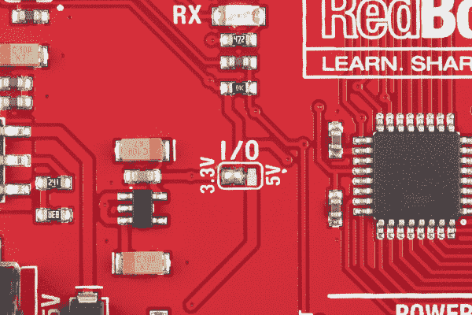

# Qwiic 触觉驱动 DA7280 连接指南

> 原文：<https://learn.sparkfun.com/tutorials/qwiic-haptic-driver-da7280-hookup-guide>

## 介绍

[Qwiic 触觉驱动器](https://www.sparkfun.com/products/17590)包括一个小型线性共振致动器(LRA)振动电机和 Dialog Semiconductor 的 DA7280 电机驱动器 ic，用于需要触觉反馈的应用。还有一个套件，适合那些希望电机与电路板分开安装的用户。请注意，您需要手动将电线和电机焊接到电路板上。

 

将**添加到您的[购物车](https://www.sparkfun.com/cart)中！**

### [SparkFun Qwiic 触觉驱动- DA7280](https://www.sparkfun.com/products/17590)

[In stock](https://learn.sparkfun.com/static/bubbles/ "in stock") ROB-17590

Qwiic 触觉电机驱动器包括一个小型线性谐振驱动器(LRA)振动电机和 DialogSemi 的 DA7280 …

$16.50[Favorited Favorite](# "Add to favorites") 6[Wish List](# "Add to wish list")**** 

将**添加到您的[购物车](https://www.sparkfun.com/cart)中！**

### [SparkFun Qwiic 触觉驱动套件- DA7280](https://www.sparkfun.com/products/18247)

[19 available](https://learn.sparkfun.com/static/bubbles/ "19 available") ROB-18247

Qwiic 触觉电机驱动套件包括一个小型 LRA 振动电机、电线和 Dialog Semi da 728 的分线板…

$17.501[Favorited Favorite](# "Add to favorites") 1[Wish List](# "Add to wish list")**** ****[https://www.youtube.com/embed/ZZUE7G7q8zU/?autohide=1&border=0&wmode=opaque&enablejsapi=1](https://www.youtube.com/embed/ZZUE7G7q8zU/?autohide=1&border=0&wmode=opaque&enablejsapi=1)

### 所需材料

要跟随本教程，您将需要以下材料。你可能不需要所有的东西，这取决于你拥有什么。将它添加到您的购物车，通读指南，并根据需要调整购物车。

 

将**添加到您的[购物车](https://www.sparkfun.com/cart)中！**

### [spark fun RedBoard Qwiic](https://www.sparkfun.com/products/15123)

[In stock](https://learn.sparkfun.com/static/bubbles/ "in stock") DEV-15123

SparkFun RedBoard Qwiic 是一款 Arduino 兼容开发板，内置 Qwiic 连接器，无需…

$21.5014[Favorited Favorite](# "Add to favorites") 49[Wish List](# "Add to wish list")**** 

将**添加到您的[购物车](https://www.sparkfun.com/cart)中！**

### [Qwiic 线缆- 100mm](https://www.sparkfun.com/products/14427)

[In stock](https://learn.sparkfun.com/static/bubbles/ "in stock") PRT-14427

这是一条 100 毫米长的 4 芯电缆，带有 1 毫米 JST 端接。它旨在将支持 Qwiic 的组件连接在一起…

$1.50[Favorited Favorite](# "Add to favorites") 32[Wish List](# "Add to wish list")**** 

将**添加到您的[购物车](https://www.sparkfun.com/cart)中！**

### [SparkFun Qwiic 触觉驱动- DA7280](https://www.sparkfun.com/products/17590)

[In stock](https://learn.sparkfun.com/static/bubbles/ "in stock") ROB-17590

Qwiic 触觉电机驱动器包括一个小型线性谐振驱动器(LRA)振动电机和 DialogSemi 的 DA7280 …

$16.50[Favorited Favorite](# "Add to favorites") 6[Wish List](# "Add to wish list")**** 

将**添加到您的[购物车](https://www.sparkfun.com/cart)中！**

### [可逆 USB A 转可逆 Micro-B 线- 0.8m](https://www.sparkfun.com/products/15428)

[In stock](https://learn.sparkfun.com/static/bubbles/ "in stock") CAB-15428

这些 0.8 米的电缆有微小的，但天才的修改，允许两端插入其端口，不管是什么…

$4.501[Favorited Favorite](# "Add to favorites") 2[Wish List](# "Add to wish list")******** ********### 推荐阅读

如果你不熟悉 Qwiic 系统，我们推荐你在这里阅读[以获得一个概述](https://www.sparkfun.com/qwiic)。

|  |
| *[Qwiic 连接系统](https://www.sparkfun.com/qwiic)* |

如果您不熟悉以下概念，我们也建议您在继续之前先查阅一些教程。虽然下面链接的触觉电机驱动器连接指南在板上使用了不同的 ic，但在教程中有一些关于不同电机的[有用信息。](https://learn.sparkfun.com/tutorials/haptic-motor-driver-hook-up-guide#erm-and-lra-motors)

 [### 脉宽灯](https://learn.sparkfun.com/tutorials/pulse-width-modulation) An introduction to the concept of Pulse Width Modulation.[Favorited Favorite](# "Add to favorites") 46 [### 逻辑电平](https://learn.sparkfun.com/tutorials/logic-levels) Learn the difference between 3.3V and 5V devices and logic levels.[Favorited Favorite](# "Add to favorites") 82 [### I2C](https://learn.sparkfun.com/tutorials/i2c) An introduction to I2C, one of the main embedded communications protocols in use today.[Favorited Favorite](# "Add to favorites") 128 [### 触觉电机驱动器连接指南](https://learn.sparkfun.com/tutorials/haptic-motor-driver-hook-up-guide) Good vibes only. Getting started with the Haptic Motor Driver.[Favorited Favorite](# "Add to favorites") 5

## 硬件概述

### 触觉驱动器和 LRA 电机

触觉驱动器 ic 相对于板旋转 45 °,而圆盘是 LRA 马达。如果您收到了套件版本，电机将需要使用电线焊接到电路板上。请注意，本教程中使用的 Arduino 库根据 LRA 电机的规格配置 DA7280 的设置。

### 电源和逻辑电平

快速制作原型时，我们建议通过 Qwiic 连接器为电路板供电。为了更安全的连接，你可以将[焊接到标有 **3V3/VDD** 和 **GND** 的 PTHs](https://learn.sparkfun.com/tutorials/how-to-solder-through-hole-soldering) 上。使用带微控制器的板时，建议输入电压为 **3.3V** 。然而，如数据手册中所述，您可以在 *2.8V 至 5.5V* 之间为电路板供电。注意 **3V3/VDD** 连接到 **VDDIO** 。如果您决定使用不同的电压，电路板背面有一个跳线来断开输入电压和逻辑电平。如果您决定调整逻辑电平，这通常是 *1.8V* 。但是，只要 **VDDIO** ≤ **VDD** 并且`GPI0`、`GPI1`和`GPI2`没有按照数据表中的建议接地，您就可以在 *1.35V 和 5.5V* 之间设置逻辑电平。

### I ² C

控制 DA7280 和 vibe 电机的主要方法是通过 I ² C 总线。该板包括两个 Qwiic 连接器，用于快速原型制作，无需焊接。您只需将 qw IC 电缆插入 qw IC 连接器，瞧！也可以将[焊接到标为 **SDA** 和 **SCL** 的 PTHs](https://learn.sparkfun.com/tutorials/how-to-solder-through-hole-soldering) 上作为替代。DA7280 的地址是 **0x4A** 。

### 中断

当 DA7280 完成电机驱动时，中断为低电平有效，并通知主机微控制器。这种连接是可选的，对于那些决定在应用程序中包含中断的应用程序来说是可用的。

### PWM 引脚

控制 DA7280 的第二种方法是向`GPI0`引脚发送 PWM 信号。一旦 DA7280 通过 I ² C 配置为 PWM 模式，PWM 信号的占空比将反映在 DA7280 对振动电机的输出驱动上。DA7280 要求 PWM 信号至少为 10kHz。由于引脚周围的可用空间，电路板顶部仅将 PTH 标记为`GPI0`，而电路板背面将引脚标记为`GPI0/PWM`。

### GPI 引脚

**Note:** Before you can operate the board in stand-alone embedded operation, you must configure the DA7280 with a host microcontroller. Once configured, the DA7280 can operate without the need of a host microcontroller.

控制 DA7280 和电机的第三种方法是通过通用输入(GPI)引脚。这些可以配置为基于 DA7280 存储器中存储的引脚和波形组合的边沿触发。

### 发光二极管

该板包括一个 LED 指示灯，当有电源时它会亮起。

### 针织套衫

板子的背面有四根跳线。如需了解更多信息，请查看我们的[教程，了解如何使用跳线焊盘和 PCB 走线](https://learn.sparkfun.com/tutorials/how-to-work-with-jumper-pads-and-pcb-traces/all)，如果您决定用业余爱好刀切割走线。

*   **LED** -连接到电路板顶部的电源 LED。切断它会禁用 LED。
*   **I2C**-I2C 跳线连接到 4.7k &欧姆；I ² C 总线的上拉电阻。大多数时候你可以不去管这些，除非你的项目需要你[断开上拉电阻](https://learn.sparkfun.com/tutorials/i2c/all#i2c-at-the-hardware-level)。
*   **QISO**-QISO 跳线连接到 Qwiic 总线电源线(即 3.3V)。如果您决定在 **3V3/VDD** 上用不同的电压给电路板供电，请切断该迹线以将电源从 Qwiic 端口分开。注意，I ² C 线仍然被上拉至 3.3V
*   **IO**-IO 跳线将 DA7280 的 **3.3V/VDD** 连接到 **VDDIO** 。切断该走线，并为 **VDDIO** 提供不同的电压，以调整 DA7280 的逻辑电平。这通常是 *1.8V* 。但是，只要 **VDDIO** ≤ **VDD** 并且如果 **GPI0** 、 **GPI1** 和 **GPI2** 没有按照数据表中的建议接地，您就可以在 *1.35V 和 5.5V* 之间设置逻辑电平

### 电路板尺寸

主板尺寸为 1.00 英寸 x 1.15 英寸，包括 3 个安装孔。安装孔的间距采用 1.0"x1.0 "尺寸主板的 Qwiic 标准。请注意，电路板一侧较长，以容纳 SMD vibe 电机。

## 硬件装配

DA7280 有三种模式(I ² C、PWM 和独立于 GPI)。在本教程和 Arduino 库的范围内，我们将使用 I ² C 和 PWM 模式。如果您使用 PTHs，我们建议使用[将头部引脚](https://learn.sparkfun.com/tutorials/how-to-solder-through-hole-soldering)或电线焊接到电路板上，以实现安全连接。

### I ² C 模式

控制 DA7280 的主要方法是通过 I ² C 总线。你需要 RedBoard Qwiic 和一根 USB 线来编程微控制器。将 USB 电缆插入 RedBoard。然后在 RedBoard Qwiic 和 Qwiic 触觉驱动器之间插入 Qwiic 电缆。根据您的应用，您也可以焊接到电镀通孔，以实现安全连接。

### PWM 模式

控制 DA7280 的第二种方法是通过 PWM。触觉驱动器 ic 要求提供给`GPI0/PWM`引脚的 PWM 信号频率至少为 10kHz。`analogWrite()`的默认 PWM 方法不提供控制 PWM 信号频率的方法。要将 RedBoard 与 ATmega328P 配合使用，您需要使用 Paul Stoffregen 的 TimerOne Arduino 库，本教程稍后将对此进行说明。请注意，该库仅限于某些电路板。对于 Arduino Uno(例如带有 ATmega328P 的 RedBoard)，为 PWM 预留的引脚在引脚 **9** 和 **10** 上。

在这种情况下，我们将把 Qwiic Haptic 的 **GPIO0/PWM** 引脚连接到 RedBoard 的引脚 **9** 。我们还需要控制 DA7280。确保在电路板之间也包括一根 Qwiic 电缆。

上电之前，您还需要确保切断 red board qw IIC I/O 的走线，并在 3.3V 引脚上添加一个焊接跳线。

### 焊丝

对于那些想要将 LRA 电机与电路板分开安装的人，您需要在 Qwiic 触觉驱动板的齿形引脚之间焊接电线。对于嵌入式连接，我们建议切割公头销并[剥去电线](https://learn.sparkfun.com/tutorials/working-with-wire/how-to-strip-a-wire)。将黑线焊接到最靠近 PWR LED 的齿形引脚(连接到 DA7280 的 OUTN 引脚)。然后将红线焊接到另一个齿形引脚(连接到 DA7280 的 OUTP 引脚)。

切断并剥去电线的另一端。让 LRA 电机的 SMD 焊盘面向您(如下图所示)，将黑线焊接在左侧焊盘上。然后将红线焊接在右侧焊盘上。

如果您决定将接头引脚留在电线上，您的设置将类似于左图。移除接头引脚后，您的设置将类似于右图。为了确保安全连接，您可能需要在端子上添加一些热胶来消除应力。焊接完成后，只需在 qw IC 连接器之间连接一根 qw IC 电缆，或者将焊线连接到您的接头上，如上所述。请记住，如果您决定使用 PWM 模式，您需要将 RedBoard Qwiic 的逻辑电平调整到 3.3V。

|  |  |
| *焊接 M/M 跳线* | *切割 M/M 跳线引脚并焊接电线* |

## Arduino 图书馆

**Note:** This example assumes you are using the latest version of the Arduino IDE on your desktop. If this is your first time using Arduino, please review our tutorial on [installing the Arduino IDE.](https://learn.sparkfun.com/tutorials/installing-arduino-ide) If you have not previously installed an Arduino library, please check out our [installation guide.](https://learn.sparkfun.com/tutorials/installing-an-arduino-library)

spark fun da 7280 Haptic Driver Arduino library 可以通过搜索'**spark fun Qwiic Haptic Driver da 7280**'使用 Arduino library manager 下载，或者您也可以通过从 [GitHub 库](https://github.com/sparkfun/SparkFun_Qwiic_Haptic_Driver_DA7280_Arduino_Library)下载 zip 文件手动安装该库:

[SparkFun DA7280 Haptic Driver Arduino Library (ZIP)](https://github.com/sparkfun/SparkFun_Qwiic_Haptic_Driver_DA7280_Arduino_Library/archive/main.zip)

## 示例 1: I2C 模式

我们只看一下 **I2C 模式的例子。打开**文件** > **实例** > **SparkFun Qwiic 触觉驱动 DA7280 Arduino 库**>**I2C _ 模式**。选择您的主板(在本例中为 **Arduino Uno** )和 COM 端口。然后点击上传按钮。**

一旦上传，Qwiic 触觉驱动应该开始每半秒振动一次。请注意，`hapDrive.setVibrate()`的值范围从`0`到`127`。值`0`关闭电机，而值`127`完全打开电机。尝试将该值调整到更高的强度。如果电机不振动，尝试取消代码注释以清除中断。

**Note:** Make sure to disable the frequency tracking with `hapDrive.enableFreqTrack(false);`. Restricting the PCB (e.g. squeezing) raises an error which stops operation because it can not reach resonance.

## 示例 2: PWM 模式

**Note:** The Haptic Driver IC requires that the PWM signal frequency given to `GPI0/PWM pin` is at least 10kHz. The default PWM methods of `analogWrite()` does not provide a method of controlling the frequency of the PWM signal. To use with the RedBoard with ATmega328P, you will need to use the [TimerOne Arduino Library by Paul Stoffregen](https://www.pjrc.com/teensy/td_libs_TimerOne.html). Note that this library is limited to certain boards. For the Arduino Uno (e.g. the RedBoard with ATmega328P) the PWM pins that are reserved are on pins **9** and **10**.

Since the library version is not included in the Arduino Library Manager, you will need to [manually install](https://www.arduino.cc/en/Guide/Libraries#importing-a-zip-library) the [TimerOne library by Paul Stoffregen](https://github.com/PaulStoffregen/TimerOne) by downloading it from the GitHub repository. In the Arduino IDE's menu, navigate to **Sketch** > **Include Library** > **Add .ZIP Library...**. A window will open up requesting for the ZIP file to be included. Head to the Downloads folder where the **TimerOne-master.zip** is saved.

[GitHub | TimerOne Arduino Library (ZIP)](https://github.com/PaulStoffregen/TimerOne/archive/refs/heads/master.zip)

我们只看 **PWM_Mode_Timer1.ino** 的例子。打开**文件** > **实例** > **SparkFun Qwiic 触觉驱动 DA7280 Arduino 库**>**PWM _ Mode _ timer 1 . ino**。选择您的主板(在本例中为 **Arduino Uno** )和 COM 端口。然后点击上传按钮。

一旦上传，Qwiic 触觉驱动程序将首先清除一个标志，如果 PWM 信号突然切断，而没有设置为非活动模式，则关闭电机。电机将根据`for`回路中的 PWM 信号开始振动。在这种情况下，PWM 信号取决于`power`的值，我们慢慢增加强度。

**Note:** Unlike the RedBoard with ATmega328P that requires the Timer1 library, you can also choose a microcontroller that has the ability to control the frequency of the PWM signal like the Teensy or Artemis. These have more power. For more information, check out the **File** > **Examples** > **SparkFun Haptic Driver Arduino Library** > **PWM_Mode_Teensy_Artemis.ino**.

You will need to [install the Teensyduino](https://learn.sparkfun.com/tutorials/getting-started-with-the-teensy/programming) for Teensy or the [Ambiq Apollo3 board definitions (v2.0.6+)](https://learn.sparkfun.com/tutorials/artemis-development-with-arduino#arduino-installation) for the Artemis if you decide to use the example. Once installed, make sure to select your board and COM port before uploading the example.

## 资源和更进一步

有关 Qwiic 触觉驱动 DA7280 的更多信息，请查看下面的资源。

*   [示意图(PDF)](https://cdn.sparkfun.com/assets/7/f/2/5/3/SparkFun_Qwiic_Haptic_Motor_Driver_DA7280_Schematic.pdf)
*   [老鹰文件(ZIP)](https://cdn.sparkfun.com/assets/c/8/3/b/5/Qwiic_Haptic_Driver_DA7280.zip)
*   [板尺寸(PNG)](https://cdn.sparkfun.com/assets/3/3/6/1/a/Qwiic_Haptic_Motor_Driver_DA7280_Board_Dimensions.png)
*   数据表
    *   [LRA 振动马达(PDF)](https://cdn.sparkfun.com/assets/d/0/4/c/d/G1040003D.pdf)
    *   [DA7280 (PDF)](https://cdn.sparkfun.com/assets/a/e/d/1/9/da7280_datasheet_3v0.pdf)
*   开源代码库
    *   Arduino 图书馆
        *   Paul Stoffregen 的 time rone-如果您在带有 ATmega328P 的 RedBoard 上使用 PWM 模式，则需要该库。
        *   [Qwiic 触觉驱动器 DA7280](https://github.com/sparkfun/DA7280_Haptic_Driver_Arduino_Library)
    *   [硬件回购](https://github.com/sparkfun/Qwiic_Haptic_Driver_DA7280)
*   [产品展示区](https://youtu.be/ZZUE7G7q8zU)

寻找更多关于触觉电机项目想法的信息？查看以下教程。

 [### 触觉电机驱动器连接指南](https://learn.sparkfun.com/tutorials/haptic-motor-driver-hook-up-guide) Good vibes only. Getting started with the Haptic Motor Driver.[Favorited Favorite](# "Add to favorites") 5 [### LilyPad Vibe 板连接指南](https://learn.sparkfun.com/tutorials/lilypad-vibe-board-hookup-guide) The LilyPad Vibe Board is a small vibration motor that can be sewn into projects with conductive thread and controlled by a LilyPad Arduino. The board can be used as a physical indicator on clothing and costumes for haptic feedback.[Favorited Favorite](# "Add to favorites") 3

或者看看这篇博客文章。

 [### 良好的振动(和竞赛)

May 6, 2021](https://www.sparkfun.com/news/3844 "May 6, 2021: Last week we released a great little haptic driver from Dialog Semiconductors. This week I show you how fast and simple it is to build into a potentially job-saving project.
")[Favorited Favorite](# "Add to favorites") 4************