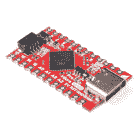
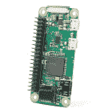

# Qwiic LED 棒- APA102C 连接指南

> 原文：<https://learn.sparkfun.com/tutorials/qwiic-led-stick---apa102c-hookup-guide>

## 介绍

SparkFun Qwiic LED Stick-APA 102 C 简化了使用 spark fun Qwiic 系统向任何 I ² C 项目添加可寻址 LED 控制。该板包括 10 个 APA102 可寻址 led，由板上的 ATTiny85 控制，与 SparkFun Qwiic LED Stick Arduino 库或 Python 包协同工作..

[](https://www.sparkfun.com/products/18354) 

将**添加到您的[购物车](https://www.sparkfun.com/cart)中！**

### [SparkFun Qwiic LED 棒-APA 102 c](https://www.sparkfun.com/products/18354)

[In stock](https://learn.sparkfun.com/static/bubbles/ "in stock") COM-18354

SparkFun Qwiic LED 棒具有 10 个可寻址的 APA102 LEDs，使用 I2C 可以轻松添加全色 LED 控制。

$10.954[Favorited Favorite](# "Add to favorites") 11[Wish List](# "Add to wish list")** **[https://www.youtube.com/embed/NcjTMzVoCg8/?autohide=1&border=0&wmode=opaque&enablejsapi=1](https://www.youtube.com/embed/NcjTMzVoCg8/?autohide=1&border=0&wmode=opaque&enablejsapi=1)

Qwiic LED 棒在设计时就考虑到了制作大型 LED 链，因此只需一个快速的软件命令，您就可以更改 ATTiny85 的 I ² C 地址，这样您就可以在一条总线上控制多达 100 个 LED(10 个 Qwiic LED 棒)!现在，在一个电路中有 100 个 LED 会显著增加驱动它们所需的电流，大多数开发板上的调节器限制在几百 mA，因此我们设计了 Qwiic LED 棒来调整功率输入，以便可以使用专用电源来驱动 LED 棒。

在本教程中，我们将介绍 Qwiic LED 棒上的硬件，如何组装基本电路，最后我们将仔细看看 SparkFun Qwiic LED 棒 Arduino 库和 Python 包，以及其中包含的一些示例。

### 所需材料

为了跟随本教程，你需要一些物品以及 Qwiic LED 棒。

首先，Qwiic LED 棒需要一个控制器，如 Arduino 开发板或单板计算机(SBC ),如 Raspberry Pi，以与板通信。点击下面的按钮，切换到推荐的 Raspberry Pi 和 Qwiic Pi 产品。

Below are a few Arduino development boards SparkFun carries that are Qwiic enabled out of the box:[](https://www.sparkfun.com/products/15795) 

将**添加到您的[购物车](https://www.sparkfun.com/cart)中！**

### [【spark fun Qwiic Pro Micro-USB-C(atmega 32 u 4)](https://www.sparkfun.com/products/15795)

[In stock](https://learn.sparkfun.com/static/bubbles/ "in stock") DEV-15795

SparkFun Qwiic Pro Micro 在小型化的 Arduino bo 上增加了一个重置按钮、Qwiic 连接器、USB-C 和齿形垫…

$21.507[Favorited Favorite](# "Add to favorites") 46[Wish List](# "Add to wish list")****[](https://www.sparkfun.com/products/15123) 

将**添加到您的[购物车](https://www.sparkfun.com/cart)中！**

### [spark fun RedBoard Qwiic](https://www.sparkfun.com/products/15123)

[In stock](https://learn.sparkfun.com/static/bubbles/ "in stock") DEV-15123

SparkFun RedBoard Qwiic 是一款 Arduino 兼容开发板，内置 Qwiic 连接器，无需…

$21.5014[Favorited Favorite](# "Add to favorites") 49[Wish List](# "Add to wish list")****[](https://www.sparkfun.com/products/15444) 

将**添加到您的[购物车](https://www.sparkfun.com/cart)中！**

### [SparkFun RedBoard Artemis](https://www.sparkfun.com/products/15444)

[In stock](https://learn.sparkfun.com/static/bubbles/ "in stock") DEV-15444

RedBoard Artemis 采用 SparkFun 的功能强大的 Artemis 模块，并将其包装在一个易于使用和熟悉的环境中…

$21.509[Favorited Favorite](# "Add to favorites") 32[Wish List](# "Add to wish list")****[](https://www.sparkfun.com/products/15423) 

将**添加到您的[购物车](https://www.sparkfun.com/cart)中！**

### [spark fun Qwiic Micro-samd 21 开发板](https://www.sparkfun.com/products/15423)

[In stock](https://learn.sparkfun.com/static/bubbles/ "in stock") DEV-15423

SparkFun Qwiic Micro 的成型符合我们的标准 1" x 1" Qwiic 板尺寸，这使它成为我们最小的 SAMD21 微控制器…

$22.505[Favorited Favorite](# "Add to favorites") 18[Wish List](# "Add to wish list")****************If your preferred microcontroller does not have a Qwiic connector, you can add one using one of the following products:[](https://www.sparkfun.com/products/14495) 

将**添加到您的[购物车](https://www.sparkfun.com/cart)中！**

### [SparkFun Qwiic 适配器](https://www.sparkfun.com/products/14495)

[In stock](https://learn.sparkfun.com/static/bubbles/ "in stock") DEV-14495

SparkFun Qwiic 适配器提供了将任何旧 I ² C 板改造成支持 Qwiic 的板的完美方法。

$1.601[Favorited Favorite](# "Add to favorites") 53[Wish List](# "Add to wish list")****[](https://www.sparkfun.com/products/14352) 

将**添加到您的[购物车](https://www.sparkfun.com/cart)中！**

### [ArduinoT3 的 SparkFun Qwiic 盾](https://www.sparkfun.com/products/14352)

[In stock](https://learn.sparkfun.com/static/bubbles/ "in stock") DEV-14352

SparkFun Qwiic Shield 是一种易于组装的板，它提供了一种简单的方法来将 Qwiic Connect 系统与

$7.508[Favorited Favorite](# "Add to favorites") 39[Wish List](# "Add to wish list")****[](https://www.sparkfun.com/products/16790) 

将**添加到您的[购物车](https://www.sparkfun.com/cart)中！**

### [SparkFun Qwiic 盾为物加](https://www.sparkfun.com/products/16790)

[In stock](https://learn.sparkfun.com/static/bubbles/ "in stock") DEV-16790

SparkFun Qwiic Shield for Thing Plus 使您可以使用 spark fun 的 Qwiic connect 生态系统和开发板来测试

$4.95[Favorited Favorite](# "Add to favorites") 7[Wish List](# "Add to wish list")****[](https://www.sparkfun.com/products/16789) 

将**添加到您的[购物车](https://www.sparkfun.com/cart)中！**

### [Arduino Nano的 SparkFun Qwiic 盾](https://www.sparkfun.com/products/16789)

[Only 14 left!](https://learn.sparkfun.com/static/bubbles/ "only 14 left!") DEV-16789

用于 Arduino Nano 的 SparkFun Qwiic Shield 使您可以将 SparkFun 的 Qwiic connect 生态系统与开发板一起使用…

$4.95[Favorited Favorite](# "Add to favorites") 12[Wish List](# "Add to wish list")****************If you would prefer to use the Qwiic LED Stick with Python, control the breakout with a single-board computer like the Raspberry Pi's listed below:[](https://www.sparkfun.com/products/15470) 

### [【树莓派零 W】](https://www.sparkfun.com/products/15470)

[Out of stock](https://learn.sparkfun.com/static/bubbles/ "out of stock") DEV-15470

Raspberry Pi Zero W 仍然是你所知道和喜爱的 Pi，但尺寸大大缩小，只有 65 毫米长，30 毫米宽，n…

7[Favorited Favorite](# "Add to favorites") 48[Wish List](# "Add to wish list")[](https://www.sparkfun.com/products/14277) 

### [树莓派零 W](https://www.sparkfun.com/products/14277)

[Out of stock](https://learn.sparkfun.com/static/bubbles/ "out of stock") DEV-14277

Raspberry Pi Zero W 仍然是你所知道和喜爱的 Pi，但尺寸大大缩小，只有 65 毫米长，30 毫米宽，而且…

44[Favorited Favorite](# "Add to favorites") 111[Wish List](# "Add to wish list")[](https://www.sparkfun.com/products/15447) 

### [树莓派 4 型号 B (4 GB)](https://www.sparkfun.com/products/15447)

[Out of stock](https://learn.sparkfun.com/static/bubbles/ "out of stock") DEV-15447

4 GB Raspberry Pi 4 具有运行两个 4k 分辨率显示器的能力，以运行真正的千兆以太网操作，所有…

17[Favorited Favorite](# "Add to favorites") 173[Wish List](# "Add to wish list")[](https://www.sparkfun.com/products/retired/16385) 

### [SparkFun 树莓 Pi 4 桌面套装- 2GB](https://www.sparkfun.com/products/retired/16385)

[Retired](https://learn.sparkfun.com/static/bubbles/ "Retired") KIT-16385

SparkFun Raspberry Pi 4 桌面套件(2GB)包括将任何带 HDMI 端口的显示器变成桌面所需的一切

**Retired**[Favorited Favorite](# "Add to favorites") 2[Wish List](# "Add to wish list")SparkFun offers several options to add Qwiic connectors to single-board computers using the Raspberry Pi's 2x20 header:[](https://www.sparkfun.com/products/14459) 

将**添加到您的[购物车](https://www.sparkfun.com/cart)中！**

### [树莓派的 SparkFun Qwiic 帽子](https://www.sparkfun.com/products/14459)

[In stock](https://learn.sparkfun.com/static/bubbles/ "in stock") DEV-14459

树莓派的 SparkFun Qwiic 帽子是进入 Qwiic 生态系统的最快捷、最简单的方式，并且仍然适用于

$6.505[Favorited Favorite](# "Add to favorites") 33[Wish List](# "Add to wish list")****[](https://www.sparkfun.com/products/15945) 

将**添加到您的[购物车](https://www.sparkfun.com/cart)中！**

### [树莓派的 spark fun Qwiic pHAT v 2.0](https://www.sparkfun.com/products/15945)

[15 available](https://learn.sparkfun.com/static/bubbles/ "15 available") DEV-15945

树莓派的 SparkFun Qwiic pHAT V2 是进入 Qwiic 生态系统和 sti…

$6.952[Favorited Favorite](# "Add to favorites") 32[Wish List](# "Add to wish list")****[](https://www.sparkfun.com/products/15794) 

将**添加到您的[购物车](https://www.sparkfun.com/cart)中！**

### [树莓派的 SparkFun Qwiic 垫片](https://www.sparkfun.com/products/15794)

[In stock](https://learn.sparkfun.com/static/bubbles/ "in stock") DEV-15794

spark fun Qwiic SHIM for Raspberry Pi 是一个小型、易于拆卸的突破，可以轻松地将 qw IIC 连接器添加到您的 Ras…

$1.0512[Favorited Favorite](# "Add to favorites") 18[Wish List](# "Add to wish list")****[](https://www.sparkfun.com/products/15316) 

将**添加到您的[购物车](https://www.sparkfun.com/cart)中！**

### [树莓派的 SparkFun 伺服 pHAT](https://www.sparkfun.com/products/15316)

[In stock](https://learn.sparkfun.com/static/bubbles/ "in stock") DEV-15316

树莓皮的 SparkFun 伺服 pHAT 允许您的树莓皮控制多达 16 个伺服电机在一个简单的方式…

$11.954[Favorited Favorite](# "Add to favorites") 27[Wish List](# "Add to wish list")******** ********除了开发板或 SBC，您还需要至少一根 Qwiic 电缆。SparkFun 提供各种长度和类型的 Qwiic 电缆，如下所示:

[](https://www.sparkfun.com/products/15081) 

将**添加到您的[购物车](https://www.sparkfun.com/cart)中！**

### [SparkFun Qwiic 线缆套件](https://www.sparkfun.com/products/15081)

[In stock](https://learn.sparkfun.com/static/bubbles/ "in stock") KIT-15081

为了更容易上手，我们用 50 毫米到 500 毫米的各种 Qwiic 电缆组装了 Qwiic 电缆套件…

$8.9516[Favorited Favorite](# "Add to favorites") 58[Wish List](# "Add to wish list")****[](https://www.sparkfun.com/products/17259) 

将**添加到您的[购物车](https://www.sparkfun.com/cart)中！**

### [柔性 Qwiic 线缆- 100mm](https://www.sparkfun.com/products/17259)

[In stock](https://learn.sparkfun.com/static/bubbles/ "in stock") PRT-17259

这种极化 I2C 电缆绝缘是由硅制成的，比我们原来的 Qwiic 电缆更灵活，特别是在

$1.60[Favorited Favorite](# "Add to favorites") 8[Wish List](# "Add to wish list")****[](https://www.sparkfun.com/products/14427) 

将**添加到您的[购物车](https://www.sparkfun.com/cart)中！**

### [Qwiic 线缆- 100mm](https://www.sparkfun.com/products/14427)

[In stock](https://learn.sparkfun.com/static/bubbles/ "in stock") PRT-14427

这是一条 100 毫米长的 4 芯电缆，带有 1 毫米 JST 端接。它旨在将支持 Qwiic 的组件连接在一起…

$1.50[Favorited Favorite](# "Add to favorites") 32[Wish List](# "Add to wish list")****[](https://www.sparkfun.com/products/14428) 

### [Qwiic 线缆- 200mm](https://www.sparkfun.com/products/14428)

[Out of stock](https://learn.sparkfun.com/static/bubbles/ "out of stock") PRT-14428

这是一根 200 毫米长的 4 芯电缆，带有 1 毫米 JST 端接。它旨在将支持 Qwiic 的组件连接在一起…

[Favorited Favorite](# "Add to favorites") 21[Wish List](# "Add to wish list")****** ******### 推荐工具

如果您计划在项目中使用多个 Qwiic LED 棒，则需要一些其他工具和硬件来组装和驱动您的电路。您可能已经有了下面推荐的一些产品和工具，因此请根据需要调整您的选择。

如上所述，使用许多 Qwiic LED 棒会消耗大量的电流，而您的微控制器可能无法提供这些电流。我们建议为 LED 棒上的 APA102 LEDs 使用专用电源。根据电路中 led 的估计总电流消耗选择电源。以下是可用于 APA102 LEDs 的几个选项:

[](https://www.sparkfun.com/products/114) 

将**添加到您的[购物车](https://www.sparkfun.com/cart)中！**

### [SparkFun 面包板电源 5V/3.3V](https://www.sparkfun.com/products/114)

[In stock](https://learn.sparkfun.com/static/bubbles/ "in stock") PRT-00114

这是一个非常简单的试验板电源套件，从 DC 壁式电源插座获取电源，并输出可选的 5V 或 3.3V 电源

$11.9516[Favorited Favorite](# "Add to favorites") 60[Wish List](# "Add to wish list")****[](https://www.sparkfun.com/products/15664) 

将**添加到您的[购物车](https://www.sparkfun.com/cart)中！**

### [电源- 12V/5V (2A)](https://www.sparkfun.com/products/15664)

[In stock](https://learn.sparkfun.com/static/bubbles/ "in stock") TOL-15664

这种 2A“笔记本电脑砖”电源输出 5V 和 12v 直流，并终止于 4 针 ATX 连接器。

$11.953[Favorited Favorite](# "Add to favorites") 5[Wish List](# "Add to wish list")****[](https://www.sparkfun.com/products/15352) 

将**添加到您的[购物车](https://www.sparkfun.com/cart)中！**

### [电源- 5V，4A](https://www.sparkfun.com/products/15352)

[In stock](https://learn.sparkfun.com/static/bubbles/ "in stock") TOL-15352

这是专为 SparkFun 电子产品制造的高质量电源，具有很大的功率；5V 和 40 伏时为 20W

$13.95[Favorited Favorite](# "Add to favorites") 12[Wish List](# "Add to wish list")****[](https://www.sparkfun.com/products/retired/14601) 

### [指 LED 开关电源-5v 直流，5A](https://www.sparkfun.com/products/retired/14601)

[Retired](https://learn.sparkfun.com/static/bubbles/ "Retired") TOL-14601

这是一款 40W 单输出开关电源，来自 Mean Well，专为 LED 应用而设计

**Retired**[Favorited Favorite](# "Add to favorites") 8[Wish List](# "Add to wish list")****** ******除了专用电源，你可能还需要一些工具来焊接。如果你需要烙铁或焊接用品，看看下面的工具和用品:

[](https://www.sparkfun.com/products/10242) 

将**添加到您的[购物车](https://www.sparkfun.com/cart)中！**

### [Solder-1/4 磅短管(0.020”)特殊混合](https://www.sparkfun.com/products/10242)

[In stock](https://learn.sparkfun.com/static/bubbles/ "in stock") TOL-10242

我们不想炒作这种焊料太多，但这可能是世界上最好的焊料。好了，我们已经说过了。这…

$32.5014[Favorited Favorite](# "Add to favorites") 17[Wish List](# "Add to wish list")****[](https://www.sparkfun.com/products/14228) 

### [威勒 WLC100 焊台](https://www.sparkfun.com/products/14228)

[Out of stock](https://learn.sparkfun.com/static/bubbles/ "out of stock") TOL-14228

Weller 的 WLC100 是一款多功能的 5 瓦至 40 瓦焊台，非常适合业余爱好者、DIY 爱好者和学生。…

2[Favorited Favorite](# "Add to favorites") 17[Wish List](# "Add to wish list")[](https://www.sparkfun.com/products/9325) 

将**添加到您的[购物车](https://www.sparkfun.com/cart)中！**

### [无铅焊料- 100 克线轴](https://www.sparkfun.com/products/9325)

[In stock](https://learn.sparkfun.com/static/bubbles/ "in stock") TOL-09325

这是带有水溶性树脂芯的无铅焊料的基本线轴。0.031 英寸规格，100 克。这是一个好主意…

$9.957[Favorited Favorite](# "Add to favorites") 33[Wish List](# "Add to wish list")****[](https://www.sparkfun.com/products/14456) 

将**添加到您的[购物车](https://www.sparkfun.com/cart)中！**

### [【烙铁- 60W(可调温度)](https://www.sparkfun.com/products/14456)

[In stock](https://learn.sparkfun.com/static/bubbles/ "in stock") TOL-14456

当你不想倾家荡产，但又需要一个可靠的烙铁时，这个可调节温度的烙铁是一个很好的工具…

$16.5016[Favorited Favorite](# "Add to favorites") 43[Wish List](# "Add to wish list")****** ******### 推荐阅读

如果您不熟悉 Qwiic 系统，我们建议您阅读此处的[以获得概述:](https://www.sparkfun.com/qwiic)

| [](https://www.sparkfun.com/qwiic) |

如果您不熟悉以下教程中的概念，我们还建议您看一看这些教程:

[](https://learn.sparkfun.com/tutorials/how-to-power-a-project) [### 如何为项目提供动力](https://learn.sparkfun.com/tutorials/how-to-power-a-project) A tutorial to help figure out the power requirements of your project.[Favorited Favorite](# "Add to favorites") 67[](https://learn.sparkfun.com/tutorials/logic-levels) [### 逻辑电平](https://learn.sparkfun.com/tutorials/logic-levels) Learn the difference between 3.3V and 5V devices and logic levels.[Favorited Favorite](# "Add to favorites") 82[](https://learn.sparkfun.com/tutorials/i2c) [### I2C](https://learn.sparkfun.com/tutorials/i2c) An introduction to I2C, one of the main embedded communications protocols in use today.[Favorited Favorite](# "Add to favorites") 128[](https://learn.sparkfun.com/tutorials/terminal-basics) [### 串行终端基础知识](https://learn.sparkfun.com/tutorials/terminal-basics) This tutorial will show you how to communicate with your serial devices using a variety of terminal emulator applications.[Favorited Favorite](# "Add to favorites") 46

## 硬件概述

Qwiic LED 棒是一个相当简单的基于 85 的 Qwiic 板，你可能已经很熟悉了。在这一部分，我们将详细介绍板上的硬件。

### 阿蒂 85

Qwiic LED 棒的大脑是我们最喜欢的微控制器之一，ATTiny85。该 IC 预编程有定制固件，旨在与 Arduino 库和我们编写的用于该板的 Python 包进行交互。ATTiny85 接受 I ² C 的读写，解释它们并输出适当的字符串来控制连接到它的任何 APA102 LEDs。

[](https://cdn.sparkfun.com/assets/learn_tutorials/1/8/2/4/Qwiic_LED_Stick-ATTiny84.jpg)

ATTiny85 的默认 I ² C 地址是 **0x23** 。通过 ADR 跳线或软件调整地址。请继续阅读，了解有关以两种方式更改地址的更多信息。

就像我们使用 ATTiny85 的其他 Qwiic 分线点一样，用户可以使用电路板背面的 2x3 引脚接头更新或更改固件。固件可以在[硬件 GitHub 库](https://github.com/sparkfun/SparkFun_Qwiic_LED_Stick/tree/main/Firmware)中找到。关于如何重新编程 ATTiny IC 的提示和技巧，请查看[这篇教程](https://learn.sparkfun.com/tutorials/re-programming-the-lilytiny--lilytwinkle)。

### APA102C 发光二极管

发光二极管棒包括 10 个 APA102C 发光二极管，由上述 ATTiny85 控制。APA102C LEDs 就像大多数可寻址 led 一样通过双线接口工作。该板将该接口连接到 ATTiny85，并在 **3.3V** 逻辑下操作 IC 和 led。有关 led 的具体信息，请查看 [APA102C 数据表](https://cdn.sparkfun.com/assets/d/2/8/7/4/APA102.pdf)。

[](https://cdn.sparkfun.com/assets/learn_tutorials/1/8/2/4/Qwiic_LED_Stick-APA102C.jpg)

该板包括一个标有 **VIN** 的专用电源 PTH 引脚(以及一个备用接地 PTH ),用于为较长的 Qwiic led 棒链或带有额外 LED 条的电路直接供电，这些 LED 棒或电路需要的功率超过了典型微控制器所能提供的功率。通过调整 **VLED** 跳线启用该电源输入。APA102C LED 接受在 **3.0V** 和 **5.5V** 之间的电源电压。

我们还将 LED 控制信号发送到电路板边缘的专用 0.1 英寸间距 PTH 接头，以防您想要在 LED 棒的末端添加另一个 APA102 LED 条。该 PTH 接头在电路板底部有信号标签和丝绸标签，用于协调电线颜色(红色、蓝色、绿色和黄色)，以便轻松匹配标准 APA102 LED 灯条的电线。

### Qwiic 和 I ² C 接口

顾名思义，LED 棒将该板上的 I ² C 接口连接到一对 qw IC 连接器，以便使用 qw IC 系统轻松组装。那些喜欢电路传统焊接连接的人可以使用 I ² C 引脚连接到标准的 0.1 英寸间距 PTH 接头。

[](https://cdn.sparkfun.com/assets/learn_tutorials/1/8/2/4/Qwiic_LED_Stick-Qwiic.jpg)

在默认配置中，3.3V 和 GND 也通过 Qwiic 接口提供，为 ATTiny85 和 APA102C LEDs 供电。

### 焊料跳线

Qwiic LED 棒有四个焊接跳线，标记为 **I2C** 、 **VLED** 、 **ADR** 和 **LED** 。让我们仔细看看它们及其功能。如果您以前从未使用过焊接跳线，或者想要复习一下，请看一下我们的[如何使用跳线焊盘和 PCB 走线](https://learn.sparkfun.com/tutorials/how-to-work-with-jumper-pads-and-pcb-traces)教程。

[](https://cdn.sparkfun.com/assets/learn_tutorials/1/8/2/4/Qwiic_LED_Stick-Jumpers.jpg)

I ² C 跳线通过一对 **4.7k &欧姆将 ATTiny85 上的 SDA/SCL 线拉到**3.3V**；**电阻器。切断三个焊盘之间的走线，禁用这些上拉电阻。推荐做法是在 I ² C 总线上仅启用一对*单*上拉电阻，以避免并联电阻过强导致的通信错误。如果您在一个长链中使用多个 Qwiic LED 棒或其他 I ² C 设备，我们建议禁用所有这些电阻对，只保留一个。

VLED 跳线控制 APA102C LEDs 的输入电压。默认情况下，这种双向跳线将 APA102C VCC 连接到 Qwiic 连接器或标记的 PTH 引脚上提供的 **3.3V** 。对于 Qwiic LED 棒的长链，通过切断中心和 **3.3V** 焊盘之间的迹线并添加一滴焊料来连接中心焊盘和 **VCC** 侧，将该跳线切换到 **VCC** 侧。调整完毕后，将 **3.0V** 和 **5.5V** 之间的独立电压连接到 **VIN** PTH 引脚，为电路供电。当处于 **VIN** 位置时，电路板连接一个 **4.7 F** 去耦电容，以帮助平滑提供给 led 的电源。

**Note:** The VLED jumper isolates the voltage input from the **3.3V** used to power the ATTiny85\. When using the **VIN** PTH pin to power the LEDs, make sure to provide power to the ATTiny85 either via the Qwiic interface or over the **3.3V** PTH pin.

ADR 跳线通过硬件调整设置 ATTiny85 的 I ² C 地址，默认为**开启**。打开时，ATTiny85 的地址被设置为 **0x23** 。关闭该跳线将地址调整为 **0x22** 。

LED 跳线通过一个 **1k &欧姆将阳极连接到 **3.3V** 来控制电路板的电源 LED；**电阻器。跳线默认为**关闭**。如果需要，切断两个焊盘之间的走线以禁用电源指示灯。

### 电路板尺寸

Qwiic LED 棒的尺寸为 1.00 英寸 x 3.60in 英寸(25.4 毫米 x 91.44mm 毫米)，带有四个安装孔，可安装一个 [4-40 螺钉](https://www.sparkfun.com/products/10453)。

[](https://cdn.sparkfun.com/assets/learn_tutorials/1/8/2/4/Qwiic_LED_Stick-Dimensions.png)

## 硬件装配

使用 qw IC 系统组装一个基本的 qw IC LED 棒电路很容易，因此我们将介绍这种组装，以及组装一大串 qw IC LED 棒或在棒的末端使用其他 APA102Cs 时需要注意的一些事项。

### 基本 Qwiic/I ² C 组件

对于一个基本的 Qwiic LED 棒电路，你只需要用 Qwiic 电缆将两块电路板插在一起。

[](https://cdn.sparkfun.com/assets/learn_tutorials/1/8/2/4/Qwiic_LED_Stick_Hookup_Guide-03.jpg)

### 多个 Qwiic LED 棒和 APA102C 扩展

如果用户希望将多个 Qwiic LED 棒连接在一起，或者甚至将外部 APA102C LED 条连接到电路板侧面的 LED PTH 接头，则需要进行一些小的焊接装配以及调整焊接跳线。

首先，考虑 LED 棒链将拉动的最大电流。在全功率下，每个 APA102C 在全亮度下设置为白色(全红色、绿色和蓝色)时可以消耗多达 **40mA** 的电流，因此我们建议在连接 LED 棒长链(或添加额外的 LED 条)之前测试 LED 链的电流消耗，以避免损坏您的控制器。在我们的测试中，当所有 10 个 led 以全亮度和白色运行时，该条仅消耗了 **~65mA@3.3V** ，因此您应该可以安全地从您的微控制器为其中一些供电，但请注意，大多数 qw IC 开发板使用 **3.3V/600mA** 调节器为连接到 qw IC 连接器的设备供电。

有关构建 APA102 led 电路的详细组装说明和技巧，请查看我们的 APA102 可寻址 LED 连接指南:

[APA102 Addressable LED Hookup Guide - Hardware Assembly](https://learn.sparkfun.com/tutorials/apa102-addressable-led-hookup-guide/all#hardware-hookup)

如果使用单独的电源给 LED 供电，将 **VLED** 跳线调整到 **VIN** 侧，并将 **3.0** 到 **5.5** 之间的电源电压连接到能够提供足够电流给 LED 链供电的 **VIN** 和 **GND** 引脚。完成电源连接后，使用 qw IC 电缆或 I ² C PTH 引脚将 Qwiic LED 棒插入控制器。

现在我们的 Qwiic LED 棒电路已经组装好了，让我们来看看我们用来通过 I ² C 控制它们的软件包。

## Qwiic LED 棒 Arduino 库

**Note:** This library assumes you are using the latest version of the Arduino IDE on your desktop. If this is your first time using Arduino, please review our tutorial on [installing the Arduino IDE.](https://learn.sparkfun.com/tutorials/installing-arduino-ide) If you have not previously installed an Arduino library, please check out our [installation guide.](https://learn.sparkfun.com/tutorials/installing-an-arduino-library)

SparkFun Qwiic LED 棒 Arduino 库使控制 LED 棒变得简单，只需发送带有三个 RGB 值的命令`setLEDColor()`来设置颜色，以及一系列其他功能来控制 LED 棒。通过在 Arduino Library manager 中搜索**“spark fun Qwiic LED Stick”**来安装库。喜欢手动安装的用户可以从 [GitHub 库](https://github.com/sparkfun/SparkFun_Qwiic_LED_Stick_Arduino_Library)获得这个库，或者点击下面的按钮下载 ZIP 文件:

[SparkFun Qwiic LED Stick Arduino Library (ZIP)](https://github.com/sparkfun/SparkFun_Qwiic_LED_Stick_Arduino_Library/archive/refs/heads/master.zip)

### 库函数

下面的列表概述了 Qwiic LED 棒库中所有可用的功能，并简要描述了它们的功能。

#### 班级

在全局范围内构造`LED`对象。示例使用`LEDStick`作为 Qwiic LED 棒对象。

*   `LED LEDStick;`

#### 设备设置和设置

*   `bool begin(uint8_t address, TwoWire &wirePort);` -在选定端口的指定地址初始化 LED 棒。如果留空，将使用默认地址并使用导线。
*   `bool isConnected();` -检查 LED 棒是否连接到指定地址的端口。

#### LED 控制

*   `bool setLEDColor(uint8_t number, uint8_t red, uint8_t green, uint8_t blue);` -使用 0 到 255 之间的 RGB 值设置所选 LED 的颜色。如果没有选择 LED，所有 LED 都设置为指定的颜色。例如，为了将第四个 LED 设置为黄色，命令将是`LEDStick.setLEDColor(4, 0, 255, 255);`。
*   `bool setLEDBrightness(uint8_t number, uint8_t brightness);` -设置所选 LED 的亮度。如果没有选择 LED，则调整所有 LED。可接受的值是 0 到 31。将 LED 设置为`0`会将其关闭，但会保存存储的颜色值。
*   `bool LEDOff(void);` -将 Qwiic LED 棒中的所有 LED 设置为关闭。
*   `bool changeAddress(uint8_t newAddress);` -更改 ATTiny85 的 I ² C 地址。请输入有效的地址。注意一旦地址改变，LED 棒必须用新地址初始化。例如，使用`LEDStick.begin(0x70);`初始化地址为 0x70 的 Qwiic LED 棒。
*   `bool changeLength(uint8_t newLengths);` -改变链中 led 的数量。在电路中添加另一个 Qwiic LED 棒或其他可寻址 LED 条时使用。默认值为 10。最大值为 100。

## Arduino 示例

Qwiic LED 棒 Arduino 库包括 11 个示例，帮助您了解电路板的基础知识，以及一些漂亮的照明演示。在这一节中，我们将看一些例子，并探索它们是如何工作的。

在我们进入示例之前，让我们仔细看看所有示例使用的设置。代码初始化串行和有线端口，并通过 I ² C:

```
language:c
Wire.begin();
Serial.begin(115200);

if (LEDStick.begin() == false){
    Serial.println("Qwiic LED Stick failed to begin. Please check wiring and try again!);
    while(1);
} 
```

您可以打开 Arduino [串行监视器](https://learn.sparkfun.com/tutorials/terminal-basics)，将波特率设置为 **115200** ，查看代码的任何串行打印输出。如果 Qwiic LED 棒未能在默认地址的总线上初始化，代码将冻结。出现这种情况的两个最常见的原因是设备和控制器之间的连接不良，或者 Qwiic LED 棒的 I ² C 地址与默认值不匹配。

### 示例 1 -眨眼

这个基本的例子展示了如何初始化 LED 棒，同时控制棒上的 LED。通过导航到**文件>示例>spark fun Qwiic LED Stick Arduino 库> Example01_Blink** 打开示例。打开示例后，选择正确的板(在我们的例子中是 SparkFun RedBoard)和它枚举的端口。接下来，点击上传，如果没有任何错误，您应该看到所有十个 led 设置为相同的颜色(白色)，每秒打开和关闭。

尝试调整该行中的值来更改颜色:

```
language:c
LEDStick.setLEDColor(50, 50, 50); 
```

### 示例 3 -单个像素 2

第三个创建三个数组来设置每个 LED 的红色、绿色和蓝色值。在全局类中，代码为红色、蓝色和绿色创建一个数组，并为每个像素设置任意值。

```
language:c
//           Pixel#     1    2    3    4    5    6    7    8    9   10
byte redArray[10]   = {214,  78, 183, 198,  59, 134,  15, 209, 219, 186}; //r
byte greenArray[10] = { 59, 216, 170,  21, 114,  63, 226,  92, 155, 175}; //g
byte blueArray[10]  = {214, 147,  25, 124, 153, 163, 188,  33, 175, 221}; //b 
```

在设置了三个数组并初始化 LED 棒后，代码将像素设置为数组中相应条目的颜色值。

```
language:c
LEDStick.setLEDColor(redArray, greenArray, blueArray, 10); 
```

例如，第四个 LED 应该与阵列中第四个条目的 RGB 值的颜色(粉色/洋红色)相匹配。

### 示例 4 -设置亮度

第四个示例逐步完成了`setLEDBrightness();`功能的所有有效亮度设置，将每个 LED 设置为不同的彩虹色(加上白色),这样您可以快速了解每种颜色在每种亮度水平下的外观。

就像示例 3 一样，代码为红色、蓝色和绿色创建了三个数组，并为每个 LED 赋值。初始化 LED 棒后，主循环每秒遍历一次每个亮度值，并通过串行打印输出亮度值:

```
language:c
for (byte i = 0; i < 32; i++) {
    LEDStick.setLEDBrightness(i);
    Serial.print("Brightness level: ");
    Serial.println(i);
    delay(1000);
} 
```

这些例子完善了 Qwiic LED 棒库的大部分基础知识。其他的包括一些很酷的效果演示，你可以用 Qwiic led 棒来改变 I ² C 地址和 LED 的长度，当使用一个命令而不是指向一个特定的 LED 像素时。在 Arduino IDE 或[库 GitHub 库](https://github.com/sparkfun/SparkFun_Qwiic_LED_Stick_Arduino_Library/tree/master/examples)中查看它们。

## Qwiic LED 棒 Python 包

**Note:** This package and the included examples assume you are using the latest version of Python 3\. If this is your first time using Python or I²C hardware on a Raspberry Pi, these tutorial can help you get started:

*   [用树莓 Pi 进行 Python 编程](https://learn.sparkfun.com/tutorials/python-programming-tutorial-getting-started-with-the-raspberry-pi)
*   [树莓派 SPI 和 I2C 教程](https://learn.sparkfun.com/tutorials/raspberry-pi-spi-and-i2c-tutorial)

Qwiic LED Python 包是 Arduino 库的一个端口，供喜欢将该板与 Raspberry Pi 一起使用的用户使用。Python 端口包括与 Arduino 库相同的 11 个示例，让您从简单地打开 led 灯到创建一些漂亮的灯光显示开始。

该包托管在 PyPi 上，使用命令界面中的简单命令，使安装变得快速而轻松。如果你喜欢手动安装这个包，你可以在 [GitHub 库](https://github.com/sparkfun/Qwiic_LED_Stick_Py)上找到它，或者点击下面的按钮下载它的 ZIP 文件:

[Download the SparkFun Qwiic LED Stick Python Package (ZIP)](https://github.com/sparkfun/Qwiic_LED_Stick_Py/archive/refs/heads/main.zip)

(**请注意这个包依赖于 [Qwiic I2C 驱动](https://github.com/sparkfun/Qwiic_I2C_Py)。您也可以查看位于[的知识库文档页面，阅读文档](https://qwiic-led-stick-py.readthedocs.io/en/latest/?)。*)

### Qwiic LED 棒 Py 安装

让我们来看看 Qwiic LED Stick Python 包的两种安装方法。

**注意:**不要忘记仔细检查硬件 I ² C 连接是否在你的 Raspberry Pi 或者其他单板电脑上启用。上文中链接的树莓 Pi 教程介绍了如何启用 Pi 的 I ² C 总线。

#### PyPi 安装

在 PyPi 上托管包使得通过`pip3`在支持 PyPi 安装的系统上安装变得简单(对于 Python 2 使用`pip`)。打开命令界面，输入以下命令:

对于**所有用户**(该用户必须拥有 **[须户](https://en.wikipedia.org/wiki/Sudo)** 权限)的权限):

```
language:bash
sudo pip3 install sparkfun-qwiic-led-stick 
```

对于**当前用户**:

```
language:bash
pip3 install sparkfun-qwiic-led-stick 
```

#### 本地安装

对于本地安装，请遵循以下说明。确保在安装 Qwiic LED 棒组件之前安装`setuptools`组件。

在命令行使用该命令直接安装(对于 Python 2 使用`python`):

```
language:bash
python3 setup.py install 
```

构建一个与`pip3`一起使用的包:

```
language:bash
python setup.py sdist 
```

该命令构建并放置一个名为“dist”的子目录。切换到新的子目录，使用`pip3`命令安装 Qwiic LED 棒包(确保填写正确的版本号):

```
language:bash
cd dist
pip3 install sparkfun_qwiic_led_stick-<version>.targ.gz 
```

### Qwiic LED 棒 Python 包操作

在 [ReadtheDocs](https://qwiic-led-stick-py.readthedocs.io/en/latest/?) 上有 Qwiic LED 棒 Py 中包含的所有功能的完整概述。你也可以看看[的源代码](https://github.com/sparkfun/Qwiic_LED_Stick_Py/blob/main/qwiic_led_stick.py)。

### 升级 Qwiic LED Stick Python 包

如果将来软件包更新，您可能需要升级它。使用以下命令升级软件包:

对于**所有用户**(用户必须拥有 **[须户](https://en.wikipedia.org/wiki/Sudo)** 权限):

```
language:bash
sudo pip3 install --upgrade sparkfun-qwiic-led-stick 
```

对于**当前用户**:

```
language:bash
pip3 install --upgrade sparkfun-qwiic-led-stick 
```

## Python 示例

Qwiic LED Stick Python 包包括 11 个示例，从入门到一些漂亮的演示。在这一节中，我们将仔细看看几个例子以及它们的作用。

就像在 Arduino 库中一样，每个示例都创建了`my_stick`对象，并包含一个 begin 语句，该语句初始化 I ² C 总线上的 Qwiic LED 棒，并在失败时冻结代码:

```
language:python
my_stick = qwiic_led_stick.QwiicLEDStick()

if my_stick.begin() == False:
    print("\nThe Qwiic LED Stick isn't connected to the sytsem. Please check your connection", \
        file=sys.stderr)
    return
print("\nLED Stick ready!") 
```

如果您的代码在这里冻结，请仔细检查 I ² C 总线是否在您的 Pi 上启用，以及您的 Qwiic LED 棒是否正确连接。通过 ADR 跳线调整地址或通过示例 10 -更改地址更改地址需要在此处的对象创建中输入新地址:

```
language:python
my_stick = qwiic_led_stick.QwiicLEDStick(NEW ADDRESS HERE) 
```

### 示例 1 -眨眼

第一个例子演示了所有十个 led 的标准“闪烁”。在初始化总线上的 LED 棒后，代码将亮度设置为大约 50%，这样我们就不会在观看超高亮白色 LED 时灼伤视网膜。

之后，代码将 led 的颜色设置为全白，并每秒钟闪烁一次:

```
language:python
my_stick.set_all_LED_color(50, 50, 50)
time.sleep(1)
my_stick.LED_off()
time.sleep(1) 
```

### 示例 3 -单个像素 2

这个例子创建了三个列表，每个列表 10 个，为棒上的每个 LED 设置红色、绿色和蓝色值，然后使用`set_all_LED_unique_color()`函数来设置每个 LED 的颜色。

尝试使用每个列表中的值来切换 led 的颜色:

```
language:python
red_list = [214, 78, 183, 198, 59, 134, 15, 209, 219, 186]
green_list = [59, 216, 170, 21, 114, 63, 226, 92, 155, 175]
blue_list = [214, 147, 25, 124, 153, 163, 188, 33, 175, 221] 
```

### 示例 4 -设置亮度

我们在这里讨论的最后一个例子演示了如何设置 LED 棒的亮度。第一个示例使用了函数的基本形式，因此您可能已经很熟悉了。此示例将 led 设置为彩虹，并逐步执行每个有效的亮度设置，以便让您清楚了解每种颜色在每个亮度级别下的外观，从而找出最适合您项目的颜色。

```
language:python
for i in range(0, 32):
    my_stick.set_all_LED_brightness(i)

    print("\nBrightness level: " + str(i))
    time.sleep(1) 
```

其他示例展示了一些简洁的照明显示，以及如何更改 I ² C 地址、调整受控 led 的总数以添加其他 LED 棒或 LED 条。

## 解决纷争

在本节中，我们将针对您在使用 Qwiic LED 棒时可能遇到的常见问题概述一些故障排除技巧。

### 软件提示

确保在使用多个 Qwiic LED 棒时，将每个电路板设置为唯一的 I ² C 地址。通过打开 ADR 跳线或使用来自 [Arduino 库](https://github.com/sparkfun/SparkFun_Qwiic_LED_Stick_Arduino_Library/blob/master/examples/Example10_ChangeAddress/Example10_ChangeAddress.ino)或 [Python 包](https://github.com/sparkfun/Qwiic_LED_Stick_Py/blob/main/examples/qwiic_led_stick_ex10_change_address.py)的地址示例来调整地址。

此外，使用 [Arduino 库](https://github.com/sparkfun/SparkFun_Qwiic_LED_Stick_Arduino_Library/blob/master/examples/Example09_ChangeLength/Example09_ChangeLength.ino)和 [Python 包](https://github.com/sparkfun/Qwiic_LED_Stick_Py/blob/main/examples/qwiic_led_stick_ex9_change_length.py)中的改变长度示例，更新您的 led 链中的新数量。请注意，默认固件将 led 的最大数量限制为 100 个。

### 电源提示

当使用许多 LED 时(多个 Qwiic LED 棒或一个额外的 LED 条)，请确保考虑您的 LED 链的总电流消耗。如果总电流消耗超出您选择的控制器的 **3.3V** 调节器容量的限制(大多数 SparkFun Qwiic 板的最大输出为 **600mA@3.3V** ，调整 **VLED** 跳线以将 LED 与电路的其余部分隔离，并通过 **VIN** PTH 引脚使用单独的电压输入。将 **3.3V** 连接到 **5.5V** 电源，该电源能够提供足够的电流来驱动串中的 APA102 LEDs。

当使用连接到 **VIN** 的外部电源时，无需添加去耦电容，因为当 **VLED** 跳线被调整为使用该引脚为 LED 供电时，电路板包括一个与 **VIN** 和地并联的 **4.7 F** 电容。

### 常规故障排除

如果您需要技术帮助和更多关于 Qwiic LED 棒或其他 SparkFun 产品的信息，而这些产品并没有如您预期的那样工作，我们建议您前往 SparkFun 技术帮助页面进行一些初步的故障排除。

[SparkFun Technical Assistance Page](https://www.sparkfun.com/technical_assistance)

如果你没有找到你需要的，SparkFun 论坛是一个寻找和寻求帮助的好地方。如果这是你第一次访问，你需要[创建一个论坛账户](https://forum.sparkfun.com/ucp.php?mode=register)来搜索产品论坛和发布问题。

[Create New Forum Account](https://forum.sparkfun.com/ucp.php?mode=register)   [Log Into SparkFun Forums](https://forum.sparkfun.com/index.php)

## 资源和更进一步

这就结束了 Qwiic LED 棒的教程。有关主板的更多信息，请查看以下资源:

*   [示意图(PDF)](https://cdn.sparkfun.com/assets/b/c/9/c/1/Qwiic_LED_Stick_-_Schematic.pdf)
*   [老鹰文件(ZIP)](https://cdn.sparkfun.com/assets/2/0/8/b/2/Qwiic_LED_Stick.zip)
*   [尺寸图(PNG)](https://cdn.sparkfun.com/assets/learn_tutorials/1/8/2/4/Qwiic_LED_Stick-Dimensions.png)
*   [数据表- APA102C (PDF)](https://cdn.sparkfun.com/datasheets/Components/LED/APA102C.pdf)
*   [硬件 GitHub 库](https://github.com/sparkfun/SparkFun_Qwiic_LED_Stick)
*   [Qwiic LED 棒 Arduino 库](https://github.com/sparkfun/SparkFun_Qwiic_LED_Stick_Arduino_Library)
*   [Qwiic LED 棒 Python 包](https://github.com/sparkfun/Qwiic_LED_Stick_Py)
*   [Qwiic 信息页面](https://www.sparkfun.com/qwiic)

想从 Qwiic LED 棒的 LED 项目中获得一些灵感，请看以下教程:

[](https://learn.sparkfun.com/tutorials/das-blinken-top-hat) [### 闪烁的顶部](https://learn.sparkfun.com/tutorials/das-blinken-top-hat) A top hat decked out with LED strips makes for a heck of a wedding gift.[Favorited Favorite](# "Add to favorites") 1[](https://learn.sparkfun.com/tutorials/interactive-led-music-visualizer) [### 交互式 LED 音乐可视化器](https://learn.sparkfun.com/tutorials/interactive-led-music-visualizer) Use an Arduino and the SparkFun Sound Detector to create visualizations on Addressable RGB LED strips.[Favorited Favorite](# "Add to favorites") 27[](https://learn.sparkfun.com/tutorials/led-cloud-connected-cloud) [### LED 云-连接云](https://learn.sparkfun.com/tutorials/led-cloud-connected-cloud) Make an RGB colored cloud light! You can also control it from your phone, or hook up to the weather 31[](https://learn.sparkfun.com/tutorials/led-crystal-goddess-crown) [### LED 水晶女神皇冠](https://learn.sparkfun.com/tutorials/led-crystal-goddess-crown) Follow this tutorial to make your own Crystal Goddess Crown with LEDs 6[](https://learn.sparkfun.com/tutorials/lumini-ring-hookup-guide) [### LuMini 环连接指南](https://learn.sparkfun.com/tutorials/lumini-ring-hookup-guide) The LuMini Rings (APA102-2020) are the highest resolution LED rings available.[Favorited Favorite](# "Add to favorites") 6[](https://learn.sparkfun.com/tutorials/lumini-8x8-matrix-hookup-guide) [### LuMini 8x8 矩阵连接指南](https://learn.sparkfun.com/tutorials/lumini-8x8-matrix-hookup-guide) The LuMini 8x8 Matrix (APA102-2020) are the highest resolution LED matrix available.[Favorited Favorite](# "Add to favorites") 6[](https://learn.sparkfun.com/tutorials/lumidrive-hookup-guide) [### LumiDrive 连接指南](https://learn.sparkfun.com/tutorials/lumidrive-hookup-guide) The LumiDrive LED Driver is SparkFun’s foray into all things Python on micro-controllers. With the SparkFun LumiDrive you will be able to control and personalize a whole strand of APA102s directly from the board itself.[Favorited Favorite](# "Add to favorites") 5

或者看看下面的一些博客帖子来寻找灵感:

[](https://www.sparkfun.com/news/2497 "October 10, 2017: If the spooky messages you’re getting from beyond the grave seem vague and disjointed to you, maybe some blinky lights can help to accent the important parts. #funkydemonspeak") [### 用一个发光的会说话的头骨刺穿万圣节的面纱

October 10, 2017](https://www.sparkfun.com/news/2497 "October 10, 2017: If the spooky messages you’re getting from beyond the grave seem vague and disjointed to you, maybe some blinky lights can help to accent the important parts. #funkydemonspeak")[Favorited Favorite](# "Add to favorites") 1[](https://www.sparkfun.com/news/2646 "March 26, 2018: Waking up is the worst. Let's try and make it a little easier on ourselves.") [### DIY 日出闹钟

March 26, 2018](https://www.sparkfun.com/news/2646 "March 26, 2018: Waking up is the worst. Let's try and make it a little easier on ourselves.")[Favorited Favorite](# "Add to favorites") 4[](https://www.sparkfun.com/news/2693 "May 23, 2018: Let's figure out just how fast we can push data through APA102 pixels. Then let's look at what we can do with super fast lights.") [### Wedginursday:帧速率和时髦的颜色

May 23, 2018](https://www.sparkfun.com/news/2693 "May 23, 2018: Let's figure out just how fast we can push data through APA102 pixels. Then let's look at what we can do with super fast lights.")[Favorited Favorite](# "Add to favorites") 3[](https://www.sparkfun.com/news/2711 "June 18, 2018: You'd normally run them in series. But can you run them in parallel?") [### APA102C 的扇出能力

June 18, 2018](https://www.sparkfun.com/news/2711 "June 18, 2018: You'd normally run them in series. But can you run them in parallel?")[Favorited Favorite](# "Add to favorites") 1[](https://www.sparkfun.com/news/2723 "July 2, 2018: We tend to over-simplify the act of dropping an LED into a circuit. But do you know what all of those specs in the data sheet mean?") [### ATP:led 电路设计

July 2, 2018](https://www.sparkfun.com/news/2723 "July 2, 2018: We tend to over-simplify the act of dropping an LED into a circuit. But do you know what all of those specs in the data sheet mean?")[Favorited Favorite](# "Add to favorites") 0[](https://www.sparkfun.com/news/2762 "September 6, 2018: Details of a silly problem with a silly solution: How to not overwrite your outgoing SPI data buffer when using the Arduino core libraries") [### 节省你的缓冲

September 6, 2018](https://www.sparkfun.com/news/2762 "September 6, 2018: Details of a silly problem with a silly solution: How to not overwrite your outgoing SPI data buffer when using the Arduino core libraries")[Favorited Favorite](# "Add to favorites") 4[](https://www.sparkfun.com/news/2841 "December 19, 2018: Are you crystal, gem or mineral collector? Display them in style with an underlit display.") [### 背光液晶显示器

December 19, 2018](https://www.sparkfun.com/news/2841 "December 19, 2018: Are you crystal, gem or mineral collector? Display them in style with an underlit display.")[Favorited Favorite](# "Add to favorites") 6[](https://www.sparkfun.com/news/2857 "January 22, 2019: If you're looking to try coding in Python, especially as it translates to the world of physical computing, the SparkFun LumiDrive is a great way to get started. ") [### python 和 sparkfun lumidrives

January 22, 2019](https://www.sparkfun.com/news/2857 "January 22, 2019: If you're looking to try coding in Python, especially as it translates to the world of physical computing, the SparkFun LumiDrive is a great way to get started. ")[Favorited Favorite](# "Add to favorites") 1[](https://www.sparkfun.com/news/2868 "February 5, 2019: Taking what I've learned about LED color mixing and Python, along with our LumiDrive LED Driver and LuMini LED Ring, I set out to create a light ring for macro photography that surpasses all others.") [### DIY 相机镜头灯圈

February 5, 2019](https://www.sparkfun.com/news/2868 "February 5, 2019: Taking what I've learned about LED color mixing and Python, along with our LumiDrive LED Driver and LuMini LED Ring, I set out to create a light ring for macro photography that surpasses all others.")[Favorited Favorite](# "Add to favorites") 3[](https://www.sparkfun.com/news/2939 "June 6, 2019: How the night was won!") [### Enginursday: DIY 电容式触摸小夜灯

June 6, 2019](https://www.sparkfun.com/news/2939 "June 6, 2019: How the night was won!")[Favorited Favorite](# "Add to favorites") 5[](https://www.sparkfun.com/news/3101 "October 10, 2019: We collected over two hundred retired testbeds and turned them into art! Join us as we highlight this project and tell some of the stories behind these dusty old circuit boards.") [### 今日英语:十年的试验台

October 10, 2019](https://www.sparkfun.com/news/3101 "October 10, 2019: We collected over two hundred retired testbeds and turned them into art! Join us as we highlight this project and tell some of the stories behind these dusty old circuit boards.")[Favorited Favorite](# "Add to favorites") 1********************************************