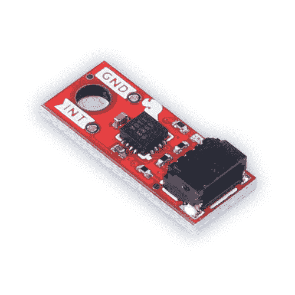

# Qwiic 微型磁力计- MMC5983MA 连接指南

> 原文：<https://learn.sparkfun.com/tutorials/qwiic-micro-magnetometer---mmc5983ma-hookup-guide>

## 介绍

[SparkFun Qwiic Micro MMC5983MA 磁力计](https://www.sparkfun.com/products/19921)是一款微型 0.75 英寸 x 0.30 英寸传感器，采用 MEMSIC 的高灵敏度三轴磁力计。我们将磁力计 IC 连接到一个非常小的 qw IC 电路板上，我们称之为 Qwiic Micro！MMC5983MA 能够检测低至 0.4 毫克的数据，从而实现 0.5°的航向精度。默认情况下，Qwiic MMC5983MA IMU 利用我们方便的 Qwiic Connect 系统通过 I ² C 进行通信，因此无需焊接即可将其连接到您的其余电路板。

饱和是所有磁传感器的问题。MMC5983MA 内置消磁电路，可清除任何残余磁化。1000Hz 的输出速率、8G FSR 和 18 位分辨率使 MMC5983MA 成为电子罗盘应用中的出色磁传感器。

 

将**添加到您的[购物车](https://www.sparkfun.com/cart)中！**

### [【spark fun 微型磁力仪- MMC5983MA (Qwiic)](https://www.sparkfun.com/products/19921)

[In stock](https://learn.sparkfun.com/static/bubbles/ "in stock") SEN-19921

SparkFun Qwiic Micro MMC5983MA 磁力计是一种微型 0.75 英寸乘 0.30 英寸传感器，采用高灵敏度的温度传感器

$15.95[Favorited Favorite](# "Add to favorites") 2[Wish List](# "Add to wish list")** **### 所需材料

要跟随本教程，您将需要以下材料。你可能不需要所有的东西，这取决于你拥有什么。将它添加到您的购物车，通读指南，并根据需要调整购物车。**