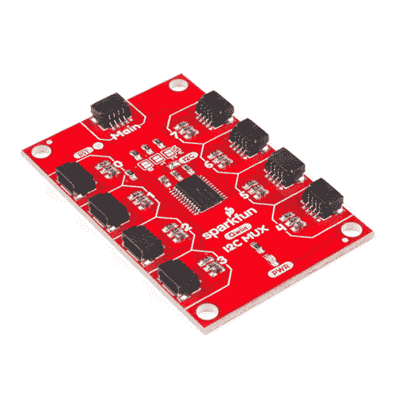
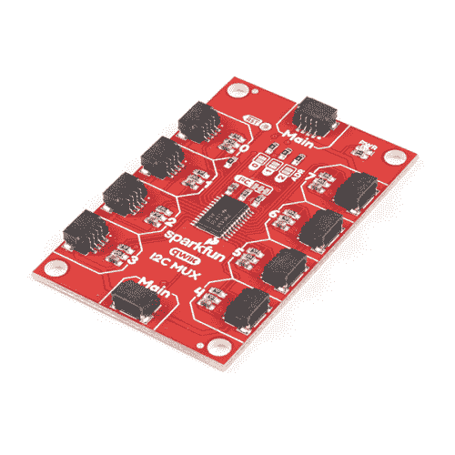
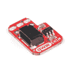

# Qwiic MUX 连接指南

> 原文：<https://learn.sparkfun.com/tutorials/qwiic-mux-hookup-guide>

## 介绍

**PCA9548A and TCA9548A?** The SparkX version of the Qwiic Mux breakout used the PCA9548A. The SparkFun red version uses the TCA9548A. Overall, both should be functionally the same with a [few minor differences](https://learn.sparkfun.com/tutorials/qwiic-mux-hookup-guide#hardware-overview).

Qwiic Mux - TCA9548A [(v1)](https://www.sparkfun.com/products/14685) 和 [(v1.1)](https://www.sparkfun.com/products/16784) 能够与具有相同地址的多个 I ² C 设备进行通信。该 IC 接口简单，也有 8 个自己的可配置地址，这允许您将 64 I ² C 总线放在一条总线上！

[](https://www.sparkfun.com/products/retired/14685) 

### [【spark fun Qwiic Mux Breakout-8 通道(TCA9548A)](https://www.sparkfun.com/products/retired/14685)

[Retired](https://learn.sparkfun.com/static/bubbles/ "Retired") BOB-14685

SparkFun Qwiic Mux 分线架支持与多个具有相同地址的 I2C 设备进行通信，从而简化了

2 **Retired**[Favorited Favorite](# "Add to favorites") 15[Wish List](# "Add to wish list")[](https://www.sparkfun.com/products/16784) 

将**添加到您的[购物车](https://www.sparkfun.com/cart)中！**

### [【spark fun Qwiic Mux Breakout-8 通道(TCA9548A)](https://www.sparkfun.com/products/16784)

[In stock](https://learn.sparkfun.com/static/bubbles/ "in stock") BOB-16784

SparkFun Qwiic Mux 分线架支持与多个具有相同地址的 I2C 设备进行通信，从而简化了

$12.958[Favorited Favorite](# "Add to favorites") 30[Wish List](# "Add to wish list")** **[https://www.youtube.com/embed/TOH5ugaUVfs/?autohide=1&border=0&wmode=opaque&enablejsapi=1](https://www.youtube.com/embed/TOH5ugaUVfs/?autohide=1&border=0&wmode=opaque&enablejsapi=1)

[https://www.youtube.com/embed/ydeR-4z_yoc/?autohide=1&border=0&wmode=opaque&enablejsapi=1](https://www.youtube.com/embed/ydeR-4z_yoc/?autohide=1&border=0&wmode=opaque&enablejsapi=1)

**版本更新:**在 Qwiic 多路复用器的最新版本中，我们对评估板进行了一些改进，如下所示。如果用户不确定他们购买了哪个版本，请参考下面显示的最显著变化的图片。

*   我们增加了一个直通 Qwiic 连接器。

*   移动电源指示灯以容纳额外的 Qwiic 连接器。

*   我们已经将 I ² C 上拉电阻跳线更新为可切割走线。
*   我们拓宽了 3.3V 电源的走线。
*   板子背面有一个 ***v11*** 标签。
*   丝网标签已更新。

[](https://cdn.sparkfun.com/assets/learn_tutorials/7/8/7/Qwiic_Mux_pass-through_2.jpg)
*Added Qwiic connector to make board daisy-chainable.*[](https://cdn.sparkfun.com/assets/learn_tutorials/7/8/7/Qwiic_Mux_v11.jpg)
*The **v11** label on the back.*

在本教程中，我们将了解如何与 MUX 分线板不同通道上的传感器通信。这个的应用非常简单，所以事情不会太复杂。

### 所需材料

开始使用 Qwiic 多路复用器时，您需要一些额外的物品。 [RedBoard Qwiic](https://www.sparkfun.com/products/15123) 用于 Arduino 示例，而 [Qwiic pHAT](https://www.sparkfun.com/products/15351) 用于 Raspberry Pi 示例(参见下面的注释)。你可能已经有一些这样的物品了，所以可以根据你的需要随意修改你的购物车。此外，还有选项可用(*点击下方按钮切换选项*)。

[](https://www.sparkfun.com/products/15081) 

将**添加到您的[购物车](https://www.sparkfun.com/cart)中！**

### [SparkFun Qwiic 线缆套件](https://www.sparkfun.com/products/15081)

[In stock](https://learn.sparkfun.com/static/bubbles/ "in stock") KIT-15081

为了更容易上手，我们用 50 毫米到 500 毫米的各种 Qwiic 电缆组装了 Qwiic 电缆套件…

$8.9516[Favorited Favorite](# "Add to favorites") 58[Wish List](# "Add to wish list")****[](https://www.sparkfun.com/products/15123) 

将**添加到您的[购物车](https://www.sparkfun.com/cart)中！**

### [spark fun RedBoard Qwiic](https://www.sparkfun.com/products/15123)

[In stock](https://learn.sparkfun.com/static/bubbles/ "in stock") DEV-15123

SparkFun RedBoard Qwiic 是一款 Arduino 兼容开发板，内置 Qwiic 连接器，无需…

$21.5014[Favorited Favorite](# "Add to favorites") 49[Wish List](# "Add to wish list")****[](https://www.sparkfun.com/products/retired/15351) 

### [树莓派的 spark fun Qwiic pHAT](https://www.sparkfun.com/products/retired/15351)

[Retired](https://learn.sparkfun.com/static/bubbles/ "Retired") DEV-15351

树莓派的 SparkFun Qwiic pHAT 是进入 Qwiic 生态系统最快最简单的方法，而且…

**Retired**[Favorited Favorite](# "Add to favorites") 12[Wish List](# "Add to wish list")********Qwiic compatible microcontrollers:[](https://www.sparkfun.com/products/15123) 

将**添加到您的[购物车](https://www.sparkfun.com/cart)中！**

### [spark fun RedBoard Qwiic](https://www.sparkfun.com/products/15123)

[In stock](https://learn.sparkfun.com/static/bubbles/ "in stock") DEV-15123

SparkFun RedBoard Qwiic 是一款 Arduino 兼容开发板，内置 Qwiic 连接器，无需…

$21.5014[Favorited Favorite](# "Add to favorites") 49[Wish List](# "Add to wish list")****[](https://www.sparkfun.com/products/14812) 

将**添加到您的[购物车](https://www.sparkfun.com/cart)中！**

### [spark fun red Board Turbo-samd 21 开发板](https://www.sparkfun.com/products/14812)

[In stock](https://learn.sparkfun.com/static/bubbles/ "in stock") DEV-14812

如果你准备从旧的 8 位/16MHz 微控制器升级你的 Arduino 游戏，SparkFun RedBoard Turbo 是一种形式…

$26.958[Favorited Favorite](# "Add to favorites") 27[Wish List](# "Add to wish list")****[](https://www.sparkfun.com/products/14713) 

将**添加到您的[购物车](https://www.sparkfun.com/cart)中！**

### [SparkFun 的东西 Plus-samd 51](https://www.sparkfun.com/products/14713)

[Out of stock](https://learn.sparkfun.com/static/bubbles/ "out of stock") DEV-14713

SparkFun SAMD51 Thing Plus 采用 32 位 ARM Cortex-M4F MCU，是我们迄今为止最强大的微控制器板之一！

$21.502[Favorited Favorite](# "Add to favorites") 26[Wish List](# "Add to wish list")****[](https://www.sparkfun.com/products/retired/14689) 

### [spark fun Thing Plus-ESP32 WROOM](https://www.sparkfun.com/products/retired/14689)

[Retired](https://learn.sparkfun.com/static/bubbles/ "Retired") WRL-14689

SparkFun ESP32 Thing Plus 是开始使用 Espressif 物联网概念的下一步，同时还可以享受所有的便利设施

7 **Retired**[Favorited Favorite](# "Add to favorites") 16[Wish List](# "Add to wish list")************In addition we also offer, Qwiic compatible stackable shields for microcontrollers and pHATs for single board computers (like the [Raspberry Pi boards](https://www.sparkfun.com/categories/395)) that don't include a Qwiic connector.[](https://www.sparkfun.com/products/14495) 

将**添加到您的[购物车](https://www.sparkfun.com/cart)中！**

### [SparkFun Qwiic 适配器](https://www.sparkfun.com/products/14495)

[In stock](https://learn.sparkfun.com/static/bubbles/ "in stock") DEV-14495

SparkFun Qwiic 适配器提供了将任何旧 I ² C 板改造成支持 Qwiic 的板的完美方法。

$1.601[Favorited Favorite](# "Add to favorites") 53[Wish List](# "Add to wish list")****[](https://www.sparkfun.com/products/14352) 

将**添加到您的[购物车](https://www.sparkfun.com/cart)中！**

### [ArduinoT3 的 SparkFun Qwiic 盾](https://www.sparkfun.com/products/14352)

[In stock](https://learn.sparkfun.com/static/bubbles/ "in stock") DEV-14352

SparkFun Qwiic Shield 是一种易于组装的板，它提供了一种简单的方法来将 Qwiic Connect 系统与

$7.508[Favorited Favorite](# "Add to favorites") 39[Wish List](# "Add to wish list")****[](https://www.sparkfun.com/products/14477) 

将**添加到您的[购物车](https://www.sparkfun.com/cart)中！**

### [光子盾](https://www.sparkfun.com/products/14477)

[28 available](https://learn.sparkfun.com/static/bubbles/ "28 available") DEV-14477

SparkFun Qwiic Shield for Photon 是一个易于组装的板，提供了一种简单的方法来整合 Qwiic 系统…

$6.50[Favorited Favorite](# "Add to favorites") 7[Wish List](# "Add to wish list")************[](https://www.sparkfun.com/products/14459) 

将**添加到您的[购物车](https://www.sparkfun.com/cart)中！**

### [树莓派的 SparkFun Qwiic 帽子](https://www.sparkfun.com/products/14459)

[In stock](https://learn.sparkfun.com/static/bubbles/ "in stock") DEV-14459

树莓派的 SparkFun Qwiic 帽子是进入 Qwiic 生态系统的最快捷、最简单的方式，并且仍然适用于

$6.505[Favorited Favorite](# "Add to favorites") 33[Wish List](# "Add to wish list")****[](https://www.sparkfun.com/products/15794) 

将**添加到您的[购物车](https://www.sparkfun.com/cart)中！**

### [树莓派的 SparkFun Qwiic 垫片](https://www.sparkfun.com/products/15794)

[In stock](https://learn.sparkfun.com/static/bubbles/ "in stock") DEV-15794

spark fun Qwiic SHIM for Raspberry Pi 是一个小型、易于拆卸的突破，可以轻松地将 qw IIC 连接器添加到您的 Ras…

$1.0512[Favorited Favorite](# "Add to favorites") 18[Wish List](# "Add to wish list")****[](https://www.sparkfun.com/products/15316) 

将**添加到您的[购物车](https://www.sparkfun.com/cart)中！**

### [树莓派的 SparkFun 伺服 pHAT](https://www.sparkfun.com/products/15316)

[In stock](https://learn.sparkfun.com/static/bubbles/ "in stock") DEV-15316

树莓皮的 SparkFun 伺服 pHAT 允许您的树莓皮控制多达 16 个伺服电机在一个简单的方式…

$11.954[Favorited Favorite](# "Add to favorites") 27[Wish List](# "Add to wish list")****[](https://www.sparkfun.com/products/retired/15351) 

### [树莓派的 spark fun Qwiic pHAT](https://www.sparkfun.com/products/retired/15351)

[Retired](https://learn.sparkfun.com/static/bubbles/ "Retired") DEV-15351

树莓派的 SparkFun Qwiic pHAT 是进入 Qwiic 生态系统最快最简单的方法，而且…

**Retired**[Favorited Favorite](# "Add to favorites") 12[Wish List](# "Add to wish list")************You will also need a Qwiic cable to connect to your Qwiic Mux, choose a length that suits your needs.[](https://www.sparkfun.com/products/14427) 

将**添加到您的[购物车](https://www.sparkfun.com/cart)中！**

### [Qwiic 线缆- 100mm](https://www.sparkfun.com/products/14427)

[In stock](https://learn.sparkfun.com/static/bubbles/ "in stock") PRT-14427

这是一条 100 毫米长的 4 芯电缆，带有 1 毫米 JST 端接。它旨在将支持 Qwiic 的组件连接在一起…

$1.50[Favorited Favorite](# "Add to favorites") 32[Wish List](# "Add to wish list")****[](https://www.sparkfun.com/products/14429) 

将**添加到您的[购物车](https://www.sparkfun.com/cart)中！**

### [Qwiic 线缆- 500mm](https://www.sparkfun.com/products/14429)

[In stock](https://learn.sparkfun.com/static/bubbles/ "in stock") PRT-14429

这是一根 500mm 长的 4 芯电缆，带有 1mm JST 端接。它旨在将支持 Qwiic 的组件连接在一起…

$1.951[Favorited Favorite](# "Add to favorites") 25[Wish List](# "Add to wish list")****[](https://www.sparkfun.com/products/14426) 

将**添加到您的[购物车](https://www.sparkfun.com/cart)中！**

### [Qwiic 线缆- 50mm](https://www.sparkfun.com/products/14426)

[In stock](https://learn.sparkfun.com/static/bubbles/ "in stock") PRT-14426

这是一根 50 毫米长的 4 芯电缆，带有 1 毫米 JST 端接。它旨在将支持 Qwiic 的组件连接在一起…

$0.95[Favorited Favorite](# "Add to favorites") 29[Wish List](# "Add to wish list")****[](https://www.sparkfun.com/products/14428) 

### [Qwiic 线缆- 200mm](https://www.sparkfun.com/products/14428)

[Out of stock](https://learn.sparkfun.com/static/bubbles/ "out of stock") PRT-14428

这是一根 200 毫米长的 4 芯电缆，带有 1 毫米 JST 端接。它旨在将支持 Qwiic 的组件连接在一起…

[Favorited Favorite](# "Add to favorites") 21[Wish List](# "Add to wish list")************ **************树莓派举例:**如果你还没有，你就需要一个[树莓派](https://www.sparkfun.com/products/14644)和[标准外设](https://www.sparkfun.com/categories/398)。下面列出了一个设置示例。Qwiic Mux 和 Python 库还没有在新发布的 Raspberry Pi 4 上进行测试，因为我们还没有在目录中提供它。 )

**更新:**该板和 Python 包已经过验证，可与 Raspberry Pi 4 配合使用。

### 工具

根据您的设置，您可能需要业余爱好刀、烙铁、焊料和/或[通用焊接附件](https://www.sparkfun.com/categories/49)。

[](https://www.sparkfun.com/products/14228) 

### [威勒 WLC100 焊台](https://www.sparkfun.com/products/14228)

[Out of stock](https://learn.sparkfun.com/static/bubbles/ "out of stock") TOL-14228

Weller 的 WLC100 是一款多功能的 5 瓦至 40 瓦焊台，非常适合业余爱好者、DIY 爱好者和学生。…

2[Favorited Favorite](# "Add to favorites") 17[Wish List](# "Add to wish list")[](https://www.sparkfun.com/products/9325) 

将**添加到您的[购物车](https://www.sparkfun.com/cart)中！**

### [无铅焊料- 100 克线轴](https://www.sparkfun.com/products/9325)

[In stock](https://learn.sparkfun.com/static/bubbles/ "in stock") TOL-09325

这是带有水溶性树脂芯的无铅焊料的基本线轴。0.031 英寸规格，100 克。这是一个好主意…

$9.957[Favorited Favorite](# "Add to favorites") 33[Wish List](# "Add to wish list")****[](https://www.sparkfun.com/products/9200) 

将**添加到您的[购物车](https://www.sparkfun.com/cart)中！**

### [爱好刀](https://www.sparkfun.com/products/9200)

[In stock](https://learn.sparkfun.com/static/bubbles/ "in stock") TOL-09200

就像一把 Xacto 刀，只是更好。我们在处理多氯联苯时广泛使用这些技术。这些小刀子很适合切割…

$3.502[Favorited Favorite](# "Add to favorites") 18[Wish List](# "Add to wish list")****[](https://www.sparkfun.com/products/retired/14508) 

### [切片工艺刀](https://www.sparkfun.com/products/retired/14508)

[Retired](https://learn.sparkfun.com/static/bubbles/ "Retired") TOL-14508

切片工艺刀是一种高端业余爱好刀，非常适合精确切割、刮削和处理。

**Retired**[Favorited Favorite](# "Add to favorites") 4[Wish List](# "Add to wish list")**** ****### 推荐阅读

如果你不熟悉跳线垫、I ² C、Qwiic 或 Python，请务必查看这些基础教程。

[](https://learn.sparkfun.com/tutorials/serial-communication) [### 串行通信](https://learn.sparkfun.com/tutorials/serial-communication) Asynchronous serial communication concepts: packets, signal levels, baud rates, UARTs and more 100[](https://learn.sparkfun.com/tutorials/logic-levels) [### 逻辑电平](https://learn.sparkfun.com/tutorials/logic-levels) Learn the difference between 3.3V and 5V devices and logic levels.[Favorited Favorite](# "Add to favorites") 82[](https://learn.sparkfun.com/tutorials/i2c) [### I2C](https://learn.sparkfun.com/tutorials/i2c) An introduction to I2C, one of the main embedded communications protocols in use today.[Favorited Favorite](# "Add to favorites") 128[](https://learn.sparkfun.com/tutorials/terminal-basics) [### 串行终端基础知识](https://learn.sparkfun.com/tutorials/terminal-basics) This tutorial will show you how to communicate with your serial devices using a variety of terminal emulator applications.[Favorited Favorite](# "Add to favorites") 46[](https://learn.sparkfun.com/tutorials/raspberry-pi-spi-and-i2c-tutorial) [### 树莓派 SPI 和 I2C 教程](https://learn.sparkfun.com/tutorials/raspberry-pi-spi-and-i2c-tutorial) Learn how to use serial I2C and SPI buses on your Raspberry Pi using the wiringPi I/O library for C/C++ and spidev/smbus for Python.[Favorited Favorite](# "Add to favorites") 24[](https://learn.sparkfun.com/tutorials/raspberry-pi-3-starter-kit-hookup-guide) [### 树莓 Pi 3 入门套件连接指南](https://learn.sparkfun.com/tutorials/raspberry-pi-3-starter-kit-hookup-guide) Guide for getting going with the Raspberry Pi 3 Model B and Raspberry Pi 3 Model B+ starter kit.[Favorited Favorite](# "Add to favorites") 13[](https://learn.sparkfun.com/tutorials/python-programming-tutorial-getting-started-with-the-raspberry-pi) [### Python 编程教程:Raspberry Pi 入门](https://learn.sparkfun.com/tutorials/python-programming-tutorial-getting-started-with-the-raspberry-pi) This guide will show you how to write programs on your Raspberry Pi using Python to control hardware.[Favorited Favorite](# "Add to favorites") 27[](https://learn.sparkfun.com/tutorials/qwiic-phat-for-raspberry-pi-hookup-guide) [### 覆盆子 Pi 连接指南的 Qwiic pHAT](https://learn.sparkfun.com/tutorials/qwiic-phat-for-raspberry-pi-hookup-guide) Get started interfacing your Qwiic enabled boards with your Raspberry Pi. The Qwiic pHAT connects the I2C bus (GND, 3.3V, SDA, and SCL) on your Raspberry Pi to an array of Qwiic connectors.[Favorited Favorite](# "Add to favorites") 2[](https://learn.sparkfun.com/tutorials/how-to-work-with-jumper-pads-and-pcb-traces) [### 如何使用跳线焊盘和 PCB 走线](https://learn.sparkfun.com/tutorials/how-to-work-with-jumper-pads-and-pcb-traces) Handling PCB jumper pads and traces is an essential skill. Learn how to cut a PCB trace, add a solder jumper between pads to reroute connections, and repair a trace with the green wire method if a trace is damaged.[Favorited Favorite](# "Add to favorites") 11[](https://learn.sparkfun.com/tutorials/qwiic-shield-for-arduino--photon-hookup-guide) [### Arduino 和光子连接指南的 Qwiic 屏蔽](https://learn.sparkfun.com/tutorials/qwiic-shield-for-arduino--photon-hookup-guide) Get started with our Qwiic ecosystem with the Qwiic shield for Arduino or Photon.[Favorited Favorite](# "Add to favorites") 5[](https://learn.sparkfun.com/tutorials/redboard-qwiic-hookup-guide) [### RedBoard Qwiic 连接指南](https://learn.sparkfun.com/tutorials/redboard-qwiic-hookup-guide) This tutorial covers the basic functionality of the RedBoard Qwiic. This tutorial also covers how to get started blinking an LED and using the Qwiic system.[Favorited Favorite](# "Add to favorites") 5[](https://www.sparkfun.com/qwiic)

Qwiic Mux 用于 [Qwiic 连接系统](https://www.sparkfun.com/qwiic)。我们建议在使用之前先熟悉一下 [**逻辑电平**](https://learn.sparkfun.com/tutorials/logic-levels) 和 [**I ² C**](https://learn.sparkfun.com/tutorials/i2c) 教程。点击上面的横幅，了解更多关于我们的 [Qwiic 产品](https://www.sparkfun.com/categories/399)。

[https://www.youtube.com/embed/x0RDEHqFIF8/?autohide=1&border=0&wmode=opaque&enablejsapi=1](https://www.youtube.com/embed/x0RDEHqFIF8/?autohide=1&border=0&wmode=opaque&enablejsapi=1)

## 硬件概述

**What is the difference between the PCA9548A and TCA9548A?** Very little. PCA is made by NXP, TCA is made by TI. PCA can operate from 2.3 to 5.5V, TCA can operate from 1.65 to 5.5V. Everything else is identical.

让我们来看一下 TCA9548A 的一些特性，以便对其工作原理有更多的了解。

| **特性** | **范围** |
| 工作电压 | **1.65 伏-5.5 伏** |
| 工作温度 | -40 - 85&deg C |
| I ² C 地址 | **0x70(默认)**最高 0x77(见下表) |

**原始版本:**多路复用器的 Qwiic 输入位于电路板的顶部中央，标记为`Main`，在下图中突出显示。然后，输出位于电路板的左侧和右侧，并进行相应的编号。

[](https://cdn.sparkfun.com/assets/learn_tutorials/7/8/7/MAIN.png)

**版本更新:**版本上有两个`Main`连接器，为 I ² C 总线连接提供通道。这允许该板在其它 Qwiic 板之间菊花链连接。

[](https://cdn.sparkfun.com/assets/learn_tutorials/7/8/7/Qwiic_Mux_pass-through_2.jpg)

下面突出显示的片上 reset 引脚是低电平有效输入。将 reset 拉低至少 6 ns 将重启多路复用器。

[](https://cdn.sparkfun.com/assets/learn_tutorials/7/8/7/RST.png)

Qwiic Mux 还允许您更改地址字节的后 3 位，如果您碰巧需要在同一个 I ² C 端口上放置多个 Mux，则允许 8 个跳线可选地址。地址可以通过[添加焊料](https://learn.sparkfun.com/tutorials/how-to-solder-through-hole-soldering)到三个 **ADR** 跳线中的任何一个来改变，如下图所示。

[](https://cdn.sparkfun.com/assets/learn_tutorials/7/8/7/ADR.png)

下表显示了哪些跳线必须焊接在一起才能更改到相应的地址。

| **I ² C 地址** | **ADR2** | **ADR1** | **ADR0** |
| **0x70** | 打开 | 打开 | 打开 |
| **0x71** | 打开 | 打开 | 关闭的 |
| **0x72** | 打开 | 关闭的 | 打开 |
| **0x73** | 打开 | 关闭的 | 关闭的 |
| **0x74** | 关闭的 | 打开 | 打开 |
| **0x75** | 关闭的 | 打开 | 关闭的 |
| **0x76** | 关闭的 | 关闭的 | 打开 |
| **0x77** | 关闭的 | 关闭的 | 关闭的 |

**原始版本:**如果您想从 I ² C 总线上移除上拉电阻，只需移除下图中突出显示的跳线上的焊料。

[](https://cdn.sparkfun.com/assets/learn_tutorials/7/8/7/PU.png)

**版本更新:**如果您想从 I ² C 总线上移除上拉电阻，只需用业余爱好刀切割跳线垫。小心跳线焊盘上方的 **3.3V** 迹线。切断走线可能不会破坏电路板，因为走线还会穿过底部的 Qwiic 连接器。但是，它会使痕迹暴露在切口处。

[](https://cdn.sparkfun.com/assets/learn_tutorials/7/8/7/Qwiic_Mux_jumper.jpg)

## 硬件装配

**Support Tip:** Make sure that you are connecting the **Main** Qwiic connector to the Arduino board/shield or Raspberry HAT.

### Arduino 示例

只需将 Qwiic 电缆的一端插入 Qwiic 多路复用器分接头上的**主**连接器，另一端插入启用 Qwiic 的微控制器上的 Qwiic 连接器。如果它看起来太容易使用，但这就是为什么我们这样做！否则，如果你选择使用 Qwiic 屏蔽/适配器，现在是时候去那个教程组装屏蔽了。

[Qwiic Shield for Arduino Photon Hookup Guide](https://learn.sparkfun.com/tutorials/qwiic-shield-for-arduino--photon-hookup-guide)

随着盾牌的组装，SparkFun 的新 Qwiic 环境意味着连接 mux 不可能更容易。只需将 Qwiic 电缆的一端插入 Qwiic 多路复用器分接头( ***主**连接器*)中，另一端插入 Qwiic 屏蔽罩中；然后，您将准备好上传草图，并弄清楚所有这些地址共享传感器是如何工作的。

[](https://cdn.sparkfun.com/assets/learn_tutorials/7/8/7/SparkFun_Qwiic_Mux_Breakout_-_8_Channel__TCA9548A__Hookup_Guide-03.jpg)*SparkFun RedBoard with the Qwiic shield connected the Qwiic Mux with a Qwiic cable.*Additionally, a few peripheral Qwiic Boards are attached to verify Qwiic Mux functionality.

**版本更新:**用户现在可以在其他 qw IC 板之间以菊花链形式连接 qw IC 多路复用器。

[](https://cdn.sparkfun.com/assets/learn_tutorials/7/8/7/assembly_arduino_updated.jpg)

### 树莓 Pi 示例

~~**注意:**这个板和 Python 包还没有在新发布的 Raspberry Pi 4 上测试，因为我们还没有在我们的目录中进行测试。~~

**更新:**该板和 Python 包已经过验证，可与 Raspberry Pi 4 配合使用。

有了 Qwiic 连接器系统，组装硬件变得简单。除了 [Qwiic Mux](https://www.sparkfun.com/products/14685) 之外，你还需要:一根 [Qwiic 线缆](https://www.sparkfun.com/products/15081)，一个[spark fun Qwiic pHAT for Raspberry Pi](https://www.sparkfun.com/products/15351)，以及一个[Raspbian OS](https://www.sparkfun.com/products/14643)、监视器和[标准外围设备](https://www.sparkfun.com/categories/398)的 Raspberry Pi 设置。(* *如果您不熟悉 Qwiic pHAT，您可以在此处* 找到[连接指南。)](https://learn.sparkfun.com/tutorials/qwiic-phat-for-raspberry-pi-hookup-guide)

**Note:** The peripheral Qwiic boards attached to the Qwiic Mux are not necessary for this hookup guide, but they are useful for customers looking to verify the functionality of the Qwiic Mux. Use channels 0, 4, and 7 for the examples below.[](https://cdn.sparkfun.com/assets/learn_tutorials/7/8/7/Assembly_Pi_Qwiic_pHat.jpg)*Raspberry Pi 3B connected the Qwiic Mux with a Qwiic pHAT and Qwiic cable (and a few peripheral Qwiic Boards).*

**版本更新:**用户现在可以在其他 qw IC 板之间以菊花链形式连接 qw IC 多路复用器。

[](https://cdn.sparkfun.com/assets/learn_tutorials/7/8/7/assembly_pi_updated.jpg)

或者，您也可以使用另一个 Qwiic 适配器，如 [Pi 伺服 pHat](https://www.sparkfun.com/products/15316) 来代替。

[](https://cdn.sparkfun.com/assets/learn_tutorials/7/8/7/Assembly_Pi_Servo_pHat.jpg)*Raspberry Pi 3 connected the Qwiic Mux with the Pi Servo pHat and Qwiic cable (and a few peripheral Qwiic Boards).*

**注意:**本教程假设您熟悉使用 Raspberry Pi，并且您有最新的(完整版...带推荐软件)版本 [Raspbian OS](https://www.raspberrypi.org/downloads/raspbian/) 你的树莓 Pi。你可以从[树莓派基金会网站](https://www.raspberrypi.org/downloads/raspbian/)下载最新版本的 Raspbian 操作系统。截至 2019 年 2 月 13 日，我们推荐 **Raspbian 拉伸带桌面和推荐软件**选项。

如果这是你第一次使用树莓派，请前往[树莓派基金会网站](https://www.raspberrypi.org/help/)使用他们的快速入门指南。我们在这里列举了其中的几个:

1.  [设置您的树莓派](https://projects.raspberrypi.org/en/projects/raspberry-pi-setting-up)
2.  [用你的树莓派](https://projects.raspberrypi.org/en/projects/raspberry-pi-using)
3.  文档:

[安装文档](https://www.raspberrypi.org/documentation/setup/)
[安装文档](https://www.raspberrypi.org/documentation/installation/)
[Raspbian 文档](https://www.raspberrypi.org/documentation/raspbian/)
[SD 卡文档](https://www.raspberrypi.org/documentation/installation/sd-cards.md)

## Arduino 示例

**注意:**本教程假设您熟悉 Arduino 产品，并且在您的桌面上使用 Arduino IDE 的最新稳定版本。如果这是你第一次使用 Arduino IDE，请回顾我们关于[安装 Arduino IDE 的教程。](https://learn.sparkfun.com/tutorials/installing-arduino-ide)

SparkFun 编写了一些示例代码来启用和禁用 Qwiic Mux 上的端口。点击下载这个示例代码[。](https://cdn.sparkfun.com/assets/learn_tutorials/7/8/7/Qwiic_MUX_Shield_Examples.zip)

[Qwiic Mux Example (ZIP)](https://cdn.sparkfun.com/assets/learn_tutorials/7/8/7/Qwiic_MUX_Shield_Examples2.zip)**Warning!** Make sure to have the **Mux_Control.ino** in the same folder when compiling the **Example1-BasicReadings.ino** sketch file. Otherwise, you may have issues uploading code.

此外，如果您使用两个 MMA8452Q 加速度计，您将需要安装 MMA8452Q Arduino 库。首先，你需要 Sparkfun MMA8452Q Arduino 库。您可以通过 Arduino 库管理器获得这些库。由 **Jim@SparkFun Electronics** 搜索 **Sparkfun MMA8452Q 加速度计**安装最新版本。如果您喜欢从 GitHub 库下载库并手动安装，您可以在这里下载:

[Download Sparkfun MMA8452Q Accelerometer (ZIP)](https://github.com/sparkfun/SparkFun_MMA8452Q_Arduino_Library/archive/master.zip)

### Arduino 示例示例 1-BasicReadings.ino

打开`Example1-BasicReadings`会打开 Arduino IDE 中的两个标签，第一个例子，还有`Mux_Control`。让我们来看看`Mux_Control`的引擎盖下，了解一下发生了什么。这里有两个函数，`boolean enableMuxPort(byte portNumber)`和`boolean disableMuxPort(byte portNumber)`，这就是我们所需要的，来指定我们想要在多路复用器上与哪个通道对话。如果通道 0 上有一个传感器，我们只需调用`enableMuxPort(0)`来打开多路复用器上的该通道。然后，我们将读取该通道上的传感器，并对其执行我们想要的任何操作。一旦完成，我们必须调用`disableMuxPort(0)`来关闭该通道上的通信，这样我们就不会意外地对该通道上的传感器执行操作。以下示例代码显示了如何读取两个 MMA8452Q 加速度计。

```
language:c
#include <Wire.h>
#include <SFE_MMA8452Q.h> //From: https://github.com/sparkfun/SparkFun_MMA8452Q_Arduino_Library

MMA8452Q accel;

#define NUMBER_OF_SENSORS 2

void setup()
{
  Serial.begin(9600);
  Serial.println("Qwiic Mux Shield Read Example");

  Wire.begin();

  //Initialize all the sensors
  for (byte x = 0 ; x < NUMBER_OF_SENSORS ; x++)
  {
    enableMuxPort(x); //Tell mux to connect to port X
    accel.init(); //Init the sensor connected to this port
    disableMuxPort(x);
  }

  Serial.println("Mux Shield online");
}

void loop()
{
  for (byte x = 0 ; x < NUMBER_OF_SENSORS ; x++)
  {
    enableMuxPort(x); //Tell mux to connect to this port, and this port only

    if (accel.available())
    {
      accel.read();

      Serial.print("Accel ");
      Serial.print(x);
      Serial.print(": ");
      Serial.print(accel.cx, 2);
      Serial.print(" ");
      Serial.print(accel.cy, 2);
      Serial.print(" ");
      Serial.print(accel.cz, 2);
      Serial.print(" ");

      Serial.println(); // Print new line every time.
    }

    disableMuxPort(x); //Tell mux to disconnect from this port
  }

  delay(1); //Wait for next reading
} 
```

根据提供的示例，您应该能够读取同一总线上具有相同地址的两个 I ² C 传感器！尝试打开设置为 **9600** 波特的 [Arduino 串行监视器](https://learn.sparkfun.com/tutorials/terminal-basics/arduino-serial-monitor-windows-mac-linux)，以读取传感器值。

## Python 包概述

**注意:**这个例子假设您使用的是最新版本的 Python (2 或 3)。如果这是你第一次在 Raspberry Pi 上使用 Python 或 I ² C 硬件，请查看我们关于用 Raspberry Pi 和 [Raspberry Pi SPI 和 I2C 教程](https://learn.sparkfun.com/tutorials/raspberry-pi-spi-and-i2c-tutorial)进行 [Python 编程的教程。](https://learn.sparkfun.com/tutorials/python-programming-tutorial-getting-started-with-the-raspberry-pi)

* *在 Raspberry Pi 上，Python 2 和 3 包含在 Raspbian OS(带有桌面和推荐软件)映像中。*

**支持提示:**不要忘记仔细检查硬件 I ² C 连接是否在你的 Raspberry Pi 或其他单板电脑上启用。

我们编写了一个 Python 包来轻松设置和使用 Qwiic Mux。然而，在我们开始操作多路复用器之前，让我们仔细看看 Python 包中可用的函数。可以安装 PyPi 托管的`sparkfun-qwiic-tca9548a` Python 包。

### 装置

要安装该产品的 Python 包，建议用户安装 SparkFun Qwiic Python 包，该包安装了我们 Qwiic 产品所有可用的 Python 包，并包含所需的 I ² C 驱动包。在支持 PyPi 的系统上，通过`pip3`安装(对于 Python 2 使用`pip`)很简单，使用以下命令:

对于**所有用户**(注意:用户必须拥有 [**须户**](https://en.wikipedia.org/wiki/Sudo) 权限):

```
language:bash
sudo pip3 install sparkfun-qwiic 
```

对于**当前用户**:

```
language:bash
pip3 install sparkfun-qwiic 
```

**注意:**用户也可以手动构建或单独安装 python 包(*见下面的说明*)。所需的 I ² C 驱动程序包仍然需要安装。

如果你更喜欢从 [GitHub 库](https://github.com/sparkfun/Qwiic_TCA9548A_Py)手动下载并构建库，你可以在这里获得它们(**请注意任何包的依赖性。你也可以查看位于 [ReadtheDocs](https://qwiic-tca9548a-py.readthedocs.io) 的存储库文档页面。*):

[Download the SparkFun TCA9548A Python Package (ZIP)](https://github.com/sparkfun/Qwiic_TCA9548A_Py/archive/main.zip)

#### PyPi 安装

这个存储库作为`sparkfun-qwiic-tca9548a package`托管在 PyPi 上。在支持 PyPi 的系统上，通过`pip3`(对于 Python 2 使用`pip`)安装很简单，使用以下命令:

对于**所有用户**(注意:用户必须拥有 [**须户**](https://en.wikipedia.org/wiki/Sudo) 权限):

```
sudo pip3 install sparkfun-qwiic-tca9548a 
```

对于**当前用户**:

```
pip3 install sparkfun-qwiic-tca9548a 
```

#### 本地安装

要安装，请确保系统上安装了`setuptools`包。

命令行直接安装(Python 2 使用`python`):

```
python3 setup.py install 
```

要构建与`pip3`一起使用的包:

```
python3 setup.py sdist 
```

构建一个包文件并放在名为 dist 的子目录中。这个包文件可以用`pip3`来安装。

```
cd dist
pip3 install sparkfun_qwiic_tca9548a-<version>.tar.gz 
```

### Python 包操作

以下是 Python 包基本功能的描述。这包括包的组织、内置方法以及它们的输入和/或输出。关于 Python 包如何工作的更多细节，请查看[源代码](https://github.com/sparkfun/Qwiic_TCA9548A_Py/blob/main/qwiic_tca9548a.py)和[数据表](https://cdn.sparkfun.com/assets/parts/1/2/2/5/2/TCA9548A_I2C_Multiplexer.pdf)。

#### 属国

这个 Python 包在代码中只有很少的依赖项，如下所示:

```
language:python
import time                         # Time access and conversion package
import qwiic_i2c                    # I2C bus driver package 
```

#### 默认变量

代码中该 Python 包的默认变量如下所示:

```
language:python
#The name of this device
_DEFAULT_NAME = "Qwiic Mux"

_AVAILABLE_I2C_ADDRESS = [*range(0x70,0x77 + 1)] 
```

#### 班级

**`QwiicTCA9548A()`** 或 **`QwiicTCA9548A(i2caddr)`**
这个 Python 包作为一个类对象运行，允许创建该类型的新实例。使用一个`__init__()`构造器，该构造器使用默认或指定的 I ² C 地址通过 I ² C 总线创建一个到 I ² C 设备的连接。

##### 构造函数

构造函数是一种特殊的方法，用于在创建对象时初始化(赋值)对象所需的数据成员。

**T2`__init__(self, address = None, debug = None, i2c_driver = None)`**

Input: value

设备地址的值。如果没有定义，Python 包将使用保存在`_AVAILABLE_I2C_ADDRESS`变量下的默认 I ² C 地址( **0x29** )。(*其他可用地址通过板上的跳线配置。*)

Output: Boolean

**真:**连接到默认(或指定)地址上的 I ² C 设备。
**假:**没有发现或连接设备。

Input: *i2c_driver*

加载指定的 I ² C 驱动程序；默认情况下使用[qw ici²C 驱动器](https://github.com/sparkfun/Qwiic_I2C_Py):`qwiic_i2c.getI2CDriver()`。用户应使用默认的 I ² C 驱动器，并将该字段留空。

#### 功能

作为类的属性的函数，它为该类的实例定义方法。简单地说，它们是类的操作(或方法)的对象。

**`.is_connected()`**
确定设备是否连接到系统。

Output: Boolean

**真:**连接到默认(或指定)地址上的 I ² C 设备。
**假:**没有发现或连接设备。

**`.disable_all()`**
该方法禁用 Qwiic Mux 上所有通道的连接。

**`.disable_channels(disable)`**
该方法禁用 Qwiic Mux 上特定通道的连接。

Intput: Integer or List

Qwiic 多路复用器上要禁用的通道。
**范围:** 0 到 7(**该方法会自动将单个整数转换成一个列表。*

**`.enable_all()`**
这种方法可以连接 Qwiic Mux 上的特定通道。

**`.enable_channels(enable)`**
该方法使 Qwiic Mux 上的特定通道能够连接。

Intput: Integer or List

要在 Qwiic Mux 上启用的通道。
**范围:** 0 到 7(**该方法会自动将单个整数转换成一个列表。*

**`.list_channels()`**
该方法列出了 Qwiic Mux 上所有可用的通道及其当前配置(启用或禁用)。

### 升级软件包

将来，可能会对 Python 包进行更改。必须为每个软件包单独更新已安装的软件包(即子模块和依赖项不会自动更新，必须手动更新)。对于`sparkfun-qwiic-tca9548a` Python 包，使用下面的命令(对于 Python 2 使用`pip`):

对于**所有用户**(注意:用户必须拥有 [**须户**](https://en.wikipedia.org/wiki/Sudo) 权限):

```
language:bash
sudo pip3 install --upgrade sparkfun-qwiic-tca9548a 
```

对于**当前用户**:

```
language:bash
pip3 install --upgrade sparkfun-qwiic-tca9548a 
```

## Python 示例

下面的例子可以在 [GitHub 仓库](https://github.com/sparkfun/Qwiic_TCA9548A_Py/tree/master/examples)中找到。要运行这些示例，只需下载代码或将代码复制到一个文件中。然后，打开/保存示例文件(如果需要)，并在您最喜欢的 Python IDE 的[中执行代码。](https://www.sparkfun.com/news/2706)

例如，用默认的 Python IDLE 点击**运行>运行模块**或者使用`F5`键。使用`Ctrl` + `C`组合键终止示例。

**支持提示:**为了检查 Qwiic Mux 的通道变化，用户可以将各种 Qwiic 板连接到通道上(如**硬件装配**部分所示)。在 Raspbian 上安装`i2ctools`包后，用户可以使用以下命令(在终端中)验证 Qwiic Mux 上的通道是否启用:

`i2cdetect -y 1`

终端会打印出一个表格，列出可用设备的地址。通过在以下示例之前、之间和之后运行此命令，用户可以验证 Qwiic 多路复用器使能通道的变化。

### 示例 1

用户应在电路板上电或复位后运行第一个示例。在本例中，通道 0 和 4 被使能，有一个暂停，然后通道 7 被使能。

#### 导入依赖项

代码的第一部分，导入操作所需的依赖项。

```
language:python
import qwiic
import time 
```

#### 初始化构造函数

这一行为设备实例化了一个对象。

```
language:python
test = qwiic.QwiicTCA9548A() 
```

#### 试运转

这部分代码说明了如何使能 Qwiic 多路复用器上的 I ² C 通道。首先，它列出了 Qwiic Mux 上的所有通道及其配置(启用或禁用)。(**上电或复位时所有通道将被禁用。*)代码的第二部分，使用 list 方法启用通道 0 和 4。然后，代码在启用通道 7 之前暂停一秒钟。一旦任务完成，代码返回通道的最终配置。用户应该会看到通道 0、4 和 7 使能。

```
language:python
# List Channel Configuration
test.list_channels()

# Enable Channels 0 and 4
test.enable_channels([0,4])

# Pause 1 sec
time.sleep (1)

# Enable Channel 7
test.enable_channels(7)

# List Channel Configuration
test.list_channels() 
```

### 示例 2

用户应该在运行此示例之前运行第一个示例。本例禁用通道 0 和 4。

#### 导入依赖项

代码的第一部分，导入操作所需的依赖项。

```
language:python
import qwiic
import time 
```

#### 初始化构造函数

这一行为设备实例化了一个对象。

```
language:python
test = qwiic.QwiicTCA9548A() 
```

#### 试运转

这部分代码说明了如何禁用 Qwiic 多路复用器上的 I ² C 通道。首先，它列出了 Qwiic Mux 上的所有通道及其配置(启用或禁用)。(**在前面的例子中，通道 0、4 和 7 应该被启用。*)代码的第二部分使用 list 方法禁用通道 0 和 4。然后，代码返回通道的最终配置。用户应该只看到通道 7 被使能。

```
language:python
# List Channel Configuration
test.list_channels()

# Enable Channels 0 and 4
test.disable_channels([0,4])

# List Channel Configuration
test.list_channels() 
```

## 故障排除提示

以下是排除该设备故障的一些提示。

### 没有可用的设备

仔细检查你的连接。在树莓 Pi 上，您可能会看到一个`OSError: [Errno 121] Remote I/O error`读数。

在 Raspberry Pi 上，还要确保 I ² C 硬件已启用。这通常用`Error: Failed to connect to I2C bus 1.`读数表示。

### 检查你的 I2C 连接

检查你的 Raspberry Pi 是否可以通过 I ² C 与 Qwiic Mux 通信的一个简单方法是 ping I²C 总线。在 Raspbian Stretch 的最新版本中，`i2ctools`包应该是预装的。如果没有，请在终端中运行以下命令:

```
sudo apt-get install i2ctools 
```

一旦安装了`i2ctools`包，您可以在终端中使用以下命令 ping I²C 总线:

```
i2cdetect -y 1 
```

您应该会在终端中看到一个打印出来的表格。如果 Qwiic Mux 连接/工作正常，您应该看到标记为 70 的 **0x70** 的地址空间。

## 资源和更进一步

既然您已经成功地让 Qwiic Mux 监听了所有这些并发地址，那么是时候将它合并到您自己的项目中了！

有关更多信息，请查看以下资源:

*   [SparkX (R & D)](https://cdn.sparkfun.com/assets/parts/1/2/2/5/2/Qwiic_Mux_-_PCA9548A.pdf)
    *   [示意图(PDF)](https://cdn.sparkfun.com/assets/f/5/a/e/d/SparkFun_Qwiic_Mux_Breakout.pdf)
    *   [老鹰文件(ZIP)](https://cdn.sparkfun.com/assets/parts/1/2/2/5/2/Qwiic_Mux.zip)
    *   [产品 GitHub 回购](https://github.com/sparkfunX/Qwiic_Mux-PCA9548A)
*   [1.0 版本](https://www.sparkfun.com/products/14685)
    *   [示意图(PDF)](https://cdn.sparkfun.com/assets/f/5/a/e/d/SparkFun_Qwiic_Mux_Breakout.pdf)
    *   [老鹰文件(ZIP)](https://cdn.sparkfun.com/assets/9/6/c/5/0/SparkFun_Qwiic_Mux_Breakout.zip)
    *   [产品 GitHub 回购](https://github.com/sparkfun/Qwiic_Mux_TCA9548A/tree/v1.0)
*   [1.1 版本](https://www.sparkfun.com/products/16784)
    *   [示意图(PDF)](https://cdn.sparkfun.com/assets/7/2/f/c/6/Qwiic_Mux_Schematic.pdf) (v1.1)
    *   [老鹰文件(ZIP)](https://cdn.sparkfun.com/assets/d/6/5/b/c/Qwiic_Mux_Eagle_Files.zip) (v1.1)
    *   [板尺寸](https://cdn.sparkfun.com/assets/5/4/1/3/9/Qwiic_Mux_Dimensions.pdf) - (v1.1)尺寸以英寸为单位，安装孔用于 M3 螺钉(x4)。
    *   [产品 GitHub 回购(1.1 版)](https://github.com/sparkfun/Qwiic_Mux_TCA9548A/tree/v1.1)
    *   [产品视频](https://youtu.be/ydeR-4z_yoc)
*   数据表:
    *   [TCA9548A](https://cdn.sparkfun.com/assets/parts/1/2/2/5/2/TCA9548A_I2C_Multiplexer.pdf)
    *   [PCA9548A](https://cdn.sparkfun.com/assets/parts/1/2/2/5/2/PCA9548A_I2C_Multiplexer.pdf)
*   Arduino 示例代码:
    *   [Arduino 示例(ZIP)](https://cdn.sparkfun.com/assets/learn_tutorials/7/8/7/Qwiic_MUX_Shield_Examples.zip)
    *   [MMA8452Q Arduino 库](https://github.com/sparkfun/SparkFun_MMA8452Q_Arduino_Library)
*   [TCA9548A Python 包](https://github.com/sparkfun/Qwiic_TCA9548A_Py)
    *   [阅读文档文档](https://qwiic-tca9548a-py.readthedocs.io/en/latest/?)
*   [产品 GitHub 回购](https://github.com/sparkfun/Qwiic_Mux_TCA9548A)
*   [SparkFun 产品展示:Qwiic Mux](https://youtu.be/TOH5ugaUVfs)
    *   [要点:光谱图](https://gist.github.com/ShawnHymel/ca3fbfd424442b350ef32820246ea95b)
*   [Qwiic 登陆页面](https://www.sparkfun.com/qwiic)

你的下一个项目需要更多的灵感吗？查看一些相关教程:

[](https://learn.sparkfun.com/tutorials/qwiic-ir-array-mlx90640-hookup-guide) [### Qwiic 红外阵列(MLX90640)连接指南](https://learn.sparkfun.com/tutorials/qwiic-ir-array-mlx90640-hookup-guide) The Melexis MLX90640 contains a 32x24 array of thermopile sensors creating, in essence, a low resolution thermal imaging camera. In this guide, we’ll go over how to connect your Qwiic Infrared Array with MLX90640 and get it communicating with Processing to produce a nice thermal image.[Favorited Favorite](# "Add to favorites") 3[](https://learn.sparkfun.com/tutorials/programming-the-sparkfun-edge-with-arduino) [### 用 Arduino 编程 SparkFun Edge](https://learn.sparkfun.com/tutorials/programming-the-sparkfun-edge-with-arduino) Running low-power machine learning examples on the SparkFun Edge can now be done using the familiar Arduino IDE. In this follow-up to the initial Edge tutorial, we'll look at how to get three examples up and running without the need to learn an entirely new SDK.[Favorited Favorite](# "Add to favorites") 6[](https://learn.sparkfun.com/tutorials/qwiic-digital-indoor-thermometer) [### Qwiic 数字室内温度计](https://learn.sparkfun.com/tutorials/qwiic-digital-indoor-thermometer) Qwiic-ly build a digital indoor thermometer to measure the ambient temperature of the room and display it using an OLED on an I2C bus 8[](https://learn.sparkfun.com/tutorials/micromod-all-the-pins-atp-carrier-board) [### 微模压所有引脚(ATP)载板](https://learn.sparkfun.com/tutorials/micromod-all-the-pins-atp-carrier-board) Access All The Pins (ATP) of the MicroMod Processor Board with the Carrier Board 0

或者看看这篇博客文章。

[](https://www.sparkfun.com/news/3344 "August 5, 2020: Marcus demonstrates how the Qwiic System makes it super easy to build a novelty sound maker with a capacitive touch interface.") [### 我如何用 Qwiic 系统构建 Cap Touch 声卡

August 5, 2020](https://www.sparkfun.com/news/3344 "August 5, 2020: Marcus demonstrates how the Qwiic System makes it super easy to build a novelty sound maker with a capacitive touch interface.")[Favorited Favorite](# "Add to favorites") 1**********************************