# Qwiic 接近传感器(VCNL4040)连接指南

> 原文：<https://learn.sparkfun.com/tutorials/qwiic-proximity-sensor-vcnl4040-hookup-guide>

## 介绍

[Qwiic 接近传感器](https://www.sparkfun.com/products/15177)是一个简单的红外存在和环境光传感器，利用了 [VCNL4040](https://cdn.sparkfun.com/assets/2/3/8/f/c/VCNL4040_Datasheet.pdf) 。该传感器非常适合检测传感器前方是否有物体出现；定性探测距离**20 厘米**的物体。这意味着您可以检测到某个东西是否在那里，以及自上次读取以来它是更近还是更远，但很难说它在 7.2 厘米以外。如果您需要精确距离的定量距离读数，请查看 SparkFun [2 米](https://www.sparkfun.com/products/14539)和 [4 米](https://www.sparkfun.com/products/14722)飞行时间(ToF)传感器，精确度为毫米。

[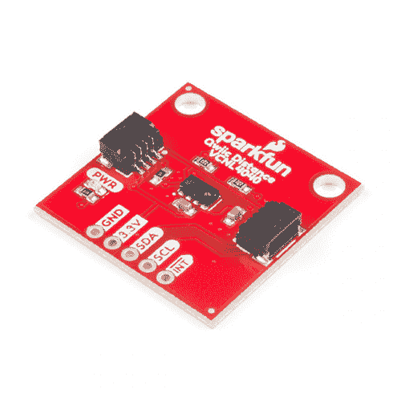](https://www.sparkfun.com/products/15177) 

将**添加到您的[购物车](https://www.sparkfun.com/cart)中！**

### [【spark fun 接近传感器分线点- 20cm，VCNL4040 (Qwiic)](https://www.sparkfun.com/products/15177)

[In stock](https://learn.sparkfun.com/static/bubbles/ "in stock") SEN-15177

SparkFun 接近传感器分线点是一个简单的红外存在和环境光传感器，利用 VCNL4040。

$7.501[Favorited Favorite](# "Add to favorites") 18[Wish List](# "Add to wish list")** **我们经常在自动毛巾分配器、自动水龙头等设备上看到这种类型的传感器。然而，VCNL4040 没有**死区**，可以一直读取到传感器表面。SparkFun Proximity VCNL4040 传感器是流行的模拟 [PIR 传感器](https://www.sparkfun.com/products/13968)的绝佳数字替代品。 [Qwiic 接近传感器](https://www.sparkfun.com/products/15177)还内置了一个环境光传感器，如果你的下一个闪光炮需要一个数字光传感器，这是非常好的。

[https://www.youtube.com/embed/cQOkDvbyovw/?autohide=1&border=0&wmode=opaque&enablejsapi=1](https://www.youtube.com/embed/cQOkDvbyovw/?autohide=1&border=0&wmode=opaque&enablejsapi=1)

该板是我们众多 Qwiic 兼容板之一！简单地即插即用。没有焊接，没有搞清楚这是 SDA 或 SCL，也没有电压调节或翻译的要求！

### 所需材料

Qwiic 接近传感器确实需要一些额外的项目来帮助您开始使用。*你可能已经有了一些这样的物品，所以必要时可以随意修改你的购物车。*

 

将**添加到您的[购物车](https://www.sparkfun.com/cart)中！**

### [SparkFun Qwiic 线缆套件](https://www.sparkfun.com/products/15081)

[In stock](https://learn.sparkfun.com/static/bubbles/ "in stock") KIT-15081

为了更容易上手，我们用 50 毫米到 500 毫米的各种 Qwiic 电缆组装了 Qwiic 电缆套件…

$8.9516[Favorited Favorite](# "Add to favorites") 58[Wish List](# "Add to wish list")**** 

将**添加到您的[购物车](https://www.sparkfun.com/cart)中！**

### [spark fun RedBoard Qwiic](https://www.sparkfun.com/products/15123)

[In stock](https://learn.sparkfun.com/static/bubbles/ "in stock") DEV-15123

SparkFun RedBoard Qwiic 是一款 Arduino 兼容开发板，内置 Qwiic 连接器，无需…

$21.5014[Favorited Favorite](# "Add to favorites") 49[Wish List](# "Add to wish list")**** ****### 推荐阅读

如果你不熟悉跳线垫或 I ² C，一定要检查这些基础教程。

 [### 逻辑电平](https://learn.sparkfun.com/tutorials/logic-levels) Learn the difference between 3.3V and 5V devices and logic levels.[Favorited Favorite](# "Add to favorites") 82 [### I2C](https://learn.sparkfun.com/tutorials/i2c) An introduction to I2C, one of the main embedded communications protocols in use today.[Favorited Favorite](# "Add to favorites") 128 [### 如何使用跳线焊盘和 PCB 走线](https://learn.sparkfun.com/tutorials/how-to-work-with-jumper-pads-and-pcb-traces) Handling PCB jumper pads and traces is an essential skill. Learn how to cut a PCB trace, add a solder jumper between pads to reroute connections, and repair a trace with the green wire method if a trace is damaged.[Favorited Favorite](# "Add to favorites") 11

qw IC 接近传感器利用[qw IC 连接系统](https://www.sparkfun.com/qwiic)。我们建议在使用之前熟悉一下**逻辑电平**和 **I ² C** 教程(如上)。点击上面的横幅，了解有关我们的 [Qwiic 产品](https://www.sparkfun.com/categories/399)的更多信息。

[https://www.youtube.com/embed/x0RDEHqFIF8/?autohide=1&border=0&wmode=opaque&enablejsapi=1](https://www.youtube.com/embed/x0RDEHqFIF8/?autohide=1&border=0&wmode=opaque&enablejsapi=1)

## 硬件概述

**Note:** If you want to do anything outside of what is covered in this tutorial or the example code, please refer to the [VCNL4040 datasheet](https://cdn.sparkfun.com/assets/2/3/8/f/c/VCNL4040_Datasheet.pdf) for exact details on the sensor functionality.

### 电源 LED

有一个电源状态 LED，以帮助确保您的 Qwiic 操纵杆正在通电。你可以通过提供的*极化* **Qwiic 连接器**系统或**分线针** ( **PWR** 和 **GND** )给电路板供电。该 Qwiic 系统旨在使用 **3.3V** ，确保在使用 Qwiic 系统时**而不是**使用其他电压。

[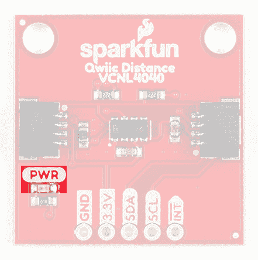](https://cdn.sparkfun.com/assets/learn_tutorials/8/6/4/PowerLED.jpg)

### VCNL4040 传感器

VCNL4040 是一个集成在单个封装中的**接近传感器**(PS)**环境光传感器** (ALS)和大功率 **IR 发射器** (IRED)。环境光传感器和接近传感器以并行结构工作。两个传感器与红外发射器的组合构成了近程探测器。

[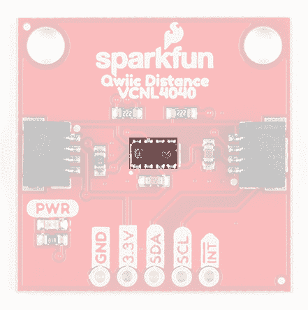](https://cdn.sparkfun.com/assets/learn_tutorials/8/6/4/VCNL4040Sensor.jpg)

传感器的工作电压范围从 **2.5V** 到 **3.6V** 。建议您将此板与 Qwiic connect 系统的预期 **3.3V** 一起使用。VCNL4040 还具有出色的温度补偿功能。对于本指南中未涉及的任何细节，请参考[数据表](https://cdn.sparkfun.com/assets/2/3/8/f/c/VCNL4040_Datasheet.pdf)。

**Note:** This sensor is excellent for detecting qualitative changes (if an object is there or moved since the last reading). If you need quantitative distance readings, like exact distances, check out the SparkFun [2 meter](https://www.sparkfun.com/products/14539) and [4 meter](https://www.sparkfun.com/products/14722) Time of Flight (ToF) sensors with mm accuracy.

#### 红外发射器

红外发射器不受波长为 **940 nm** 的红光的影响(对于那些分立应用)，吸收电流是可编程的( **200 mA 默认值**)。关于红外发射器的更多细节，请参考[数据表](https://cdn.sparkfun.com/assets/2/3/8/f/c/VCNL4040_Datasheet.pdf)。

#### 环境光传感器(ALS)

VCNL4040 提供精度为 10 %的 **16 位**高分辨率 ALS，并且不受荧光灯闪烁的影响。VCNL4040 具有低至 0.01 勒克斯/步的环境光感测能力，在低透射率透镜设计(暗透镜)下工作良好。此外，FiltronTM 专利技术提供了强大的背景光消除能力(包括阳光),而无需利用微控制器资源。

#### 近程传感器(PS)

接近传感器具有智能持续性，这防止了接近感测的误判，但也保持了快速的响应时间。在主动力模式下，可以要求单次测量，以获得更大的设计灵活性和/或省电。

### Qwiic 或 I ² C

#### I ² C 地址

传感器有一个 7 位寻址的单一从机地址 **0x60** (十六进制)，遵循 I ² C 协议。

#### 连接

使用 qw IC 接近传感器最简单的方法是通过 qw IC 连接系统。连接器针对 I ² C 连接和电源进行了极化。(**它们被系在相应的分线销上。*)

[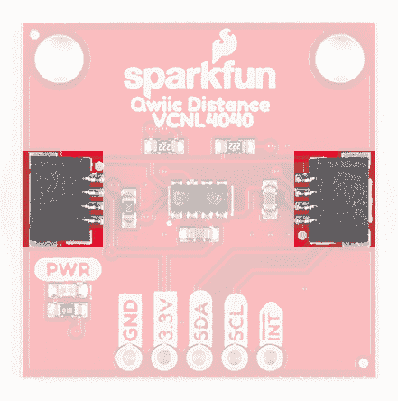](https://cdn.sparkfun.com/assets/learn_tutorials/8/6/4/QwiicConnectors.jpg)

不过，该板还提供了五个带标签的分线引脚。如果没有 Qwiic 连接器，您可以将这些线路连接到微控制器的 I ² C 总线和电源引脚( **3.3V** 和 **GND** )。中断引脚用于触发事件。

[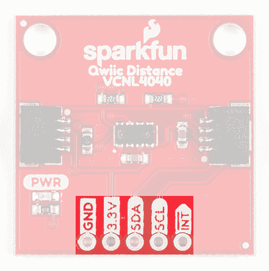](https://cdn.sparkfun.com/assets/learn_tutorials/8/6/4/BreakoutPins.jpg)

#### 中断引脚

High and low interrupt thresholds can be programmed for both the ambient light sensor and proximity sensor, allowing the component to use a minimal amount of the microcontrollers resources. Adjustable persistence sets up the amount of consecutive hits required before an interrupt event occurs, to prevent false triggers.

The VCNL4040 also supports an easy to use proximity detection logic mode, that triggers when the PS high threshold is exceeded and automatically resets the interrupt pin when the proximity reading falls beneath the PS low threshold.

An interrupt can be cleared by reading data out from the **INT_Flag register** (resetting it to "0") and the INT pin is then reset to high. For more details on the interrupt, please refer to the [datasheet](https://cdn.sparkfun.com/assets/2/3/8/f/c/VCNL4040_Datasheet.pdf).

##### 中断跳线

Cutting the **INT** jumper will remove the **10 kΩ** pull-up resistor from the INT pin.[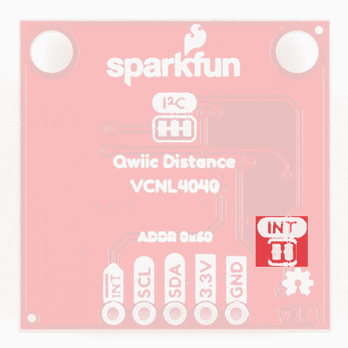](https://cdn.sparkfun.com/assets/learn_tutorials/8/6/4/InterruptJumper.jpg)

#### I ² C 上拉跳线

切断 **I ² C** 跳线将从 I ² C 总线上移除**2.2kω**上拉电阻。如果您的 I ² C 总线上有许多设备，您可能需要移除这些跳线。不知道怎么剪跳线？[看这里！](https://learn.sparkfun.com/tutorials/how-to-work-w-jumper-pads-and-pcb-traces/cutting-a-trace-between-jumper-pads)

[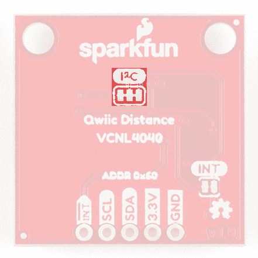](https://cdn.sparkfun.com/assets/learn_tutorials/8/6/4/PullupJumper.jpg)

## 硬件装配

有了 Qwiic 连接器系统，组装硬件变得简单。你只需用 qw IC 电缆将 qw IC 接近传感器连接到 RedBoard Qwiic。否则，如果您的微控制器板上没有 Qwiic 连接器，您可以使用 I ² C 引脚。注意你的输入电压和你可能需要做的任何逻辑电平转换。

[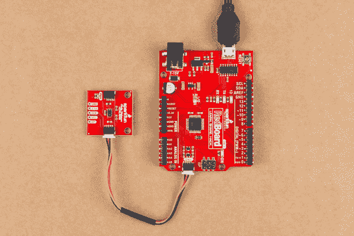](https://cdn.sparkfun.com/assets/learn_tutorials/8/6/4/Assembly.jpg)

## Arduino 图书馆

**Note:** This example assumes you are using the latest version of the Arduino IDE on your desktop. If this is your first time using Arduino, please review our tutorial on [installing the Arduino IDE.](https://learn.sparkfun.com/tutorials/installing-arduino-ide) If you have not previously installed an Arduino library, please check out our [installation guide.](https://learn.sparkfun.com/tutorials/installing-an-arduino-library)

我们已经编写了一个 Arduino 库来灵活使用该传感器的每个功能。你可以通过搜索**‘spark fun vcnl 4040’**从 Arduino 库管理器中获取。否则你可以从 [GitHub 库](https://github.com/sparkfun/SparkFun_VCNL4040_Arduino_Library)获得或者使用下面的下载按钮。

[DOWNLOAD THE VCNL4040 LIBRARY (ZIP)](https://github.com/sparkfun/SparkFun_VCNL4040_Arduino_Library/archive/master.zip)

### 库函数

Arduino 库是注释过的，函数应该是不言自明的。然而，下面是可用库函数的详细列表。

**Note:** It is recommended that users begin with the examples in the following section before diving head first into the library functions. The library examples demonstrate how to setup the more basic features of the VCNL4040 without having to dig through the datasheet. Once users have become familiar with the basic setups and have gone through the [datasheet](https://cdn.sparkfun.com/assets/2/3/8/f/c/VCNL4040_Datasheet.pdf) thoroughly, it should be easier to follow the [library functions](https://github.com/sparkfun/SparkFun_VCNL4040_Arduino_Library/blob/master/src/SparkFun_VCNL4040_Arduino_Library.cpp) below.

`.begin` -检查与传感器的通信，并将其设置为默认 I ² C 线库设置

`.isConnected` -检查连接

`.setLEDCurrent` -将红外 LED 吸收电流设置为 8 种设置之一(75、100、120、140、160、180 和 200 mA)。

`.setIRDutyCycle` -设置红外 LED 的占空比(最大 40。)

`.setProxInterruptPersistance` -设置代理中断持续值。
PS 暂留函数(PS_PERS，1，2，3，4)有助于避免 PS INT 的误触发。它定义了触发 PS 中断事件所需的连续点击次数。 `.setAmbientInterruptPersistance` -设置环境中断持续值
ALS 持续函数(ALS_PERS，1，2，4，8)有助于避免 ALS INT 的错误触发。它定义了触发 ALS 中断事件所需的连续点击量。

`.setProxIntegrationTime` -设置接近传感器
的积分时间`.setAmbientIntegrationTime` -设置环境光传感器的积分时间

`.powerOnProximity` -打开装置的接近感应部分
`.powerOffProximity` -关闭装置的接近感应部分

`.powerOnAmbient` -打开设备 ALS 感应部分的电源
`.powerOffAmbient` -关闭设备 ALS 感应部分的电源

`.setProxResolution` -将邻近分辨率设置为 12 或 16 位

`.enableAmbientInterrupts` -启用 ALS 中断
`.disableAmbientInterrupts` -禁用 ALS 中断

`.enableSmartPersistance` -开启智能预阻
`.disableSmartPersistance` -关闭智能预阻
为了加快 PS 响应时间，智能持续防止了接近感应的误判，同时也保持了快速的响应时间。

`.enableActiveForceMode` -启用主动力模式
`.disableActiveForceMode` -禁用主动力模式
使用 PS 的一种极端省电方式是应用 PS 主动力模式。每当主机想要请求一次近程测量时，启用主动力模式。这将触发一次 PS 测量，可从 PS 结果寄存器中读取。VCNL4040 始终处于待机模式。

`.takeSingleProxMeasurement` -设置触发位，使传感器进行强制模式测量并返回待机状态。

`.enableWhiteChannel` -启用白色测量通道
`.disableWhiteChannel` -禁用白色测量通道

`.enableProxLogicMode` -启用接近检测逻辑输出模式
`.disableProxLogicMode` -禁用接近检测逻辑输出模式
选择该模式时，当物体靠近传感器时(数值高于高阈值)，INT 引脚被拉低，当物体离开时(数值低于低阈值)，INT 引脚被重置为高电平。寄存器:PS_THDH / PS_THDL 定义这些阈值水平的设置位置。

`.setProxCancellation` -设置近程传感消除值-有助于减少环境光的串扰

`.setALSHighThreshold`-ALS 触发中断所必须达到的值
`.setALSLowThreshold`-ALS 触发中断所必须达到的值

`.setProxHighThreshold` -接近感应触发中断所必须达到的值
`.setProxLowThreshold` -接近感应触发中断所必须达到的值

`.getProximity` -读取接近值
`.getAmbient` -读取环境光值
`.getWhite` -读取白光值
`.getID` -读取传感器 ID

`.setProxInterruptType` -启用四种接近中断类型
`.isClose` -中断标志:如果接近值大于高阈值
`.isAway`则为真-中断标志:如果接近值小于低阈值
`.isLight`则为真-中断标志:如果 ALS 值大于高阈值
`.isDark`则为真-中断标志:如果 ALS 值小于低阈值则为真

`.readCommand` -从给定的“命令代码”位置
读取两个连续的字节`.writeCommand` -将两个字节写入给定的命令代码位置(8 位)

## Arduino 示例

**Note:** This section is an example of using the Qwiic Proximity Sensor and the RedBoard Qwiic with the Arduino IDE. It is not intended to be a guide for using I²C devices with the Arduino IDE.

Please use the following links and the internet for a better understanding of I²C and how it works in the Arduino IDE:

*   一个关于 I ² C 的[教程。](https://learn.sparkfun.com/tutorials/i2c/all)
*   [线【I ² C】库](https://www.arduino.cc/en/reference/wire)的[深度概述](https://playground.arduino.cc/Main/WireLibraryDetailedReference)。

### 示例 1:邻近读数

本例从[串行监视器](https://learn.sparkfun.com/tutorials/terminal-basics)中的 VCNL4040 传感器输出 IR 接近值。

[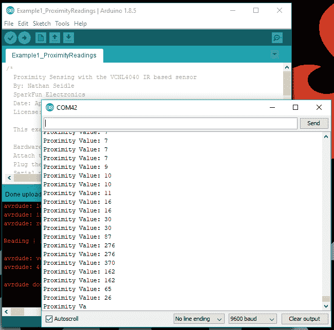](https://cdn.sparkfun.com/assets/learn_tutorials/8/6/4/Example1.PNG)

尽管是定性传感器，但您会注意到输出确实会随着物体的距离、表面颜色和反射率而变化。您也可以使用此设置来估计传感器的视野。最大输出值是 65535，最接近传感器，最小值(0-1)是传感器可以读取的最远值。

### 例子 2:那里有什么东西吗

本例在上电时读取初始读数。如果读数变化很大，传感器会显示出[串行监视器](https://learn.sparkfun.com/tutorials/terminal-basics)中存在某种东西。

[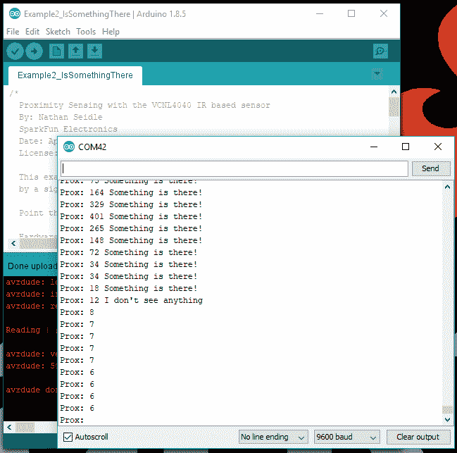](https://cdn.sparkfun.com/assets/learn_tutorials/8/6/4/Example2.PNG)

该示例还允许接近传感器作为两用*光电门*工作。

[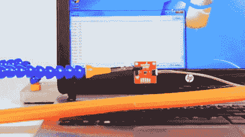](https://cdn.sparkfun.com/assets/learn_tutorials/8/6/4/RaceCarDemo.gif)*A Hot Wheels^(TM) car triggering proximity sensor.*
*(*The speed of the Gif is slowed down for you to see the output in the Serial Monitor.)*

微控制器的串行输出有轻微的延迟(几帧)；然而，由于图像如何被减速，这被夸大了。

### 示例 3:环境光

该示例向[端子](https://learn.sparkfun.com/tutorials/terminal-basics)输出环境光读数。

[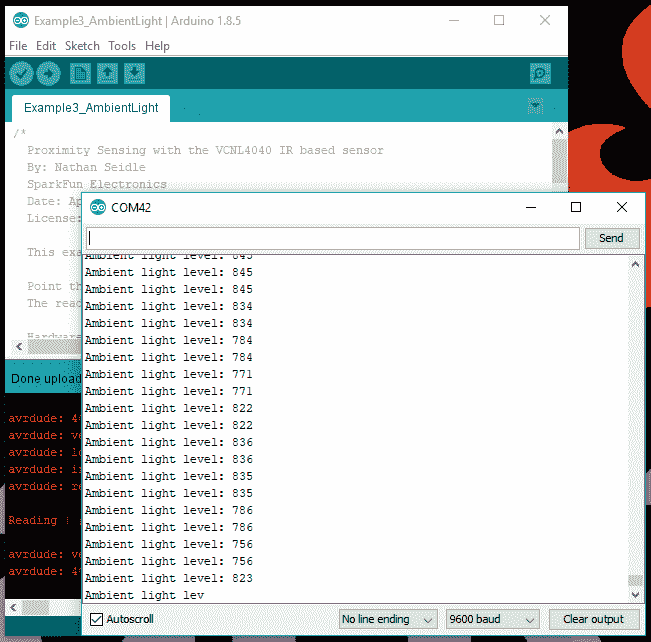](https://cdn.sparkfun.com/assets/learn_tutorials/8/6/4/Example3.PNG)

同样，传感器是定性的，但您可以测试光源的入射角如何影响传感器读数。

### 例 4:所有阅读材料

该示例向终端输出 IR、环境光和白光读数。除了近距离和环境光感测，VCNL4040 还有一个“白光”传感器。

[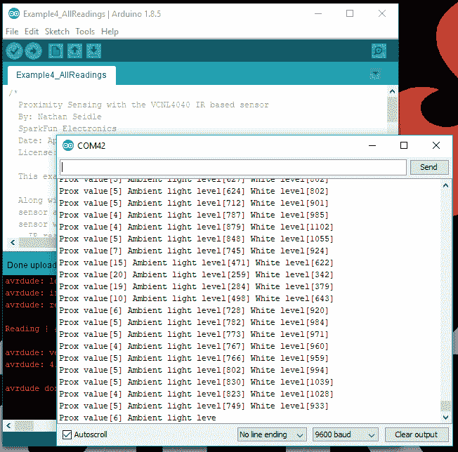](https://cdn.sparkfun.com/assets/learn_tutorials/8/6/4/Example4.PNG)

### 示例 5:高级设置

这个例子展示了如何使用不同的线端口，快速 I ² C，以及库支持的各种高级设置。详情请参考[数据表](https://cdn.sparkfun.com/assets/2/3/8/f/c/VCNL4040_Datasheet.pdf)和上面列出的库函数。

## 资源和更进一步

有关更多信息，请查看以下资源:

*   [GitHub 产品回购](https://github.com/sparkfun/Qwiic_Proximity_Sensor)
*   [示意图(PDF)](https://cdn.sparkfun.com/assets/7/3/8/f/f/Qwiic_Proximity_Sensor.pdf)
*   [老鹰文件(ZIP)](https://cdn.sparkfun.com/assets/e/3/e/5/7/Qwiic_Proximity_Sensor.zip)
*   [VCNL4040 数据手册](https://cdn.sparkfun.com/assets/2/3/8/f/c/VCNL4040_Datasheet.pdf)
*   [SparkFun VCNL4040 Arduino 库 GitHub 库](https://github.com/sparkfun/SparkFun_VCNL4040_Arduino_Library)
*   [SparkFun VCNL4040 Python 包 GitHub 库](https://github.com/sparkfun/Qwiic_Proximity_Py)
*   [SFE 产品展示区](https://www.youtube.com/watch?v=cQOkDvbyovw)

需要帮助入门 Arduino 和 I ² C？点击此处查看这些资源:

*   [Arduino I ² C 扫描仪示例](https://playground.arduino.cc/Main/I2cScanner)
*   [Arduino 电线库参考页面](https://www.arduino.cc/en/reference/wire)
*   [Arduino 电线库(深入)参考](https://playground.arduino.cc/Main/WireLibraryDetailedReference)

你的下一个项目需要一些灵感吗？查看其他一些 Qwiic 产品教程:

 [### Qwiic 人体感应传感器(AK9753)连接指南](https://learn.sparkfun.com/tutorials/qwiic-human-presence-sensor-ak9753-hookup-guide) How to get started with your Qwiic enabled AK9753 Human Presence Sensor.[Favorited Favorite](# "Add to favorites") 3 [### Qwiic 秤连接指南](https://learn.sparkfun.com/tutorials/qwiic-scale-hookup-guide) Create your own digital scale quickly and easily using the Qwiic Scale 4 [### Qwiic 大气传感器(BME280)连接指南](https://learn.sparkfun.com/tutorials/qwiic-atmospheric-sensor-bme280-hookup-guide) Measure temperature, humidity, barometric pressure with the SparkFun Atmospheric Sensor Breakout BME280 (Qwiic).[Favorited Favorite](# "Add to favorites") 4 [### Sphero RVR 自主套件入门](https://learn.sparkfun.com/tutorials/getting-started-with-the-autonomous-kit-for-the-sphero-rvr) Want to get started in robotics? Look no further than the SparkFun autonomous kit for the Sphero RVR! Whether you purchased the Basic or Advanced kit, this tutorial will get you rolling...[Favorited Favorite](# "Add to favorites") 3******