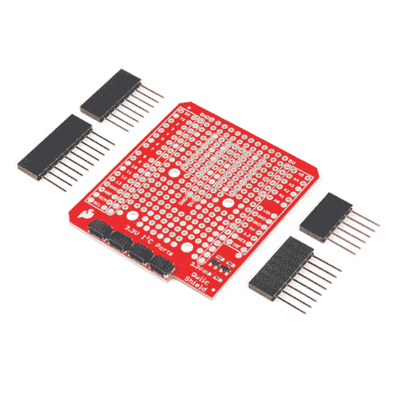
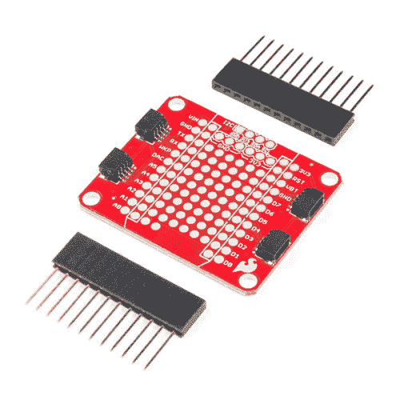
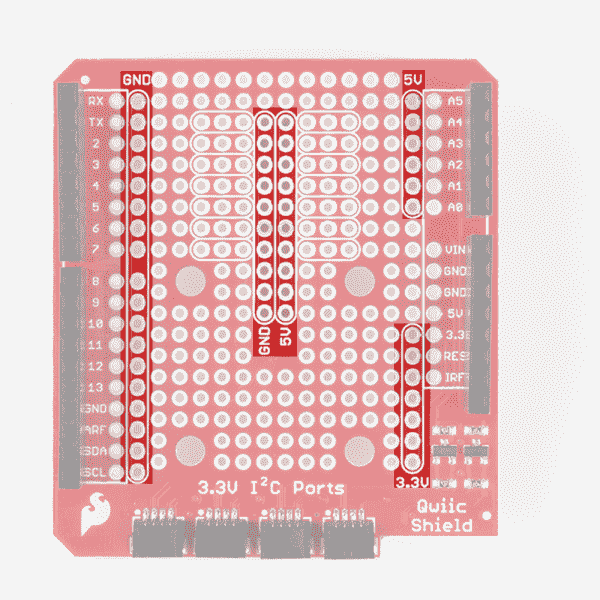
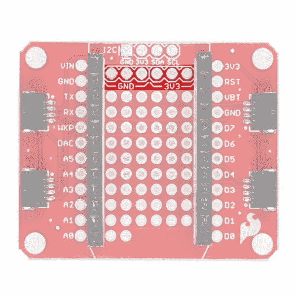
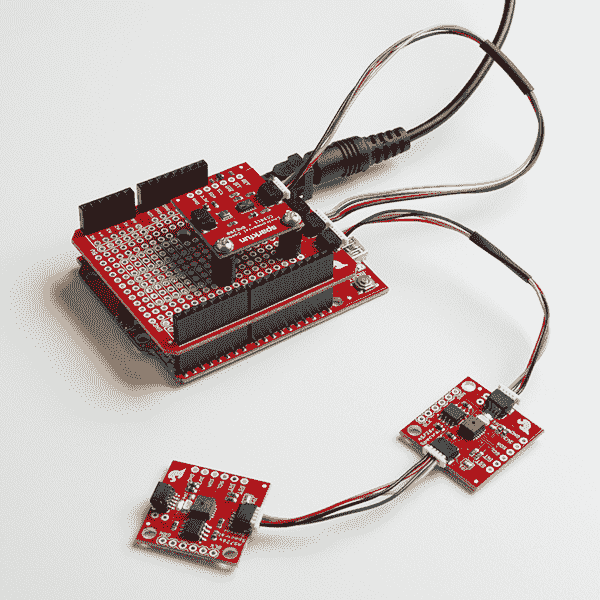
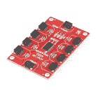

# Arduino 和光子连接指南的 Qwiic 屏蔽

> 原文：<https://learn.sparkfun.com/tutorials/qwiic-shield-for-arduino--photon-hookup-guide>

## 介绍

Qwiic Shield(用于 [Arduino](https://www.sparkfun.com/products/14352) 或[粒子光子](https://www.sparkfun.com/products/14202))是熟悉 SparkFun 的 Qwiic connect 生态系统的第一步。它将 Arduino 或光子板上的 I ² C 总线(GND、3.3V、SDA 和 SCL)连接到一系列 SparkFun Qwiic 连接器。在我们的 Qwiic 生态系统中，该板已经具有将 5V 电压转换为 I2C 板所需的 3.3V 电压的电路。Arduino 保护罩也有安装 Qwiic 板的孔。由于 Qwiic 系统允许菊花链(只要您的设备在不同的地址)，您可以堆叠任意多的传感器，以创建一个感应电源塔！

 

将**添加到您的[购物车](https://www.sparkfun.com/cart)中！**

### [ArduinoT3 的 SparkFun Qwiic 盾](https://www.sparkfun.com/products/14352)

[In stock](https://learn.sparkfun.com/static/bubbles/ "in stock") DEV-14352

SparkFun Qwiic Shield 是一种易于组装的板，它提供了一种简单的方法来将 Qwiic Connect 系统与

$7.508[Favorited Favorite](# "Add to favorites") 39[Wish List](# "Add to wish list")**** 

将**添加到您的[购物车](https://www.sparkfun.com/cart)中！**

### [光子盾](https://www.sparkfun.com/products/14477)

[28 available](https://learn.sparkfun.com/static/bubbles/ "28 available") DEV-14477

SparkFun Qwiic Shield for Photon 是一个易于组装的板，提供了一种简单的方法来整合 Qwiic 系统…

$6.50[Favorited Favorite](# "Add to favorites") 7[Wish List](# "Add to wish list")**** ****这里有一个 Arduino 的 Qwiic 盾的快速概述。光子的 Qwiic 屏蔽是相似的，但是是为粒子光子的足迹制造的。

[https://www.youtube.com/embed/Rw3IHsx46aM/?autohide=1&border=0&wmode=opaque&enablejsapi=1](https://www.youtube.com/embed/Rw3IHsx46aM/?autohide=1&border=0&wmode=opaque&enablejsapi=1)

### 所需材料

按照这个连接指南，你需要任何带有 R3 插头的 Arduino，或者一个光子板。这包括 Uno、RedBoard 和许多其他 Arduino 兼容板！这里只是一些兼容的板。

 

将**添加到您的[购物车](https://www.sparkfun.com/cart)中！**

### [Arduino Uno - R3](https://www.sparkfun.com/products/11021)

[In stock](https://learn.sparkfun.com/static/bubbles/ "in stock") DEV-11021

这是新的 Arduino Uno R3。除了以前主板的所有功能外，Uno 现在使用 ATmega16U2 代替…

$27.95138[Favorited Favorite](# "Add to favorites") 162[Wish List](# "Add to wish list")**** 

将**添加到您的[购物车](https://www.sparkfun.com/cart)中！**

### [spark fun red board——用 Arduino 编程 T3](https://www.sparkfun.com/products/13975)

[In stock](https://learn.sparkfun.com/static/bubbles/ "in stock") DEV-13975

SparkFun RedBoard 结合了 UNO 的 Optiboot 引导程序的简单性、FTDI 的稳定性和 shield com…

$21.5049[Favorited Favorite](# "Add to favorites") 89[Wish List](# "Add to wish list")**** 

将**添加到您的[购物车](https://www.sparkfun.com/cart)中！**

### [【粒子光子】](https://www.sparkfun.com/products/13774)

[Out of stock](https://learn.sparkfun.com/static/bubbles/ "out of stock") WRL-13774

Particle 的 IoT(物联网)硬件开发板 Photon 提供了构建互联网络所需的一切…

$19.0032[Favorited Favorite](# "Add to favorites") 51[Wish List](# "Add to wish list")****** ******如果你没有任何 Qwiic 产品与之配合使用，你可能不会购买 Qwiic shield，对吗？好吧，如果你没有任何 Qwiic 产品，以下可能是一个不错的开始。

 

### [【spark fun 环保组合 Breakout-CCS 811/BME 280(Qwiic)](https://www.sparkfun.com/products/14348)

[Out of stock](https://learn.sparkfun.com/static/bubbles/ "out of stock") SEN-14348

SparkFun CCS811/BME280 环境组合突破满足您所有的大气质量感测需求

20[Favorited Favorite](# "Add to favorites") 63[Wish List](# "Add to wish list") 

将**添加到您的[购物车](https://www.sparkfun.com/cart)中！**

### [SparkFun Qwiic 适配器](https://www.sparkfun.com/products/14495)

[In stock](https://learn.sparkfun.com/static/bubbles/ "in stock") DEV-14495

SparkFun Qwiic 适配器提供了将任何旧 I ² C 板改造成支持 Qwiic 的板的完美方法。

$1.601[Favorited Favorite](# "Add to favorites") 53[Wish List](# "Add to wish list")**** 

将**添加到您的[购物车](https://www.sparkfun.com/cart)中！**

### [【spark fun GPS Breakout-xa 1110(Qwiic)](https://www.sparkfun.com/products/14414)

[In stock](https://learn.sparkfun.com/static/bubbles/ "in stock") GPS-14414

SparkFun XA1110 GPS Breakout 是一款 I2C 支持的小型模块，由于采用了 Qwiic Connect 系统，因此易于连接。电子邮件…

$34.955[Favorited Favorite](# "Add to favorites") 25[Wish List](# "Add to wish list")**** 

将**添加到您的[购物车](https://www.sparkfun.com/cart)中！**

### [【spark fun 光谱传感器分线点- AS7262 可见光(Qwiic)](https://www.sparkfun.com/products/14347)

[26 available](https://learn.sparkfun.com/static/bubbles/ "26 available") SEN-14347

SparkFun AS7262 可见光谱传感器突破将光谱学带到您的手掌上，比以往任何时候都更容易…

$27.952[Favorited Favorite](# "Add to favorites") 27[Wish List](# "Add to wish list")****** ******最后，您将需要我们方便的 qw IC 电缆来轻松地将传感器连接到 qw IC 屏蔽罩。以下是几个选项。

 

将**添加到您的[购物车](https://www.sparkfun.com/cart)中！**

### [Qwiic 线缆- 100mm](https://www.sparkfun.com/products/14427)

[In stock](https://learn.sparkfun.com/static/bubbles/ "in stock") PRT-14427

这是一条 100 毫米长的 4 芯电缆，带有 1 毫米 JST 端接。它旨在将支持 Qwiic 的组件连接在一起…

$1.50[Favorited Favorite](# "Add to favorites") 32[Wish List](# "Add to wish list")**** 

将**添加到您的[购物车](https://www.sparkfun.com/cart)中！**

### [Qwiic 线缆- 500mm](https://www.sparkfun.com/products/14429)

[In stock](https://learn.sparkfun.com/static/bubbles/ "in stock") PRT-14429

这是一根 500mm 长的 4 芯电缆，带有 1mm JST 端接。它旨在将支持 Qwiic 的组件连接在一起…

$1.951[Favorited Favorite](# "Add to favorites") 25[Wish List](# "Add to wish list")**** 

将**添加到您的[购物车](https://www.sparkfun.com/cart)中！**

### [Qwiic 线缆- 50mm](https://www.sparkfun.com/products/14426)

[In stock](https://learn.sparkfun.com/static/bubbles/ "in stock") PRT-14426

这是一根 50 毫米长的 4 芯电缆，带有 1 毫米 JST 端接。它旨在将支持 Qwiic 的组件连接在一起…

$0.95[Favorited Favorite](# "Add to favorites") 29[Wish List](# "Add to wish list")**** 

### [Qwiic 线缆- 200mm](https://www.sparkfun.com/products/14428)

[Out of stock](https://learn.sparkfun.com/static/bubbles/ "out of stock") PRT-14428

这是一根 200 毫米长的 4 芯电缆，带有 1 毫米 JST 端接。它旨在将支持 Qwiic 的组件连接在一起…

[Favorited Favorite](# "Add to favorites") 21[Wish List](# "Add to wish list")****** ******### 所需工具

您将需要一个[烙铁](https://www.sparkfun.com/categories/49)、焊料和通用焊接附件来将接头引脚焊接到 Qwiic 屏蔽上。

 

将**添加到您的[购物车](https://www.sparkfun.com/cart)中！**

### [无铅焊料- 15 克管](https://www.sparkfun.com/products/9163)

[In stock](https://learn.sparkfun.com/static/bubbles/ "in stock") TOL-09163

这是你的无铅焊料的基本管，带有不干净的水溶性树脂芯。0.031 英寸规格，15 克

$3.954[Favorited Favorite](# "Add to favorites") 14[Wish List](# "Add to wish list")**** 

将**添加到您的[购物车](https://www.sparkfun.com/cart)中！**

### [烙铁- 30W(美国，110V)](https://www.sparkfun.com/products/9507)

[33 available](https://learn.sparkfun.com/static/bubbles/ "33 available") TOL-09507

这是一个非常简单的固定温度，快速加热，30W 110/120 VAC 烙铁。我们真的很喜欢使用更贵的 iro…

$10.957[Favorited Favorite](# "Add to favorites") 21[Wish List](# "Add to wish list")**** ****### 推荐阅读

如果你不熟悉 Qwiic 系统，我们推荐你在这里阅读[以获得一个概述](https://www.sparkfun.com/qwiic)。

|  |
| *[Qwiic 连接系统](https://www.sparkfun.com/qwiic)* |

如果你不熟悉下面的教程，我们也建议你看一看。

 [### 如何焊接:通孔焊接](https://learn.sparkfun.com/tutorials/how-to-solder-through-hole-soldering) This tutorial covers everything you need to know about through-hole soldering.[Favorited Favorite](# "Add to favorites") 70 [### I2C](https://learn.sparkfun.com/tutorials/i2c) An introduction to I2C, one of the main embedded communications protocols in use today.[Favorited Favorite](# "Add to favorites") 128 [### Arduino Shields v2](https://learn.sparkfun.com/tutorials/arduino-shields-v2) An update to our classic Arduino Shields Tutorial! All things Arduino shields. What they are and how to assemble them.[Favorited Favorite](# "Add to favorites") 5

## 硬件概述

### Arduino 的 Qwiic 屏蔽

**Note:** The shield includes R3 Arduino headers, but they are not pre-soldered onto the board, so some assembly will be required when putting the shield together. The image below shows the shield after the header has been soldered to the PCB to.

qw IC 屏蔽有 4 个 qw IC 连接端口，都在同一 I ² C 总线上。Qwiic 连接端口的 SDA 和 SCL 线包括逻辑电平转换器，因此您不必担心使用 5V(或 3.3V)设备的 Qwiic 系统。

除此之外，还包括一个大的原型制作区域。如下图所示，用于 Arduino 的 Qwiic shield 有一些简洁的功能，例如一些 3 乘 1 轨道，有助于原型制作。

Arduino 的屏蔽上也有接地、5V 和 3.3V 总线，如下所述。

接头还允许您选择的微控制器上的每个引脚仍然可以通过母接头访问。

### 光子的量子屏蔽

**Note:** The shield includes headers, but they are not pre-soldered onto the board, so some assembly will be required when putting the shield together. The image below shows the shield after the header has been soldered to the PCB to.

粒子光子的 Qwiic 屏蔽还包括 4 个 Qwiic 连接端口、一个原型制作区域以及 3.3V 和接地总线。然而，它们要小得多。Photon 是一个 3.3V 系统，假设您使用的是 3.3V 器件，因此设计中不包括逻辑电平转换。如果你使用的是 5V 的 I ² C 设备，一定要带上一个[双向逻辑电平转换器](https://www.sparkfun.com/products/12009)。

## 硬件装配

要开始使用 Qwiic shield，您需要做的只是在接头上[焊接](https://learn.sparkfun.com/tutorials/how-to-solder-through-hole-soldering)。关于如何用 Arduino shields 做到这一点的详细描述，只需查看我们的 [Arduino shield 教程](https://learn.sparkfun.com/tutorials/arduino-shields-v2#installing-headers-preparation)。它会让你开始把那些头正确地连接到你的盾上。这些提示在安装光子 Qwiic 屏蔽接头时也很有用。

一旦您将接头连接到 Qwiic shield，您就可以将它插入您选择的 qw IC 启用板了。下面是一个例子，几个 Qwiic 传感器菊花链到 Arduino 的 Qwiic 屏蔽。如果你需要安装 Qwiic 传感器，只需拿几个[支架](https://www.sparkfun.com/products/10927)和[螺丝](https://www.sparkfun.com/products/10453)。插入任何支持 Qwiic 的主板，然后开始使用！

## 资源和更进一步

有关更多信息，请查看以下资源:

*   Arduino 的 Qwiic 屏蔽
    *   [示意图(PDF)](https://cdn.sparkfun.com/assets/5/1/a/3/b/Qwiic_Shield_for_Arduino_v10.pdf)
    *   [老鹰文件(ZIP)](https://cdn.sparkfun.com/assets/5/c/0/0/d/Qwiic_Shield_for_Arduino_v10_1.zip)
    *   [GitHub 库](https://github.com/sparkfun/Qwiic_Shield_for_Arduino)
    *   [产品展示:Arduino Qwiic Shield](https://www.youtube.com/watch?v=Rw3IHsx46aM)
*   光子的量子屏蔽
    *   [示意图(PDF)](https://cdn.sparkfun.com/assets/c/a/8/5/e/Qwiic_Shield_for_Photon.pdf)
    *   [老鹰文件(ZIP)](https://cdn.sparkfun.com/assets/5/c/c/1/0/Qwiic_Shield_for_Photon_1.zip)
    *   [GitHub 库](https://github.com/sparkfun/Qwiic_Shield_for_Photon)
    *   [产品展示:Qwiic 光子屏蔽器](https://youtu.be/qX2TFK7cfXs)
*   [Qwiic 系统登陆页面](https://www.sparkfun.com/qwiic)

既然你已经准备好了 Qwiic shield，是时候看看一些 [Qwiic 支持的产品](https://www.sparkfun.com/qwiic)了。下面是几个开始。

 

将**添加到您的[购物车](https://www.sparkfun.com/cart)中！**

### [【spark fun Qwiic Mux Breakout-8 通道(TCA9548A)](https://www.sparkfun.com/products/16784)

[In stock](https://learn.sparkfun.com/static/bubbles/ "in stock") BOB-16784

SparkFun Qwiic Mux 分线架支持与多个具有相同地址的 I2C 设备进行通信，从而简化了

$12.958[Favorited Favorite](# "Add to favorites") 30[Wish List](# "Add to wish list")**** 

### [【spark fun 三轴加速度计突破- MMA8452Q (Qwiic)](https://www.sparkfun.com/products/retired/14587)

[Retired](https://learn.sparkfun.com/static/bubbles/ "Retired") SEN-14587

这种分线板使得在您的项目中使用微型 MMA8452Q 加速度计通过 I2C 进行通信变得非常容易。

1 **Retired**[Favorited Favorite](# "Add to favorites") 10[Wish List](# "Add to wish list") 

将**添加到您的[购物车](https://www.sparkfun.com/cart)中！**

### [【spark fun 微有机发光二极管突围(Qwiic)](https://www.sparkfun.com/products/14532)

[In stock](https://learn.sparkfun.com/static/bubbles/ "in stock") LCD-14532

SparkFun Qwiic 微型有机发光二极管突破是 Qwiic 启用版本的流行微视图和微型有机发光二极管显示器！

$18.506[Favorited Favorite](# "Add to favorites") 45[Wish List](# "Add to wish list")**** 

将**添加到您的[购物车](https://www.sparkfun.com/cart)中！**

### [【spark fun 电容式触摸滑盖- CAP1203 (Qwiic)](https://www.sparkfun.com/products/15344)

[In stock](https://learn.sparkfun.com/static/bubbles/ "in stock") SEN-15344

使用 Qwiic 将电容式触摸添加到您的下一个项目中，这样您就可以开始将触摸功能作为三种独特的触摸方式来玩了

$6.50[Favorited Favorite](# "Add to favorites") 26[Wish List](# "Add to wish list")****** ******### 但是我已经有传感器了！

如果你已经有一把 SparkFun 传感器和零件？多年来，SparkFun 一直在我们所有的 I2C 板上安装我们的标准 GND/VCC/SDA/SCL 引脚排列。这使得它可以连接一个 Qwiic 适配器，将您的 SparkFun I ² C 传感器或执行器安装到 Qwiic 系统上。

以下是具有标准 I ² C 引脚排列并将与 [Qwiic 适配板](https://www.sparkfun.com/products/14237)配合使用的主板列表:

*   [9DoF Stick IMU - LSM9DS1](https://www.sparkfun.com/products/13944)
*   [9 自由度 IMU - MPU-9250](https://www.sparkfun.com/products/13762)
*   [6 自由度 IMU - LSM303C](https://www.sparkfun.com/products/13303)
*   [6 自由度 IMU - LSM6DS3](https://www.sparkfun.com/products/13339)
*   [三轴加速度计- LIS3DH](https://www.sparkfun.com/products/13963)
*   [三轴磁力仪- MAG3110](https://www.sparkfun.com/products/12670)
*   [三轴磁力仪- MLX90393](https://www.sparkfun.com/products/14160)
*   [罗盘模块- HMC6343](https://www.sparkfun.com/products/12916)
*   [大气传感器- BME280](https://www.sparkfun.com/products/13676)
*   [气压传感器- MS5803-14BA](https://www.sparkfun.com/products/12909)
*   [气压传感器- T5403](https://www.sparkfun.com/products/12039)
*   [湿度和温度传感器- Si7021](https://www.sparkfun.com/products/13763)
*   [数字温度传感器- TMP102](https://www.sparkfun.com/products/13314)
*   [粒子传感器- MAX30105](https://www.sparkfun.com/products/14045)
*   [空气质量传感器- CCS811](https://www.sparkfun.com/products/14181)
*   [ToF 测距仪- VL6180](https://www.sparkfun.com/products/12785)
*   [触觉电机驱动器- DRV2605L](https://www.sparkfun.com/products/14031)
*   [微型有机发光二极管显示器](https://www.sparkfun.com/products/13003)
*   [RGB 和手势传感器- APDS-9960](https://www.sparkfun.com/products/12787)
*   [RGB 光传感器- ISL29125](https://www.sparkfun.com/products/12829)
*   [LED 驱动器- LP55231](https://www.sparkfun.com/products/14031)
*   [DAC 分线点- MCP4725](https://www.sparkfun.com/products/12918)
*   [16 输出 I/O 扩展器- SX1509](https://www.sparkfun.com/products/13601)
*   [电池保姆- BQ24075](https://www.sparkfun.com/products/13777)********************************