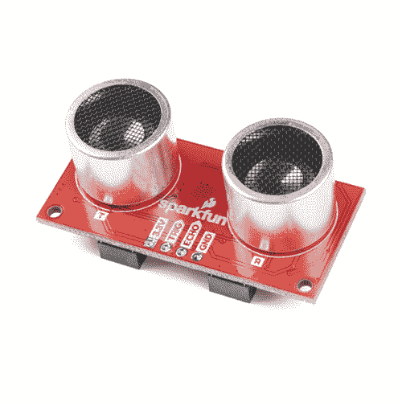

# Qwiic 超声波距离传感器(HC-SR04)连接指南

> 原文：<https://learn.sparkfun.com/tutorials/qwiic-ultrasonic-distance-sensor-hc-sr04-hookup-guide>

## 介绍

[SparkFun Qwiic 超声波距离传感器](https://www.sparkfun.com/products/17777)非常适合提供从 2 厘米到 400 厘米的非接触式距离读数。它对经典的 HC-SR04 距离传感器进行了改进，增加了一对 qw IC 连接器，因此现在您可以通过 I ² C 和菊花链与您选择的任何其他 qw IC 产品进行通信。

如果您喜欢绕过 Qwiic 连接器和 I ² C，您也可以使用电路板边缘的 VCC、触发器、回波和接地引脚。请注意，这种超声波传感器是未经校准的，您需要根据您的具体应用来处理原始输出。来看看这个好玩的板子吧！

 

将**添加到您的[购物车](https://www.sparkfun.com/cart)中！**

### [SparkFun Qwiic 超声波距离传感器- HC-SR04](https://www.sparkfun.com/products/17777)

[In stock](https://learn.sparkfun.com/static/bubbles/ "in stock") SEN-17777

HC-SR04 距离传感器非常适合从 2 厘米到 400 厘米的非接触式距离读数。本装置增加了一对 Qwiic 连接器…

$17.951[Favorited Favorite](# "Add to favorites") 8[Wish List](# "Add to wish list")** **### 所需材料

要跟随本教程，您将需要以下材料。你可能不需要所有的东西，这取决于你拥有什么。将它添加到您的购物车，通读指南，并根据需要调整购物车。**