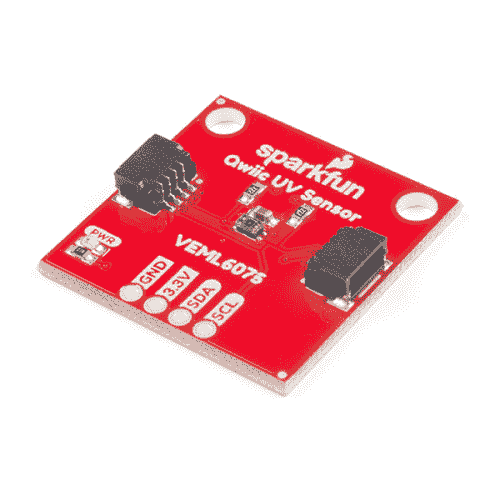
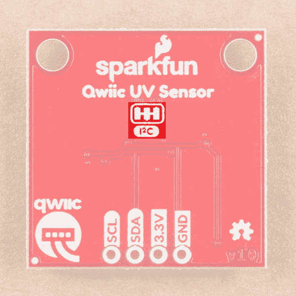
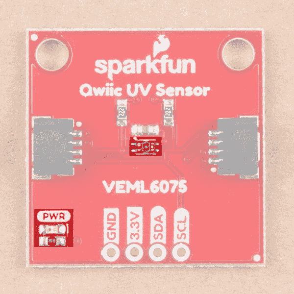
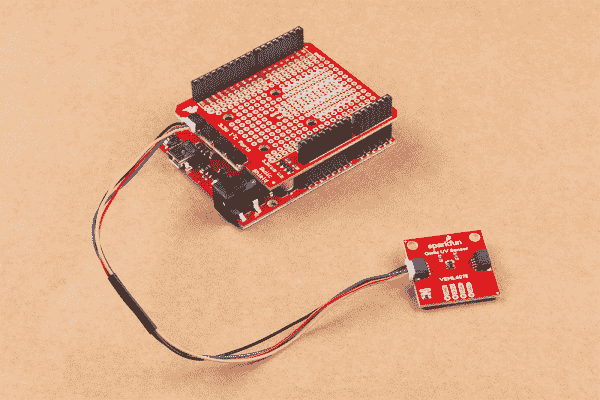
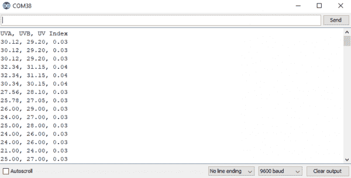
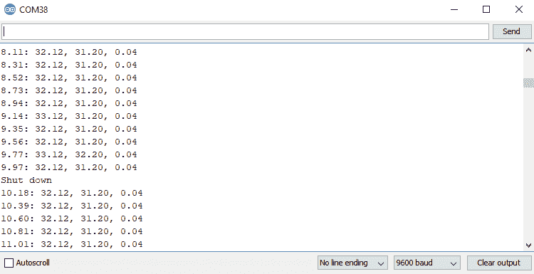
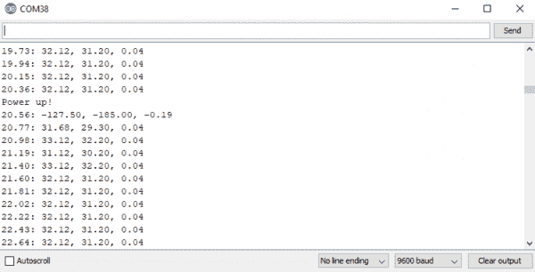
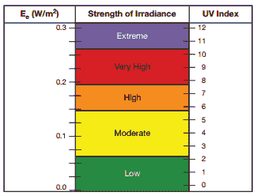
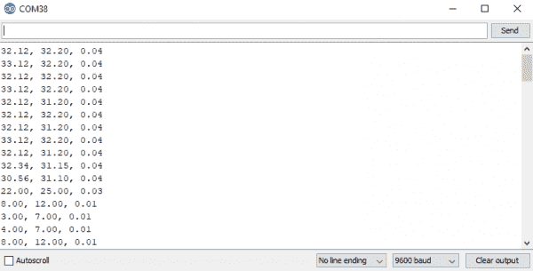

# Qwiic 紫外线传感器(VEML6075)连接指南

> 原文：<https://learn.sparkfun.com/tutorials/qwiic-uv-sensor-veml6075-hookup-guide>

## 介绍

[VEML6075](https://www.sparkfun.com/products/15089) 是 SparkFun 最新的[紫外线](https://en.wikipedia.org/wiki/Ultraviolet)感应解决方案。VEML6075 采用简单的光电二极管来测量 UVA (320-400 纳米)和 UVB (280-320 纳米)辐射水平。我们可以在[辐照度](https://en.wikipedia.org/wiki/Irradiance)中读取这种光的强度，并由此计算出[紫外线指数](https://en.wikipedia.org/wiki/Ultraviolet_index)。Qwiic 紫外线传感器有两个光谱测量范围，UVA(365&pm；10 纳米)和 UVB。(330&pm；10 纳米)

[](https://www.sparkfun.com/products/15089) 

将**添加到您的[购物车](https://www.sparkfun.com/cart)中！**

### [【spark fun 紫外线传感器分线点- VEML6075 (Qwiic)](https://www.sparkfun.com/products/15089)

[In stock](https://learn.sparkfun.com/static/bubbles/ "in stock") SEN-15089

VEML6075 紫外线传感器突破是 SparkFun 的最新紫外线传感解决方案。

$7.50[Favorited Favorite](# "Add to favorites") 18[Wish List](# "Add to wish list")** **[https://www.youtube.com/embed/P5Uw5tRamAI/?autohide=1&border=0&wmode=opaque&enablejsapi=1](https://www.youtube.com/embed/P5Uw5tRamAI/?autohide=1&border=0&wmode=opaque&enablejsapi=1)

### 所需材料

首先，你需要一个微控制器来控制一切。你可能不需要所有的东西，这取决于你拥有什么。将它添加到您的购物车，通读指南，并根据需要调整购物车。

[](https://www.sparkfun.com/products/13975) 

将**添加到您的[购物车](https://www.sparkfun.com/cart)中！**

### [spark fun red board——用 Arduino 编程 T3](https://www.sparkfun.com/products/13975)

[In stock](https://learn.sparkfun.com/static/bubbles/ "in stock") DEV-13975

SparkFun RedBoard 结合了 UNO 的 Optiboot 引导程序的简单性、FTDI 的稳定性和 shield com…

$21.5049[Favorited Favorite](# "Add to favorites") 89[Wish List](# "Add to wish list")****[](https://www.sparkfun.com/products/13907) 

将**添加到您的[购物车](https://www.sparkfun.com/cart)中！**

### [SparkFun ESP32 东西](https://www.sparkfun.com/products/13907)

[In stock](https://learn.sparkfun.com/static/bubbles/ "in stock") DEV-13907

SparkFun ESP32 Thing 是 Espressif 的 ESP32 的综合开发平台，ESP32 是他们的超级充电版本…

$23.5069[Favorited Favorite](# "Add to favorites") 83[Wish List](# "Add to wish list")****[](https://www.sparkfun.com/products/13774) 

将**添加到您的[购物车](https://www.sparkfun.com/cart)中！**

### [【粒子光子】](https://www.sparkfun.com/products/13774)

[Out of stock](https://learn.sparkfun.com/static/bubbles/ "out of stock") WRL-13774

Particle 的 IoT(物联网)硬件开发板 Photon 提供了构建互联网络所需的一切…

$19.0032[Favorited Favorite](# "Add to favorites") 51[Wish List](# "Add to wish list")****[](https://www.sparkfun.com/products/retired/13825) 

### [树莓派 3](https://www.sparkfun.com/products/retired/13825)

[Retired](https://learn.sparkfun.com/static/bubbles/ "Retired") DEV-13825

每个人都知道并喜欢 Raspberry Pi，但如果您不需要额外的外设来使其无线化会怎么样呢？覆盆子…

92 **Retired**[Favorited Favorite](# "Add to favorites") 97[Wish List](# "Add to wish list")****** ******现在，要进入 Qwiic 生态系统，关键是以下 Qwiic 屏蔽之一，以符合您对微控制器的偏好:

[](https://www.sparkfun.com/products/14352) 

将**添加到您的[购物车](https://www.sparkfun.com/cart)中！**

### [ArduinoT3 的 SparkFun Qwiic 盾](https://www.sparkfun.com/products/14352)

[In stock](https://learn.sparkfun.com/static/bubbles/ "in stock") DEV-14352

SparkFun Qwiic Shield 是一种易于组装的板，它提供了一种简单的方法来将 Qwiic Connect 系统与

$7.508[Favorited Favorite](# "Add to favorites") 39[Wish List](# "Add to wish list")****[](https://www.sparkfun.com/products/14459) 

将**添加到您的[购物车](https://www.sparkfun.com/cart)中！**

### [树莓派的 SparkFun Qwiic 帽子](https://www.sparkfun.com/products/14459)

[In stock](https://learn.sparkfun.com/static/bubbles/ "in stock") DEV-14459

树莓派的 SparkFun Qwiic 帽子是进入 Qwiic 生态系统的最快捷、最简单的方式，并且仍然适用于

$6.505[Favorited Favorite](# "Add to favorites") 33[Wish List](# "Add to wish list")****[](https://www.sparkfun.com/products/14477) 

将**添加到您的[购物车](https://www.sparkfun.com/cart)中！**

### [光子盾](https://www.sparkfun.com/products/14477)

[28 available](https://learn.sparkfun.com/static/bubbles/ "28 available") DEV-14477

SparkFun Qwiic Shield for Photon 是一个易于组装的板，提供了一种简单的方法来整合 Qwiic 系统…

$6.50[Favorited Favorite](# "Add to favorites") 7[Wish List](# "Add to wish list")****** ******您还需要一根 Qwiic 电缆将屏蔽罩连接到您的紫外线传感器，选择适合您需要的长度。

[](https://www.sparkfun.com/products/14427) 

将**添加到您的[购物车](https://www.sparkfun.com/cart)中！**

### [Qwiic 线缆- 100mm](https://www.sparkfun.com/products/14427)

[In stock](https://learn.sparkfun.com/static/bubbles/ "in stock") PRT-14427

这是一条 100 毫米长的 4 芯电缆，带有 1 毫米 JST 端接。它旨在将支持 Qwiic 的组件连接在一起…

$1.50[Favorited Favorite](# "Add to favorites") 32[Wish List](# "Add to wish list")****[](https://www.sparkfun.com/products/14429) 

将**添加到您的[购物车](https://www.sparkfun.com/cart)中！**

### [Qwiic 线缆- 500mm](https://www.sparkfun.com/products/14429)

[In stock](https://learn.sparkfun.com/static/bubbles/ "in stock") PRT-14429

这是一根 500mm 长的 4 芯电缆，带有 1mm JST 端接。它旨在将支持 Qwiic 的组件连接在一起…

$1.951[Favorited Favorite](# "Add to favorites") 25[Wish List](# "Add to wish list")****[](https://www.sparkfun.com/products/14426) 

将**添加到您的[购物车](https://www.sparkfun.com/cart)中！**

### [Qwiic 线缆- 50mm](https://www.sparkfun.com/products/14426)

[In stock](https://learn.sparkfun.com/static/bubbles/ "in stock") PRT-14426

这是一根 50 毫米长的 4 芯电缆，带有 1 毫米 JST 端接。它旨在将支持 Qwiic 的组件连接在一起…

$0.95[Favorited Favorite](# "Add to favorites") 29[Wish List](# "Add to wish list")****[](https://www.sparkfun.com/products/14428) 

### [Qwiic 线缆- 200mm](https://www.sparkfun.com/products/14428)

[Out of stock](https://learn.sparkfun.com/static/bubbles/ "out of stock") PRT-14428

这是一根 200 毫米长的 4 芯电缆，带有 1 毫米 JST 端接。它旨在将支持 Qwiic 的组件连接在一起…

[Favorited Favorite](# "Add to favorites") 21[Wish List](# "Add to wish list")****** ******### 推荐阅读

如果你不熟悉 Qwiic 系统，我们推荐你在这里阅读[以获得一个概述](https://www.sparkfun.com/qwiic)。

| [](https://www.sparkfun.com/qwiic) |
| *[Qwiic 连接系统](https://www.sparkfun.com/qwiic)* |

如果你不熟悉下面的教程，我们也建议你看一看。

[](https://learn.sparkfun.com/tutorials/serial-communication) [### 串行通信](https://learn.sparkfun.com/tutorials/serial-communication) Asynchronous serial communication concepts: packets, signal levels, baud rates, UARTs and more 100[](https://learn.sparkfun.com/tutorials/light) [### 光](https://learn.sparkfun.com/tutorials/light) Light is a useful tool for the electrical engineer. Understanding how light relates to electronics is a fundamental skill for many projects.[Favorited Favorite](# "Add to favorites") 24[](https://learn.sparkfun.com/tutorials/i2c) [### I2C](https://learn.sparkfun.com/tutorials/i2c) An introduction to I2C, one of the main embedded communications protocols in use today.[Favorited Favorite](# "Add to favorites") 128[](https://learn.sparkfun.com/tutorials/terminal-basics) [### 串行终端基础知识](https://learn.sparkfun.com/tutorials/terminal-basics) This tutorial will show you how to communicate with your serial devices using a variety of terminal emulator applications.[Favorited Favorite](# "Add to favorites") 46[](https://learn.sparkfun.com/tutorials/qwiic-shield-for-arduino--photon-hookup-guide) [### Arduino 和光子连接指南的 Qwiic 屏蔽](https://learn.sparkfun.com/tutorials/qwiic-shield-for-arduino--photon-hookup-guide) Get started with our Qwiic ecosystem with the Qwiic shield for Arduino or Photon.[Favorited Favorite](# "Add to favorites") 5

## 硬件概述

首先，让我们来看看我们正在处理的 [VEML6075 传感器](https://cdn.sparkfun.com/assets/e/5/8/d/7/veml6075.pdf)的一些特性，这样我们就知道对电路板有什么期望了。

| **特性** | **范围** |
| 工作电压 | **1.7V-3.6V** |
| 源电流 | 480 A |
| UVA 分辨率 | 0.93 计数/ W/cm ² |
| UVA 分辨率 | 2.1 计数/瓦特/厘米 ² |
| I ² C 地址 | **0x10** |

### 腿

下表列出了 VEML6075 的所有引脚和数据流方向。

| 别针 | 描述 | 方向 |
| GND | 地面 | 在…里 |
| 3.3V | 力量 | 在…里 |
| 国家药品监督管理局 | 数据 | 双向的 |
| SCL | 时钟 | 在…里 |

### 可选功能

VEML6075 分线点有连接到 I ² C 总线的上拉电阻；如果多个传感器连接到总线并使能上拉电阻，并联等效电阻将产生过强的上拉电阻，使总线无法正常工作。一般来说，如果总线上连接了多个器件，则除一对上拉电阻外，应禁用所有上拉电阻。如果需要断开上拉电阻，可以通过切断下面突出显示的相应跳线上的走线来移除。

[](https://cdn.sparkfun.com/assets/learn_tutorials/8/3/8/PU.png)*Pull-Up Jumper*

当主板通电时，板载 LED(下面突出显示)将亮起，并且在您的应用中，传感器(下面也突出显示)应保持不被覆盖。

[](https://cdn.sparkfun.com/assets/learn_tutorials/8/3/8/LED.png)*Sensor and Power LED*

## 硬件装配

如果你还没有组装好你的 Qwiic 盾，现在是时候去上那个教程了。根据您选择的微控制器和 shield，您的装配可能会有所不同，但这里有一个便捷的链接，链接到用于 Arduino 的 Qwiic Shield 和 Photon Hookup Guide，让您开始使用！

[Qwiic Shield for Arduino Photon Hookup Guide](https://learn.sparkfun.com/tutorials/qwiic-shield-for-arduino--photon-hookup-guide)

随着盾牌的组装，SparkFun 的新 Qwiic 环境意味着连接传感器不可能更容易。只需将 Qwiic 电缆的一端插入 Qwiic 紫外线传感器，另一端插入 Qwiic 防护罩，您就可以上传草图，并计算出需要涂抹多少防晒霜才能防止自己变成龙虾。它似乎太容易使用了，但这就是为什么我们要这样做！

[](https://cdn.sparkfun.com/assets/learn_tutorials/8/3/8/SparkFun_UV_Light_Sensor_Breakout_-_VEML6075__Qwiic__Hookup_Guide-03.jpg)*SparkFun RedBoard and Qwiic Shield with the Qwiic UV Sensor Attached*

## 库概述

**注意:**此示例假设您在桌面上使用的是最新版本的 Arduino IDE。如果这是你第一次使用 Arduino，请回顾我们关于[安装 Arduino IDE 的教程。](https://learn.sparkfun.com/tutorials/installing-arduino-ide)如果您之前没有安装 Arduino 库，请查看我们的[安装指南。](https://learn.sparkfun.com/tutorials/installing-an-arduino-library)

首先，你需要 **SparkFun VEML6075 Arduino 库**。您可以通过 Arduino 库管理器获得这些库。搜索 **Sparkfun VEML6075 Arduino 库**安装最新版本。如果你喜欢从 GitHub 库下载[库并手动安装，你可以在这里下载:](https://github.com/sparkfun/SparkFun_VEML6075_Arduino_Library)

[DOWNLOAD THE SPARKFUN VEML6075 ARDUINO LIBRARY (ZIP)](https://github.com/sparkfun/SparkFun_VEML6075_Arduino_Library/archive/master.zip)

在我们开始绘制草图之前，让我们来看看一个相关的**枚举**、`VEML6075_error_t`。我们的许多函数将返回这种数据类型，作为指出错误的一种方式。下面显示了**枚举**，注意负数是如何返回错误的，而`1`是如何返回成功的。

```
language:c
typedef enum {
    VEML6075_ERROR_READ            = -4,
    VEML6075_ERROR_WRITE           = -3,
    VEML6075_ERROR_INVALID_ADDRESS = -2,
    VEML6075_ERROR_UNDEFINED       = -1,
    VEML6075_ERROR_SUCCESS         = 1
} VEML6075_error_t; 
```

### 设置

*   **`boolean begin(void)`** -如果 VEML6075 连接正确，则返回 true。

*   **`VEML6075_error_t begin(TwoWire &wirePort)`**——给`begin()`一个双线端口指定 I ² C 端口

*   **`void setDebugStream(Stream &debugPort = Serial)`** -启用调试语句，默认为串行输出

*   **`boolean isConnected(void)`** -如果 VEML6075 连接正确，则返回 true。

### 配置

*   **`VEML6075_error_t setIntegrationTime(veml6075_uv_it_t it)`** -将测量的积分时间设置为 50、100、200、400 或 800 毫秒。`veml6075_uv_it_t`枚举选项如下所示。IT_50MS，
    *   `IT_50MS`
    *   `IT_100MS`
    *   `IT_200MS`
    *   `IT_400MS`
    *   `IT_800MS`
    *   `IT_RESERVED_0`
    *   `IT_RESERVED_1`
    *   `IT_RESERVED_2`
    *   `IT_INVALID`
        
*   **`veml6075_uv_it_t getIntegrationTime(void)`** -返回当前积分时间

*   **`VEML6075_error_t setHighDynamic(veml6075_hd_t hd)`** -通过传入`DYNAMIC_HIGH`切换到高动态模式，通过传入`DYNAMIC_NORMAL`切换到正常动态模式。高动态模式将分辨率提高了 2 倍。

*   **`veml6075_hd_t getHighDynamic(void)`** -返回当前高动态设定值。

*   **`VEML6075_error_t setTrigger(veml6075_uv_trig_t trig)`** -将的触发器设置为连续读取(`NO_TRIGGER`)或(`TRIGGER_ONE_OR_UV_TRIG`)

*   **`veml6075_uv_trig_t getTrigger(void)`** -返回当前触发模式为`NO_TRIGGER`、`TRIGGER_ONE_OR_UV_TRIG`或`TRIGGER_INVALID`。

*   **`VEML6075_error_t trigger(void)`**——触发一次。

*   **`VEML6075_error_t setAutoForce(veml6075_af_t af)`** -启用自动强制时，只要主机将`TRIGGER_ONE_OR_UV_TRIG`写入`setTrigger()`，UV 传感器就会进行一次测量，否则 VEML6075 会持续进行测量。传入`AF_DISABLE`或`AF_ENABLE`将禁用和启用自动强制模式。

*   **`veml6075_af_t getAutoForce(void)`** -返回当前自动力设置为`AF_DISABLE`、`AF_ENABLE`或`AF_INVALID`

*   **`VEML6075_error_t powerOn(boolean enable = true)`** -从关机模式给 VEML6075 通电。

*   **`VEML6075_error_t shutdown(boolean shutdown = true)`** -将 VEML6075 置于关闭模式(800 nA)

*   **`uint16_t rawUva(void)`** -读取原始 UVA 数据

*   **`uint16_t rawUvb(void)`** -读取原始 UVB 数据

*   **`float uva(void)`** -返回 UVA 数据，用 UV 补偿寄存器中的值进行调整。

*   **`float uvb(void)`** -返回 UVA 数据，用 UV 补偿寄存器中的值进行调整。

*   **`float index(void)`** -返回紫外线指数。

*   **`float a(void)`** -返回 UVA 数据，用 UV 补偿寄存器中的值进行调整。

*   **`float b(void)`** -返回 UVA 数据，用 UV 补偿寄存器中的值进行调整。

*   **`float i(void)`** -返回紫外线指数。

*   **`uint16_t uvComp1(void)`** -获取 UV 补偿值

*   **`uint16_t uvComp2(void)`** -获取 UV 补偿值

*   **`uint16_t visibleCompensation(void)`** -获取可见补偿值

*   **`uint16_t irCompensation(void)`** -获取 IR 补偿值

*   **`VEML6075_error_t deviceID(uint8_t * id)`** -在调试流中打印设备 ID。

*   **`VEML6075_error_t deviceAddress(uint8_t * address)`** -在调试流中打印设备地址。

## 示例代码

现在我们已经安装了库，并且了解了基本功能，让我们为 UV 传感器运行一些示例，看看它是如何工作的。

### 示例 1 -紫外线流

从第一个例子开始，打开**文件** > **例子** > **例子来自自定义库** > **SparkFun VEML6075 UV 传感器** > **例子 1_Stream_UV** 。在这个例子中，我们首先创建一个名为`uv`的 **`VEML6075`** 对象，然后在`setup()`循环中初始化我们的传感器对象。完成这项工作的代码如下所示。

```
language:c
VEML6075 uv; // Create a VEML6075 object 

void setup() {
  Serial.begin(115200);

  Wire.begin();

  // the VEML6075's begin function can take no parameters
  // It will return true on success or false on failure to communicate
  if (uv.begin() == false) {
    Serial.println("Unable to communicate with VEML6075.");
    while (1) ;
  }
  Serial.println("UVA, UVB, UV Index");
} 
```

一旦我们初始化了传感器，我们就可以开始从中获取测量数据。我们使用`uv.uva`、`uv.uvb`和`uv.index`提取 UVA 和 UVB 值以及指数。完成此操作的`void loop()`函数如下所示。

```
language:c
void loop() {
// Use the uva, uvb, and index functions to read calibrated UVA and UVB values and a 
// calculated UV index value between 0-11.
Serial.println(String(uv.uva()) + ", " + String(uv.uvb()) + ", " + String(uv.index()));
delay(250);
} 
```

打开你的[串行监视器](https://learn.sparkfun.com/tutorials/terminal-basics/arduino-serial-monitor-windows-mac-linux)到波特率 **9600** 应该显示校准的 UVA 和 UVB 水平以及当前的紫外线指数

[](https://cdn.sparkfun.com/assets/learn_tutorials/8/3/8/EX1.PNG)*Example 1 Output*

### 示例 2 -配置 UV

从第二个例子开始，打开**文件** > **例子** > **来自自定义库的例子** > **SparkFun VEML6075 UV 传感器** > **例子 2_Configure_UV** 。在本例中，我们首先创建并初始化一个名为`uv`的 **`VEML6075`** 对象。然后，我们使用以下代码行(包含在`setup()`循环中)更改积分时间(进行测量的时间量)并更改为高动态模式(提高分辨率)

```
language:c
void setup() {
  Serial.begin(115200);

  Wire.begin();

  // The begin function can take a TwoWire port as a parameter -- in case your platform has more than
  // the one standard "Wire" port.
  // begin will return VEML6075_SUCCESS on success, otherwise it will return an error code.
  if (uv.begin(Wire) != VEML6075_SUCCESS) {
    Serial.println("Unable to communicate with VEML6075.");
    while (1) ;
  }

  // Integration time: The VEML6075 features five selectable integration times. This is the amount of
  // time the sensor takes to sample UVA/UVB values, before integrating the readings into averages.
  // Valid integration times are:
  //      VEML6075::IT_50MS -- 50ms
  //      VEML6075::IT_100MS -- 100ms
  //      VEML6075::IT_200MS -- 200ms
  //      VEML6075::IT_400MS -- 400ms
  //      VEML6075::IT_800MS -- 800ms
  // The library defaults integration time to 100ms. (Set on every call to begin().)
  uv.setIntegrationTime(VEML6075::IT_200MS);

  // High dynamnic: The VEML6075 can either be set to normal dynamic or high dynamic mode.
  // In high dynamic mode, the resolution is increased by about a factor of two.
  // Valid dynamic settings are:
  //      VEML6075::DYNAMIC_NORMAL -- Normal dynamic mode
  //      VEML6075::DYNAMIC_HIGH -- High dynamic mode
  // The library defaults the dynamic to normal
  uv.setHighDynamic(VEML6075::DYNAMIC_HIGH);
} 
```

现在，我们已经改变了一些 UV 传感器设置，我们将读取原始 UVA 和 UVB 值以及它们在可见光和红外噪声中的补偿值，这些值用于计算我们从`uv.uva`和`uv.uvb`获得的值。以下代码读取原始值和校准值。

```
language:c
void loop() {
  // In addition to uva, uvb, and index, the library also supports reading the raw
  // 16-bit unsigned UVA and UVB values, and visible-light and infrared compensation values with
  // the functions rawUva, rawUvb, visibleCompensation, and irCompensation. These values,
  // in addition to pre-calculated scalars, are used to generate the calculated UVA, UVB and index values.
  Serial.println(String((float)millis() / 1000.0) + ": " + 
                 String(uv.rawUva()) + ", " + String(uv.rawUvb()) + ", " + 
                 String(uv.visibleCompensation()) + ", " + String(uv.irCompensation()) + ", " +
                 String(uv.uva()) + ", " + String(uv.uvb()) + ", " + String(uv.index()));
  delay(100);
} 
```

打开[串行监视器](https://learn.sparkfun.com/tutorials/terminal-basics/arduino-serial-monitor-windows-mac-linux)至波特率为 **9600** ，将显示原始值和校准值，顺序为**时间、原始 UVA、原始 UVB、可见光补偿、红外补偿、计算 UVA、计算 UVB、计算 UV 指数**。

[](https://cdn.sparkfun.com/assets/learn_tutorials/8/3/8/EX2.PNG)*Example 2 Output*

### 示例 3 -关机

从第三个例子开始，打开**文件** > **例子** > **来自自定义库的例子** > **SparkFun VEML6075 紫外线传感器** > **例子 3 _ 关机**。在本例中，我们将了解如何将传感器置于低功耗关断模式。我们首先创建并初始化一个名为`uv`的 **`VEML6075`** 对象。我们在 setup 中初始化对象的方式与第一个例子完全相同。然后我们循环，读取我们校准的 UVA 和 UVB 值。每 50 个读数，我们切换紫外线传感器的电源状态。当我们将 VEML6075 置于关断模式时，它仅消耗 800 nA 的电流，同时忽略我们试图对其进行的任何读取。处理这个问题的代码如下所示。

```
language:c
const unsigned int READINGS_BETWEEN_SHUTDOWN = 50;

void loop() {
  static unsigned int numReadings = 1;
  static boolean powerOnState = true;

  if ((numReadings % READINGS_BETWEEN_SHUTDOWN) == 0) {
    if (powerOnState) {
      // Use shutdown to disable sensor readings. The sensor will consume less power in this state.
      uv.shutdown(); 
      Serial.println("Shut down");
      powerOnState = false;   
    } else {
      // Use powerOn to enable sensor readings.
      uv.powerOn();
      Serial.println("Power up!");
      powerOnState = true;
    }
  }
  Serial.println(String((float)millis() / 1000.0) + ": " + String(uv.uva()) + ", " + String(uv.uvb()) + ", " + String(uv.index()));
  numReadings++;

  delay(200);
} 
```

我们关闭 VEML6075 的串行输出部分如下所示。请注意，在传感器进入关闭模式后，我们总是从中获取完全相同的读数。这是因为它不再更新这些寄存器。

[](https://cdn.sparkfun.com/assets/learn_tutorials/8/3/8/EX3-ShutDown.PNG)*Example 3 Shutdown*

再读取 50 次后，紫外线传感器重新通电并开始读取读数。这个过程看起来像下图中的序列。请注意，我们重新打开传感器后的第一个读数是垃圾。

[](https://cdn.sparkfun.com/assets/learn_tutorials/8/3/8/EX3-PowerUp.PNG)*Example 3 Power Up*

### 示例 4 -计算 UVI

在这个例子中，我们将经历从我们的原始 UVA 和 UVB 值计算 UV 指数的步骤，这是库为你做的。然而，更深入地研究这些事情总是好的。首先，打开**文件** > **示例** > **自定义库中的示例** > **SparkFun VEML6075 紫外线传感器** > **示例 4 _ 计算 _UVI** 。紫外线指数可以根据我们的 UVA 和 UVB 光的平均辐照度来计算。这种辐照度与我们的紫外线指数呈线性关系，请查看 VEML6075 应用指南中的下图，了解辐照度与紫外线指数之间的关系。

[](https://cdn.sparkfun.com/assets/learn_tutorials/8/3/8/UVIndex.PNG)

VEML6075 基于硅光电二极管，它不仅对紫外线敏感，而且对可见光和低至红外的波长也敏感。这会在我们的 UV 信号中产生不良噪声，因此我们考虑可见光(`uv.visibleCompensation()`)和红外(`uv.irCompensation()`)噪声补偿寄存器的值。为了让这个信号更精确一点，你必须在一个太阳模拟器下对黄金样本进行校准，如[纽波特 LCS-100](https://www.newport.com/f/small-area-solar-simulators) ，使用一个校准过的 UVI 测量仪，如[戴维斯 6490 UVI 传感器](https://www.davisinstruments.com/product/uv-sensor/)，改变位于第 32-35 行的下列常量的值。

```
language:c
const float CALIBRATION_ALPHA_VIS = 1.0; // UVA / UVAgolden
const float CALIBRATION_BETA_VIS  = 1.0; // UVB / UVBgolden
const float CALIBRATION_GAMMA_IR  = 1.0; // UVcomp1 / UVcomp1golden
const float CALIBRATION_DELTA_IR  = 1.0; // UVcomp2 / UVcomp2golden 
```

这些常数的分子是来自 VEML6075 紫外线传感器的值，而分母是来自戴维斯 UVI 传感器的值。例如，如果要改变α的值，可以用 VEML6075 的 UVA 测量值除以 Davis 6490 的 UVA 测量值。将这些常数设置为 1.0 实质上消除了这种校准。在 90%的情况下，不会使用这种“黄金样本”校准，但如果您使用它，请确保在将 Qwiic UV 传感器放入最终外壳后校准您的值。

主要校准通过调整我们从 UV 传感器获得的可见光和红外噪声补偿值来进行。应用手册给出了系数的值，如第 47-50 行所示。

```
language:c
const float UVA_VIS_COEF_A = 2.22; // a
const float UVA_IR_COEF_B  = 1.33; // b
const float UVB_VIS_COEF_C = 2.95; // c
const float UVB_IR_COEF_D  = 1.75; // d 
```

响应度将来自芯片的原始 16 位数据转换成以 W/m ² 为单位的数据。改变动态和积分时间会改变传感器的响应度，所以在改变这些值时要小心，因为你必须改变第 41-42 行的响应度。

```
language:c
const float UVA_RESPONSIVITY = 0.00110; // UVAresponsivity
const float UVB_RESPONSIVITY = 0.00125; // UVBresponsivity 
```

在我们设置好所有这些常数后，我们像平常一样初始化我们的紫外线传感器，然后开始从我们的传感器读取值，并进行必要的数学运算，将我们的辐照度值转换为紫外线指数。完成此任务的`void loop()`中的代码如下所示。

```
language:c
void loop() {
  uint16_t rawA, rawB, visibleComp, irComp;
  float uviaCalc, uvibCalc, uvia, uvib, uvi;

  // Read raw and compensation data from the sensor
  rawA = uv.rawUva();
  rawB = uv.rawUvb();
  visibleComp = uv.visibleCompensation();
  irComp = uv.irCompensation();

  // Calculate the simple UVIA and UVIB. These are used to calculate the UVI signal.
  uviaCalc = (float)rawA - ((UVA_VIS_COEF_A * CALIBRATION_ALPHA_VIS * visibleComp) / CALIBRATION_GAMMA_IR)
                  - ((UVA_IR_COEF_B  * CALIBRATION_ALPHA_VIS * irComp) /  CALIBRATION_DELTA_IR);
  uvibCalc = (float)rawB - ((UVB_VIS_COEF_C * CALIBRATION_BETA_VIS * visibleComp) / CALIBRATION_GAMMA_IR)
                  - ((UVB_IR_COEF_D  * CALIBRATION_BETA_VIS * irComp) /  CALIBRATION_DELTA_IR);

  // Convert raw UVIA and UVIB to values scaled by the sensor responsivity
  uvia = uviaCalc * (1.0 / CALIBRATION_ALPHA_VIS) * UVA_RESPONSIVITY;
  uvib = uvibCalc * (1.0 / CALIBRATION_BETA_VIS) * UVB_RESPONSIVITY;

  // Use UVIA and UVIB to calculate the average UVI:
  uvi = (uvia + uvib) / 2.0;

  Serial.println(String(uviaCalc) + ", " + String(uvibCalc) + ", " + String(uvi));
  delay(250);
} 
```

本例的串行输出(波特率为 **9600** )应该类似下图。

[](https://cdn.sparkfun.com/assets/learn_tutorials/8/3/8/EX4.PNG)*Calculate UVI*

## 资源和更进一步

既然您已经成功安装并运行了 Qwiic VEML6075 紫外线传感器，那么是时候将它集成到您自己的项目中了！有关更多信息，请查看以下资源:

*   [示意图(PDF)](https://cdn.sparkfun.com/assets/a/b/7/5/0/SparkFun_Qwiic_UV_Light_Sensor_VEML6075.pdf)
*   [老鹰文件(ZIP)](https://cdn.sparkfun.com/assets/c/5/8/1/4/SparkFun_Qwiic_UV_Light_Sensor_VEML6075.zip)
*   [数据表(PDF)](https://cdn.sparkfun.com/assets/3/c/3/2/f/veml6075.pdf)
*   [Qwiic 登陆页面](https://www.sparkfun.com/qwiic)
*   开源代码库
    *   [Arduino 库](https://github.com/sparkfun/SparkFun_VEML6075_Arduino_Library)
    *   [产品回购](https://github.com/sparkfun/SparkFun_UV_Sensor)
*   [SFE 产品展示区](https://www.youtube.com/watch?v=P5Uw5tRamAI)

你的下一个项目需要一些灵感吗？查看一些相关教程:

[](https://learn.sparkfun.com/tutorials/ml8511-uv-sensor-hookup-guide) [### ML8511 紫外线传感器连接指南](https://learn.sparkfun.com/tutorials/ml8511-uv-sensor-hookup-guide) Get up and running quickly with this simple to use UV sensor.[Favorited Favorite](# "Add to favorites") 3[](https://learn.sparkfun.com/tutorials/spectral-triad-as7265x-hookup-guide) [### 光谱三联体(AS7265x)连接指南](https://learn.sparkfun.com/tutorials/spectral-triad-as7265x-hookup-guide) Learn how to wield the power of 18 channels of UV to NIR spectroscopy with AS72651 (UV), AS72652 (VIS), and AS72653 (NIR) sensors 1********************