# Raspberry Pi 4 套件连接指南

> 原文：<https://learn.sparkfun.com/tutorials/raspberry-pi-4-kit-hookup-guide>

## 介绍

**Heads up!** The Raspberry Pi 4 Model B has the same mechanical footprint as both the Raspberry Pi 3 Model B+ and the Raspberry Pi 2 Model B. This guide will show images of the Pi 4 Model B but you can still follow along with the [previous Pi Models](https://learn.sparkfun.com/tutorials/raspberry-pi-3-starter-kit-hookup-guide) to configure your Pi's software settings!

改进的 Raspberry Pi 4 Model B [ [2GB](https://www.sparkfun.com/products/15446) ， [4GB](https://www.sparkfun.com/products/15447) ， [8GB](https://www.sparkfun.com/products/16811) ]是 Raspberry Pi 单板电脑系列的又一次升级，有什么新的吗？该连接指南经历了与以前的 Raspberry Pi 模型相同的开始过程。

[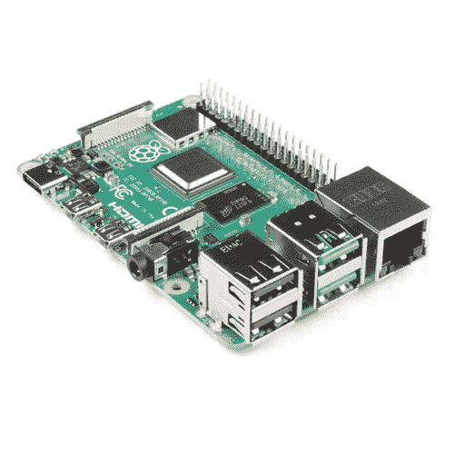](https://www.sparkfun.com/products/15446) 

### [【树莓派 4 型号 B (2 GB)](https://www.sparkfun.com/products/15446)

[Out of stock](https://learn.sparkfun.com/static/bubbles/ "out of stock") DEV-15446

2 GB Raspberry Pi 4 具有运行两个 4k 分辨率显示器的能力，以运行真正的千兆位以太网操作，所有…

4[Favorited Favorite](# "Add to favorites") 119[Wish List](# "Add to wish list")[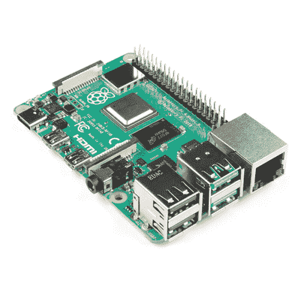](https://www.sparkfun.com/products/15447) 

### [树莓派 4 型号 B (4 GB)](https://www.sparkfun.com/products/15447)

[Out of stock](https://learn.sparkfun.com/static/bubbles/ "out of stock") DEV-15447

4 GB Raspberry Pi 4 具有运行两个 4k 分辨率显示器的能力，以运行真正的千兆以太网操作，所有…

17[Favorited Favorite](# "Add to favorites") 173[Wish List](# "Add to wish list")[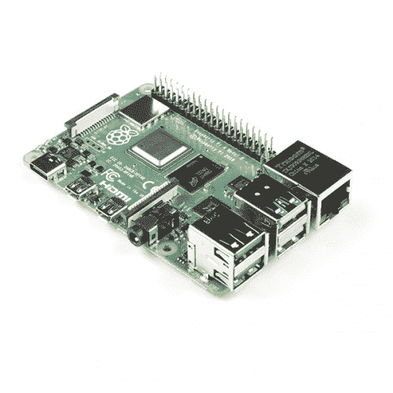](https://www.sparkfun.com/products/16811) 

### [【树莓派 4 型号 B (8 GB)](https://www.sparkfun.com/products/16811)

[Out of stock](https://learn.sparkfun.com/static/bubbles/ "out of stock") DEV-16811

8GB Raspberry Pi 4 具有运行两个 4k 分辨率显示器的能力，以运行真正的千兆以太网操作，所有…

6[Favorited Favorite](# "Add to favorites") 153[Wish List](# "Add to wish list")

[https://www.youtube.com/embed/7LsyoCIv2zQ/?autohide=1&border=0&wmode=opaque&enablejsapi=1](https://www.youtube.com/embed/7LsyoCIv2zQ/?autohide=1&border=0&wmode=opaque&enablejsapi=1)

根据您的项目，有几个可用的工具包。根据您订购的版本，您可以选择包含 2GB、4GB 或 8GB RAM 的版本。

| [](https://learn.sparkfun.com/tutorials/raspberry-pi-4-kit-hookup-guide#basic) | [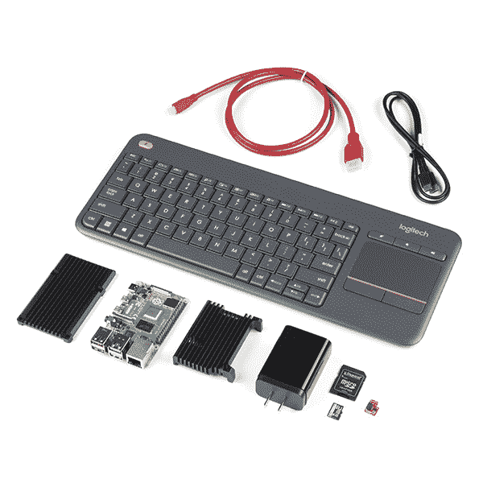](https://learn.sparkfun.com/tutorials/raspberry-pi-4-kit-hookup-guide#desktop) | [](https://learn.sparkfun.com/tutorials/raspberry-pi-4-kit-hookup-guide#hardware) |
| *[基本套件](https://learn.sparkfun.com/tutorials/raspberry-pi-4-kit-hookup-guide#basic)* | *[桌面套件](https://learn.sparkfun.com/tutorials/raspberry-pi-4-kit-hookup-guide#desktop)* | *[硬件入门套件](https://learn.sparkfun.com/tutorials/raspberry-pi-4-kit-hookup-guide#hardware)* |

### 所需材料

你需要一个鼠标、键盘、显示器、最低功率要求的墙上适配器和电缆。一旦完成配置，Pi 就可以从自己的外围设备或通过互联网连接的另一台计算机上进行操作。

## 套件版本

SparkFun 上有三个版本的工具包。每个版本都包括一个具有不同大小 RAM 的 Raspberry Pi 4。查看以下不同的套件版本！

*   [基础](#basic)
*   [桌面](#desktop)
*   [硬件入门套件](#hardware)

[https://www.youtube.com/embed/X3_nr-o0SHQ/?autohide=1&border=0&wmode=opaque&enablejsapi=1](https://www.youtube.com/embed/X3_nr-o0SHQ/?autohide=1&border=0&wmode=opaque&enablejsapi=1)

### [基础套件版本](#basic)

基本套件提供了启动和运行所需的基本内容。这是假设你手头有显示器、键盘、鼠标和读卡器^([【1】](#card_reader))。Pi 4 上的连接器是不同的，因此该套件至少提供了迷你 HDMI 到 HDMI 电缆和 USB-C 墙壁适配器。该套件包括一个原始的 microSD 卡和 SD 卡适配器，以便您可以刷新您最喜欢的 Linux 发行版。包括一个 Qwiic 垫片，可以轻松地将 I ² C 设备连接到树莓 Pi。套件中包括一个带有 2GB、4GB 或 8GB RAM 的 Raspberry Pi 4。如果你已经有一个，我们也有一个没有树莓 Pi 4 的套件。

[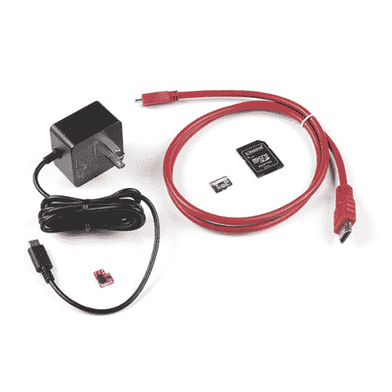](https://www.sparkfun.com/products/17237) 

将**添加到您的[购物车](https://www.sparkfun.com/cart)中！**

### [SparkFun 树莓派 4 基础套装——不带树莓派](https://www.sparkfun.com/products/17237)

[Only 4 left!](https://learn.sparkfun.com/static/bubbles/ "only 4 left!") KIT-17237

Raspberry Pi 4 基本套件包括启动和运行 Raspberry Pi 4 所需的一切，但没有 bo…

$48.50[Favorited Favorite](# "Add to favorites") 1[Wish List](# "Add to wish list")****[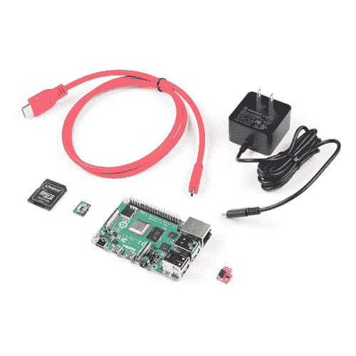](https://www.sparkfun.com/products/16383) 

将**添加到您的[购物车](https://www.sparkfun.com/cart)中！**

### [SparkFun 树莓 Pi 4 基础套装- 2GB](https://www.sparkfun.com/products/16383)

[Out of stock](https://learn.sparkfun.com/static/bubbles/ "out of stock") KIT-16383

Raspberry Pi 4 基本套件包括启动和运行 Raspberry Pi 4 2GB 所需的一切。

$84.951[Favorited Favorite](# "Add to favorites") 9[Wish List](# "Add to wish list")****[](https://www.sparkfun.com/products/16384) 

### [SparkFun 树莓 Pi 4 基础套装- 4GB](https://www.sparkfun.com/products/16384)

[Out of stock](https://learn.sparkfun.com/static/bubbles/ "out of stock") KIT-16384

Raspberry Pi 4 基本套件包括启动和运行 Raspberry Pi 4 4GB 所需的一切。

6[Favorited Favorite](# "Add to favorites") 21[Wish List](# "Add to wish list")[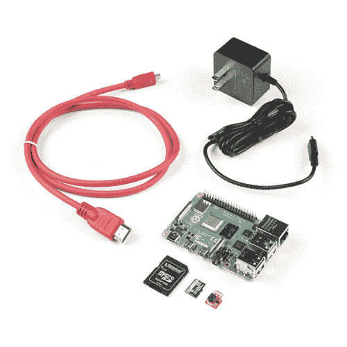](https://www.sparkfun.com/products/17980) 

### [SparkFun 树莓 Pi 4 基础套装- 8GB](https://www.sparkfun.com/products/17980)

[Out of stock](https://learn.sparkfun.com/static/bubbles/ "out of stock") KIT-17980

Raspberry Pi 4 基本套件包括您启动和运行新的 Raspberry Pi 4 8GB 所需的一切。

[Favorited Favorite](# "Add to favorites") 13[Wish List](# "Add to wish list")** **[https://www.youtube.com/embed/Slr27fd9mP0/?autohide=1&border=0&wmode=opaque&enablejsapi=1](https://www.youtube.com/embed/Slr27fd9mP0/?autohide=1&border=0&wmode=opaque&enablejsapi=1)

### [桌面套件版本](#desktop)

桌面工具包是最基本的。但是，包含一个带触摸板的无线键盘。我们还包括一个散热器外壳，在提升您的 Pi 处理能力时，让您的 Pi 保持冷静。此套件中包含的电源为模块化电源系统提供了 USB C 型墙壁适配器和 C 型到 C 型 USB 电缆。与基本套件相比，该套件中包含的原始 microSD 卡^([【1】](card_reader))具有更快的读/写速度，以利用 Pi 4 的处理能力。这大大减少了刷新或更新您选择的 Linux 发行版的时间。套件中包括一个带有 2GB、4GB 或 8GB RAM 的 Raspberry Pi 4。如果你已经有一个，我们也有一个没有树莓 Pi 4 的套件。

[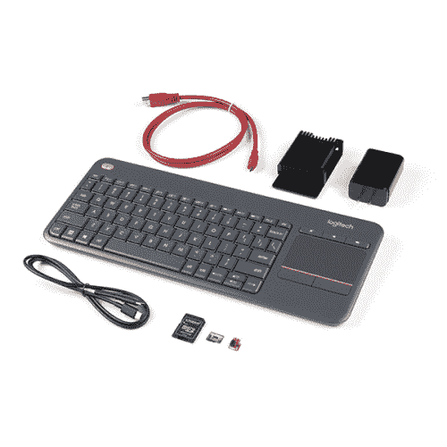](https://www.sparkfun.com/products/17727) 

将**添加到您的[购物车](https://www.sparkfun.com/cart)中！**

### [SparkFun 树莓 Pi 4 桌面套装——不带树莓 Pi](https://www.sparkfun.com/products/17727)

[17 available](https://learn.sparkfun.com/static/bubbles/ "17 available") KIT-17727

SparkFun Raspberry Pi 4 桌面套件(4GB)包括将任何带 HDMI 端口的显示器变成桌面所需的一切

$104.95[Favorited Favorite](# "Add to favorites") 0[Wish List](# "Add to wish list")****[](https://www.sparkfun.com/products/retired/16385) 

### [SparkFun 树莓 Pi 4 桌面套装- 2GB](https://www.sparkfun.com/products/retired/16385)

[Retired](https://learn.sparkfun.com/static/bubbles/ "Retired") KIT-16385

SparkFun Raspberry Pi 4 桌面套件(2GB)包括将任何带 HDMI 端口的显示器变成桌面所需的一切

**Retired**[Favorited Favorite](# "Add to favorites") 2[Wish List](# "Add to wish list")[](https://www.sparkfun.com/products/16386) 

### [SparkFun 树莓 Pi 4 桌面套装- 4GB](https://www.sparkfun.com/products/16386)

[Out of stock](https://learn.sparkfun.com/static/bubbles/ "out of stock") KIT-16386

SparkFun Raspberry Pi 4 桌面套件(4GB)包括将任何带 HDMI 端口的显示器变成桌面所需的一切

[Favorited Favorite](# "Add to favorites") 10[Wish List](# "Add to wish list")[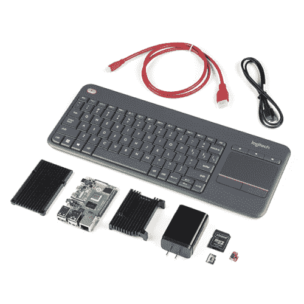](https://www.sparkfun.com/products/16812) 

### [SparkFun 树莓 Pi 4 桌面套装- 8GB](https://www.sparkfun.com/products/16812)

[Out of stock](https://learn.sparkfun.com/static/bubbles/ "out of stock") KIT-16812

Raspberry Pi 4 桌面套件(8GB)包括将任何带 HDMI 端口的显示器转变为桌面 PC 所需的一切。

[Favorited Favorite](# "Add to favorites") 7[Wish List](# "Add to wish list")

### [硬件入门套件版本](#hardware)

硬件套件是为那些对在试验板上制作电路原型感兴趣的人设计的。它包括基本套件和桌面套件中的组件。此外，硬件入门套件包括试验板、Pi 楔形适配器、IDC 电缆、led、限流电阻、按钮、跳线、2x20 扩展接头、3.3V USB 转串行转换器和 mini-B USB 电缆。套件中包括一个带有 4GB 或 8GB RAM 的 Raspberry Pi 4。如果你已经有一个，我们也有一个没有树莓 Pi 4 的套件。

[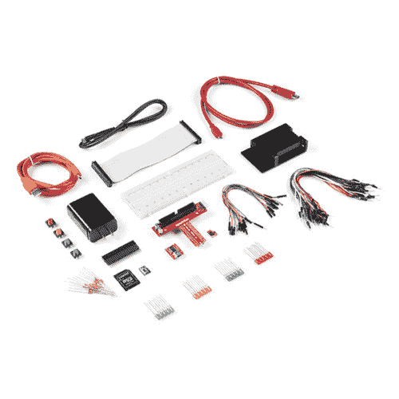](https://www.sparkfun.com/products/17726) 

将**添加到您的[购物车](https://www.sparkfun.com/cart)中！**

### [SparkFun 树莓 Pi 4 硬件入门套件——不带树莓 Pi](https://www.sparkfun.com/products/17726)

[Only 11 left!](https://learn.sparkfun.com/static/bubbles/ "only 11 left!") KIT-17726

SparkFun Raspberry Pi 4 硬件入门套件提供了一套可靠的部件和说明，用于在一个

$106.95[Favorited Favorite](# "Add to favorites") 3[Wish List](# "Add to wish list")****[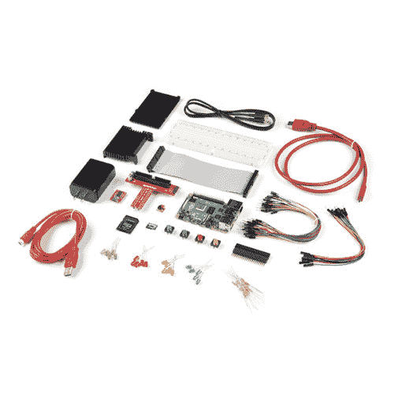](https://www.sparkfun.com/products/16388) 

### [SparkFun 树莓 Pi 4 硬件入门套件- 4GB](https://www.sparkfun.com/products/16388)

[Out of stock](https://learn.sparkfun.com/static/bubbles/ "out of stock") KIT-16388

SparkFun Raspberry Pi 4 硬件入门套件提供了一套可靠的部件和说明，用于在一个

[Favorited Favorite](# "Add to favorites") 8[Wish List](# "Add to wish list")[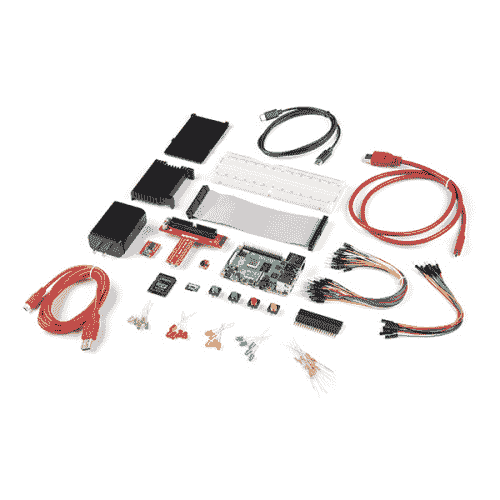](https://www.sparkfun.com/products/17380) 

### [SparkFun 树莓 Pi 4 硬件入门套件- 8GB](https://www.sparkfun.com/products/17380)

[Out of stock](https://learn.sparkfun.com/static/bubbles/ "out of stock") KIT-17380

8GB Raspberry Pi 4 硬件入门套件提供了一套可靠的部件和说明，可用于以更…

1[Favorited Favorite](# "Add to favorites") 7[Wish List](# "Add to wish list")**[[1]](#card_reader) Note:** If you do not have a built-in card reader, you might want to consider adding a microSD USB reader to your cart in order to flash an image to the raw microSD card!

[](https://www.sparkfun.com/products/13004) 

将**添加到您的[购物车](https://www.sparkfun.com/cart)中！**

### [microSD USB 读卡器](https://www.sparkfun.com/products/13004)

[In stock](https://learn.sparkfun.com/static/bubbles/ "in stock") COM-13004

这是一个很棒的微型 USB 读卡器。只需将您的 microSD 卡滑入 USB 连接器内部，然后将它插入 USB 连接器

$5.5011[Favorited Favorite](# "Add to favorites") 11[Wish List](# "Add to wish list")** **#### 对比图表

下表显示了基本套件、台式机套件和硬件套件之间的差异。

| 包含 | 基础 | 桌面 | 五金器具 |
|  | [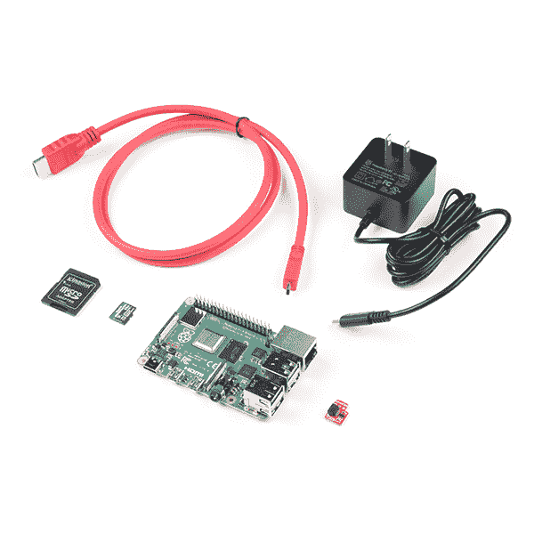](https://www.sparkfun.com/products/16384) | [](https://www.sparkfun.com/products/16386) | [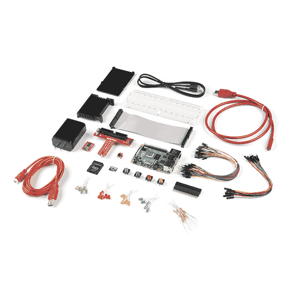](https://www.sparkfun.com/products/16388) |
| 树莓 Pi 4 版本 | [2gb](https://www.sparkfun.com/products/16383)/[4gb](https://www.sparkfun.com/products/16384)/[8gb](https://www.sparkfun.com/products/17980)/
[不带 Pi 4](https://www.sparkfun.com/products/17237) | [2gb](https://www.sparkfun.com/products/16385)/[4gb](https://www.sparkfun.com/products/16386)/[8gb](https://www.sparkfun.com/products/16812)/
[不带 Pi 4](https://www.sparkfun.com/products/17727) | [4gb](https://www.sparkfun.com/products/16388)/[8gb](https://www.sparkfun.com/products/17380)/
不带 Pi 4 |
| [带 C 型电缆的墙壁适配器](https://www.sparkfun.com/products/15448) | (适用于 2GB、4GB 和 8GB，不含 Pi 4 版本) |  |  |
| [USB C 型墙壁适配器](https://www.sparkfun.com/products/16272) | *(最初发布于旧的 8GB 版本)* | -好的 | -好的 |
| [USB C 型电缆](https://www.sparkfun.com/products/16395) | *(最初发布于旧的 8GB 版本)* | -好的 | -好的 |
| [HDMI Micro 转 HDMI](https://www.sparkfun.com/products/15796) | -好的 | -好的 | -好的 |
| [带适配器的 MicroSD 卡](https://www.sparkfun.com/products/16498)  | *(2GB 版本的初始发布)* |  |  |
| [带适配器的高速 MicroSD 卡](https://www.sparkfun.com/products/16498)  | -好的 | -好的 | -好的 |
| [罗技 N400 Plus 无线键盘&触控板](https://www.sparkfun.com/products/16300) |  | -好的 |  |
| [Qwiic 垫片](https://www.sparkfun.com/products/15794) | -好的 | -好的 | -好的 |
| [散热器外壳](https://www.sparkfun.com/categories/tags/aluminum-heatsink-case) |  | -好的 | -好的 |
| [2x20 扩展接头](https://www.sparkfun.com/products/16763) |  |  | -好的 |
| [Raspberry Pi 楔形带 IDC 电缆](https://www.sparkfun.com/products/13717) |  |  | -好的 |
| [试验板](https://www.sparkfun.com/products/12615) |  |  | -好的 |
| [M/F 高级跳线 6"
(10 根装)](https://www.sparkfun.com/products/9140) |  |  | -好的 |
| [M/M 标准跳线 7"
(30 根装)](https://www.sparkfun.com/products/11026) |  |  | -好的 |
| [各色发光二极管
(20 个装)](https://www.sparkfun.com/products/12062) |  |  | -好的 |
| [330 &欧姆；1/4 瓦限流电阻
(20 个装)](https://www.sparkfun.com/products/14490) |  |  | -好的 |
| [五彩纽扣
(4 个装)](https://www.sparkfun.com/products/14460) |  |  | -好的 |
| [3.3V FTDI 基本分线点](https://www.sparkfun.com/products/9873) |  |  | -好的 |
| [Mini-B USB 线缆](https://www.sparkfun.com/products/11301) |  |  | -好的 |

## 获得操作系统

**Note:** You will need a microSD card with **minimum size of at least 8GB**! Not all microSD cards are the same. This is obvious in the memory size but the performance can also vary between microSD cards. The microSD card included in the basic kit (as shown on the left) is sufficient enough to run an image on the Pi 4\. The microSD card included in the desktop kit (as shown on the right) has a faster read/write speed which enables you to flash, update, or boot an image in a shorter amount of time. Programs can also load faster as well.

| [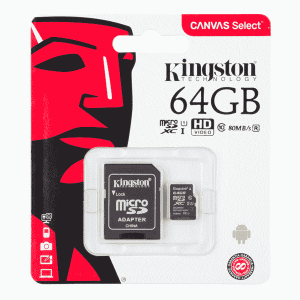](https://www.sparkfun.com/products/14833) | [](https://www.sparkfun.com/products/16498) |

If you are looking to test the performance of your microSD card, there is a tool that you can download to test how well the microSD card performs. Don't be alarmed by the pass/fail. A slower performing microSD card is still be sufficient to run on the Pi 4\. It just means that the Pi 4 may not be running at the optimum speed. The microSD card will . Click on the [link below for more information](https://www.raspberrypi.org/blog/sd-card-speed-test/)!

[Raspberry Pi SD Card Speed Test](https://www.raspberrypi.org/blog/sd-card-speed-test/)

每个套件中包含的 microSD 卡没有图像闪烁。如果您刚开始使用，或者您现有的映像在某个地方损坏了，您需要向 microSD 卡刷新一个新映像。根据您的应用程序，有一些基于 Linux 的映像可用。或者你也可以关掉你的 Pi，换上 microSD 卡，尝试不同的图像。对于初学者，我们建议获得 NOOBS。否则，像素桌面的 Raspbian 将是最好的。

*   [NOOBS(即新的开箱即用软件)](#noobs)——包含 Raspbian 和 LibreELEC。其他图像也可以从互联网上下载并安装。
*   [Raspbian](#raspbian) -官方基于 Raspberry Pi Debian 的电脑操作系统。有三个下载。我们推荐带有推荐软件的桌面版本。其他下载是相同的，但软件较少。对于高级用户，Raspbian Lite 是最小的纯文本版本，需要用户使用命令行界面(CLI)进行导航。
*   [其他第三方操作系统映像](https://www.raspberrypi.org/downloads/) -第三方还提供其他版本。如果你喜欢冒险，看看其他图片吧！

对于本教程的范围，我们将总结 Pi 基金会的两个图像。

### [闪烁的图像 NOOBS](#noobs)

如果您决定使用 NOOBS，您需要:

*   **将 microSD 卡插入读卡器。**
*   **下载**NOOBS 的 ZIP 文件。

    [从 Pi 基金会这里下载 NOOBs！](https://www.raspberrypi.org/downloads/noobs/)

*   **解压**ZIP 文件。
*   **如果需要，格式化**您的 Raspberry Pi 的 microSD 卡。
*   **将**解压文件夹中的所有内容复制到 microSD 卡中。
*   从电脑中弹出 microSD 卡。

### [闪烁图像 Raspbian 和第三方 OS 图像](#raspbian)

**Note:!** There are several tools available to flash your image distribution to a microSD card. For the scope of this tutorial, we'll assume that you are using the [Raspberry Pi Imager for your OS](https://www.raspberrypi.org/downloads/). Make sure to install the software before continuing further.

然后按照下面的步骤使用 Raspberry Pi 成像仪拍摄图像。

*   **将 microSD 卡和读卡器插入电脑端口。**
*   打开您选择的**软件映像工具**^([【2】](#alt_software_imagers))(在这种情况下，我们将为您的操作系统使用[树莓派映像器](https://www.raspberrypi.org/downloads/)，但您也可以使用其他映像)。

    [在这里下载最新的 Raspbian！](https://www.raspberrypi.org/downloads/raspbian/) [在此下载第三方操作系统！](https://www.raspberrypi.org/downloads/)

*   按**选择 OS** 从列表中选择操作系统(在这种情况下，我们将使用 Raspbian 映像，但您也可以使用任何第三方映像)。
*   按**选择 SD 卡**选择挂载的 microSD 卡。
*   按下**写入**(这需要一段时间，取决于图像和 microSD 卡，所以只需在等待时跳一会儿舞)。
*   **完成后弹出**microSD 卡。

[[2]](#alt_software_imagers) **Note:** Check out this [extensive guide to flashing images to a microSD card](https://learn.sparkfun.com/tutorials/sd-cards-and-writing-images). You could use Etcher.io, Win32DiskImager, or a command line tool depending on your personal preference.

[](https://learn.sparkfun.com/tutorials/sd-cards-and-writing-images) [### SD 卡和书写图像

#### 2015 年 6 月 4 日](https://learn.sparkfun.com/tutorials/sd-cards-and-writing-images) How to upload images to an SD card for Raspberry Pi, PCDuino, or your favorite SBC.[Favorited Favorite](# "Add to favorites") 19

## 硬件装配

Pi 简单明了，很容易组合在一起，但是如果有些事情看起来不太对劲，这一节将让您了解让 Pi 运行起来应该是什么样子。

| [](https://learn.sparkfun.com/tutorials/raspberry-pi-4-kit-hookup-guide#basic) | [](https://learn.sparkfun.com/tutorials/raspberry-pi-4-kit-hookup-guide#desktop) | [](https://learn.sparkfun.com/tutorials/raspberry-pi-4-kit-hookup-guide#hardware) |
| *[基本套件](https://learn.sparkfun.com/tutorials/raspberry-pi-4-kit-hookup-guide#basic)* | *[桌面套件](https://learn.sparkfun.com/tutorials/raspberry-pi-4-kit-hookup-guide#desktop)* | *[硬件入门套件](https://learn.sparkfun.com/tutorials/raspberry-pi-4-kit-hookup-guide#hardware)* |

*Unbox and gather these components before beginning the assembly*

### 安装散热器外壳可选

**Note:** Under normal conditions, the Pi 4 can be run without the need for a heat sink enclosure. However, adding a heat sink will help prevent the Raspberry Pi 4 from throttling when you are pushing the Pi to its limits, such as running multiple displays at once. The following instructions are for those that are using the Raspberry Pi 4 with a heat sink enclosure. The basic kit does not include the heat sink enclosure. Make sure to add it to your cart with your favorite color!

[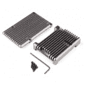](https://www.sparkfun.com/products/retired/15775) 

### [树莓派 4 号铝制散热器外壳——磁铁矿灰](https://www.sparkfun.com/products/retired/15775)

[Retired](https://learn.sparkfun.com/static/bubbles/ "Retired") PRT-15775

这款为 Raspberry Pi 4 打造的青铜色阳极氧化铝外壳在 CPU 满载的情况下，可为您提供 10-15 摄氏度的被动冷却效果…

3 **Retired**[Favorited Favorite](# "Add to favorites") 12[Wish List](# "Add to wish list")[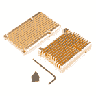](https://www.sparkfun.com/products/15774) 

将**添加到您的[购物车](https://www.sparkfun.com/cart)中！**

### [铝制散热器外壳树莓派 4 - Heliodor 金色](https://www.sparkfun.com/products/15774)

[Only 6 left!](https://learn.sparkfun.com/static/bubbles/ "only 6 left!") PRT-15774

这款用于 Raspberry Pi 4 的金色阳极氧化铝外壳将在 CPU 满载的情况下为您提供 10-15°C 的被动冷却。

$17.95 $9.252[Favorited Favorite](# "Add to favorites") 8[Wish List](# "Add to wish list")****[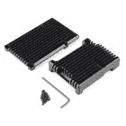](https://www.sparkfun.com/products/15773) 

将**添加到您的[购物车](https://www.sparkfun.com/cart)中！**

### [铝制散热器外壳树莓皮 4 -曜黑色](https://www.sparkfun.com/products/15773)

[In stock](https://learn.sparkfun.com/static/bubbles/ "in stock") PRT-15773

树莓 Pi 4 的这款黑色阳极氧化铝外壳在 CPU 满载的情况下可以为您提供 10-15 摄氏度的被动冷却。

$19.505[Favorited Favorite](# "Add to favorites") 15[Wish List](# "Add to wish list")****[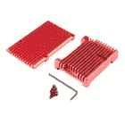](https://www.sparkfun.com/products/retired/15893) 

### [铝制散热器外壳树莓派 4 -玫瑰红](https://www.sparkfun.com/products/retired/15893)

[Retired](https://learn.sparkfun.com/static/bubbles/ "Retired") PRT-15893

这款红色阳极氧化铝覆盆子 Pi 4 外壳在 CPU 满载的情况下，可为您提供 10-15°C 的被动冷却。

3 **Retired**[Favorited Favorite](# "Add to favorites") 5[Wish List](# "Add to wish list")**** ****[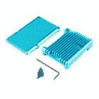](https://www.sparkfun.com/products/retired/15896) 

### [铝制散热器外壳树莓皮 4 -锆蓝色](https://www.sparkfun.com/products/retired/15896)

[Retired](https://learn.sparkfun.com/static/bubbles/ "Retired") PRT-15896

这款用于 Raspberry Pi 4 的蓝色阳极氧化铝外壳将在 CPU 满载的情况下为您提供 10-15°C 的被动冷却。

2 **Retired**[Favorited Favorite](# "Add to favorites") 6[Wish List](# "Add to wish list")[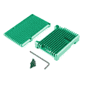](https://www.sparkfun.com/products/15895) 

将**添加到您的[购物车](https://www.sparkfun.com/cart)中！**

### [铝制散热器外壳树莓皮 4 -翠绿色](https://www.sparkfun.com/products/15895)

[Only 1 left!](https://learn.sparkfun.com/static/bubbles/ "only 1 left!") PRT-15895

这款用于 Raspberry Pi 4 的绿色阳极氧化铝外壳将在 CPU 满载的情况下为您提供 10-15°C 的被动冷却。

$17.95 $9.251[Favorited Favorite](# "Add to favorites") 6[Wish List](# "Add to wish list")****[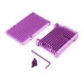](https://www.sparkfun.com/products/15894) 

将**添加到您的[购物车](https://www.sparkfun.com/cart)中！**

### [树莓派 4 号铝制散热器外壳——坦桑石紫](https://www.sparkfun.com/products/15894)

[Only 6 left!](https://learn.sparkfun.com/static/bubbles/ "only 6 left!") PRT-15894

这款用于 Raspberry Pi 4 的紫色阳极氧化铝外壳将在 CPU 满载的情况下为您提供 10-15°C 的被动冷却。

$17.95 $9.252[Favorited Favorite](# "Add to favorites") 2[Wish List](# "Add to wish list")**** ****如果您使用的是散热器外壳，请使用与 Pi CPU 尺寸相匹配的散热垫。从保暖垫的两侧取下薄而透明的塑料薄膜和纸。将有纸的一面贴在 Pi 的 CPU 上。还有为其他 IC 设计的散热垫，也可以添加到这些芯片上。然而，这些不会变热。

[](https://cdn.sparkfun.com/assets/learn_tutorials/1/1/3/1/Raspberry_Pi_4_Thermal_Tape.jpg)

用 GPIO 引脚的切口抓住散热器外壳的顶部，并将其放在 Pi 上。如果您使用 DSI 端口或 Raspberry Pi 相机，现在是在 Pi 和散热器顶部之间插入带状电缆的好时机。

[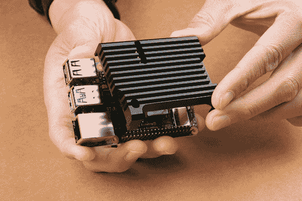](https://cdn.sparkfun.com/assets/learn_tutorials/1/1/3/1/Raspberry_Pi_4_Heat_Sink_Top.jpg)

对齐散热器外壳底部的安装孔。

[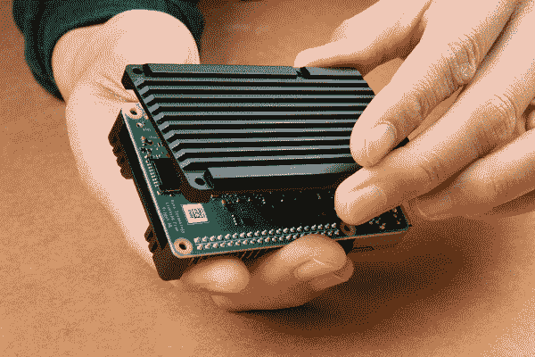](https://cdn.sparkfun.com/assets/learn_tutorials/1/1/3/1/Raspberry_Pi_4_Heat_Sink_Bottom.jpg)

用内六角扳手拧紧六角螺栓。

[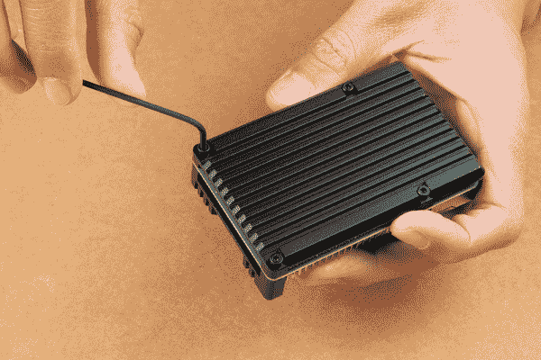](https://cdn.sparkfun.com/assets/learn_tutorials/1/1/3/1/Raspberry_Pi_4_Heat_Sink_Hex_Bolts.jpg)

旋转圆周率。您的散热器外壳应该如下图所示！

[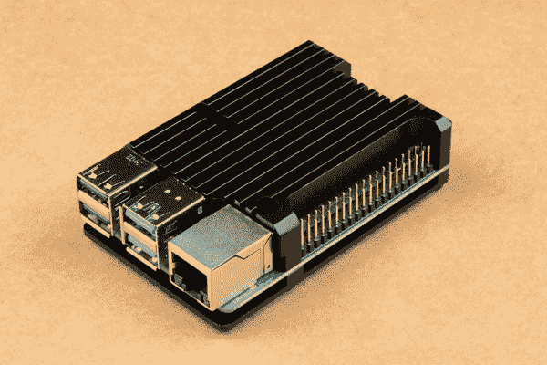](https://cdn.sparkfun.com/assets/learn_tutorials/1/1/3/1/Raspberry_Pi_4_Heat_Sink.jpg)

### 插入 microSD 卡

当 microSD 卡上的图像闪烁时，将其插入 microSD 插座。

| [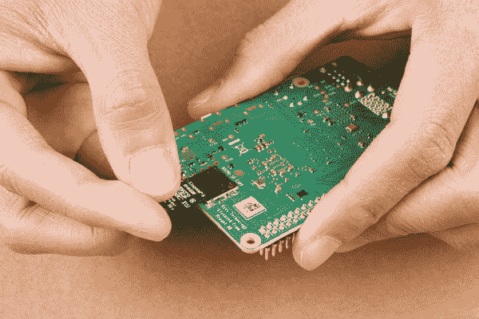](https://cdn.sparkfun.com/assets/learn_tutorials/1/1/3/1/Raspberry_Pi_4_Insert_MicroSD.jpg) | [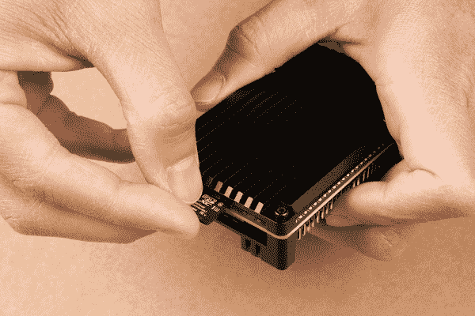](https://cdn.sparkfun.com/assets/learn_tutorials/1/1/3/1/Raspberry_Pi_4_Insert_MicroSD_Card.jpg) |

### 连接外围设备

连接所需的消费者计算机设备。至少要启动并运行或浏览 Pi，我们建议使用显示器、键盘和鼠标。下图将使用不带外壳的 Pi 来显示连接外围设备的位置。

#### 班长

使用带有 HDMI 端口^([【3】](#monitor_adapter))的显示器，将线缆的 HDMI 端插入连接器。然后将线缆的迷你 HDMI 端连接到连接器。请注意，Pi 4 有两个迷你 HDMI 输出。你需要连接到 **HDMI0** 端口。最靠近 USB-C 连接器。

[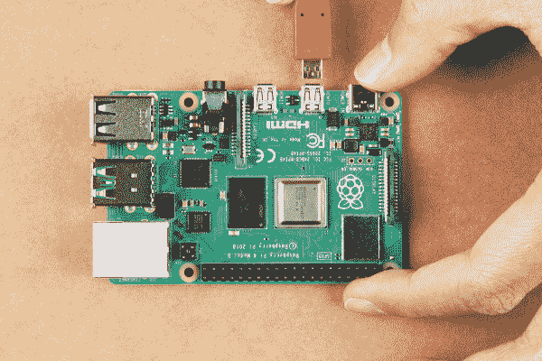](https://cdn.sparkfun.com/assets/learn_tutorials/1/1/3/1/Raspberry_Pi_4_mini-HDMI.jpg)[[3]](#monitor_adapter) **Note:** Depending on how old your monitor is, you may need an additional adapter to convert the HDMI to the input port. Some of these may be a VGA or DVI connector.

| [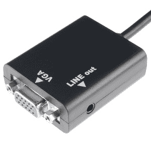](https://cdn.sparkfun.com/assets/learn_tutorials/1/1/3/1/12613-02c_VGA.jpg) | [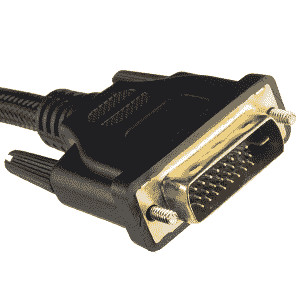](https://cdn.sparkfun.com/assets/learn_tutorials/1/1/3/1/12612-03_DVI.jpg) |
| *VGA 适配器* | *DVI 适配器* |

Alternatively, you can attach a compatible LCD display via the DSI port or take advantage of the headless setups. Keep in mind that you may need to configure additional settings in order to get the Pi to output to the display.

[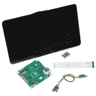](https://www.sparkfun.com/products/13733) 

将**添加到您的[购物车](https://www.sparkfun.com/cart)中！**

### [【树莓派 LCD - 7】触摸屏](https://www.sparkfun.com/products/13733)

[In stock](https://learn.sparkfun.com/static/bubbles/ "in stock") LCD-13733

这款 7 英寸的 Raspberry Pi 触摸屏液晶显示器让您能够创建一个独立的设备，可以用作一个触摸屏

$60.0051[Favorited Favorite](# "Add to favorites") 150[Wish List](# "Add to wish list")** **#### 键盘和鼠标

将键盘和鼠标连接到 USB 端口。在这种情况下，我们使用的是带有 USB 加密狗的无线键盘和鼠标。虽然您可以将 HID 设备插入任何 USB 端口，但我们建议将其连接到 USB 2.0 端口，以便您可以将速度更快的 USB 3.0 端口(带蓝色)用于某些设备(即闪存驱动器)。

[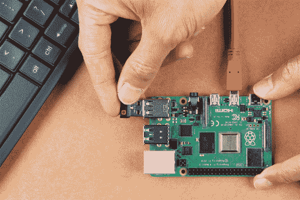](https://cdn.sparkfun.com/assets/learn_tutorials/1/1/3/1/Raspberry_Pi_4_Wireless_Keyboard_Mouse_Combo.jpg)

如果您使用的是无线键盘/鼠标组合，附带的无线 USB 加密狗可能藏在电池盒中。如果您使用的是 Logitech K400 Plus，请将其翻转过来，并滑出电池盒。

[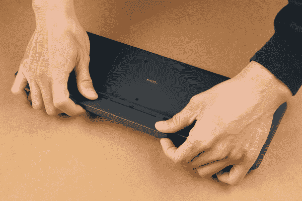](https://cdn.sparkfun.com/assets/learn_tutorials/1/1/3/1/Logitech_Keyboard_Mouse_K400_Hidden_Dongle.jpg)

翻开盖子，您会发现加密狗贴在背面，并不显眼。从后面抓住无线转换器，将其插入 Pi 的 USB 端口，然后将盖子滑回到 Logitech K400 Plus 上。

[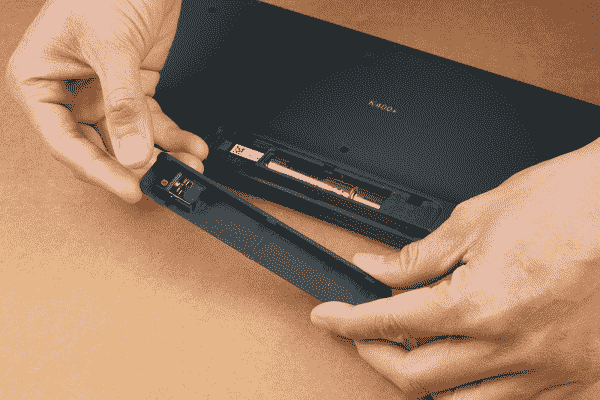](https://cdn.sparkfun.com/assets/learn_tutorials/1/1/3/1/Logitech_Keyboard_Mouse_K400_Dongle.jpg)

要给键盘通电，请确保将 Logitech K400 Plus 侧面的电源开关拨到绿色位置。随意将电源开关翻转回红色位置以切断电源。

[](https://cdn.sparkfun.com/assets/learn_tutorials/1/1/3/1/Logitech_Keyboard_Mouse_K400_Power_Switch_On_1.jpg)

#### 电源

如果尚未插入，请确保已将 microSD 卡插入 microSD 插座。一旦一切都连接好，插入电源^([【4】](#min_power))！

[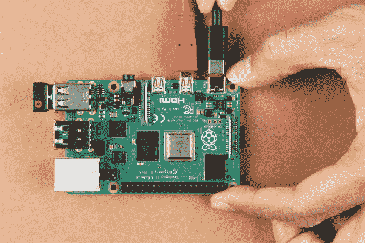](https://cdn.sparkfun.com/assets/learn_tutorials/1/1/3/1/Raspberry_Pi_4_Power.jpg)[[4]](#min-power) ⚡ **Note:** The minimum power requirements to power the Raspberry Pi 4 Model B is **5VDC, 3A**. Not all power supplies are made the same so there may be voltage drops depending on specifications and cable. Make sure that your wall adapter or battery is stable and able to meet the minimum requirements. Depending on your country region, you may need a converter to connect to a wall outlet. The following products are compatible. If you decide to get the wall adapter, make sure to get the appropriate cable as well.

[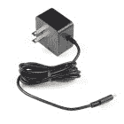](https://www.sparkfun.com/products/15448) 

将**添加到您的[购物车](https://www.sparkfun.com/cart)中！**

### [【树莓 Pi 墙壁适配器电源- 5.1VDC，3.0A，15.3W (USB-C)](https://www.sparkfun.com/products/15448)

[In stock](https://learn.sparkfun.com/static/bubbles/ "in stock") TOL-15448

是 Raspberry Pi 型号 4 B 的官方 USB Type-C 电源。

$8.006[Favorited Favorite](# "Add to favorites") 29[Wish List](# "Add to wish list")****[](https://www.sparkfun.com/products/16272) 

将**添加到您的[购物车](https://www.sparkfun.com/cart)中！**

### [USB-C 壁式适配器- 5.1V，3A(黑色)](https://www.sparkfun.com/products/16272)

[In stock](https://learn.sparkfun.com/static/bubbles/ "in stock") TOL-16272

这是一个 USB Type-C 电源，与 Raspberry Pi 4 兼容。

$5.501[Favorited Favorite](# "Add to favorites") 5[Wish List](# "Add to wish list")****[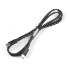](https://www.sparkfun.com/products/retired/16395) 

### [USB 2.0 C 转 C 线- 1m](https://www.sparkfun.com/products/retired/16395)

[Retired](https://learn.sparkfun.com/static/bubbles/ "Retired") CAB-16395

这是一条 1 米长的 USB 2.0 型到 C 型电缆，额定电流为 100 瓦。

**Retired**[Favorited Favorite](# "Add to favorites") 2[Wish List](# "Add to wish list")**** ****### 完成设置

此时，您的设置应该类似于下图，以启动并运行 Pi。根据您的设置，您还可以添加以太网、第二台显示器、耳机、扬声器或摄像头！

| [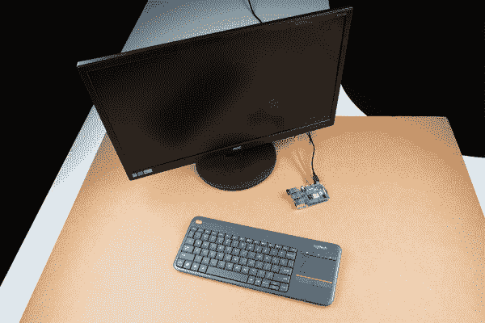](https://cdn.sparkfun.com/assets/learn_tutorials/1/1/3/1/Raspberry_Pi_4_Minimum_Setup_Monitor_Keyboard_Mouse.jpg) | [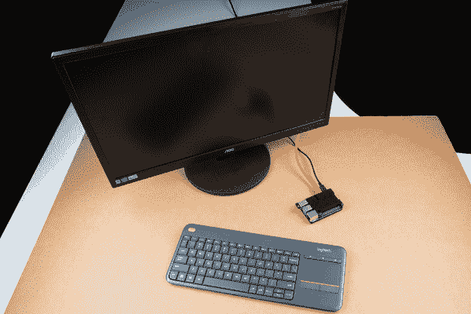](https://cdn.sparkfun.com/assets/learn_tutorials/1/1/3/1/Raspberry_Pi_4_Heat_Sink_Enclosure_Minimum_Setup_Monitor_Keyboard_Mouse.jpg) |

### 连接硬件

需要方便地接触板上的 GPIO 引脚？如果您订购了 Qwiic 电缆、Qwiic 使能设备和任何套件，请查看 Qwiic 垫片^([【5】](https://learn.sparkfun.com/tutorials/raspberry-pi-4-kit-hookup-guide#enclosure_limitations))以快速访问 I ² C 引脚。如果您想在 Python 中使用某些 I ² C 设备，我们建议您先看看用于 Raspberry Pi 的 Qwiic SHIM Kit 或 Qwiic Starter Kit。

[](https://learn.sparkfun.com/tutorials/qwiic-shim-for-raspberry-pi-hookup-guide) [### 用于 Raspberry Pi 连接指南的 Qwiic 垫片

#### 2019 年 12 月 5 日](https://learn.sparkfun.com/tutorials/qwiic-shim-for-raspberry-pi-hookup-guide) Ever wanted to prototype I2C components on a Pi? Now you can 2[](https://learn.sparkfun.com/tutorials/qwiic-shim-kit-for-raspberry-pi-hookup-guide) [### 用于 Raspberry Pi 连接指南的 Qwiic 垫片套件

#### 2021 年 2 月 16 日](https://learn.sparkfun.com/tutorials/qwiic-shim-kit-for-raspberry-pi-hookup-guide) Get started with the Serial LCD with RGB backlight and 9DoF IMU (ICM-20948) via I2C using the Qwiic system and Python on a Raspberry Pi! Take sensor readings and display them in the serial terminal or SerLCD.[Favorited Favorite](# "Add to favorites") 0

如果您的订单或硬件入门套件中包含带原型制作部件的 Pi 楔，请查看 Pi 楔^([【5】](https://learn.sparkfun.com/tutorials/raspberry-pi-4-kit-hookup-guide#enclosure_limitations))的相关教程，以便轻松访问试验板上的 GPIO 引脚。我们建议看一下 Raspberry gPIo 教程，开始使用 led 和按钮。如果您决定去无头，您可以使用 3.3V 的 FTDI 来配置或控制您的 Pi 通过串行。

[](https://learn.sparkfun.com/tutorials/preassembled-40-pin-pi-wedge-hookup-guide) [### 预先组装的 40 引脚 Pi 楔形连接指南

#### 2015 . 10 . 29](https://learn.sparkfun.com/tutorials/preassembled-40-pin-pi-wedge-hookup-guide) Using the Preassembled Pi Wedge to prototype with the Raspberry Pi B+.[Favorited Favorite](# "Add to favorites") 7[](https://learn.sparkfun.com/tutorials/raspberry-gpio) [### 树莓 gPIo

#### 2015 . 10 . 29](https://learn.sparkfun.com/tutorials/raspberry-gpio) How to use either Python or C++ to drive the I/O lines on a Raspberry Pi.[Favorited Favorite](# "Add to favorites") 17[](https://learn.sparkfun.com/tutorials/headless-raspberry-pi-setup) [### 无头 Raspberry Pi 设置

#### 2018 年 4 月 23 日](https://learn.sparkfun.com/tutorials/headless-raspberry-pi-setup) Configure a Raspberry Pi without a keyboard, mouse, or monitor.[Favorited Favorite](# "Add to favorites") 16[[5]](#enclosure_limitations) **Note:** When using an enclosure with a Raspberry Pi, you may need an extension header to access the GPIO pins.

[](https://www.sparkfun.com/products/16764) 

将**添加到您的[购物车](https://www.sparkfun.com/cart)中！**

### [扩展 GPIO 母头- 2x20 引脚(13.5 毫米/9.80 毫米)](https://www.sparkfun.com/products/16764)

[In stock](https://learn.sparkfun.com/static/bubbles/ "in stock") PRT-16764

这种 2x20 引脚母接头旨在允许您扩展任何具有标准 2x20 GPIO 引脚尺寸的电路板。

$2.25[Favorited Favorite](# "Add to favorites") 7[Wish List](# "Add to wish list")****[](https://www.sparkfun.com/products/16763) 

将**添加到您的[购物车](https://www.sparkfun.com/cart)中！**

### [](https://www.sparkfun.com/products/16763)扩展 GPIO 母接头- 2x20 引脚(16mm/7.30mm)

[In stock](https://learn.sparkfun.com/static/bubbles/ "in stock") PRT-16763

这种 2x20 引脚母接头旨在允许您扩展任何具有标准 2x20 GPIO 引脚尺寸的电路板。

$2.25[Favorited Favorite](# "Add to favorites") 8[Wish List](# "Add to wish list")********The Qwiic SHIM is not intended to be used with the heatsink case, as it prevents the case from properly connecting with the single board computer. The top of the case needs to be off should you use the SHIM or decide to use an [extension header [ PRT-16764 ]](https://www.sparkfun.com/products/16764) in conjunction with a Pi HAT. You can also use an [extension header [ PRT-16763 ]](https://www.sparkfun.com/products/16763) with the Pi Wedge's IDC cable. Note the differences in the pin length. The header with 7.30mm pin length uses three plastic spacers, which cover the pins more when using a HAT or the Pi Wedge's IDC cable.

| [](https://cdn.sparkfun.com/assets/learn_tutorials/1/1/3/1/Raspberry_Pi_2x20_Header_Stackable_Header_PCB_Sandwiched.jpg) | [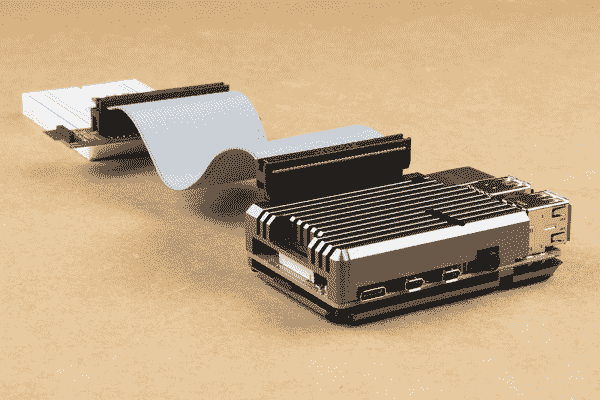](https://cdn.sparkfun.com/assets/learn_tutorials/1/1/3/1/Raspberry_Pi_2x20_Header_Stackable_Header_Pi_Wedge_Enclosure.jpg) |
| *具有 9.80 毫米销长的延伸接头用于帮助将 Qwiic 垫片和 Pi 伺服帽堆叠在带散热器的 Pi 4 上* | *引脚长度为 7.30 毫米的扩展接头用于将 Pi 楔的 IDC 电缆连接到带散热器的 Pi 4* |

The height of the enclosure and PCB varies depending on the design. The image below shows a Pi 3 in the enclosure. The overall height of the enclosure is lower than the Pi 4's heat sink enclosure so one 2x20 extension header was needed when stacking the Qwiic pHAT v2.0 on the Pi. You may need to stack additional extension headers so that the boards have enough clearance when using other enclosures and HATs.

[](https://cdn.sparkfun.com/assets/learn_tutorials/1/1/3/1/Raspberry_Pi_2x20_Header_Stackable_Header_Varying_Enclosure_Height.jpg)**** ****## 使用 Pi 的方法

一旦配置了 Pi，就有几种使用它的方法，这取决于您是想像桌面一样使用它还是远程管理它。

本节介绍如何以下列方式使用 Pi

*   **[使用 HDMI-out 带显示器](#hdmi)**——像操作台式电脑一样操作你的 Pi。
*   **[【无头无班长】](#headless)**
    *   **使用串行终端** -一些功能。
    *   **使用 SSH** -通过连接到另一台计算机的网络进行操作。
    *   **使用 VNC** -使用电脑通过互联网远程控制 Pi 的图形桌面。如果您决定远程连接到一个可能连接也可能不连接到显示器的 Pi，这将非常有用。

### [使用 HDMI-out 带显示器](#hdmi)

如果这是你第一次启动 NOOBS，你需要将你的 Raspberry Pi 连接到显示器上，然后按照安装程序进行操作。在窗口中，选择 **Raspbian Full【推荐】**，点击**按钮安装**。当软件将操作系统安装到 microSD 卡上时，你需要耐心等待。一旦完成，点击**确定**。这将重启 Pi。

#### 像素桌面(GUI)

通过用 Raspbian 选择 NOOBS，它会自动登录并启动一个图形用户界面。一旦桌面安装，按照向导来配置您的树莓派！您需要根据您所在的地区、显示器、键盘、互联网设置和密码来配置设置。最好让 Pi 检查更新并重启以使更改生效。

[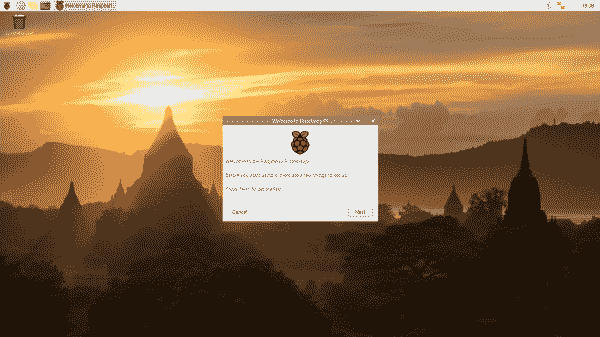](https://cdn.sparkfun.com/assets/learn_tutorials/1/1/3/1/Raspberry_Pi_PIXEL_Desktop_Init_Setup_1.png)

如果您需要更新设置，只需进入**树莓开始菜单** > **偏好设置** > **树莓配置**。

[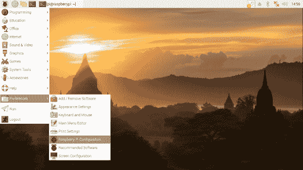](https://cdn.sparkfun.com/assets/learn_tutorials/1/1/3/1/Raspberry_Pi_Configuration_Desktop.png)

将弹出一个窗口，允许您轻松地更新区域、监视器、键盘、密码和打开任何外围设备。

[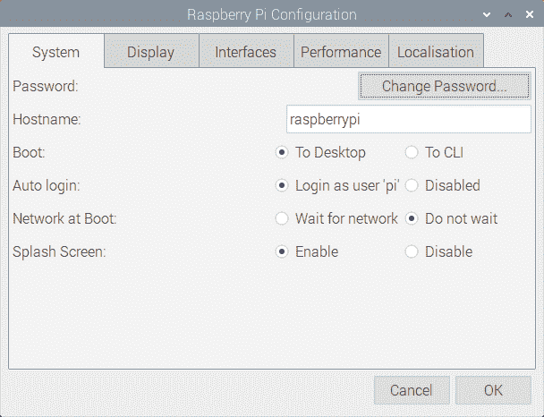](https://cdn.sparkfun.com/assets/learn_tutorials/1/1/3/1/Preferences_Raspberry_Pi.png)**Warning:** We recommend changing your password from the default to secure your Raspberry Pi. Make sure to write down the password somewhere safe before saving! You can also change the username as well.

至于互联网设置，只需点击菜单栏中的“无线和有线网络图标”。这应该是在屏幕右上角的时钟旁边。然后选择网络并输入各自的密码。

[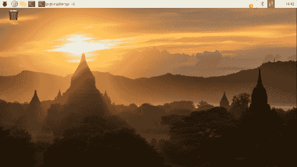](https://cdn.sparkfun.com/assets/learn_tutorials/1/1/3/1/Wireless_Wired_Network_Icon_Raspberry_Pi.png)

#### 命令行界面(CLI)

如果配置为引导至 shell，请使用以下凭据登录:

**用户名**:`pi`
密码 : `raspberry`

然后，如果您决定利用桌面型菜单驱动的操作系统，请在命令行中输入以进入图形环境。

```
language:bash
startx 
```

如果你需要回到文本世界，你可以

*   通过任务栏菜单注销
    *   回落到外壳，关闭 X 窗口系统
*   从任务栏打开 xterm
    *   在图形窗口中打开一个壳
*   使用`CTRL` + `ALT` + `1`到`CTRL` + `ALT` + `8`
    *   给你一些 shells，7 是图形环境(如果加载的话)。

请记住，使用任务栏菜单关机或从 shell 中输入以下命令，并等待系统停止后再关闭电源^([【6】](#shutdown))。

```
language:bash
sudo shutdown -h now 
```

[[6] ⚡**Warning:**](#shutdown) Removing power before properly shutting down will corrupt your Raspberry Pi's image. Make sure that you properly shut down before removing power from the Pi. Alternatively, you could write a [Python script to turn off the Pi using a GPIO](https://learn.sparkfun.com/tutorials/raspberry-pi-safe-reboot-and-shutdown-button).

[](https://learn.sparkfun.com/tutorials/raspberry-pi-safe-reboot-and-shutdown-button) [### Raspberry Pi 安全重启和关机按钮

#### 2020 年 4 月 20 日](https://learn.sparkfun.com/tutorials/raspberry-pi-safe-reboot-and-shutdown-button) Safely reboot or shutdown your Raspberry Pi to avoid corrupting the microSD card using the built-in general purpose button on the Qwiic pHAT v2.0 5

### [无头无班长](#headless)

或者，您也可以作为“无头”计算机登录到 Pi。这基本上是一个没有显示器，键盘或鼠标的树莓派。您可以决定使用串行 UART 或 SSH 连接到 Pi。对于高级用户，在利用这些设置之前，您需要打开界面。

[](https://learn.sparkfun.com/tutorials/headless-raspberry-pi-setup) [### 无头 Raspberry Pi 设置

#### 2018 年 4 月 23 日](https://learn.sparkfun.com/tutorials/headless-raspberry-pi-setup) Configure a Raspberry Pi without a keyboard, mouse, or monitor.[Favorited Favorite](# "Add to favorites") 16[](https://learn.sparkfun.com/tutorials/how-to-use-remote-desktop-on-the-raspberry-pi-with-vnc) [### 如何用 VNC 在树莓 Pi 上使用远程桌面

#### 2018 年 7 月 9 日](https://learn.sparkfun.com/tutorials/how-to-use-remote-desktop-on-the-raspberry-pi-with-vnc) Use RealVNC to connect to your Raspberry Pi to control the graphical desktop remotely across the network.[Favorited Favorite](# "Add to favorites") 8

## 配置 Pi

本节介绍键盘、有线和无线互联网的配置。

Raspbian 发行版默认为欧洲硬件。在美国键盘上，`"`(引号)符号被`@`(商用 at)取代，我们的数字符号`#`被欧洲英镑符号`£`取代。这可以使它在试图`#define`事情时变得令人恼火。

### 像素桌面(GUI)

配置 Pi 最简单的方法是使用 PIXEL 桌面。对于那些在初始设置后需要再次调整设置的用户，请查看下面的内容！

#### 配置键盘布局

要再次配置键盘布局，请在任务栏菜单中点击 **Pi 开始菜单** > **首选项** > **树莓 Pi 配置** > **本地化** > **设置键盘...**。

[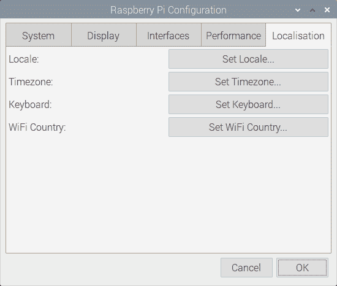](https://cdn.sparkfun.com/assets/learn_tutorials/1/1/3/1/Raspberry_Pi_Configuration_Region.png)

#### 配置互联网接口

Raspbian 在自动配置无线网络方面做得很好。默认情况下，DHCP 配置为当网络电缆插入以太网端口或连接无线网络时，Pi 将接收 IP 地址。

要使用图形网络工具，请右键单击任务栏右侧的图标，然后单击“WiFi 网络(dhcpcdui)设置”。然后，选择所需的接口(wlan0 或 eth0)以禁用 DHCP，并在必要时设置自己的 IP。

要连接到无线网络，请单击图标，选择所需的网络，然后输入密码。

[](https://cdn.sparkfun.com/assets/learn_tutorials/1/1/3/1/Wireless_Wired_Network_Icon_Raspberry_Pi.png)

将鼠标悬停在图标上，将显示 wlan0 和 eth0 的状态，同时还会显示 IP 地址。

### 命令行界面(CLI)

对于使用命令行的高级用户，您可以使用 CLI 来调整设置。打开终端窗口来配置 Raspberry Pi。

#### 配置键盘布局

在命令行中使用以下命令调用配置工具:

```
language:bash
sudo raspi-config 
```

然后采取以下措施来更改键盘设置。在下面的例子中，我们将把设置改为 US。如果您在其他地区，只需选择最符合您偏好的选项:

*   **设置系统的默认区域设置**
    *   选择“**国际化选项**
    *   选择“**更改区域设置**
    *   取消选择 **en_GB。UTF-8 UTF-8**
    *   选择 **en_US。UTF-8 UTF-8** ，(Ok)
    *   将**默认值设置为 en_US。UTF-8** 、
        、

*   **更改键盘布局** -从国际化选项菜单中，
    *   更改**键盘布局**
    *   保持设置为:**通用 105 键(国际)PC** (正常)
    *   选择**其他**(确定)
    *   选择**英语(美国)**(确定)
    *   选择**英语(美国)**(确定)
    *   选择**默认**(确定)
    *   选择**无合成键** (Ok)
    *   设置 **Ctrl+Alt+Bksp 功能** (Ok)

*   **完成对话框并返回到 shell**
    *   在提示符下尝试使用`"`和`#`键。

我们建议此时重新启动 Pi，以确保更改生效。

#### 更改您的密码

键入以下命令更改密码。

```
language:bash
sudo passwd 
```

系统将提示您输入新密码。输入你的新密码，你的个人识别码将会更加安全，不受不速之客的侵扰。

**Warning:** If this is the first time booting up your Raspberry Pi, we recommend changing your password from the default to secure your Raspberry Pi. Make sure to write down the password somewhere safe before saving! You can also change the username as well.

#### 配置互联网接口

此时，网络配置是开箱即用的，所以实际上没有什么可配置的，但是万一出现问题，这里有一些可以使用的基础知识和一个已知的工作配置进行比较。

配置文件`interfaces`配置有线和无线设备。在终端中输入以下命令来编辑接口文件。

```
language:bash
sudo nano /etc/network/interfaces 
```

如果您喜欢图形，请将“nano”替换为“leafpad”。这是我们的 Pi 3 使用的:

```
language:bash
# interfaces(5) file used by ifup(8) and ifdown(8)

# Please note that this file is written to be used with dhcpcd
# For static IP, consult /etc/dhcpcd.conf and 'man dhcpcd.conf'

# Include files from /etc/network/interfaces.d:
source-directory /etc/network/interfaces.d

auto lo
iface lo inet loopback

iface eth0 inet manual

allow-hotplug wlan0
iface wlan0 inet manual
    wpa-conf /etc/wpa_supplicant/wpa_supplicant.conf

allow-hotplug wlan1
iface wlan1 inet manual
    wpa-conf /etc/wpa_supplicant/wpa_supplicant.conf 
```

默认情况下，该文件设置为从`/etc/wpa_supplicant/wpa_supplicant.conf`获取其配置，这确实是 wifi 信息的合适位置。以下是内容:

```
language:bash
ctrl_interface=DIR=/var/run/wpa_supplicant GROUP=netdev
update_config=1

network={
        ssid="myNetworkSSID"
        psk="mySuperSecurePassword"
        key_mgmt=WPA-PSK
} 
```

**A note on network configuration:** Try the GUI tool first, and only modify the files as a last resort. If you find the tool doesn't work, save your configuration files as a backup, and don't be afraid to try your hand at a manual configuration.

#### 应用更改

有时链路应该被循环以采用新的配置。使用`ifdown`和`ifup`关闭并重新启动链接，而不是关闭 pi 并重新启动。

对于无线连接，使用

```
language:bash
sudo ifdown wlan 
```

和

```
language:bash
sudo ifup wlan0 
```

对于**有线**连接，使用

```
language:bash
sudo ifdown eth0 
```

和

```
language:bash
sudo ifup eth0 
```

### 更新软件

软件包不断更新。幸运的是，Linux 使用了包管理器。我们要做的就是告诉我们的包经理更新一切，然后坐以待毙。请确保更新图像，以便我们有最新的发行版。在命令行中分别输入以下命令来更新您的映像。

```
language:bash
sudo apt-get update 
```

这将获取最新的软件包信息，并告诉软件包管理器需要更新什么。

```
language:bash
sudo apt-get upgrade 
```

这将下载和升级所有的软件包。请注意，升级需要一段时间。它还会提示你这是否真的是你要做的，正确答案是“`Y`”。

**Note:** By replacing the argument `upgrade` to `dist-upgrade`, the apt-get tool will automatically update or remove any unnecessary dependencies.

```
sudo apt-get dist-upgrade
```

如果需要，键入以下命令重新启动。

```
language:bash
sudo reboot 
```

#### **`apt`vs`apt-get`有什么区别？**

The `apt-get` command is older and has more functionality. It's meant for system use, low level interfaces, or scripts. The tool is backward compatible and predictable.

The `apt` command is newer, user friendly, and includes a progress bar as the packages are installed. The `apt` command combines commonly used functions from `apt-get`, `apt-cache`, and `apt-config` into one simplified tool. There may be additional options and output. It's meant to be for the Linux user and high level interfaces. The tool is continually being developed and commands may change in the future.

Overall, both `apt` and `apt-get` function the same. However, the syntax is slightly different between the two.

随着时间的推移，您将在更新期间开始积累旧的包。要节省空间并删除自动安装的不再需要的不必要的软件包，可以输入以下命令。它还会提示你这是否真的是你要做的，正确答案是“`Y`”。

```
language:bash
sudo apt-get autoremove 
```

然后通过输入以下命令清除包缓存。

```
language:bash
sudo apt-get clean 
```

### 其他有用的 Linux 命令

在终端命令行中使用的其他一些有用的命令:

*   打印工作目录，如果你不确定你在哪个文件夹，它会告诉你你在文件系统的哪个位置。
*   `ls` - List，这将向你显示文件夹的内容。要显示所有文件，包括隐藏的文件，键入`ls -a`显示所有文件/文件夹。或者，输入`ls -al`会显示所有文件/文件夹以及它们的权限设置。
*   这是你改变目录的方法。
    *   `cd foldername` -会将您移至该文件夹。
    *   会让你提升一个等级。
    *   将带你回到你的主目录。
*   `passwd` -这将允许您更改您的密码
*   这代表手动。在命令前键入 man 以获得如何使用它的摘要。
*   这将打开一个简单易用的基本文本编辑器。

此时，您应该可以像对待任何其他计算机一样与您的 Raspberry Pi 进行交互。你可以自学 Linux 的优点，学习 Python，编程 GPIO 引脚，设置 minecraft 服务器，构建网络存储系统，游戏控制台，或媒体中心，或者只是在网上冲浪。

## 解决纷争

树莓派有问题吗？查看这个来自 [Raspberry Pi Foundation 论坛](https://www.raspberrypi.org/forums/index.php)的便笺，了解基本的故障排除。

[Pi Foundation Forums: Basic Troubleshooting with the Raspberry Pi](https://www.raspberrypi.org/forums/viewtopic.php?t=58151)

为 Raspberry Pi 设计的 SparkFun 硬件有问题吗？试着查看一下 [SparkFun 论坛](https://forum.sparkfun.com/)，看看我们是否能提供帮助。

[SparkFun Forums](https://forum.sparkfun.com/)

## 资源和更进一步

### 树莓派配饰

如果您正在寻找添加附加功能，[查看附件](https://www.sparkfun.com/categories/394)来远程启动您的树莓 Pi，构建一个自制的运动激活安全系统，或者通过构建您自己的街机控制器来模仿经典视频游戏，回归传统！

[](https://www.sparkfun.com/products/13733) 

将**添加到您的[购物车](https://www.sparkfun.com/cart)中！**

### [【树莓派 LCD - 7】触摸屏](https://www.sparkfun.com/products/13733)

[In stock](https://learn.sparkfun.com/static/bubbles/ "in stock") LCD-13733

这款 7 英寸的 Raspberry Pi 触摸屏液晶显示器让您能够创建一个独立的设备，可以用作一个触摸屏

$60.0051[Favorited Favorite](# "Add to favorites") 150[Wish List](# "Add to wish list")****[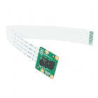](https://www.sparkfun.com/products/14028) 

将**添加到您的[购物车](https://www.sparkfun.com/cart)中！**

### [树莓派相机模块 V2](https://www.sparkfun.com/products/14028)

[In stock](https://learn.sparkfun.com/static/bubbles/ "in stock") DEV-14028

这个 800 万像素的摄像头模块能够拍摄 1080p 视频和静态图像，直接连接到您的 Raspberry Pi。

$25.0015[Favorited Favorite](# "Add to favorites") 66[Wish List](# "Add to wish list")****[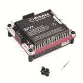](https://www.sparkfun.com/products/14803) 

将**添加到您的[购物车](https://www.sparkfun.com/cart)中！**

### [皮汁帽-树莓皮便携式电源平台](https://www.sparkfun.com/products/14803)

[In stock](https://learn.sparkfun.com/static/bubbles/ "in stock") PRT-14803

PiJuice 是一个完全不间断的电源帽，将始终保持您的树莓 Pi 供电。

$73.954[Favorited Favorite](# "Add to favorites") 62[Wish List](# "Add to wish list")****[](https://www.sparkfun.com/products/retired/14007) 

### [](https://www.sparkfun.com/products/retired/14007)

[Retired](https://learn.sparkfun.com/static/bubbles/ "Retired") KIT-14007

你有覆盆子 Pi2 或 Pi3 吗？你一直想用它来建立你自己的游戏站吗？火花电筒…

7 **Retired**[Favorited Favorite](# "Add to favorites") 30[Wish List](# "Add to wish list")************[Click to Browse More Raspberry Pi Accessories](https://www.sparkfun.com/categories/394)

* * *

以下是我们其他 Pi 资源的一些链接。

*   [树莓派粉底](https://www.raspberrypi.org/)
    *   [树莓派入门](https://projects.raspberrypi.org/en/projects/raspberry-pi-getting-started)
    *   [产品简介(PDF)](https://cdn.sparkfun.com/assets/d/a/c/4/8/Raspberry-Pi-4-Product-Brief.pdf)
    *   [示意图(PDF)](https://cdn.sparkfun.com/assets/4/5/3/3/6/rpi_SCH_4b_4p0_reduced.pdf)
    *   [机械制图(PDF)](https://cdn.sparkfun.com/assets/5/9/7/8/a/rpi_MECH_4b_4p0.pdf)
    *   [文档](https://www.raspberrypi.org/documentation/)
    *   [项目](https://projects.raspberrypi.org/en/projects)
    *   [Pi 基金会论坛](https://www.raspberrypi.org/forums/)
    *   [树莓 Pi 论坛:你的 Pi 不开机了吗？](https://www.raspberrypi.org/forums/viewtopic.php?t=58151)-Raspberry Pi 无法启动的基本故障排除技巧和解决方案。
*   [gPIo 教程](https://learn.sparkfun.com/tutorials/raspberry-gpio)
*   [SPI 和 I2C 教程](https://learn.sparkfun.com/tutorials/raspberry-pi-spi-and-i2c-tutorial)

需要一些灵感吗？查看这些教程和项目。

[](https://learn.sparkfun.com/tutorials/raspberry-pi-twitter-monitor) [### Raspberry Pi Twitter 监视器](https://learn.sparkfun.com/tutorials/raspberry-pi-twitter-monitor) How to use a Raspberry Pi to monitor Twitter for hashtags and blink an LED.[Favorited Favorite](# "Add to favorites") 6[](https://learn.sparkfun.com/tutorials/hackers-in-residence-the-sound-visualizer) [### 黑客住宅:声音可视化](https://learn.sparkfun.com/tutorials/hackers-in-residence-the-sound-visualizer) A fun project that uses a Raspberry Pi and a custom Java app to create your own sound visualizer using a RGB LED matrix.[Favorited Favorite](# "Add to favorites") 2[](https://learn.sparkfun.com/tutorials/pi-avr-programmer-hat-hookup-guide) [### Pi AVR 程序员帽连接指南](https://learn.sparkfun.com/tutorials/pi-avr-programmer-hat-hookup-guide) In this tutorial, we will use a Raspberry Pi 3 and the Pi AVR Programmer HAT to program an ATMega328P target. We are going to first program the Arduino bootloader over SPI, and then upload an Arduino sketch over a USB serial COM port.[Favorited Favorite](# "Add to favorites") 3[](https://learn.sparkfun.com/tutorials/getting-started-with-the-a111-pulsed-radar-sensor) [### A111 脉冲雷达传感器入门](https://learn.sparkfun.com/tutorials/getting-started-with-the-a111-pulsed-radar-sensor) Get started with the Acconeer A111 SDK with a Raspberry Pi! The tiny A111 pulsed coherent radar (PCR) adds high-precision, cutting-edge distance measurement for speed-, material-, motion-, or gesture-sensing projects! We’re not talking about simple ultrasonic, or even infrared sensors here, but 60GHz radar 6

或者看看这些博客中的一些想法。

[](https://www.sparkfun.com/news/1318 "November 21, 2013: How to create a simple and cheap time-lapse rig with the Raspberry Pi.") [### Enginursday:树莓派的延时摄影

November 21, 2013](https://www.sparkfun.com/news/1318 "November 21, 2013: How to create a simple and cheap time-lapse rig with the Raspberry Pi.")[Favorited Favorite](# "Add to favorites") 0[](https://www.sparkfun.com/news/1320 "December 5, 2013: How to create a Twitter monitor in Python and flash an LED using a Raspberry Pi.") [### Enginursday:用树莓派监控 Twitter

December 5, 2013](https://www.sparkfun.com/news/1320 "December 5, 2013: How to create a Twitter monitor in Python and flash an LED using a Raspberry Pi.")[Favorited Favorite](# "Add to favorites") 0[](https://www.sparkfun.com/news/1396 "February 13, 2014: The next chapter in the Raspberry Pi Aquaponics Time-laspe project. ") [### Enginursday:树莓码头的延时摄影。2

February 13, 2014](https://www.sparkfun.com/news/1396 "February 13, 2014: The next chapter in the Raspberry Pi Aquaponics Time-laspe project. ")[Favorited Favorite](# "Add to favorites") 0[](https://www.sparkfun.com/news/2044 "February 29, 2016: An overview (and pre-orders!) of the newest Raspberry Pi single board computer.") [### 树莓 Pi 3

February 29, 2016](https://www.sparkfun.com/news/2044 "February 29, 2016: An overview (and pre-orders!) of the newest Raspberry Pi single board computer.")[Favorited Favorite](# "Add to favorites") 0[](https://www.sparkfun.com/news/2146 "July 19, 2016: Building a set of speakers from goat skin and connecting them to a network media server") [### t:树莓派和立体声阿卡那

July 19, 2016](https://www.sparkfun.com/news/2146 "July 19, 2016: Building a set of speakers from goat skin and connecting them to a network media server")[Favorited Favorite](# "Add to favorites") 1[](https://www.sparkfun.com/news/2196 "September 27, 2016: Let's use IoT to improve our diets!") [### t:物联网智能餐具室(第一部分)

September 27, 2016](https://www.sparkfun.com/news/2196 "September 27, 2016: Let's use IoT to improve our diets!")[Favorited Favorite](# "Add to favorites") 5[](https://www.sparkfun.com/news/2206 "October 7, 2016: The Raspberry Pi Camera Module v2, a new Raspberry Pi Enclosure, an RJ11 Breakout. Oh so vivid!") [### 周五产品发布:生动的 1080pi

October 7, 2016](https://www.sparkfun.com/news/2206 "October 7, 2016: The Raspberry Pi Camera Module v2, a new Raspberry Pi Enclosure, an RJ11 Breakout. Oh so vivid!")[Favorited Favorite](# "Add to favorites") 0[](https://www.sparkfun.com/news/2220 "November 10, 2016: I started with a PiRetrocade kit and kept adding until I had a major appliance on my hands: my very own full-size arcade cabinet!") [### 将您的个人记录提升到一个新的高度

November 10, 2016](https://www.sparkfun.com/news/2220 "November 10, 2016: I started with a PiRetrocade kit and kept adding until I had a major appliance on my hands: my very own full-size arcade cabinet!")[Favorited Favorite](# "Add to favorites") 2[](https://www.sparkfun.com/news/2259 "December 22, 2016: These Raspberry Pi tips and Python tricks let you take your sensing projects off the desk and into the wild with wireless transmission and processing of data.") [### Enginursday:插座的乐趣

December 22, 2016](https://www.sparkfun.com/news/2259 "December 22, 2016: These Raspberry Pi tips and Python tricks let you take your sensing projects off the desk and into the wild with wireless transmission and processing of data.")[Favorited Favorite](# "Add to favorites") 1[](https://www.sparkfun.com/news/2266 "December 29, 2016: The most complicated, over-the-top, MacGyver-Van Damme'd remote-controlled laser!") [### 星期三:莫特和玛丽出席...有趣的插座，旧产品永不过时

December 29, 2016](https://www.sparkfun.com/news/2266 "December 29, 2016: The most complicated, over-the-top, MacGyver-Van Damme'd remote-controlled laser!")[Favorited Favorite](# "Add to favorites") 1[](https://www.sparkfun.com/news/2282 "January 26, 2017: A brief overview of the new Raspberry Pi-based data-logging web server from Atlas Scientific ") [### Enginursday: Eniac，数据记录网络服务器

January 26, 2017](https://www.sparkfun.com/news/2282 "January 26, 2017: A brief overview of the new Raspberry Pi-based data-logging web server from Atlas Scientific ")[Favorited Favorite](# "Add to favorites") 1[](https://www.sparkfun.com/news/2288 "January 31, 2017: Can technology help you make better food decisions? ") [### 周日:新年决心# 2——健康饮食

January 31, 2017](https://www.sparkfun.com/news/2288 "January 31, 2017: Can technology help you make better food decisions? ")[Favorited Favorite](# "Add to favorites") 1[](https://www.sparkfun.com/news/2314 "February 21, 2017: Learn how to build beautiful GUIs on your connected Raspberry Pi projects using NWJS (formerly Node-Webkit) ") [### IoTuesday:用于您的 Raspberry Pi 硬件项目的 Web 风格 GUI

February 21, 2017](https://www.sparkfun.com/news/2314 "February 21, 2017: Learn how to build beautiful GUIs on your connected Raspberry Pi projects using NWJS (formerly Node-Webkit) ")[Favorited Favorite](# "Add to favorites") 3[](https://www.sparkfun.com/news/2327 "March 8, 2017: Do you ever need to make a lot of Pi? This trick will save you some time!") [### 硬件高峰日:克隆你的树莓派

March 8, 2017](https://www.sparkfun.com/news/2327 "March 8, 2017: Do you ever need to make a lot of Pi? This trick will save you some time!")[Favorited Favorite](# "Add to favorites") 4[](https://www.sparkfun.com/news/2332 "March 15, 2017: Let's learn about udev and how we can lock down our USB device nodes!") [### 硬件驼峰日:Raspberry Pi 上的 USB 设备规则

March 15, 2017](https://www.sparkfun.com/news/2332 "March 15, 2017: Let's learn about udev and how we can lock down our USB device nodes!")[Favorited Favorite](# "Add to favorites") 0[](https://www.sparkfun.com/news/2343 "March 30, 2017: Amazon has released an example allowing you to create an Alexa endpoint on a Raspberry Pi 3 (or 2B). It's free and open source, so you can tear it apart, see how it works and modify it as you see fit!") [### Enginursday:自制 Alexa 端点

March 30, 2017](https://www.sparkfun.com/news/2343 "March 30, 2017: Amazon has released an example allowing you to create an Alexa endpoint on a Raspberry Pi 3 (or 2B). It's free and open source, so you can tear it apart, see how it works and modify it as you see fit!")[Favorited Favorite](# "Add to favorites") 3[](https://www.sparkfun.com/news/2516 "November 8, 2017: Using a Raspberry Pi and the Google Calendar API to avoid Meeting Room Mayhem.") [### 自动化会议室标牌

November 8, 2017](https://www.sparkfun.com/news/2516 "November 8, 2017: Using a Raspberry Pi and the Google Calendar API to avoid Meeting Room Mayhem.")[Favorited Favorite](# "Add to favorites") 2[](https://www.sparkfun.com/news/2528 "November 9, 2017: Autonomous robots designed to navigate extra-terrestrial terrain") [### 乘着 XBee，RPi 的翅膀飞向太空

November 9, 2017](https://www.sparkfun.com/news/2528 "November 9, 2017: Autonomous robots designed to navigate extra-terrestrial terrain")[Favorited Favorite](# "Add to favorites") 0[](https://www.sparkfun.com/news/2589 "January 25, 2018: Using the Mind Wave Mobile+, Mort and I created a mind-controlled IoT...solution (?) with sockets, of course!") [### 莫特和玛丽介绍:精神控制的电灯开关

January 25, 2018](https://www.sparkfun.com/news/2589 "January 25, 2018: Using the Mind Wave Mobile+, Mort and I created a mind-controlled IoT...solution (?) with sockets, of course!")[Favorited Favorite](# "Add to favorites") 2[](https://www.sparkfun.com/news/2706 "June 12, 2018: A quick look at the default IDEs that come with the Raspbian for developing Python applications.") [### Raspberry Pi Python IDE 比较

June 12, 2018](https://www.sparkfun.com/news/2706 "June 12, 2018: A quick look at the default IDEs that come with the Raspbian for developing Python applications.")[Favorited Favorite](# "Add to favorites") 0[](https://www.sparkfun.com/news/2753 "August 17, 2018: Today we have a new, "powerful" Raspberry Pi HAT, a load of solar panels, and a knob for our small and medium-sized slide pots!") [### 周五产品帖子:启动你的 Pi！

August 17, 2018](https://www.sparkfun.com/news/2753 "August 17, 2018: Today we have a new, "powerful" Raspberry Pi HAT, a load of solar panels, and a knob for our small and medium-sized slide pots!")[Favorited Favorite](# "Add to favorites") 0[](https://www.sparkfun.com/news/2817 "November 13, 2018: Pretty quiet around here at 7 a.m. Maybe I can whip up a quick python-fueled, Pi-based bot? Oh, yeah - hot glue features prominently in this build.") [### 早上的黑客机器人

November 13, 2018](https://www.sparkfun.com/news/2817 "November 13, 2018: Pretty quiet around here at 7 a.m. Maybe I can whip up a quick python-fueled, Pi-based bot? Oh, yeah - hot glue features prominently in this build.")[Favorited Favorite](# "Add to favorites") 1**********************************