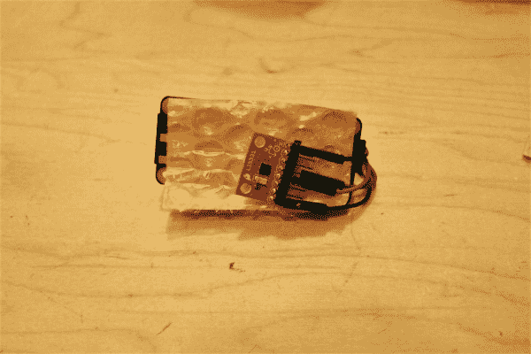
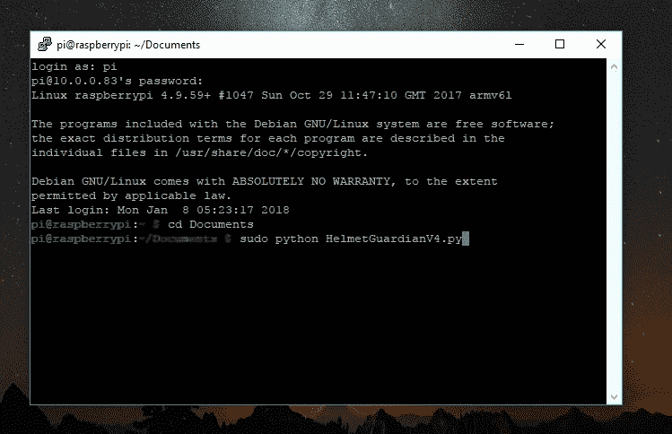

# Raspberry Pi 零头盔冲击力监控器

> 原文：<https://learn.sparkfun.com/tutorials/raspberry-pi-zero-helmet-impact-force-monitor>

## 介绍

**阅读时间:** ~ 15 分钟

**建造时间:** ~ 60 - 90 分钟

人体能承受多大的冲击？无论是足球、攀岩还是自行车事故，知道在碰撞后何时立即寻求医疗救助是非常重要的，尤其是在没有明显外伤迹象的情况下。本教程将教你如何建立自己的冲击力监测器！

[](https://cdn.sparkfun.com/assets/learn_tutorials/6/4/1/CoverPhoto-SystemALRTHelmetForceMonitor.jpg)

这个开源项目使用 Raspberry Pi Zero W 和 LIS331 加速度计来监控并警告用户潜在的危险重力。当然，请随意修改和调整系统，以适应您的各种公民科学需求。

**Note**: Build fun stuff with the Impact Force Monitor! However, please don't use it as a substitute for professional medical advice and diagnosis. If you feel that you have taken a serious fall, please visit a qualified and licensed professional for proper treatment.

### 建议的视频

[https://www.youtube.com/embed/hzNJtNnvi5A/?autohide=1&border=0&wmode=opaque&enablejsapi=1](https://www.youtube.com/embed/hzNJtNnvi5A/?autohide=1&border=0&wmode=opaque&enablejsapi=1)

### 推荐阅读

为了使本教程简短，我假设你从一个函数 Pi Zero W 开始，需要帮助吗？没问题！这里有一个完整的设置教程。

[](https://learn.sparkfun.com/tutorials/getting-started-with-the-raspberry-pi-zero-wireless) [### Raspberry Pi Zero Wireless 入门

#### 2017 年 7 月 13 日](https://learn.sparkfun.com/tutorials/getting-started-with-the-raspberry-pi-zero-wireless) Learn how to setup, configure and use the smallest Raspberry Pi yet, the Raspberry Pi Zero - Wireless.[Favorited Favorite](# "Add to favorites") 17

我们还将远程连接到 Pi(也称为无线连接)。要更全面地了解这个过程[，请查看制作“无头”树莓派的教程](http://foxbotindustries.com/intro-headless-raspberry-pi/):

[Intro to the (Headless) Raspberry Pi!](http://foxbotindustries.com/intro-headless-raspberry-pi/)

#### 卡住了还是想了解更多？以下是一些方便的资源:

[](https://learn.sparkfun.com/tutorials/accelerometer-basics) [### 加速度计基础知识](https://learn.sparkfun.com/tutorials/accelerometer-basics) A quick introduction to accelerometers, how they work, and why they're used.[Favorited Favorite](# "Add to favorites") 29[](https://learn.sparkfun.com/tutorials/raspberry-gpio) [### 树莓 gPIo](https://learn.sparkfun.com/tutorials/raspberry-gpio) How to use either Python or C++ to drive the I/O lines on a Raspberry Pi.[Favorited Favorite](# "Add to favorites") 17[](https://learn.sparkfun.com/tutorials/raspberry-pi-spi-and-i2c-tutorial) [### 树莓派 SPI 和 I2C 教程](https://learn.sparkfun.com/tutorials/raspberry-pi-spi-and-i2c-tutorial) Learn how to use serial I2C and SPI buses on your Raspberry Pi using the wiringPi I/O library for C/C++ and spidev/smbus for Python.[Favorited Favorite](# "Add to favorites") 24[](https://learn.sparkfun.com/tutorials/raspberry-pi-3-starter-kit-hookup-guide) [### 树莓 Pi 3 入门套件连接指南](https://learn.sparkfun.com/tutorials/raspberry-pi-3-starter-kit-hookup-guide) Guide for getting going with the Raspberry Pi 3 Model B and Raspberry Pi 3 Model B+ starter kit.[Favorited Favorite](# "Add to favorites") 13

另外，请查看 LIS331 的数据手册。

[LIS331 Datasheet](https://www.sparkfun.com/datasheets/Sensors/Accelerometer/LIS331HH.pdf)

### 所需材料

要跟随本教程，您将需要以下材料。你可能不需要所有的东西，这取决于你拥有什么。将它添加到您的购物车，通读指南，并根据需要调整购物车。

[Helmet Impact Force Monitor Wish List](https://www.sparkfun.com/wish_lists/143353)

愿望清单中的项目包括:

*   [树莓派 Zero W 基础套装](https://www.sparkfun.com/products/14298)
    *   带 noobs 操作系统的 micross 卡
    *   USB OTG 线(微型 B 到母 A USB)
    *   迷你 HDMI 至 HDMI
    *   微型 B 墙壁适配器(5V)
    *   *还推荐:USB Hub*
*   [Raspberry Pi 3 接头引脚](https://www.sparkfun.com/products/14275)
*   [LIS331 加速度计分线板](https://www.sparkfun.com/products/10345)
*   [带微型 B 连接器的电池组](https://www.sparkfun.com/products/14169)
*   [LED -基本红色 5 毫米](https://www.sparkfun.com/products/9590)
*   [1kω电阻](https://www.sparkfun.com/products/13760)
*   6" [热缩管](https://www.sparkfun.com/products/9353)或电工胶带
*   4x [接头引脚](https://www.sparkfun.com/products/116)
    *   加速度计的 8x 引脚
    *   2 个 LED 引脚
*   6x [母到母跳线](https://www.sparkfun.com/products/8430)

### 工具

您还需要以下工具。

*   [烙铁、焊料和附件](https://www.sparkfun.com/categories/49)
*   环氧树脂(或其他永久性非导电液体粘合剂)
*   *剪刀(可选)*

## 但是等等！什么是冲击力？？

幸运的是,“冲击力”这个术语非常简单:冲击力的大小。像大多数事情一样，测量它需要一个更精确的定义。冲击力的方程式是:

[](https://cdn.sparkfun.com/assets/learn_tutorials/6/4/1/ForceEquationLatex.png)

其中 *F* 是冲击力， *KE* 是动能(运动的能量)， *d* 是撞击距离，或者说物体嘎吱嘎吱响了多少。

这个等式有两个关键点:

*   冲击力*与动能*成正比，这意味着动能增加，**冲击力也增加。**
*   冲击力*与冲击距离*成反比，即冲击距离增加，**冲击力减小。(这就是我们有安全气囊的原因:增加我们撞击的距离。)**

力通常用牛顿(n)来度量，但冲击力可以用“重力”来讨论，这是一个用 g 的倍数表示的数字，或者是地球的重力加速度(9.8 m/s^2).)当我们使用重力单位时，我们测量的是一个物体相对于自由落体向地球的加速度。从技术上讲， *g* 是加速度，不是力。然而，当谈到碰撞时，这是有用的，因为加速度(*速度和/或方向的变化*)是伤害人体的原因。

在这个项目中，我们将使用重力单位来确定撞击是否有潜在危险，是否值得医疗关注。[研究发现](https://hypertextbook.com/facts/2004/YuriyRafailov.shtml)超过 9G 的重力对大多数人来说是致命的(没有经过特殊训练)，如果持续超过几秒钟，4-6G 可能是危险的。

了解了这一点，我们就可以对冲击力监控器进行编程，如果加速度计测量到的重力超过这些阈值，就会发出警报。科学万岁！

更多信息，请阅读维基百科上关于[冲击力](https://en.wikipedia.org/wiki/Impact_(mechanics))和[重力](https://en.wikipedia.org/wiki/G-force)的内容！

## 配置 Pi 零点 W

收集您的 Raspberry Pi Zero 和外设来配置无头 Pi！

[](https://cdn.sparkfun.com/assets/learn_tutorials/6/4/1/PiZeroKit-2HelmetForceMonitor.jpg)

*   将 Pi 连接到显示器和相关外围设备(键盘、鼠标)，插上电源，然后登录。

*   更新软件，以保持您的 Pi 快速和安全。打开[终端窗口](https://learn.sparkfun.com/tutorials/terminal-basics)并输入以下命令:

    *   键入并输入:`sudo apt-get update`

    *   键入并输入:`sudo apt-get upgrade`

    *   复位:`sudo shutdown -r now`

### 启用 WiFi、SSH 和 I2C。

*   单击桌面右上角的 WiFi 图标，连接到您的 WiFi 网络。

*   在终端键入以下命令，调出 Pi 的软件配置工具:`sudo raspi-config`

[](https://cdn.sparkfun.com/assets/learn_tutorials/6/4/1/PiZero-RaspPiConfig1.jpg)

*   选择*接口选项*，然后选择 *SSH* ，选择底部的*是*启用。

*   回到*接口选项*，然后是 *I2C* ，选择*是*使能。

*   在终端中，安装远程桌面连接软件:`sudo apt-get install xrdp`

    *   对两个提示都在键盘上键入“Y”(是)。

    *   通过将鼠标悬停在 WiFi 连接上来找到 Pi 的 IP 地址(您可能还想记下它)。

[](https://cdn.sparkfun.com/assets/learn_tutorials/6/4/1/PiZero-EasyIPAddr.jpg)

*   使用`passwd`命令更改 Pi 的密码。

### 重启 Pi 并远程登录。

我们现在可以抛弃 HDMI 和外设了，哇哦！

*   设置远程桌面连接。

    *   在 PC 上，打开远程桌面连接(或 PuTTY，如果你愿意的话)。

    *   对于 Mac/Linux，您可以安装该程序或使用 VNC 程序。

*   输入 Pi 的 IP 并点击“*连接*”(忽略关于未知设备的警告)。

[](https://cdn.sparkfun.com/assets/learn_tutorials/6/4/1/RemoteDesktopConnection.jpg)

*   使用您的凭证登录 Pi，我们就可以开始了！

## 建造它:电子！

这是该项目的电气原理图:

[](https://cdn.sparkfun.com/assets/learn_tutorials/6/4/1/ImpactForceMonitor-FritzingSchematic_bb.jpg)**Note:** The LIS331 breakout board in the schematic is an older version -- use the pin labels for guidance.

以下是 Pi Zero W 的引脚排列供参考:

[](https://cdn.sparkfun.com/assets/learn_tutorials/6/7/6/PiZero_1.pdf)*Click on the image to view the PDF.*

### 将 LIS331 加速度计连接到 Pi 的 GPIO

[焊接](https://learn.sparkfun.com/tutorials/how-to-solder-through-hole-soldering)并小心去除加速度计和 Pi GPIO 头部引脚上的任何焊剂残留物。

| [](https://cdn.sparkfun.com/assets/learn_tutorials/6/4/1/LIS331-HeadersBackHelmetForceMonitor.jpg) | [](https://cdn.sparkfun.com/assets/learn_tutorials/6/4/1/PiZero-Closeup_HeadersHelmetForceMonitor.jpg) |

然后在 LIS331 分线板和下列引脚之间的 Pi 之间连接跳线:

| LIS331 分线板 | Raspberry Pi GPIO 引脚 |
| GND | GPIO 9 (GND) |
| VCC | GPIO 1 (3.3V) |
| 国家药品监督管理局 | GPIO 3 (SDA) |
| SCL | GPIO 5 (SCL) |

为了更容易将传感器连接到 Pi 零点，使用母接头和跳线制作了一个定制适配器。测试连接后，添加了热收缩。

[](https://cdn.sparkfun.com/assets/learn_tutorials/6/4/1/PiZero-LIS331HelmetForceMonitor.jpg)

### 添加一个警报 LED！

将限流电阻焊接到负极 LED 引脚(较短引脚)上，并添加热缩膜(或绝缘胶带)进行绝缘。

| [](https://cdn.sparkfun.com/assets/learn_tutorials/6/4/1/LED-ResistorHelmetForceMonitor.jpg) | [](https://cdn.sparkfun.com/assets/learn_tutorials/6/4/1/LED-ShrinkTubeHelmetForceMonitor.jpg) |

使用两根跨接电缆或接头引脚将正极 LED 引脚连接到 GPIO26，将电阻器连接到 GND(分别为接头位置 37 和 39)。

### 完成设置

将电池组连接到 Pi 的输入电源以完成设置！

[](https://cdn.sparkfun.com/assets/learn_tutorials/6/4/1/FullSystem-Electronics_OFFHelmetForceMonitor.jpg)

## 编程吧！

这个项目的 Python 代码是开源的！这里有一个 GitHub 库的链接。

[ImpactForceMonitor GitHub Repo](https://github.com/jenfoxbot/ImpactForceMonitor)

### 对于编程新手:

*   通读程序代码和注释。容易修改的东西在最上面的“`User Parameters`”部分。

### 对于更熟悉技术问题的人来说:

*   该程序使用默认设置初始化 LIS331 加速度计，包括正常功耗模式和 50Hz 数据速率。通读 [LIS331 数据表](https://www.sparkfun.com/datasheets/Sensors/Accelerometer/LIS331HH.pdf)并根据需要修改初始化设置。

### 全部:

*   在这个项目中使用的最大加速度是 24G，因为冲击力变得很快！

*   当您准备好进行全面部署时，建议在 main 函数中注释掉加速打印语句。

在运行程序之前，仔细检查加速度计地址是否为 **0x19** 。打开终端窗口，使用以下命令安装一些有用的工具:

```
sudo apt-get install -y i2c-tools 
```

然后运行 *i2cdetect* 程序:

```
i2cdetect -y 1 
```

您将看到如下图所示的 I2C 地址表。假设这是唯一连接的 I2C 设备，你看到的数字(在这种情况下:19)是加速度计地址！如果您看到不同的数字，记下并在程序中更改(变量`addr`)。

[](https://cdn.sparkfun.com/assets/learn_tutorials/6/4/1/Pi-I2C_DetectAddress.jpg)

### 快速概述

该程序读取 x、y 和 z 加速度，计算重力，然后根据需要将数据保存在两个文件中(与程序代码在同一个文件夹中):

*   **AllSensorData.txt** -给出时间戳，后跟 x、y 和 z 轴上的重力。
*   **AlertData.txt** -同上，但仅适用于高于我们的安全阈值(超过 3 秒的 9G 或 4G 绝对阈值)的读数。

超过我们安全阈值的重力也将打开我们的警报 LED，并保持它，直到我们重新启动程序。通过在命令终端输入“ **CTRL+c** ”(键盘中断)来停止程序。

这是测试期间创建的两个数据文件的照片:

[](https://cdn.sparkfun.com/assets/learn_tutorials/6/4/1/AcclDataTextFiles-AllSensorData_and_AlertData.jpg)*Having a hard time seeing the data? Click the image for a closer look.*

## 测试系统！

打开终端窗口，使用`cd`命令导航至保存程序代码的文件夹。

```
cd path/to/folder 
```

使用 root 权限运行程序:

```
sudo python NameOfFile.py 
```

检查 x、y 和 z 方向的加速度值是否打印到终端窗口，是否合理，如果重力高于我们的阈值，则打开 LED 灯。

*   要进行测试，旋转加速度计，使每个轴指向地球，并检查测量值是 1 还是-1(对应于重力加速度)。

*   摇动加速度计以确保读数增加(符号表示轴的方向，我们对读数的*大小*最感兴趣)。

[](https://cdn.sparkfun.com/assets/learn_tutorials/6/4/1/FullSystem-ElectronicsON2HelmetForceMonitor.jpg)

## 安装它！

一旦一切都正常工作，让我们确保冲击力监测器实际上可以承受冲击！

### 安全连接

使用热缩管和/或用环氧树脂涂覆加速度计和 LED 的电气连接。

[](https://cdn.sparkfun.com/assets/learn_tutorials/6/4/1/LIS331-FullConnector1HelmetForceMonitor.jpg)

对于超级耐用的永久安装，考虑用环氧树脂涂覆整个外壳:Pi 零点、LED 和加速度计(但不是 Pi 电缆连接器或 SD 卡)。

**Warning!** You can still access the Pi and do all the computer stuff, but a full coat of epoxy will prevent the use of the GPIO pins for future projects.

Alternatively, you can make or purchase a custom case for the Pi Zero, although check for durability.

固定在头盔、身上或交通工具上，如滑板、自行车或猫*！

***Note:** I originally meant to type "car", but figured an impact force monitor for a cat might also yield some interesting data (with kitty's consent, of course).

全面测试 Pi 是否紧固，否则 GPIO 引脚可能会松动，导致程序崩溃。

### 将电路嵌入头盔

有几种方法可以将电路嵌入头盔。以下是我安装头盔的方法:

如果您还没有，请将电池连接到 Pi(关闭电池)。将加速度计固定在 Pi 背面，中间用绝缘材料(如气泡包装或薄包装泡沫)隔开。

[](https://cdn.sparkfun.com/assets/learn_tutorials/6/4/1/Installation-LIS331CloseUpHelmetForceMonitor.jpg)

测量 Pi 零点、加速度计、LED 和电池连接器组合的尺寸。两边各加 10%。

[](https://cdn.sparkfun.com/assets/learn_tutorials/6/4/1/Installation-Measurement1HelmetForceMonitor.jpg)

在头盔的一侧为项目绘制一个剪切图，使电池连接器朝向头盔的顶部。切掉头盔中的衬垫，留下几毫米(约 1/8 英寸。).

[](https://cdn.sparkfun.com/assets/learn_tutorials/6/4/1/Installation-HelmetCutout1HelmetForceMonitor.jpg)

将传感器、Pi 和 LED 放入切口中。切掉多余的头盔衬垫或使用包装泡沫来绝缘、保护和固定电子设备。

[](https://cdn.sparkfun.com/assets/learn_tutorials/6/4/1/Installation-Electronics3HelmetForceMonitor.jpg)

测量电池的尺寸，增加 10%，并遵循相同的电池切口。将电池插入口袋。

[](https://cdn.sparkfun.com/assets/learn_tutorials/6/4/1/Installation-Battery1HelmetForceMonitor.jpg)

对头盔另一侧的电池重复绝缘技术。

[](https://cdn.sparkfun.com/assets/learn_tutorials/6/4/1/Installation-BatteryPaddingHelmetForceMonitor.jpg)

用胶带将头盔衬垫固定住(当你戴上头盔时，你的头部会将它们固定住)。

## 部署！

给电池组加电！

[](https://cdn.sparkfun.com/assets/learn_tutorials/6/4/1/Helmet-SystemON_closeupHelmetForceMonitor.jpg)

现在，您可以通过 SSH 或远程桌面远程登录到 Pi，并通过终端运行程序。一旦程序开始运行，它就开始记录数据。

当您断开与家庭 WiFi 的连接时，SSH 连接将会中断，但该程序仍应记录数据。考虑将 Pi 连接到您的智能手机热点 WiFi，或者回家后重新登录并获取数据。

[](https://cdn.sparkfun.com/assets/learn_tutorials/6/4/1/FinalSystem-RunProgram.jpg)

要访问数据，远程登录 Pi 并读取文本文件。当前程序总是将数据添加到现有文件中——如果你想删除数据(如从测试中),删除文本文件(通过桌面或在终端中使用`rm`命令)或在程序代码中创建一个新文件名(在用户参数中)。

如果指示灯亮起，重新启动程序会将其关闭。

现在往前走，享受生活，如果你碰巧遇到了什么，偶尔检查一下数据。希望，这是一个小肿块，但至少你会知道！

[](https://cdn.sparkfun.com/assets/learn_tutorials/6/4/1/CoverPhoto-SystemONHelmetForceMonitor.jpg)

## 添加更多功能

想改进冲击力监测器吗？这超出了本教程的范围，但是可以试着看看下面的列表。

*   用 Python 对你的 g 力数据做一些分析！
*   Pi Zero 具有蓝牙和 WiFi 功能-编写一个应用程序将加速度计数据发送到您的智能手机！为了让你开始，这里有一个关于 [Pi Twitter Monitor](https://learn.sparkfun.com/tutorials/raspberry-pi-twitter-monitor) 的教程。
*   添加其他[传感器](https://www.sparkfun.com/search/results?term=sensor)，如[温度传感器](https://www.sparkfun.com/products/13314)或[麦克风](https://www.sparkfun.com/products/9868) *！

***Note:** To hear the whooshing sounds associated with your acceleration! :D

## 资源和更进一步

伙计们，到此为止！如果你有任何问题或意见，请在评论中分享你的想法，让我知道！感谢阅读&快乐建筑！

有关 t 中使用的更多信息，请查看下面的参考资料:

*   [GitHub 项目回购:ImpactForceMonitor](https://github.com/jenfoxbot/ImpactForceMonitor)
*   FoxBot 工业公司:无头树莓派介绍！
*   [LIS331HH 数据表(PDF)](https://www.sparkfun.com/datasheets/Sensors/Accelerometer/LIS331HH.pdf)
*   [物理学手册:可以杀死一个人的加速度](https://hypertextbook.com/facts/2004/YuriyRafailov.shtml)
*   [维基百科:冲击(力学)](https://en.wikipedia.org/wiki/Impact_(mechanics))
*   [维基百科:G 力](https://en.wikipedia.org/wiki/G-force)

你的下一个项目需要一些灵感吗？查看其他一些很酷的 Pi 教程，获取更多灵感！

[](https://learn.sparkfun.com/tutorials/building-large-led-installations) [### 建造大型 LED 装置](https://learn.sparkfun.com/tutorials/building-large-led-installations) Learn what it takes to build large LED installations from planning to power requirements to execution.[Favorited Favorite](# "Add to favorites") 20[](https://learn.sparkfun.com/tutorials/bark-back-interactive-pet-monitor) [### 吠叫互动宠物监视器](https://learn.sparkfun.com/tutorials/bark-back-interactive-pet-monitor) Monitor and interact with pets through this dog bark detector project based on the Raspberry Pi 7[](https://learn.sparkfun.com/tutorials/setting-up-the-pi-zero-wireless-pan-tilt-camera) [### 设置 Pi Zero 无线云台摄像机](https://learn.sparkfun.com/tutorials/setting-up-the-pi-zero-wireless-pan-tilt-camera) This tutorial will show you how to assemble, program, and access the Raspberry Pi Zero as a headless wireless pan-tilt camera.[Favorited Favorite](# "Add to favorites") 12