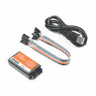
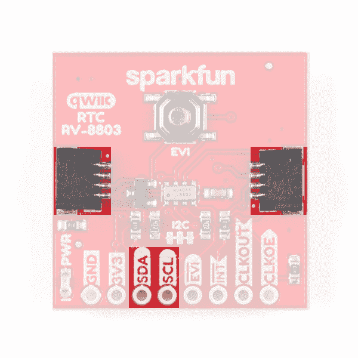
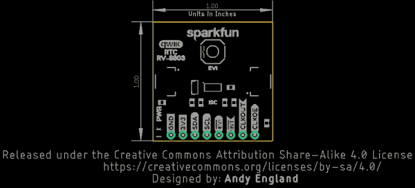

# 实时时钟模块- RV-8803 (Qwiic)连接指南

> 原文：<https://learn.sparkfun.com/tutorials/real-time-clock-module---rv-8803-qwiic-hookup-guide>

## 介绍

[实时时钟模块- RV-8803 (Qwiic)](https://www.sparkfun.com/products/16281) 是 RV-8803 RTC 模块的 Qwiic 分线板。RV-8803 拥有一些令人印象深刻的功能，包括温度补偿晶体、极其精确的计时、低功耗、时间戳事件输入以及用户可编程的定时偏移值。它甚至有一个可编程时钟输出来控制外围设备的精确时序。与 [RV-1805 RTC](https://www.sparkfun.com/products/14558) 相比，RV-8803 还具有改进的 I ² C 接口，无需对设备进行命令/写入排序。如果你没有使用我们的 [Arduino 库](https://github.com/sparkfun/SparkFun_RV-8803_Arduino_Library)来控制 RTC，这是非常有用的。

[](https://www.sparkfun.com/products/16281) 

将**添加到您的[购物车](https://www.sparkfun.com/cart)中！**

### [](https://www.sparkfun.com/products/16281)spark fun 实时时钟模块- RV-8803 (Qwiic)

[In stock](https://learn.sparkfun.com/static/bubbles/ "in stock") BOB-16281

RV-8803 包括温度补偿晶体、低功耗和改进的 I2C 接口等特性

$17.501[Favorited Favorite](# "Add to favorites") 19[Wish List](# "Add to wish list")** **[https://www.youtube.com/embed/Uq8nNv3yKtQ/?autohide=1&border=0&wmode=opaque&enablejsapi=1](https://www.youtube.com/embed/Uq8nNv3yKtQ/?autohide=1&border=0&wmode=opaque&enablejsapi=1)

在本连接指南中，我们将介绍 RV-8803 的独特功能，以及一些演示如何使用这些功能的 Arduino 示例。本教程结束时，您将配置好您的实时时钟模块 RV-8803 (Qwiic ),并为您的下一个计时项目滴答滴答(嗯，滴答，也许不滴答)!

### 所需材料

按照本指南，您需要一个微控制器来配置 RTC 模块分线点并与之通信。以下是一些开箱即用的 Qwiic 选项:

[](https://www.sparkfun.com/products/15663) 

将**添加到您的[购物车](https://www.sparkfun.com/cart)中！**

### [【spark fun Thing Plus-ESP32 WROOM(微-B)](https://www.sparkfun.com/products/15663)

[Out of stock](https://learn.sparkfun.com/static/bubbles/ "out of stock") WRL-15663

SparkFun ESP32 Thing Plus 是开始使用 Espressif 物联网概念的下一步，同时还可以享受所有的便利设施

$22.5010[Favorited Favorite](# "Add to favorites") 48[Wish List](# "Add to wish list")****[](https://www.sparkfun.com/products/15795) 

将**添加到您的[购物车](https://www.sparkfun.com/cart)中！**

### [【spark fun Qwiic Pro Micro-USB-C(atmega 32 u 4)](https://www.sparkfun.com/products/15795)

[In stock](https://learn.sparkfun.com/static/bubbles/ "in stock") DEV-15795

SparkFun Qwiic Pro Micro 在小型化的 Arduino bo 上增加了一个重置按钮、Qwiic 连接器、USB-C 和齿形垫…

$21.507[Favorited Favorite](# "Add to favorites") 46[Wish List](# "Add to wish list")****[](https://www.sparkfun.com/products/15123) 

将**添加到您的[购物车](https://www.sparkfun.com/cart)中！**

### [spark fun RedBoard Qwiic](https://www.sparkfun.com/products/15123)

[In stock](https://learn.sparkfun.com/static/bubbles/ "in stock") DEV-15123

SparkFun RedBoard Qwiic 是一款 Arduino 兼容开发板，内置 Qwiic 连接器，无需…

$21.5014[Favorited Favorite](# "Add to favorites") 49[Wish List](# "Add to wish list")****[](https://www.sparkfun.com/products/15444) 

将**添加到您的[购物车](https://www.sparkfun.com/cart)中！**

### [SparkFun RedBoard Artemis](https://www.sparkfun.com/products/15444)

[In stock](https://learn.sparkfun.com/static/bubbles/ "in stock") DEV-15444

RedBoard Artemis 采用 SparkFun 的功能强大的 Artemis 模块，并将其包装在一个易于使用和熟悉的环境中…

$21.509[Favorited Favorite](# "Add to favorites") 32[Wish List](# "Add to wish list")******** ********如果您选择的微控制器尚未启用 Qwiic，您可以添加以下一项或多项功能:

[](https://www.sparkfun.com/products/15081) 

将**添加到您的[购物车](https://www.sparkfun.com/cart)中！**

### [SparkFun Qwiic 线缆套件](https://www.sparkfun.com/products/15081)

[In stock](https://learn.sparkfun.com/static/bubbles/ "in stock") KIT-15081

为了更容易上手，我们用 50 毫米到 500 毫米的各种 Qwiic 电缆组装了 Qwiic 电缆套件…

$8.9516[Favorited Favorite](# "Add to favorites") 58[Wish List](# "Add to wish list")****[](https://www.sparkfun.com/products/14495) 

将**添加到您的[购物车](https://www.sparkfun.com/cart)中！**

### [SparkFun Qwiic 适配器](https://www.sparkfun.com/products/14495)

[In stock](https://learn.sparkfun.com/static/bubbles/ "in stock") DEV-14495

SparkFun Qwiic 适配器提供了将任何旧 I ² C 板改造成支持 Qwiic 的板的完美方法。

$1.601[Favorited Favorite](# "Add to favorites") 53[Wish List](# "Add to wish list")****[](https://www.sparkfun.com/products/14352) 

将**添加到您的[购物车](https://www.sparkfun.com/cart)中！**

### [ArduinoT3 的 SparkFun Qwiic 盾](https://www.sparkfun.com/products/14352)

[In stock](https://learn.sparkfun.com/static/bubbles/ "in stock") DEV-14352

SparkFun Qwiic Shield 是一种易于组装的板，它提供了一种简单的方法来将 Qwiic Connect 系统与

$7.508[Favorited Favorite](# "Add to favorites") 39[Wish List](# "Add to wish list")****[](https://www.sparkfun.com/products/retired/16130) 

### [Arduino Nano的 SparkFun Qwiic 盾](https://www.sparkfun.com/products/retired/16130)

[Retired](https://learn.sparkfun.com/static/bubbles/ "Retired") DEV-16130

用于 Arduino Nano 的 SparkFun Qwiic Shield 使您可以将 SparkFun 的 Qwiic connect 生态系统与开发板一起使用…

**Retired**[Favorited Favorite](# "Add to favorites") 2[Wish List](# "Add to wish list")****** ******您还需要至少一根 Qwiic 电缆来连接 RTC 和微控制器。

[](https://www.sparkfun.com/products/14427) 

将**添加到您的[购物车](https://www.sparkfun.com/cart)中！**

### [Qwiic 线缆- 100mm](https://www.sparkfun.com/products/14427)

[In stock](https://learn.sparkfun.com/static/bubbles/ "in stock") PRT-14427

这是一条 100 毫米长的 4 芯电缆，带有 1 毫米 JST 端接。它旨在将支持 Qwiic 的组件连接在一起…

$1.50[Favorited Favorite](# "Add to favorites") 32[Wish List](# "Add to wish list")****[](https://www.sparkfun.com/products/14429) 

将**添加到您的[购物车](https://www.sparkfun.com/cart)中！**

### [Qwiic 线缆- 500mm](https://www.sparkfun.com/products/14429)

[In stock](https://learn.sparkfun.com/static/bubbles/ "in stock") PRT-14429

这是一根 500mm 长的 4 芯电缆，带有 1mm JST 端接。它旨在将支持 Qwiic 的组件连接在一起…

$1.951[Favorited Favorite](# "Add to favorites") 25[Wish List](# "Add to wish list")****[](https://www.sparkfun.com/products/14426) 

将**添加到您的[购物车](https://www.sparkfun.com/cart)中！**

### [Qwiic 线缆- 50mm](https://www.sparkfun.com/products/14426)

[In stock](https://learn.sparkfun.com/static/bubbles/ "in stock") PRT-14426

这是一根 50 毫米长的 4 芯电缆，带有 1 毫米 JST 端接。它旨在将支持 Qwiic 的组件连接在一起…

$0.95[Favorited Favorite](# "Add to favorites") 29[Wish List](# "Add to wish list")****[](https://www.sparkfun.com/products/14428) 

### [Qwiic 线缆- 200mm](https://www.sparkfun.com/products/14428)

[Out of stock](https://learn.sparkfun.com/static/bubbles/ "out of stock") PRT-14428

这是一根 200 毫米长的 4 芯电缆，带有 1 毫米 JST 端接。它旨在将支持 Qwiic 的组件连接在一起…

[Favorited Favorite](# "Add to favorites") 21[Wish List](# "Add to wish list")****** ******一些示例演示了如何使用 I ² C 引脚以外的引脚。如果你想跟随他们，你需要焊接到电路板上的 EVI、INT、CLKOUT 和 CLKOE 引脚。如果你需要，点击下面的按钮查看一些推荐的焊接工具和材料。

[](https://www.sparkfun.com/products/14681) 

将**添加到您的[购物车](https://www.sparkfun.com/cart)中！**

### [SparkFun 初学者工具包](https://www.sparkfun.com/products/14681)

[Out of stock](https://learn.sparkfun.com/static/bubbles/ "out of stock") TOL-14681

这些工具非常适合那些需要一套坚实的工具来启动工作台的人！

$62.50[Favorited Favorite](# "Add to favorites") 14[Wish List](# "Add to wish list")****[](https://www.sparkfun.com/products/14456) 

将**添加到您的[购物车](https://www.sparkfun.com/cart)中！**

### [【烙铁- 60W(可调温度)](https://www.sparkfun.com/products/14456)

[In stock](https://learn.sparkfun.com/static/bubbles/ "in stock") TOL-14456

当你不想倾家荡产，但又需要一个可靠的烙铁时，这个可调节温度的烙铁是一个很好的工具…

$16.5016[Favorited Favorite](# "Add to favorites") 43[Wish List](# "Add to wish list")****[](https://www.sparkfun.com/products/9163) 

将**添加到您的[购物车](https://www.sparkfun.com/cart)中！**

### [无铅焊料- 15 克管](https://www.sparkfun.com/products/9163)

[In stock](https://learn.sparkfun.com/static/bubbles/ "in stock") TOL-09163

这是你的无铅焊料的基本管，带有不干净的水溶性树脂芯。0.031 英寸规格，15 克

$3.954[Favorited Favorite](# "Add to favorites") 14[Wish List](# "Add to wish list")****[](https://www.sparkfun.com/products/9507) 

将**添加到您的[购物车](https://www.sparkfun.com/cart)中！**

### [烙铁- 30W(美国，110V)](https://www.sparkfun.com/products/9507)

[33 available](https://learn.sparkfun.com/static/bubbles/ "33 available") TOL-09507

这是一个非常简单的固定温度，快速加热，30W 110/120 VAC 烙铁。我们真的很喜欢使用更贵的 iro…

$10.957[Favorited Favorite](# "Add to favorites") 21[Wish List](# "Add to wish list")******** ********最后，如果你想微调 RV-8803 的振荡器以获得极其精确的时间保持，你需要使用示波器或逻辑分析仪来校准它。如果需要，单击下面的按钮查看示波器和逻辑分析仪的一些选项。

[](https://www.sparkfun.com/products/13929) 

将**添加到您的[购物车](https://www.sparkfun.com/cart)中！**

### [数字模拟发现 2](https://www.sparkfun.com/products/13929)

[Only 2 left!](https://learn.sparkfun.com/static/bubbles/ "only 2 left!") TOL-13929

Digilent Analog Discovery 2 是一款 USB 示波器和多功能仪器，允许用户测量、控制和分析

$426.9514[Favorited Favorite](# "Add to favorites") 54[Wish List](# "Add to wish list")****[](https://www.sparkfun.com/products/13196) 

将**添加到您的[购物车](https://www.sparkfun.com/cart)中！**

### [Logic Pro 8 - USB 逻辑分析仪](https://www.sparkfun.com/products/13196)

[20 available](https://learn.sparkfun.com/static/bubbles/ "20 available") TOL-13196

需要小包装的大逻辑分析吗？这正是 Logic Pro 8 带给你的。Logic Pro 8 是一款 8-cha…

$999.952[Favorited Favorite](# "Add to favorites") 12[Wish List](# "Add to wish list")****[](https://www.sparkfun.com/products/retired/11702) 

### [DSO Nano V3 -袖珍数字示波器](https://www.sparkfun.com/products/retired/11702)

[Retired](https://learn.sparkfun.com/static/bubbles/ "Retired") TOL-11702

示波器是商店里一个很棒的工具。不幸的是，大多数观测仪占据了相当多的工作台空间，而且…

1 **Retired**[Favorited Favorite](# "Add to favorites") 49[Wish List](# "Add to wish list")[](https://www.sparkfun.com/products/retired/15033) 

### [USB 逻辑分析仪- 24MHz/8 通道](https://www.sparkfun.com/products/retired/15033)

[Retired](https://learn.sparkfun.com/static/bubbles/ "Retired") TOL-15033

这款 8 通道 USB 逻辑分析仪支持高达 24MHz 的采样速率，是经济实惠的选择

16 **Retired**[Favorited Favorite](# "Add to favorites") 27[Wish List](# "Add to wish list")**** ****### 推荐阅读

如果您不熟悉 Qwiic 系统，我们建议您阅读此处的概述:

| [](https://www.sparkfun.com/qwiic) |
| [*Qwiic 连接系统*](https://www.sparkfun.com/qwiic) |

如果您打算使用 Qwiic 屏蔽罩，我们还建议您看一下上面列出的 qw IIC 屏蔽罩的连接指南。也建议你温习一下 I ² C 的技能，因为所有的 Qwiic 传感器都通过 I ² C 进行通信

[](https://learn.sparkfun.com/tutorials/i2c) [### I2C](https://learn.sparkfun.com/tutorials/i2c) An introduction to I2C, one of the main embedded communications protocols in use today.[Favorited Favorite](# "Add to favorites") 128[](https://learn.sparkfun.com/tutorials/qwiic-shield-for-arduino--photon-hookup-guide) [### Arduino 和光子连接指南的 Qwiic 屏蔽](https://learn.sparkfun.com/tutorials/qwiic-shield-for-arduino--photon-hookup-guide) Get started with our Qwiic ecosystem with the Qwiic shield for Arduino or Photon.[Favorited Favorite](# "Add to favorites") 5[](https://learn.sparkfun.com/tutorials/sparkfun-qwiic-shield-for-arduino-nano-hookup-guide) [### Arduino Nano 连接指南的 SparkFun Qwiic 盾](https://learn.sparkfun.com/tutorials/sparkfun-qwiic-shield-for-arduino-nano-hookup-guide) Hookup Guide for the SparkFun Qwiic Shield for Arduino Nano.[Favorited Favorite](# "Add to favorites") 1[](https://learn.sparkfun.com/tutorials/sparkfun-qwiic-shield-for-thing-plus-hookup-guide) [### spark fun Qwiic Shield for things Plus 连接指南](https://learn.sparkfun.com/tutorials/sparkfun-qwiic-shield-for-thing-plus-hookup-guide) A short guide for assembling and using the SparkFun Qwiic Shield for Thing Plus.[Favorited Favorite](# "Add to favorites") 0

## 硬件概述

此次突破的核心是来自 Micro Crystal 的 RV-8803 实时时钟模块。在本节中，我们将介绍 RV-8803 的大部分特性和特征，但如果您想更全面地了解 RV-8803，请浏览一下[应用手册](https://cdn.sparkfun.com/assets/1/2/4/2/3/RV-8803-C7_App-Manual.pdf)。下表列出了 RV-8803 的一些运行特性。

| **特性** | **值** |
| 工作电压范围 | **1.5V - 5.5V** |
| 时间精度(温度。补偿-40 至+85°C) | +/-3 ppm |
| 时间精度(温度。补偿+85 至+105°C) | +/-7 ppm |
| 电流消耗 | **240 上的**上的(类型。)是**350 是**的意思 |
| I ² C 地址 | 0x64 |

### 力量

有两种主要方式为 SparkFun 实时时钟模块 RV-8803 (Qwiic)供电。最好也是最简单的方法是通过电路板两侧的 Qwiic 连接器。当与任何支持 qw IC 的板或 qw IC 屏蔽板一起使用时，该电压将为 **3.3V** 。另一个电源输入是断开的 **3.3V** 引脚。该板还包括一个位于背面 12 毫米纽扣电池座中的 **3V 47mAh** 电池，用于备用电源。

[](https://cdn.sparkfun.com/assets/learn_tutorials/1/1/1/1/Qwiic_RTC-RV8803_Power.jpg)**Heads up!** While the RV-8803 can accept an input voltage between **1.5-5.5V**, the Qwiic system operates at **3.3V** so it is recommended to power the RTC with **3.3V** or lower, *especially* if you are using it with other Qwiic devices.

### Qwiic 和 I ² C 接口

使用实时时钟模块 RV-8803 (Qwiic)的最简单方法是使用 Qwiic 连接系统。只需使用 [Qwiic 电缆](https://www.sparkfun.com/products/14427)将电路板连接到您的微控制器，开始与它对话。或者，你可以焊接到电路板上断开的 I ² C 引脚。7 位 I ² C 未移位地址为 **0x32** (0110010b)。这是一个硬件设置地址，RV-8803 没有备用外设地址。如果您需要在一条 I ² C 总线上安装多个 RTC，您将需要使用一个多路复用器或 mux，如 [Qwiic Mux Breakout - 8 通道](https://www.sparkfun.com/products/14685)。

[](https://cdn.sparkfun.com/assets/learn_tutorials/1/1/1/1/Qwiic_RTC-RV8803_I2C.jpg)

### 引脚描述

虽然 Qwiic 接口是开始使用 RTC 最简单快捷的方式，但还有其他几个引脚提供额外的功能。你需要焊接到这些引脚上来使用它们，或者你可以使用类似这些 [IC 挂钩](https://www.sparkfun.com/products/9741)的东西来创建一个临时连接。下表列出了 RTC 上的所有引脚，并总结了它们的功能。

| **引脚标签** | **引脚功能** | **输入/输出** | **功能说明** |
| GND | 地面 | 投入 | **0V**/公共电压 |
| 3.3V | 电源 | 投入 | 电源电压范围为 **1.5-3.3V** |
| 国家药品监督管理局 | I ² C 数据信号 | 双向的 | 双向数据线。电压不应超过电源电压(如 **3.3V** )。 |
| SCL | I ² C 时钟信号 | 投入 | 时钟信号。电压不应超过电源电压(如 **3.3V** )。 |
| EVI | 事件输入 | 输入/输出 | 具有时间戳功能的外部事件中断引脚。默认为低电平有效。绑在标有 EVI 的按钮上，方便使用。 |
| （同 Internationalorganizations）国际组织 | 中断输出 | 输出 | 开漏，低电平有效。用于输出报警、周期性倒计时定时器、周期性时间更新和外部事件中断信号。用 **100k** 电阻拉至 **3.3V** 。 |
| CLKOUT | 时钟输出 | 输出 | 外围设备的可编程方波输出。可用频率为 32.768 kHz(默认)、1024 Hz 或 1Hz。上电时置 1，由 CLKOE 引脚的状态控制。禁用时，引脚为高阻态。 |
| CLKOE | 时钟输出使能 | 投入 | 使能和禁用 CLKOUT 引脚。如果为高电平，CLKOUT 使能并处于输出模式。如果为低电平，CLKOUT 禁用。通过一个 **100k** 电阻，引脚默认拉至 **GND** 。 |

[](https://cdn.sparkfun.com/assets/learn_tutorials/1/1/1/1/Qwiic_RTC-RV8803_Pinout.jpg)*The EVI pin is broken out but also connected to the button highlighted to easily trigger interrupt events like time stamps.*

### 针织套衫

SparkFun 实时时钟模块 RV-8803 (Qwiic)上有两个跳线，标记为“I ² C”和“led”。默认情况下，I ² C 跳线是闭合的，可以通过切断三个焊盘之间的走线来断开两个 **4.7k 欧姆**电阻器与 SDA 和 SCL 线的连接，从而将其打开。如果同一总线上有许多 I ² C 器件，或者为了降低低功率项目的电流消耗，请断开此跳线。LED 跳线默认关闭，并启用板载电源 LED。要打开它，只需切断两个跳线焊盘之间的走线，断开电源 LED(对于低功率应用特别有用)。**注意:**电源 LED 连接到 **3.3V** 输入，不由备用电池供电。

| [](https://cdn.sparkfun.com/assets/learn_tutorials/1/1/1/1/Qwiic_RTC-RV8803_I2CJumper.jpg) | [](https://cdn.sparkfun.com/assets/learn_tutorials/1/1/1/1/Qwiic_RTC-RV8803_LEDJumper.jpg) |
| *I ² C 跳线高亮显示* | *LED 跳线高亮显示* |

Never worked with solder jumpers before or need some tips? Take a look at our [How to Work with Jumper Pads and PCB Traces Tutorial](https://learn.sparkfun.com/tutorials/how-to-work-with-jumper-pads-and-pcb-traces).

## 电路板尺寸

SparkFun 实时时钟模块- RV-8803 (Qwiic)是按照 Qwiic 分线点的标准 1 x 1 "尺寸制造的。你可能会注意到的一件事是，这种板缺乏安装孔。为了符合 Qwiic 分线点的 1 x 1 "标准，没有安装孔的空间，因为电池座占用了通常为这些安装孔保留的空间。

[](https://cdn.sparkfun.com/assets/learn_tutorials/1/1/1/1/Qwiic_RTC_RV-8803_Dimensions.png)

## 硬件装配

使用 Qwiic 系统，组装硬件很简单。您只需用 Qwiic 电缆或[适配器电缆](https://www.sparkfun.com/products/14425)将实时时钟模块 RV-8803 (Qwiic)连接到您选择的开发板。否则，如果您的开发板上没有 Qwiic 连接器，您可以使用 I ² C 引脚。如果您没有使用支持 Qwiic 的板，请确保您的输入电压和逻辑运行在 **3.3V** 或者您在相同的[逻辑电平](https://learn.sparkfun.com/tutorials/logic-levels)下运行控制器和 RTC。

[](https://cdn.sparkfun.com/assets/learn_tutorials/1/1/1/1/16281-SparkFun_Real_Time_Clock_Module_-_RV-8803__Qwiic_-05.jpg)

为了使用 RV-8803 的全部功能，您需要焊接到该板上的 EVI、INT、CLKOUT 和 CLKOE 引脚。如果你不熟悉通孔焊接，看看这个教程:

[](https://learn.sparkfun.com/tutorials/how-to-solder-through-hole-soldering) [### 如何焊接:通孔焊接

#### 2013 年 9 月 19 日](https://learn.sparkfun.com/tutorials/how-to-solder-through-hole-soldering) This tutorial covers everything you need to know about through-hole soldering.[Favorited Favorite](# "Add to favorites") 70

一切都连接好了，我们准备好上传草图，并开始记录时间！

## RV-8803 Arduino 图书馆

**Note:** This tutorial assumes you are familiar with Arduino products and you are using the latest stable version of the Arduino IDE on your desktop. If this is your first time using the Arduino IDE, please review our tutorial on [installing the Arduino IDE.](https://learn.sparkfun.com/tutorials/installing-arduino-ide) If you have not previously installed an Arduino library, please check out our [installation guide.](https://learn.sparkfun.com/tutorials/installing-an-arduino-library)

安装库最简单的方法是在 Arduino 库管理器工具中搜索 **SparkFun RV-8803** 。你也可以从 [GitHub 库](https://github.com/sparkfun/SparkFun_RV-8803_Arduino_Library)手动安装 RV-8803 库，或者点击下面的按钮下载。

[Download the SparkFun RV-8803 Library (ZIP)](https://github.com/sparkfun/SparkFun_RV-8803_Arduino_Library/archive/main.zip)

### 库函数

下面的列表概述了该库的所有功能，并简要描述了它们的作用。这些示例涵盖了大多数函数，因此我们建议先浏览这些函数。

#### 设备设置和设置

*   `bool begin(TwoWire &wireport);` -初始化 I ² C 总线上的 RV-8803。
*   `void set12Hour();` -配置微控制器转换到 12 小时模式。
*   `void set24Hour();` -配置微控制器不从默认 24 小时模式转换。
*   `bool is12Hour();` -如果微控制器配置为 12 小时模式，则返回 true。
*   `bool isPM();` -如果微控制器处于 12 小时模式，且 RTC 的小时值大于或等于 12(中午)，则返回 true。
*   `char* stringDateUSA();` -以**月/日/年**格式返回日期。
*   `char* stringDate();` -以**日/月/年**格式返回日期。
*   `char* stringTime();` -返回以**时:分:秒**表示的时间(如果处于 12 小时模式，则添加 AM/PM)。
*   `char* stringTimeStamp();` -返回 EVI 引脚上捕获的最新时间戳(如果 EVI 引脚已配置为捕获事件)。格式为 **hh:mm:ss:HHXM** ，带\0 终止符，其中“X”是“A”或“P ”,具体取决于一天中的时间。
*   `char* stringTime8601();` -返回 ISO 8601 格式的时间戳( **yyyy-mm-ddThh:mm:ss** )。
*   `bool setTime(uint8_t sec, uint8_t min, uint8_t hour, uint8_t date, uint8_t month, uint8_t year, uint8_t day);` -使用一组独立变量设置 RTC 的时间寄存器。
*   `bool setTime(uint8_t * time, uint8_t len);` -使用具有以下结构的数组设置 RTC 的时间寄存器；`{HUNDREDTHS, SECONDS, MINUTES, HOURS, WEEKDAY, DATE, MONTH, YEAR}`
*   `bool setHundredthsToZero();` -百分之一寄存器为只读**，因此该功能使用 RV8803 上的复位位功能将该寄存器设置为零，而不是写入该寄存器。查看 [RV-8803 应用手册](https://cdn.sparkfun.com/assets/1/2/4/2/3/RV-8803-C7_App-Manual.pdf)的第 4.13 节，了解关于该功能的更多信息。**
***   `bool setSeconds(uint8_t value);` -将**秒**寄存器设置为`value`。*   `bool setMinutes(uint8_t value);` -将**分钟**寄存器设置为`value`。*   `bool setHours(uint8_t value);` -将**小时**寄存器设置为`value`。*   `bool setDate(uint8_t value);` -将**日期**寄存器设置为`value`。*   `bool setMonth(uint8_t value);` -将**月份**寄存器设置为`value`。*   `bool setYear(uint16_t value);` -将**年**寄存器设置为`value`。*   `bool setWeekday(uint8_t value);` -将**工作日**寄存器设置为`value`。*   `bool setToCompilerTime();` -将 RTC 设置为上次构建的时间，并将其用作当前时间。*   `bool setCalibrationOffset(float ppm);` -将校准的 PPM 偏移载入 RV8803_OFFSET 寄存器。*   `float getCalibrationOffset();` -返回 RV8803_OFFSET 寄存器中存储的校准偏移值。**

#### 从 RTC 读取

*   `bool updateTime();` -移动时间寄存器(小时、分钟、秒等)。)从 RV-8803 到微控制器上的`_time`阵列。需要在印刷时间或日期之前调用**。**
*   `uint8_t getHundredths();` -从**百分之一**寄存器返回`_time`值。
*   `uint8_t getSeconds();` -从**秒**寄存器返回`_time`值。
*   `uint8_t getMinutes();` -从**分钟**寄存器返回`_time`值。
*   `uint8_t getHours();` -从**小时**寄存器返回`_time`值。
*   `uint8_t getDate();` -从**日期**寄存器返回`_time`值。
*   `uint8_t getWeekday();` -从**工作日**寄存器返回`_time`值。
*   `uint8_t getMonth();` -从**月**寄存器返回`_time`值。
*   `uint16_t getYear();` -从**年**寄存器返回`_time`值。
*   `uint8_t getHundredthsCapture();` -返回从**百分之一**寄存器中捕获的值(时间戳)。
*   `uint8_t getSecondsCapture();` -返回从**秒**寄存器(时间戳)捕获的值。

#### 报警和中断功能

由于 RV-8803 有三种类型的报警/中断，这个列表相当广泛，所以我们把它分成单独的报警和中断功能。

##### 外部事件中断

*   `bool setEVICalibration(bool eviCalibration);` -启用或禁用外部事件中断( **EVI** )按钮和引脚。
*   `bool setEVIDebounceTime(uint8_t debounceTime);` -设置 EVI 针和按钮的去抖时间。可设置为**无**、 **256 赫兹**、 **64 赫兹**或 **8 赫兹**。
*   `bool setEVIEdgeDetection(bool edge);` -设置 EVI 在信号的*上升*或*下降*边沿触发。
*   `bool setEVIEventCapture(bool capture);` -启用或禁用 EVI 事件捕捉功能。
*   `uint8_t getEVIDebounceTime();` -返回 EVI 去抖时间的设定值。
*   `bool getEVICalibration();` -返回 EVI 功能是启用还是禁用。
*   `bool getEVIEdgeDetection();` -返回 EVI 功能是否设置为*上升*或*下降*边缘。
*   `bool getEVIEventCapture();` -返回 EVI 事件捕获功能是启用还是禁用。

##### 倒计时中断

*   `bool setCountdownTimerEnable(bool timerState);` -启用或禁用定期倒计时定时器中断功能。
*   `bool setCountdownTimerFrequency(uint8_t countdownTimerFrequency);` -设置定期倒计时定时器的时间。内置值有 **4096 赫兹**、 **60 赫兹**、 **1 赫兹**和 **1/60 赫兹**。
*   `bool setCountdownTimerClockTicks(uint16_t clockTicks);` -设置倒计时定时器计数的时钟滴答数。请参考本指南下一节中的示例 4B -倒计时中断概述，了解有关计算定时器时钟滴答数的更多信息。
*   `bool getCountdownTimerEnable();` -返回倒计时定时器是启用还是禁用。
*   `uint8_t getCountdownTimerFrequency();` -返回倒计时定时器设定的频率。
*   `uint16_t getCountdownTimerClockTicks();` -返回为倒计时定时器设置的时钟滴答数。

##### 周期性中断

*   `bool setPeriodicTimeUpdateFrequency(bool timeUpdateFrequency);` -设置周期性时间更新中断功能的频率。可以是 **1 赫兹(一秒)**或 **1/60 赫兹(一分)**。
*   `bool getPeriodicTimeUpdateFrequency();` -返回定期时间更新中断频率的时间设置。

##### 报警中断

*   `void setItemsToMatchForAlarm(bool minuteAlarm, bool hourAlarm, bool dateAlarm, bool weekdayOrDate);` -选择触发警报所需的时间值的功能。可以设置为分钟，小时，日期或工作日+日期。将该位设置为 1 意味着 RTC 将**而不是**寻找匹配报警的项目。
*   `bool setAlarmMinute(uint8_t minute);` -设置 RTC 的**分钟**值，以匹配触发警报。
*   `bool setAlarmHour(uint8_t hour);` -设置 RTC 的**小时**值，以匹配触发警报。
*   `bool setAlarmWeekday(uint8_t weekday);` -设置 RTC 的**工作日**值，以匹配触发警报。
*   `bool setAlarmDate(uint8_t date);` -设置 RTC 的**日期**值，以匹配触发警报。
*   `uint8_t getAlarmMinute();` -返回为 RTC 设置的**分钟**值，以匹配报警。
*   `uint8_t getAlarmHour();` -返回为 RTC 设置的**小时**值，以匹配报警。
*   `uint8_t getAlarmWeekday();` -返回为 RTC 设置的**工作日**值，以匹配报警。
*   `uint8_t getAlarmDate();` -返回为 RTC 设置的**日期**值，以匹配报警。

#### 配置时钟输出(`CLKOUT`)引脚

这两个功能用于使能和配置时钟输出引脚。使用`setCalibrationOffset();`和`getCalibrationOffset();`功能微调 RTC。有关更多信息，请参考本指南下一节中的示例 6 -微调。

*   `bool setClockOutTimerFrequency(uint8_t clockOutTimerFrequency);` -设置时钟输出引脚输出的方波频率。可用频率有 **1Hz** 、 **1024Hz** 和**32768Hz**。
*   `uint8_t getClockOutTimerFrequency();` -返回为时钟输出设置的频率。

#### 额外功能

*   `uint8_t BCDtoDEC(uint8_t val);` -将 RTC 中的值从二进制编码的十进制转换为十进制。
*   `uint8_t DECtoBCD(uint8_t val);` -将 RTC 中的数值从十进制转换为二进制编码的十进制。
*   `bool readBit(uint8_t regAddr, uint8_t bitAddr);` -从所选寄存器中读取一位。
*   `uint8_t readTwoBits(uint8_t regAddr, uint8_t bitAddr);` -从所选寄存器中读取两位。
*   `bool writeBit(uint8_t regAddr, uint8_t bitAddr, bool bitToWrite);` -将选定的位写入寄存器。
*   `bool writeBit(uint8_t regAddr, uint8_t bitAddr, uint8_t bitToWrite);` -将选定的位写入寄存器。
*   `uint8_t readRegister(uint8_t addr);` -读取特定寄存器。
*   `bool writeRegister(uint8_t addr, uint8_t val);` -写一个特定的寄存器。
*   `bool readMultipleRegisters( uint8_t addr, uint8_t * dest, uint8_t len);` -读取多个连续寄存器。
*   `bool writeMultipleRegisters(uint8_t addr, uint8_t * values, uint8_t len);` -写入多个连续寄存器。

接下来，我们将查看 RV-8803 Arduino 库包含的示例。

## Arduino 示例

### 示例 1 -设置时间

这个例子演示了如何将 RV-8803 RTC 上的时间设置为编译器时间或自定义时间。只要 RTC 有电，这对于设置 RTC 的内部时钟以保持时间是必要的。首先，代码初始化 I ² C 总线上的 RV-8803，并验证微控制器可以与之对话。接下来，它设置内部时钟。请注意下面的代码，将 RTC 时间设置为编译器时间或自定义时间:

设置自定义时间时，在草图开始时更改这些值:

```
language:c
//The below variables control what the date and time will be set to
int sec = 2;
int minute = 47;
int hour = 14; //Set things in 24 hour mode
int date = 2;
int month = 3;
int year = 2020;
int weekday = 2; 
```

在设置中，这段代码选择编译器时间或自定义时间:

```
language:c
if (rtc.setToCompilerTime() == false) {
Serial.println("Something went wrong setting the time");
}

//Uncomment the below code to set the RTC to your own time
/*if (rtc.setTime(sec, minute, hour, weekday, date, month, year) == false) {
Serial.println("Something went wrong setting the time");
}*/ 
```

如果这里一切正常，RTC 的内部时钟将被设置为编译器时间，或者使用草图中前面定义的变量设置为您的自定义时间。打开 Arduino 串行监视器，将波特率设置为 **115200** ，无论成功与否，代码都会通过串行打印出来。如果你从未使用过 Arduino 串行监视器或其他串行终端程序，请查看我们的[串行终端基础知识](https://learn.sparkfun.com/tutorials/terminal-basics)教程。您可以通过运行第二个示例来检查这里设置的时间的准确性。

**Note:** The compiler time is not set every time the code compiles. In order to ensure the proper time is loaded, re-open the IDE and then upload the code. Also note that due to upload times, the compiler time may be off by several seconds/hundredths of seconds. The Set Hundredths examples below can help with more accurate time-keeping.

### 示例 2 -打印时间

此示例显示了如何在设置时间后向 RTC 请求时间。代码首先初始化 I ² C 总线上的 RV-8803，然后尝试使用`updateTime();`函数将 RV-8803 的时间寄存器中的值移动到微控制器的`_time`阵列中。如果检索成功，代码打印时间数据(日期、小时、分钟等。)over serial。打开串行监视器，将波特率设置为 **115200** ，看着时间飞逝！

代码默认以美国格式(mm/dd/yyyy)打印日期，因此如果您想将其转换为更常用的 dd/mm/yyyy 格式，请调整代码的这一部分:

```
language:c
String currentDate = rtc.stringDateUSA(); //Get the current date in mm/dd/yyyy format
//String currentDate = rtc.stringDate()); //Get the current date in dd/mm/yyyy format 
```

**Note:** If you are modifying or writing your own code remember the `updateTime();` function must be called *before* attempting to read the time from the RV-8803.

### 示例 3 -设置百分位数

我们将这个例子分成两个“子例子”来演示复位百分之一寄存器的方法。百分之一寄存器**是只读的**，所以我们不能像其他时间变量(秒、分钟等)那样写入它。).相反，我们通过写入 RV-8803 上的复位位来“设置”该寄存器。该功能在 [RV-8803 应用笔记](https://cdn.sparkfun.com/assets/1/2/4/2/3/RV-8803-C7_App-Manual.pdf)的第 4.13 节中有更详细的介绍。

#### 示例 3A -设置百分之一(软件)

本例初始化 RV-8803，然后配置 RTC，在微控制器的串行提示下复位百分位寄存器。上传代码后，打开串行监视器(和前面的例子一样，波特率设置为 **115200** )并发送一个“r”。您的微控制器将写入 RV-8803 上的复位位，以将百分之一寄存器“设置”为`00`。如果您想再次重置百分之一寄存器，只需通过您的串行监视器发送另一个“r”。

#### 示例 3B 集百分之一(硬件)

该示例与上述软件示例几乎相同，但也支持使用 RV-8803 的 EVI 引脚复位百分之一寄存器，以及通过串行命令复位。EVI 引脚可以通过板上按钮切换，也可以通过微控制器(或其他外部控制机制)上的 GPIO 引脚控制 EVI 引脚。使用 EVI 引脚复位百分之一寄存器是通过这行代码实现的:

```
language:c
rtc.setEVICalibration(ENABLE); 
```

当 RV-8803 在 EVI 引脚上看到低电平事件时，使能该位会告知 RV-8803 复位百分之一寄存器。该事件可以通过按下按钮或拉低 EVI 引脚来触发。该代码将打印 RV-8803 准备好按钮按下或 EVI 引脚上的其他事件。当该引脚被触发时，它通过串行接口打印出从 RV-8803 的时间寄存器中提取的百分位值。如果您想验证寄存器是否已设置，打开串行监视器并切换 EVI 引脚，代码应该会打印出来:`Hundredths set to: 00`。

该代码还将复位位切换回 0，以便在您想要将百分之一寄存器再次设置回`00`时，为另一个事件做好准备。

### 示例 4 -中断

由于 RV-8803 有几种类型的中断，我们也将中断示例分成子示例。每个人都将启用和配置不同的中断，并演示如何使用它。要将这些示例集成到您的项目中，只需将 INT 引脚连接到您的微控制器上的 GPIO，该 GPIO 可用于[外部中断](https://www.arduino.cc/reference/en/language/functions/external-interrupts/attachinterrupt/)，以在这些警报或定时器被触发时触发您想要的任何行为。如果你以前从未处理过处理器中断，我们有一个教程介绍如何在 Arduino [这里](https://learn.sparkfun.com/tutorials/processor-interrupts-with-arduino)处理它们。

#### 4A 警报中断示例

本例配置了报警中断功能。代码首先定义了 RV-8803 将寻找匹配以触发报警中断的变量，并选择 RTC 将寻找匹配以触发报警的变量。要将其设置为不同的时间，只需编辑这些值:

```
language:c
uint8_t minuteAlarmValue = 55; //0-60
uint8_t hourAlarmValue = 0; //0-24
uint8_t weekdayAlarmValue = 0; //0-6
uint8_t dateAlarmValue = 0; //1-31

#define MINUTE_ALARM_ENABLE true
#define HOUR_ALARM_ENABLE false
#define WEEKDAY_ALARM_ENABLE false
#define DATE_ALARM_ENABLE false 
```

将各种报警使能变量(如`MINUTE_ALARM_ENABLE`)设置为`true`将配置 RV-8803 检查匹配该变量以触发报警，如预期的那样，将其设置为`false`可防止 RV-8803 匹配报警中断的变量。当分钟值达到 55 时，该示例默认每小时触发一次警报。

定义和启用/禁用变量后，代码初始化 RV-8803，将其配置为触发警报，并调用每个时间变量的值(分钟、小时等)。).主循环使用“getInterruptFlag”函数检查报警中断标志(FLAG_ALARM)是否已被触发，如果报警被触发，则驱动 INT 引脚为低电平，并通过串行打印报警已被触发。

最后，它清除报警标志，为下一个报警触发复位 RTC。如果要清除报警触发器上的整个标志寄存器，请取消对该行的注释:

```
language:c
//rtc.clearAllInterruptFlags(); 
```

#### 示例 4B -倒计时中断

本例演示了如何基于倒计时定时器配置周期信号中断，并解释了如何计算倒计时定时器的正确值。倒计时定时器值需要一些数学运算来计算我们想要计数多少时钟滴答声(0-4095)以及这些滴答声的长度(4096 Hz、64 Hz、1 Hz、1/60 Hz ),以便指定倒计时定时器的周期。单击下面的按钮查看表格，了解如何计算倒计时时间间隔的更多信息:

| **倒计时定时器频率** | **时间范围** | **每 LSB(最低有效位)的时间** | **频率指令** |
| 4096 赫兹 | 244.14 秒- 0.9998 秒 | 每 LSB 244.14S | 倒计时 _ 计时器 _ 频率 _ 4096 _ 赫兹 |
| 64 赫兹 | 15.625 毫秒- 63.984 秒 | 每 15.625 mS | 倒计时 _ 计时器 _ 频率 _64 赫兹 |
| 1 赫兹 | 1 秒- 4095 秒
(68 分 16 秒) | 每 LSB 秒 | 倒数计时频率 1 赫兹 |
| 1/60 赫兹 | 1 分钟- 4095 分钟
(68 小时 16 分钟) | 每 LSB 分钟 | 倒计时 _ 定时器 _ 频率 _ 1/60 _ 赫兹 |

初始化 RV-8803 后，该示例配置了一个约 3.5 秒的中断。为此，我们首先选择 60 Hz 作为定时器频率，因为我们希望定时器长于 1 秒，但仍希望时间范围(或分辨率)足够小，以便轻松地将中断设置为 3.5 秒触发，而不是 3 或 4 秒。接下来，我们将 3.5 秒转换为 3500 mS，因为 60 Hz 时的分辨率为 15.625mS/LSB。最后，为了计算出 3.5 秒的时间间隔需要多少个滴答，我们用我们想要的时间除以时钟频率的分辨率:`3500 / 15.625 = 224 Clock Ticks`。计算完所有内容后，我们配置倒计时定时器中断的代码如下所示:

```
language:c
rtc.disableAllInterrupts();
rtc.setCountdownTimerFrequency(COUNTDOWN_TIMER_FREQUENCY_64_HZ);
rtc.setCountdownTimerClockTicks(224);
rtc.enableHardwareInterrupt(TIMER_INTERRUPT);
rtc.setCountdownTimerEnable(ENABLE); 

lastInterruptTime = millis(); //Change millis() to micros() if you end up using the 4096 Hz counter 
```

该循环检查倒计时中断标志(FLAG_TIMER)是否已使用`getInterruptFlag`功能更新。如果有，它清除该标志并打印串行中断之间的时间(以毫秒为单位)。

**Note:** If you select the 4096 Hz counter, make sure to switch all calls to the [millis function](https://www.arduino.cc/reference/en/language/functions/time/millis/) to call the [micros function](https://www.arduino.cc/reference/en/language/functions/time/micros/) instead.

#### 示例 4C -周期性中断

最后一个中断示例演示了如何从 RV-8803 产生周期脉冲。这与前面的例子非常相似，但我们没有设置中断之间的自定义时间，而是使用`setPeriodicTimeUpdateFrequency();`功能将 RV-8803 配置为每秒或每分钟向中断引脚发送脉冲。代码默认为 1 秒钟，但您可以通过编辑此行将其更改为 1 分钟:

```
language:c
rtc.setPeriodicTimeUpdateFrequency(TIME_UPDATE_1_SECOND); //Can also use TIME_UPDATE_1_MINUTE 
```

该循环检查周期中断标志(FLAG_UPDATE)是否已使用`getInterruptFlag`功能更新。如果有，它清除该标志并打印串行中断之间的时间(以毫秒为单位)。

### 示例 5 -时间戳

本例演示了如何通过按下 RTC 上的按钮或从微控制器生成的事件切换 EVI 引脚来获取 EVI 引脚上生成的事件的时间戳。首先，就像其他例子一样，我们需要初始化 I ² C 总线上的 RV-8803。接下来，我们启用并配置时间戳功能:

```
language:c
rtc.setEVIEventCapture(ENABLE); /
rtc.setEVIDebounceTime(EVI_DEBOUNCE_256HZ); 
//rtc.setEVIEdgeDetection(RISING_EDGE); // Uncomment to set event detection to button release instead of press 
```

主循环等待 FLAG_EVI 寄存器使用`getInterruptFlag();`函数从 EVI 引脚上的外部事件更新，就像其他中断示例一样。如果该标志被更新和清除，我们捕获中断的日期和时间戳，并通过串行打印该数据。

### 示例 6 -微调

In order to follow this example you will need an oscilloscope or logic analyzer. If you have never used either of these tools, take a look at these tutorials to get started:
[](https://learn.sparkfun.com/tutorials/how-to-use-an-oscilloscope) [### 如何使用示波器

#### 2014 年 2 月 25 日](https://learn.sparkfun.com/tutorials/how-to-use-an-oscilloscope) How to work the dials and buttons on an oscilloscope, and a glossary of the o-scope lexicon.[Favorited Favorite](# "Add to favorites") 41[](https://learn.sparkfun.com/tutorials/using-the-usb-logic-analyzer-with-sigrok-pulseview) [### 将 USB 逻辑分析仪与 sigrok PulseView 配合使用

#### 2018 年 6 月 25 日](https://learn.sparkfun.com/tutorials/using-the-usb-logic-analyzer-with-sigrok-pulseview) A quick primer on using the sigrok signal analysis software with our 8-channel, 24MHz USB logic analyzer.[Favorited Favorite](# "Add to favorites") 3

最后一个例子演示了如何使用时钟输出引脚校准 RV-8803 的振荡器。同样，我们首先初始化 I ² C 总线上的 RV-8803。接下来，我们将可能存在的任何校准设置清零，并将时钟输出设置为 1 Hz 方波:

```
language:c
rtc.disableAllInterrupts();
rtc.setCalibrationOffset(0); //Zero out any calibration settings we may have
rtc.setPeriodicTimeUpdateFrequency(CLOCK_OUT_FREQUENCY_1_HZ); //Set our clockout to a 1 Hz square wave,
rtc.enableHardwareInterrupt(UPDATE_INTERRUPT); //Enable the interrupt 
```

接下来，我们将使用示波器或逻辑分析仪来观察 1 HZ 方波的精确程度(它可能会有几微秒的误差，随着时间的推移，误差会越来越大)。为了做到这一点，你需要定时`INT`引脚的输出。仔细测量 RTC 的输出频率后，继续用您刚刚测量的频率替换我们在示例中默认设置的“虚拟”频率(1.0000012 Hz)。然后，我们将测得的频率与所需的 1 Hz 时钟信号之差乘以 1，000，000，得出我们必须提供给振荡器的百万分之一(PPM)失调。

```
language:c
float measuredFrequency = 1.0000012; //Measured frequency in Hz (CHANGE THIS TO YOUR MEASURED VALUE)
float newPPM = (measuredFrequency - 1) * 1000000; //Calculate PPM difference between measuredFrequency and our desired 1 Hz wave 
```

一旦我们替换了我们的`measuredFrequency`，我们可以取消注释下面的行，它实际上把这个新的设置放入 RTC 来改变晶体的偏移。确保在你改变你的`measuredFrequency`之前不要这样做。从这里，你应该能够上传代码，看到方波振荡器接近完美的 1 赫兹。如果没有，重新推荐下面一行，上传，然后再试一次。

```
language:c
//rtc.setCalibrationOffset(newPPM); //Uncomment this line after you have changed the value of measuredFrequency to load the new calibration into the RTC 
```

## 解决纷争

**Need help?**

If your product is not working as you expected or you need technical assistance or information, head on over to the [SparkFun Technical Assistance](https://www.sparkfun.com/technical_assistance) page for some initial troubleshooting.

If you don't find what you need there, the [SparkFun Forums](https://forum.sparkfun.com/index.php) are a great place to find and ask for help. If this is your first visit, you'll need to [create a Forum Account](https://forum.sparkfun.com/ucp.php?mode=register) to search product forums and post questions.

## 资源和更进一步

现在，您的实时时钟模块 RV-8803 (Qwiic)已经启动并跟踪时间，是时候将它集成到您的下一个计时项目中了！

有关实时时钟模块 RV-8803 分线点(Qwiic)的更多信息，请查看以下资源:

*   [示意图](https://cdn.sparkfun.com/assets/learn_tutorials/1/1/1/1/Qwiic_RTC_RV8803.pdf)
*   [老鹰文件(ZIP)](https://cdn.sparkfun.com/assets/e/2/4/1/8/Qwiic_RTC_RV8803_Eagle_Files.zip)
*   [板尺寸(PNG)](https://cdn.sparkfun.com/assets/learn_tutorials/1/1/1/1/Qwiic_RTC_RV-8803_Dimensions.png)
*   [实时时钟模块 GitHub 库](https://github.com/sparkfun/Qwiic_Real_Time_Clock_RV-8803)
*   [SparkFun RV-8803 Arduino 库](https://github.com/sparkfun/SparkFun_RV-8803_Arduino_Library)
*   [RV-8803 应用手册](https://cdn.sparkfun.com/assets/1/2/4/2/3/RV-8803-C7_App-Manual.pdf)

不确定您的 RV-8803 可以用于什么类型的项目？看看这些教程，为计时项目寻找一些灵感:

[](https://learn.sparkfun.com/tutorials/reaction-timer) [### 反应速度测量器](https://learn.sparkfun.com/tutorials/reaction-timer) Demonstrate mental chronometry with this simple reaction timer 11[](https://learn.sparkfun.com/tutorials/sparkfun-inventors-kit-for-photon-experiment-guide) [### 光子实验指南](https://learn.sparkfun.com/tutorials/sparkfun-inventors-kit-for-photon-experiment-guide) Dive into the world of the Internet of Things with the SparkFun Inventor's Kit for Photon.[Favorited Favorite](# "Add to favorites") 14[](https://learn.sparkfun.com/tutorials/samd21-minidev-breakout-hookup-guide) [### SAMD21 迷你/开发分线连接指南](https://learn.sparkfun.com/tutorials/samd21-minidev-breakout-hookup-guide) An introduction to the Atmel ATSAMD21G18 microprocessor and our Mini and Pro R3 breakout boards. Level up your Arduino-skills with the powerful ARM Cortex M0+ processor.[Favorited Favorite](# "Add to favorites") 7[](https://learn.sparkfun.com/tutorials/sunrise-machine-with-the-tessel-2) [### 带 Tessel 2 的日出机器](https://learn.sparkfun.com/tutorials/sunrise-machine-with-the-tessel-2) Are you to sleepy to enjoy a sunrise on a brisk morning? Yeah...us too! No worries, with a Webcam, a Tessel 2 and a bit of code you can sleep in and catch the sunrise at your leisure with the Sunrise Machine.[Favorited Favorite](# "Add to favorites") 1

或者查看一些关于项目想法的博客帖子:

[](https://www.sparkfun.com/news/2205 "October 6, 2016: New tutorials and Arduino libraries for the DeadOn RTC and Real Time Clock module breakout boards – plus, a fun little analog clock project.") [### 今日英语:RTC 之战

October 6, 2016](https://www.sparkfun.com/news/2205 "October 6, 2016: New tutorials and Arduino libraries for the DeadOn RTC and Real Time Clock module breakout boards – plus, a fun little analog clock project.")[Favorited Favorite](# "Add to favorites") 0[](https://www.sparkfun.com/news/2364 "April 19, 2017: Make an easy project for energy conservation! ") [### 硬件驼峰日:地球日黑客

April 19, 2017](https://www.sparkfun.com/news/2364 "April 19, 2017: Make an easy project for energy conservation! ")[Favorited Favorite](# "Add to favorites") 0[](https://www.sparkfun.com/news/2646 "March 26, 2018: Waking up is the worst. Let's try and make it a little easier on ourselves.") [### DIY 日出闹钟

March 26, 2018](https://www.sparkfun.com/news/2646 "March 26, 2018: Waking up is the worst. Let's try and make it a little easier on ourselves.")[Favorited Favorite](# "Add to favorites") 4[](https://www.sparkfun.com/news/2683 "May 8, 2018: I built an alternative clock using a 3D printer and laser cutter.") [### 谢妮 LED 钟

May 8, 2018](https://www.sparkfun.com/news/2683 "May 8, 2018: I built an alternative clock using a 3D printer and laser cutter.")[Favorited Favorite](# "Add to favorites") 5************************************