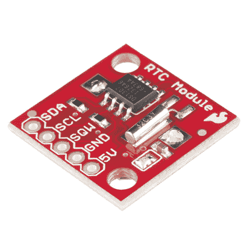
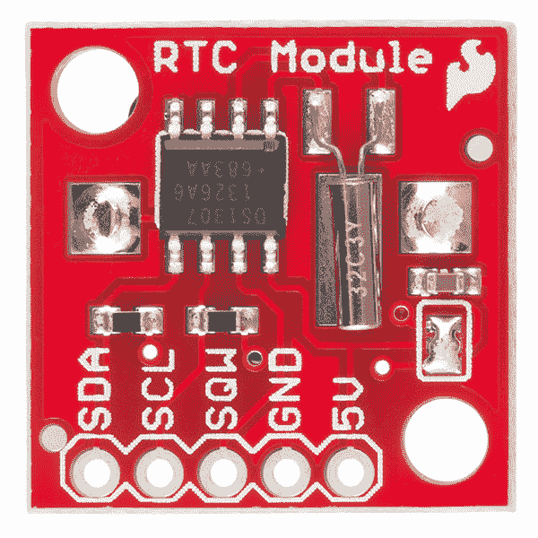
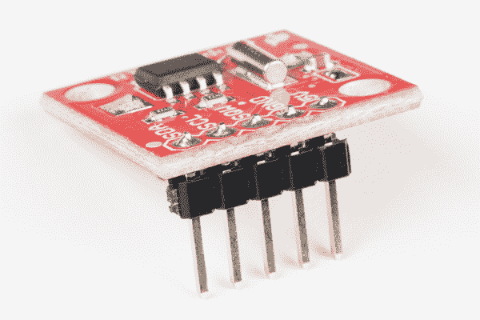
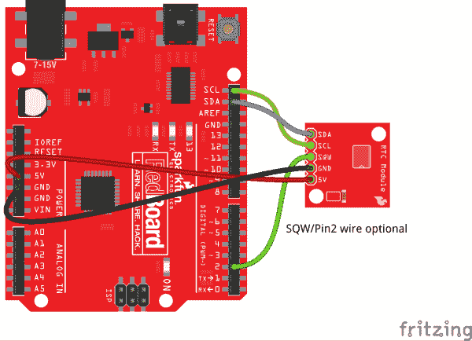
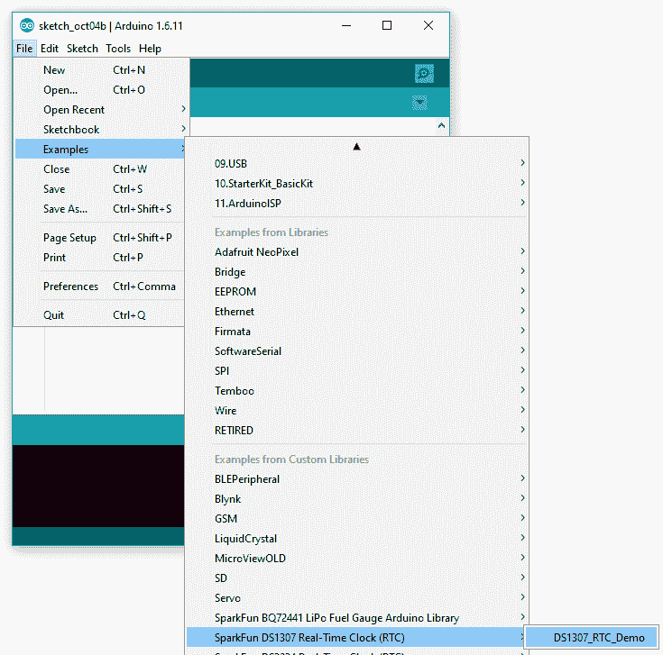
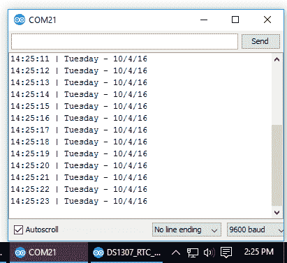

# 实时时钟模块连接指南

> 原文：<https://learn.sparkfun.com/tutorials/real-time-clock-module-hookup-guide>

## 介绍

[SparkFun 实时时钟模块](https://www.sparkfun.com/products/12708)是 DS1307 实时时钟(RTC)的简单分线板。它可以精确记录秒、分、小时、天、月和年，时间长达近十年，因此您的微控制器不必如此。它是钟表、日历或任何其他计时项目的完美组件。

[](https://www.sparkfun.com/products/12708) 

将**添加到您的[购物车](https://www.sparkfun.com/cart)中！**

### [SparkFun 实时时钟模块](https://www.sparkfun.com/products/12708)

[In stock](https://learn.sparkfun.com/static/bubbles/ "in stock") BOB-12708

这是 SparkFun 实时时钟(RTC)模块，这个小突破使用 DS1307 来跟踪当前年份…

$17.5018[Favorited Favorite](# "Add to favorites") 48[Wish List](# "Add to wish list")** **SparkFun RTC 模块上的 IC 是 [Maxim DS1307](https://cdn.sparkfun.com/datasheets/BreakoutBoards/DS1307.pdf) 。它具有一个双线 I ² C 接口，甚至包括一个方波输出引脚。此外，有了备用电池，DS1307 可以**保持时间将近十年或更久**(通常为 17 年)！

本教程是对 DS1307 和 SparkFun 实时时钟模块的一般介绍。它涵盖了分会场的硬件和固件需求，记录了芯片的布线示例和 Arduino 代码。

### 建议的材料

你需要一些额外的部件来启动和运行 RTC 模块。下面是本教程中使用的组件，如果您想继续学习的话。

支持 [I ² C](https://learn.sparkfun.com/tutorials/i2c) 的微控制器需要与 DS1307 通信，并将 RTC 的数据转发给用户。 [SparkFun RedBoard](https://www.sparkfun.com/products/12757) 或 [Arduino Uno](https://www.sparkfun.com/products/11021) 是这个角色的热门选择，但几乎任何微控制器开发板都应该工作。(固件示例使用 Arduino 库，如果这是使用 Arduino 的额外动机的话。)

[](https://www.sparkfun.com/products/11113) 

将**添加到您的[购物车](https://www.sparkfun.com/cart)中！**

### [Arduino Pro Mini 328-5V/16 MHz](https://www.sparkfun.com/products/11113)

[In stock](https://learn.sparkfun.com/static/bubbles/ "in stock") DEV-11113

SparkFun 对 Arduino 的极简设计方法。这是一个 5V Arduino 运行 16MHz 引导加载程序。

$10.95137[Favorited Favorite](# "Add to favorites") 166[Wish List](# "Add to wish list")****[](https://www.sparkfun.com/products/12640) 

将**添加到您的[购物车](https://www.sparkfun.com/cart)中！**

### [Pro 微 5V/16MHz](https://www.sparkfun.com/products/12640)

[Out of stock](https://learn.sparkfun.com/static/bubbles/ "out of stock") DEV-12640

在 SparkFun，我们拒绝放弃“足够好”。这就是我们增加 Arduino 兼容微控制器产品线的原因…

$19.5080[Favorited Favorite](# "Add to favorites") 87[Wish List](# "Add to wish list")****[](https://www.sparkfun.com/products/11021) 

将**添加到您的[购物车](https://www.sparkfun.com/cart)中！**

### [Arduino Uno - R3](https://www.sparkfun.com/products/11021)

[In stock](https://learn.sparkfun.com/static/bubbles/ "in stock") DEV-11021

这是新的 Arduino Uno R3。除了以前主板的所有功能外，Uno 现在使用 ATmega16U2 代替…

$27.95138[Favorited Favorite](# "Add to favorites") 162[Wish List](# "Add to wish list")****[](https://www.sparkfun.com/products/retired/12757) 

### [spark fun red board——用 Arduino 编程 T3](https://www.sparkfun.com/products/retired/12757)

[Retired](https://learn.sparkfun.com/static/bubbles/ "Retired") DEV-12757

在 SparkFun，我们使用许多 Arduinos，我们一直在寻找最简单、最稳定的一款。每块板都有点不同…

127 **Retired**[Favorited Favorite](# "Add to favorites") 78[Wish List](# "Add to wish list")**************5V Recommended!** The DS1307 should nominally be powered at a voltage around 5V. It doesn't support 3.3V. If your development board runs at 3.3V, you may need to do some level-shifting to get the module communicating.

四五根[跳线](https://www.sparkfun.com/products/13870)和一个[试验板](https://www.sparkfun.com/products/12002)有助于将 RTC 模块连接到你的 Arduino。要将分接头插入试验板，你需要将[接头](https://www.sparkfun.com/products/116)焊接到引脚上。(别忘了[一个烙铁](https://www.sparkfun.com/products/9507)和[焊锡](https://www.sparkfun.com/products/9163)！)

[](https://www.sparkfun.com/products/12002) 

将**添加到您的[购物车](https://www.sparkfun.com/cart)中！**

### [【试验板-不干胶(白色)](https://www.sparkfun.com/products/12002)

[In stock](https://learn.sparkfun.com/static/bubbles/ "in stock") PRT-12002

这是你的尝试和真正的白色无焊试验板。它有 2 条电源总线，10 列，30 行，总共 400 个连接…

$5.5048[Favorited Favorite](# "Add to favorites") 93[Wish List](# "Add to wish list")****[](https://www.sparkfun.com/products/116) 

将**添加到您的[购物车](https://www.sparkfun.com/cart)中！**

### [破开头球——直击](https://www.sparkfun.com/products/116)

[In stock](https://learn.sparkfun.com/static/bubbles/ "in stock") PRT-00116

一排标题-打破适应。40 个引脚，可切割成任何尺寸。用于定制 PCB 或通用定制接头。

$1.7520[Favorited Favorite](# "Add to favorites") 133[Wish List](# "Add to wish list")****[](https://www.sparkfun.com/products/9507) 

将**添加到您的[购物车](https://www.sparkfun.com/cart)中！**

### [烙铁- 30W(美国，110V)](https://www.sparkfun.com/products/9507)

[33 available](https://learn.sparkfun.com/static/bubbles/ "33 available") TOL-09507

这是一个非常简单的固定温度，快速加热，30W 110/120 VAC 烙铁。我们真的很喜欢使用更贵的 iro…

$10.957[Favorited Favorite](# "Add to favorites") 21[Wish List](# "Add to wish list")****[](https://www.sparkfun.com/products/retired/13870) 

### [跳线高级 4" M/M - 20 AWG (30 个装)](https://www.sparkfun.com/products/retired/13870)

[Retired](https://learn.sparkfun.com/static/bubbles/ "Retired") PRT-13870

这些是 101 毫米长的 20AWG 跳线，两端都有公接头。使用这些从任何板上的任何母接头跳接…

**Retired**[Favorited Favorite](# "Add to favorites") 5[Wish List](# "Add to wish list")****** ******RTC 模块*是否包含一个 [12mm 纽扣电池](https://www.sparkfun.com/products/337)。你应该不需要很长一段时间，但如果你想储备锂电池，这种选择是存在的。*

### 推荐阅读

SparkFun RTC 模块是一个非常适合初学者的分线板。然而，仍然有一些你应该熟悉的概念。如果下面的任何教程标题对你来说听起来很陌生，可以考虑浏览一下:

[](https://learn.sparkfun.com/tutorials/how-to-solder-through-hole-soldering) [### 如何焊接:通孔焊接](https://learn.sparkfun.com/tutorials/how-to-solder-through-hole-soldering) This tutorial covers everything you need to know about through-hole soldering.[Favorited Favorite](# "Add to favorites") 70[](https://learn.sparkfun.com/tutorials/installing-an-arduino-library) [### 安装 Arduino 库](https://learn.sparkfun.com/tutorials/installing-an-arduino-library) How do I install a custom Arduino library? It's easy! This tutorial will go over how to install an Arduino library using the Arduino Library Manager. For libraries not linked with the Arduino IDE, we will also go over manually installing an Arduino library.[Favorited Favorite](# "Add to favorites") 22[](https://learn.sparkfun.com/tutorials/what-is-an-arduino) [### 什么是 Arduino？](https://learn.sparkfun.com/tutorials/what-is-an-arduino) What is this 'Arduino' thing anyway? This tutorials dives into what an Arduino is and along with Arduino projects and widgets.[Favorited Favorite](# "Add to favorites") 50[](https://learn.sparkfun.com/tutorials/i2c) [### I2C](https://learn.sparkfun.com/tutorials/i2c) An introduction to I2C, one of the main embedded communications protocols in use today.[Favorited Favorite](# "Add to favorites") 128

## 硬件概述

RTC 模块将 DS1307 与计时、通信和维护电源所需的所有组件包围在一起。通信和电源引脚全部连接到一个 5 引脚接头，引脚标签位于电路板的顶部。

[](https://cdn.sparkfun.com/assets/learn_tutorials/5/7/2/top.jpg)

突破的底部几乎完全由 12 毫米硬币电池座组成。

[](https://cdn.sparkfun.com/assets/learn_tutorials/5/7/2/bottom.jpg)

### 插脚引线图

板上的五个引脚分线点提供了对通信接口的访问，并允许您为芯片提供主电源。

| Pin Label | 输入/输出 | 描述 |
| 国家药品监督管理局 | 双向的 | I ² C 总线数据线 |
| SCL | 投入 | I ² C 总线时钟线 |
| SQW | 输出 | 可配置方波输出 |
| GND | 供应输入 | 接地(0V)电源 |
| 5V | 供应输入 | DS1307 V [CC] 电源输入 |

### 为 DS1307 供电

RTC 模块分线板不包括任何电压调节，因此提供给“5V”引脚的电源应保持在 DS1307 的推荐工作范围内: **4.5 至 5.5V** 。

芯片被设计成尽可能低功耗。在通信突发期间，芯片的功耗可能高达 1.5 毫安，但其工作电流接近 200 安。

当主电源被移除并且芯片正在耗尽其备用电池时，它将消耗 300-800nA(取决于 SQW 引脚是否被配置为输出)。

假设它的容量为 47mAh，一个充满电的 [12mm 纽扣电池](https://www.sparkfun.com/products/337)可以让 DS1307 运行长达 **17.88 年**，如果芯片消耗其最低 300nA！

(47mAh / 300nA = 156666.67 小时= 6527.78 天= 17.87 年)

### 使用 SQW(方波)输出引脚

除了 I ² C 引脚，DS1307 还具有一个可配置的方波输出引脚- SQW。此引脚可以配置为产生六个信号之一，也可以关闭。

| SQW 州 | 描述 |
| 1 赫兹 | 1Hz 方波 |
| 4.096 千赫 | 4.096 kHz 的方波 |
| 8.192 千赫 | 8.192 kHz 的方波 |
| 32.768 千赫 | 32.768 kHz 的方波 |
| Zero | 引脚驱动低电平(0V) |
| one | 引脚驱动高电平(5V) |

为了将 SQW 引脚用作输出驱动器，它必须连接到一个[上拉电阻](https://learn.sparkfun.com/tutorials/pull-up-resistors)。一个[10kω电阻](https://www.sparkfun.com/products/11508)，连接在 SQW 和 5V 之间，应该可以完成这项工作。

#### I ² C 上拉电阻禁用

位于电路板顶部(棕色电容下方)的一个小型 3 路跳线将板载 4.7kΩ上拉电阻连接到 5V 电源。如果需要禁用这些上拉电阻，可以清除跳线，有效地从电路中移除电阻。

一点点[焊芯](https://www.sparkfun.com/products/8775)和你的烙铁的接触应该可以去除跳线的焊料滴。

[](https://cdn.sparkfun.com/assets/learn_tutorials/5/7/2/jumper.jpg)*Pull-up resistor solder jumper*

## 硬件连接

在将 RTC 模块插入试验板或连接到微控制器之前，您需要将*某物*焊接到 5 针接头上。如果你打算用芯片做试验板，我们推荐[直阳接头](https://www.sparkfun.com/products/116)。[母接头](https://www.sparkfun.com/products/115)甚至几条[钢丝](https://www.sparkfun.com/products/11375)也是不错的选择。

插头可以安装在电路板的任何一侧，一个便于查看引脚标签，另一个便于接触硬币电池。如果您选择标签视图，您可能需要在接头护罩和电路板之间增加一点气隙，以便接头/试验板可以清除硬币电池的高度。

[](https://cdn.sparkfun.com/assets/learn_tutorials/5/7/2/headers-soldered.jpg)

当你焊接这些接头时，试验板可以成为一个很好的“第三只手”，特别是在这种情况下，你需要考虑电池座的高度。

### 示例电路

DS1307 的 I ² C 接口意味着，为了与芯片接口，你所需要的只是你的微控制器和分线板之间的四条线:**电源、地、数据和时钟**。SQW 引脚可以选择连接到 Arduino，用作脉冲计数器。

下面是一个示例连接图，展示了如何将电路板连接到 SparkFun RedBoard:

[](https://cdn.sparkfun.com/assets/learn_tutorials/5/7/2/rtc-module-example-circuit_bb.png)

## 使用 SparkFun DS1307 Arduino 库

我们为 DS1307 编写了一个 Arduino 库，它负责所有的 I ² C 通信、移位、寄存器写入和时钟管理；它甚至可以自动设置你的 RTC 的时间！从我们的[spark fun _ ds 1307 _ RTC _ Arduino _ Library GitHub 库](https://github.com/sparkfun/SparkFun_DS1307_RTC_Arduino_Library)中抓取最新版本的库:

[Download the SparkFun DS1307 Arduino Library](https://github.com/sparkfun/SparkFun_DS1307_RTC_Arduino_Library/archive/master.zip)

然后跟随我们的[如何安装 Arduino 库教程](https://learn.sparkfun.com/tutorials/installing-an-arduino-library)来帮助安装库。如果下载库的 ZIP 文件，可以使用 Arduino 的“添加 ZIP 库...”只需几次点击就可以安装源文件和示例文件。

[](https://cdn.sparkfun.com/assets/learn_tutorials/5/7/2/add-zip-library.png)

### 使用 DS1307_RTC_Demo 示例

下载完库后，导航到**文件** > **示例** > **SparkFun DS1307 实时时钟(RTC)**>**ds 1307 _ RTC _ Demo**打开 DS1307_Demo:

[](https://cdn.sparkfun.com/assets/learn_tutorials/5/7/2/library-open-example.png)

一旦加载了演示，请确保您的板和端口设置正确-不需要修改-并上传！然后点击**串行监视器**。确保波特率设置为 9600 bps，您应该开始看到时间飞逝:

[](https://cdn.sparkfun.com/assets/learn_tutorials/5/7/2/serial-monitor-output.png)

### 使用 SparkFun DS1307 Arduino 库

该示例演示了 DS1307 的几乎所有功能。下面是如何将库合并到项目中的快速入门:

#### 初始化

首先，确保包含了`SparkFunDS1307RTC.h`库。除此之外，你还需要包含 Arduino I ² C 库:

```
language:c
#include <SparkFunDS1307RTC.h>
#include <Wire.h> 
```

DS1307 库定义了一个名为`rtc`的对象来访问 RTC 模块的所有函数和数据。要初始化 RTC，首先调用您的`setup()`区域中的`rtc.begin()`函数:

```
language:c
void setup()
{
    ...
    rtc.begin();
    ...
} 
```

#### 设定时间

一旦 RTC 初始化，您就可以设置时钟中的时间。这里有几个选择。我们建议使用`rtc.autoTime()`函数，它设置 RTC 的时钟，即您计算机的日期和时间(基于编译时间)，或者使用`rtc.setTime(second, minute, hour, day, date, month, year)`，它允许您精确地设置时钟。

演示示例默认使用`rtc.autoTime()`，它将您的 RTC 的时间和日期设置为您的计算机的时间和日期(可能相差十几秒)。

##### 一劳永逸！

一旦使用`autoTime`或`setTime`功能设置了 RTC 的时间和日期寄存器，您可能再也不用设置时钟了！

一旦你完美地配置了时钟，考虑完全注释掉`autoTime`或`setTime`。

如果您想手动设置时间，请使用`setTime()`功能。例如:

```
language:c
// Set to 13:37:42 (1:37:42 PM)
int hour = 13;
int minute = 37;
int second = 42;
// Set to Monday October 31, 2016:
int day = 2; // Sunday=1, Monday=2, ..., Saturday=7.
int date = 31; 
int month = 10;
int year = 16;

rtc.setTime(second, minute, hour, day, date, month, year); 
```

##### 12 小时模式

RTC 默认为 24 小时模式，但支持带 AM/PM 位的 12 小时模式。如果您想使用 12 小时模式，只需调用`rtc.set12Hour()`(或`rtc.set24Hour()`切换回 24 小时模式)。

要在 12 小时模式下设置时间，应在“小时”变量后添加一个额外的参数–`AM`或`PM`。例如:

```
setTime(14, 42, 7, PM, 1, 28, 12, 16); // Set time to 7:42:14 PM, Sunday December, 28 
```

setTime(14, 42, 7, PM, 1, 28, 12, 16); // Set time to 7:42:14 PM, Sunday December, 28

#### 阅读时间

一旦设置好时钟，它将自动开始一秒一秒、一分一秒地递增。要读取时间和日期值，首先调用`rtc.update()`。这将命令 DS1307 一次性读取其所有数据寄存器。

RTC 数据更新后，您可以通过调用`rtc.hour()`、`rtc.minute()`、`rtc.second()`等来读取那些更新的值。例如:

```
language:c
rtc.update(); // Update RTC data

// Read the time:
int s = rtc.second();
int m = rtc.minute();
int h = rtc.hour();

// Read the day/date:
int dy = rtc.day();
int da = rtc.date();
int mo = rtc.month();
int yr = rtc.year(); 
```

“日”是指“一周中的某一天”，例如星期日、星期一、星期二...`rtc.day()`返回一个介于 1 和 7 之间的整数，其中 1 是星期天，7 是星期六(抱歉，星期-星期一开始真的)。或者，您可以调用`rtc.dayChar()`或`rtc.dayStr()`，它们返回一个字符或完整字符串表示的一周中的某一天。

* * *

有关使用 SparkFun DS1307 Arduino 库的更多信息，请考虑通读[头文件](https://github.com/sparkfun/SparkFun_DS1307_RTC_Arduino_Library/blob/master/src/SparkFunDS1307RTC.h)，该文件记录了 Arduino 草图可用的所有功能。

## 资源和更进一步

有关实时时钟模块和 Maxim DS1307 的更多信息，请查看以下链接:

*   [RTC 模块 GitHub 库](https://github.com/sparkfun/RTC-Module/) -最新 RTC 模块硬件设计文件和固件的大本营。
*   [RTC 模块示意图](https://cdn.sparkfun.com/datasheets/BreakoutBoards/RTC-Module.v14.pdf) (PDF)
*   [RTC 模块 Eagle 文件](https://cdn.sparkfun.com/datasheets/BreakoutBoards/RTC-Module.v14.zip) (ZIP)
*   [DS1307 数据表](https://cdn.sparkfun.com/datasheets/BreakoutBoards/DS1307.pdf) (PDF)
*   [SparkFun DS1307 RTC Arduino 库 GitHub 库](https://github.com/sparkfun/SparkFun_DS1307_RTC_Arduino_Library) -本教程中使用的 Arduino 库的源文件和示例文件。

现在你的 Arduino 已经开始计时了，你打算用 RTC 模块创建什么项目呢？需要一些灵感，查看一些相关教程:

[](https://learn.sparkfun.com/tutorials/reaction-timer) [### 反应速度测量器](https://learn.sparkfun.com/tutorials/reaction-timer) Demonstrate mental chronometry with this simple reaction timer 11[](https://learn.sparkfun.com/tutorials/alphanumeric-gps-wall-clock) [### 字母数字 GPS 挂钟](https://learn.sparkfun.com/tutorials/alphanumeric-gps-wall-clock) This is a GPS controlled clock - a clock you truly never have to set! Using GPS and some formulas, we figure out what day of the week and if we are in or out of daylight savings time.[Favorited Favorite](# "Add to favorites") 13[](https://learn.sparkfun.com/tutorials/adding-a-timed-button-to-a-project) [### 将定时按钮添加到项目](https://learn.sparkfun.com/tutorials/adding-a-timed-button-to-a-project) This tutorial will walk you through making a timed power controller for interactive projects. You will learn how to add an on button that will provide power to your project for an amount of time and then turn off again.[Favorited Favorite](# "Add to favorites") 6[](https://learn.sparkfun.com/tutorials/deadon-rtc-breakout-hookup-guide) [### DeadOn RTC 分线连接指南](https://learn.sparkfun.com/tutorials/deadon-rtc-breakout-hookup-guide) An introduction to the DS3234 real-time clock (RTC), example wiring diagrams, and an Arduino library 3

或者看看下面的一些博客帖子来寻找灵感:

[](https://www.sparkfun.com/news/2205 "October 6, 2016: New tutorials and Arduino libraries for the DeadOn RTC and Real Time Clock module breakout boards – plus, a fun little analog clock project.") [### 今日英语:RTC 之战

October 6, 2016](https://www.sparkfun.com/news/2205 "October 6, 2016: New tutorials and Arduino libraries for the DeadOn RTC and Real Time Clock module breakout boards – plus, a fun little analog clock project.")[Favorited Favorite](# "Add to favorites") 0[](https://www.sparkfun.com/news/2364 "April 19, 2017: Make an easy project for energy conservation! ") [### 硬件驼峰日:地球日黑客

April 19, 2017](https://www.sparkfun.com/news/2364 "April 19, 2017: Make an easy project for energy conservation! ")[Favorited Favorite](# "Add to favorites") 0[](https://www.sparkfun.com/news/2646 "March 26, 2018: Waking up is the worst. Let's try and make it a little easier on ourselves.") [### DIY 日出闹钟

March 26, 2018](https://www.sparkfun.com/news/2646 "March 26, 2018: Waking up is the worst. Let's try and make it a little easier on ourselves.")[Favorited Favorite](# "Add to favorites") 4[](https://www.sparkfun.com/news/2683 "May 8, 2018: I built an alternative clock using a 3D printer and laser cutter.") [### 谢妮 LED 钟

May 8, 2018](https://www.sparkfun.com/news/2683 "May 8, 2018: I built an alternative clock using a 3D printer and laser cutter.")[Favorited Favorite](# "Add to favorites") 5***************