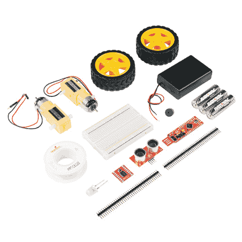
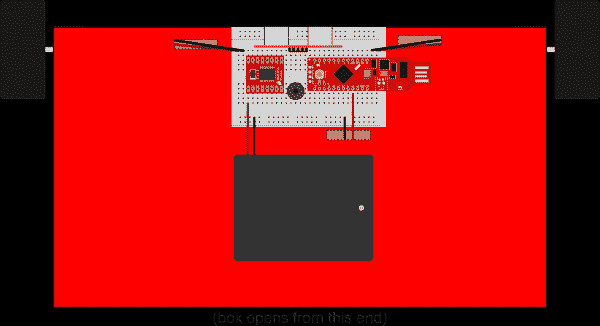
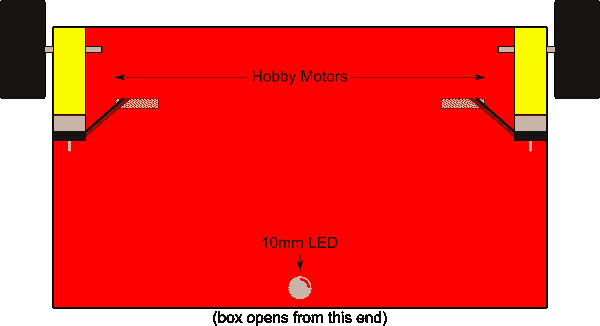
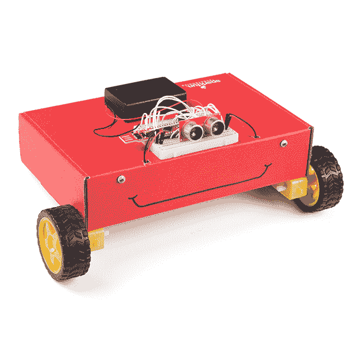
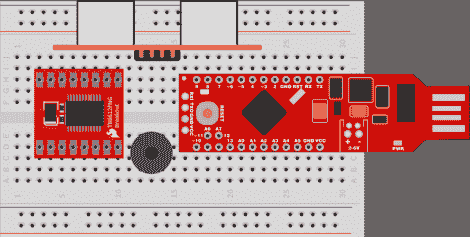
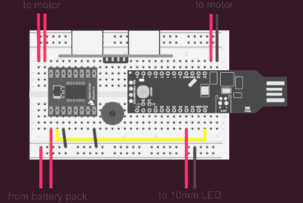
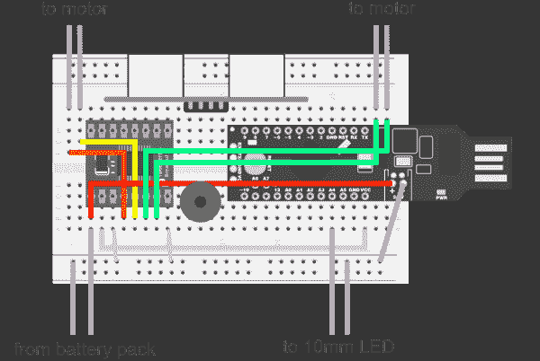
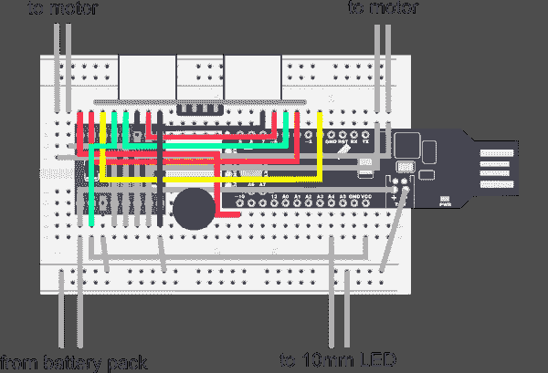
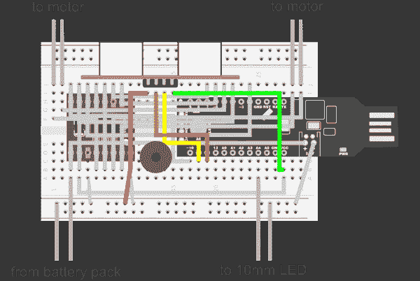
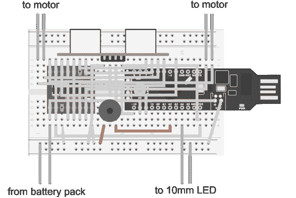

# 红盒子机器人连接指南

> 原文：<https://learn.sparkfun.com/tutorials/red-box-robot-hookup-guide>

## 红盒子机器人

在 SparkFun，我们的红盒子得到了很多称赞。它们结实、时尚，在凌乱的工作台上很难丢失。但是，你知道他们也能制造出非常棒的机器人吗？好吧，你几乎可以用任何一个盒子做一个机器人，但它不会那么时髦。这个工具包有你需要的一切，把你最喜欢的纸箱变成一个机器人伙伴！

[](https://www.sparkfun.com/products/retired/14062) 

### [网络星期一红盒子机器人](https://www.sparkfun.com/products/retired/14062)

[Retired](https://learn.sparkfun.com/static/bubbles/ "Retired") KIT-14062

让我们经典的红盒子变得栩栩如生！我们知道开始一个机器人爱好可能会很昂贵，所以我们想把它放在…

4 **Retired**[Favorited Favorite](# "Add to favorites") 10[Wish List](# "Add to wish list")

#### 套件包括:

*   [踢腿红棒](https://www.sparkfun.com/products/13741)
*   [SparkFun 电机驱动器-双 TB6612FNG (1A)](https://www.sparkfun.com/products/9457)
*   [连接电线-白色(22 AWG)](https://www.sparkfun.com/products/8026)
*   [试验板-不干胶(白色)](https://www.sparkfun.com/products/12002)
*   2x [脱离头球-直线](https://www.sparkfun.com/products/116)
*   3x [1500 毫安时碱性电池- AA](https://www.sparkfun.com/products/9100)
*   [带盖子和开关的电池座 3xAA】](https://www.sparkfun.com/products/10891)
*   [12 毫米 2.048 千赫微型扬声器-电脑支架](https://www.sparkfun.com/products/7950)
*   [超声波传感器- HC-SR04](https://www.sparkfun.com/products/13959)
*   [Hobby 齿轮马达- 200 转/分(对)](https://www.sparkfun.com/products/13302)
*   [车轮-65 毫米(橡胶轮胎，一对)](https://www.sparkfun.com/products/13259)
*   [超高亮 LED -红色 10 毫米](https://www.sparkfun.com/products/8862)
*   双面胶带(将电机贴在盒子上)

## 本教程涵盖的内容

本教程将指导您完成避障机器人的组装、布线和编程。你需要有一些基本的焊接经验，你需要在一个纸板盒上切几个孔。除此之外，你不应该需要任何特殊的工具或技术技能。

## 所需材料

除了工具包中包含的零件，您还需要以下工具:

*   [焊接工具](https://www.sparkfun.com/categories/49)，包括[烙铁](https://www.sparkfun.com/products/9507)和[焊锡](https://www.sparkfun.com/products/9325)
*   剪刀还是业余爱好刀
*   [剥线器](https://www.sparkfun.com/products/12630)
*   谷歌眼睛和其他装饰品 _ 可选)

### 推荐阅读

[](https://learn.sparkfun.com/tutorials/how-to-solder-through-hole-soldering) [### 如何焊接:通孔焊接](https://learn.sparkfun.com/tutorials/how-to-solder-through-hole-soldering) This tutorial covers everything you need to know about through-hole soldering.[Favorited Favorite](# "Add to favorites") 70[](https://learn.sparkfun.com/tutorials/motors-and-selecting-the-right-one) [### 电机并选择正确的电机](https://learn.sparkfun.com/tutorials/motors-and-selecting-the-right-one) Learn all about different kinds of motors and how they operate.[Favorited Favorite](# "Add to favorites") 45[](https://learn.sparkfun.com/tutorials/redstick-hookup-guide) [### RedStick 连接指南](https://learn.sparkfun.com/tutorials/redstick-hookup-guide) Learn about the SparkFun RedStick, a USB thumb drive-sized Arduino-compatible development platform.[Favorited Favorite](# "Add to favorites") 6[](https://learn.sparkfun.com/tutorials/tb6612fng-hookup-guide) [### TB6612FNG 连接指南](https://learn.sparkfun.com/tutorials/tb6612fng-hookup-guide) Basic hookup guide for the TB6612FNG H-bridge motor driver to get your robot to start moving 9

## 构建底盘

在我们开始给机器人接线之前，我们需要组装机械零件。幸运的是，这个机器人非常简单！

把装你的工具包的盒子倒空。那个盒子将成为我们机器人的身体。附带的试验板有一个剥离和粘贴支持，所以让我们从粘贴到盒子的顶部开始，沿着盒子的铰链侧，靠近中心。为了连接其余的部件，你需要工具包里的双面胶带。剪下大约一英寸的胶带，用它将电池组固定在试验板的正下方，如下图所示。不要担心卡在试验板上的零件。我们将在机械部分组装好之后再做。

[](https://cdn.sparkfun.com/assets/learn_tutorials/6/0/0/g103870.png)*Click image for a closer look*

正如你所看到的，有几个地方建议你在盒子上切一个洞，这样电线就可以穿过去了。一个你看不到的洞在电池盒的下面，所以你可以接触到下面的电源开关。否则，你可以把它打开，让它留在那里。另外两个这样的孔在盒子的底部，我们将在那里安装马达。

如果你看看工具包中的业余爱好马达，你会注意到有一个轴穿过它们，这样一个轮子就可以压在任何一边。你还会注意到电线聚集在电机的一侧。如果你确保电机的电线指向盒子的中间，那么给电机接线是最容易的。使用剩余长度的双面胶带将电机安装在盒子的底侧前角。查看下图，了解它应该是什么样子。

**Heads Up!** One side of the motor has a sticker on it. Make sure to remove that sticker before using double-sided tape to mount the motor because this sticker doesn't have as much grip as the tape included in your kit.[](https://cdn.sparkfun.com/assets/learn_tutorials/6/0/0/g7439.png)

由于这个机器人只有两个马达，我们需要在它的背面增加一些东西来防止它被拖来拖去。在这种情况下，我们将使用一个 10 毫米的 LED 作为脚轮。这不仅是一个好的，便宜的方法来保持你的机器人的背部离开地面，而且它还允许我们添加很酷的灯光效果！你不需要把 LED 粘在合适的位置上；只需将它穿过纸板，然后像下图一样张开腿。稍后，我们将焊接一些电线到这个 LED 上，这样就可以固定它了。

[](https://cdn.sparkfun.com/assets/learn_tutorials/6/0/0/g1038755.png)

一旦你把所有的必需品都放好，你就可以添加一些有趣的装饰来给你的机器人一点个性。在下面，你可以看到我用马克笔粘住了一双眼睛，并画了一个古怪的微笑。

[](https://cdn.sparkfun.com/assets/learn_tutorials/6/0/0/14062-01.jpg)

## 给电机接线

既然我们的机器人朋友有了身体(甚至可能有一张脸),是时候开始把东西连在一起了。为了便于组装，我们将所有东西都放在一块试验板上。不过，在这之前，你需要将接头焊接到 RedStick 和电机驱动板上。我不会在这里讨论这个过程；如果你刚刚开始焊接，那么[看看这个教程](https://learn.sparkfun.com/tutorials/how-to-solder---through-hole-soldering)。一旦所有东西都连接了头部，按下图所示将零件压入你的试验板。密切注意试验板两侧有多少行是空闲的；你会需要它们来连接马达。

[](https://cdn.sparkfun.com/assets/learn_tutorials/6/0/0/g20562.png)*Having a hard time seeing the circuit? Click on the wiring diagram for a closer look.*

现在一切就绪，让我们添加跳线来完成我们的电路。你的工具包里有一卷实芯焊丝，你可以[把它剪成短的长度，然后剥掉两端的](https://learn.sparkfun.com/tutorials/working-with-wire)。我们将在这里建立很多连接，所以这个图可能会变得混乱。为了让事情更容易理解，我把它分成了几个阶段。如果你不喜欢按照图表来，我已经整理了一个表格，列出了所有的联系。您可以在本节末尾找到它。

**Heads Up!** I've colored the wiring in these diagrams to make them easier to follow. You only have one color of wire in your kit, but don't worry; the color doesn't matter.[](https://cdn.sparkfun.com/assets/learn_tutorials/6/0/0/g83409.png)*Having a hard time seeing the circuit? Click on the wiring diagram for a closer look.*

关于上述连接的一个快速提示:电机和电池组附带导线，您应该能够直接将其压入试验板，而不必添加自己的导线。

[](https://cdn.sparkfun.com/assets/learn_tutorials/6/0/0/g80910.png)*Having a hard time seeing the circuit? Click on the wiring diagram for a closer look.*

请注意，在上图中，有两根电线连接到 RedStick 上的电池端子。你可能很想把这些线连接到 VCC 和 GND，但是不要这样做！电池连接器实际上通过一个升压电路，所以当你的电池耗尽时，RedStick 不会过早断电。

[](https://cdn.sparkfun.com/assets/learn_tutorials/6/0/0/g75900.png)*Having a hard time seeing the circuit? Click on the wiring diagram for a closer look.*

| **电机驱动销** | **红色大头针** | **其他** |
| 伏特计 | 电池+ | 电池组+ |
| VCC | VCC |  |
| GND | GND | 电池组- |
| A01 |  | 左侧电机+ |
| A02 |  | 左马达- |
| B01 |  | 右电机+ |
| B02 |  | 右马达- |
| 美洲狮，美洲狮 | Ten |  |
| AIN2 | four |  |
| AIN1 | Two |  |
| 斯坦比 |  | 有 VCC 的联系吗 |
| BIN1 | five |  |
| BIN2 | seven |  |
| PWMB | six |  |
|  | A4 号 | 10 毫米 LED 阳极 |
|  | GND | 10 毫米 LED 阴极 |

## 采取行动

现在你已经做好了让马达运转所需的所有连接，让我们在那个红色的棍子上弄些代码来旋转我们的轮子吧！出于本节的目的，我将假设您对 Arduino 编程有一定的经验，并且已经设置好将代码加载到 SparkFun RedStick 上。如果你需要一点帮助来开始，请查看这个教程。

为了将代码加载到你的 RedStick 上，你需要(小心地)将其从试验板上移除，或者使用一根 [USB 延长线](https://www.sparkfun.com/products/13309)将其插入你电脑的 USB 端口。

下面的 Arduino 代码利用了我们的库。如果你不熟悉安装 Arduino 库，请查看我们的[教程](https://learn.sparkfun.com/tutorials/installing-an-arduino-library)。

使用下面的链接下载这个库，或者从我们的 [GitHub 库](https://github.com/sparkfun/SparkFun_TB6612FNG_Arduino_Library)获取最新版本。

[TB6612FNG Arduino Library](https://github.com/sparkfun/SparkFun_TB6612FNG_Arduino_Library/archive/master.zip)

这个示例代码会让你的机器人跳一小段舞。这是一个很好的方法来确保到目前为止你已经连接好了所有的东西。另外，我们已经盯着这东西够久了；是时候做点什么了！

```
language:c
/******************************************************************
TestRun.ino
TB6612FNG H-Bridge Motor Driver Example code
Michelle @ SparkFun Electronics
8/20/16
https://github.com/sparkfun/SparkFun_TB6612FNG_Arduino_Library

Uses 2 motors to show examples of the functions in the library.  This 
causes a robot to do a little 'jig'.  Each movement has an equal and 
opposite movement so assuming your motors are balanced the bot should 
end up at the same place it started.

Resources:
TB6612 SparkFun Library
*****************************************************************/

// This is the library for the TB6612 that contains the class Motor and all the
// functions
#include <SparkFun_TB6612.h>

// Pins for all inputs, keep in mind the PWM defines must be on PWM pins
// the default pins listed are the ones used on the Redbot (ROB-12097) with
// the exception of STBY which the Redbot controls with a physical switch
#define AIN1 2
#define BIN1 7
#define AIN2 4
#define BIN2 5
#define PWMA 10
#define PWMB 6
#define STBY 9

// these constants are used to allow you to make your motor configuration 
// line up with function names like forward.  Value can be 1 or -1
const int offsetA = -1;
const int offsetB = -1;

// Initializing motors.  The library will allow you to initialize as many
// motors as you have memory for.  If you are using functions like forward
// that take 2 motors as arguements you can either write new functions or
// call the function more than once.
Motor motor1 = Motor(AIN1, AIN2, PWMA, offsetA, STBY);
Motor motor2 = Motor(BIN1, BIN2, PWMB, offsetB, STBY);

void setup()
{
 //Nothing here
}

void loop()
{
   //Use of the drive function which takes as arguements the speed
   //and optional duration.  A negative speed will cause it to go
   //backwards.  Speed can be from -255 to 255\.  Also use of the 
   //brake function which takes no arguements.
   motor1.drive(255,1000);
   motor1.drive(-255,1000);
   motor1.brake();
   delay(1000);

   //Use of the drive function which takes as arguements the speed
   //and optional duration.  A negative speed will cause it to go
   //backwards.  Speed can be from -255 to 255\.  Also use of the 
   //brake function which takes no arguements.
   motor2.drive(255,1000);
   motor2.drive(-255,1000);
   motor2.brake();
   delay(1000);

   //Use of the forward function, which takes as arguements two motors
   //and optionally a speed.  If a negative number is used for speed
   //it will go backwards
   forward(motor1, motor2, 150);
   delay(1000);

   //Use of the back function, which takes as arguments two motors 
   //and optionally a speed.  Either a positive number or a negative
   //number for speed will cause it to go backwards
   back(motor1, motor2, -150);
   delay(1000);

   //Use of the brake function which takes as arguments two motors.
   //Note that functions do not stop motors on their own.
   brake(motor1, motor2);
   delay(1000);

   //Use of the left and right functions which take as arguements two
   //motors and a speed.  This function turns both motors to move in 
   //the appropriate direction.  For turning a single motor use drive.
   left(motor1, motor2, 100);
   delay(1000);
   right(motor1, motor2, 100);
   delay(1000);

   //Use of brake again.
   brake(motor1, motor2);
   delay(1000);

} 
```

有了编译好的代码并在你的机器人上运行，你就朝着让你的红盒子有生命的方向迈出了第一步。然而，你可能已经注意到，它有点笨拙。它会撞上路上的任何东西！下一步我们要做的是给它避开这些障碍的能力...

## 避开障碍

在我们上传新代码以利用机器人的超声波传感器之前，我们需要将传感器连接到 RedStick。这种传感器只需要四根导线就可以工作，我在下图中突出显示了它们。

[](https://cdn.sparkfun.com/assets/learn_tutorials/6/0/0/g90961.png)*Having a hard time seeing the circuit? Click on the wiring diagram for a closer look.*

一旦添加了这些连接，只需上传下面的示例代码:

```
language:c
#include <SparkFun_TB6612.h>

// these constants are used to allow you to make your motor configuration 
// line up with function names like forward.  Value can be 1 or -1
const int offsetA = -1;
const int offsetB = -1;

// Pins for all inputs, keep in mind the PWM defines must be on PWM pins
// the default pins listed are the ones used on the Redbot (ROB-12097) with
// the exception of STBY which the Redbot controls with a physical switch
#define AIN1 2
#define BIN1 7
#define AIN2 4
#define BIN2 5
#define PWMA 10
#define PWMB 6
#define STBY 9

// Initializing motors.  The library will allow you to initialize as many
// motors as you have memory for.  If you are using functions like forward
// that take 2 motors as arguements you can either write new functions or
// call the function more than once.
Motor motor1 = Motor(AIN1, AIN2, PWMA, offsetA, STBY);
Motor motor2 = Motor(BIN1, BIN2, PWMB, offsetB, STBY);

// Pins
const int TRIG_PIN = 11;
const int ECHO_PIN = 12;

// Anything over 400 cm (23200 us pulse) is "out of range"
const unsigned int MAX_DIST = 23200;

void setup() {

  // Setup all of our pins
  pinMode(TRIG_PIN, OUTPUT);
  digitalWrite(TRIG_PIN, LOW);
  pinMode(2, OUTPUT); digitalWrite(2, LOW);
  pinMode(4, OUTPUT); digitalWrite(4, LOW);
  pinMode(5, OUTPUT); digitalWrite(5, LOW);
  pinMode(7, OUTPUT); digitalWrite(7, LOW);
  pinMode(3, OUTPUT); 
  pinMode(6, OUTPUT); 
  pinMode(A4, OUTPUT);
  digitalWrite(A4, HIGH);

}

void loop() {

  // Start moving forward
  forward(motor1, motor2, 200);

  unsigned long t1;
  unsigned long t2;
  unsigned long pulse_width;
  float cm;

  // Hold the trigger pin high for at least 10 us
  digitalWrite(TRIG_PIN, HIGH);
  delayMicroseconds(10);
  digitalWrite(TRIG_PIN, LOW);

  // Wait for pulse on echo pin
  while ( digitalRead(ECHO_PIN) == 0 );

  // Measure how long the echo pin was held high (pulse width)
  // Note: the micros() counter will overflow after ~70 min
  t1 = micros();
  while ( digitalRead(ECHO_PIN) == 1);
  t2 = micros();
  pulse_width = t2 - t1;

  // Calculate distance in centimeters.
  cm = pulse_width / 58.0;

  // If an obstacle is detected fewer than 20 centimeters away,
  // run the motors backwards and then coin flip to decide which
  // way to turn before continuing on.
  if(cm<20){back(motor1, motor2, 250); delay(1000);
  if(flip()){left(motor1, motor2, 250);}else{right(motor1, motor2, 250);}
  delay(2500);}

  // Wait at least 60ms before next measurement
  delay(60);
}

// Coinflip function that randomly returns a 1 or 0
bool flip(){

  static uint32_t buf = 0;
  static uint8_t idx = 0;
  if (idx)
  {
    buf >>= 1;
    idx--;
  }
  else
  {
    buf = random();  // refill
    idx = 30;
  }
  return buf & 0x01;

} 
```

如果一切正常，你的机器人应该在躲避障碍物。更具体地说，如果一个物体来到机器人前方 20 厘米以内，机器人将在继续前进之前反转方向并随机转向。对于机器人来说，这是一种很好的自我保护本能。然而，如果科幻电影教会了我什么的话，一个小机器人需要一个可爱的声音才能生存。

## 惠特妮·休斯顿

在你的机器人会吹口哨之前，我们还需要做一个快速连接。将迷你扬声器的一端连接到 RedStick 上的 A4 引脚，另一端接地，如下图所示。

[](https://cdn.sparkfun.com/assets/learn_tutorials/6/0/0/g88447.png)*Having a hard time seeing the circuit? Click on the wiring diagram for a closer look.*

我们今天要对代码进行的最后一次更新是添加一个有趣的小功能，我称之为“口哨”，它随机选取九个频率，并快速连续地发出哔哔声，以近似一种无言的感叹词。听起来不多，但增加了不少个性。

```
language:c
#include <SparkFun_TB6612.h>

// these constants are used to allow you to make your motor configuration 
// line up with function names like forward.  Value can be 1 or -1
const int offsetA = -1;
const int offsetB = -1;

// Pins for all inputs, keep in mind the PWM defines must be on PWM pins
// the default pins listed are the ones used on the Redbot (ROB-12097) with
// the exception of STBY which the Redbot controls with a physical switch
#define AIN1 2
#define BIN1 7
#define AIN2 4
#define BIN2 5
#define PWMA 10
#define PWMB 6
#define STBY 9

// Initializing motors.  The library will allow you to initialize as many
// motors as you have memory for.  If you are using functions like forward
// that take 2 motors as arguements you can either write new functions or
// call the function more than once.
Motor motor1 = Motor(AIN1, AIN2, PWMA, offsetA, STBY);
Motor motor2 = Motor(BIN1, BIN2, PWMB, offsetB, STBY);

// Pins
const int TRIG_PIN = 11;
const int ECHO_PIN = 12;

// Anything over 400 cm (23200 us pulse) is "out of range"
const unsigned int MAX_DIST = 23200;

void setup() {

  // Setup all of our pins
  pinMode(TRIG_PIN, OUTPUT);
  digitalWrite(TRIG_PIN, LOW);
  pinMode(2, OUTPUT); digitalWrite(2, LOW);
  pinMode(4, OUTPUT); digitalWrite(4, LOW);
  pinMode(5, OUTPUT); digitalWrite(5, LOW);
  pinMode(7, OUTPUT); digitalWrite(7, LOW);
  pinMode(3, OUTPUT); 
  pinMode(6, OUTPUT); 
  pinMode(A4, OUTPUT);
  digitalWrite(A4, HIGH);

}

void loop() {

  // Start moving forward
  forward(motor1, motor2, 200);

  unsigned long t1;
  unsigned long t2;
  unsigned long pulse_width;
  float cm;

  // Hold the trigger pin high for at least 10 us
  digitalWrite(TRIG_PIN, HIGH);
  delayMicroseconds(10);
  digitalWrite(TRIG_PIN, LOW);

  // Wait for pulse on echo pin
  while ( digitalRead(ECHO_PIN) == 0 );

  // Measure how long the echo pin was held high (pulse width)
  // Note: the micros() counter will overflow after ~70 min
  t1 = micros();
  while ( digitalRead(ECHO_PIN) == 1);
  t2 = micros();
  pulse_width = t2 - t1;

  // Calculate distance in centimeters.
  cm = pulse_width / 58.0;

  // If an obstacle is detected fewer than 20 centimeters away,
  // run the motors backwards and then coin flip to decide which
  // way to turn before continuing on.
  if(cm<20){back(motor1, motor2, 250); whistle(); delay(1000);
  if(flip()){left(motor1, motor2, 250);}else{right(motor1, motor2, 250);}
  delay(2500);}

  // Wait at least 60ms before next measurement
  delay(60);
}

// Coinflip function that randomly returns a 1 or 0
bool flip(){

  static uint32_t buf = 0;
  static uint8_t idx = 0;
  if (idx)
  {
    buf >>= 1;
    idx--;
  }
  else
  {
    buf = random();  // refill
    idx = 30;
  }
  return buf & 0x01;

}

// Make a series of cute random beeping sounds
int whistle(){
tone(A2,random(50,400)*10);
delay(100);
tone(A2,random(50,400)*10);
delay(100);
tone(A2,random(50,400)*10);
delay(100);
tone(A2,random(50,400)*10);
delay(100);
tone(A2,random(50,400)*10);
delay(100);
tone(A2,random(50,400)*10);
delay(100);
tone(A2,random(50,400)*10);
delay(100);
tone(A2,random(50,400)*10);
delay(100);
noTone(A2);
delay(100);
} 
```

假设一切顺利，你的机器人应该在每次遇到障碍时都会吹一首可爱的小曲。把它当成你个人死星的鼠标机器人。或者它是你的机器人军队的第一个新兵。或者也许它只是让你在家陪伴的东西。嘿，不管是什么让你高兴，我们都不会评判。

[](https://cdn.sparkfun.com/assets/learn_tutorials/6/0/0/14062-01.jpg)

## 资源和更进一步

你的机器人在动，在动...但是不要就此打住！你还可以添加更多的部件，更多的代码，更多的个性！查看 [RedBot 实验指南](https://learn.sparkfun.com/tutorials/experiment-guide-for-redbot-with-shadow-chassis)了解一些关于你可以用一个简单的两轮机器人做什么的想法。

另外，如果你给你的机器人涂上了很酷的眼睛或亮片，让我们看看吧！拍张照发推特到 [@sparkfun](https://twitter.com/sparkfun)

要获得更多机器人乐趣，请查看以下其他精彩的 SparkFun 教程:

[](https://learn.sparkfun.com/tutorials/building-a-safe-cracking-robot) [### 建造一个安全的破解机器人](https://learn.sparkfun.com/tutorials/building-a-safe-cracking-robot) How to crack an unknown safe in under an hour.[Favorited Favorite](# "Add to favorites") 21[](https://learn.sparkfun.com/tutorials/light-seeking-robot) [### 寻光机器人](https://learn.sparkfun.com/tutorials/light-seeking-robot) We use parts from the SparkFun Inventor's Kit v4.0 to create a light-seeking robot that mimics the behavior of single-celled organisms.[Favorited Favorite](# "Add to favorites") 8[](https://learn.sparkfun.com/tutorials/pi-servo-phat-v2-hookup-guide) [### Pi 伺服 pHAT (v2)连接指南](https://learn.sparkfun.com/tutorials/pi-servo-phat-v2-hookup-guide) This hookup guide will get you started with connecting and using the Pi Servo pHAT on a Raspberry Pi.[Favorited Favorite](# "Add to favorites") 4[](https://learn.sparkfun.com/tutorials/jetson-nano--sphero-rvr-mash-up-part-1) [### Jetson Nano + Sphero RVR 混搭(第 1 部分)](https://learn.sparkfun.com/tutorials/jetson-nano--sphero-rvr-mash-up-part-1) We took two of our biggest robotics partnerships from the previous year and shazamed them together into one robot to rule them all 3