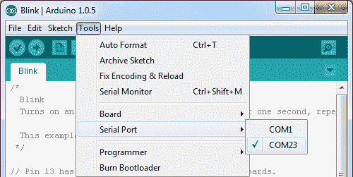

# RedBoard 连接指南

> 原文：<https://learn.sparkfun.com/tutorials/redboard-hookup-guide>

## 介绍

[SparkFun RedBoard](https://www.sparkfun.com/products/13975) 是一个兼容 Arduino 的开发平台，支持快速简单的项目原型开发。它可以与现实世界的传感器交互，控制电机，显示信息，并执行近即时计算。它使*任何人*都能创造独特、漂亮的项目，比如[双轮 buggy](https://learn.sparkfun.com/tutorials/building-the-hub-ee-buggy)、[定制音乐盒](https://learn.sparkfun.com/tutorials/mp3-player-shield-music-box)和[骰子手套](https://learn.sparkfun.com/tutorials/dungeons-and-dragons-dice-gauntlet)。

RedBoard 也是一个优秀的物理计算**学习平台**。我们将 RedBoard 设计得尽可能简单易用。它可以用来帮助同时教授编程和电子学——这两项技能在当今的高科技世界变得非常重要。

[](https://www.sparkfun.com/products/13975) 

将**添加到您的[购物车](https://www.sparkfun.com/cart)中！**

### [spark fun red board——用 Arduino 编程 T3](https://www.sparkfun.com/products/13975)

[In stock](https://learn.sparkfun.com/static/bubbles/ "in stock") DEV-13975

SparkFun RedBoard 结合了 UNO 的 Optiboot 引导程序的简单性、FTDI 的稳定性和 shield com…

$21.5049[Favorited Favorite](# "Add to favorites") 89[Wish List](# "Add to wish list")** **本教程旨在让您熟悉 RedBoard，并帮助您开始使用它。首先，我们将了解主板的来龙去脉，然后解释如何安装，最后我们将了解如何在 Arduino 软件中使用它。

### 要求

当然，要遵循这个指南，你需要一个 [RedBoard](https://www.sparkfun.com/products/13975) 。你还需要一根[迷你 B 转 A USB 线](https://www.sparkfun.com/products/11301)。USB 接口有两个用途:它为 RedBoard 供电，并允许您向其上传程序。

你还需要一台安装了 Arduino IDE 的电脑——Mac、PC 或 Linux 都可以。你可以[从他们的网站下载 Arduino](http://arduino.cc/en/Main/Software) 。那里有安装说明，但我们也将在本教程中讨论安装。

### 推荐阅读

RedBoard 的目标是尽可能方便初学者使用微控制器平台。你可以在没有欧姆定律或 T2 电是如何工作的先天知识的情况下使用它。).不过，这里有一些你应该熟悉的主题:

*   什么是 Arduino？
*   [什么是电路？](https://learn.sparkfun.com/tutorials/what-is-a-circuit)

## 见见雷德板

下面是一张带注释的图片，以及对红板上所有重要内容的快速概述:

[](https://cdn.sparkfun.com/assets/3/d/5/6/c/522f5cbd757b7f4f6e8b4567.png)

### 供电

RedBoard 可以通过 USB 或筒式插孔连接器供电。如果您选择通过 USB 供电，USB 电缆的另一端可以连接到电脑或(5V 调节) [USB 壁式充电器](https://www.sparkfun.com/products/11456)。

电源插孔接受外径为 5.5 毫米、内径为 2.1 毫米的中心正极筒形连接器。如果您希望以这种方式为 RedBoard 供电，我们的 [9V](https://www.sparkfun.com/products/298) 和 [12V 适配器](https://www.sparkfun.com/products/9442)是不错的选择。连接到该插孔的任何墙壁适配器都应提供 7 至 15V 之间的 **DC 电压。**

USB 通常是为电路板供电的最简单方式，尤其是在编程时，因为上传代码也需要 USB 接口。你为什么要用桶形千斤顶？通常是因为你需要更多的动力。一个 USB 端口通常只允许提供 500 毫安的电流，如果你需要更多的电流，墙上的适配器可能是你唯一的选择。

[](https://cdn.sparkfun.com/assets/7/e/d/a/3/5230c645757b7fe62c8b456d.png)

同时连接筒形插孔和 USB 连接器是可以接受的。RedBoard 具有电源控制电路，可自动选择最佳电源。

### 使用红纸板标题

RedBoard 的所有引脚都在板的外边缘断开到 0.1 英寸间距的母接头(即连接器)。大多数引脚排列成逻辑集合，有专用于电源输入/输出、模拟输入和数字输入的接头。

**数字引脚**是 Arduino 的数字输入和输出。这些是你连接到按钮，发光二极管，传感器等。将 Arduino 与其他硬件连接起来。标有波浪符号(~)的引脚也可以用作[模拟输出](https://learn.sparkfun.com/tutorials/pulse-width-modulation)，可以用来调暗 led 或运行伺服电机。

模拟接头上有六个**模拟输入**。这些管脚都有[模数转换器](https://learn.sparkfun.com/tutorials/analog-to-digital-conversion)，可以用来读入 0 到 5V 之间的模拟电压。如果您需要读取电位计或其他模拟传感器的输出，这些非常有用。所有六个模拟引脚也可以用作数字输入和输出。

**电源接头**大部分都是电压供应引脚。这些引脚传统上被**用作其他硬件(如发光二极管、电位计和其他电路)的电源**。“3.3V”和“5V”引脚是 3.3V 和 5V 稳压电源。“GND”引脚是公共地，即这些电压源的 0V 参考电压。“VIN”是输入电压，如果连接了墙壁适配器，它将等于输入电源的电压。如果桶形插孔没有连接任何东西，并且您通过 USB 为电路板供电，VIN 应该在 5V 左右。

#### 连接到接头

有各种电线、连接器和其他物品可以插入这些接头中，以便与 Arduino 接口。如果你想将 RedBoard 连接到试验板上的其他电路，跳线是一个不错的选择。

[](https://cdn.sparkfun.com/assets/0/9/9/4/e/5230c645757b7fa32c8b4568.png)*A tangled assortment of [jumper wires](https://www.sparkfun.com/products/8431) run between the RedBoard headers and components on a [breadboard](https://www.sparkfun.com/products/11317). An [Arduino baseplate](https://www.sparkfun.com/products/11235) holds them all in one place.*

Arduino shields 是另一种与 RedBoard 连接器连接的流行方式。这些 Arduino 形状的板搭载在 RedBoard 上，并同时连接到所有四个接头。盾牌有数百种形式，它们可以为你的 Arduino 添加 GPS、WiFi、MP3 解码和各种其他功能。

[](https://cdn.sparkfun.com/assets/f/9/8/b/b/5230c645757b7fb32d8b4568.png)*An [Ethernet Shield](https://www.sparkfun.com/products/10864) piggybacks onto a RedBoard to help get it connected to the Internet.*

此外，还有许多其他接口选项。如果你有一个 0.1 英寸间距的连接器，比如 [Molex](https://www.sparkfun.com/products/9922) ，你可以直接插入。或者只是[剥去](https://learn.sparkfun.com/tutorials/working-with-wire/how-to-strip-a-wire)一些[电线](https://www.sparkfun.com/products/11367)。

## 下载/安装 Arduino

在将 RedBoard 插入电脑之前，您需要先安装 Arduino。

### 安装 Arduino

首先，前往 Arduino 的下载页面，获取 Arduino 的最新稳定版本。确保您获得的版本与您的操作系统相匹配。

 [### 下载 Arduino！](http://arduino.cc/en/Main/Software) 

[](http://arduino.cc/en/Main/Software)

安装过程相当简单，但会因操作系统而异。这里有一些提示可以帮助你。我们还写了一个单独的[安装 Arduino 教程](https://learn.sparkfun.com/tutorials/installing-arduino-ide)如果你真的卡住了。

#### Windows 安装提示

Arduino 的 Windows 版本提供了两个选项:安装程序或 zip 文件。**安装程序**是两个选项中比较容易的一个，只需下载并运行可执行文件就可以开始安装了。如果在安装过程中提示您安装驱动程序，请选择“不安装”(RedBoard 不使用相同的驱动程序)。不要忘记它安装到哪个目录(默认为“Program Files/Arduino”)。

[](https://cdn.sparkfun.com/assets/1/6/d/f/a/522f7e7b757b7fe56d8b4567.png)*Windows install steps. Click the image to get a bigger view.*

相反，如果你选择下载 Arduino 的 **zip 文件**版本，你需要自己解压文件。不要忘记你把文件解压到哪个文件夹！安装驱动程序时，我们需要参考该目录。

#### Mac 安装提示

Arduino 的 Mac 下载仅提供 zip 文件版本。下载完成后，只需双击**。zip 文件**进行解压缩。

[](https://cdn.sparkfun.com/assets/3/4/1/7/b/52cc895fce395fe16e8b456a.jpg)

接下来，你需要**将 Arduino 应用程序复制到你的应用程序文件夹**来完成安装。

#### Linux 安装技巧

正如您的 Linux 用户无疑已经意识到的，Linux 有很多种风格，每一种都有独特的安装例程。查看安装 Arduino 教程的 [Linux 部分，获得一些有用的链接，以获得各种 Linux 发行版。](https://learn.sparkfun.com/tutorials/installing-arduino/linux)

对于 Ubuntu 和 Debian 用户来说，安装 Arduino 应该像运行一个小小的“apt-get”魔术一样简单，只需一个命令，比如:

```
sudo apt-get update && sudo apt-get install arduino arduino-core 
```

其他的 Linux 发行版也没有太大的不同。

* * *

下载并安装了 Arduino 后，下一步是插入 RedBoard 并安装一些驱动程序！很快你就会闪烁发光二极管，阅读按钮，并做一些物理计算！

## 安装 FTDI 驱动程序

一旦你下载并安装了 Arduino，是时候将 RedBoard 连接到你的电脑上了！不过，在使用该板之前，您需要安装驱动程序。

### Windows 驱动程序安装

最初插入 RedBoard 后，您的电脑将尝试搜索兼容的驱动程序。可能真的成功了！FTDI 驱动程序很常见，所以 Windows Update 可能对它们有所了解。如果驱动程序自动安装，您应该会看到一个小气泡提示:

[](https://cdn.sparkfun.com/assets/4/1/7/3/b/522f9067757b7fd56d8b456b.png)

如果您的计算机找不到驱动程序，我们将不得不手动安装它们。查看我们的 [Windows FTDI 驱动程序安装指南](https://learn.sparkfun.com/tutorials/how-to-install-ftdi-drivers/windows---in-depth)获取驱动程序安装说明。

### Mac 驱动程序安装

如果你幸运的话，FTDI 驱动程序应该会自动安装在 Mac OS X 上，否则你必须手动安装驱动程序。查看 [Mac FTDI 驱动程序安装指南](https://learn.sparkfun.com/tutorials/how-to-install-ftdi-drivers/mac)以获得安装驱动程序的帮助。

[](https://cdn.sparkfun.com/assets/1/3/a/0/a/522f96ed757b7f42098b4567.png)

简而言之，这个过程包括前往 [FTDI 驱动程序网站](http://www.ftdichip.com/Drivers/VCP.htm)，下载最新的 VCP 驱动程序。然后，您只需运行您下载的“ftdiusbsserialdriver _ v2 _ 2 _ 18 . dmg”文件，并按照安装提示进行操作。

### Linux 驱动程序安装

Linux 实际上非常擅长自动安装驱动程序。如果您有任何问题，请查看我们的 [Linux FTDI 驱动指南](https://learn.sparkfun.com/tutorials/how-to-install-ftdi-drivers/linux)。

* * *

现在是时候松口气了！第一次将主板连接到计算机时，您只需运行一次驱动程序安装过程。现在该上传素描了！

## 上传闪烁

现在终于到了**打开 Arduino 软件**的时候了。您将看到一个窗口，看起来有点像这样:

[](https://cdn.sparkfun.com/assets/8/4/5/b/d/52309c7e757b7f522d8b4567.png)

让我们上传一个**闪烁草图**来确保我们新的红板设置完全正常。在 Arduino 中进入**文件**菜单，然后进入**示例> 01。基础>眨眼**打开它。

在我们将代码发送到 RedBoard 之前，我们需要做一些调整。

### 选择一个电路板

这一步需要告诉 Arduino IDE *我们拥有[众多 Arduino 板](https://learn.sparkfun.com/tutorials/arduino-comparison-guide)中的哪个*。进入**工具**菜单。然后悬停在**板**上，确保 **Arduino Uno** 被选中。

[](https://cdn.sparkfun.com/assets/4/a/4/b/0/52309f4f757b7fbf2d8b4567.png)

### 选择一个串行端口

接下来，我们需要告诉 Arduino IDE 红板连接到了计算机的哪个串行端口。为此，再次进入**工具**，然后悬停在**串口**上，选择你的 RedBoard 的 COM 端口。

[](https://cdn.sparkfun.com/assets/b/e/0/0/c/52309f4f757b7fbd2d8b4567.png)

如果你有一个以上的端口，并且你不确定哪一个串行端口是你的 RedBoard，拔掉它一会儿并且检查菜单看哪一个消失。

### 上传！

调整完所有这些设置后，您终于可以上传一些代码了！单击 **Upload** 按钮(向右的箭头),给 IDE 一些时间来编译和上传您的代码。完成该过程大约需要 10-20 秒。代码上传后，您应该会在控制台窗口中看到类似这样的内容:

[](https://cdn.sparkfun.com/assets/a/0/5/7/0/5230a452757b7f512d8b4567.png)

如果你看一下红板，你会看到蓝色的 LED 灯亮了一秒，灭了一秒，亮了一秒，灭了一秒...无限期地(至少直到它失去动力)。如果你想调整闪烁速度，试着改变`delay(1000);`行中的“1000”值。你正在成为一名 Arduino 程序员！

### 出什么事了吗？

啊哦！如果你没有得到一个“上传完成”的消息，而是得到一个错误，有一些事情我们可以仔细检查。

如果你的控制台窗口出现一个`avrdude: stk500_getsync(): not in sync: resp=0x00`错误。

[](https://cdn.sparkfun.com/assets/9/a/6/f/b/5230a5fa757b7fcf2d8b4567.png)

您的串行端口或板可能设置不正确。再次确认 **Arduino Uno** 是板选择(在“工具>板”菜单下)。串行端口通常是更常见的罪魁祸首。串口设置是否正确(在“工具>串口”菜单下)？驱动程序安装成功了吗？要仔细检查您的 RedBoard 的串行端口，请在插入该板时查看菜单，然后拔下它并查找丢失的端口。如果没有端口丢失，你可能需要回到[驱动安装](https://learn.sparkfun.com/tutorials/getting-started-with-the-redboard/install-ftdi-drivers)。

## 资源和更进一步

下一步是什么？这完全取决于你！闪烁一个小 LED 是进入一个充满蜂鸣器、传感器和许多闪光东西的神奇世界的入口。RedBoard 可以与任何电子设备连接，比如液晶显示器:

[](https://cdn.sparkfun.com/assets/4/8/3/2/7/5230aad0757b7f892d8b4568.png)

想了解更多想法，请查看以红纸板为中心的 [SparkFun Inventor 工具包](https://www.sparkfun.com/products/11576)，并教你如何将其连接到按钮、继电器、柔性传感器和其他组件。

<param name="movie" value="//www.youtube.com/v/bonSsx6npY4?hl=en_US&amp;version=3&amp;rel=0"><param name="allowFullScreen" value="true"><param name="allowscriptaccess" value="always"><embed src="//www.youtube.com/v/bonSsx6npY4?hl=en_US&amp;version=3&amp;rel=0" type="application/x-shockwave-flash" width="480" height="360" allowscriptaccess="always" allowfullscreen="true">

如果您想继续学习更多关于使用 Arduino 的知识，请查看以下相关教程:

*   [Arduino 对比指南](https://learn.sparkfun.com/tutorials/arduino-comparison-guide)
*   [Arduino 保护罩](https://learn.sparkfun.com/tutorials/arduino-shields) - Arduino 保护罩有助于轻松扩展 Arduino 的功能。他们可以为您的 Arduino 配备 GPS、MP3 解码、无线通信等等！
*   Arduino 中的数据类型这个更高级的教程研究了 Arduino 中可用的各种数据类型。
*   [将 Arduino 连接到处理](https://learn.sparkfun.com/tutorials/connecting-arduino-to-processing) -了解如何将串行数据从 Arduino 发送到您的计算机，并使用处理功能以图形方式显示出来。**