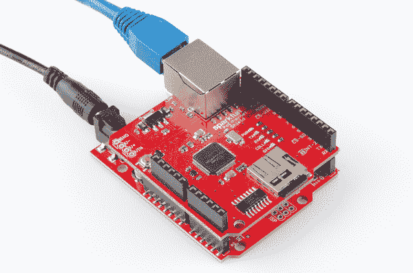

# RedBoard Qwiic 连接指南

> 原文：<https://learn.sparkfun.com/tutorials/redboard-qwiic-hookup-guide>

## 介绍

SparkFun RedBoard Qwiic 是 SparkFun 目录中 Arduino 兼容开发平台的最新版本。这款*经典* [SparkFun RedBoard](https://www.sparkfun.com/products/13975) 的更新版本对其前身进行了一些关键改进(参见[硬件概述](https://learn.sparkfun.com/tutorials/redboard-qwiic-hookup-guide#hardware-overview))。然而，就像最初的*spark fun red board 一样，它被设计成一个易于使用的学习平台，用于编码、物理计算和项目原型开发。这些技能在今天的教育和技术领域变得越来越重要。*

[](https://www.sparkfun.com/products/15123) 

将**添加到您的[购物车](https://www.sparkfun.com/cart)中！**

### [spark fun RedBoard Qwiic](https://www.sparkfun.com/products/15123)

[In stock](https://learn.sparkfun.com/static/bubbles/ "in stock") DEV-15123

SparkFun RedBoard Qwiic 是一款 Arduino 兼容开发板，内置 Qwiic 连接器，无需…

$21.5014[Favorited Favorite](# "Add to favorites") 49[Wish List](# "Add to wish list")** **[https://www.youtube.com/embed/DThndXAcnu8/?autohide=1&border=0&wmode=opaque&enablejsapi=1](https://www.youtube.com/embed/DThndXAcnu8/?autohide=1&border=0&wmode=opaque&enablejsapi=1)

本教程旨在让您熟悉新的 SparkFun RedBoard Qwiic，并帮助您开始使用它。首先，我们将指导您完成 [Arduino IDE(集成开发环境)软件](https://www.arduino.cc/en/Guide/HomePage)的安装，这是对主板进行编程的主要用户界面。接下来，我们将讨论主板的硬件和特性。最后，我们将带您看几个使用 Arduino IDE 的例子。

SparkFun RedBoard Qwiic 可以与现实世界的传感器进行交互，控制电机，显示信息，并进行近即时计算。它使任何人都能创造出独特、漂亮的项目，从简单到在液晶显示器上显示字符的 T2 或检测光线变化的 T4，再到复杂得多的项目，如物联网蜂窝设备...从简单的事情开始，一步一步来。).如果你熟悉最初的*spark fun red board 是如何工作的，你可能想浏览一下本教程的部分内容。*

### 所需材料/工具

要开始，你只需要几样东西:

*   SparkFun RedBoard Qwiic -你肯定需要这个；否则，你可能上错了教程(*眨眼*)。
*   [USB micro-B 线缆- 6 英尺](https://www.sparkfun.com/products/10215)-USB 接口有两个用途:它为电路板供电，并允许您向电路板上传程序。
*   安装了 Arduino IDE 的电脑——这就是我们如何对主板编程并与之连接。

**Troubleshooting Tip:** If you are not a technical or computer savy individual and you have your choice of computers, a **Windows 7 or 10** computer is highly recommended. You will usually run into the the least issues, if any, with these operating systems.

就是这些了...很简单，对吧？现在你将不能做太多，因为没有额外的传感器与物理世界互动。然而，你至少可以让 LED 闪烁一下，做一些数学计算。

[**跳线修改**](#Jumper_Materials)[Qwiic 示例](#Example_Materials)

***Click the buttons** above to toggle the **additional materials** based on the tasks you
wish to perform. Feel free to modify the items in your cart to fit your needs.*

#### 跳线修改

If you would like to modify the 3.3V/5V I/O jumper or A4/A5 Qwiic connector jumpers, you will need [soldering equipment](https://www.sparkfun.com/categories/49) and/or a [knife](https://www.sparkfun.com/categories/379).

[](https://www.sparkfun.com/products/14228) 

### [威勒 WLC100 焊台](https://www.sparkfun.com/products/14228)

[Out of stock](https://learn.sparkfun.com/static/bubbles/ "out of stock") TOL-14228

Weller 的 WLC100 是一款多功能的 5 瓦至 40 瓦焊台，非常适合业余爱好者、DIY 爱好者和学生。…

2[Favorited Favorite](# "Add to favorites") 17[Wish List](# "Add to wish list")[](https://www.sparkfun.com/products/9325) 

将**添加到您的[购物车](https://www.sparkfun.com/cart)中！**

### [无铅焊料- 100 克线轴](https://www.sparkfun.com/products/9325)

[In stock](https://learn.sparkfun.com/static/bubbles/ "in stock") TOL-09325

这是带有水溶性树脂芯的无铅焊料的基本线轴。0.031 英寸规格，100 克。这是一个好主意…

$9.957[Favorited Favorite](# "Add to favorites") 33[Wish List](# "Add to wish list")****[](https://www.sparkfun.com/products/14579) 

将**添加到您的[购物车](https://www.sparkfun.com/cart)中！**

### [芯片快克免清洗助焊剂笔- 10mL](https://www.sparkfun.com/products/14579)

[In stock](https://learn.sparkfun.com/static/bubbles/ "in stock") TOL-14579

这款来自 Chip Quik 的 10 毫升免清洗助焊剂笔非常适合您的所有焊接、脱焊、返工和回流目的！

$8.954[Favorited Favorite](# "Add to favorites") 36[Wish List](# "Add to wish list")****[](https://www.sparkfun.com/products/9200) 

将**添加到您的[购物车](https://www.sparkfun.com/cart)中！**

### [爱好刀](https://www.sparkfun.com/products/9200)

[In stock](https://learn.sparkfun.com/static/bubbles/ "in stock") TOL-09200

就像一把 Xacto 刀，只是更好。我们在处理多氯联苯时广泛使用这些技术。这些小刀子很适合切割…

$3.502[Favorited Favorite](# "Add to favorites") 18[Wish List](# "Add to wish list")****** ******#### Qwiic 示例

If you would like to follow along with the examples below to interact with the physical world, you will also need the following items:

[](https://www.sparkfun.com/products/14722) 

将**添加到您的[购物车](https://www.sparkfun.com/cart)中！**

### [【spark fun 距离传感器分线点- 4 米，VL53L1X (Qwiic)](https://www.sparkfun.com/products/14722)

[Out of stock](https://learn.sparkfun.com/static/bubbles/ "out of stock") SEN-14722

这种 SparkFun 距离传感器突破利用 VL53L1X 下一代 ToF 传感器模块给你高精度…

$23.5010[Favorited Favorite](# "Add to favorites") 42[Wish List](# "Add to wish list")****[](https://www.sparkfun.com/products/14427) 

将**添加到您的[购物车](https://www.sparkfun.com/cart)中！**

### [Qwiic 线缆- 100mm](https://www.sparkfun.com/products/14427)

[In stock](https://learn.sparkfun.com/static/bubbles/ "in stock") PRT-14427

这是一条 100 毫米长的 4 芯电缆，带有 1 毫米 JST 端接。它旨在将支持 Qwiic 的组件连接在一起…

$1.50[Favorited Favorite](# "Add to favorites") 32[Wish List](# "Add to wish list")**** ****### 推荐阅读

SparkFun RedBoard Qwiic 旨在成为一个初学者友好的微控制器平台。没有关于[欧姆定律](https://learn.sparkfun.com/tutorials/voltage-current-resistance-and-ohms-law)或者[电是如何工作的](https://learn.sparkfun.com/tutorials/what-is-electricity)的先天知识，你也可以开始(但是稍微了解一下也无妨！).以下是一些你应该熟悉的主题；然而，要使用主板的更高级功能，建议您仔细阅读**逻辑电平**和 **I ² C** 教程。

[](https://learn.sparkfun.com/tutorials/what-is-a-circuit) [### 什么是电路？](https://learn.sparkfun.com/tutorials/what-is-a-circuit) Every electrical project starts with a circuit. Don't know what a circuit is? We're here to help.[Favorited Favorite](# "Add to favorites") 82[](https://learn.sparkfun.com/tutorials/what-is-an-arduino) [### 什么是 Arduino？](https://learn.sparkfun.com/tutorials/what-is-an-arduino) What is this 'Arduino' thing anyway? This tutorials dives into what an Arduino is and along with Arduino projects and widgets.[Favorited Favorite](# "Add to favorites") 50[](https://learn.sparkfun.com/tutorials/logic-levels) [### 逻辑电平](https://learn.sparkfun.com/tutorials/logic-levels) Learn the difference between 3.3V and 5V devices and logic levels.[Favorited Favorite](# "Add to favorites") 82[](https://learn.sparkfun.com/tutorials/i2c) [### I2C](https://learn.sparkfun.com/tutorials/i2c) An introduction to I2C, one of the main embedded communications protocols in use today.[Favorited Favorite](# "Add to favorites") 128[](https://www.sparkfun.com/qwiic)

该板的一个新的高级特性是它利用了 [Qwiic 连接系统](https://www.sparkfun.com/qwiic)。我们建议您在使用之前熟悉一下**逻辑电平**和 **I ² C** 教程(如上),因为所有 **Qwiic** 传感器都使用一个 **I ² C** 通信协议。点击上面的横幅，了解更多关于 [Qwiic 产品](https://www.sparkfun.com/qwiic)的信息。

[https://www.youtube.com/embed/x0RDEHqFIF8/?autohide=1&border=0&wmode=opaque&enablejsapi=1](https://www.youtube.com/embed/x0RDEHqFIF8/?autohide=1&border=0&wmode=opaque&enablejsapi=1)

**Fun Fact:** Qwiic is a play on words between "quick" and I²C or "iic".

* * *

## 安装驱动程序

**Note:** The USB-to-Serial adapter IC, used on the RedBoard Qwiic, is different from what was used on the original RedBoard. **The new CH340C chip will require a different driver than the FTDI chip used on the original [RedBoard](https://www.sparkfun.com/products/13975)** because they are different chips made by separate manufacturers. **Please make sure to follow the [driver installation guide](https://learn.sparkfun.com/tutorials/how-to-install-ch340-drivers) before plugging this new board into your computer.**

SparkFun RedBoard Qwiic 使用的是由 [WCH](http://www.wch.cn/) 制造的 CH340C USB 转串行适配器。CH340C 芯片的驱动程序需要安装在您的计算机上。我们已经测试并确认该驱动程序可以在 Windows 7、Windows 10、Mac OSX High Sierra 和 Raspbian Stretch(2018 年 11 月 13 日发布)上运行。在所有操作系统上，如果您以前安装了 CH340G 驱动程序，则需要先卸载这些驱动程序，然后再更新到新的 CH340C 驱动程序。更多信息，请查看我们的[如何安装 CH340 驱动教程](https://www.sparkfun.com/ch340)。

[](https://learn.sparkfun.com/tutorials/how-to-install-ch340-drivers) [### 如何安装 CH340 驱动程序

#### 2019 年 8 月 6 日](https://learn.sparkfun.com/tutorials/how-to-install-ch340-drivers) How to install CH340 drivers (if you need them) on Windows, Mac OS X, and Linux.[Favorited Favorite](# "Add to favorites") 9

安装 CH340C 驱动程序可让您的电脑将 SparkFun RedBoard Qwiic 识别为设备，并通过 USB 连接与主板通信。你也可以在这里找到来自 WCH 的 CH340 驱动程序的最新版本。(*他们的大部分网页都是中文的，但是如果你使用 Chrome 浏览器，你应该可以选择把网页翻译过来。*)

## 安装 Arduino IDE

### 下载/安装 Arduino

你可以从他们的网站下载 Arduino IDE。他们有[安装说明](https://www.arduino.cc/en/Guide/HomePage)，但是我们也会检查安装过程。确保您下载的版本与您的操作系统相匹配。

[Click for Arduino IDE Download Page](http://arduino.cc/en/Main/Software)

安装过程相当简单，但会因操作系统而异。这里有一些提示可以帮助你。我们还写了一个单独的[安装 Arduino 教程](https://learn.sparkfun.com/tutorials/installing-arduino-ide)以防你卡住。

**Troubleshooting Tips:**

*   我们建议使用装有完整桌面操作系统的电脑，如 Windows 7/10 ( **避免** Windows 8，如果可以的话)、Mac OSX 和某些风格的 Linux(查看 [Arduino FAQ 页面了解兼容性](https://www.arduino.cc/en/Main/FAQ#toc12))。

*   如果你不是一个技术或电脑高手，但你有自己的电脑选择，我强烈推荐使用一台 **Windows 7 或 10** 电脑。使用这些操作系统，您通常会遇到最少的问题，如果有的话。

*   我们确实 **而不是** 建议使用 Chromebook、上网本、平板电脑、手机或 Arduino Web IDE。您将负责解决任何驱动程序或 Arduino Web IDE 问题。

*   截至撰写本教程时(2018 年 12 月 14 日)，Arduino IDE 的最新稳定版本是 1.8.5 版。我们建议使用该版本的 Arduino IDE 你可以在这里下载以前的版本。

*   在 Windows 10 上，我们做 **而不是** 推荐从 app store 安装 Arduino IDE。您可能会遇到问题，因为操作系统会自动更新到 Arduino IDE 的最新版本，这可能会有未知的错误(如版本 1.8.6 和 1.8.7 中的编译器错误)。

*   安装了 Raspbian 的 Raspberry Pi 用户应该使用 **Linux ARM** 下载。我们不建议使用命令行安装。它将安装 Arduino 的最老版本，这在安装新的板卡定义或库时毫无用处。

*   关于其他故障排除技巧，这里有一个来自 Arduino 的[故障排除指南。](https://www.arduino.cc/en/Guide/Troubleshooting)

[**Windows 7/10**](#Windows)[Mac OSX](#Mac_OSX)[**Linux**](#Linux)

***Click the buttons above** for OS specific instructions.*

### Windows 安装提示

The Windows version of Arduino is offered in two options: an installer or a zip file. The **installer** is the easier of the two options, just download that, and run the executable file to begin the installation.

[](https://cdn.sparkfun.com/assets/learn_tutorials/8/4/4/Win_10-_Installation_Diagram.png)
*Windows install steps. Click the image to get a bigger view.*
When you're prompted to install a driver during installation, select "Install". This will install drivers for Arduino specific boards (like the Uno, Nano, etc.) that you may use in the future.

*   如果你选择下载 Arduino 的 **zip 文件**版本，你需要自己解压文件。不要忘记你把文件解压到哪个文件夹！您需要运行文件夹中的可执行 Arduino 文件来启动 Arduino IDE。

*   在 Windows 10 上，有一个通过他们的应用商店安装 Arduino 的选项。我们不建议从 app store 安装 Arduino IDE。您可能会遇到问题，因为操作系统会自动更新到 Arduino IDE 的最新版本，其中可能有未知的错误。

### Mac 安装提示

The Mac download of Arduino is only offered in a zip file version. After the download is finished, simply **double-click the .zip file** to unzip it.

[](https://cdn.sparkfun.com/assets/3/4/1/7/b/52cc895fce395fe16e8b456a.jpg)
*Mac OSX Arduino.app*
Following that, you'll need to **copy the Arduino application into your applications folder** to complete the installation.

### Linux 安装技巧

As Linux users are no doubt aware, there are many flavors of Linux out there, each with unique installation routines. Check out the [FAQ section](https://www.arduino.cc/en/Main/FAQ#toc11) of the Arduino webpage for more details. Otherwise, you can also use the [Linux section of our Installing Arduino tutorial](https://learn.sparkfun.com/tutorials/installing-arduino/linux) for some helpful links for an assortment of Linux distributions.

##### 拉斯比恩拉伸

Raspberry Pi users with Raspbian installed should use the **Linux ARM** download. Do not use the command line installation process. For more information, please refer to this [blog post from Arduino](https://playground.arduino.cc/Linux/Raspbian).

##### Ubuntu 和 Debian

For Ubuntu and Debian users, installing Arduino should only need a simple "**apt-get**" command like:

```
sudo apt-get update && sudo apt-get install arduino arduino-core

```

##### 其他分布

Other Linux distros aren't too dissimilar from the Ubuntu and Debian instructions.

下载并安装好 Arduino 后，下一步就是插上电路板并进行测试！很快你就会闪烁发光二极管，阅读按钮，并做一些物理计算！

* * *

## 硬件概述

下面是一张带注释的图片，以及对 [SparkFun RedBoard Qwiic](https://www.sparkfun.com/products/15123) 所有重要功能的概述:

[](https://cdn.sparkfun.com/assets/learn_tutorials/8/4/4/Qwiic_Redboard_-_Hardware_Overview.png)***Click the buttons** below for more details.*

[**新特性**](#New_Features) [**尺寸**](#Size) [**微控制器**](#ATmega) [**电源/复位**](#Power) [**状态指示灯**](#LEDs) [**编程**](#Programming) [**引脚功能**](#Pin) [**引脚连接**](#Wiring) [**Qwiic 连接**](#Qwiic)

### 新功能

The new features of the SparkFun RedBoard Qwiic include:

*   一种新型串行 USB 转换芯片
*   一种改进的 AP2112 稳压器
*   一个 [Qwiic 连接器](https://www.sparkfun.com/products/14417)
*   可用 A4/A5 跳线
*   可用的电压电平跳线
*   一种改进的复位按钮
*   RX/TX LED 颜色变化

[](https://cdn.sparkfun.com/assets/learn_tutorials/8/4/4/Qwiic_Redboard_-_New_Features-1.png)
*New features of RedBoard Qwiic.*

#### 串行-USB 转换器芯片

The new CH340C IC allows the [SparkFun RedBoard Qwiic](https://www.sparkfun.com/products/15123) to utilize the USB micro-B connection and should reduce the need for users to manually install drivers. Newer operating systems should automatically recognize and install the drivers for the board.

#### AP2112 电压调节器

The AP2112 is a more robust **3.3V** regulator to provide more power to daisy chain multiple Qwiic devices. Unlike the MIC5205, which could only source about 150mA of current; the AP2112 can source up to **600mA** of current and should be able to handle most of your [Qwiic device](https://www.sparkfun.com/qwiic) needs.

#### Qwiic 连接器

This connector allows the [SparkFun RedBoard Qwiic](https://www.sparkfun.com/products/15123) to seamlessly interface with [SparkFun's Qwiic Ecosystem](https://www.sparkfun.com/qwiic).

#### A4/A5 跳线

Pins **A4** and **A5** are tied directly to the I²C bus. These jumpers can be used to disconnect the logic level converters from pins **A4** and **A5** so that they might be used independently from the [Qwiic system](https://www.sparkfun.com/qwiic) for analog readings.

#### 电压电平跳线

These jumpers allow users to easily switch from a **3.3V** to **5V** board. This allows the user to convert the board (and I/O pins) to either **3.3V** or **5V** based on their needs. Unlike the the *original* [SparkFun RedBoard](https://www.sparkfun.com/products/13975), you no longer need a logic level converter to interface directly to a **3.3V** device or sensor.

#### 复原按钮

The board also includes a new, more pronounced reset button that is easier to push. Anyone with "*fat fingers*" can relate to this struggle.[](https://cdn.sparkfun.com/assets/learn_tutorials/8/4/4/Qwiic_RedBoard_-_Reset_Button_Comparison-1.jpg)
*The more ergonomic reset button that is easier to press.*

#### RX/TX led

The TX LED is now green, instead of yellow and the RX LED is now yellow, instead of red.

### 规模

The dimensions for the board are approximately 2.7" x 2.1". The board uses female headers laid out in a standard configuration for Arduino shields. The barrel jack for power uses a standard 5.5mm outer diameter and 2.1mm inner diameter mating connection. The Qwiic connector uses a [4-pin JST SH type](https://www.sparkfun.com/products/14417) connector. There are also 4 mounting points on the board.

[](https://cdn.sparkfun.com/assets/learn_tutorials/8/4/4/RedBoard_Qwiic_Dimensions.PNG)
*Screen shot of RedBoard Qwiic board layout in Eagle. (**Click image** to enlarge.)*
For the more details on the board sizing and component placement please refer to the Eagle files provided.

[Download Eagle Files (ZIP)](https://cdn.sparkfun.com/assets/e/a/2/1/6/RedBoard-Qwiic.zip)
[Eagle](https://www.autodesk.com/products/eagle/free-download) is a free for educators, makers, and hobbyists (i.e. basically, anything not for commercial purposes). All measurements are accurate, excluding any manufacturing tolerances. (Unfortunately, we do not have any tolerance information available; you may need to just measure the board you purchase.)

### 微控制器

The microcontroller (ATmega328 IC) is the work horse of the [SparkFun RedBoard Qwiic](https://www.sparkfun.com/products/15123). The ATmega328 is an 8-bit AVR microcontroller manufactured by Atmel, now Microchip. Once an Arduino sketch is uploaded to the board, the program is stored in the memory of the ATmega328\. The microcontroller will then run/execute the program while the [SparkFun RedBoard Qwiic](https://www.sparkfun.com/products/15123) is powered.

[](https://cdn.sparkfun.com/assets/learn_tutorials/8/4/4/Qwiic_Redboard_-_ATmega328-2.JPG)
*Image of the ATmega328 IC.*

#### 时钟

An external 16 MHz crystal is used as the clock for the ATmega328.

#### 记忆

The ATmega328 has **Flash**, **SRAM** (Static Random Access Memory), and **EEPROM** (Electrically Erasable Programmable Read-Only Memory) memory.

*   32KB 闪存——存储 Arduino 草图/程序的地方(包括 512 字节的 Optiboot 引导加载程序)。
*   2KB SRAM -草图/程序运行时创建和操作变量的地方。
*   1KB EEPROM -可用于稳定的长期存储(用 [EEPROM 库](https://www.arduino.cc/en/Reference/EEPROM)读/写)。

The Flash and EEPROM memory are non-volatile; the data is still stored even when the board is no longer powered. The SRAM, on the other hand, is volatile and the data is only available while the board is powered.

**Troubleshooting Tips:**

*   EEPROM 可能因低功耗/掉电问题而损坏。
*   当你用完了 SRAM，草图上传后可能会失败或者行为怪异。如果您怀疑这是问题所在，请尝试注释掉任何长字符串或大型数据结构。如果草图开始正常运行，则您可能需要修改您的数据要求。

#### 引导装载程序

The Optiboot bootloader is a unique piece of firmware (512 bytes) at the end of the address space of the flash memory. The Optiboot bootloader is specifically configured for the ATmega328 to interface with the Arduino IDE, through a serial interface, to upload code. Without a bootloader, you would need to external programmer and program the microcontroller through the SPI interface (specifically, the ISP/ICSP headers).

For more details on the ATmega328, memory, and the bootloader check out these tutorials:

*   [Arduino 内存教程](https://www.arduino.cc/en/Tutorial/Memory)
*   [SparkFun EEPROM 教程](https://learn.sparkfun.com/tutorials/reading-and-writing-serial-eeproms)
*   [Arduino 引导程序页面](https://www.arduino.cc/en/Hacking/Bootloader?from=Tutorial.Bootloader)
*   [Arduino 作为 ISP 和 Arduino Bootloaders](https://www.arduino.cc/en/Tutorial/ArduinoISP)
*   [boot loaders 上的 StackExchange 论坛帖子](https://electronics.stackexchange.com/questions/27486/what-is-a-boot-loader-and-how-would-i-develop-one)

You can also find the datasheet for the ATmega328 from the [Microchip product page](https://www.microchip.com/wwwproducts/en/ATmega328).

### 电源/复位

The [SparkFun RedBoard Qwiic](https://www.sparkfun.com/products/15123) can be powered via the USB and/or barrel jack connectors. If you choose to power it via USB, the other end of the USB cable can be connected to either a **computer or a 5V (regulated)** [USB wall charger](https://www.sparkfun.com/products/11456). Otherwise, should you choose to use the barrel jack, any wall adapter connected to this jack should supply a **DC voltage between 7 and 15V**.

[](https://cdn.sparkfun.com/assets/learn_tutorials/8/4/4/Qwiic_Redboard_-_Power_Reset.png)
*Annotated image of RedBoard Qwiic with power and reset features highlighted.*

#### 电源 LED 指示灯

Just to the right of the word *RedBoard* on your circuit board, there’s a tiny LED next to the word **ON**. This green LED should light up whenever you plug your Arduino into a power source. If this light doesn’t turn on, there’s a good chance something is wrong.

#### 复原按钮

Just like the original Nintendo, the Arduino has a reset button. Pushing it will temporarily connect the reset pin to ground and restart any code that is loaded on the Arduino. This can be very useful if your code doesn’t repeat, but you want to test it multiple times. Unlike the original Nintendo however, blowing on the Arduino doesn’t usually fix any problems.[](https://cdn.sparkfun.com/assets/learn_tutorials/8/4/4/Qwiic_RedBoard_-_Reset_Button_Comparison-1.jpg)
*This updated version of the RedBoard has a more ergonomic reset button that is easier to press.*

#### VIN 的筒式千斤顶

The barrel jack accepts a male, center-positive connector with a 5.5mm outer diameter and 2.1mm inner diameter. Check out this [tutorial](https://learn.sparkfun.com/tutorials/connector-basics#power-connectors) for more information on power connectors.

Our [9V](https://www.sparkfun.com/products/298) and [12V](https://www.sparkfun.com/products/9442) power adapters are good choices if you're looking to power the board through the barrel jack. Any wall adapter connected to this jack should supply a **DC voltage between 7 and 15V** as specified by the electrical characteristics of the LM1117 voltage regulator used on the board. The input voltage pin VIN on the power headers is directly connected to the input voltage of the barrel jack.

**Troubleshooting Tips:**
The board could operate on an external supply of **6 to 20 volts**, but the recommended range is **7 to 12 volts**. (**If supplied with less than 7V, the 5V pin may supply less than five volts and the board may be unstable. Using more than 12V, the voltage regulator may overheat and damage itself and/or the board.*)

*For more technical details about voltage regulators and thermal dissipation, I suggest taking a look at these blog posts and tutorial:*

*   [根据皮特-电压调节器](https://www.sparkfun.com/news/1067)
*   [Enginursday:线性调节器热测试](https://www.sparkfun.com/news/2173)
*   [功率和散热](https://www.sparkfun.com/tutorials/217)
*   [Enginursday:调压器温度手机 App](https://www.sparkfun.com/news/2258)

#### 通用串行总线

A [USB micro-B cable](https://www.sparkfun.com/products/10215) is usually the easiest way to power the board, especially when you're programming it because the USB interface is required for uploading code too. A traditional USB port supplies a regulated **5V**, but is limited to about **500mA** (USB 2.0). Additionally, there is a fuse that protects your computer from shorts and overcurrent. If more than ~750mA is drawn through the USB port, it automatically throttles the current draw or disconnects power until the short/overload is removed. If you need more than that a barrel jack wall adapter is the best choice.[](https://cdn.sparkfun.com/assets/learn_tutorials/8/4/4/Qwiic_RedBoard_-_USB_Connector__No_Prying_.gif)
*An example of how to pull USB cable straight out.***Troubleshooting Tip:**
Users should take care **NOT** to pry or leverage on the connector when inserting/removing the USB cable. Doing so, **WILL** damage the board and cause the pads and/or traces to tear off as well. The cable should be removed by pulling straight outwards from the board.

The fuse can also be tripped with a high current draw and high ambient temperatures.

#### AP2112 电压调节器

The AP2112 is a more robust **3.3V** regulator to provide more power to daisy chain multiple Qwiic (I²C) devices. Unlike the MIC5205, which could only source about 150mA of current; the AP2112 can source up to **600mA** of current and should be able to handle the needs of your Qwiic devices.

**Troubleshooting Tip:**
If you need more power for your Qwiic devices, you can attach a separate power supply. However, it is recommended that you cut the 3.3V line of the Qwiic cable to the [SparkFun RedBoard Qwiic](https://www.sparkfun.com/products/15123). Leave the GND line alone, as that ground loops your system, providing a consistent reference voltage for your I²C signals. By cutting the 3.3V line, this allows you to power all your devices without straining the 3.3V regulator. For more details on voltage regulators, check out this [According to Pete](https://www.sparkfun.com/news/1067) blog post.

#### 电源接头

The power headers provides all your reference, input, and output, voltages.

[](https://cdn.sparkfun.com/assets/learn_tutorials/8/4/4/Qwiic_Redboard_-_Power_Header-1.png)
*RedBoard Qwiic Power Header*

*   **VIN**-Arduino 板使用外部电源时的输入电压。您可以通过此引脚提供外部电源电压，或者通过此引脚从电源插孔获取外部电源电压。如果仅通过 USB 连接供电，电压将在 5V 左右。
*   **5V** -该引脚从电路板上的调节器输出调节后的 5V 电压。主板可以通过 DC 电源插孔(7 - 12V)、USB 连接器(5V)或主板的 VIN 引脚(7-12V)供电。通过 5V 或 3.3V 引脚提供电压会绕过调节器，可能会损坏电路板。我们不建议这样做。
*   **3V3** -车载调节器产生的 3.3 伏电源。最大电流消耗为 600 mA。
*   **GND** -接地引脚。
*   **复位** -该引脚连接到微控制器的复位引脚和复位按钮。如果此引脚被切换为低电平或短接到 GND 引脚，将触发微控制器复位。

#### 双电源

It is fine to connect both a barrel jack and a USB connector at the same time. The [SparkFun RedBoard Qwiic](https://www.sparkfun.com/products/15123) has power-control circuitry to automatically select the best power source.

[](https://cdn.sparkfun.com/assets/learn_tutorials/8/4/4/Qwiic_RedBoard_-_Dual_Power.jpg)

*USB and barrel jack wires connected.*

### 状态指示灯 led

There are 4 status LEDs on the [SparkFun RedBoard Qwiic](https://www.sparkfun.com/products/15123) that indicate power, serial communication, and a test/status LED.

[](https://cdn.sparkfun.com/assets/learn_tutorials/8/4/4/Qwiic_Redboard_-_Status_LEDs.png)
*Status LEDs on the RedBoard Qwiic.***Note:**
There is a small change to the color of ther status LEDs from the *original* [RedBoard](https://www.sparkfun.com/products/13975). The power LED is green, the LED for Pin 13 is blue, the RX LED is yellow, and the TX LED is green. However, the color of the LED's don't really matter, the indication is based on whether the LED is on/off. The color differences only help to indicate which LED is on when the LED is blinks quickly or from a quick glance.

#### 力量

The first LED is the **power** LED. This LED indicates that there is a potential between the VCC and GND pins. A good secondary test for this status indicator is to use a multimeter to test the VIN, 5V, and 3.3V pins against the GND pin.

#### RX/TX

The next two status LEDs are the serial communication LEDs. These LEDs indicate that there is data moving between the serial UART **RX/TX** pins and the **USB-to-Serial Converter**. A good secondary test for this status indicator is to make sure that these LEDs are flashing during upload or any other [serial communication](https://learn.sparkfun.com/tutorials/serial-communication).

#### 第 13 针

The last indicator is the **Pin 13** LED. This is typically only used as a test LED to make sure that a board is working or for basic debugging. However, for the [SparkFun RedBoard Qwiic](https://www.sparkfun.com/products/15123), this LED also indicates if the presence of the bootloader. If the board was properly flashed, the LED should flash a few times on power up.**Troubleshooting Tips:**

*   新的电路板将被编程为在 RX 和 TX LEDs 之间循环的测试草图。
*   引脚 13 很难用作数字输入，因为状态 LED 和与其串联焊接的电阻会产生压降。如果引脚通过内部 20k 上拉电阻作为输入使能，它将始终读取低电平状态；预期的 5V(高)信号将改为大约 1.7V(低)。

    如果您必须使用引脚 13 作为数字输入，建议您将 **pinMode()** 设置为**输入**

    ```
    pinMode(13, INPUT);
    ```

    ，并使用外部下拉电阻。

### 编程；编排

There are two ways to program the [SparkFun RedBoard Qwiic](https://www.sparkfun.com/products/15123). The most common way for users is through the USB connection. The other slightly less common method is through the ISP headers or pins.

[](https://cdn.sparkfun.com/assets/learn_tutorials/8/4/4/Qwiic_Redboard_-_Programming.png)
*RedBoard Qwiic programming connections.*

#### USB 连接

The USB micro-B connector is the most convenient way to power and program the board. To program the board through the USB connection, you will need a [USB micro-B cable](https://www.sparkfun.com/products/10215) and there must be a bootloader flashed to the microcontroller (factory "*installed*"). For the SparkFun [SparkFun RedBoard Qwiic](https://www.sparkfun.com/products/15123), this is the same Optiboot bootloader from the Arduino UNO. For most users, the board will be programmed through a USB connection using the Arduino IDE.

[](https://cdn.sparkfun.com/assets/learn_tutorials/8/4/4/Qwiic_RedBoard_-_USB_Connector__No_Prying_.gif)
*An example of how to pull USB cable straight out.***Troubleshooting Tip:**
Users should take care **NOT** to pry or leverage on the connector when inserting/removing the USB cable. Doing so, **WILL** damage the board and cause the pads and/or traces to tear off as well. The cable should be removed by pulling straight outwards from the board.

##### CH340C USB 转串行转换器

Unlike the *classic* [SparkFun RedBoard](https://www.sparkfun.com/products/13975), that uses an FTDI IC; this board uses the CH340C IC for USB-to-serial conversion. One advantage is that it does not need a driver since most operating systems will have the drivers already installed. The chip is used to convert USB data coming to and from your computer into a serial protocol for the microcontroller.

**Troubleshooting Tip:**

*   每当你上传到你的板或发送串行数据，你应该看到 RX 和/或 TX 发光二极管闪烁。测试该器件功能的最佳方法是在计算机和电路板之间发送串行数据。
*   关于通过引导加载程序上传代码时 Arduino IDE 中会发生什么的更多细节，请查看这个伟大的[论坛帖子](https://arduino.stackexchange.com/questions/15936/what-happens-when-code-is-uploaded-using-the-bootloader)。

*For more tips and details on serial communication, read our [Serial Communication](https://learn.sparkfun.com/tutorials/serial-communication#common-pitfalls) and [Terminal Basics](https://learn.sparkfun.com/tutorials/terminal-basics/all#tips-and-tricks) tutorials.*

#### ISP 或 ICSP 连接器

A less common way for most users to program the microcontroller on their board, is to use the ISP header. This method programs a microcontroller directly through the **SPI pins**. A more experienced user, with a firm grasp on digital electronics and the microcontroller (datasheet), will probably use a software package like Atmel studio, which is easier to debug. The most common reasons for programming an AVR via an in-system programmer (ISP) are:

*   ISP 更快、更可靠——我们在大多数电路板的质量控制过程中使用这种方法。
*   微控制器上没有引导程序，或者您的主板没有正确刷新:

*   这可能是在没有引导加载程序的情况下对微控制器进行编程的唯一方法。

*   你想使用你自己的，定制的引导程序。
*   为各种设置配置熔丝位。
*   没有引导程序的程序，当你只需要一点点空间来加载你的程序。

Most AVRs are programmed through a **[Serial Peripheral Interface](https://learn.sparkfun.com/tutorials/serial-peripheral-interface-spi) (SPI)**. There are six unique signals required for communication between ISP and AVR.

[](https://cdn.sparkfun.com/assets/learn_tutorials/2/1/4/isp-pinout.png)

AVR ISP 引脚排列–俯视图。

On the [SparkFun RedBoard Qwiic](https://www.sparkfun.com/products/15123) the MOSI and D11 pins, MISO and D12 pins, and SCK and D13 pins are tied together. To program the [SparkFun RedBoard Qwiic](https://www.sparkfun.com/products/15123) through the ISP pins, you will want to **set the I/O jumper to 5V**. This will tie the **V[CC]** of the microcontroller to the **5V rail//pin** of the ISP header. Otherwise, you will probably run into issues and likely damage the I/O pins and/or the microcontoller chipset.

**Troubleshooting Tip:** Re-flashing the Bootloader
Often, this method is used as a last ditch effort, when after all else has failed to revive a board (do not attempt, unless you know what you are doing). Most likely your board isn’t bricked unless you have done something drastic like modified the fuses. In which case, reflashing the board probably won’t help you. However, if you have no options left and want to try to reflash the bootloader with an Uno or RedBoard. Here are links to some tutorials to get you started:

*   [SparkFun 正在安装 Arduino Bootloader 教程](https://learn.sparkfun.com/tutorials/installing-an-arduino-bootloader)
*   [Arduino 作为 ISP 和 Arduino Bootloaders](https://www.arduino.cc/en/Tutorial/ArduinoISP)
*   [Arduino 单片机编程教程](https://www.arduino.cc/en/Tutorial/ArduinoToBreadboard)
*   [Pi AVR 编程器连接指南](https://learn.sparkfun.com/tutorials/pi-avr-programmer-hat-hookup-guide)

**Time Capsule:** If you would like to take a look back, here is a tutorial from back in **June 2008** on [How to Get Code Onto a Microcontroller](https://www.sparkfun.com/tutorials/93). We have come so far since then!

Back then, it wasn't as easy to get into programming or processing. Without a USB-to Serial Converter or Bootloader, you needed an external ISP programmer to flash a microcontroller. You needed to use a lower level language and complex development platform to create and compile code for your microcontroller. Before flash memory, you could only program chips once.(**Make sure to upload the ISP sketch to the programming board. Lastly, be sure to double check the board options you are selecting so that the Arduino IDE uses the correct bootloader hex file.*)

### 引脚功能

All of the [SparkFun RedBoard Qwiic's](https://www.sparkfun.com/products/15123) pins are broken out to 0.1" spaced female headers (i.e. connectors) on the outer edges of the board. The pins are arranged into logical collections; there are headers dedicated to power inputs/outputs, analog inputs, and digital inputs.

[](https://cdn.sparkfun.com/assets/learn_tutorials/8/4/4/Qwiic_Redboard_-_Pin_Functions.JPG)
*RedBoard Qwiic pin functionality.*
**Note:** To learn more about analog vs. digital signals, check out this great [tutorial](https://learn.sparkfun.com/tutorials/analog-vs-digital).

* * *

#### 电源引脚

The power pins aren't really **I/O** (Input/Output) pins for the microcontroller; however, they are pertinent to the board. For more details on these pins, see the [**Power/Reset** section](#Power).

[](https://cdn.sparkfun.com/assets/learn_tutorials/8/4/4/Qwiic_Redboard_-_Power_Header-1.png)
*RedBoard Qwiic Power Header*
The **power header** is mostly full of voltage supply pins. These pins are traditionally **used as power sources** for other pieces of hardware (like LEDs, potentiometers, and other circuits).

*   **3.3V** -一个稳定的 3.3V 电压源。
*   **5V** -稳压 5V 电压源。
*   **GND** -电压源的公共接地或 0V 参考。
*   **VIN** -输入电压，如果您连接了墙壁适配器，它将等于您的输入电源电压。如果桶形插孔没有连接任何东西，并且你通过 USB 给电路板供电， **VIN** 应该在 5V 左右。
*   **复位** -复位引脚可以短接到 GND 引脚，以复位微控制器，类似于使用复位按钮。

* * *

#### 微控制器 I/O 引脚

All of the **I/O** pins on this board are **digital** **inputs** or **outputs** for the microcontroller (ATmega328). There are select pins, like the **Analog pins**, which have additional capabilities.

#### 数字输入输出

There are 20 **I/O** pins on this board that can be used as **digital** **inputs** or **outputs** for the microcontroller (ATmega328). This includes the pins labeled as **Analog**, which may be configured and used in the same manner as the **Digital pins**. These are what you connect to buttons, LEDs, sensors, etc. to interface the Arduino with other pieces of hardware.

##### 投入

[**pinMode()**](https://www.arduino.cc/reference/en/language/functions/digital-io/pinmode/)

**sketch**

**input**

**HIGH**

**LOW**

**Input**

**High Impedance**

**Troubleshooting Tips:**

*   如果一个输入引脚被读取，并且**浮动**(没有任何连接)，您将看到随机数据/状态。实际上，用一个**上拉电阻**(到 VCC)，或一个**下拉电阻**(到 GND)，将一个输入引脚连接到一个已知状态可能是有用的。
*   ATmega328 芯片内置 20K 上拉电阻，可通过将 pinMode()设置为 INPUT_PULLUP 进行配置。
*   引脚 13 很难用作数字输入，因为状态 LED 和与其串联焊接的电阻会产生压降。如果引脚通过内部 20k 上拉电阻作为输入使能，它将始终读取低电平状态；预期的 5V(高)信号将改为大约 1.7V(低)。如果您必须使用引脚 13 作为数字输入，建议您将**引脚模式()**设置为**输入**，并使用外部下拉电阻。

##### 输出

**output**

**HIGH**

**LOW**

**Output**

**Low Impedance**

**Troubleshooting Tip:**
The maximum current an I/O pin can source (provide positive current) or sink (provide negative current) is 40 mA (milliamps). For more details, you can refer to the [ATmega328 datasheet](https://www.microchip.com/wwwproducts/en/ATmega328) or this [reference page](https://playground.arduino.cc/Main/ArduinoPinCurrentLimitations). Attempting to run high current devices may damage the output the pin or entire ATmega328 chip.

**Note:** For more details about **digital** pins, check out this [reference page](https://www.arduino.cc/en/Tutorial/DigitalPins).

#### 附加功能

There are several pins that have special functionality in addition to general **digital I/O**. These pins and their additional functions are listed in the tabs below. For more technical specifications on the **I/O** pins, you can refer to the [ATmega328 datasheet](https://www.microchip.com/wwwproducts/en/ATmega328).

*   [模拟输入](#Analog-Input-tab)
*   [PWM 输出](#PWM-Output-tab)
*   [串行通信](#Serial-tab)
*   [SPI](#SPI-tab)
*   [I ² C](#I2C-tab)
*   [中断](#Interrupt-tab)

##### 模拟输入引脚

There are 6 **analog inputs** on the analog header. These pins all have 10-bit (10-bit = 1024 different values) [analog to digital converter](https://learn.sparkfun.com/tutorials/analog-to-digital-conversion) (ADC), which can be used to read in an analog voltage between 0 and VCC. These are useful if you need to read the output of a potentiometer or other analog sensors.

**Troubleshooting Tip:**
To take analog readings on pins A4/A5, the jumpers for the Qwiic connector need to be cut. Otherwise, the pullup resistors for the logic level converters will act as voltage dividers and the pins will read improper values at lower voltages.[](https://cdn.sparkfun.com/assets/learn_tutorials/8/4/4/Qwiic_Redboard_-_Analog_Inputs.JPG)
*RedBoard Qwiic analog input pins.*
**Note:**
The **AREF** pin provides a reference voltage for the analog inputs. This pin can be used to get a higher resolution at lower voltage levels. Be sure to read the **Notes and Warnings** on the [**analogReference()**](https://www.arduino.cc/reference/en/language/functions/analog-io/analogreference/) page.

Analog pins 4 and 5 also support I²C (TWI) communication using the Wire library.For more details on the analog inputs, check out these tutorials:

*   [SparkFun 模拟 Pin 教程](https://learn.sparkfun.com/tutorials/analog-to-digital-conversion)
*   [Arduino 模拟引脚教程](https://www.arduino.cc/en/Tutorial/AnalogInputPins)

##### 脉宽调制(PWM)输出引脚

Digital pins (3, 5, 6, 9, 10, and 11) marked with a tilde (~) are 8-bit [PWM capable outputs](https://learn.sparkfun.com/tutorials/pulse-width-modulation), which you can use to dim LEDs or run servo motors.[](https://cdn.sparkfun.com/assets/learn_tutorials/8/4/4/Qwiic_Redboard_-_PWM.png)
*RedBoard Qwiic PWM pins.*
**Troubleshooting Tip:**
Novice users often mistake PWM pins as an analog output. Although, it can somewhat mimic that functionality, it is not a true analog output.For more details on pulse width modulation, check out these tutorials:

*   [SparkFun PWM 教程](https://learn.sparkfun.com/tutorials/pulse-width-modulation)
*   [Arduino PWM 教程](https://www.arduino.cc/en/Tutorial/PWM)
*   [Arduino:Arduino PWM 的秘密](https://www.arduino.cc/en/Tutorial/SecretsOfArduinoPWM)

##### 串行通信引脚

Digital pins 0 (RX) and 1 (TX) are also dedicated serial communication pins ties to the USB-to-serial converter (CH340C). These pins are used to receive (RX) and transmit (TX) TTL serial data as well as program the microcontroller. Other digital pins can be use to emulate serial communication with [**SoftwareSerial()**](https://www.arduino.cc/en/Reference/softwareSerial).[](https://cdn.sparkfun.com/assets/learn_tutorials/8/4/4/Qwiic_Redboard_-_Serial.JPG)
*RedBoard Qwiic dedicated serial communication pins.*
**Troubleshooting Tip:**
If a device is communicating to the microcontroller over digital pins 0 and 1, while you are trying to upload code, you will run into an upload error. Disconnect the device before uploading code again. It may be easier to emulate serial communication with another set of pins to make debugging easier.For more details on serial communication, check out these tutorials:

*   [SparkFun 串行通信教程](https://learn.sparkfun.com/tutorials/serial-communication)
*   [Arduino 串行参考页面](https://www.arduino.cc/reference/en/language/functions/communication/serial/)
*   [Arduino 软件系列参考页](https://www.arduino.cc/en/Reference/SoftwareSerial)
*   [Arduino 软件系列教程](https://www.arduino.cc/en/Tutorial/SoftwareSerialExample)

##### SPI 通信引脚

Digital pins 10 (SS), 11 (MOSI), 12 (MISO), and 13 (SCK) support Serial Peripheral Interface (SPI) communication.[](https://cdn.sparkfun.com/assets/learn_tutorials/8/4/4/Qwiic_Redboard_-_SPI.JPG)
*RedBoard Qwiic SPI pins.*
**Note:**
Using the Serial Peripheral Interface, configures the SCK and MOSI pins to be directly managed by the SPI hardware. Therefore, while in use, pins 11 and 13 can't be used (i.e. the LED on pin 13 can no longer be used as a debug/status indicator.) Executing "SPI.end();" allows those pins 11 and 13 to be used as general I/O again.For more details on the serial peripheral interface, check out these tutorials:

*   [SparkFun SPI 教程](https://learn.sparkfun.com/tutorials/serial-peripheral-interface-spi)
*   [Arduino SPI 教程](https://www.arduino.cc/en/Tutorial/SPIIntro)
*   [Arduino SPI 参考页面](https://www.arduino.cc/en/Reference/SPI)
*   [Arduino SPI 设置参考页面](https://www.arduino.cc/en/Reference/SPISettings)

##### I ² C 通信引脚

Analog pins 4 (SDA) and 5 (SCL) support I²C (TWI) communication.[](https://cdn.sparkfun.com/assets/learn_tutorials/8/4/4/Qwiic_Redboard_-_I2C.JPG)
*RedBoard Qwiic I²C pins.*

##### Qwiic 系统

The Qwiic system is intended to be a quick, hassle-free cabling/connector system for I²C devices. The Qwiic connector is tied to the I²C pins via the A4 /A5 jumpers. Also, there are a set of logic level converters for the Qwiic system, which uses a 3.3V logic level.**Troubleshooting Tip:**
Be sure to double check that you are not trying to use and I²C device while you are trying use analog pin 4 or 5 to read analog data, you will run into issues. You can only do one or the other.For more details on the serial peripheral interface, check out these tutorials:

*   [SparkFun I ² C 教程](https://learn.sparkfun.com/tutorials/i2c)
*   [Arduino I ² C 参考页](https://www.arduino.cc/en/Reference/Wire)

##### 中断引脚

Interrupts allow you to *interrupt* the code running in your main loop and execute another set of instructions (also known as interrupt handler or interrupt service routine) before returning back to the main loop. Digital pins 2 and 3 can be configured to trigger an interrupt on a low value, a rising or falling edge, or a change in value.[](https://cdn.sparkfun.com/assets/learn_tutorials/8/4/4/Qwiic_Redboard_-_Interrupt.JPG)
*RedBoard Qwiic interrupt pins.*
For more details on the interrupts, check out these tutorials:

*   [SparkFun 中断教程](https://learn.sparkfun.com/tutorials/processor-interrupts-with-arduino)
*   [Arduino 中断教程](http://playground.arduino.cc/code/interrupts)
*   [Arduino attachinterrupt()参考页面](https://www.arduino.cc/reference/en/language/functions/external-interrupts/attachinterrupt)

### 连接到电路板

#### 跳线

All of the [SparkFun RedBoard Qwiic](https://www.sparkfun.com/products/15123)'s pins are broken out to 0.1"-spaced female headers (i.e. connectors) on the outer edges of the board. There are a variety of wires, connectors, and other items that can be inserted into these headers to interface with the Arduino. [Jumper wires](https://www.sparkfun.com/products/11026) are a good option if you want to connect the RedBoard up to other pieces of circuitry that may live on a breadboard.[](https://cdn.sparkfun.com/assets/0/9/9/4/e/5230c645757b7fa32c8b4568.png)
*A tangled assortment of [jumper wires](https://www.sparkfun.com/products/8431) run between the RedBoard headers and components on a [breadboard](https://www.sparkfun.com/products/11317). An [Arduino baseplate](https://www.sparkfun.com/products/11235) holds them all in one place.*
When connecting to the headers, be sure you are aware of the functionality of the pins you are using.**Troubleshooting tip:**
If you don't have jumper wires, you can [strip and cut](https://learn.sparkfun.com/tutorials/working-with-wire/how-to-strip-a-wire) some [solid core wire](https://www.sparkfun.com/products/11367) (20-24 AWG wire works best).

#### Arduino 护盾

Shields are another popular way to interface with the headers. These Arduino-shaped boards are stackable and connect to all four headers of the [SparkFun RedBoard Qwiic](https://www.sparkfun.com/products/15123) at once. Shields exist in hundreds of forms, they can add GPS, WiFi, MP3 decoding, and all sorts of other functionality to your Arduino. For more details on Arduino shields and shield assembly, please refer to this [Arduino Shields](https://learn.sparkfun.com/tutorials/arduino-shields) tutorial.

[](https://cdn.sparkfun.com/assets/f/9/8/b/b/5230c645757b7fb32d8b4568.png)
*An [Ethernet Shield](https://www.sparkfun.com/products/10864) stacks onto a RedBoard to help get it connected to the Internet.*
**Troubleshooting tip:**
Most shields are expecting a 5V board. Double check the documentation or datasheet for the shield you are using to verify what voltage it is expecting. You will need to adjust the I/O jumper accordingly.

### Qwiic 连接器

The most convenient feature of the board is the Qwiic connector that allows the [SparkFun RedBoard Qwiic](https://www.sparkfun.com/products/15123) to seamlessly interface with [SparkFun's Qwiic Ecosystem](https://www.sparkfun.com/qwiic).

### 什么是 Qwiic？

The Qwiic system is intended a quick, hassle-free cabling/connector system for I²C devices. Qwiic is actually a play on words between "quick" and I²C or "iic".

[https://www.youtube.com/embed/x0RDEHqFIF8/?autohide=1&border=0&wmode=opaque&enablejsapi=1](https://www.youtube.com/embed/x0RDEHqFIF8/?autohide=1&border=0&wmode=opaque&enablejsapi=1)

#### Qwiic 系统的特点

*   [无焊接](#Soldering-tab)
*   [极化连接器](#Connector-tab)
*   [菊花链](#Daisy-tab)

## 远离你的烙铁。

电缆可以很容易地插入电路板之间，从而快速建立新的原型。我们目前提供三种不同长度的 qw IC 电缆以及一种试验板友好型电缆，可将任何支持 qw IC 的板连接到任何其他设备。最初，您可能需要将接头焊接到屏蔽上，以将您的平台连接到 Qwiic 系统，但一旦完成，就可以即插即用了！


连接到[光谱传感器分线点](https://www.sparkfun.com/products/14414)的 Qwiic 电缆

## 尽量减少你的错误。

有多少次你交换了试验板上的 SDA 和 SCL 线，希望传感器开始工作？Qwiic 连接器是极化的，所以你知道你会有正确的接线，每次，从一开始。

PCB 连接器的零件号为 SM04B-SRSS ( [数据表](https://cdn.sparkfun.com/assets/parts/1/2/2/8/9/Qwiic_Connector_Datasheet.pdf))或同等产品。电缆上使用的配套连接器的零件号为 SHR04V-S-B 或同等产品。这是一种常见的低成本连接器。


1 毫米间距，4 针 JST 连接器

## 轻松扩展。

是时候利用 I ² C 总线的力量了！大多数 Qwiic 板上有两个或更多的连接器，允许连接多个设备。


如上图所示:[红板](https://www.sparkfun.com/products/13975)、[光谱传感器分线点- NIR](https://www.sparkfun.com/products/14351) 、[光谱传感器分线点-可视](https://www.sparkfun.com/products/14347)和 [SparkFun GPS 分线点](https://www.sparkfun.com/products/14414)上的[Qwiic Arduino 屏蔽](https://www.sparkfun.com/products/14352)

#### 逻辑电平转换

There are logic level converters used on the Qwiic connector to maintain a 3.3V logic level on the I²C bus. They are tied directly to the VCC of the microcontroller and the 3.3V rail. Therefore, the board automatically does the logic level conversion for the I/O voltage selected.

[](https://cdn.sparkfun.com/assets/learn_tutorials/8/4/4/Qwiic_IO.PNG)
*RedBoard (Qwiic) schematic of voltage for logic level converters (click image for closer view).*

#### A4/A5 跳线

These jumpers directly disconnect the logic level converters and the Qwiic connector from the A4/SDA and A5/SCL pins.

[](https://cdn.sparkfun.com/assets/learn_tutorials/8/4/4/Qwiic_Redboard_-_Qwiic_Jumpers.JPG)
*A4/A5 or Qwiic jumpers.*
**Troubleshooting Tip:**
To take analog readings on pins A4/A5, the jumpers for the Qwiic connector need to be cut. Otherwise, the pullup resistors for the logic level converters will act as voltage dividers and the pins will read improper values at lower voltages.

##### 如何修改 A4/A5 跳线

You will need a [knife](https://www.sparkfun.com/categories/379) to modify the A4/A5 jumpers. To modify the jumper, located on the back of the board next to the Qwiic connector, you need to [cut the trace](https://learn.sparkfun.com/tutorials/how-to-work-with-jumper-pads-and-pcb-traces/all#cutting-a-trace-between-jumper-pads) between the two pads. Once you have cut the trace, the Qwiic connector and logic level conveters will be disconnected. To repair the connection, you just need to solder a jumper between the pads of both jumpers. Be sure to test the jumper with a multimeter to make sure you have a good soldered connection.

#### 添加外部电源

If you need more power for your Qwiic devices, you can attach a separate power supply. However, it is recommended that you cut the 3.3V line of the Qwiic cable to the [SparkFun RedBoard Qwiic](https://www.sparkfun.com/products/15123). Leave the GND line alone, as that ground loops your system, providing a consistent reference voltage for your I²C signals.

[](https://cdn.sparkfun.com/assets/learn_tutorials/8/4/4/Qwiic_RedBoard_-_Qwiic_Extra_Power.jpg)
*Cutting the 3.3V line of the Qwiic cable to the Qwiic connector.*
By cutting the 3.3V line, this allows you to power all your devices without straining the 3.3V regulator on the board. Since, all voltage regulators are slightly different and don't maintain a perfect 3.3 voltage, the 3.3V AP2112 regulator would be constantly battling the voltage regulator of your separate power supply to regulate *its* version of 3.3V. For more details on voltage regulators, check out this [According to Pete](https://www.sparkfun.com/news/1067) blog post.

### 针织套衫

There are 3 jumpers on the [SparkFun RedBoard Qwiic](https://www.sparkfun.com/products/15123). The two jumpers on the back of the board can be used to disconnect the Qwiic connector from the A4/SDA and A5/SCL pins. The last jumper, on the top of the board, allows users to change the voltage level of the microcontroller.

#### 使用 I/O 跳线

One of the great features of the [SparkFun RedBoard Qwiic](https://www.sparkfun.com/products/15123) is this **I/O jumper** that allows users to easily switch from a **3.3V** to **5V** board.

[](https://cdn.sparkfun.com/assets/learn_tutorials/8/4/4/Qwiic_Redboard_-_IO_Jumper.JPG)
*I/O jumper.*

##### 为什么这是一个重要的特性，它到底有什么作用？

This jumper allows users to easily convert the **I/O** pins to either **3.3V** or **5V logic levels** based on their needs. With the *original* [SparkFun RedBoard](https://www.sparkfun.com/products/13975), a 5V board, you would need logic level converter to interface directly to a 3.3V device or sensor.

##### 什么是逻辑电平？

The logic levels are a specific range of voltages, in which a device can recognize as HIGH or LOW signals.

[](https://cdn.sparkfun.com/assets/7/9/3/a/c/5V-logic-levels_fixed.png)

*ATmega328 Logic Levels*
In most electrical devices, the logic level used is the same as the **V[CC]** (**Voltage Common Collector**). For example, in the *original* [SparkFun RedBoard](https://www.sparkfun.com/products/13975), the **V[CC]** of the microcontroller is set by the LM117 **5V** linear voltage regulator. Therefore, the *original* [SparkFun RedBoard](https://www.sparkfun.com/products/13975) was a **5V board** that used **5V logic levels**.

[](https://cdn.sparkfun.com/assets/learn_tutorials/8/4/4/RedBoard_ATmega328-5V.PNG)
*RedBoard schematic with 5V regulator highlighted (click image for closer view).*
However, the *updated* [SparkFun RedBoard Qwiic](https://www.sparkfun.com/products/15123) has an IO voltage jumper that lets you connect the **V[CC]** of the microcontroller to the LM117 **5V** or AP2112 **3.3V** linear voltage regulator. Therefore, the logic level of the ATmega328 can be set to **3.3V** or **5V**. For more details see our [Logic Level](https://learn.sparkfun.com/tutorials/logic-levels) tutorial.

[](https://cdn.sparkfun.com/assets/learn_tutorials/8/4/4/RedBoard_ATmega328-IO.PNG)
*RedBoard (Qwiic) schematic with IO jumper highlighted (click image for closer view).*

##### 如何修改输入/输出

If you would like to modify the 3.3V/5V I/O jumper, you will need [soldering equipment](https://www.sparkfun.com/categories/49) and a [knife](https://www.sparkfun.com/categories/379). To modify the jumper, located next to the "I/O" silkscreen (pictured), you need to [cut the trace](https://learn.sparkfun.com/tutorials/how-to-work-with-jumper-pads-and-pcb-traces/all#cutting-a-trace-between-jumper-pads) between the center and the 5V pads. Once you have cut the trace, to select a specific I/O voltage, you just need to solder a jumper between the center pad and the correlating voltage pad of your choice. Be sure to test the jumper with a multimeter to make sure you have a good jumper soldered.

**Troubleshooting Tips:**

*   切割跳线时，向下切割(远离板上屏蔽的“I/O”丝)，这样会给你更多的回旋空间，以防你的刀在切割跳线时滑动，5V 线的走线比 I/O 走线离跳线更远一些。
*   要测试您是否完全切断跳线，您可以插回您的主板。如果跳线被完全切断，VCC 线将不会通电，并且没有任何状态指示灯会亮起。

**Programming via ISP:**
If you choose to program the [SparkFun RedBoard Qwiic](https://www.sparkfun.com/products/15123) through the ISP pins, you will want to **set the I/O jumper to 5V**. This will tie the **V[CC]** of the microcontroller to the **5V rail//pin** of the ISP header. Otherwise, you will probably run into issues and likely damage the I/O pins and/or the microcontoller chipset.

#### A4/A5 跳线

Since the [SparkFun's Qwiic System](https://www.sparkfun.com/qwiic), utilizes the I²C bus of the SparkFun RedBoard Qwiic, these jumpers are used to separate the board from the Qwiic connector are provided. These jumpers directly disconnect the logic level converters and the Qwiic connector from the A4/SDA and A5/SCL pins.

[](https://cdn.sparkfun.com/assets/learn_tutorials/8/4/4/Qwiic_Redboard_-_Qwiic_Jumpers.JPG)
*A4/A5 or Qwiic jumpers.*
**Note:** There are logic level converters used on the Qwiic connector to maintain a 3.3V logic level on the I²C bus. They are tied directly to the VCC of the microcontroller and the 3.3V rail. Therefore, the board automatically does the logic level conversion for the I/O voltage selected.

##### 如何修改输入/输出

You will need a [knife](https://www.sparkfun.com/categories/379) to modify the A4/A5 jumpers. To modify the jumper, located on the back of the board next to the Qwiic connector, you need to [cut the trace](https://learn.sparkfun.com/tutorials/how-to-work-with-jumper-pads-and-pcb-traces/all#cutting-a-trace-between-jumper-pads) between the two pads. Once you have cut the trace, the Qwiic connector and logic level converters will be disconnected. To repair the connection, you just need to solder a jumper between the pads of both jumpers. Be sure to test the jumper with a multimeter to make sure you have a good soldered connection.

* * *

## Arduino 示例

### 示例 1:上传 Blink

In this example we will go over the basics of the Arduino IDE and upload a sample code. This is a great way to test the basic functionality of any board to make sure it is working.

#### Arduino IDE

Now it's finally time to **open up the Arduino software**. You'll be presented with a window that looks a little something like this:

[](https://cdn.sparkfun.com/assets/8/4/5/b/d/52309c7e757b7f522d8b4567.png)
*Layout of the Arduino IDE.*
Before we can send the code over to the RedBoard, there are a couple of adjustments we need to make.

#### 选择一个电路板

This step is required to tell the Arduino IDE *which* of the [available Arduino boards](https://learn.sparkfun.com/tutorials/choosing-an-arduino-for-your-project), we are using. Go up to the **Tools** menu. Then hover over **Board** and make sure **Arduino/Genuino Uno** is selected.
[](https://cdn.sparkfun.com/assets/learn_tutorials/8/4/4/Board_Selection.PNG)
*Screen shot of **Board** selection.*

#### 选择一个串行端口

Next up we need to tell the Arduino IDE which of our computer's serial ports the RedBoard is connected to. For this, again go up to **Tools**, then hover over **Serial Port** and select your RedBoard's COM port.
[](ttps://cdn.sparkfun.com/assets/learn_tutorials/8/4/4/Serial_Port_Selection.PNG)
*Screen shot of **COM Port** selection.*
If you've got more than one port, and you're not sure which of the serial ports is your RedBoard, unplug it for a moment and check the menu to see which one disappears.

#### 眨眼素描

Code written for the Arduino IDE are referred to as sketches. All code in Arduino is C based. Let us upload a **Blink sketch** to make sure our new RedBoard setup is totally functional. Go up to the **File** menu in Arduino, then go to **Examples > 01.Basics > Blink** to open it up.
[](https://cdn.sparkfun.com/assets/learn_tutorials/8/4/4/Selecting_Sketch.PNG)
*Screen shot of **Blink sketch** selection.*

#### 上传！

With all of those settings adjusted, you're finally ready to upload some code! Click the **Upload** button (the right-pointing arrow) and allow the IDE some time to compile and upload your code. It should take around 10-20 seconds for the process to complete. When the code has uploaded, you should see something like this in your console window:
[](https://cdn.sparkfun.com/assets/learn_tutorials/8/4/4/Uploaded_Code.PNG)
*Screen shot of upload complete.*
And if you look over to the RedBoard, you should see the blue LED turn on for a second, off for a second, on for a second, off for a second...ad infinitum (at least until it loses power).[](https://cdn.sparkfun.com/assets/learn_tutorials/8/4/4/Qwiic_RedBoard_-_Blink_Example.gif)
*Expected response from board*
If you want to adjust the blink speed, try messing with the "1000" value in the `delay(1000);` lines. You're well on your way to becoming an Arduino programmer!

#### 出什么事了吗？

Uh oh! If you didn't get a "Done Uploading" message, and instead got an error, there are a few things we can double-check.

如果你的控制台窗口出现一个`avrdude: stk500_getsync(): not in sync: resp=0x00`错误。

[](https://cdn.sparkfun.com/assets/9/a/6/f/b/5230a5fa757b7fcf2d8b4567.png)
*Screen shot of **Error Message** in the **Console**.*
Either your serial port or board may be incorrectly set. Again, make sure **Arduino/Genuino Uno** is the board selection (under the "**Tools** > **Board**" menu). The serial port is usually the more common culprit here. Is the Serial Port correctly set (under the "**Tools** > **Serial Port**" menu)? Did the drivers successfully install? To double check your RedBoard's serial port, look at the menu when the board is plugged in, then unplug it and look for the missing port. If none of the ports are missing, you may need to go back to [driver installation](https://learn.sparkfun.com/tutorials/redboard-qwiic-hookup-guide#installing-drivers).

### 示例 2:qw IC 连接器

One of the great features of the RedBoard (Qwiic) is its ability to interface with I²C devices using our [Qwiic system](https://www.sparkfun.com/qwiic). The Qwiic system is a solderless connection system that allows users to seamlessly daisy chain multiple I²C devices with ease.

#### Qwiic 距离传感器

For this example, we will be running a basic sketch using the [SparkFun 4m Distance Sensor (VL53L1X)](https://www.sparkfun.com/products/14722). For more examples with this sensor, please refer to the [complete hookup guide](https://learn.sparkfun.com/tutorials/qwiic-distance-sensor-vl53l1x-hookup-guide).

#### 硬件装配

The wiring for this is simple. Use the Qwiic cable and connect the distance sensor to the board. That is it! The connections are polarized, so you don't have to worry about which side or connector you are using.[](https://cdn.sparkfun.com/assets/learn_tutorials/8/4/4/Qwiic_RedBoard_-_VL53L1X_Example.jpg)*Hardware assembly for [VL53L1X distance sensor](https://www.sparkfun.com/products/14722) example.*

让我们为距离传感器运行一个示例，看看它是如何工作的。

#### 安装 Arduino 库

**注意:**如果您之前没有安装 Arduino 库，请查看我们的 [Arduino 库安装指南。](https://learn.sparkfun.com/tutorials/installing-an-arduino-library)

首先，你需要一个 **Sparkfun VL53L1X** Arduino 库。您可以通过 Arduino 库管理器获得这些库。搜索 **Sparkfun VL53L1X Arduino 库**安装最新版本。如果你喜欢从 [GitHub 库](https://github.com/sparkfun/SparkFun_VL53L1X_Arduino_Library/)下载库并手动安装，你可以在这里下载:

[DOWNLOAD THE SPARKFUN VL53L1X ARDUINO LIBRARY (ZIP)](https://github.com/sparkfun/SparkFun_VL53L1X_Arduino_Library/archive/master.zip)

#### 示例 1 -阅读距离

To get started with this example, open up **File** > **Examples** > **SparkFun VL53L1x 4M Laser Distance Sensor** > **Example1_ReadDistance**. In this example, we begin by creating a **`SFEVL53L1X`** object called `distanceSensor` with our wire port, `Wire`, and then our shutdown and interrupt pins. Then we initialize our sensor object in the `setup()` loop. The code to do this is shown below.

```
language:c
#include <Wire.h>
#include "SparkFun_VL53L1X.h"

//Optional interrupt and shutdown pins.
#define SHUTDOWN_PIN 2
#define INTERRUPT_PIN 3

SFEVL53L1X distanceSensor(Wire, SHUTDOWN_PIN, INTERRUPT_PIN);

void setup(void)
{
  Wire.begin();

  Serial.begin(9600);
  Serial.println("VL53L1X Qwiic Test");

  if (distanceSensor.init() == false)
    Serial.println("Sensor online!");

} 
```

一旦我们初始化了传感器，我们就可以开始从中获取测量数据。为此，我们使用`distanceSensor.startRanging()`向传感器发送一些配置字节来启动测量。然后，我们等待数据可用，当数据可用时，我们读入数据，将其从毫米转换为英尺，并通过串口打印出来。执行此操作的`void loop()`函数如下所示。

```
language:c
void loop(void)
{
  distanceSensor.startRanging(); //Write configuration bytes to initiate measurement
  int distance = distanceSensor.getDistance(); //Get the result of the measurement from the sensor
  distanceSensor.stopRanging();

  Serial.print("Distance(mm): ");
  Serial.print(distance);

  float distanceInches = distance * 0.0393701;
  float distanceFeet = distanceInches / 12.0;

  Serial.print("\tDistance(ft): ");
  Serial.print(distanceFeet, 2);

  Serial.println();
} 
```

打开你的[串行监视器](https://learn.sparkfun.com/tutorials/terminal-basics/arduino-serial-monitor-windows-mac-linux)到波特率 **9600** 应该显示传感器和它所指向的物体之间的距离，单位是毫米和英尺。输出应该类似于下图。

[](https://cdn.sparkfun.com/assets/learn_tutorials/7/8/4/EX1.PNG)
*Distance readings in mm and ft*

## 解决纷争

下面，我们还提供了一些额外的故障排除技巧，用于解决您在使用新的 RedBoard (Qwiic)时可能遇到的问题。

1.  我们的一名员工根据最常见的客户问题编制了一份很棒的故障排除提示列表。这是开始的最佳地方。
2.  对于任何 Arduino IDE 的具体问题，我建议从他们的[故障诊断指南](https://www.arduino.cc/en/Guide/Troubleshooting)开始。

如果上面的故障诊断指南都没有帮助，这里有一些你可能错过的提示。(这些材料大部分是从教程中总结出来的。):

### 您使用的是推荐的计算机操作系统吗？

This board is not tested using the Arduino Web IDE. We do **NOT** recommend using a Chromebook, Netbook, tablet, phone, or the Arduino Web IDE in general. If you are here, try a **RECOMMENDED** operating system (see [Installing the Arduino IDE](https://learn.sparkfun.com/tutorials/redboard-qwiic-hookup-guide#installing-the-arduino-ide)).

### 我的板坏了:

Every board that **we** manufacture gets tested. If you didn't buy the board from us or one of our authorized distributors, it could be a knock-off. That being said, let's try a basic test to see if just the board is working. Disconnect everything that you have attached to the board; we just want to test the board.

1.  检查棋盘:
    检查棋盘，确保一切正常。使用[产品页面](https://www.sparkfun.com/products/15123)上的图片来验证组件的放置或对齐，以及不良的焊点或损坏。
2.  **通电并检查状态指示灯:**
    使用已知良好的 [USB micro-B 电缆](https://www.sparkfun.com/products/10215)，将您的主板插入计算机。是否有任何状态指示灯亮起(参见[硬件概述](https://learn.sparkfun.com/tutorials/redboard-qwiic-hookup-guide#hardware-overview))？
    *   新的电路板将被编程为在 RX 和 TX LEDs 之间循环的测试草图。
3.  **上传*眨眼*草图:**
    尝试上传眨眼草图。为什么眨眼？这是简单的，已知的工作方式(从示例文件)，你有一个指示灯。验证您是否看到状态 LED 正常闪烁，以及 Arduino IDE 是否显示“**完成上传”状态。**”
    *   再次检查您是否选择了正确的**板**和**串口**。
    *   对于已经运行 blink 示例的电路板，我建议更改时序参数，以检查电路板响应的变化。Verify that you see the status LED blinking properly and that the Arduino IDE shows a status of "

### 我在串行/COM 端口上看不到我的板:

If you don't see your board as an available COM port on the Arduino IDE:

*   尝试重新打开 Arduino IDE。
*   检查**设备管理器**以验证您的计算机是否识别该板。点击教程[安装驱动](https://learn.sparkfun.com/tutorials/redboard-qwiic-hookup-guide#installing-drivers)部分的**驱动验证**按钮。
*   如果您之前安装了**较旧的 CH340G 驱动程序**，您可能需要更新您的驱动程序。特别是在 MAC 电脑上，你需要删除以前的驱动程序并安装更新的驱动程序。
*   如果不是这样，您的问题可能与您的 USB 电缆有关。检查您使用的是能够传输数据的 USB 电缆。**有些线缆只有电源引脚连接，用于充电**。测试这一点的一个好方法是将一个设备插入你的 USB 电缆(比如电话)。如果它没有显示为设备或驱动器，那么尝试一个新的 [USB 微型 B 线](https://www.sparkfun.com/products/10215)。
*   这种情况很少发生，但是很容易检查。如果您使用的是 USB 3.0 端口(您会在 USB 插孔或坏的 USB 端口中看到蓝色的"*舌片*),请尝试不同的 USB 端口。您也可以尝试在不同的计算机上测试该板，以双重检查硬件不兼容性(通常是扩展板)。

### 上传至公告板时出错:

There are two types of issues that you will usually see in the console of the Arduino IDE, compile errors or upload errors. The easiest way to see where to start is by clicking the **Verify** button (check mark); the Arduino IDE will try to compile your code. A failure here is a compile error.

这需要一些经验，但是如果您从 Arduino IDE **首选项**中启用详细输出，它可能会为您提供问题所在的更多线索。

[](https://cdn.sparkfun.com/assets/learn_tutorials/8/4/4/Enable_Verbose_Output.png)*Screen shots of how to enable verbose output. **Click** to enlarge.*

*   **编译错误:**
    对于编译错误，有几种情况可能会导致问题。然而，99%的情况下，这是用户的错误。通常是你的代码或者你正在使用的库有问题。如果您手动在任何 Arduino 文件夹中添加文件/文件夹，偶尔会出现文件结构问题(仍然是用户错误)。
*   **上传错误:**
    上传错误变得更加棘手。你通常只会看到 Arduino IDE 试图多次上传到主板。这通常有几种不同的原因，通常在控制台中没有具体的错误。以下是一些常见的例子:
    *   错误的板选择:
        仔细检查你的板选择选项。如果您上传了错误的主板选择，您可能会覆盖主板上的引导加载程序或损坏微控制器。
    *   缺少引导加载程序:
        如果您的主板已经刷新了引导加载程序，那么 13 号引脚将在通电时闪烁几次。
    *   串行端口干扰:
        当您试图上传代码时，如果设备通过数字引脚 0 和 1 与微控制器通信。
    *   损坏的 USB 电缆或端口(参见上面的串行端口部分)。

### 其他提示:

*   如果输入引脚被读取且悬空(无任何连接)，您将看到随机数据/状态。实际上，用一个上拉电阻(连接到 VCC)或下拉电阻(连接到 GND)将输入引脚连接到一个已知状态可能很有用。

*   引脚 13 很难用作数字输入，因为状态 LED 和与其串联焊接的电阻会产生压降。如果必须将引脚 13 用作数字输入，建议将引脚模式()设置为输入，并使用外部下拉电阻。

*   I/O 引脚可以提供(提供正电流)或吸收(提供负电流)的最大电流为 40 mA(毫安)。你可以为 LED 灯或小型电机的小部分供电，但会遇到大功率设备的问题。

*   当您尝试使用模拟引脚 A4 或 A5 读取模拟数据时，请务必仔细检查您没有尝试使用 I ² C 设备。您将会遇到模拟读数似乎为恒定值的问题。因此，模拟读数不会反映从传感器输出看到的变化。你只能做这个或那个。

*   利用串行外设接口，将 SCK 和 MOSI 引脚配置为由 SPI 硬件直接管理。因此，在使用时，引脚 11 和 13 不能使用(即引脚 13 上的 LED 不能再用作调试/状态指示器。)执行“SPI . end()；”允许这些引脚 11 和 13 再次用作通用 I/O。

*   这个问题并不经常发生，但它可能是任意的，常见的:如果您的鼠标指针开始不稳定地移动，您的鼠标对您的输入没有反应，并且您的主板正在发送大量串行数据，那么您的计算机有可能将您的主板视为串行鼠标。解决方法是拔下您的主板，并在按住复位按钮的同时将其插回，让您的计算机有机会枚举 COM 端口。

## 资源和更进一步

既然你已经成功地开始使用你的 SparkFun RedBoard Qwiic，那么是时候把它整合到你自己的项目中了！有关更多信息，请查看以下资源:

*   [示意图(PDF)](https://cdn.sparkfun.com/assets/c/5/7/e/f/RedBoard-Qwiic.pdf)
*   [老鹰文件(ZIP)](https://cdn.sparkfun.com/assets/e/a/2/1/6/RedBoard-Qwiic.zip)
*   [CH340C 连接指南(针对驾驶员)](https://learn.sparkfun.com/tutorials/sparkfun-serial-basic-ch340c-hookup-guide)
*   [Qwiic 登陆页面](https://www.sparkfun.com/qwiic)
*   [GitHub 产品存储库](https://github.com/sparkfun/RedBoard/tree/vQwiic)
*   [SFE 产品展示区](https://www.youtube.com/watch?v=DThndXAcnu8)

* * *

你的下一个项目需要一些灵感吗？查看一些相关教程:

*   [Arduino IDE](#Arduino-IDE-tab)
*   [木板&盾牌](#Arduino-BS-tab)
*   [电路板功能](#Board-Functionality-tab)
*   [项目向导](#Project-Guides-tab)

#### SparkFun 教程

[](https://learn.sparkfun.com/tutorials/installing-an-arduino-library) [### 安装 Arduino 库](https://learn.sparkfun.com/tutorials/installing-an-arduino-library) How do I install a custom Arduino library? It's easy! This tutorial will go over how to install an Arduino library using the Arduino Library Manager. For libraries not linked with the Arduino IDE, we will also go over manually installing an Arduino library.[Favorited Favorite](# "Add to favorites") 22[](https://learn.sparkfun.com/tutorials/what-is-an-arduino) [### 什么是 Arduino？](https://learn.sparkfun.com/tutorials/what-is-an-arduino) What is this 'Arduino' thing anyway? This tutorials dives into what an Arduino is and along with Arduino projects and widgets.[Favorited Favorite](# "Add to favorites") 50[](https://learn.sparkfun.com/tutorials/installing-arduino-ide) [### 安装 Arduino IDE](https://learn.sparkfun.com/tutorials/installing-arduino-ide) A step-by-step guide to installing and testing the Arduino software on Windows, Mac, and Linux.[Favorited Favorite](# "Add to favorites") 16

#### Arduino 教程

*   [入门>简介:什么是 Arduino，我可以用它做什么？](https://www.arduino.cc/en/Guide/Introduction)
*   【Arduino 和 Genuino 产品入门
*   [Arduino 软件(IDE)](https://www.arduino.cc/en/Guide/Environment)
*   [Arduino 故障排除](https://www.arduino.cc/en/Guide/Troubleshooting)
*   Arduino:联系我们

#### Arduino 板卡比较指南

[](https://learn.sparkfun.com/tutorials/choosing-an-arduino-for-your-project) [### 为您的项目选择 Arduino](https://learn.sparkfun.com/tutorials/choosing-an-arduino-for-your-project) Examining the diverse world of Arduino boards and understanding the differences between them before choosing one for a project.[Favorited Favorite](# "Add to favorites") 5[](https://www.sparkfun.com/standard_arduino_comparison_guide) [### 标准 Arduino 比较指南](https://www.sparkfun.com/standard_arduino_comparison_guide) Arduino Comparison Guide Uno or Pro Mini? Bluetooth or wireless? When it comes to Arduinos, there are a lot of choices. We've compiled every Arduino development…[](https://learn.sparkfun.com/tutorials/redboard-vs-uno) [### RedBoard 对 Uno](https://learn.sparkfun.com/tutorials/redboard-vs-uno) In this tutorial we discuss the differences and similarities between the RedBoard and the Arduino Uno (SMD and PTH). The development platforms[Favorited Favorite](# "Add to favorites") 13

#### Arduino 盾牌

[](https://learn.sparkfun.com/tutorials/arduino-shields-v2) [### Arduino Shields v2](https://learn.sparkfun.com/tutorials/arduino-shields-v2) An update to our classic Arduino Shields Tutorial! All things Arduino shields. What they are and how to assemble them.[Favorited Favorite](# "Add to favorites") 5[**Beginner**](#Basic) [**Intermediate**](#Med) [**Advanced**](#Adv)

***Click the buttons above** for tutorials relating to the board functionality based on topic difficulty.*

* * *

#### 初学者

[](https://learn.sparkfun.com/tutorials/serial-communication) [### 串行通信](https://learn.sparkfun.com/tutorials/serial-communication) Asynchronous serial communication concepts: packets, signal levels, baud rates, UARTs and more 100[](https://learn.sparkfun.com/tutorials/analog-to-digital-conversion) [### 模数转换](https://learn.sparkfun.com/tutorials/analog-to-digital-conversion) The world is analog. Use analog to digital conversion to help digital devices interpret the world.[Favorited Favorite](# "Add to favorites") 58[](https://learn.sparkfun.com/tutorials/logic-levels) [### 逻辑电平](https://learn.sparkfun.com/tutorials/logic-levels) Learn the difference between 3.3V and 5V devices and logic levels.[Favorited Favorite](# "Add to favorites") 82[](https://learn.sparkfun.com/tutorials/analog-vs-digital) [### 模拟与数字](https://learn.sparkfun.com/tutorials/analog-vs-digital) This tutorial covers the concept of analog and digital signals, as they relate to electronics.[Favorited Favorite](# "Add to favorites") 66[](https://learn.sparkfun.com/tutorials/data-types-in-arduino) [### Arduino 中的数据类型](https://learn.sparkfun.com/tutorials/data-types-in-arduino) Learn about the common data types and what they signify in the Arduino programming environment.[Favorited Favorite](# "Add to favorites") 38[](https://learn.sparkfun.com/tutorials/how-to-work-with-jumper-pads-and-pcb-traces) [### 如何使用跳线焊盘和 PCB 走线](https://learn.sparkfun.com/tutorials/how-to-work-with-jumper-pads-and-pcb-traces) Handling PCB jumper pads and traces is an essential skill. Learn how to cut a PCB trace, add a solder jumper between pads to reroute connections, and repair a trace with the green wire method if a trace is damaged.[Favorited Favorite](# "Add to favorites") 11

#### 中级

[](https://learn.sparkfun.com/tutorials/serial-peripheral-interface-spi) [### 串行外设接口(SPI)](https://learn.sparkfun.com/tutorials/serial-peripheral-interface-spi) SPI is commonly used to connect microcontrollers to peripherals such as sensors, shift registers, and SD cards.[Favorited Favorite](# "Add to favorites") 91[](https://learn.sparkfun.com/tutorials/i2c) [### I2C](https://learn.sparkfun.com/tutorials/i2c) An introduction to I2C, one of the main embedded communications protocols in use today.[Favorited Favorite](# "Add to favorites") 128[](https://learn.sparkfun.com/tutorials/processor-interrupts-with-arduino) [### Arduino 处理器中断](https://learn.sparkfun.com/tutorials/processor-interrupts-with-arduino) What is an interrupt? In a nutshell, there is a method by which a processor can execute its normal program while continuously monitoring for some kind of event, or interrupt. There are two types of interrupts: hardware and software interrupts. For the purposes of this tutorial, we will focus on hardware interrupts.[Favorited Favorite](# "Add to favorites") 9

#### 高级

[](https://learn.sparkfun.com/tutorials/installing-an-arduino-bootloader) [### 安装 Arduino 引导程序](https://learn.sparkfun.com/tutorials/installing-an-arduino-bootloader) This tutorial will teach you what a bootloader is and why you would need to install or reinstall it. We will also go over the process of burning a bootloader by flashing a hex file to an Arduino microcontroller.[Favorited Favorite](# "Add to favorites") 25[](https://learn.sparkfun.com/tutorials/integrated-circuits) [### 集成电路](https://learn.sparkfun.com/tutorials/integrated-circuits) An introduction to integrated circuits (ICs). Electronics' ubiquitous black chips. Includes a focus on the variety of IC packages.[Favorited Favorite](# "Add to favorites") 46[](https://learn.sparkfun.com/tutorials/reading-and-writing-serial-eeproms) [### 读写串行 EEPROMs](https://learn.sparkfun.com/tutorials/reading-and-writing-serial-eeproms) EEPROM is a great way to add extra memory to your microcontroller project. Wait 'til you see how easy it is to use 14

#### 示例项目

[](https://learn.sparkfun.com/tutorials/assembly-guide-for-redbot-with-shadow-chassis) [### 带影子底盘的 RedBot 装配指南](https://learn.sparkfun.com/tutorials/assembly-guide-for-redbot-with-shadow-chassis) Assembly Guide for the RedBot Kit. This tutorial includes extra parts to follow to go along with the RedBot Inventor's Kit tutorial.[Favorited Favorite](# "Add to favorites") 13[](https://learn.sparkfun.com/tutorials/sparkfun-inventors-kit-experiment-guide---v40) [### SparkFun 发明家套件实验指南-4.0 版](https://learn.sparkfun.com/tutorials/sparkfun-inventors-kit-experiment-guide---v40) The SparkFun Inventor's Kit (SIK) Experiment Guide contains all of the information needed to build all five projects, encompassing 16 circuits, in the latest version of the kit, v4.0a.[Favorited Favorite](# "Add to favorites") 8[](https://learn.sparkfun.com/tutorials/redboard-edge-hookup-guide) [### 红纸板边缘连接导轨](https://learn.sparkfun.com/tutorials/redboard-edge-hookup-guide) The RedBoard Edge is a RedBoard that's been rebuilt around the idea that projects are eventually put into an enclosure to help clean up their look.[Favorited Favorite](# "Add to favorites") 1************