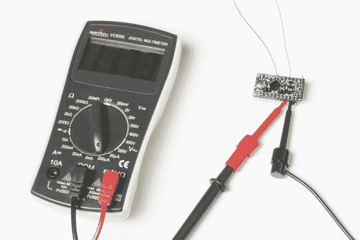
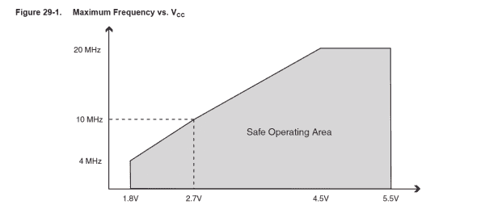
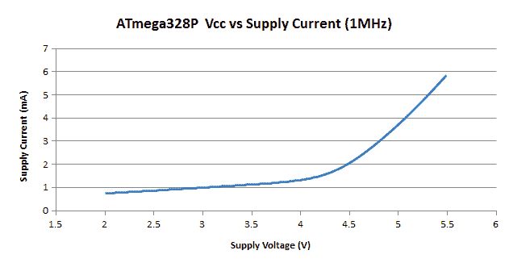
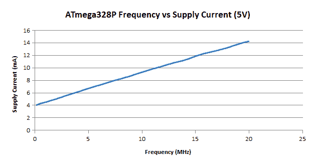
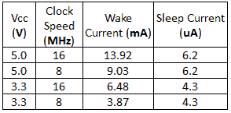

# 降低 Arduino 功耗

> 原文：<https://learn.sparkfun.com/tutorials/reducing-arduino-power-consumption>

## 介绍

[](https://cdn.sparkfun.com/assets/learn_tutorials/5/8/3/Low_Power.jpg)

当谈到便携式电子产品时，最重要的功能之一是如何最大限度地延长电池寿命。用于热门主板的 atmega 328 p T1 实际上非常耗电，比如 T2 的 spark fun red board T3、T4 的 Arduino Uno T5 和 T7 的 Pro Mini T7。RedBoard 和 Arduino Uno 的最低功耗约为 15mA，这听起来并不多，但正如您将在本指南中看到的，我们只需几个技巧就可以大幅降低功耗。在本指南中，我们将看看能否通过一些硬件和软件技巧将电源电流降至 10uA 以下。

### 推荐阅读

如果你以前没有使用过 Arduino 开发平台，在开始学习本教程之前，你可能想看看下面的教程。

*   [Arduino 是什么？](https://learn.sparkfun.com/tutorials/what-is-an-arduino)
*   [安装 Arduino IDE](https://learn.sparkfun.com/tutorials/installing-arduino)
*   [Arduino 对比指南](https://learn.sparkfun.com/tutorials/arduino-comparison-guide)

如果你以前从未使用过万用表，看看我们关于使用万用表测量电路各种元件的广泛指南。

[](https://learn.sparkfun.com/tutorials/how-to-use-a-multimeter) [### 如何使用万用表

#### 2015 年 1 月 9 日](https://learn.sparkfun.com/tutorials/how-to-use-a-multimeter) Learn the basics of using a multimeter to measure continuity, voltage, resistance and current.[Favorited Favorite](# "Add to favorites") 67

## 移除额外的硬件

每个集成电路(IC)都需要电源才能工作。通过减少所需的 IC 数量，您可以节省一点功耗。Arduino Uno 和 RedBoard 都有一个 USB 桥，可以将 USB 信号转换为 Arduino 的通用异步收发器(UART)可以使用的信号。RedBoard 上使用的 FT231x 仅消耗约 10mA。只需将 [SparkFun RedBoard](https://www.sparkfun.com/products/12757) 替换为 [5V Pro Mini](https://www.sparkfun.com/products/11113) ，不仅可以节省相当多的物理空间，还可以将电源电流从 15mA 降低到仅 4mA。

### 抛弃线性调节器

线性调节器很棒。它们价格低廉，仅用 3 个引脚(Vin、地 Vout)就可以将较高电压调节至较低电压。然而，线性调节器的缺点是，当输入电压和输出电压之间存在较大差异时，或者当电流较大时，调节器会变得非常热。您可以通过一个简单的等式来计算以热量形式浪费的功率:

**P[wasted] = (V[in] - V[out]) * I**

对于线性调节器，输入电流等于输出电流。线性调节器最多只有 70%左右的效率。电流越大，效率越低。

无需过多赘述，开关模式电源效率更高，因为输入电流不必与输出电流相同。轻负载时，开关调节器的效率超过 90%。使用开关调节器，不仅可以降低输入电压(使用降压转换器)，还可以提高电压(使用升压转换器)。其他 IC，如用在 [PowerCell](https://www.sparkfun.com/products/11231) 上的 TPS61200，非常适合电池供电的应用，因为它可以有效地降低或提升电池的电压！

## 降低电压

降低电流最简单的方法之一就是降低 Arduino 的电压。只要把电压从 5V 降到 3.3V，电流就从~4mA，降到~1mA！

降低电压确实有好处。在不降低时钟速度的情况下，过多降低系统电压可能会使微控制器开始表现异常。RedBoard、Uno 和 5V Pro Mini 都使用 16MHz 晶振。查看 328P 的[数据手册，我们可以看到，在 3.3V 时，推荐的最大频率约为 13MHz。时钟速度和系统电压之间的关系是我们的](https://www.sparkfun.com/datasheets/Components/SMD/ATMega328.pdf) [3.3V Pro Mini](https://www.sparkfun.com/products/11114) 使用 8MHz 时钟而不是 16MHz 时钟的原因。

**Note:** It is worth mentioning that I will sometimes run my ATmega328P at 16MHz while powering it with 3.3V and haven't had any issues, but your results may vary. We do not recommend running your microcontroller outside the specs listed in its datasheet.[](https://cdn.sparkfun.com/assets/learn_tutorials/5/8/3/D71A6.png)

下面我制作了一个图表，展示了如何通过降低电压来显著降低 Arduino 的功耗。在我的测试中，我上传了一张空白草图到 328P 上，运行频率为 1MHz。

[](https://cdn.sparkfun.com/assets/learn_tutorials/5/8/3/ATmega328P_IV_curve-large.png)

## 降低时钟速度

在 Arduino 不需要在短时间内执行大量指令的项目中，或者在时序不成问题的项目中，降低微控制器的时钟速度可以节省几毫安的电源电流。例如，在 5V 下运行 Arduino，并将时钟速度从 16MHz 降至 8MHz，可以将所需电流从 12mA 降至约 8.5mA。

为了更好地理解时钟速度与微控制器之间的关系，让我们看看下图。

[](https://cdn.sparkfun.com/assets/learn_tutorials/5/8/3/ATmega328P_Clock_Speed-large.png)

如你所见，降低时钟速度可以使电池寿命延长三倍。当然，这样做的代价是，您将无法每秒执行同样多的指令，对于某些应用程序来说，这种解决方案不是一个选项。

## 通过软件节能

到目前为止，我们已经讨论了如何降低 Arduino 的功率，但我们还没有讨论它为什么使用它所使用的功率。在 ATmega328P 内部，有一系列电路协同工作，以减轻处理器的工作负担，每个电路都消耗一定的功率。例如，Arduino 的`analogWrite()`功能并没有让处理器通过自己计算时钟周期来创建 PWM 信号。相反，Arduino 使用一个内置定时器来计算时钟周期，并向处理器发送中断请求。从那里，处理器停止它正在做的事情，并通过切换引脚的状态来处理中断。通过卸载一些工作，微控制器能够同时做多件事情。ATmega328P 内置的一些其他电路包括:

*   3 次
*   看门狗定时器
*   掉电检测
*   模数转换

这些独立的组件都需要电源才能工作，除非您手动禁用它们，否则它们将继续消耗电源。掉电检测会主动监控系统电压，确保其不会降至阈值以下。如果是这样，控制器断电，直到电压增加到阈值以上。顾名思义，模数转换器(ADC)将模拟电压(可以是从 0V 到 VCC 的任何值)转换为微控制器可以使用的数字值(10 位转换器为 0-1023)。如果您的项目不需要使用 ADC，禁用它将大幅降低功耗。

但是，如果您仍然需要 ADC 呢？幸运的是，有寄存器可以让你用软件禁用其中的一些电路。使用软件允许你在需要的时候启用你需要的电路，并且当你完成后，你可以再次禁用它们。ATmega328p 的数据手册中详细记录了所有寄存器，但是，如果直接写入寄存器让您感到不舒服，可以从下面的链接下载一个库。有关如何安装 Arduino 库的说明，请查看本教程。

[Download the Low-Power Library](https://github.com/rocketscream/Low-Power/archive/master.zip)

这个库允许你设置进入睡眠模式的时间，从几毫秒到无限长。它还允许您指定禁用微处理器的哪些部分，这使它成为一个非常强大和多功能的库，可以满足您的低功耗需求。

在第一个例子中，让我们将下面的草图加载到我们的 Arduino 上，它以 5V、16MHz 运行。为了了解睡眠模式下需要的电流有多少，我使用了一个基本的 Arduino，通过在试验板上使用 [ATmega328P](https://www.sparkfun.com/products/10524) 来最小化我使用的电流。

```
language:c
#include "LowPower.h"

void setup()
{
  pinMode(13,OUTPUT);
}

void loop() 
{
  digitalWrite(13,HIGH);
  delay(2000);
  digitalWrite(13,LOW);
  LowPower.powerDown(SLEEP_2S, ADC_OFF, BOD_OFF);
} 
```

在这张草图中，Arduino 的 LED 闪烁两秒钟，然后断电两秒钟，在此期间，ADC 和掉电检测(BOD)被禁用。断电时，Arduino 的电流从 14mA 下降到仅 6uA！如果我们使用前面章节中的一些其他省电技巧，我们可以在下表中看到睡眠电流有多低。

[](https://cdn.sparkfun.com/assets/learn_tutorials/5/8/3/ATmega328P_Low_Power-new.png)

如果您想知道为什么时钟速度不影响睡眠电流，在掉电期间时钟也被禁用。显然你不想让 Arduino 一直处于低功耗模式。但是，在不需要连续读取读数的项目中，关闭 Arduino 50%的时间，并使用我们介绍的技术，可以让电池持续七倍以上的时间！

## 资源和更进一步

有关低功耗模式和选项的更多信息，请参见 328P 的[数据表。](https://www.sparkfun.com/datasheets/Components/SMD/ATMega328.pdf)

要获得更多与电源相关的乐趣，请查看以下 SparkFun 教程。

[](https://learn.sparkfun.com/tutorials/how-to-power-a-project) [### 如何为项目提供动力](https://learn.sparkfun.com/tutorials/how-to-power-a-project) A tutorial to help figure out the power requirements of your project.[Favorited Favorite](# "Add to favorites") 67[](https://learn.sparkfun.com/tutorials/lilypad-basics-powering-your-project) [### LilyPad 基础:为您的项目提供动力](https://learn.sparkfun.com/tutorials/lilypad-basics-powering-your-project) Learn the options for powering your LilyPad projects, LiPo battery safety and care, and how to calculate and consider power constraints on your projects.[Favorited Favorite](# "Add to favorites") 8[](https://learn.sparkfun.com/tutorials/iot-power-relay) [### 物联网电源继电器](https://learn.sparkfun.com/tutorials/iot-power-relay) Using the ESP32 to make a web-configured timed relay.[Favorited Favorite](# "Add to favorites") 4[](https://learn.sparkfun.com/tutorials/hookup-guide-for-the-sparkfun-redboard-artemis-atp) [### SparkFun RedBoard Artemis ATP 的连接指南](https://learn.sparkfun.com/tutorials/hookup-guide-for-the-sparkfun-redboard-artemis-atp) Get started with the RedBoard Artemis ATP - all the functionality of the SparkFun Artemis module wrapped in the Mega Arduino Footprint[Favorited Favorite](# "Add to favorites") 2