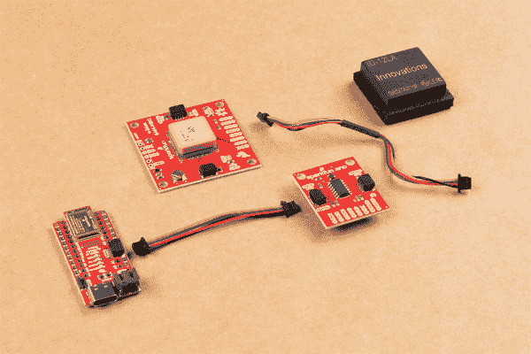

# RFID 初学者教程

> 原文：<https://learn.sparkfun.com/tutorials/rfid-beginners-tutorial>

## 介绍

在本教程中，我们将向您展示如何制作一个远程“打卡”来记录时间、位置和身份。

RFID 就像在一个小黑盒子前挥舞卡片一样神奇，所有的门都会打开让所有人通过。这项技术用途广泛，预计到 2023 年，它将在 2017 年支持 314.2 亿美元的市场。我们和其他人一样喜欢 RFID 技术，我们想和你分享它。在本教程中，我们将触及该技术的一些关键话题。然后，我们将致力于制作一个远程工作打卡系统，它可以记录时间、位置和身份。谁知道呢，也许你也会在 RFID 中找到自己的魔力。

### 什么是 RFID？

简而言之，RFID 技术是两个(或更多)电子组件之间的无线通信方法。有一种阅读器可以发射信号，并被动地读取输入信号。标签是包含标识或其他信息的设备。它们有两种类型，被动的或主动的。有源标签有自己的电源来主动发送它们包含的信息。无源标签通过来自阅读器的辐射信号“供电”,以传输独特的信息。无论哪种方式，都可以归结为两个设备像两个暴躁的人一样互相吼叫。这种传输是我们如何将这些信息传递给微控制器，以记录我们的“进出”。

### 所需材料

要跟随本教程，您将需要以下材料。你可能不需要所有的东西，这取决于你拥有什么。将它添加到您的购物车，通读指南，并根据需要调整购物车。

&nbsp