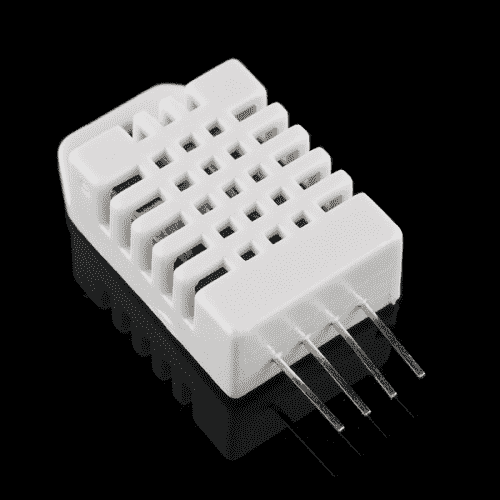

# RHT03 (DHT22)湿度和温度传感器连接指南

> 原文：<https://learn.sparkfun.com/tutorials/rht03-dht22-humidity-and-temperature-sensor-hookup-guide>

## 介绍

使用连接到 Arduino 的单线数字接口上的 [RHT03(又名 DHT22)](https://www.sparkfun.com/products/10167) 低成本传感器测量相对湿度和温度！

 

### [温湿度传感器- RHT03](https://www.sparkfun.com/products/retired/10167)

[Retired](https://learn.sparkfun.com/static/bubbles/ "Retired") SEN-10167

RHT03(也称为 DHT-22)是一款低成本湿度和温度传感器，配有单线数字接口。感觉…

33 **Retired**[Favorited Favorite](# "Add to favorites") 83[Wish List](# "Add to wish list")

### 所需材料

要跟随本教程，您将需要以下材料。你可能不需要所有的东西，这取决于你拥有什么。将它添加到您的购物车，通读指南，并根据需要调整购物车。