# 旋转开关电位计连接指南

> 原文：<https://learn.sparkfun.com/tutorials/rotary-switch-potentiometer-hookup-guide>

## 介绍

[旋转开关电位计](https://www.sparkfun.com/products/13099)是一个电路板，允许您给我们的一个 [10 位旋转开关](https://www.sparkfun.com/products/13253)添加一些电阻，将它变成一个具有十个离散步骤的电位计。

[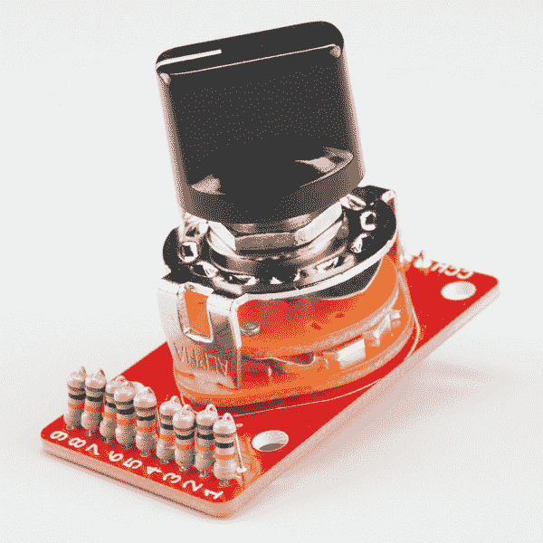](https://cdn.sparkfun.com/assets/learn_tutorials/3/4/1/product-shot.jpg)

如果你想知道为什么十步电位计会有用，请继续阅读！我们举了几个例子来说明该板比常规连续电位计更有用的应用。

### 在本教程中

我们先来看看什么是电位计，以及由此构建的几种常见电路。然后，我们将着手构建两个示例项目:一个使用微控制器，另一个在模拟演示中使用评估板。

### 材料

我们将在本连接指南中介绍几个不同的例子，它们都是由相同的基本零件制成的。如果您想跟进，您将需要以下组件:

*   [旋转开关电位器](https://www.sparkfun.com/products/13099)分线板。
*   一个 1x10 位置[旋转开关](https://www.sparkfun.com/products/13253)。
*   各种电阻器。
*   [直](https://www.sparkfun.com/products/116)或[直角](https://www.sparkfun.com/products/553)可咬合割台。
*   一个[控制旋钮](https://www.sparkfun.com/products/9998)或[鸡头旋钮](https://www.sparkfun.com/products/10000)。
*   数字项目使用一个[红板](https://www.sparkfun.com/products/12757)和一个[七段 LED 显示屏](https://www.sparkfun.com/products/8546)。
*   其中一个模拟项目使用了 SparkFun [声音探测器](https://www.sparkfun.com/products/12642)。

### 推荐阅读

*   我们的[分压器](https://learn.sparkfun.com/tutorials/voltage-dividers)教程介绍了一种通常使用电位计构建的电路。
*   [声音探测器连接指南](https://learn.sparkfun.com/tutorials/sound-detector-hookup-guide)解释了如何使用和配置声音探测器。
*   电位器是[电阻](https://learn.sparkfun.com/tutorials/resistors)的一种。
*   Geofex.com 的文章[Pots 的秘密生活](http://www.geofex.com/article_folders/potsecrets/potscret.htm)描述了电位计的内部机制，并探索了一些更深奥的品种。
*   维基百科关于[分贝](http://en.wikipedia.org/wiki/Decibel)的文章包含了一些相关的背景信息。

## 背景和理论

**电位计**(简称**电位计**)是一种电子元件，起可变电阻的作用。它们通常用以下符号绘制在示意图中。

[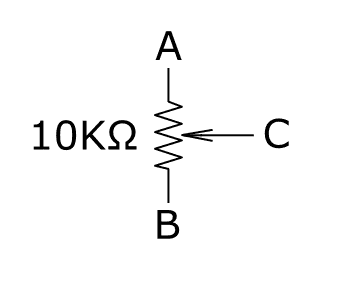](https://cdn.sparkfun.com/assets/learn_tutorials/3/4/1/pot-sym.png)

电位计中的主要元件是一个电阻，如图所示，位于端子 A 和 B 之间。还有第三个端子 C，它可以沿电阻移动。当它移动时，它和电阻两端之间的电阻会发生变化。从概念上讲，你可以这样想:

[](https://cdn.sparkfun.com/assets/learn_tutorials/3/4/1/pot-sym-moving.png)

在第一幅图中，移动元件位于电阻器的一端，端子 A 和 C 之间的电阻非常小，B 和 C 之间有 10K &ohm;。在中间的图中，移动端子位于电阻器的中心，因此从端子 C 到 A 和 B 有 5K &ohm;。最后，移动端子位于电阻器的远端，从 A 到 C 有 10K &ohm;,从 B 到 C 有 0 &ohm;

花盆有各种各样的形状和大小。最常见的可能是旋转电位计。

[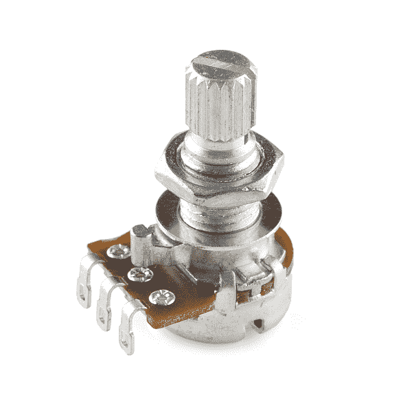](https://cdn.sparkfun.com/assets/learn_tutorials/3/4/1/rotary-pot.jpg)

另一种常见的电位计是线性电位计或滑动电位计。

[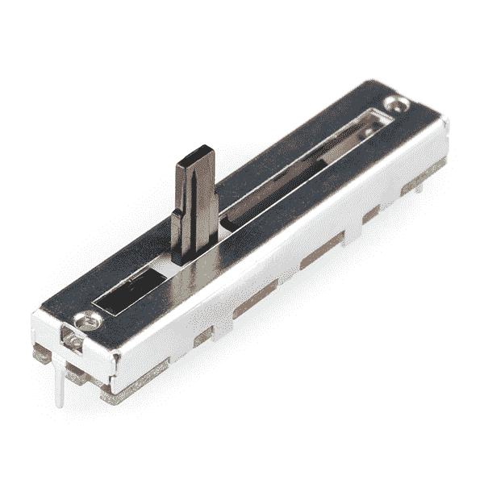](https://cdn.sparkfun.com/assets/learn_tutorials/3/4/1/slide-pot.jpg)

无论物理配置如何，移动终端被称为**游标**，而其他终端被称为**末端**，或者根据锅的物理方向来描述，例如对于旋转锅，顺时针的**和逆时针**的**，或者滑块上的**顶部**和**底部**。**

电位计有各种各样的形状、尺寸、电阻值和电子配置。

电阻相对于电刷位置的变化方式被称为坩埚的**锥度**。一个园艺品种锅通常有一个**线性**锥形，其中电阻的变化对应于雨刷的位置。另一个常见的锥形是**对数**或**音频**锥形，其中电阻的变化在一端比另一端移动得更快——它们通常被发现作为音量控制，其中对数锥形对应于我们的听觉灵敏度。

下图在左侧显示音频锥形，在右侧显示线性(*曲线“B(JIS:B)* ”)，以及其他几个锥形。

[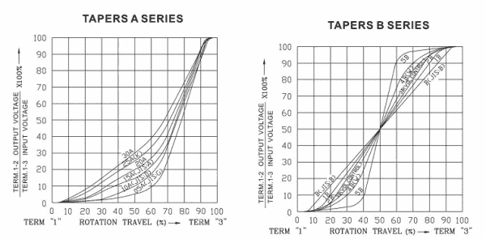](https://cdn.sparkfun.com/assets/learn_tutorials/3/4/1/tapers.png)*Potentiometer Tapers (image courtesy [Taiwan Alpha](http://www.taiwanalpha.com.tw/))*

## 电位计应用

使用 pots 构建了两个主要电路。

### 可变电阻器

如果我们将电位计放在电路中，只连接游标和一端，它就相当于一个可变电阻。总阻力与刮水器的位置直接相关。有几个不同的原理图符号用于表示可变电阻，如下所示。

[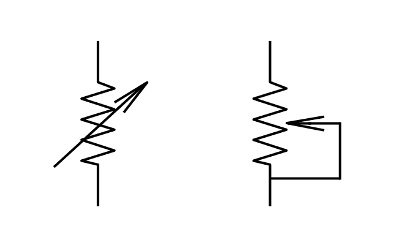](https://cdn.sparkfun.com/assets/learn_tutorials/3/4/1/var-resistor-sym.png)

如果您正在构建一个使用可变电阻的电路，请考虑如果游标与电阻元件失去接触，电路中可能会发生什么情况，例如，如果一粒灰尘落入花盆中。如果电阻像那样突然消失，有些电路会出故障。你会注意到，上面的第二个符号将游标连接到一个端子，如果游标失去接触，电路会跳到电位计的整体值，而不是开路。

### 分压器

另一种用电位计构建的常见电路是分压器。

[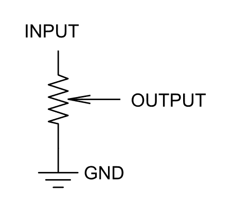](https://cdn.sparkfun.com/assets/learn_tutorials/3/4/1/divider-sym.png)

分压器对于降低信号电压很有用——顾名思义，它们将输入除以一个常数值。如果在运算放大器的反馈环路中使用分频器，可以将除法转换为乘法，构建一个可变增益放大器。

在我们的[分压器教程](https://learn.sparkfun.com/tutorials/voltage-dividers)中，我们有更多关于分压器电路的信息。

### 旋转电位计突破

有些应用需要难以找到的电位计，需要特定的电阻值或定制的锥度。旋转开关电位计板允许您填充自己的电阻，以帮助匹配普通零件不可用或不合适的情况。它们还可以用于需要不同步骤或选择的情况，例如能够一致地选择一个值。

组装的旋转开关电位计既可用作可变电阻，也可用作分压器。我们将在以下部分探讨这两种类型的电路。

## 装配

旋转开关电位计板的组装相当简单。

首先，将旋转开关焊接在电路板顶部的轮廓内。

[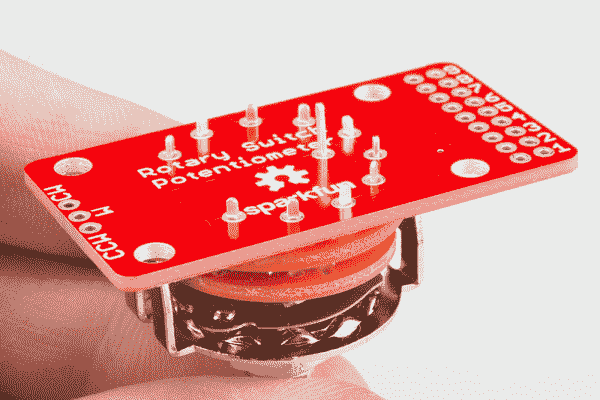](https://cdn.sparkfun.com/assets/learn_tutorials/3/4/1/assembly-add-switch.jpg)

接下来，在标记为`1`到`9`的位置焊接电阻。这些电阻像发夹一样弯曲，焊接在“直立”的位置。

[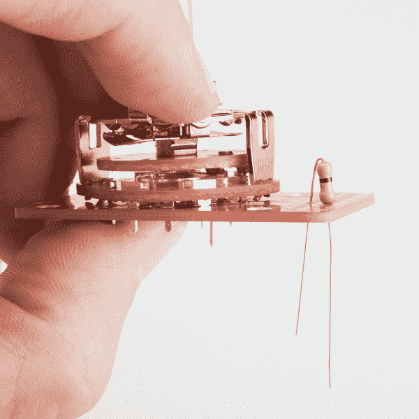](https://cdn.sparkfun.com/assets/learn_tutorials/3/4/1/assembly-add-resistor.jpg)

接下来，将导线或连接器连接到电路板另一端的三个引脚上。对于本连接指南，我们将使用可咬合接头的三个引脚。这些焊盘标有其功能:

*   `CCW`电阻串的逆时针端。
*   `W`雨刷。
*   `CW`电阻串的顺时针末端。

[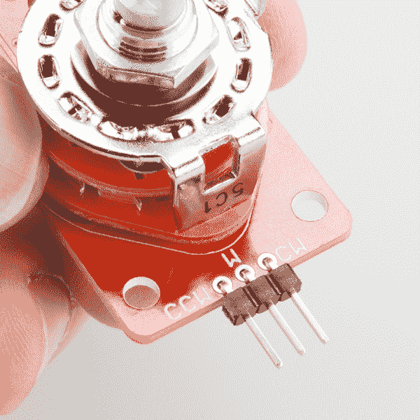](https://cdn.sparkfun.com/assets/learn_tutorials/3/4/1/assembly-add-header.jpg)

最后，用你选择的旋钮把它盖上。

[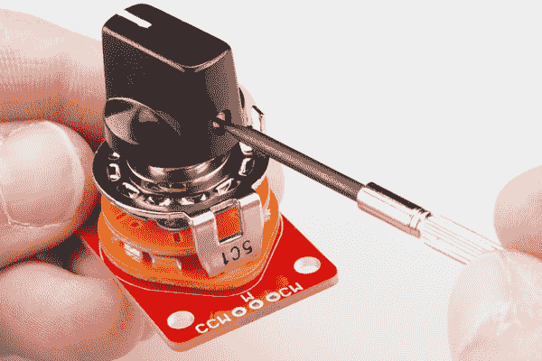](https://cdn.sparkfun.com/assets/learn_tutorials/3/4/1/assembly-add-knob.jpg)

完成后，它看起来会像这样

[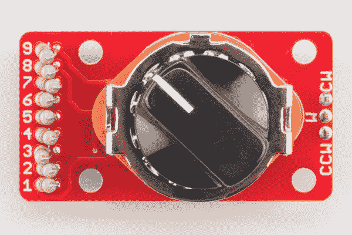](https://cdn.sparkfun.com/assets/learn_tutorials/3/4/1/product-front.jpg)

您会注意到，我们并没有准确解释您要使用哪些电阻。这才是这块板的真正目的！您可以选择符合您需求的电阻，并且可以根据您的目的选择不同的电阻。

## “备忘单”

为了帮助解决部署旋转开关电位计所涉及的数学问题，我们开发了一个电子表格来帮助计算电阻值。它在 [GitHub Repo](https://github.com/sparkfun/Rotary_Switch_Potentiometer) 的“理论”子目录中。

[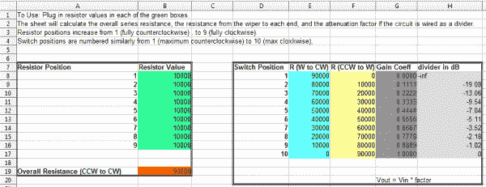](https://cdn.sparkfun.com/assets/learn_tutorials/3/4/1/Spreadsheet1.png)*Resistor Calculating Spreadsheet (Click to Enlarge)*

在绿色单元中输入电阻值，工作表将计算结果电路。出于讨论的目的，我们简单地为上面的每个电阻插入 10K &ohm;。

*   橙色单元格包含总串联电阻-这是等效常规电位计的值。九个 10K 电阻加起来总共是 90K。
*   蓝色和黄色单元格计算从游标(`w`端子)到每个末端触点(`ccw`为逆时针末端，`cw`为顺时针)的电阻。这些是描述电路的值，如果你把它用作可变电阻的话。
*   如果电路连接为分压器，深灰色单元显示算术增益系数。例如，如果开关在第 4 个位置，输出电压将是输入电压乘以 0.333。
*   浅灰色单元格以分贝表示增益系数。现在，请注意，它在位置 1 到 4 之间变化非常快，然后从 4 到 10 变化较慢。我们将探究其中的原因，并在后面的章节中提出解决方案。

#### 电子表格编号

该板使用一个十位开关，在安装电阻的挡块之间有九个位置。电阻位置都在电路板边缘对齐，并标有`1`至`9`。当您使用电子表格时，请注意左侧的方框表示九个电阻位置，而右侧的方框对应十个开关位置。两组数字都随着开关的顺时针旋转而增加。一是逆时针最远，十是顺时针最远，如下图所示。

[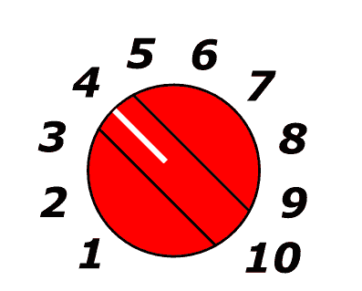](https://cdn.sparkfun.com/assets/learn_tutorials/3/4/1/knob-marks.png)

## 关于安装的一些注意事项

如果您要将旋转开关电位计构建到某个设备中，您需要考虑如何安装它。

要将交换机放入控制面板，您可以钻一个直径为 3/8 英寸(9.5 毫米)的孔，并使用六角螺母将交换机固定到面板上。PCB 宽 1 英寸，与开关本身的主体宽度相同。这使得它可以安装在控制面板后面，例如 19 英寸电信机架使用的 1.75 英寸垂直单元，或者 1.5 英寸宽度的 API 200 或 500 系列模块。

[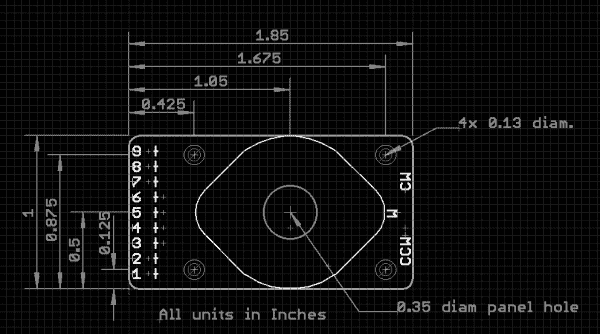](https://cdn.sparkfun.com/assets/learn_tutorials/3/4/1/dimensions.png)

如果你正在设计一个前面板，你可能想在开关周围标上数字或记号。为了将这些标记放在正确的位置，了解开关位置的角度很重要。在常规控制旋钮上，指示线与固定螺钉相对，旋钮通常与固定螺钉一起安装在开关轴的平面上。以这种方式安装旋钮，并查看左侧带有电阻的电路板，旋钮上的指针将指向钟面上的“半小时”间隔，从 7:30，大约到 4:30(或者，换句话说，以 30°的增量，从垂直方向+和-15°开始)。

[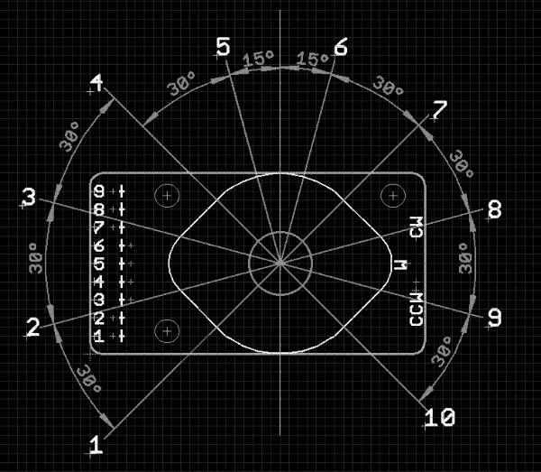](https://cdn.sparkfun.com/assets/learn_tutorials/3/4/1/knob-angles.png)

如果您没有面板，但想要固定主板，它也有四个安装孔，可以接受 4-40 个机器螺钉。当然，还有老的备用方案，双面胶，或者热熔胶！

了解如何安装电路板，有了电子表格，我们来研究一些使用旋转开关电位计的应用。

## 项目 I: 10 个项目选择器

我们将建立的第一个项目是基于我们收到的关于[十年阻力套件](https://www.sparkfun.com/products/13006)的评论。提出的想法是建立一个选择器，允许选择十个不同的步骤。这可能不是十进制盒的最佳应用，但却是旋转开关电位计板的绝佳范例。

我们将连接电路板作为 Vcc 和地之间的分压器，并添加电阻以产生 10 个偶数阶。十个偶数步意味着九个同值电阻。

我们不希望分压器消耗太多电流，所以我们希望总串联电阻相当高。使用 10K &ohm;电阻给我们总共 90K &ohm;。它将从 5V 的电压中消耗 55 A 的电流。

[](https://cdn.sparkfun.com/assets/learn_tutorials/3/4/1/Spreadsheet1.png)*10K Resistor Calculations (Click to Enlarge)*

在 5V 电压下，开关每次点击产生 0.555V 电压，即大约 113 个 ADC 计数。

[](https://cdn.sparkfun.com/assets/learn_tutorials/3/4/1/product-shot.jpg)

然后，将开关连接成分压器，并连接到 RedBoard 上的 ADC 0。我们在一些未使用的端口引脚上添加了[红色 7 段显示器](https://www.sparkfun.com/products/8546)来显示开关设置。下面的示例草图中对连接进行了描述。

[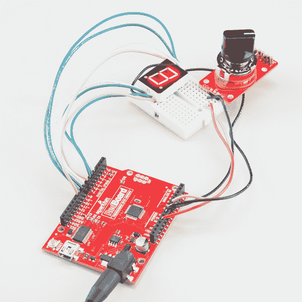](https://cdn.sparkfun.com/assets/learn_tutorials/3/4/1/redboard-example.jpg)

代码相当简单。

1.  它读取 ADC 输入。
2.  它执行一些数学运算，将 ADC 值转换为 0 至 9 的范围。
3.  它通过打开 7 段显示屏上的相应发光二极管来显示步数。

这是草图样本。

```
language:c
/******************************************************************************
one_of_ten.ino
Rotary Switch Potentiometer Example
By Byron Jacquot @ SparkFun Electronics
April 21, 2015
https://github.com/sparkfun/Rotary_Switch_Potentiometer

Demonstrates using the Rotary Switch Potentiometer breakout board 
with a microcontroller, to build a 10 position selector switch.

The Rotary Switch Potentiometer is a breakout board that adds 9 resistors to a
10 position rotary switch, to make a custom-taper, stepped potentiometer.  This
example uses 9 10KOhm resistors, and connects the rotary switch potentiometer
to an analog input.  The input is periodically scanned, and the current step
number is displayed on a 7-segment LED.

Development environment specifics:
This was developed using Arduino IDE 1.6.1
Using an Uno-compatible SparkFun RedBoard with a rotary switch potentiometer and
a 7-segment LED.

This code is beerware; if you see me (or any other SparkFun employee) at the
local, and you've found our code helpful, please buy us a round!

Distributed as-is; no warranty is given.
******************************************************************************/

/******************************************************************************
 Hardware connections
 --------------------

The test configuration was wired as follows:

The Rotary Switch Potentiometer board was populated with 10K resistors in 
every position.  It was connected to the RedBoard as follows:

RedBoard pin : Rotary Switch Potentiometer Pin
----------------------------------------------
GND          : CCW
A0           : W
5V           : CW

GPIO pins on the RedBoard drove the 7-segment display.  See the 7-segment 
display datasheet for the pin number assignment
(https://cdn.sparkfun.com/datasheets/Components/LED/YSD-160AR4B-8.pdf)

RedBoard pin : Rotary Switch Potentiometer Pin
----------------------------------------------
GND          : 3, 8 LED Anodes
4            : 1, segment E
5            : 2, segment D
6            : 4, segment C
7            : 5, decimal point
8            : 6, segment B
9            : 7, segment A
10           : 9, segment F
11           : 10, segment G

******************************************************************************/

// Bitmaps for display digits 0 through 9.
// Pin ordering corresponds to the connections described in the table above.
// This data is treated as active high - we'll invert it 
// when it's applied to the GPIO pins for the common-anode display
static const uint8_t font[10] = {0x77, 0x14, 0xb3, 0xb6, 0xd4, 0xe6, 0xe7, 0x34, 0xf7, 0xf4 };

// void drawLED(uint8_t val)
// Takes an input value and renders it on the 7-segment diaplay
// by driving each pin to the appropriate logic level for the character,
// as stored in the table above.
//
// It accepts a uint8_t as input, and truncates it to the 0-9 range.
void drawLED(uint8_t val)
{
  uint8_t idx = val % 10; // truncate input to 0 to 9 range.

  uint8_t mask = 0x01;
  for(uint8_t pin = 4; pin <= 11; pin++)
  {
    // Starting at output pin 4, step through to pin 11.
    // For each pin, check whether the corresponding bit in the font array
    // is set, and if so, illuminate that LED.  
    //
    // LED has inverse response - logic low turns it ON.
    // So if a bit in the font is high, set that pin low
    if(font[idx] & mask)
    {
      digitalWrite(pin, LOW);
    }
    else
    {
      digitalWrite(pin, HIGH);
    }

    mask <<= 1;
  }
}

void setup() {
// put your setup code here, to run once:

  Serial.begin(9600);

  // initialize pins 4 through 11 as outputs.  
  pinMode(4, OUTPUT);
  pinMode(5, OUTPUT);
  pinMode(6, OUTPUT);
  pinMode(7, OUTPUT);

  pinMode(8, OUTPUT);
  pinMode(9, OUTPUT);
  pinMode(10, OUTPUT);
  pinMode(11, OUTPUT);
}

void loop() 
{
  // put your main code here, to run repeatedly:
  uint16_t input;
  uint16_t val;

  // read the ADC
  input = analogRead(0);

  // Translate ADC value from 0-1023 to 0-9.
  // This implements the proportion
  // input/1023 = val/9.
  // One "step" of the pot is about 113 ADC counts.
  // We're adding 65 (1/2 of 113) to the input value, so that the 
  // input is in the middle of the window, rather than right at the edge, so values 
  // are stable and solid.
  val = (input+56)*9/1023;

  // Take the calculated value and display it.
  drawLED(val);
} 
```

为了扩展这个例子，我们可以添加几个开关和显示器，来构建一种数字十进制盒子——一个开关用于一位数字，一个开关用于十位数字，等等。

## 项目二:模拟振幅控制

旋转开关电位计在各种振幅控制情况下也很有用。

在许多振幅很重要的学科中，通常用分贝(简称 dB)来表示。我们不打算在这里深究细节——维基百科的文章要详细和完整得多。

当用分贝来描述事物时，有一些事情要记住。

1.  第一件事是分贝的行为是对数的，将大的变化减少到分贝标度的规则变化。在声学中，如果一个声音的压力加倍，它就会增加 6 分贝 SPL。每增加一倍，就增加 6 分贝。因为我们的听觉系统有非常宽的动态范围，我们可以感知超过 1，000，000:1 或 100 分贝 SPL 的声音。

2.  此外，术语“分贝”本身简单地描述了两个信号的相对振幅-分贝用于许多不同的学科，如声学、光学和无线电传输。为了识别这些差异，添加了不同的后缀。dB-SPL 描述声音的振幅，而 dBZ 用于描述天气雷达中的反射信号。不同 dB 测量的更完整列表可以在维基百科中找到。为了准确交流，一定要使用合适的后缀。

如果你还没有完全掌握分贝，请继续阅读，因为当我们探究下面的例子时，它们会变得更加明显。

### 分贝衰减

我们将利用旋转开关电位计构建的第一个幅度控制电路是一个电阻分压器，开关每次点击的步进约为 6 dB。被配置为将信号幅度降低特定量的分压器也被称为**衰减器**。

[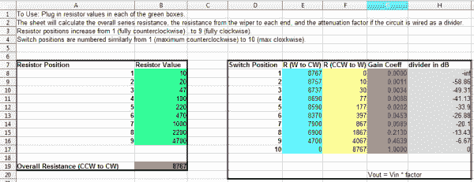](https://cdn.sparkfun.com/assets/learn_tutorials/3/4/1/Spreadsheet2.png)*Resistors For 6 dB Per Step Attenuator (Click to Enlarge)*

通过研究[电阻组](https://www.sparkfun.com/products/10969)的值，我们发现，如果每个电阻的值大约是前一个电阻的两倍，则每步大约会有 6 dB 的衰减。仅选择套件中的值，我们发现 10、22 和 47 欧姆的一系列电阻器是合理的，然后是 100、220 和 470 欧姆，等等。

[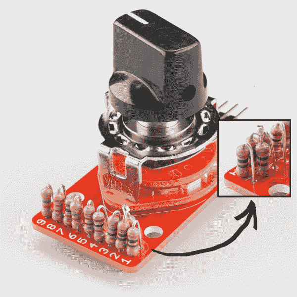](https://cdn.sparkfun.com/assets/learn_tutorials/3/4/1/attenuator-inset.jpg)

您会注意到，每步衰减(浅灰色栏)并不完全是 6 dB，但非常接近。由于仅限于套件中的电阻，我们只有几个值可供选择。你可能也已经注意到，该套件缺少一个 22 &ohm;电阻，作为替代，我们安装了两个串联的 10 &ohm;电阻(如插图所示)。如果想制造更精密的衰减器，可以改用 1%(甚至 0.1%)容差电阻，它有更多的值。

### 分贝增益

衰减器的反向是一个可变增益放大器。当分压器和衰减器只能降低电压时，通过增加一个放大器，我们也可以提高电压。

SparkFun [声音探测器](https://www.sparkfun.com/products/12642)是一个小电路板，带有一个麦克风、一个放大级和一些信号调节以指示声音的存在。通过安装一个电阻来改变放大级的增益，可以提高电路板的灵敏度。在[声音探测器连接指南](https://learn.sparkfun.com/tutorials/sound-detector-hookup-guide/configuration)中有建议固定电阻值的表格。

虽然我们可以为校准电阻安装一个常规的线性锥形电位计，但我们会发现大部分变化都集中在旋转的一端。剩下的旅程只会产生很小的影响。或者，我们可以反过来安装一个音频锥盆。这种变化会更明显，但是将锅*调高*(顺时针)会使电路*不那么灵敏——有点违反直觉。有“反向音频”锥形盆，但很难找到。相反，我们将使用旋转开关电位计板来构建增益控制。*

如果您仔细查看《声音检测器连接指南》中的表格，您会发现安装 R3 后，我们只能降低增益。为了获得既能上升又能下降的增益，我们将去掉 R3。接下来，让我们看看使声音检测器在很大范围内可配置的电阻值。与上面描述的衰减器一样，让我们以每步约 6 dB 为目标。

[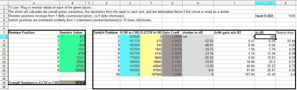](https://cdn.sparkfun.com/assets/learn_tutorials/3/4/1/Spreadsheet3.png)*Resistors For Sound Detector (Click to Enlarge)*

此表增加了一些新列，用于计算声音检测器的行为，包括算术增益、以 dB 为单位的增益以及步进间的相对变化。查看“步进增益”栏，您会注意到第一步非常大，因为逆时针方向最远的设置增益为零，实际上关闭了放大器。

在第 9 个位置，增益为 38.87 dB，非常接近平原声音检测器的 40 dB——我们在上面增加了一个步长，在下面增加了八个步长。

[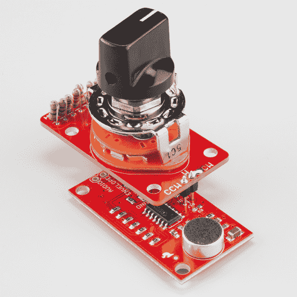](https://cdn.sparkfun.com/assets/learn_tutorials/3/4/1/sound-detector-example.jpg)

正如我们在可变电阻描述中提到的，您会注意到游标(W)和顺时针(CW)引脚是用一个焊料滴连接的。CCW 和 W 引脚通过 2 引脚接头安装在 R17 空间中，R3 被完全移除。

这种组合的表现与我们预期的一样——调低旋钮会降低灵敏度，这样探测器就不会触发更安静的声音。将旋钮转到最大使得探测器非常灵敏，以至于作者工作台上的空调背景噪音会间歇性地触发探测器。

## 资源和更进一步

从这里开始，由你来设计旋转开关电位计的用途。当您需要 10 个容易重复的设置、非标准电阻值或想要制作定制响应锥形时，这是一个方便的板。

### 资源

*   如果您仍然不相信旋转开关电位计适合您的应用，我们还有常规的[旋转](https://www.sparkfun.com/products/9939)和[滑动](https://www.sparkfun.com/products/11621)电位计。
*   如果你想在没有电阻的情况下使用[旋转开关](https://www.sparkfun.com/products/13253)，我们也有一个简单的[分线 PCB](https://www.sparkfun.com/products/13098) 。
*   旋转开关电位计 [GitHub 库](https://github.com/sparkfun/Rotary_Switch_Potentiometer)包含 PCB 设计文件、样本草图和用于计算电阻值的电子表格。

### 更进一步

*   Elliott Sound Products 有一篇[非常详细的文章](http://sound.westhost.com/pots.htm)介绍电位器的类型和应用。