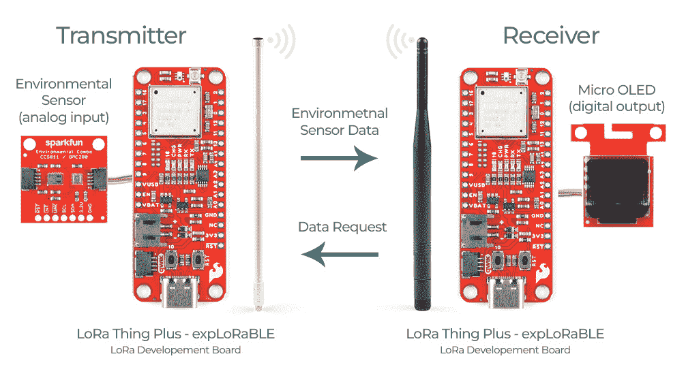

# 通过 LoRa 发送传感器数据

> 原文：<https://learn.sparkfun.com/tutorials/sending-sensor-data-over-lora>

## 介绍

我们在 SparkFun 的使命是展示使用不同无线解决方案发送传感器数据的最简单方法。到目前为止，我们已经一起探索了通过 wifi 发送传感器数据，但是更长距离的项目呢？当然，我们可以创建一个由许多电路板相互通信的网状网络，它*将*超级 rad，但是对于**远程**，为什么不使用 LoRa！在本教程中，我们将通过使用两个[spark fun LoRa Thing Plus-expLoRaBLE](https://www.sparkfun.com/products/17506)开发板和几个非常漂亮的天线来检查发送传感器数据和将数据输出到屏幕上需要什么；让我们走吧！

*硬件不符合比例*

## 所需材料

下面你可以找到所有你需要跟随本教程的部分；您可以添加您需要的零件，或者如果您还没有这些零件，您可以点击提供的愿望清单，一次性购买！我在这个列表中包括了两根 USB-C 电缆，因为我发现让它们同时监控发射机和接收机真的很有帮助，但只有一根也很好(接收机由电池供电，并通过有机发光二极管屏幕进行监控)。此外，LoRa 玻璃纤维天线确实附带了一个 N 至 RP-SMA 电缆接口，但我还是将该器件添加到了意向列表中，以供参考。

**Note:** For demonstration purposes we are using the [Atmospheric Sensor Breakout](https://www.sparkfun.com/products/15440). However, this sensor could be swapped out with many of our other [sensors](https://www.sparkfun.com/categories/23). In most cases, you can find code in our product hookup guides to modify the code given below if you would like to use a different sensor.