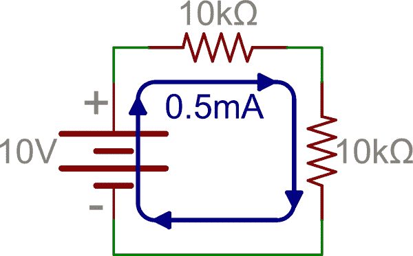

# 串联和并联电路

> 原文：<https://learn.sparkfun.com/tutorials/series-and-parallel-circuits>

## 串联和并联电路

对于初学者来说，简单电路(只有几个元件的电路)通常很容易理解。但是，当其他组件参加聚会时，事情会变得棘手。水流流向哪里？电压是怎么回事？这个可以简化一下更容易理解吗？无畏的读者，不要害怕。有价值的信息如下。

在本教程中，我们将首先讨论串联电路和并联电路之间的差异，使用包含最基本组件(电阻和电池)的电路来展示这两种配置之间的差异。然后，我们将探讨当您组合不同类型的元件(如电容和电感)时，串联和并联电路会发生什么。

### 本教程涵盖的内容

*   串联和并联电路配置看起来像什么
*   无源元件在这些配置中如何工作
*   在这些配置中，电压源如何作用于无源元件

### 推荐阅读

在本教程中开始构建电路之前，您可能需要先浏览这些关于基本元件的教程。

*   [什么是电](https://learn.sparkfun.com/tutorials/what-is-electricity)
*   [电压、电流、电阻和欧姆定律](https://learn.sparkfun.com/tutorials/voltage-current-resistance-and-ohms-law)
*   [什么是电路？](https://learn.sparkfun.com/tutorials/what-is-a-circuit)
*   [电容器](https://learn.sparkfun.com/tutorials/capacitors)
*   感应器
*   [电阻器](https://learn.sparkfun.com/tutorials/resistors)
*   [如何使用试验板](https://learn.sparkfun.com/tutorials/how-to-use-a-breadboard)
*   [如何使用万用表](https://learn.sparkfun.com/tutorials/how-to-use-a-multimeter)

### 录像

[https://www.youtube.com/embed/8lMO7VAyEkY?ecver=2](https://www.youtube.com/embed/8lMO7VAyEkY?ecver=2)

## 串联电路

### 节点和电流

在我们深入讨论这个问题之前，我们需要提到什么是**节点**。这没什么稀奇的，只是两个或更多组件之间的电连接的表示。当电路在原理图上建模时，这些[节点代表组件](https://learn.sparkfun.com/tutorials/how-to-read-a-schematic#junction_node)之间的连线。

*Example schematic with four uniquely colored nodes.*

理解串联和并联的区别已经成功了一半。我们还需要了解电流如何在电路中流动。[电流](../tutorials/voltage-current-resistance-and-ohms-law#current)在电路中从高[电压](../tutorials/voltage-current-resistance-and-ohms-law#voltage)流向低电压。一定量的电流将流过它到达最低电压点(通常称为地)的每一条路径。以上述电路为例，下面是电流从电池正极流向负极时的流动情况:

*Current (indicated by the blue, orange, and pink lines) flowing through the same example circuit as above. Different currents are indicated by different colors.*

请注意，在某些节点(如 R [1] 和 R [2] 之间)，流入的电流与流出的电流相同。在其他节点(特别是 R [2] 、R [3] 和 R [4] 之间的三向接点)，主(蓝色)电流分成两个不同的部分。*这就是*串联和并联的关键区别！

### 定义的串联电路

如果两个元件共享一个公共节点并且相同的电流流过它们，则这两个元件串联。这是一个包含三个串联电阻的电路示例:

在上述电路中，电流只有一种流动方式。从电池的正极端子开始，电流将首先遇到 R [1] 。电流将从那里直接流向 R [2] ，然后流向 R [3] ，最后回到电池的负极。注意，电流只有一条路径可循。这些部件是串联的。

## 并联电路

### 定义的并联电路

如果组件共享*两个*公共节点，则它们是并行的。这是三个电阻与一个电池并联的原理图示例:

电流从蓄电池正极端子流向 R [1] ...R [2] ，R [3] 。将电池连接到 R [1] 的节点也连接到其他电阻器。这些电阻的另一端同样连在一起，然后回接到电池的负极。电流返回电池之前有三条不同的路径，相关的电阻被称为并联电阻。

串联元件都有相等的电流流过，并联元件都有相同的压降-串联:电流::并联:电压。

### 串联和并联电路一起工作

从那里我们可以混合和匹配。在下一张图中，我们再次看到三个电阻和一个电池。从正极电池端子，电流首先遇到 R [1] 。但是，在 R [1] 的另一侧，节点分裂，电流可以同时流向 R [2] 和 R [3] 。然后，通过 R [2] 和 R [3] 的电流路径再次连接在一起，电流回到电池的负极端子。

本例中，R [2] 和 R [3] 相互并联，R [1] 与 R [2] 和 R [3] 的并联组合串联。

## 计算串联电路中的等效剩余

这里有些信息可能对你更有用。当我们像这样把电阻串联和并联在一起时，我们改变了电流通过它们的方式。例如，如果在 10k &ohm;电阻上有一个 10V 电源，[欧姆定律](../tutorials/voltage-current-resistance-and-ohms-law#ohms-law)表示有 1mA 电流通过。

如果我们将另一个 10k &ohm;电阻与第一个电阻串联，并保持电源不变，我们将电流减半，因为电阻增加了一倍。

换句话说，电流仍然只有一条路径，我们只是让电流更难流动。有多难？10k &ohm; + 10k &ohm; = 20k &ohm;。这就是我们计算串联电阻的方法——只需**将它们的值**相加。

更一般地说，这个等式是:任意数量的电阻的总阻值是它们的总和。

## 计算并联电路中的等效电路

并联电阻呢？这稍微复杂一点，但不会太多。考虑上一个例子，我们从一个 10V 电源和一个 10k &ohm;电阻开始，但这次我们增加了另外一个 10k &ohm;并联电阻，而不是串联电阻。现在电流有两条路径可供选择。由于电源电压没有变化，欧姆定律表明第一个电阻仍将消耗 1mA 电流。但是，第二个电阻也是如此，我们现在总共有 2mA 来自电源，是原来 1mA 的两倍。这意味着我们已经将总阻力减半。

虽然我们可以说 10k&ohm;| | 10k&ohm;= 5k&ohm;(“| |”大致翻译为“并联”)，但我们并不总是有两个相同的电阻。然后呢？

增加任意数量并联电阻的公式为:

如果您不喜欢倒数，我们还可以使用一种称为“积和”的方法，即并联两个电阻:

但是，这种方法仅适用于一次计算中的两个电阻。我们可以用这种方法组合两个以上的电阻，方法是取 R1 || R2 的结果，并计算与第三个电阻并联的值(也是积和)，但倒数法可能工作量较小。

## 实验时间-第一部分

你需要什么:

*   [一小撮 10k &欧姆；电阻器](https://www.sparkfun.com/products/11508)
*   一个[万用表](https://www.sparkfun.com/products/9141)
*   一块[试验板](https://www.sparkfun.com/products/9567)

让我们尝试一个简单的实验来证明这些东西是按照我们所说的方式工作的。

首先，我们将串联一些 10k &ohm;电阻，并观察它们以一种最不神秘的方式相加。[使用试验板](https://learn.sparkfun.com/tutorials/how-to-use-a-breadboard)，放置一个 10k &欧姆；用万用表测量如图所示的电阻和[。是的，我们已经知道它会说是 10k&ohm；，但这就是我们业内所说的“理智检查”。一旦我们确信这个世界自我们上次观察以来没有发生重大变化，就以类似的方式放置另一个，但每个电阻都有一条引线通过试验板电连接，然后再次测量。仪表现在应该显示接近 20k &欧姆；。](https://learn.sparkfun.com/tutorials/how-to-use-a-multimeter/measuring-resistance)

您可能会注意到，您测量的电阻可能与电阻器所说的不完全一致。电阻器有一定的**容差**，这意味着它们可以在任一方向上偏离一定的百分比。因此，你可能会读到 9.99k &欧姆；或者 10.01k &欧姆；。只要它接近正确的值，一切都应该工作正常。

读者应该继续这种练习，直到说服自己在再次做之前知道结果会是什么，或者他们耗尽了坚持试验板的电阻，无论哪一个先出现。

## 实验时间-第二部分

现在让我们用**并联**配置的电阻来试试。放置一个 10k &欧姆；如前所述，试验板中的电阻器(我们相信读者已经认为单个 10k &欧姆；电阻要测接近 10k &欧姆的东西；在万用表上)。现在放置第二个 10k &欧姆；第一个电阻器旁边的电阻器，注意每个电阻器的引线在电连接的行中。但是在测量组合之前，通过积和或倒数方法计算新值应该是多少(提示:它将是 5k&ohm；).然后测量。是不是接近 5k &欧姆的东西；？如果不是，请仔细检查插入电阻的孔。

现在用 3、4 和 5 个电阻重复这个练习。计算/测量值应分别为 3.33k &ohm;，2.5k &ohm;，2k &ohm;。一切都按计划进行了吗？如果没有，请返回并检查您的连接。如果是的话，精益求精！在我们继续之前去喝杯奶昔。你应得的。

## 串联和并联电阻的经验法则

有几种情况可能需要一些创造性的电阻组合。例如，如果我们试图设置一个非常具体的基准电压，您几乎总是需要一个非常具体的电阻比，其值不太可能是“标准”值。虽然我们可以获得非常高精度的电阻值，但我们可能不想等待 X 天才能发货，或者为无库存、非标准的电阻值付出代价。因此，必要时，我们总是可以构建自己的电阻值。

### 提示#1:相等的电阻并联

并联增加 *N* 等值电阻 *R* 得到 *R/N* 欧姆。假设我们需要一个 2.5k 的&欧姆；电阻器，但我们只有一个装满 10k 欧姆的抽屉；将它们中的四个并联起来，我们得到 10k 欧姆；/4 = 2.5k &欧姆；。

### 秘诀 2:宽容

知道自己能容忍什么样的宽容。例如，如果你需要一个 3.2k 的&ohm;电阻，你可以并联 3 个 10k 的&ohm;电阻。这将给你 3.3k &ohm;，与你需要的值有大约 4%的误差。但是，如果您正在构建的电路需要小于 4%的容差，我们可以测量我们的 10k &ohm;值，看看哪些是最低值，因为它们也有容差。理论上，如果 10k &ohm;电阻的存储都是 1%的容差，我们只能得到 3.3k &ohm;。但是众所周知，零件制造商会犯这种错误，所以多了解一下是有好处的。

### 技巧#3:串联/并联的额定功率

这种电阻的串联和并联组合也适用于[额定功率](../tutorials/resistors#power-rating)。假设我们需要一个 100 &欧姆的电阻；电阻额定为 2 瓦(W)，但我们得到的只是一堆 1k &欧姆；四分之一瓦(W)电阻(现在是凌晨 3 点，所有的激浪都不见了，咖啡也凉了)。可以组合 10 个 1k 的&欧姆；s 得到 100 &欧姆；(1k &欧姆；/10 = 100 &欧姆；)，额定功率将为 10x0.25W 瓦，或 2.5 瓦。这并不漂亮，但它将帮助我们完成最后的项目，甚至可能因为我们能够站着思考而获得额外的分数。

在考虑总等效电阻和额定功率时，并联不同阻值的电阻时，我们需要更加小心。这对读者来说应该是显而易见的，但是...

### 技巧#4:不同电阻并联

两个不同阻值电阻的组合电阻总是小于阻值最小的电阻。读者会惊讶于有多少次有人在他们的脑海中组合数值，并得出两个电阻中间的值(1k &ohm; || 10k &ohm;不等于 5k &ohm;左右的任何值！).总并联电阻将总是被拉得更接近最低电阻值的电阻。帮你自己一个忙，把第四条建议读 10 遍。

### 技巧#5:并行功耗

不同电阻值的并联组合所消耗的功率不会在电阻之间平均分配，因为电流不相等。使用前面的例子(1k &ohm; || 10k &ohm;)，我们可以看到 1k &ohm;将消耗 10k &ohm;的 10 倍电流。既然欧姆定律说[功率=电压 x 电流](../tutorials/electric-power#calculating-power)，那么接下来就是 1k &欧姆；电阻器将消耗 10k 欧姆的 10 倍功率；。

最后，技巧 4 和 5 的教训是，当并联不同阻值的电阻时，我们必须更加注意我们在做什么。但是当值相同时，技巧 1 和 3 提供了一些方便的快捷方式。

## 串联和并联电容器

组合电容就像组合电阻一样...只有相反。虽然听起来很奇怪，但这绝对是真的。为什么会这样？

电容器就是两个间隔很近的极板，它的基本功能是容纳一整束电子。电容值越大，它能容纳的电子就越多。如果板的尺寸增加，电容就会增加，因为物理上有更多的空间让电子悬挂出来。如果两个极板之间的距离越来越远，电容就会越来越小，因为它们之间的电场强度会随着距离的增加而减小。

现在，假设我们将两个 10 F 电容串联在一起，假设它们都已充电，并准备好对坐在你旁边的朋友放电。

记住，在串联电路中，电流只有一条通路。随之而来的是，从底部的帽中放出的电子数，将与从顶部的帽中放出的电子数相同。所以电容没有增加吧？

事实上，比那更糟。通过串联放置电容器，我们有效地将极板间隔开，因为两个电容器的极板之间的间隔加在一起。因此，我们没有 20 F，甚至没有 10 F。我们有 5 F。结果是，我们增加串联电容值的方式与增加并联电阻值的方式相同。积和法和倒数法都适用于增加串联电容。

似乎没有必要增加串联电容。但应该指出的是，我们确实得到了两倍的电压(或额定电压)。就像电池一样，当我们把电容器串联在一起时，电压就会增加。

增加并联的**电容**就像增加串联的电阻:数值只是相加，没有技巧。这是为什么呢？将它们平行放置有效地增加了板的尺寸，而没有增加它们之间的距离。面积越大，电容越大。简单。

## 实验时间-第三部分

你需要什么:

*   [一个 10k &欧姆；电阻器](https://www.sparkfun.com/products/11508)
*   [三个 100 华氏度的上限](https://www.sparkfun.com/products/96)
*   [3 芯 AA 电池座](https://www.sparkfun.com/products/10891)
*   [三节 AA 电池](https://www.sparkfun.com/products/9100)
*   [试验板](https://www.sparkfun.com/products/9567)
*   [万用表](https://www.sparkfun.com/products/9141)
*   [引线夹](https://www.sparkfun.com/products/11037)

让我们来看看一些串联和并联电容器的作用。这将比电阻的例子更棘手，因为用万用表直接测量电容更困难。

先说电容器从零伏充电会发生什么。当电流开始流入其中一根导线时，等量的电流会从另一根导线流出。如果没有电阻与电容串联，电流会相当大。在任何情况下，电流流动，直到电容器开始充电至所施加电压的值，更缓慢地流出，直到电压相等，此时电流完全停止。

如上所述，如果没有电阻与电容串联，电流消耗可能相当大，充电时间可能非常短(比如几毫秒或更短)。在这个实验中，我们希望能够看到电容器充电，因此我们将使用一个 10k &ohm;串联电阻来减缓充电速度，直到我们可以轻松看到为止。但首先我们需要讨论什么是 RC 时间常数。

上面的等式表明，以秒为单位的时间常数(称为τ)等于以欧姆为单位的电阻乘以以法拉为单位的电容。简单？没有吗？我们将在下一页演示。

## 实验时间-第 3 部分，续...

在本实验的第一部分，我们将使用一个 10K 电阻和一个 100 F 电阻(相当于 0.0001 法拉)。这两部分产生 1 秒的时间常数:

当通过 10k &ohm;电阻对我们的 100 F 电容充电时，我们可以预期电容上的电压在 1 个时间常数(即 1 秒)内上升到电源电压的 63%左右。经过 5 个时间常数(在这种情况下为 5 秒)后，电容大约 99%充电至电源电压，它将遵循类似下图的充电曲线。

现在我们知道了这些，我们将连接图中的电路(确保电容器的极性正确！).

用我们的万用表测量电压，打开开关检查电池组的输出电压。这是我们的电源电压，应该在 4.5V 左右(如果电池是新的，电压会高一点)。现在连接电路，在将电池组插入试验板之前，注意电池组上的开关处于“关闭”位置。此外，注意红色和黑色导线要连接到正确的位置。如果更方便的话，您可以使用鳄鱼夹将电表探针连接到电容的引脚上进行测量(您也可以将这些引脚展开一点，这样更方便)。

一旦我们对电路看起来正常感到满意，我们的电表打开并设置为读取电压，翻转电池组上的开关到“开”。大约 5 秒钟后，电表读数应该非常接近电池组电压，这表明等式是正确的，我们知道自己在做什么。现在关掉开关。它还能很好地保持这个电压，不是吗？这是因为电流没有路径给电容器放电；我们有一个开路。要对电容放电，可以并联另一个 10K 电阻。大约 5 秒钟后，它将回到非常接近零。

## 实验时间-第 3 部分，甚至更多...

现在我们开始有趣的部分，从串联两个电容开始。记得我们说过，其结果类似于并联两个电阻。如果这是真的，我们可以预期(使用积和)

这对我们的时间常数有什么影响？

记住这一点，插入另一个与第一个电容器串联的电容器，确保仪表读数为零伏(或大约零伏)，然后将开关拨到“开”的位置。充电到电池组电压需要一半的时间吗？那是因为电容少了一半。电子气箱变小了，所以充电时间更短了。建议在这个实验中使用第三个电容器，只是为了证明这一点，但我们打赌读者能看到墙上写的东西。

现在我们将尝试并联电容，记住我们之前说过这就像串联电阻。如果这是真的，那么我们可以期待 200 华氏度，对不对？那么我们的时间常数就变成了

这意味着并联电容充电至 4.5V 电源电压大约需要 10 秒钟。

为了证明这一点，从我们的原始电路开始，一个 10k &ohm;电阻和一个 100 F 电容串联，如本实验的第一张图所示。我们已经知道电容器将在大约 5 秒钟内充电。现在并联第二个电容。确保仪表读数接近零伏(如果读数不为零，则通过电阻器放电)，并将电池组上的开关拨到“开”。花了很长时间，不是吗？果然，我们把电子气罐做得更大了，现在加满它需要更长的时间。为了向自己证明这一点，尝试添加第三个 100 F 电容，并观察它充电很长时间。

## 串联和并联电感器

### 串联和并联电感器

需要增加串联或并联电感的情况非常罕见，但并非闻所未闻。在任何情况下，让我们解决他们只是为了完整。

简而言之，它们就像电阻一样相加，也就是说，串联时它们以加号相加，并联时以积和相加。棘手的是，当它们被放置在一起时，会产生相互作用的磁场，不管是有意还是无意。因此，尽管大多数电感都被屏蔽以防止磁场相互影响，但最好使用单个元件，而不是两个或更多。

无论如何，只要说它们像电阻一样相加就够了。关于电感的更多信息超出了本教程的范围。

## 有兴趣学习更多基础主题吗？

查看我们的 **[工程要点](https://www.sparkfun.com/engineering_essentials)** 页面，了解电气工程相关基础主题的完整列表。

带我去那里！

## 资源和更进一步

既然您已经熟悉了串行和并行电路的基础知识，为什么不看看这些教程呢？

*   [分压器](https://learn.sparkfun.com/tutorials/voltage-dividers) -最基本、最常见的电路之一是分压器。这是一个真正建立在本教程所探讨的概念之上的电路。
*   什么是 Arduino？ -现在你已经掌握了电路的基础知识，你可以直接开始学习使用最流行的平台之一的微控制器:Arduino。
*   开关基础知识 -我们已经在本教程中讨论了一些更基本的电路元件，但这不是其中之一。开关是几乎所有电子项目的关键组成部分。在本教程中学习所有关于交换机的知识
*   [用导电线缝合](https://learn.sparkfun.com/tutorials/sewing-with-conductive-thread) -电路不一定都是试验板和电线。电子纺织品使用导电线将灯和其他电子设备缝进衣服或其他织物中。