# 设置 Raspbian(和 DOOM！)

> 原文：<https://learn.sparkfun.com/tutorials/setting-up-raspbian-and-doom>

## 介绍

Raspberry Pi 是典型的嵌入式系统(如 Arduino 和桌面电脑)的混合体。Pi 封装了一个 700MHz ARM11 内核，512MB 内存， **HDMI** 和音频输出，2 个 **USB** 端口，一个**以太网**插孔，以及一个 **SD** 插座，支持高达 32GB 的 SD 卡。在一些人看来，这是上市的功能更强大、性价比更高的嵌入式主板之一。对其他人来说，这是有史以来最紧凑、最简单的个人电脑之一，它的出现为电子世界增光添彩。无论哪种情况，它都模糊了嵌入式电子世界和个人计算之间的界限。

[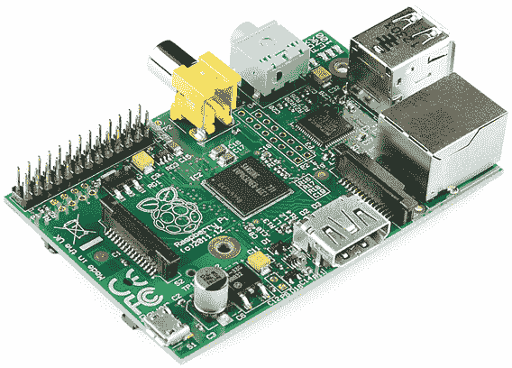](https://www.sparkfun.com/products/11546)

Raspberry Pi 是一个学习 Linux 和编程的好平台。对于许多“物联网”项目来说，这也是一个强大的解决方案，因为它很容易连接到互联网。它可以运行 Python 脚本，甚至可以编译 c 语言编写的程序，是一台成熟的计算机！

当然，它可以用来玩游戏。

[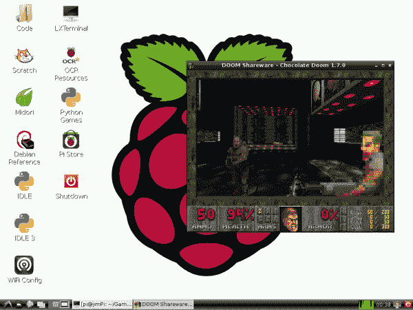](https://cdn.sparkfun.com/assets/1/e/4/f/a/52a8cbcc757b7f5b198b4567.png)*Chocolate Doom running on the Pi.*

### 本教程涵盖的内容

在本教程中，我们将向您展示如何快速启动并运行 Raspberry Pi。我们将使用最流行的、社区驱动的 Linux 发行版来设置 Pi:**Raspbian**。接下来，我们将向您展示如何设置 Raspbian，并访问它附带的一些特性。

最后，也是最重要的，我们将向您展示如何设置和运行 [Chocolate Doom](http://www.chocolate-doom.org/wiki/index.php/Chocolate_Doom) ，这是一个在小 Pi 上运行良好的 Doom 源端口。Mmmm 巧克力派。

### 所需材料

要学习本教程，您需要以下材料:

[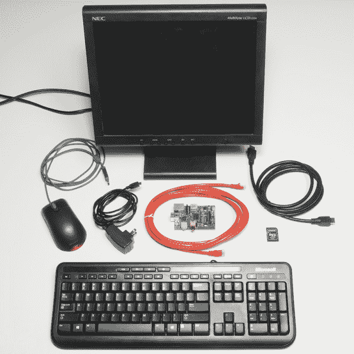](https://cdn.sparkfun.com/assets/9/8/3/1/0/52b22bd7ce395f45498b456b.jpg)

*   [Raspberry Pi B 型](https://www.sparkfun.com/products/11546)或[A 型](https://www.sparkfun.com/products/11837)(内存较少，无以太网)
*   一个带[微型 USB](https://www.sparkfun.com/products/10215) 终端的 [5V 电源](https://www.sparkfun.com/products/11456)。该电源应至少能够为**提供 700 毫安**。大多数手机充电器(带微型 USB 线)应该能用。
*   一张不小于 4GB 的 [SD 卡](https://www.sparkfun.com/products/11609)，不低于 class 4。
*   一个 **USB 键盘**和**鼠标**。
*   一个**显示器**连接到 [HDMI](https://www.sparkfun.com/products/11572) 或 [RCA 复合视频](https://www.sparkfun.com/products/11573)输出。
    *   如果您的显示器只有一个 VGA 端口，有 [HDMI 到 VGA 适配器](https://www.sparkfun.com/products/12613)在两者之间转换。(如果你正在使用它，你可能需要一个更强大的电源。)
    *   如果您的显示器只有 DVI，使用 [HDMI 转 DVI 线缆](https://www.sparkfun.com/products/12612)，从 HDMI 转换很容易。
*   一根**以太网电缆**和一个到互联网的连接。(可选，但*对获取软件更新【和毁灭】非常*有用。)
    *   或者，您可以将 **USB WiFi 模块**与 Pi 配合使用。查看我们在 Pi 上的[无线教程来帮助设置。](https://learn.sparkfun.com/tutorials/using-pcduinos-wifi-dongle-with-the-pi)
*   **耳机**或**扬声器**带 3.5 毫米立体声插孔终端(可选，除非，出于某种原因，你不想听到[前人类](http://pnmedia.gamespy.com/planetdoom.gamespy.com/oldimages/new_classic_doom_enem_pisto.gif)的垂死哀嚎)。

### 推荐阅读

本教程旨在尽可能地对树莓派初学者友好。不需要以前的电子学知识。请随意跳到下一页。如果你想了解一些幕后发生的事情，这里有一些初学者教程，我们推荐阅读:

*   [什么是电？](https://learn.sparkfun.com/tutorials/what-is-electricity)
*   [电压、电流、电阻和欧姆定律](https://learn.sparkfun.com/tutorials/voltage-current-resistance-and-ohms-law)
*   [模拟与数字](https://learn.sparkfun.com/tutorials/analog-vs-digital)
*   [串联和并联电路](https://learn.sparkfun.com/tutorials/analog-vs-digital)

## 准备一张 SD 卡

在开始安装 Raspbian 之前，您必须在 SD 卡上安装安装程序。按照下面的步骤准备你的 SD 卡，通过[格式化](#format)，然后[安装 NOOBS 软件](#install-NOOBS)。

不管你用的是哪种操作系统，先把你的 SD 卡插入你的电脑。然后，你需要从格式化卡片开始。按照下面与您的操作系统相匹配的部分进行操作。

### 格式化卡片

#### Windows 操作系统

1.  **下载**[Windows SD formatter](https://www.sdcard.org/downloads/formatter_4/eula_windows/)。【Setup.exe】拉开的拉链，**运行***。按照 InstallShield 向导安装 SDFormatter。*
**   **打开 SDFormatter** 。*   点击 ***选项*** ，在 上设置*格式尺寸调整*到 ***。【T10
    [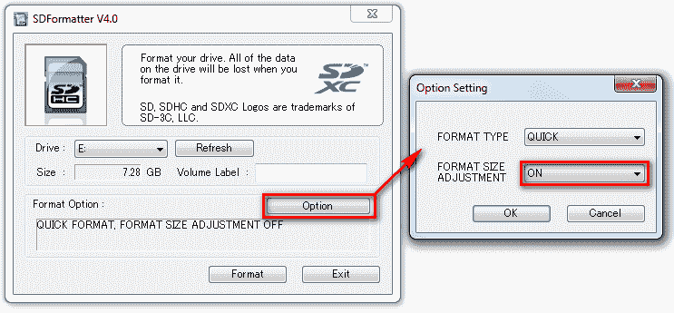](https://cdn.sparkfun.com/assets/4/0/4/c/c/52a8eb00757b7f297d8b4568.png)*** *   **从*驱动*下拉菜单中选择您的卡**(如果没有自动选择)。检查并再次检查驱动器号是否正确。*   点击 ***格式*** ，然后点击几次*确定*。您应该得到一个完整的*驱动器格式！*弹出不久。*

#### 麦克·OS X

1.  **下载**[Mac 版 SDFormatter】。打开下载的文件，按照**安装程序**的指示进行安装。](https://www.sdcard.org/downloads/formatter_4/eula_mac)
2.  **打开 *SDFormatter*** (应该在你的*应用*文件夹里)。
3.  选择*覆盖格式*作为格式选项。

    [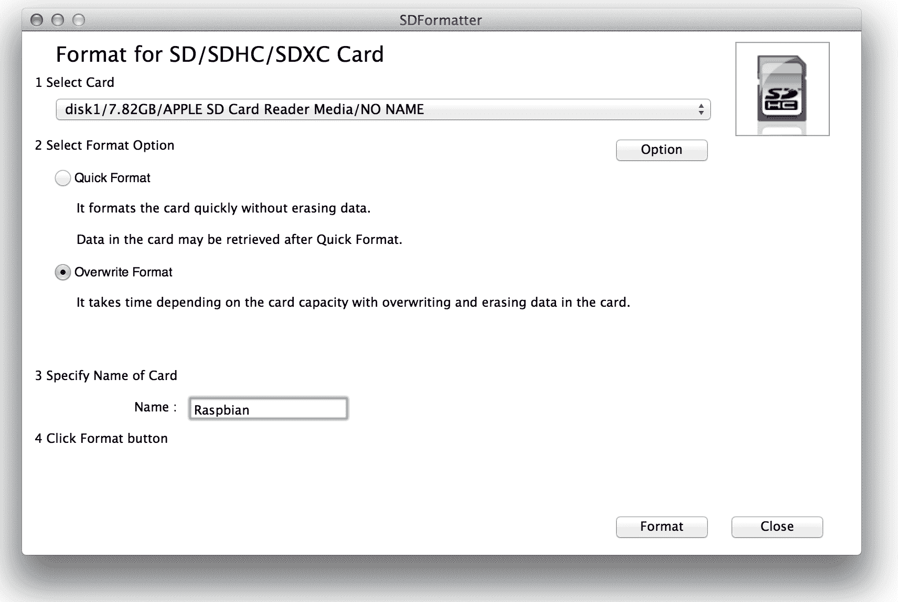](https://cdn.sparkfun.com/r/600-600/assets/0/c/0/5/5/52a8ed6b757b7f805f8b4567.png)
4.  **从顶部下拉菜单中选择您的卡**(如果没有自动选择)。确定是正确的！
5.  点击*格式*，看着进度条慢慢爬过窗口底部。一张*卡格式完整！*成功后应出现消息。

### 下载 noob

树莓 Pi 的*新开箱软件* (NOOBS)推荐给第一次使用 Pi 的用户(甚至是高级用户)。它包括各种有用的操作系统映像(包括 Raspbian)，并真正简化了安装它们的过程。

前往[rasbery Pi 下载页面](http://www.raspberrypi.org/downloads)，下载最新的 **NOOBS(离线安装)镜像** ( *NOOBS_v1_3_2.zip* )。它应该是一个大约 1gb 的 ZIP 文件夹。

下载完成后，**解压 ZIP 文件夹**并将内容放在 SD 卡的顶层。解压缩后，目录结构应该看起来有点像这样:

[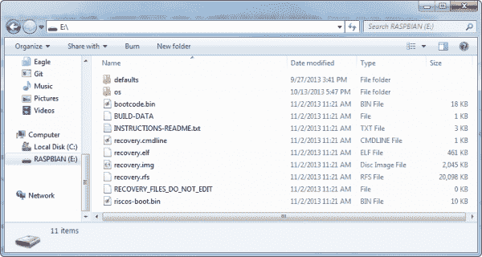](https://cdn.sparkfun.com/assets/5/b/2/1/1/52a9f90c757b7f7e2c8b4567.png)

该死。那是一张准备好的 SD 卡。是时候设置 Pi 了。

## 准备 Pi

这一页是所有关于连接外围设备到您的 Pi 准备安装 Raspbian。预热你的烤箱，让我们开始烹饪吧。

### 连接显示器

Pi 上有两个潜在的地方可以连接显示器:或者是 **HDMI** 或者是**分量视频**。

[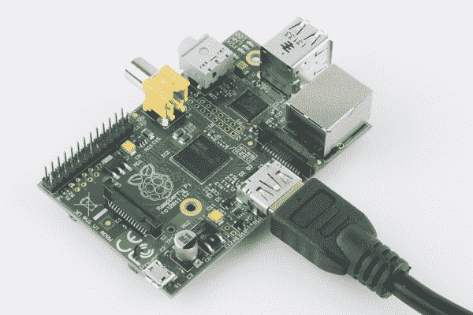](https://cdn.sparkfun.com/assets/7/4/f/1/0/52b22c65ce395fbe428b4567.jpg)

如果你的显示器没有这些输入，一个 [VGA 转 HDMI 适配器](https://www.sparkfun.com/products/12613)或 [HDMI 转 DVI](https://www.sparkfun.com/products/12612) 电缆可能是你需要的。

如果你的显示器支持的话，HDMI 可以传输音频。否则，您可以使用另一侧的 3.5 毫米插孔。

### 连接 USB 外设

接下来，连接你的**鼠标和键盘**。只要你不打算用任何其他 USB 外设(闪存盘，WiFi 卡等。)您可以使用 Pi 上的两个 USB 端口。否则，您可能需要考虑添加一个 USB 集线器。

[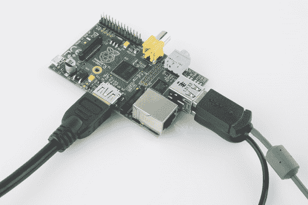](https://cdn.sparkfun.com/assets/0/0/7/2/b/52b22c65ce395f9d7c8b456a.jpg)

其中一些外围设备可能会消耗大量电能(尤其是光学和无线鼠标)。如果你注意到鼠标或键盘的问题，你可能需要用一个**供电的 USB 集线器**来使用它们。

### 插入 SD 卡

将准备好的 SD 卡插入 Pi。SD 插座位于主板的底部。插入您的卡时，确保**金触点朝上朝向电路板**。

[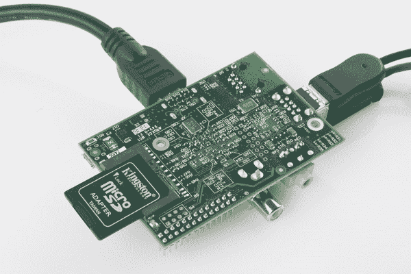](https://cdn.sparkfun.com/assets/9/6/9/b/2/52b22c65ce395ff4378b456a.jpg)

### (可选，推荐)连接以太网

要为您的 Pi 下载更新和其他软件，建议您通过以太网将其连接到互联网。以太网插孔就在这对 USB 插座的旁边。

### 连接电源

电力时间！将您的 [micro-B USB 电缆](https://www.sparkfun.com/products/10215)插入您的墙壁适配器，然后将另一端插入您的 Pi 的小型 micro-B USB 端口。

[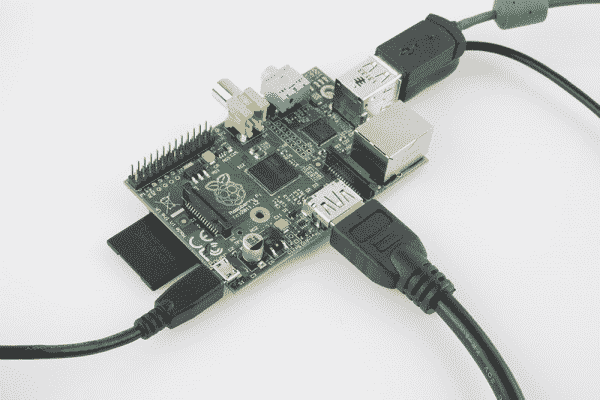](https://cdn.sparkfun.com/assets/b/d/3/0/4/52b22c64ce395f66428b4567.jpg)*The Pi-quad-topus is complete. Time to power it up!*

Pi 没有电源开关，所以在连接电源之前**要确保其他所有东西都插上电源。一旦 Pi 通电，它就会查看 SD 卡的内容并开始启动。**

* * *

快！当 Pi 开始第一次启动时，请转到下一页获取进一步的指导。

## 安装 Raspbian

当您的 Pi 开始第一次启动时，您应该会看到映像安装屏幕。如果是，请跳至[镜像安装选择部分](#image-installation)。否则，需要进行一些快速故障排除:

### 第一次启动时显示空白、黑色？

如果你第一次打开 Pi，屏幕上什么也看不到，不要着急！只要你的显示器没有抱怨“没有信号”，Pi 可能*正在*工作。

首先，根据您需要的显示模式，尝试按键盘上的 1、2、3 或 4:

1.  **HDMI** -常规 HDMI 模式。
2.  HDMI 安全 -如果你正在使用 HDMI，试试这个，但是选项 1 不起作用。
3.  **复合 PAL** -复合电缆，PAL 信号输出。
4.  **复合 NTSC** -复合电缆，NTSC 信号输出。

选择正确的模式后，您的屏幕应该会继续显示安装选择屏幕。

#### 还是没有运气吗？

如果您的屏幕仍然是空白的，您可能需要手动配置它。试试这个:

1.  拔下您的 Pi，取出 SD 卡，然后将其插回您的电脑。
2.  在 SD 卡的顶层创建一个名为`config.txt`的新文件。
3.  在`config.txt`中添加这些行:

```
hdmi_drive=2            # HDMI/DVI mode (1=DVI, 2=HDMI)
hdmi_group=2            # HDMI type (1=CEA, 2=DMT)
hdmi_mode=16            # Resolution (9=800x600/60Hz, 16=1024x768/60, 28=1280x800/60)
hdmi_force_hotplug=1    # 1=Force HDMI mode even if no HDMI montor is detected
```

您可能需要修改那里的一些值。这些设置手动定义 HDMI 模式和分辨率等内容。要获得修改 config.txt 文件的更多帮助，请查看 [RPiconfig 页面](http://elinux.org/RPiconfig)。

(这些值是通过 VGA 转 HDMI 适配器连接到 Pi 的旧 15 英寸显示器所必需的。)

### 映像安装选择

NOOBS 安装的第一步是选择要安装的映像。我们建议至少选择 Raspbian 的*。如果您的卡上有很多空间，您可以安装多个操作系统映像。*

使用鼠标选择或取消选择选项(或使用箭头键上下导航，空格键选择)。

[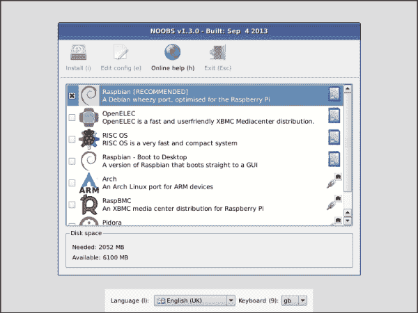](https://cdn.sparkfun.com/assets/1/5/3/7/4/52aa4598757b7f684b8b4567.png)

选择图像后，您可以修改语言设置。然后**点击安装**或按`i`开始安装。

安装过程需要一段时间(30 分钟到一个小时左右)。阅读一些安装幻灯片:

[](https://cdn.sparkfun.com/assets/5/5/2/a/7/52b0a76c757b7f7c2f8b4567.png)

然后去休息一下烤点馅饼什么的。

## 设置 Raspbian

在 NOOBS 运行完安装过程后，树莓 Pi 将重新启动，并向您展示*树莓 Pi 软件配置工具*(如果您没有看到这个，请向下滚动到[的下一部分](#recovery):

[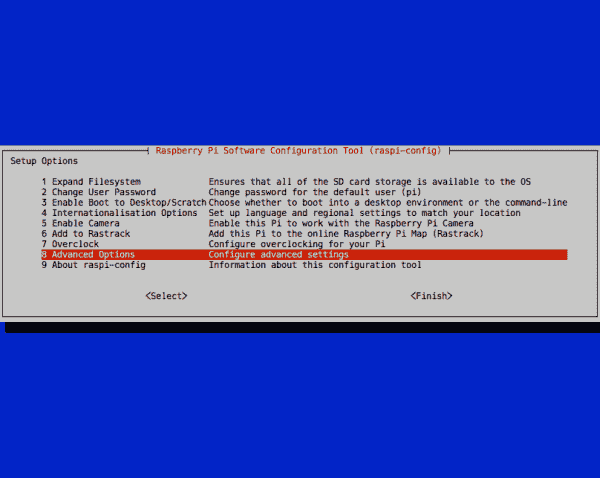](https://cdn.sparkfun.com/assets/a/e/1/b/6/52b0a966757b7f7f2b8b456a.png)

1.  扩展文件系统——不要担心这个。NOOBS 已经帮你做了。
2.  **更改用户密码** -建议执行此步骤！按照屏幕上的指示为您的 Pi 设置新密码。默认密码设置为*树莓*，用户设置为 *pi* 。
3.  **启用引导至桌面/暂存** -选择是引导至桌面还是简单的文本控制台。控制台模式显然会启动得更快，你可以键入`Startx`来打开 GUI。不过，对于那些更习惯使用 Windows 或 Mac 的人来说，启动到桌面可能更容易。
4.  国际化选项 -您可以在这里调整时区、键盘布局和您的 Pi 语言。这些改变需要一段时间才能完成，所以要有耐心。
5.  **启用相机** -如果你有一台[树莓 Pi 相机](https://www.sparkfun.com/products/11868)，这是为你设置的。
6.  **添加到光栅轨迹** -如果您希望您的 Pi 记录在[光栅轨迹](http://rastrack.co.uk/)上。
7.  **超频**——如果真的想把你的 Pi 发挥到极致，你可以超频。这加重了整个系统的负担，并可能导致故障。如果你超频，确保你有一个更强大的电源。在决定超频之前，我们建议至少*在正常时钟设置下尝试*Pi。
8.  **高级选项** -这里有一些有趣的选项，比如设置**主机名**或者启用/禁用 SPI 和 SSH。不过，在很大程度上，这些选项可以不考虑。

一旦你完成了所有的调整，向下滚动到`<Finish>`，让 Pi 重新启动。

如果您引导到控制台模式，键入`Startx`打开 GUI。否则，你已经看到了漂亮的树莓派桌面。

[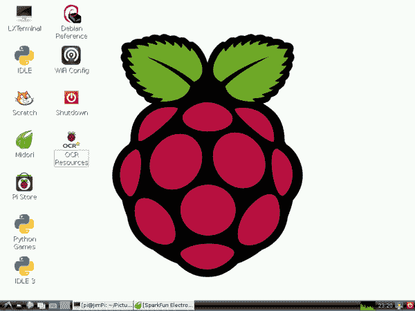](https://cdn.sparkfun.com/assets/f/6/4/1/4/52b0aa14757b7f95688b456d.png)*The default Raspbian desktop.*

### 开机一片空白，黑屏？

如果在安装 Raspbian 后，您的 Pi 启动后只是回到一个空白的黑屏，您可能需要编辑另一个`config.txt`。这个特定于 Raspbian 安装。

关键是进入**恢复模式**。当 Pi 启动时，您至少应该看到这个屏幕:

[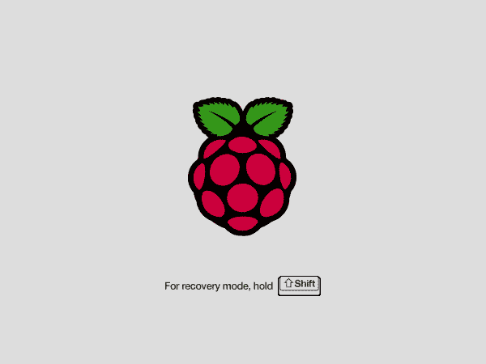](https://cdn.sparkfun.com/assets/4/8/7/3/b/52ab44ac757b7fa05c8b456b.png)

一旦你看到灰色，恢复模式屏幕**按住 shift** 进入恢复模式。这将为您呈现一个熟悉的窗口。“Raspbian”应该已经被选中，它应该有一个绿色的背景，表明它已经安装。**选择你的 Raspbian 图像**，然后**点击*编辑配置(e)*** (或按`e`)打开`config.txt`。

[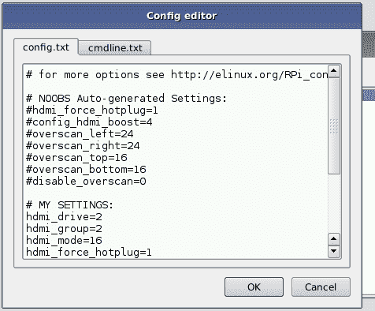](https://cdn.sparkfun.com/assets/b/4/e/d/8/52b0bf5c757b7f9a0d8b4567.png)

以`#`开头的每一行都被注释掉了，所以向下滚动到最底部，那里有一些非注释行。这是你想要修改 *NOOBS 自动生成设置*来匹配你需要的地方。如果您必须在最后一步中手动创建一个`config.txt`文件，请尝试使用相同的值。例如，这对我们有用:

```
hdmi_drive=2            # HDMI/DVI mode (1=DVI, 2=HDMI)
hdmi_group=2            # HDMI type (1=CEA, 2=DMT)
hdmi_mode=16            # Resolution (9=800x600/60Hz, 16=1024x768/60, 28=1280x800/60)
hdmi_force_hotplug=1    # 1=Force HDMI mode even if no HDMI montor is detected
```

查看 [RPiconfig 页面](http://elinux.org/RPiconfig)获取更多关于调整键和值的帮助。确保注释掉(或替换)已经存在的键和值。

然后**按 ESC** 键，在 Pi 重启时交叉手指。如果你在操作系统开始启动时看到一堵滚动的文字墙，这是一个好迹象！如果没有，返回恢复模式，尝试以其他方式修改`config.txt`。

## 探索拉斯扁

Raspbian 附带了各种有用的软件工具。用户界面应该和你可能用过的 Windows、OS X 和其他 Linux 操作系统感觉差不多。

[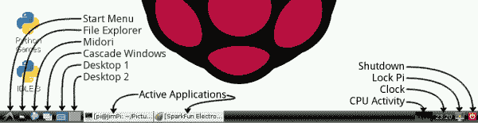](https://cdn.sparkfun.com/assets/8/f/0/a/7/52b0b19f757b7f36258b4567.png)

您可以自己探索环境，但这里有一些我们最喜欢的附带工具:

### 文件管理器

如果你做过任何类型的文件操作、创建或删除，你可能以前遇到过文件浏览器。单击底部任务栏上左起第二个图标，打开文件管理器。

[](https://cdn.sparkfun.com/assets/8/c/9/3/4/52b0b274757b7f2d1f8b4567.png)*Using the file manager to browse around the Applications folder.*

您可以使用文件管理器来查看 Raspbian 附带了哪些文件、应用程序和工具。或者您可以通过使用终端更加 Linux-y 一些...

### LX 终端

LXTerminal 是 Raspbian 的默认终端程序。如果想到“Linux ”,就会联想到黑客在充满文本的黑白终端上疯狂打字的画面，LXTerminal 就是这种情况的现实化。

[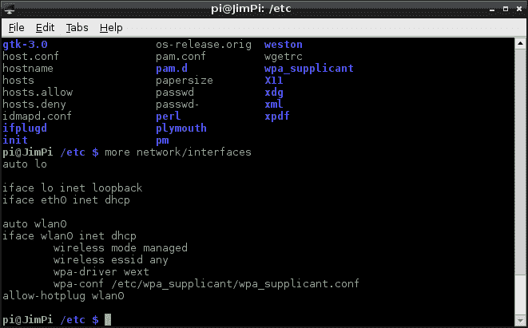](https://cdn.sparkfun.com/assets/3/d/7/2/4/52b0b268757b7f070f8b4569.png)

如果你从未使用过 Linux，或者不熟悉命令行界面(CLI)，有[大量](http://elinux.org/CLI_Spells)[资源](http://linuxcommand.org/learning_the_shell.php)帮助[让你入门](http://www.my-guides.net/en/content/view/29/26/)。从使用`cd`四处导航开始，用`ls`列出一些目录内容，用`man`阅读一些命令手册，你很快就会成为命令行忍者。

### 美岛莉

美岛莉是与 Raspbian 捆绑在一起的默认浏览器。美岛莉的目标是既快又轻，但它仍然可以处理许多现代网页。

[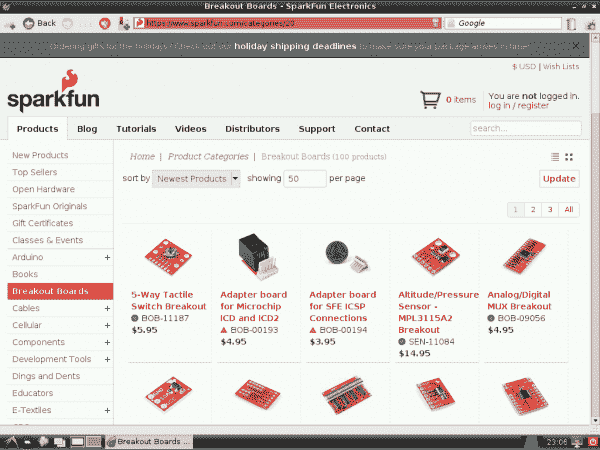](https://cdn.sparkfun.com/assets/b/3/8/b/9/52b0b29e757b7fe86f8b456e.png)*Browsing SFE from Midori.*

使用美岛莉，您可以访问标签页、书签、搜索栏和其他您可能习惯于使用其他 web 浏览器的实用程序。不过，没有闪光灯，所以没有 Youtube。

### 文本编辑器:Nano 和 Leafpad

这两个文本编辑器都可以用来修改文本文件，这是**配置**许多应用程序所必需的。两者的区别在于 GUI。 [Leafpad](http://tarot.freeshell.org/leafpad/) 是一款简洁的图形文本编辑器，像记事本(Windows)或文本编辑(OS X)。可以在“开始”菜单下的“附件”菜单中找到 Leafpad。

[Nano](http://www.nano-editor.org/) 是 Raspbian 的基于**终端的**文本编辑器。它速度快，重量轻，比 Leafpad 更有技术含量。一旦你养成了使用 Nano 的习惯，你就再也不会回到 Leafpad 了，因为你可以更快地编辑内容。

[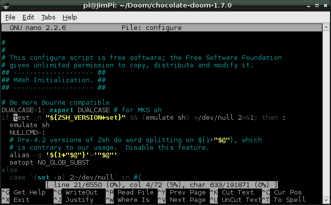](https://cdn.sparkfun.com/assets/7/2/a/a/d/52b0b2b6757b7f84068b4567.png)*Editing a makefile config file with Nano.*

Nano 非常适合编辑简短的配置文件，尤其是那些需要超级用户权限的文件。要使用 nano 打开文件进行编辑，请使用终端命令`nano filename.abc`。或者，用 root 权限打开它，使用`sudo nano filename.abc`。

如果你*真的*想让你的终端文本编辑更进一步，Raspbian 确实包括了 [Vi](http://en.wikipedia.org/wiki/Vi) (或者你可以下载并安装 [Emacs](http://www.gnu.org/software/emacs/) 【不是想在这里开始一场[地盘战](http://xkcd.com/378/))。

### 计算机编程语言

Raspbian 还包括 Python(版本 2.7.3 和 3.2.3)，这是一种我们非常迷恋的脚本语言。Python 是一种非常强大的编程语言，这要归功于已经用它编写的令人惊叹的库以及它的跨平台能力。

[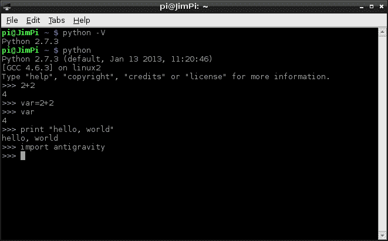](https://cdn.sparkfun.com/assets/c/4/a/c/0/52b0b2dd757b7fad268b456a.png)*Doing math and [defying gravity](http://xkcd.com/353/) with Python!*

Python 对于简单的硬件控制(切换 I/O 引脚、与 I ² C 传感器接口等)非常有用。)，它甚至可以用来创建全功能的项目，比如我们的 [Twitter Monitor](https://learn.sparkfun.com/tutorials/raspberry-pi-twitter-monitor) 。

如果您想开始学习 Python，有大量的资源可以帮助您入门。 [Programiz](https://www.programiz.com/python-programming) 和 [Codeacademy](http://www.codecademy.com) 都很棒，是教程和交互式模拟器的来源。当然，如果你有野心，还有 [Python 文档](http://docs.python.org/2/)本身。

## 咚咚。

一旦您熟悉了 Raspbian 包含的所有内容，您可能会注意到它缺少了一些东西。当然，你有网络，你有 Python，你甚至有 Python 游戏。但是没有任何 Python 游戏让你扮演一个太空陆战队员在火星上抗击外星人入侵。我们来安装【Doom】(http://en . Wikipedia . org/wiki/Doom _(video _ game))。

这一步确实需要**连接到互联网**。所以你要么需要将以太网路由到你的 Pi，要么[设置 WiFi](https://learn.sparkfun.com/tutorials/using-pcduinos-wifi-dongle-with-the-pi) 。如果你是一个 Linux 新手，这是一个很好的机会，让你第一次体验 [apt-get](http://en.wikipedia.org/wiki/Advanced_Packaging_Tool) 、tarball 提取、二进制编译和安装——随着你的继续，你会做很多事情。

这里会有很多**命令行**交互，所以**现在开放 LXTerminal** 。您应该发送的每个终端命令将如下所示:

pi @ raspberrypi~ $man apt-get

它模拟了终端的默认外观。只有**发送灰色文本**在那一行。绿色文本代表您的用户名和本地主机名(可能会有所不同)。蓝色的文本代表您当前的目录(`~`是/home/pi 目录)。

### 安装依赖项

在我们编译《巧克力厄运》之前，我们首先需要利用一些依赖关系。

首先，**用以下代码更新您的 apt-get 索引**总是一个好主意:

pi @ raspberrypi~ $sudo apt-get 更新

在`apt-get update`运行之后，我们可以`apt-get`我们所有的依赖项，使用这个野兽般的命令:

pi @ raspberrypi~ $sudo apt-get 安装 libsdl 1.2 debian libsdl-image 1.2 libsdl-mixer 1.2 libsdl-mixer 1.2-dev libsdl-net 1.2-dev 胆怯。

它会提醒您总“获取”量大约为 90MB。键入`Y`开始下载。现在，是时候做一些你会经常做的事情了:等待。下载和解包大约需要 20 分钟。在等待过程中，您可以仔细阅读正在安装的依赖项:

*   [libsdl1.2debian](http://packages.debian.org/wheezy/libsdl1.2debian) -简单直接媒体层(sdl)
*   [libsdl-Image 1.2](http://packages.debian.org/wheezy/libsdl-image1.2)-SDL 的图像加载
*   [libsdl-mixer 1.2](http://packages.debian.org/wheezy/libsdl-mixer1.2)-SDL 的混音器库
*   [libsdl-mixer1.2-dev](http://packages.debian.org/wheezy/libsdl-mixer1.2-dev) -音频混音器库开发文件
*   [libsdl-net 1.2](http://packages.debian.org/wheezy/libsdl-net1.2)-SDL 网络图书馆
*   [libsdl-net1.2-dev](http://packages.debian.org/wheezy/libsdl-net1.2-dev) -网络库开发文件
*   [胆怯](http://packages.debian.org/wheezy/timidity) - MIDI、MOD 等声音文件渲染器

了解一些你正在下载和安装的东西总是好的。

### 下载并解压源代码

现在我们已经控制了依赖关系，我们可以下载 Chocolate Doom 源代码了。首先，**导航到您希望文件所在的目录**。以下是创建名为“Doom”的目录并转到该目录的命令:

pi @ raspberrypi~ $mkdir Doom
pi @ raspberrypi~ $CD Doom

接下来，使用`wget`命令通过发送以下命令下载 Chocolate Doom:

pi @ raspberrypi~/Doom $sudo wget http://www . chocolate-Doom . org/downloads/2 . 0 . 0/chocolate-Doom-2 . 0 . 0 . 0 . tar . gz

(版本号可以更新，这可以形成链接 404。如果你得到一个错误，在[巧克力末日的主页](http://www.chocolate-doom.org/wiki/index.php/Downloads)上检查一个新版本。)

使用此`tar`命令提取 tar.gz 文件:

pi @ raspberrypi~/Doom $tar-xvf chocolate-doom-2.0.0.tar.gz

然后通过发送以下命令进入`chocolate-doom-2.0.0`目录:

pi @ raspberrypi~/Doom $CD 巧克力-doom-2.0.0

### 配置、制造和安装

为了再次检查一切看起来是否正确，您可以使用`ls`命令查看当前目录中的所有文件。

[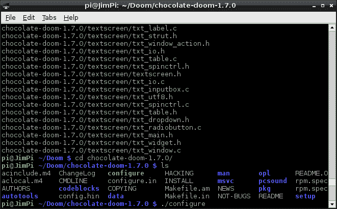](https://cdn.sparkfun.com/assets/e/f/8/b/8/52af769c757b7f93118b456b.png)*After un-tarring comes the _./configure* command._

下一步是通过运行`configure`文件来配置 Chocolate Doom。使用以下工具执行此操作:

pi @ raspberrypi~/Doom/巧克力-doom-2.0.0 $ 。/配置

越来越近！下一步是`make`巧克力的厄运:

pi @ raspberrypi~/Doom/chocolate-Doom-2 . 0 . 0 $make

观看编译滚动通过一个巨大的进程列表。是时候做更多无聊的事了。完成后，最后一步是:

pi @ raspberrypi~/Doom/chocolate-Doom-2 . 0 . 0 $须藤制作安装

呜！巧克力毁灭引擎安装完毕！

### 下载一叠钞票

你已经安装了游戏，但是所有的数据在哪里？所有的数据都在这里。为了运行巧克力毁灭战士，你需要把它指向你的 Pi 上的一个 WAD 文件。

那里有各种各样的 WAD 文件。如果你没有这个游戏，你可以在这里下载一个共享软件。或者，如果您想坚持使用命令行，请键入以下内容:

pi @ raspberrypi~/Doom/chocolate-Doom-2 . 0 . 0 $CD..
pi @ raspberrypi~/Doom $sudo wget http://www . jbserver . com/downloads/games/Doom/misc/shareware/Doom 1 . wad . zip

然后用这个命令解压 WAD:

pi @ raspberrypi~/Doom/chocolate-Doom-2 . 0 . 0 $sudo unzip Doom 1 . wad . zip

现在，在您的`Doom`文件夹中应该有一个名为`DOOM1.WAD`的文件。

### 设置和播放！

要打开 Chocolate Doom 设置实用程序，请使用`chocolate-doom-setup`命令。当你这样做的时候，你也应该指向你下载的 Doom WAD 文件:

pi @ raspberrypi~/Doom $巧克力-设置-iwad DOOM1。WAD

使用巧克力厄运设置实用程序，你可以调整诸如**屏幕分辨率**(全屏或窗口)，配置**键盘、鼠标和操纵杆**输入，以及**声音**。

[](https://cdn.sparkfun.com/assets/a/2/5/3/8/52af761d757b7f59178b4568.png)

完成所有这些更改后，单击“保存参数并启动 DOOM”。

[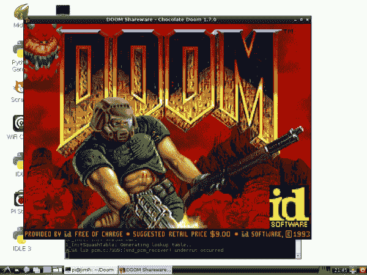](https://cdn.sparkfun.com/assets/8/6/2/7/6/52af75f6757b7f65108b456d.png)

如果你想直接进入毁灭，你可以使用这个命令:

pi @ raspberrypi~/Doom $巧克力-doom -iwad DOOM1。WAD

现在去拯救世界吧！

## 资源和更进一步

网络上有很多资源可以帮助你满足与树莓派相关的渴望。包括:

*   **树莓 Pi 资源:**
    *   eLinux Raspberry Pi Hub -一个关于 Pi 的优秀维基资源。
    *   [eLinux 故障排除指南](http://elinux.org/index.php?title=R-Pi_Troubleshooting)
    *   [Raspbian 文档](http://www.raspbian.org/RaspbianDocumentation)
    *   [拉斯边常见问题解答](http://www.raspbian.org/RaspbianFAQ)
    *   [Raspbian 论坛](http://www.raspbian.org/RaspbianForums)
    *   wiringPi -一个类似 Arduino 的树莓 Pi 编程接口。
*   **通用 Linux 资源:**
    *   基本 Linux 命令-Linux 新手的绝佳资源。
    *   ExplainShell.com-非常酷的解析终端命令的工具。如果您想知道这些看似漫无目的的命令行到底是做什么的，那就太好了。
*   **等。**
    *   [巧克力末日维基](http://www.chocolate-doom.org/wiki/index.php/User_guide)

### 更进一步

*   [Raspberry Pi Twitter Monitor](https://learn.sparkfun.com/tutorials/raspberry-pi-twitter-monitor)——学习如何使用 Raspberry Pi 来监控 Twitter 和闪烁 led。
*   [在 Pi 上使用 USB WiFi 加密狗](https://learn.sparkfun.com/tutorials/using-pcduinos-wifi-dongle-with-the-pi) -了解如何在 Pi 上设置 WiFi。通过 [USB WiFi 加密狗](https://www.sparkfun.com/products/11713)连接无线网络。
*   [pcdu ino](https://learn.sparkfun.com/tutorials/pcduino-hookup-guide)入门——如果 Pi 没有给你足够的硬件访问权限，考虑升级到 [pcDuino](https://www.sparkfun.com/products/11712) 。本教程教你如何开始使用强大的小开发板。*