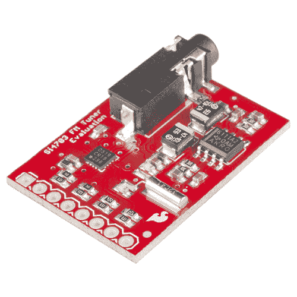

# Si4703 调频收音机接收器连接指南

> 原文：<https://learn.sparkfun.com/tutorials/si4703-fm-radio-receiver-hookup-guide>

## 介绍

**Heads up!** This tutorial was written for **Si4703 FM Tuner Evaluation Board V13 ([WRL-12938](https://www.sparkfun.com/products/12938))**. The 3.3V and GND pins are switched in the new revision. Make sure you connect to the correct pins for power if you are using an older version like V11 ([WRL-10663](https://www.sparkfun.com/products/retired/10663)) or the breakout board.

[Si4703 FM 调谐器评估分线板](https://www.sparkfun.com/products/12938)使您能够使用硅实验室的 Si4703 FM 调谐器芯片收听 FM 广播电台。该 IC 还能很好地用于滤波器和载波检测，并支持向用户显示电台 ID 和歌曲名称等数据。

 

将**添加到您的[购物车](https://www.sparkfun.com/cart)中！**

### [SparkFun FM 调谐器评估板- Si4703](https://www.sparkfun.com/products/12938)

[In stock](https://learn.sparkfun.com/static/bubbles/ "in stock") WRL-12938

这是用于硅实验室 Si4703 FM 调谐器芯片的评估板。除了让您能够收听调频广播电台…

$24.956[Favorited Favorite](# "Add to favorites") 25[Wish List](# "Add to wish list")** **[https://www.youtube.com/embed/gXAwTYl06_o/?autohide=1&border=0&wmode=opaque&enablejsapi=1](https://www.youtube.com/embed/gXAwTYl06_o/?autohide=1&border=0&wmode=opaque&enablejsapi=1)

### 所需材料

你需要以下材料来做这个项目。**