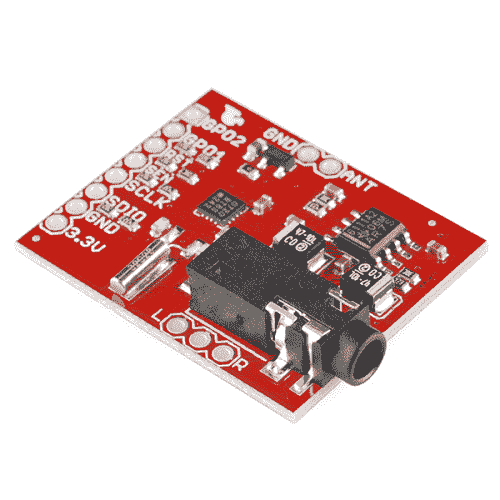

# Si4707 连接指南

> 原文：<https://learn.sparkfun.com/tutorials/si4707-hookup-guide>

## 介绍

天气波段广播是美国、加拿大和百慕大群岛提供的一项出色的公共服务。数百个发射台遍布全国，气象电台充当着“国家海洋和大气管理局的声音”。除了发布天气预报，气象电台还为紧急天气警报实施了一个名为 **SAME** (特定区域消息编码)的消息协议。

<https://cdn.sparkfun.com/assets/7/a/b/1/7/51757d00ce395f2166000005.mp3>

<https://cdn.sparkfun.com/assets/7/e/2/c/9/517580c3ce395f1f67000002.ogg>

*An audio snippet recorded out of the Si4707\. Winter storm advisory in Boulder...at the end of April!*

硅实验室 Si4707 能够接收气象无线电广播并解码相同的信息。它还能够检查 1050 赫兹的提示音。这是一个独特的芯片，我们非常喜欢它，我们把它贴在一个分线板上。除了 Si4707，突破还包括支持无源元件和耳机立体声放大器。

 

### [SparkFun 天气波段接收机分线点- Si4707](https://www.sparkfun.com/products/retired/11129)

[Retired](https://learn.sparkfun.com/static/bubbles/ "Retired") WRL-11129

[Weather-band radio](https://en . Wikipedia . org/wiki/Weather _ radio)是一项在 162.4 到 162.55MHz 频段上提供的出色服务

**Retired**[Favorited Favorite](# "Add to favorites") 5[Wish List](# "Add to wish list")

[https://www.youtube.com/embed/s89rnBTA-5A?t=67/?autohide=1&border=0&wmode=opaque&enablejsapi=1](https://www.youtube.com/embed/s89rnBTA-5A?t=67/?autohide=1&border=0&wmode=opaque&enablejsapi=1)

有多种内置天气波段功能的消费级无线电接收机。但是这有什么意思呢？使用 Si4707，您可以通过收听广播来制作自己的天气预报！

### 所需材料

在本教程中，我们将解释如何使用 **Arduino** 开发平台连接到 Si4707 分线点。为了跟进，你需要这些材料: