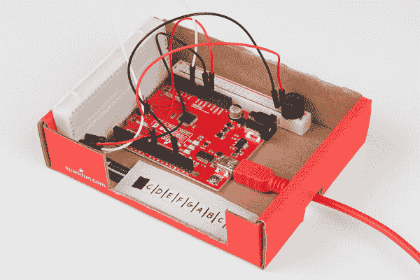

# SIK 键盘乐器

> 原文：<https://learn.sparkfun.com/tutorials/sik-keyboard-instrument>

## 介绍

SparkFun Inventor's Kit (SIK)是学习电子学、编程和物理计算的一个很好的起点。我们可以结合在 [SIK 指南](https://learn.sparkfun.com/tutorials/sik-experiment-guide-for-arduino---v32)中找到的一些概念来制作我们自己的项目。在本教程中，我们将使用在 SIK 发现的零件制作一个键盘。

我们可以使用 Arduino 读取软电位计条(“软电位计”)上的触摸位置，并使用该信息播放蜂鸣器发出的特定音符。虽然它可能很小，但我们可以将软锅分成 8 段。这就够秤了！在这种情况下，我们将使用 [C 大调音阶](https://en.wikipedia.org/wiki/C_major)。

[https://www.youtube.com/embed/TkQcEZpNxXM/?autohide=1&border=0&wmode=opaque&enablejsapi=1](https://www.youtube.com/embed/TkQcEZpNxXM/?autohide=1&border=0&wmode=opaque&enablejsapi=1)

### 所需材料

在 SIK，您需要: