# 西蒙说组装指南

> 原文：<https://learn.sparkfun.com/tutorials/simon-says-assembly-guide>

## 介绍

西蒙说，如果你在这里找到了自己，很有可能你已经购买了我们众多通孔焊接套件中的一个。本教程将帮助您熟悉构建 Simon Says 所需的工具，向您展示如何构建它，并向您展示如何通过一点编程知识来进一步开发这个简单而有趣的游戏。本教程中包含的不同工具包包括:

[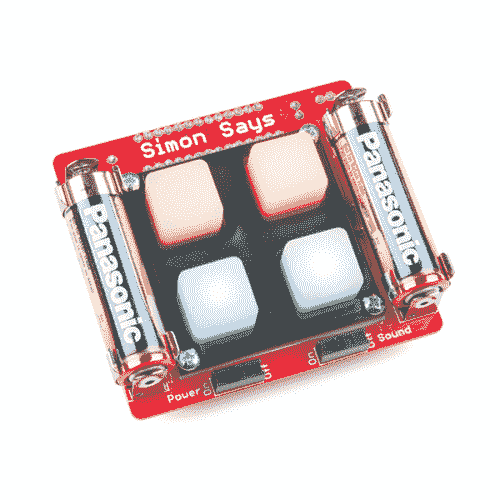](https://www.sparkfun.com/products/10547) 

将**添加到您的[购物车](https://www.sparkfun.com/cart)中！**

### [斯帕克芬西蒙说——通孔焊接套件](https://www.sparkfun.com/products/10547)

[Only 14 left!](https://learn.sparkfun.com/static/bubbles/ "only 14 left!") KIT-10547

这是我们广受欢迎的通孔西蒙说套件的最新版本。我们已经对董事会做了一些更改，应该会使…

$28.9542[Favorited Favorite](# "Add to favorites") 19[Wish List](# "Add to wish list")****[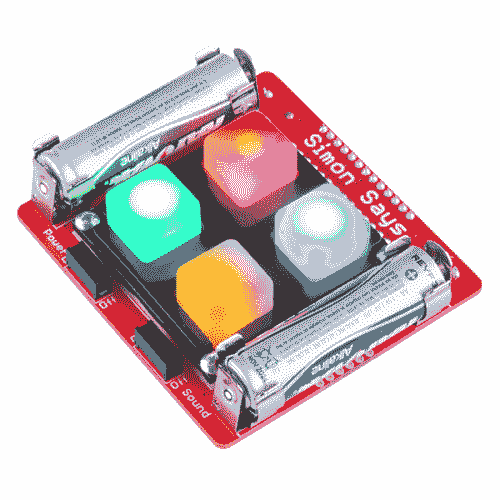](https://www.sparkfun.com/products/13708) 

将**添加到您的[购物车](https://www.sparkfun.com/cart)中！**

### [SparkFun 学会焊锡——西蒙说](https://www.sparkfun.com/products/13708)

[Only 3 left!](https://learn.sparkfun.com/static/bubbles/ "only 3 left!") KIT-13708

我们的通孔西蒙说工具包是一个伟大的初学者工具包，也是一个非常有趣的玩具。所有元件都是通孔的，使得…

$50.954[Favorited Favorite](# "Add to favorites") 16[Wish List](# "Add to wish list")**** ****这些工具包都非常相似。唯一的区别是 *SparkFun Simon 说——通孔焊接套件*，你将需要提供自己的工具来构建它。如果你没有必要的工具，那么*学习焊接*工具包会提供你开始学习所需的一切。为了简单起见，我们将在本教程中涵盖从工具到构建 Simon Says all 的所有内容。如果你对焊接感到足够舒服，并且只是在寻找一些关于如何组装套件的详细说明，你可能想跳过前面。然而，如果你想知道更多关于焊接的知识，哪些工具最适合这项工作，以及如何正确维护这些工具，那么请继续阅读！

### 推荐阅读

如果您不熟悉以下概念，我们建议您在继续之前查看这些教程。

 [### 如何焊接:通孔焊接](https://learn.sparkfun.com/tutorials/how-to-solder-through-hole-soldering) This tutorial covers everything you need to know about through-hole soldering.[Favorited Favorite](# "Add to favorites") 70 [### 电阻](https://learn.sparkfun.com/tutorials/resistors) A tutorial on all things resistors. What is a resistor, how do they behave in parallel/series, decoding the resistor color codes, and resistor applications.[Favorited Favorite](# "Add to favorites") 57 [### 极性](https://learn.sparkfun.com/tutorials/polarity) An introduction to polarity in electronic components. Discover what polarity is, which parts have it, and how to identify it.[Favorited Favorite](# "Add to favorites") 52

### 所需工具

如果您已经购买了西蒙说通孔套件或零售套件，以下是完成构建所需材料的推荐列表。西蒙说，如果你要学习焊接，你的工具包应该包括以下所有东西:

 

将**添加到您的[购物车](https://www.sparkfun.com/cart)中！**

### [斯帕克芬西蒙说——通孔焊接套件](https://www.sparkfun.com/products/10547)

[Only 14 left!](https://learn.sparkfun.com/static/bubbles/ "only 14 left!") KIT-10547

这是我们广受欢迎的通孔西蒙说套件的最新版本。我们已经对董事会做了一些更改，应该会使…

$28.9542[Favorited Favorite](# "Add to favorites") 19[Wish List](# "Add to wish list")**** 

将**添加到您的[购物车](https://www.sparkfun.com/cart)中！**

### [斜切刀](https://www.sparkfun.com/products/8794)

[In stock](https://learn.sparkfun.com/static/bubbles/ "in stock") TOL-08794

迷你斜切刀。这些是很棒的小刀具！这是夹住引线和额外焊尾的必备工具。4 英寸长。

$2.753[Favorited Favorite](# "Add to favorites") 15[Wish List](# "Add to wish list")**** 

将**添加到您的[购物车](https://www.sparkfun.com/cart)中！**

### [无铅焊料- 15 克管](https://www.sparkfun.com/products/9163)

[In stock](https://learn.sparkfun.com/static/bubbles/ "in stock") TOL-09163

这是你的无铅焊料的基本管，带有不干净的水溶性树脂芯。0.031 英寸规格，15 克

$3.954[Favorited Favorite](# "Add to favorites") 14[Wish List](# "Add to wish list")**** 

将**添加到您的[购物车](https://www.sparkfun.com/cart)中！**

### [烙铁架](https://www.sparkfun.com/products/9477)

[21 available](https://learn.sparkfun.com/static/bubbles/ "21 available") TOL-09477

这是一个简单的烙铁架，由一个重型金属底座和一个加固的弹簧座组成。底座和支架…

$6.504[Favorited Favorite](# "Add to favorites") 29[Wish List](# "Add to wish list")**** 

将**添加到您的[购物车](https://www.sparkfun.com/cart)中！**

### [烙铁- 30W(美国，110V)](https://www.sparkfun.com/products/9507)

[33 available](https://learn.sparkfun.com/static/bubbles/ "33 available") TOL-09507

这是一个非常简单的固定温度，快速加热，30W 110/120 VAC 烙铁。我们真的很喜欢使用更贵的 iro…

$10.957[Favorited Favorite](# "Add to favorites") 21[Wish List](# "Add to wish list")**** 

将**添加到您的[购物车](https://www.sparkfun.com/cart)中！**

### [SparkFun 安全眼镜](https://www.sparkfun.com/products/11046)

[In stock](https://learn.sparkfun.com/static/bubbles/ "in stock") SWG-11046

有了这些 SparkFun 安全眼镜，你将拥有一副轻便、经济、时尚的镜片来保护你珍贵的…

$4.953[Favorited Favorite](# "Add to favorites") 16[Wish List](# "Add to wish list")**** 

将**添加到您的[购物车](https://www.sparkfun.com/cart)中！**

### [焊芯 2 号 5 英尺。-通用](https://www.sparkfun.com/products/9327)

[In stock](https://learn.sparkfun.com/static/bubbles/ "in stock") TOL-09327

焊芯、咖啡和纸巾让 SparkFun 保持运转。你可以偷别人的斜切刀一分钟，但你会…

$2.754[Favorited Favorite](# "Add to favorites") 30[Wish List](# "Add to wish list")************** ************在西蒙说通孔套件内，您可以找到西蒙说的所有零件。这包括:

*   ATmega328 -用 Simon 固件预编程
*   门铃
*   0.1μF 电容(x2)
*   10K 电阻器
*   发光二极管(x4)(蓝色、黄色、红色、绿色)
*   滑动开关(x2)
*   电池夹(x4)
*   AA 电池(2 个)
*   Button pad
*   宝石的斜面
*   支架和螺钉(x4)
*   西蒙说-通孔印刷电路板

[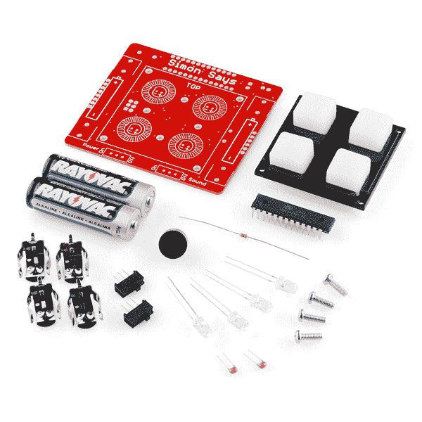](https://cdn.sparkfun.com/assets/learn_tutorials/5/8/4/10547-01.jpg)

丢了什么零件吗？有时候这些微小的部件可能会放错地方。如果您丢失了任何零件，请联系我们的[客户服务团队](mailto:customerservice@sparkfun.com)，我们会马上为您找到丢失的零件。

## 快速入门-焊接基础和建议

有一些基本的提示，将帮助您实现最佳的焊接连接，帮助您保持烙铁在良好的状态，也让您的安全。对于初学者来说，不使用熨斗时最好拔掉插头。让烙铁长时间开着会更快地磨损烙铁头。当插上电源时，它们也很容易被忘记，并可能成为潜在的火灾隐患。

也就是说，戴上安全眼镜，接通电源，让熨斗预热后再使用。让它预热大约 30 秒- 1 分钟。烙铁的尖端温度通常为 700 华氏度，足以熔化金属焊料。电烙铁的手柄有点发热是正常的。像握铅笔一样握着它，如果热得不舒服，把你的手从笔尖移开。

没有任何指示器让你知道熨斗什么时候准备好了。**千万不要用手去摸熨斗尖看它是否在**上。测试熨斗是否预热好的最好方法是在末端融化一点焊料。如果它很容易融化，你就可以走了。焊料冒烟是因为焊料中的松香被烧掉了——这是无害的。如果你很难让烙铁头上的焊料熔化，让它再热一会儿。

[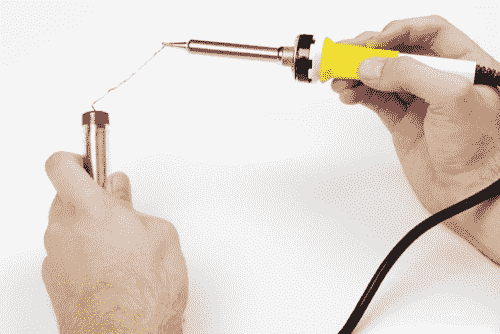](https://cdn.sparkfun.com/assets/learn_tutorials/5/8/4/Solder_to_Iron-small.jpg)

这里有一个近摄的焊料，一旦焊料能够在烙铁尖上熔化。

下一条建议是，当你不用熨斗的时候，把它放在原位。将熨斗放在工作场所可能是一大危险。你不仅会烧伤工作台上的其他物品，还会把你的手放在上面烧伤(这是我的经验之谈)。你的熨斗有一个家，当你把它放在那里时，我们都过得更好。

[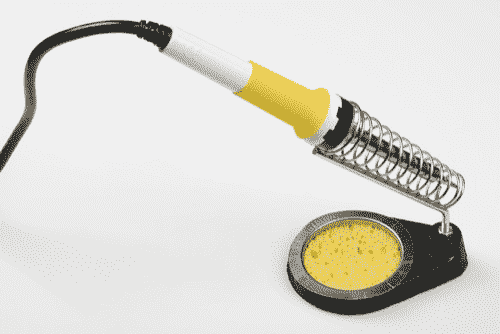](https://cdn.sparkfun.com/assets/learn_tutorials/5/8/4/Iron_in_Stand-small.jpg)

### 维护您的烙铁

你会注意到在你的摊位上有一个小水池，里面有一块海绵。这块海绵在焊接中起着非常重要的作用。当你焊接时，旧的焊料会结块，失去熔化和流动的能力。它还会在你的烙铁尖上堆积一层令人讨厌的残留物，并腐蚀它，直到它不再接受焊料。这就是海绵派上用场的地方。

在水槽里或用水瓶弄湿它。它不需要浸泡，只要足够湿就可以把焊料从熨斗上拉下来。现在，非常轻柔地将海绵上多余的焊料擦掉。避免将笔尖卡在海绵中，或将笔尖留在海绵上超过几秒钟。这样做可能会导致你的小费洞，最终破坏你的铁。当你焊接时，你应该定期清洁你的尖端。这将使你的焊接看起来更好，并会增加你的铁的寿命。为了进一步延长熨斗的使用寿命，我们建议使用黄铜海绵代替普通海绵。随着时间的推移，尖端在冷水中的膨胀和收缩会使其磨损。

现在，我们已经讨论了正确的烙铁处理和保养，让我们来看看如何正确使用它。有一种正确的焊接方法，需要大量的练习才能掌握。尽早做好这件事会让你的焊接经历更有趣。当你把你的工具包放在一起时，一定要遵循这些建议。

### 焊接建议:如何正确使用烙铁

以下是一些提示，告诉你如何正确使用熨斗。

[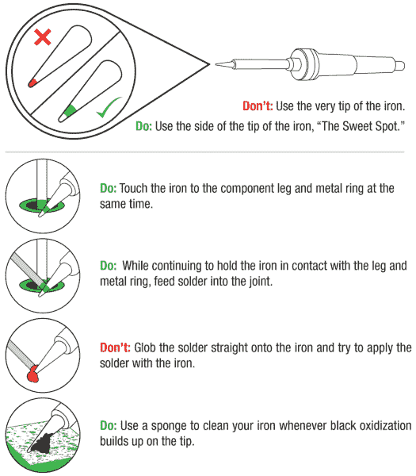](https://cdn.sparkfun.com/assets/learn_tutorials/5/8/4/SolderingAdvice_1edit.png)

### 焊接建议:如何创造一个理想的焊点

以下是创建最佳焊接连接的一些技巧。

[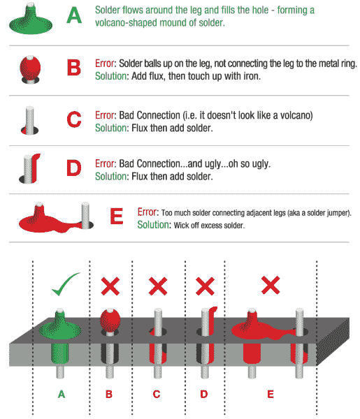](https://cdn.sparkfun.com/assets/learn_tutorials/5/8/4/SolderingAdvice_2.png)

如果你仍然有一些关于焊接的不确定性，看看下面的教程。有一个视频是给那些视觉学习类型的人看的。

 [### 如何焊接:通孔焊接

#### 2013 年 9 月 19 日](https://learn.sparkfun.com/tutorials/how-to-solder-through-hole-soldering) This tutorial covers everything you need to know about through-hole soldering.[Favorited Favorite](# "Add to favorites") 70

## 快速入门-您的第一个组件

我们将详细讨论如何焊接第一部分。然后，我们会告诉你哪些部分去哪里，让你有它。西蒙说的小册子是精心制作的，详细介绍了大会。我们会跟着这里。点击图片查看大图，或者您可以[在此](https://cdn.sparkfun.com/datasheets/Kits/SFE03-0010-KitCard-SimonPTH-WebVersion-02.pdf)下载整个指南。

### 10kΩ电阻

找到 10kΩ电阻。

[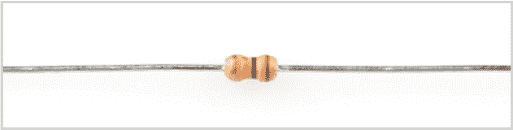](https://cdn.sparkfun.com/assets/learn_tutorials/5/8/4/1_Resistor.png)

如果你仔细看，它身上有特定的条纹图案:棕色、黑色、橙色、金色。

**Note:** The pattern can be in the opposite order; this is still the correct resistor. To further understand resistor markings, please check out the following tutorial: [Decoding Resistor Markings](https://learn.sparkfun.com/tutorials/resistors/decoding-resistor-markings).

向下弯曲双腿。

找到电路板上 10kΩ电阻的位置

[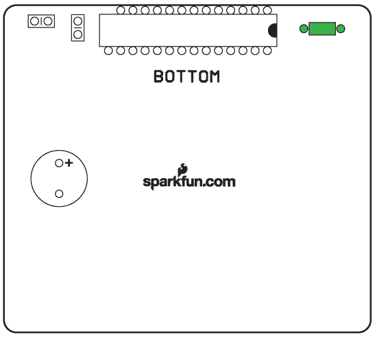](https://cdn.sparkfun.com/assets/learn_tutorials/5/8/4/3_ResistorLocationPCB.png)

将电阻插入 PCB。

[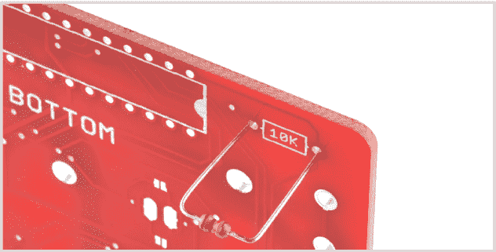](https://cdn.sparkfun.com/assets/learn_tutorials/5/8/4/4_InsertResistor.png)

将电阻器推入，使其几乎与电路板齐平。

[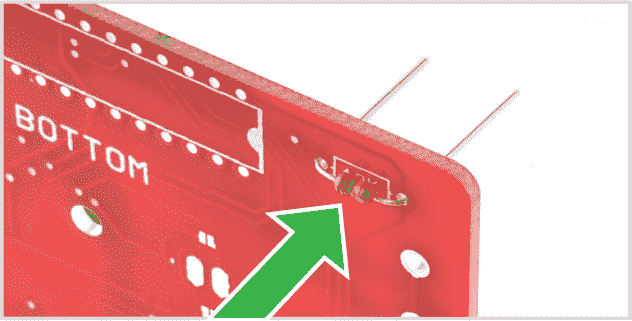](https://cdn.sparkfun.com/assets/learn_tutorials/5/8/4/5_PushResistorFlush.png)**Note:** This component is not polarized and so it does not matter which leg goes into each hole. Some components in this kit are polarized and we will take extra care when we get to them to ensure they are plugged in properly. These components will be denoted with a note and highlighted in yellow instead of green:

| 极化分量 | 请特别注意指示如何将其放置在 PCB 上的元件标记。极化部件只能以一个方向连接到电路。 |

To learn more about what it means to be polarized, please check out this tutorial: [Polarity](https://learn.sparkfun.com/tutorials/polarity).

稍微向外弯曲双腿以保持其位置。

[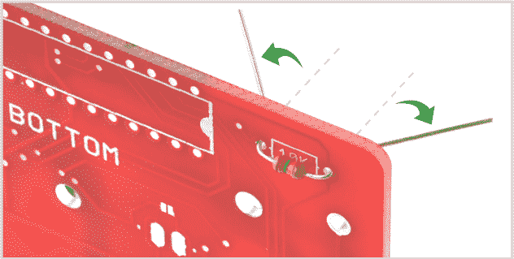](https://cdn.sparkfun.com/assets/learn_tutorials/5/8/4/6_BendLegsOutward.png)

把板子翻过来。握住烙铁的“最佳位置”,使其接触到烙铁腿和金属环。保持 2 秒钟。

[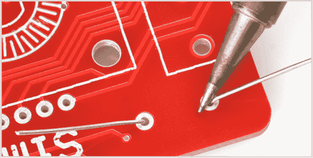](https://cdn.sparkfun.com/assets/learn_tutorials/5/8/4/7_HeatThroughHole.png)

将焊料注入接缝处。

[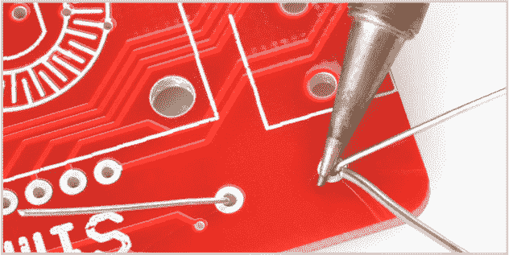](https://cdn.sparkfun.com/assets/learn_tutorials/5/8/4/8_AddSolder.png)

首先，拉开焊料。第二，拉开铁棍。

[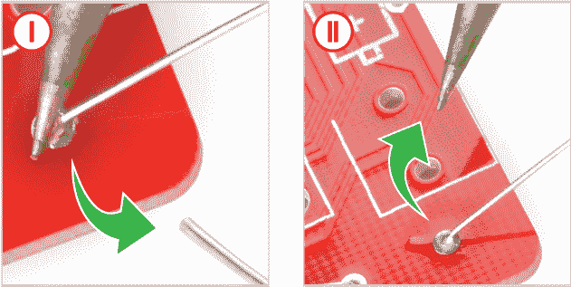](https://cdn.sparkfun.com/assets/learn_tutorials/5/8/4/9_RemoveSolderIron.png)

你的焊点应该像这样——一个小火山。

剪掉多余的腿。

[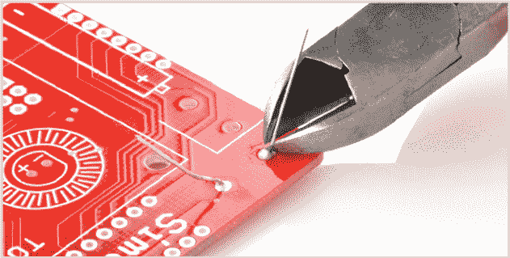](https://cdn.sparkfun.com/assets/learn_tutorials/5/8/4/11_ClipLegs.png)**Note:** The resistor tells the microcontroller not to reset once the power is turned on, so your game can continue uninterrupted. Try to be gentle with the board, but a few scratches are not a big deal.

## 电容器

找到两个 0.1uF 去耦电容。这些看起来和电阻有点不同。它们有两条引线，从元件底部引出，上面有标记“104”。(另请注意，底部可能有一些其他字母，如“K5M”)。它们看起来像这样:

找到它们在 PCB 上的位置:

[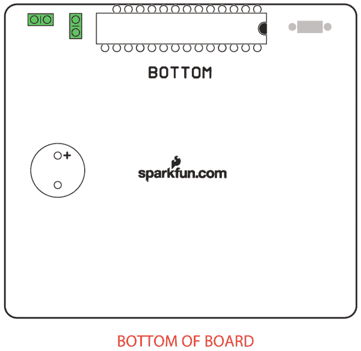](https://cdn.sparkfun.com/assets/learn_tutorials/5/8/4/12_Capacitors.png)

插入电容，将电路板翻转到底侧，像焊接电阻一样焊接引脚。

**Note:** The decoupling capacitors help "clean up" the power on the board.

## 微控制器

| 极化分量 | 请特别注意指示如何将其放置在 PCB 上的元件标记。极化部件只能以一个方向连接到电路。 |

找到微控制器。这个元件是极化的，这意味着我们需要格外小心地将其正确放置在电路板上。注意下图中的凹口。

查看电路板底部，插入微控制器。确保芯片上的凹槽与电路板上的白色丝网对齐。为了避免插反，我们切掉了一个别针。

[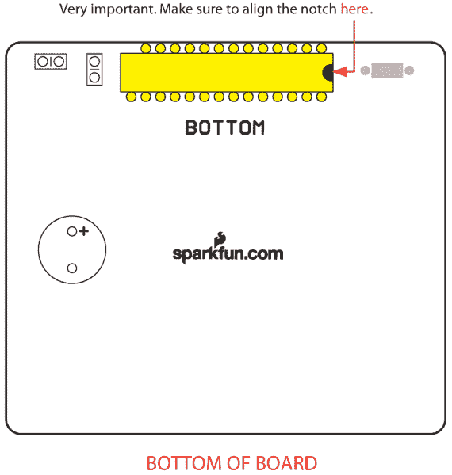](https://cdn.sparkfun.com/assets/learn_tutorials/5/8/4/13_Atmega328.png)

翻转电路板，将微控制器的所有引脚焊接到电路板上。

**Note:** The microcontroller is the brain of the game. It's programmed to light up the buttons and create the game sequence. Bending the legs won't hurt the chip. It is designed to withstand the heat of the soldering iron as well as gentle bending.

## 门铃

| 极化分量 | 请特别注意指示如何将其放置在 PCB 上的元件标记。极化部件只能以一个方向连接到电路。 |

找到压电蜂鸣器。

[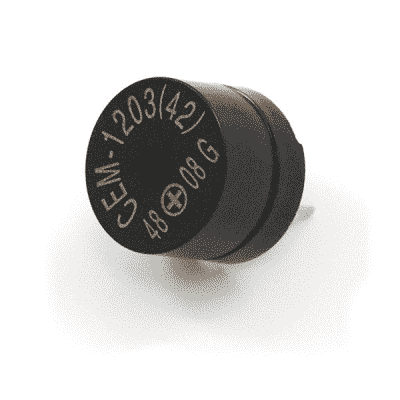](https://cdn.sparkfun.com/assets/learn_tutorials/5/8/4/07950-1.jpg)

找到 PCB 上的位置。注意蜂鸣器上的“+”。蜂鸣器上的“+”应与板上的白色“+”对齐。

翻转电路板，焊接蜂鸣器的针脚。

**Note:** The buzzer makes the noise for the game - pretty simple!

## 发光二极管

| 极化分量 | 请特别注意指示如何将其放置在 PCB 上的元件标记。极化部件只能以一个方向连接到电路。 |

找到四个指示灯。

[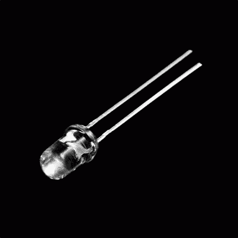](https://cdn.sparkfun.com/assets/learn_tutorials/5/8/4/08285-01_1.jpg)

发光二极管是偏振的。这意味着有“-”和“+”腿。每个 LED 有一个短腿和一个长腿。短腿伸进标有“-”的洞里。确定它们在 PCB 上的位置。

[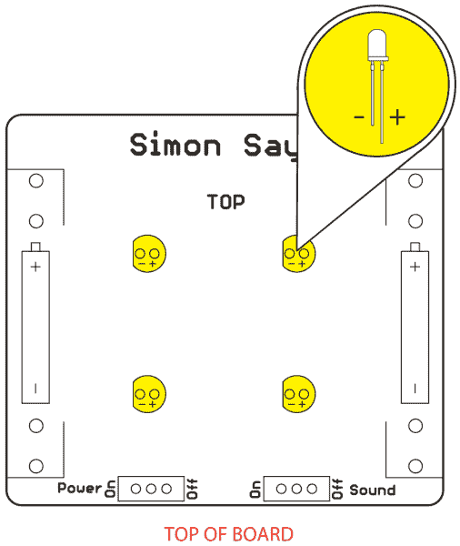](https://cdn.sparkfun.com/assets/learn_tutorials/5/8/4/15_LEDs.png)

将四个指示灯插入板的顶部。此外，确保它们都与 PCB 齐平。然后将它们焊接到位。

**Note:** Light-emitting diodes (LEDs) are like light bulbs, but much smaller and more efficient. While the polarity of the LED matters, the position of the colored LED should not affect the overall functionality of the Simon game. If you are interested in placing a specific LED at a certain position, try [testing the color of the LED with a multimeter set to measure diodes](https://learn.sparkfun.com/tutorials/polarity/diode-and-led-polarity).

For more information about polarization with LEDs, please check out this tutorial on [Diode and LED Polarity](https://learn.sparkfun.com/tutorials/polarity/diode-and-led-polarity).

## 电池夹

| 极化分量 | 请特别注意指示如何将其放置在 PCB 上的元件标记。极化部件只能以一个方向连接到电路。 |

找到四个电池夹。

[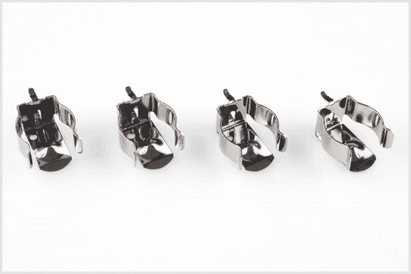](https://cdn.sparkfun.com/assets/learn_tutorials/5/8/4/batteryclips.jpg)

确定它们在 PCB 上的位置。插入电池夹。确保夹子相互对着，这样电池就合适了。

[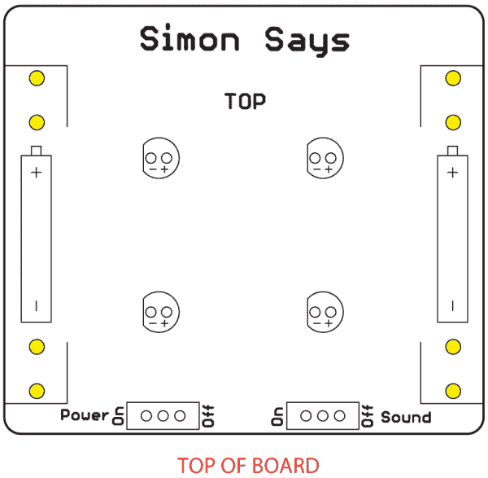](https://cdn.sparkfun.com/assets/learn_tutorials/5/8/4/16_BatteryClips.png)

确保夹子平放在电路板上。然后从板的底部焊接。

## 开关

找到两个滑动开关。

[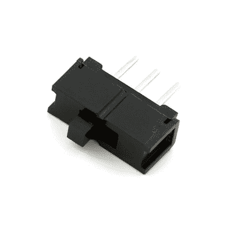](https://cdn.sparkfun.com/assets/learn_tutorials/5/8/4/00102-02-L.jpg)

确定它们在 PCB 上的位置。看着电路板的顶部，插入开关。让铁头远离黑色塑料！塑料容易熔化。

[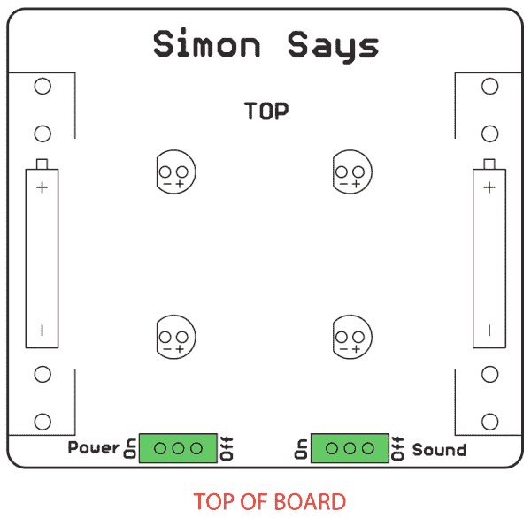](https://cdn.sparkfun.com/assets/learn_tutorials/5/8/4/17_Switches.png)

把板子翻过来。然后开始焊接。

**Note:** The slide switches turn on and off the power and sound.

## 总装

| 极化分量 | 请特别注意指示如何将其放置在 PCB 上的元件标记。极化部件只能以一个方向连接到电路。 |

找到按钮垫、挡板、螺钉、支架和 AA 电池。您需要:

*   将按钮垫贴在电路板的顶部。确保将橡胶按钮放在指示灯上方。
*   将挡板安装在按钮垫上，使螺钉的槽口朝上。
*   将螺钉穿过挡板和按钮垫。然后将支架拧到突出的螺钉上。不需要螺丝刀。用手拧紧。
*   插入电池，跟随板上的“+”和“-”指示器。

如下图所示插入组件。

[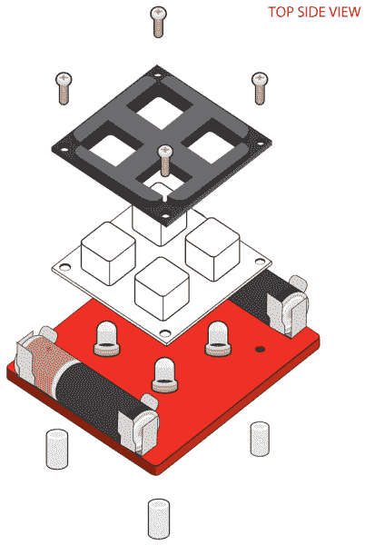](https://cdn.sparkfun.com/assets/learn_tutorials/5/8/4/18_ButtonBezelMountingBattery.png)**Note:** Squishy buttons are fun! The bezel helps hold the buttons in place. The standoffs hold the board up off a surface, helping to protect the electronics. They also hold the pad and bezel onto the board.

这样，你应该有一个功能齐全的西蒙说，你自己建造的！通过将“电源”和“声音”开关拨到“开”的位置来打开它，看看它是否工作。

[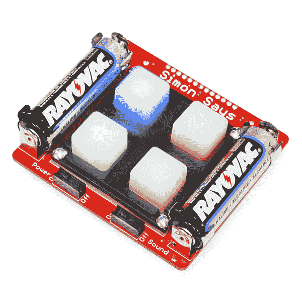](https://cdn.sparkfun.com/assets/learn_tutorials/5/8/4/Simon_Action.jpg)

如果有什么东西不工作(例如，LED 不亮)，请查看我们的故障排除部分。

## 额外的乐趣！

你知道你的西蒙比看上去的要多得多吗？作为 Simon 不仅仅是一款游戏的例子，我们在代码中加入了一些特殊功能。只是为了好玩，试试这个。别担心，这不会永久改变你的西蒙。

将电源开关转到“关闭”位置。

按下任何一个按钮。

[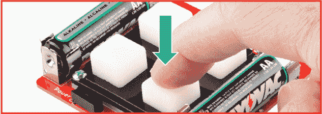](https://cdn.sparkfun.com/assets/learn_tutorials/5/8/4/Bonus2.png)

按住按钮的同时，再次打开西蒙说，以测试我们已经包括的特殊模式之一！

[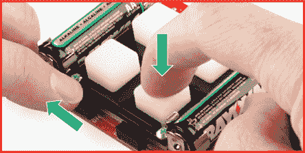](https://cdn.sparkfun.com/assets/learn_tutorials/5/8/4/Bonus3.png)

## 解决纷争

如果你的西蒙没有马上工作，不要烦恼。有很多方法可以让你的电路板出错。查看这些故障排除提示以帮助诊断问题。本节还将介绍如何使用工具包附带的焊芯。这就像一个用于焊接错误的橡皮擦，如果出现错误，它会非常方便。

### 发光二极管

即使有足够的焊点，LED 灯也不亮？不要烦恼，有一个简单的方法来解决它！故障指示灯最常见的原因是极性不正确。我们在 Simon PCB 的设计中设计了一个特殊的技巧。您可以简单地切断两条走线并闭合两条跳线。这将交换极性，而不必移除 LED。

[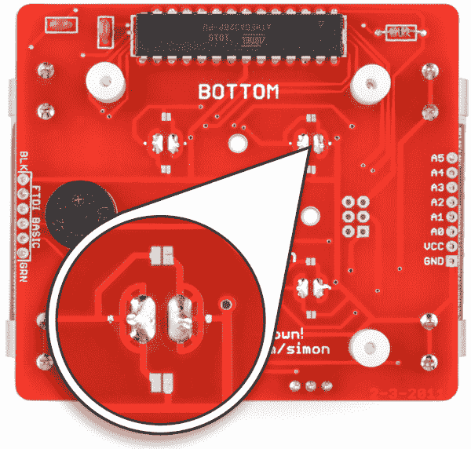](https://cdn.sparkfun.com/assets/learn_tutorials/5/8/4/TroubleshootLEDs0.png)

使用业余爱好刀，直接在白点上切割两条暴露的痕迹。为了进行测试，尝试使用设置为测量连续性的[万用表](https://learn.sparkfun.com/tutorials/how-to-use-a-multimeter#continuity)来探测焊盘和 LED 引脚之间的迹线。这有助于确定迹线是否被完全切断。

[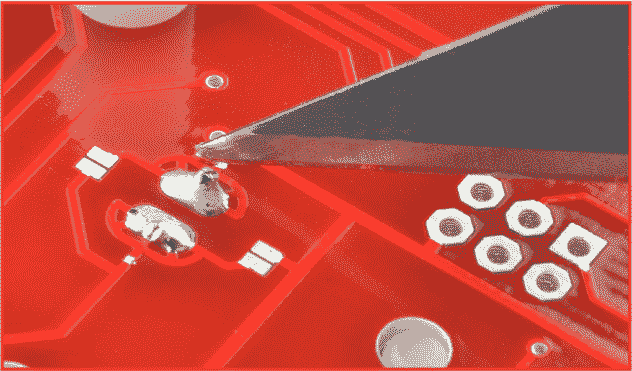](https://cdn.sparkfun.com/assets/learn_tutorials/5/8/4/TroubleshootLEDs1.png)

使用烙铁，用一些焊料封闭两个跳线焊盘。下图显示了其中一个焊盘被关闭的示例。

[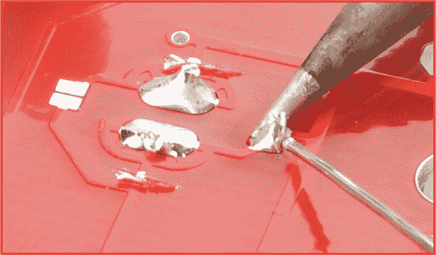](https://cdn.sparkfun.com/assets/learn_tutorials/5/8/4/TroubleshootLEDs2.png)

### [焊接跳线](#solder_wick)

你是否不小心在不应该包括跳线的两个脚之间焊接了跳线？不要烦恼。这里有一个简单的过程，使用焊芯去除多余的焊料。

找到焊芯。

[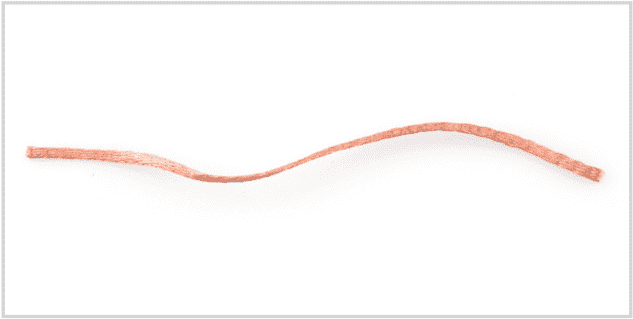](https://cdn.sparkfun.com/assets/learn_tutorials/5/8/4/TroubleshootSolderJumper1.png)

将焊芯放在焊料上。

将铁放在焊芯顶部。保持 3-4 秒钟。

一旦焊料开始流入吸液芯，将吸液芯和烙铁同时拉开。

## 资源和更进一步

### 把一切都包起来

我希望这是一次有趣的学习经历。焊接比看起来容易得多，对许多行业和爱好来说都是有用的工具。如果你仍然觉得你需要更多的帮助，你可以看看下面的视频。它的步骤与这里提到的步骤相同，但是，有时看到别人这样做比试图解释它更容易。

[https://www.youtube.com/embed/QOhDPSbQH-o/?autohide=1&border=0&wmode=opaque&enablejsapi=1](https://www.youtube.com/embed/QOhDPSbQH-o/?autohide=1&border=0&wmode=opaque&enablejsapi=1)

**Note:** Please note that the video showcases a different version of the Simon Says, but it still highlights all the main components and shows you the proper way to assemble them.

### Bootloader 注意:使用 Arduino 重新编程 ATmega328P 微控制器！

既然您已经成功地启动并运行了 Simon Says，那么是时候将它整合到您自己的项目中了！

#### Arduino IDE

这款 ATmega328P 预编程有 Simon 代码和 STK500 串行引导程序。这个串行引导程序将允许你使用 Arduino IDE 对 Simon 游戏重新编程。选择烧录到 Atmega328P 芯片的“**lily pad Arduino w/atmega 328**”引导加载程序，可以对 Simon 重新编程，让它做许多不同的事情！你可以写代码把你的 Simon 变成一个新的独特的项目。尝试浏览我们的 GitHub 资源库，其中包含默认示例代码和其他示例:

[Simon Says GitHub Repository](https://github.com/sparkfun/Simon-Says/tree/master/Firmware)

#### 上传代码的部件

要将新代码上传到主板，我们需要套件中没有的额外组件。

 

将**添加到您的[购物车](https://www.sparkfun.com/cart)中！**

### [SparkFun FTDI 基本突破- 3.3V](https://www.sparkfun.com/products/9873)

[In stock](https://learn.sparkfun.com/static/bubbles/ "in stock") DEV-09873

这是我们[FTDI Basic](https://www . spark fun . com/products/retired/8772)的最新修订版。我们现在使用 SMD 6 针头…

$16.9566[Favorited Favorite](# "Add to favorites") 55[Wish List](# "Add to wish list")**** 

将**添加到您的[购物车](https://www.sparkfun.com/cart)中！**

### [破开头球——直击](https://www.sparkfun.com/products/116)

[In stock](https://learn.sparkfun.com/static/bubbles/ "in stock") PRT-00116

一排标题-打破适应。40 个引脚，可切割成任何尺寸。用于定制 PCB 或通用定制接头。

$1.7520[Favorited Favorite](# "Add to favorites") 133[Wish List](# "Add to wish list")**** 

将**添加到您的[购物车](https://www.sparkfun.com/cart)中！**

### [SparkFun USB 迷你-B 线- 6 脚](https://www.sparkfun.com/products/11301)

[In stock](https://learn.sparkfun.com/static/bubbles/ "in stock") CAB-11301

这是一条 USB 2.0 型到 Mini-B 型 5 针电缆。你知道，通常带有 USB 集线器、相机、MP3 的迷你 B 连接器…

$4.503[Favorited Favorite](# "Add to favorites") 20[Wish List](# "Add to wish list")****** ******为了学习如何在 Arduino IDE 中使用 Simon Says，我们有一些教程。要开始学习，建议从本教程开始:

 [### 西蒙说实验

#### 2010 年 10 月 21 日](https://learn.sparkfun.com/tutorials/simon-says-experiments) So you've built up a Simon Says kit? What next? This tutorial will get you up and running with Arduino software, guide you through a few example sketches, and send you on your way to create your own. Careful, this stuff is highly addictive. :)[Favorited Favorite](# "Add to favorites") 2

* * *

有关更多信息，请查看以下资源:

*   [示意图(PDF)](http://cdn.sparkfun.com/datasheets/Kits/Simon-PTH-v17.pdf)
*   [老鹰文件(ZIP)](http://cdn.sparkfun.com/datasheets/Kits/Simon-PTH-v17.zip)
*   [焊接教程](http://www.sparkfun.com/tutorials/354)
*   [西蒙说汇编指令(PDF)](https://cdn.sparkfun.com/datasheets/Kits/SFE03-0010-KitCard-SimonPTH-WebVersion-02.pdf)
*   [制作 Simon PTH 套件演示视频](https://www.youtube.com/watch?v=QOhDPSbQH-o)
*   [引导程序说明(PDF)](http://cdn.sparkfun.com/datasheets/Kits/Simon_Bootloader_Note.pdf)
*   [原型西蒙在一个试验板上说，该试验板带有用于 Arduino 的 spark fun SIK 3.3 版](https://learn.sparkfun.com/tutorials/sik-experiment-guide-for-arduino---v33/experiment-16-simon-says)
*   [西蒙说默认代码(ZIP)](http://www.sparkfun.com/datasheets/Kits/Simon-PTH-v2.zip)
*   [西蒙说 GitHub 库](https://github.com/sparkfun/Simon-Says) -(设计文件&示例代码)

你的下一个项目需要一些灵感吗？查看一些相关教程:

 [### 西蒙无线公司](https://learn.sparkfun.com/tutorials/simon-splosion-wireless) This is a tutorial demonstrating one of many techniques to "hack" the Simon Says. We will highlight the technique to take your Simon Says Wireless.[Favorited Favorite](# "Add to favorites") 3 [### Simon 倾斜组件导轨](https://learn.sparkfun.com/tutorials/simon-tilts-assembly-guide) This tutorial will guide you through assembling your Simon Tilts PTH Kit.[Favorited Favorite](# "Add to favorites") 3 [### 西蒙说实验](https://learn.sparkfun.com/tutorials/simon-says-experiments) So you've built up a Simon Says kit? What next? This tutorial will get you up and running with Arduino software, guide you through a few example sketches, and send you on your way to create your own. Careful, this stuff is highly addictive. :)[Favorited Favorite](# "Add to favorites") 2

或者看看这些博客上的想法

 [### 创建自定义倾斜传感器

March 3, 2014](https://www.sparkfun.com/news/1410 "March 3, 2014: While designing our new Simon Tilts Through Hole Soldering Kit, we ultimately found that the best solution for the tilt sensor involved creating a custom plastic part. Here is the story of this project - including a couple interviews with the people that helped us along the way.")[Favorited Favorite](# "Add to favorites") 0 [### 英语星期四:巨石反弹

May 31, 2018](https://www.sparkfun.com/news/2696 "May 31, 2018: A re-creation of our Simon Says Soldering Kit using trampolines, spot lights and a ton of new sounds!")[Favorited Favorite](# "Add to favorites") 0 [### Enginursday:使用规则创建随机序列

September 27, 2018](https://www.sparkfun.com/news/2769 "September 27, 2018: Let's take a closer look at the quasi-random sequence generator for the Simon Says Trampolines project, and how a buggy first attempt was improved!")[Favorited Favorite](# "Add to favorites") 0

如果您还有任何问题或意见，请在下面的评论区留下。焊接愉快！**********************