# 西蒙无线公司

> 原文：<https://learn.sparkfun.com/tutorials/simon-splosion-wireless>

## 介绍

**Heads up!** Originally, this tutorial was written to configure an XBee Series 1 to communicate in transparency mode. However, this can apply to the XBee Series 3 module as long as you configure the firmware to the legacy 802.15.4 protocol. For more information, check out the [Exploring XBees and XCTU](https://learn.sparkfun.com/tutorials/exploring-xbees-and-xctu) tutorial.

西蒙是由米尔顿·布拉德利制作的经典游戏。孩子们玩这个游戏已经很多年了，可以追溯到 1978 年。真是令人印象深刻！我甚至无法想象 1978 年有什么样的电子产品！

[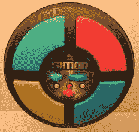](https://cdn.sparkfun.com/assets/2/b/2/8/d/52851437757b7fda5d8b4567.jpg)

SparkFun 创建了我们自己的这个游戏的[版本](https://www.sparkfun.com/products/10547)，现在运行在 ATmega328 芯片上(与 Arduino Uno 上的微控制器相同)。这最初是作为一个简单的焊接工具设计的，但我们很快意识到它有更大的潜力，也可以用来教编程。有了几个[插头](https://www.sparkfun.com/products/553)和一个 [FTDI 分线点](https://www.sparkfun.com/products/9716)，你就可以开始在 Arduino 中重新编程你的 Simon 了。

我们的基本游戏以单人模式运行。《西蒙密码》有许多改编版本，包括允许两个玩家互相挑战的战斗模式。

### 复活节彩蛋？

如果你还没有发现这些，我们已经在代码中嵌入了两个复活节彩蛋。第一种是比吉斯迪斯科模式。当你打开西蒙看这个的时候按住右下角的按钮。

还有一个我们编程的“战斗模式”版本。打开设备时，按住右上角的按钮。要开始游戏，第一个玩家应该点击一个按钮。把西蒙传给你的对手。你的对手重复按下按钮，添加第二个按钮，然后将其传回。继续模仿该模式，并为每一轮添加一个新按钮。这种模式一直重复，直到有人输了。

明白了吗？

等等！我很久以前买了我的西蒙说套件，它没有这个功能？别担心。我们将向您展示如何更新和修改您的代码。

### 您需要开始做的事情:

*   至少有一个[西蒙说 PTH 试剂盒](https://www.sparkfun.com/products/10547)
*   [FTDI 基本程序员](https://www.sparkfun.com/products/9716)
*   [USB 迷你 B 线](https://www.sparkfun.com/products/11301)
*   这些[直角接头](https://www.sparkfun.com/products/553)

你还需要一些东西来添加无线功能，但是让我们先做一些简单的修改。

### 推荐阅读

*   [如何焊接](https://learn.sparkfun.com/tutorials/how-to-solder-through-hole-soldering)
*   什么是 Arduino？
*   [探索 XBees 和 XCTU](https://learn.sparkfun.com/tutorials/retired---exploring-xbees-and-xctu)
*   [安装 Arduino](https://learn.sparkfun.com/tutorials/installing-arduino-ide)
*   [西蒙扭捏着](https://www.sparkfun.com/tutorials/203)

## 修改

### 步骤 1 -焊接编程接头

要对 Simon 进行编程，我们需要访问 FTDI 引脚。把你的西蒙板翻过来。要上传代码，你需要将标有 GRN 的丝网连接到 GN，将 BLK 连接到 BLK。

| [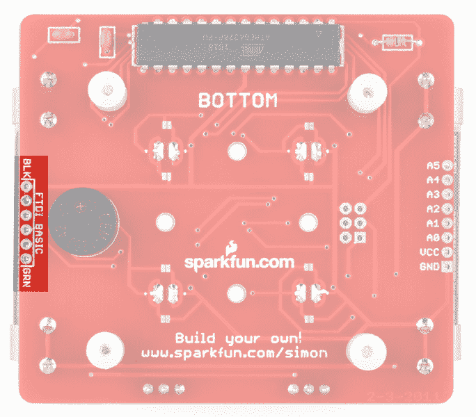](https://cdn.sparkfun.com/assets/learn_tutorials/1/5/5/SimonSaysPTHFTDIHeader2.png) | [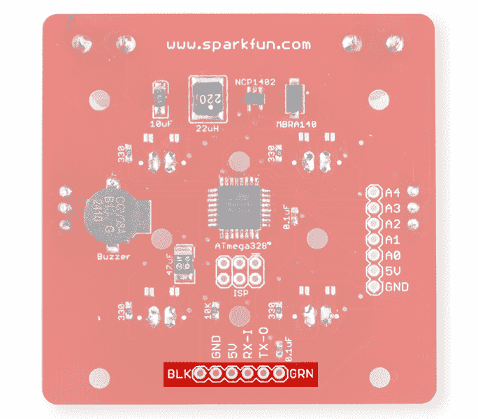](https://cdn.sparkfun.com/assets/learn_tutorials/1/5/5/SimonSaysSMDFTDIHeader5.png) |
| *FTDI 头位置为西蒙表示 PTH 版本。* | *FTDI 头位置为 Simon 表示 SMD 版本。* |

这里有六个图钉。我喜欢将这些[直角接头](https://www.sparkfun.com/products/553)焊接到引脚上。

[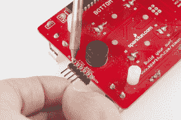](https://cdn.sparkfun.com/assets/e/3/a/2/3/528467f9757b7f17468b4567.jpg)

或者，如果你没有[烙铁](https://www.sparkfun.com/search/results?term=Soldering+iron&what=products)或者你不想焊接，你可以使用[直针头](https://www.sparkfun.com/products/116)。对设备编程时，只需将连接器固定在孔中。这些孔就是我们所说的镀通孔。这意味着每个孔都有一个连接到焊盘的金属圆柱体。如果您以某个角度握住直插头，它应该能与插头形成良好的电气连接。

### 步骤 2 -下载默认示例代码

如果你的 Simon 是旧版本或者没有两个复活节彩蛋，点击[这里](https://github.com/sparkfun/Simon-Says)获取来自 github 的最新代码。如果你需要复习如何使用 GitHub，请访问我们的[教程](https://learn.sparkfun.com/tutorials/using-github)。

打开/解压这个文件到你的电脑上。注意:您必须解压缩文件才能使用它们。Windows 通常允许您查看压缩文件中的文件，但您无法访问所有文件。

在\ Simon-Says-master \ Firmware \ Simon _ Says \文件夹下，您应该可以找到 Arduino 代码- Simon_Says.ino

[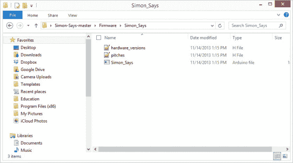](https://cdn.sparkfun.com/assets/c/3/9/6/3/52852fce757b7f9d5d8b456b.jpg)

在 Arduino 中打开此文件。

[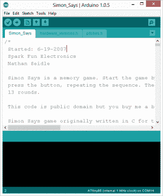](https://cdn.sparkfun.com/assets/f/2/2/5/6/5285305a757b7f285d8b4568.jpg)

### 第 3 步-上传给西蒙说

使用 FTDI Basic 和 USB 电缆，将 Simon 连接到您的计算机。

[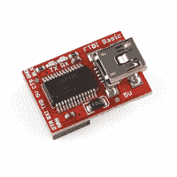](https://cdn.sparkfun.com/assets/b/e/2/0/3/5285318e757b7f715d8b456a.jpg)

注意将 FTDI 基础上的 BLK 和 GRN 标记与 Simon 上的标签对齐。

#### 设置电路板类型

西蒙说使用的是带 ATMega328 引导程序的 LilyPad Arduino。这是因为我们在 ATMega328 上使用内部振荡器，而不是在 [Arduino Uno](https://www.sparkfun.com/products/11224) 或 [RedBoard](https://www.sparkfun.com/products/11575) 上使用单独的晶体。

在 Arduino 的工具菜单下，将电路板类型更改为*lily pad Arduino w/atmega 328*。

选择合适的串行端口(通常最大的 COM#用于 PC，而\dev\tty\usb-serialxxxx 用于 Mac 和 Linux)。

确保 Simon 有电池并且已打开，然后单击上传。

记住这段代码中有两个复活节彩蛋。一个是在开机时按住右下角按钮触发的，另一个是按住右上角按钮触发的。

## 黑了西蒙说板

现在你可以开始重新编程你的西蒙了。

不久前，我们创建了一个关于调整西蒙说板的教程-[https://www.sparkfun.com/tutorials/203](https://www.sparkfun.com/tutorials/203)。图片是旧版本的，但是实验和文档都适用于当前版本的 Simon。在这里，你还可以找到和[一起玩的示例实验。](https://cdn.sparkfun.com/assets/learn_tutorials/1/5/5/SimonExperimentsUpdated.zip)

[Simon Experiments Updated (ZIP)](https://cdn.sparkfun.com/assets/learn_tutorials/1/5/5/SimonExperimentsUpdated.zip)

为了帮助您破解 Simon Says 板，以下是关于电镀通孔(PTH) Simon 上的 led、按钮和蜂鸣器的一些注意事项:

针脚 4 和 7 与蜂鸣器相连。要使用 tone()命令，将引脚 4 和引脚 7 都设置为输出，以 digitalWrite(7，低)开始，并使用 tone(4，freq)；来驱动蜂鸣器。

如果你碰巧得到了 Simon 的 SMD 版本,管脚分配会有一点不同。以下是表面贴装器件(SMD) Simon 上 led 和按钮的引脚排列:

[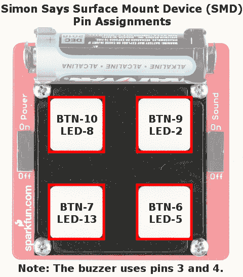](https://cdn.sparkfun.com/assets/learn_tutorials/1/5/5/SimonSaysSMDTopView.png)

蜂鸣器位于针脚 3 和 4 之间。

如果你很好奇，可以看看皮特的教程，摆弄一下西蒙。它有 4 个按钮，4 个发光二极管，一个蜂鸣器，以及 6 个额外的 I/O 引脚。你能为它想出什么很酷的游戏或应用？一定要分享回来给 [us](https://www.sparkfun.com/project_calls) ！

现在，我们将向您展示如何将无线 XBee 通信添加到您的 Simon Says。

## 西蒙说——走向无线(第一部分)

现在你已经在你的 Simon 上安装了最新的固件代码，并且你已经在战斗模式 Simon 上挑战了你的朋友，下一步是什么？嗯，我们认为有一个无线战斗模式版本的西蒙游戏会很棒。因此，我们加快了步伐，给我们的设备添加了一个 XBee 无线模块。

如果你没有玩过 XBee，看看我们的[Xciting XBee 类](https://learn.sparkfun.com/curriculum/15)中的资料。为此我们不会深究 XBee 方面。事实上，我们将只使用两台 XBees 及其标准出厂设置。注意——这只适用于一个房间里的两个 XBees。如果您希望拥有多个无线战斗模拟器，您需要单独配置和配对 XBees。

现在，让我们开始黑我们的西蒙去无线！

### 您需要什么:

[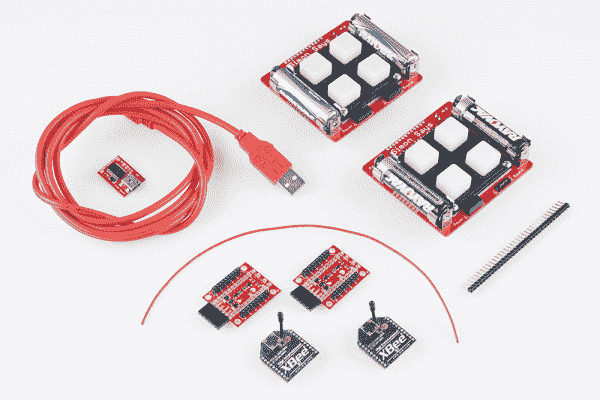](https://cdn.sparkfun.com/assets/a/9/0/3/1/528467f8757b7f0f468b4567.jpg)

*   2x [西蒙说甲状旁腺激素试剂盒](https://www.sparkfun.com/products/10547)
*   2x [XBee 无线模块(系列 1 或系列 2)](https://www.sparkfun.com/products/8665)
*   2x [XBee Xplorer](https://www.sparkfun.com/products/11373)
*   2x [6 针母接头](https://www.sparkfun.com/products/9429)
*   [焊料/烙铁](https://www.sparkfun.com/products/11101)
*   [18 AWG 或更小电线的短长度](https://www.sparkfun.com/products/8023)
*   1x [直角外螺纹接头](https://www.sparkfun.com/products/553)
*   [FTDI 基本分线点](https://www.sparkfun.com/products/9716)

想把这些都加入你的购物车吗？点击[查看完整的愿望清单](https://www.sparkfun.com/wish_lists/73870)

### 电路改造/焊接

#### 向 FTDI 添加公接头引脚

如果您跳过这一步，请确保将插头引脚焊接到 Simon 背面的 FTDI 引脚上。这是我们在这里做的一块板子的图像:

[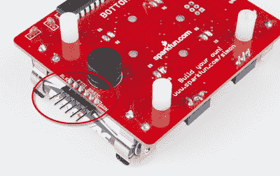](https://cdn.sparkfun.com/assets/1/c/3/d/7/52854428757b7f885d8b4567.jpg)

通常，FTDI 接头连接到电路板的主电源。由于某些原因，我不会在这里深入讨论，我们最初的电路板设计中没有这样做。所以，我们需要在这里添加一个小的修改。我们需要从 FTDI 接头上的 Vcc(电源)引脚到 Simon 上的 Vcc 焊接一根短导线(约 3 - 4 英寸)。

翻转西蒙，这样你就能看到写着底部的那一面。取一小段实芯线，将其焊接到 FTDI 接头顶部的第三个引脚(标有 BLK)。如果你仔细看，你会发现我用尖嘴钳在金属丝的末端做了一个小钩子。我发现这是更容易举行线在适当的位置，而我是焊接。进行此操作时，小心不要熔化蜂鸣器外壳。蜂鸣器真的离这些针很近！

[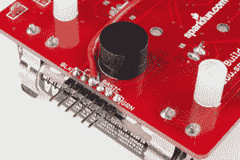](https://cdn.sparkfun.com/assets/e/c/4/1/c/528467f8757b7f36458b4567.jpg)

现在，把线的另一端焊接到电源开关的外部引脚上(这也是右边——当电路板倒置时)。完成后应该是这样的。我建议使用比这里所示长度稍长的电线:

[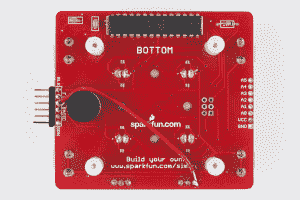](https://cdn.sparkfun.com/assets/e/8/b/a/e/528467f8757b7f3f458b4567.jpg)

对另一个西蒙重复这些步骤。

### 新固件

如果你还没有下载固件代码，请从 github 下载[这里](https://github.com/sparkfun/Simon-Says/archive/master.zip)。

固件子文件夹下有一个名为 Simon_Wireless 的文件夹。打开文件 Simon_Wireless.ino，并将其上传到您的两个 Simon。请记住，ATMega328 应使用*lily pad Arduino w/atmega 328*电路板设置进行编程。

## 西蒙说-去无线(第二部分)

现在，您已经焊接了接头，进行了修改，并在您的两个 Simons 上安装了新的固件。只要再走几步，你就可以开始无线战斗了。

### 配置 XBees

XBees 的出厂设置将适用于本教程。然而，如果你想配置你的 XBee，你需要得到一个 [XBee USB Exporer](https://www.sparkfun.com/products/9819) 。你可以通过终端窗口的 [AT 命令](https://cdn.sparkfun.com/learn/materials/29/22AT%20Commands.pdf)或者使用 [XCTU](http://www.digi.com/support/kbase/kbaseresultdetl?id=2125) 这样的程序来改变 XBee 的设置。

如果您更改设置，只需确保您有两个相互直接配对的 XBees。

### 将接头焊接到 [XBee Explorer](https://www.sparkfun.com/products/11373)

XBee Explorer 没有配备接头引脚。因此，我们需要将[直角母接头](https://www.sparkfun.com/products/9429)焊接到这个板上。

[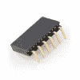](https://cdn.sparkfun.com/assets/f/4/6/0/3/528549f9757b7f673e8b4567.jpg) + [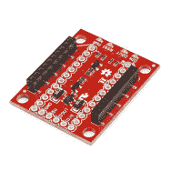](https://cdn.sparkfun.com/assets/1/8/d/2/4/528549fc757b7f6d3e8b4567.jpg)

将 6 针直角接头焊接到 XBee Explorer 边缘的孔中。那里应该正好有六个图钉。

### 让我们来玩吧！

将 XBees 插入之前焊接的 FTDI 接头引脚。你的两个西蒙斯应该是这样的:

[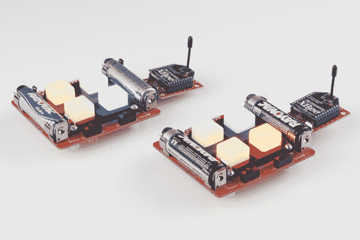](https://cdn.sparkfun.com/assets/d/6/9/6/e/528467f7757b7fa7458b456a.jpg)

#### 怎么玩

打开两个西蒙斯。每个单元将通电并播放一系列闪烁的 led。这将持续到一个玩家按下按钮。该玩家的单位将会变暗，等待序列中的第一个按钮被按下。所以，这是怎么玩的:

*   玩家 1–按任意按钮开始。
*   玩家 1-点击第一个按钮开始一个模式。
*   玩家 2–等待并观察图案亮起。按下亮起的按钮，并向序列中添加另一个按钮。
*   玩家 1 -重复

这个过程会一遍又一遍地重复，直到一个玩家出错。本单元将播放“你输了！”另一个单元将播放“赢家！”调。

想修改或更改代码？好吧-你猜对了。如果想要回原程序，上传 Simon_Says.ino 文件。

## 资源和更进一步

下一步是什么？有了 XBee 和 Simon，你现在就有了一个遥控器。使用它将遥控器添加到机器人或 LED Arduino 项目。修改代码，用它给房间另一边的西蒙发信息！当你准备离开派对的时候，给你的搭档打个信号？

对于一些项目想法，请查看其他 SparkFun 教程:

*   [龙与地下城骰子战书](https://learn.sparkfun.com/tutorials/dungeons-and-dragons-dice-gauntlet)
*   [蓝牙基础知识](https://learn.sparkfun.com/tutorials/bluetooth-basics)
*   [拆卸 MetaWatch 和 Arduino 连接](https://learn.sparkfun.com/tutorials/metawatch-teardown-and-arduino-hookup)
*   [MaKey MaKey 快速入门指南](https://learn.sparkfun.com/tutorials/makey-makey-quickstart-guide)