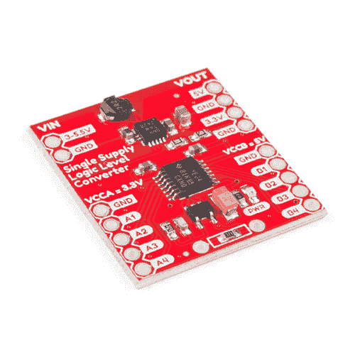

# 单电源逻辑电平转换器连接指南

> 原文：<https://learn.sparkfun.com/tutorials/single-supply-logic-level-converter-hookup-guide>

## 介绍

[单电源逻辑电平转换器](https://www.sparkfun.com/products/14765)将一个升压转换器(TPS61200)、可调电压调节器(MIC5205)和逻辑电平转换器(TXB0104)组合在一块电路板上。它为 TXB0104 的高端提供 5V 电压，低端可编程为 3.3V、2.5V 和 1.8V。默认低端电压为 3.3V。使用该器件，您可以将 5V 微控制器与 3.3V 传感器配合使用，反之亦然，而无需第二个电源！

 

### [SparkFun 逻辑电平转换器-单电源](https://www.sparkfun.com/products/14765)

[Out of stock](https://learn.sparkfun.com/static/bubbles/ "out of stock") PRT-14765

SparkFun 单电源逻辑电平转换器是一个小封装中的逻辑电平和电源转换器。

[Favorited Favorite](# "Add to favorites") 6[Wish List](# "Add to wish list")

[https://www.youtube.com/embed/SVMLFSWqFVU/?autohide=1&border=0&wmode=opaque&enablejsapi=1](https://www.youtube.com/embed/SVMLFSWqFVU/?autohide=1&border=0&wmode=opaque&enablejsapi=1)

这款逻辑电平转换器的独特之处在于，您可以为其提供 3.3V 电压，它会将其升压至 5V，这意味着您可以使用您的 3.3V 系统，直接转换至另一个 5V 传感器，甚至为您的传感器或其它电路板供电！例如，我们将使用 3.3V 微控制器和 5V 传感器。不过，您仍然可以将该板与 5V 微控制器和 3.3V 传感器一起使用。

### 所需材料

为了完成本项目教程，您需要以下材料来实现 3.3V 微控制器与 5V 传感器之间的电平转换。你可能不需要所有的东西，这取决于你有什么。将它添加到您的购物车，通读指南，并根据需要调整购物车。