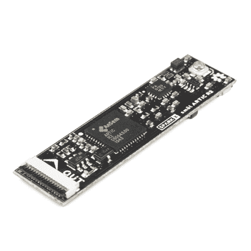
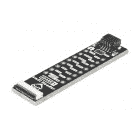
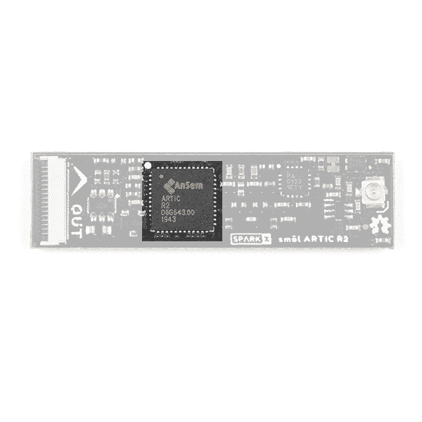
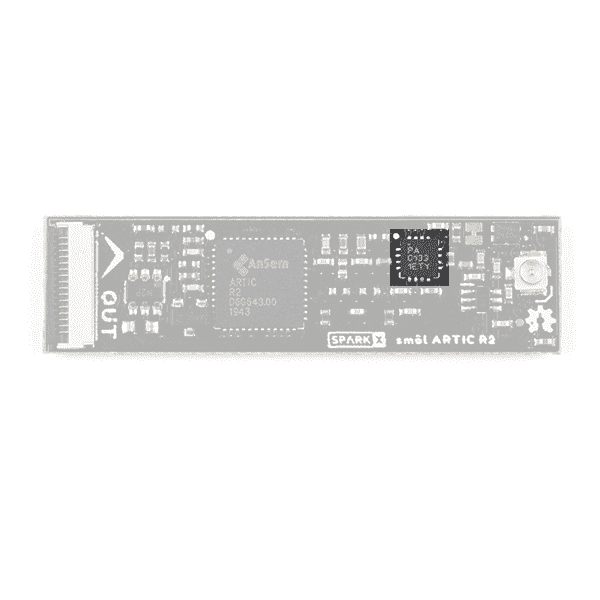
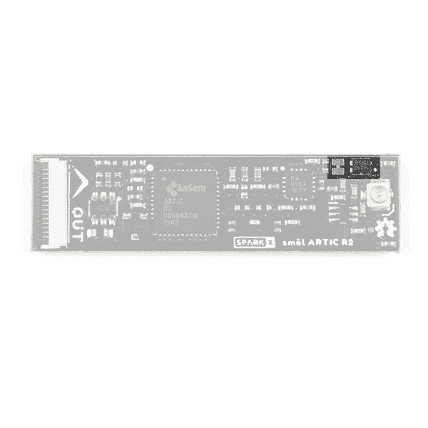
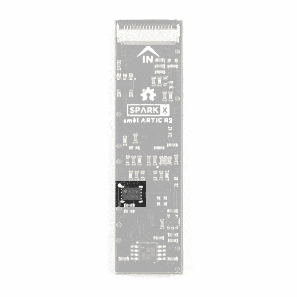
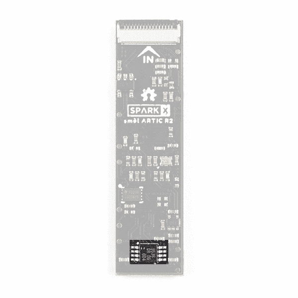
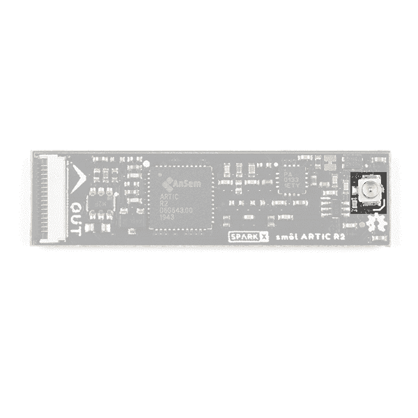
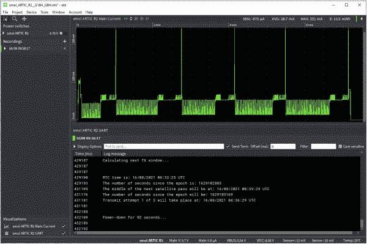
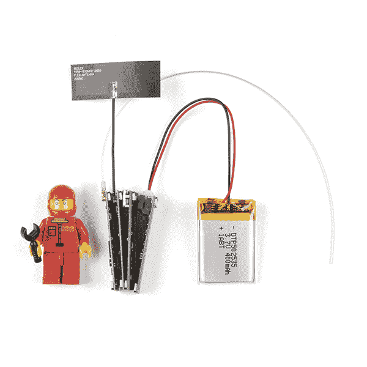

# SML ARTIC R2 连接指南

> 原文：<https://learn.sparkfun.com/tutorials/sml-artic-r2-hookup-guide>

## 介绍

smol 是一种新的主板格式，顾名思义，它们*真的*小！

[](https://www.sparkfun.com/products/18618) 

将**添加到您的[购物车](https://www.sparkfun.com/cart)中！**

### [【北极精灵 R2】](https://www.sparkfun.com/products/18618)

[Out of stock](https://learn.sparkfun.com/static/bubbles/ "out of stock") SPX-18618

我们的红纸板很棒。但是他们有时候是不是显得有点* * _ 大 _**？！进入* * SML * *，这是一个新系列的主板，它…

$199.95[Favorited Favorite](# "Add to favorites") 5[Wish List](# "Add to wish list")** **SML 北极 R2 外围板是 ARGOS 卫星网络的完整卫星收发器。

当我们设计 ARGOS 卫星收发器防护罩-北极 R2 时，我们知道人们会希望将其用于野生动物跟踪等应用。事实上，所有使用 ARGOS 的程序都必须以某种方式与环境保护、意识或研究或保护人类生命有关。但是如果你想开发更小的东西呢？比如说，一个用来追踪鲸鱼的小镖，或者一个用来追踪鸟类的小背包。或者你只是需要你的电池持续几个月。SML 旨在满足这些需求。

每个 SML 板的尺寸仅为 1.60 英寸乘 0.42 英寸(40.6 毫米乘 10.7 毫米)。我们把电路板做得足够宽，这样我们就可以在上面挤压 USB-C 和 16 路柔性印刷电路(FPC)连接器。一些电路板在顶层和底层都有元件，这也有助于保持电路板的小型化。

SML 板设计为一个堆叠在另一个之上，使用 16 路 0.5 毫米间距 FPC 来提供板与板之间的互连。每块板在底层有一个 **IN** FPC 连接器，在顶层有一个 **OUT** FPC 连接器。这些板堆叠成之字形菊花链；信号和电源通过 FPC 从一个电路板上下传递到下一个电路板。

### 所需材料

至少，您需要一个合适的天线:

[](https://www.sparkfun.com/products/17523) 

将**添加到您的[购物车](https://www.sparkfun.com/cart)中！**

### [ARGOS 全向天线- 401MHz](https://www.sparkfun.com/products/17523)

[In stock](https://learn.sparkfun.com/static/bubbles/ "in stock") WRL-17523

这款四分之一波长天线专为 401MHz 的发射和接收而设计，是 ARGOS ARTIC R2 卫星的完美搭档

$6.95[Favorited Favorite](# "Add to favorites") 1[Wish List](# "Add to wish list")** **北极 R2 外围板是 SML 生态系统的一部分。为什么不将其与 smol 处理器板配对呢？

[](https://www.sparkfun.com/products/18619) 

将**添加到您的[购物车](https://www.sparkfun.com/cart)中！**

### [smol esp 32](https://www.sparkfun.com/products/18619)

[24 available](https://learn.sparkfun.com/static/bubbles/ "24 available") SPX-18619

我们的红纸板很棒。但是他们有时候是不是显得有点* * _ 大 _**？！进入* * SML * *，这是一个新系列的主板，它…

$17.951[Favorited Favorite](# "Add to favorites") 4[Wish List](# "Add to wish list")** **

为了能够将睡眠电流降低到 10 A 以下，您需要将 ESP32 与我们的智能 SML 电源板之一配对:

[](https://www.sparkfun.com/products/18622) 

将**添加到您的[购物车](https://www.sparkfun.com/cart)中！**

### [SML 电源板脂](https://www.sparkfun.com/products/18622)

[Only 8 left!](https://learn.sparkfun.com/static/bubbles/ "only 8 left!") SPX-18622

我们的红纸板很棒。但是他们有时候是不是显得有点* * _ 大 _**？！进入* * SML * *，这是一个新系列的主板，它…

$17.95[Favorited Favorite](# "Add to favorites") 1[Wish List](# "Add to wish list")****[](https://www.sparkfun.com/products/18621) 

将**添加到您的[购物车](https://www.sparkfun.com/cart)中！**

### [SML 电源板 AAA](https://www.sparkfun.com/products/18621)

[In stock](https://learn.sparkfun.com/static/bubbles/ "in stock") SPX-18621

我们的红纸板很棒。但是他们有时候是不是显得有点* * _ 大 _**？！进入* * SML * *，这是一个新系列的主板，它…

$17.95[Favorited Favorite](# "Add to favorites") 2[Wish List](# "Add to wish list")**** ****当然，卫星追踪系统需要知道它在哪里。为什么不在您的 SML 生态系统中添加一块 SML ZOE-M8Q GNSS 板呢？

[](https://www.sparkfun.com/products/18623) 

将**添加到您的[购物车](https://www.sparkfun.com/cart)中！**

### [【smol Zoe-m8q](https://www.sparkfun.com/products/18623)

[30 available](https://learn.sparkfun.com/static/bubbles/ "30 available") SPX-18623

我们的红纸板很棒。但是他们有时候是不是显得有点* * _ 大 _**？！进入* * SML * *，这是一个新系列的主板，它…

$39.95[Favorited Favorite](# "Add to favorites") 4[Wish List](# "Add to wish list")** **

不要忘记，您需要柔性印刷电路将您的 SML 板连接在一起。每块板上需要一个 FPC。如果你想让 SML 板整齐地叠放在一起，我们的 36 毫米 FPC 是最理想的长度。

[](https://www.sparkfun.com/products/18731) 

将**添加到您的[购物车](https://www.sparkfun.com/cart)中！**

### [SML 36mm 16 路柔性印刷电路](https://www.sparkfun.com/products/18731)

[In stock](https://learn.sparkfun.com/static/bubbles/ "in stock") CAB-18731

这是用于互连 SML 板的 36 毫米 16 路 0.5 毫米间距柔性印刷电路。* * * * * * SML * *是一个 ec…

$0.95[Favorited Favorite](# "Add to favorites") 2[Wish List](# "Add to wish list")** **需要用 smol 做一些原型制作？或者想要将您的 SML 堆栈连接到另一个 Qwiic 板？SML 割台非常适合这种情况:

[](https://www.sparkfun.com/products/18620) 

将**添加到您的[购物车](https://www.sparkfun.com/cart)中！**

### [SML 标题](https://www.sparkfun.com/products/18620)

[Out of stock](https://learn.sparkfun.com/static/bubbles/ "out of stock") SPX-18620

我们的红纸板很棒。但是他们有时候是不是显得有点* * _ 大 _**？！进入* * SML * *，这是一个新系列的主板，它…

$2.95[Favorited Favorite](# "Add to favorites") 2[Wish List](# "Add to wish list")** **

### 推荐阅读

这是 SML ARTIC R2 外围电路板的连接指南。如果您想了解更多关于 smol 的信息，请点击下面的按钮:

[Get started with the smôl Hookup Guide](https://learn.sparkfun.com/tutorials/sml-hookup-guide)

如果您想了解有关与 ARGOS 和北极 R2 通信的更多信息，请单击下面的按钮:

[ARGOS ARTIC R2 Communication Guide](https://learn.sparkfun.com/tutorials/argos-artic-r2-satellite-communication-guide)

如果您不熟悉以下教程中涵盖的概念，我们建议您浏览这些教程:

[](https://learn.sparkfun.com/tutorials/serial-peripheral-interface-spi) [### 串行外设接口(SPI)](https://learn.sparkfun.com/tutorials/serial-peripheral-interface-spi) SPI is commonly used to connect microcontrollers to peripherals such as sensors, shift registers, and SD cards.[Favorited Favorite](# "Add to favorites") 91[](https://learn.sparkfun.com/tutorials/i2c) [### I2C](https://learn.sparkfun.com/tutorials/i2c) An introduction to I2C, one of the main embedded communications protocols in use today.[Favorited Favorite](# "Add to favorites") 128[](https://learn.sparkfun.com/tutorials/three-quick-tips-about-using-ufl) [### 关于使用 U.FL 的三个快速提示](https://learn.sparkfun.com/tutorials/three-quick-tips-about-using-ufl) Quick tips regarding how to connect, protect, and disconnect U.FL connectors.[Favorited Favorite](# "Add to favorites") 14

## 阿尔戈斯和北极 R2

你的项目与环境保护、意识或研究有关，还是与保护人类生命有关？也许你正在开发一个野生动物追踪器，海洋浮标，环境监测系统或需要传输紧急医疗信息？您需要能够在任何地方发送和接收数据吗？如果是这样，这就是适合您的 smol 产品！我们的 R2 北极站允许您通过 ARGOS 卫星网络在地球上的任何地方(包括极地地区)发送和接收短脉冲数据。

ARGOS 卫星系统已经存在很长时间了。它于 1978 年由法国航天局(CNES)、美国国家航空航天局(NASA)和美国国家海洋和大气管理局(NOAA)创建，最初是作为收集和转发世界各地气象和海洋学数据的科学工具。今天，ARGOS 正在革新卫星通信，增加了 25 颗纳卫星星座，以补充 7 颗携带 ARGOS 仪器的传统卫星。其中的第一个，天使，已经在运行，SparkFun 是第一批在 2020 年 10 月向天使传输数据的用户之一。当星座完成时，卫星通过之间最多有 10-15 分钟的间隔。

北极 R2 是一个集成的，低功耗，小尺寸 ARGOS 2/3/4 单芯片收发器。ARTIC 实现了一个基于消息的无线接口。对于卫星上行链路通信，ARTIC 将对提供的用户信息进行编码、调制和传输。对于下行链路通信，ARTIC 将锁定下行链路，解调和解码并提取卫星消息。根据 ARGOS 卫星系统规范，ARTIC 可以在 400MHz 左右的频带中发射信号，并在 466MHz 左右的频带中接收信号。

R2 的 SML ARTIC 已经过 Kiné is 的测试和认证。与其他卫星通信系统相比，SML ARTIC R2 的电流消耗低得多，并且将与非常简单、非常轻便的四分之一波长线天线一起工作。我们主板上的北极 R2 芯片组采用 3.3V 电源供电，板载闪存支持快速启动。如果您不需要全部发射功率，或者想延长电池寿命，也可以通过光隔离增益控制降低发射功率。

我们的 [Arduino 库](https://github.com/sparkfun/SparkFun_ARGOS_ARTIC_R2_Arduino_Library)让启动和运行 ARGOS 变得非常容易。我们已经提供了一套完整的例子，将让你:配置北极 R2 芯片组；预测下一次卫星通过；接收所有广播和单独编码的消息；使用 ARGOS 2、3 和 4 编码传输消息。有一些[的例子](https://github.com/sparkfun/SparkFun_ARGOS_ARTIC_R2_Arduino_Library/tree/main/examples/smol_ARTIC_R2)是专门为 R2 举办的。

* * *

The ARGOS satellite system is restricted to specific programs and applications. Please check that your project meets these requirements before buying hardware. [CLS (France)](https://www.cls-telemetry.com/argos-solutions/) and the [Woods Hole Group (America)](https://www.clsamerica.com/science-with-argos) will be able to advise if your project meets the requirements. *"To meet system use requirements, all programs using Argos have to be related in some way or other to environmental protection, awareness or study, or to protecting human life."* Please see our [ARGOS ARTIC R2 Communication Guide](https://learn.sparkfun.com/tutorials/argos-artic-r2-satellite-communication-guide#who-can-use-argos) for more details.

* * *

## 硬件概述

在这一节中，我们将介绍 SML ARTIC R2 外围设备板上包含的内容。

### 北极 R2

当然，R2 北极站的核心是 R2 北极站收发器本身。这是一个包含数字信号处理器(DSP)的智能芯片，可以调制发送消息和解调接收消息。DSP 可以通过 SPI 从片上闪存或外部微控制器引导。发射时，它产生一个 1mW (0dBm)的输出信号，该信号被馈送到一个单独的功率放大器。

[](https://cdn.sparkfun.com/assets/learn_tutorials/2/0/5/6/18618_smol_ARTIC_R2.jpg)

我们的 [Arduino 库](https://github.com/sparkfun/SparkFun_ARGOS_ARTIC_R2_Arduino_Library)会为您完成所有繁重的工作。默认情况下，该库将告诉北极 R2 DSP 从板载闪存启动。不过，只需更改一行代码，您就可以通过 SPI 引导，由微控制器为 DSP 提供固件。

### 射频放大器

发射期间，RFPA0133 功率放大器放大来自北极 R2 的 0dBm (1mW)信号。

[](https://cdn.sparkfun.com/assets/learn_tutorials/2/0/5/6/18618_smol_ARTIC_R2_RF_Amp.jpg)

默认情况下，放大器使用全增益，并将信号提升至约 25.8dBm (380mW)。如果你使用 ARGOS 2 或 3 调制，并从一个“嘈杂”的环境(如城市)传输，那么你可能需要使用最大功率来确保你的信息通过。但是，如果您使用 ARGOS 4 调制和/或从一个“安静”的环境中传输，如苔原或海洋，那么您将能够以较低的功率传输。

### 增益控制

有两种方法可以降低南极 R2 的发射功率。您可以通过软件和板载光隔离增益控制电路来调整增益。

[](https://cdn.sparkfun.com/assets/learn_tutorials/2/0/5/6/18618_smol_ARTIC_R2_Gain.jpg)

我们的 [Arduino 库](https://github.com/sparkfun/SparkFun_ARGOS_ARTIC_R2_Arduino_Library)可以为你降低增益。如果您拨打:

```
language:c
myARTIC.attenuateTXgain(true); 
```

从代码内部，光隔离器会将 RFPA0133 的 G8 引脚拉低，从而将增益降低约 5dB。这还具有将发射电流降低约 80mA 的优势。

如果您正在试验 ARGOS 4 调制，您可能希望进一步降低增益。可以通过打开光隔离器旁边的分离焊盘跳线来实现。断开跳线会拉低 RFPA0133 的 G16 引脚，并将增益降低约 11dB。如果你以前没有用过跳线，请查看我们的教程。

[](https://learn.sparkfun.com/tutorials/how-to-work-with-jumper-pads-and-pcb-traces) [### 如何使用跳线焊盘和 PCB 走线](https://learn.sparkfun.com/tutorials/how-to-work-with-jumper-pads-and-pcb-traces) Handling PCB jumper pads and traces is an essential skill. Learn how to cut a PCB trace, add a solder jumper between pads to reroute connections, and repair a trace with the green wire method if a trace is damaged.[Favorited Favorite](# "Add to favorites") 11

### 闪存

如果你把 R2 冰川翻过来，你就能看到那个小小的闪存芯片。

[](https://cdn.sparkfun.com/assets/learn_tutorials/2/0/5/6/18618_smol_ARTIC_R2_Flash.jpg)

在 SparkFun 进行生产测试期间，我们使用北极 R2 固件(北极 006)和 CLS 分配的平台 ID 对闪存进行编程。您需要在您的 ARGOS 帐户上注册平台 ID 来激活它。

### GPIO 扩展器

电路板底部较大的芯片是 PCA9536 I ² C GPIO 扩展器。

[](https://cdn.sparkfun.com/assets/learn_tutorials/2/0/5/6/18618_smol_ARTIC_R2_GPIO.jpg)

SML 仅支持两个 GPIO 信号，因此我们添加了一个单独的 I ² C GPIO 扩展器，以允许北极 R2 RESETB、INT1 和 BOOT 信号，加上 RF 放大器 G8 引脚，通过 I ² C 进行控制

你不需要直接与 GPIO 扩展器通信，我们的 [Arduino 库](https://github.com/sparkfun/SparkFun_ARGOS_ARTIC_R2_Arduino_Library)会为你做这件事，我们只是让你知道为什么那个芯片在那里。

### 天线

北极 R2 的天线连接是 u.FL

[](https://cdn.sparkfun.com/assets/learn_tutorials/2/0/5/6/18618_smol_ARTIC_R2_u.FL.jpg)

如果你以前没有使用过 u.FL，请查看我们的教程:

[](https://learn.sparkfun.com/tutorials/three-quick-tips-about-using-ufl) [### 关于使用 U.FL 的三个快速提示](https://learn.sparkfun.com/tutorials/three-quick-tips-about-using-ufl) Quick tips regarding how to connect, protect, and disconnect U.FL connectors.[Favorited Favorite](# "Add to favorites") 14

* * *

**Warning:** Always connect a 401MHz antenna to your smôl ARTIC R2 before connecting the power. Transmitting with no antenna attached will damage the RF power amplifier.

* * *

### FPC 关系

像我们所有的 SML 板一样，北极 R2 外围板配备了两个 16 路 0.5 毫米间距的柔性印刷电路连接器。FPC 用于以菊花链形式将 SML 板连接在一起。

SML 北极 R2 输入连接器的引脚排列如下:

| 输入连接器引脚号 | 信号名称 | 功能 | 笔记 |
| one | 进程 _ 功率 _EN | 处理器电源启用 | 未使用 |
| Two | 3V3 | 3.3V 电源轨 |  |
| three | GND | 电源接地/ 0V |  |
| four | SCLK | SPI 时钟 | 用来和北极 R2 联系 |
| five | 科皮 | SPI 控制器输出外设输入 | 用来和北极 R2 联系 |
| six | 奇波 | SPI 控制器输入外设输出 | 用来和北极 R2 联系 |
| seven | CS0 | SPI 片选 0 | 用来和北极 R2 联系 |
| eight | CS1 | SPI 片选 1 | 连接到 OUT 连接器上的引脚 7 (CS0) |
| nine | CS2 | SPI 片选 2 | 连接到 OUT 连接器上的引脚 8 (CS1) |
| Ten | GPIO0 | 电源控制 | 拉高以启用北极 R2 的电源 |
| Eleven | GPIO1 | 通用输入/输出 1 | 连接到 OUT 连接器上的第 10 针(GPIO0) |
| Twelve | 国家药品监督管理局 | I ² C 数据 | 用于与 PCA9536 GPIO 扩展器通信 |
| Thirteen | SCL | I ² C 时钟 | 用于与 PCA9536 GPIO 扩展器通信 |
| Fourteen | GND | 电源接地/ 0V |  |
| Fifteen | 3V3 | 3.3V 电源轨 |  |
| Sixteen | V_USB | USB 电源轨(5V) | 未使用 |

SML 北极 R2 输出连接器的引脚排列如下:

| 外部连接器引脚号 | 信号名称 | 功能 | 笔记 |
| one | 进程 _ 功率 _EN | 处理器电源启用 | 未使用 |
| Two | 3V3 | 3.3V 电源轨 |  |
| three | GND | 电源接地/ 0V |  |
| four | SCLK | SPI 时钟 | 用来和北极 R2 联系 |
| five | 科皮 | SPI 控制器输出外设输入 | 用来和北极 R2 联系 |
| six | 奇波 | SPI 控制器输入外设输出 | 用来和北极 R2 联系 |
| seven | CS0 | SPI 片选 0 | 连接到输入连接器上的针脚 8 (CS1) |
| eight | CS1 | SPI 片选 1 | 连接到 in 连接器上的引脚 9 (CS2) |
| nine | CS2 | SPI 片选 2 | 未连接 |
| Ten | GPIO0 | 通用输入/输出 0 | 连接到 in 连接器上的引脚 11 (GPIO1) |
| Eleven | GPIO1 |  | 未连接 |
| Twelve | 国家药品监督管理局 | I ² C 数据 | 用于与 PCA9536 GPIO 扩展器通信 |
| Thirteen | SCL | I ² C 时钟 | 用于与 PCA9536 GPIO 扩展器通信 |
| Fourteen | GND | 电源接地/ 0V |  |
| Fifteen | 3V3 | 3.3V 电源轨 |  |
| Sixteen | V_USB | USB 电源轨(5V) | 未使用 |

我们在 CS 和 GPIO 信号上使用一种叫做*瀑布式*的技术。如果你以前没有使用过瀑布，请查看 smol 连接指南。

[Get started with the smôl Hookup Guide](https://learn.sparkfun.com/tutorials/sml-hookup-guide)

## 电流消耗

如果您正在使用 R2 北极公司开发自己的野生动物追踪器，您当然会对电路板消耗的电流非常感兴趣。

神奇的 [Otii 电弧功率分析仪](https://www.sparkfun.com/products/18585)让我们能够在所有四种增益设置下捕捉到北极 R2 的精确峰值发射电流，并研究芯片空闲时的平均电流。我们已经使用这些数据来帮助优化[中的代码，在这个例子](https://github.com/sparkfun/SparkFun_ARGOS_ARTIC_R2_Arduino_Library/blob/main/examples/smol_ARTIC_R2/Example2_TransmitARGOS3WithPredictionAndSleep/Example2_TransmitARGOS3WithPredictionAndSleep.ino)中，当使用带有[SML ESP32 处理器板](https://www.sparkfun.com/products/18619)、[SML ZOE-M8Q GNSS 板](https://www.sparkfun.com/products/18623)和[SML 电源板 LiPo](https://www.sparkfun.com/products/18622) 的 SML ARTIC R2 时，尽可能延长电池寿命。

### 最大增益(G16 高电平，G8 高电平)

下图显示了 [Otii Arc](https://www.sparkfun.com/products/18585) 使用[这个例子](https://github.com/sparkfun/SparkFun_ARGOS_ARTIC_R2_Arduino_Library/blob/main/examples/smol_ARTIC_R2/Example2_TransmitARGOS3WithPredictionAndSleep/Example2_TransmitARGOS3WithPredictionAndSleep.ino)在一个完整的传输周期中捕获的电流消耗。这里的增益设置为最大。

[](https://cdn.sparkfun.com/assets/learn_tutorials/2/0/5/6/smol_ARTIC_R2_G16H_G8H.JPG)*Having a hard time seeing? Click the image for a closer look.*

在传输周期开始时，电源板会唤醒 ESP32 处理器板。它打开 ZOE-M8Q GNSS 板并等待修复。这里的电流消耗约为 100mA，持续约 10 秒。

一旦 ESP32 确定了位置，它就可以计算下一次 ARGOS 卫星通过的时间。电源板在下一遍开始前 1 分钟唤醒 ESP32，因此 ESP32 在接下来的约 30 秒内进入和退出轻度睡眠。

“北极 R2”在 40 秒标记处通电，五次传输中的第一次传输发生在一分钟标记之后。

该代码示例在每个卫星通道上传输五次。发送之间的间隔为 90 秒，强制&pm; 10%抖动。在此期间，你可以看到 ESP32 进入和退出浅睡眠，北极 R2 在下一次发射前 20-30 秒通电。

[Otii Arc](https://www.sparkfun.com/products/18585) 捕捉到的惊人数据使我们能够放大发射本身，捕捉真正的最大电流消耗:

[](https://cdn.sparkfun.com/assets/learn_tutorials/2/0/5/6/smol_ARTIC_R2_G16H_G8H_Zoom.JPG)*Having a hard time seeing? Click the image for a closer look.*

然后提取我们需要的数据是轻而易举的事！

### 当前提取摘要

下面总结了四种北极 R2 增益设置的峰值发射电流。RFPA0133 G8 引脚由软件控制。G16 引脚由分离焊盘跳线控制。SML 电池组由 3.7V LiPo 电池供电。

*请注意:此表中的峰值发射电流是实际发射期间 ESP32 +北极 R2 +功率放大器消耗的总峰值电流*

| G16 | 八国集团(Group of Eight) | 近似的发射功率(dBm) | 峰值发射电流(mA) |
| 高的 | 高的 | Twenty-six | Two hundred and thirty-eight |
| 高的 | 低的 | Twenty-one | One hundred and ninety |
| 低的 | 高的 | Fifteen | One hundred and thirty-three |
| 低的 | 低的 | four | One hundred and fourteen |

[Otii Arc](https://www.sparkfun.com/products/18585) 让我们收集我们需要的其他数据:

*   LiPo 电池电压:3.7V
*   一个完整的 5*TX 发射周期内的平均电流消耗(最大增益):29.9mA
*   一个完整的 5*TX 发射周期内的平均电流消耗(最小增益):24.9mA
*   平均连续 ESP32 + ZOE-M8Q GNSS 电流消耗:97mA
*   深度睡眠期间的电流消耗:6.4 A
*   一个完整 5*TX 发射周期的功耗(最大增益):13.3mWh
*   一个完整的 5*TX 发射周期的功耗(最小增益):11.1mWh

然后，我们可以使用这些数据，根据发射功率和每天的发射次数来预测电池寿命。我们的 [Arduino 库](https://github.com/sparkfun/SparkFun_ARGOS_ARTIC_R2_Arduino_Library)中的卫星通过预测代码可以计算出每天卫星通过最高仰角的时间，以最大化接收传输的机会。以最大功率每天传输五次，我们可以预期 2000 毫安时的电池可以持续大约 530 天！即使是下图所示的 400 毫安时的普通电池也应该可以使用 100 多天。

[](https://cdn.sparkfun.com/assets/learn_tutorials/2/0/5/6/smo__l_Boards-03.jpg)

## SML 细节

### 接口:

*   SPI 和 I ² C
    *   SPI 片选:CS0(通过瀑布)
    *   PCA9536 GPIO 扩展器 I ² C 地址:0x41

### GPIO:

*   使用 GPIO0 进行电源控制(通过瀑布)
*   让 GPIO0 悬空或拉低以禁用北极 R2 的电源
*   拉高 GPIO0 以启用北极 R2 的电源
*   电源通过 [SparkFun ARTIC R2 Arduino 库](https://github.com/sparkfun/SparkFun_ARGOS_ARTIC_R2_Arduino_Library/tree/main/examples/smol_ARTIC_R2)自动控制

## Arduino 示例:卫星探测

如果您使用的是 SML ESP32 处理器板，您需要首先为 ESP32 安装 CP210x USB 驱动程序和 Arduino 板软件包。请参见[smol ESP32 连接指南](https://learn.sparkfun.com/tutorials/sml-esp32-hookup-guide)了解更多详情。

SML 北极 R2 外设板与 [SparkFun ARGOS 北极 R2 Arduino 库](https://github.com/sparkfun/SparkFun_ARGOS_ARTIC_R2_Arduino_Library)完全兼容。你可以通过 Arduino IDE 库管理器搜索 **SparkFun ARGOS ARTIC** 来安装这个库。或者，你可以从 [GitHub](https://github.com/sparkfun/SparkFun_ARGOS_ARTIC_R2_Arduino_Library) 下载这个库，或者点击下面的按钮下载成 zip 文件:

[SparkFun ARGOS ARTIC R2 Arduino Library (ZIP)](https://github.com/sparkfun/SparkFun_ARGOS_ARTIC_R2_Arduino_Library/archive/main.zip)

该图书馆包含了久经考验的[专为 SML ARTIC R2 设计的示例](https://github.com/sparkfun/SparkFun_ARGOS_ARTIC_R2_Arduino_Library/tree/main/examples/smol_ARTIC_R2)。下面的代码是[example 3 _ satellite detection](https://github.com/sparkfun/SparkFun_ARGOS_ARTIC_R2_Arduino_Library/blob/main/examples/smol_ARTIC_R2/Example3_SatelliteDetection/Example3_SatelliteDetection.ino)的精简版。将代码复制并粘贴到 Arduino IDE 的一个新窗口中，然后上传到 ESP32。北极 R2 号将尝试探测一颗卫星长达 10 分钟。在运行本示例之前，您可能希望登录 ARGOS 网站并预测下一次卫星通过的时间。

```
language:c
#include <Wire.h> //Needed for I2C to ARTIC R2 GPIO
#include <SPI.h>
#include "SparkFun_ARGOS_ARTIC_R2_Arduino_Library.h" // http://librarymanager/All#SparkFun_ARGOS_ARTIC_R2
ARTIC_R2 myARTIC;

int CS_Pin = 5;            // smôl CS0 = ESP32 Pin 5
int ARTIC_PWR_EN_Pin = 27; // smôl GPIO0 = ESP32 Pin 27

void setup()
{
  Serial.begin(115200);
  Serial.println(F("ARGOS smôl ARTIC R2 Example"));

  Serial.println(F("ARTIC R2 is booting..."));

  Wire.begin(); // Needed to communicate with the I2C GPIO chip on the smôl ARTIC R2
  SPI.begin();

  //myARTIC.enableDebugging(); // Uncomment this line to enable debug messages on Serial

  // Begin the ARTIC: enable power and boot from flash
  if (myARTIC.beginSmol(CS_Pin, ARTIC_PWR_EN_Pin) == false)
  {
    Serial.println("ARTIC R2 not detected. Please check the smôl stack-up and flexible circuits. Freezing...");
    while (1)
      ; // Do nothing more
  }

  Serial.println(F("ARTIC R2 boot was successful."));

  myARTIC.setTCXOControl(1.8, true); // Set the TCXO voltage to 1.8V and autoDisable to 1

  myARTIC.setSatelliteDetectionTimeout(600); // Set the satellite detection timeout to 600 seconds

  Serial.println(F("Starting satellite detection..."));

  // Start satellite detection
  // The ARTIC will start looking for a satellite for the specified amount of time.
  myARTIC.sendMCUinstruction(INST_SATELLITE_DETECTION);
}

void loop()
{
  delay(1000);

  // Read the ARTIC R2 status register
  ARTIC_R2_Firmware_Status status;
  myARTIC.readStatusRegister(&status);

  // Check the interrupt 2 flag. This will go high if satellite detection times out
  if (status.STATUS_REGISTER_BITS.DSP2MCU_INT2)
  {
    Serial.println(F("INT2 pin is high. Satellite detection has timed out!"));
  }
  // Check the interrupt 1 flag. This will go high when a satellite is detected
  else if (status.STATUS_REGISTER_BITS.DSP2MCU_INT1)
  {
    Serial.println(F("INT1 pin is high. Satellite detected!"));
  }

  // Check the instruction progress
  // checkMCUinstructionProgress will return true if the instruction is complete
  ARTIC_R2_MCU_Instruction_Progress progress;
  boolean instructionComplete = myARTIC.checkMCUinstructionProgress(&progress);

  if (instructionComplete)
  {
    Serial.println(F("Satellite detection is complete! Freezing..."));
    while (1)
      ; // Do nothing more
  }
} 
```

## 解决纷争

**Not working as expected and need help?** [SparkX](https://www.sparkfun.com/sparkx) products are rapidly produced to bring you the most cutting edge technology as it becomes available. These products are tested but come with no guarantees. Live technical support is not available for SparkX products. Head on over to our [forum](https://forum.sparkfun.com/viewforum.php?f=123) for support or to ask a question and we will get back to you as soon as we can.

## 资源和更进一步

欲了解更多关于 R2 的信息，请点击以下链接:

**SML ARTIC R2 文档:**

*   [示意图](https://cdn.sparkfun.com/assets/c/3/c/c/2/Schematic.pdf)
*   [老鹰档案](https://cdn.sparkfun.com/assets/6/1/3/6/7/SparkX_smol_ARTIC_R2.zip)
*   [ARGOS 芯片组信息表](https://cdn.sparkfun.com/assets/2/d/c/6/6/ARGOS-Chipset-Info-sheet.pdf)
*   [R2 用户数据表 v1.1 版](https://cdn.sparkfun.com/assets/c/0/8/d/4/ENA303_ARTIC_R2_User_Datasheet_1v10.pdf)
*   [GitHub 硬件回购](https://github.com/sparkfunX/SparkX_smol_ARTIC_R2)
*   [Arduino 示例](https://github.com/sparkfun/SparkFun_ARGOS_ARTIC_R2_Arduino_Library/tree/main/examples/smol_ARTIC_R2)
*   [SparkFun ARGOS ARTIC R2 Arduino 图书馆](https://github.com/sparkfun/SparkFun_ARGOS_ARTIC_R2_Arduino_Library)

**SML 文档:**

*   [SML 连接指南](https://learn.sparkfun.com/tutorials/sml-hookup-guide)

* * *

**Thanks!** The ARTIC R2 circuit is a remix of the reference design kindly provided by the [Arribada Initiative](https://arribada.org/) and Icoteq Ltd.****************