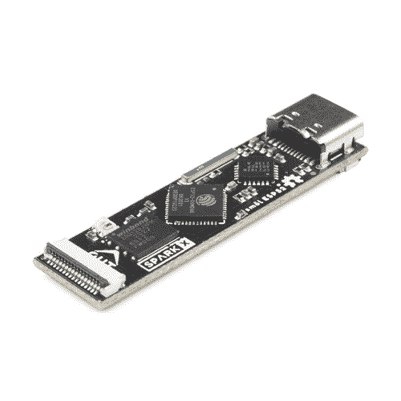
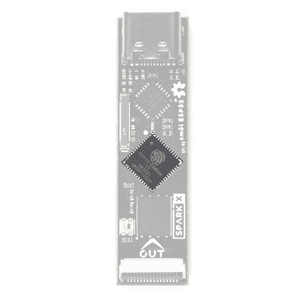
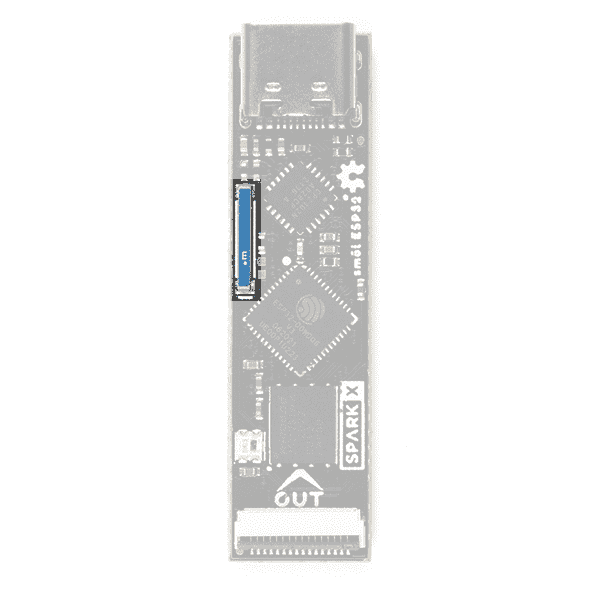
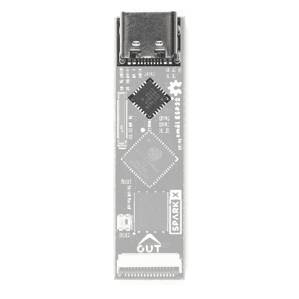
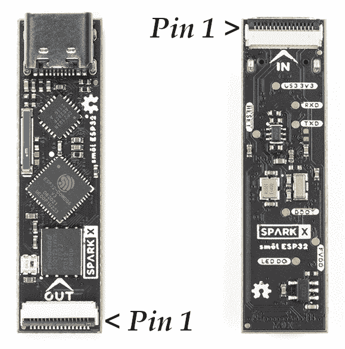
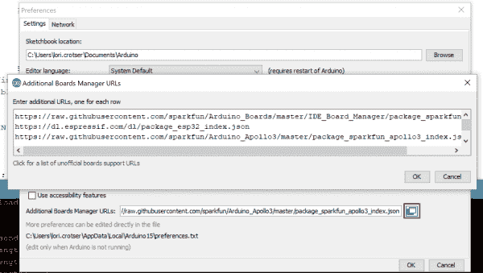
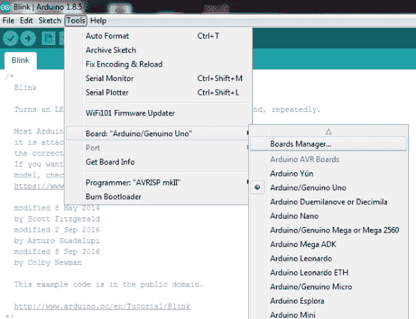
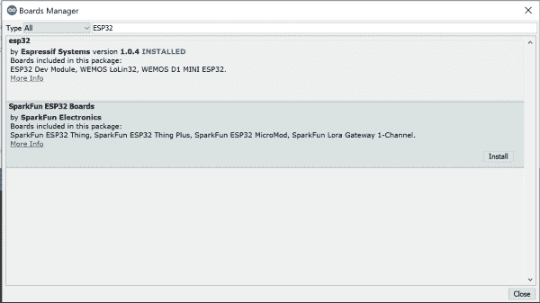
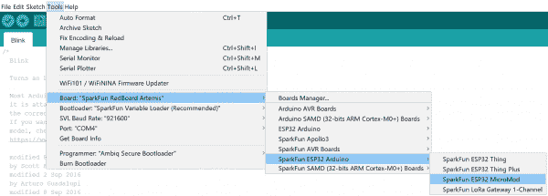
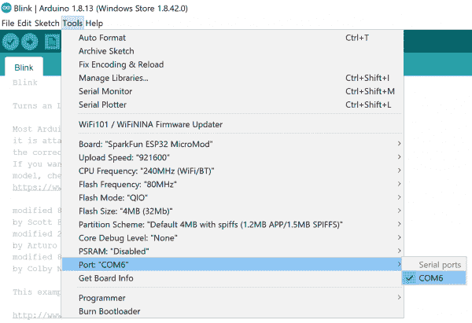

# SML ESP32 连接指南

> 原文：<https://learn.sparkfun.com/tutorials/sml-esp32-hookup-guide>

## 介绍

smol 是一种新的主板格式，顾名思义，它们*真的*小！

[](https://www.sparkfun.com/products/18619) 

将**添加到您的[购物车](https://www.sparkfun.com/cart)中！**

### [smol esp 32](https://www.sparkfun.com/products/18619)

[24 available](https://learn.sparkfun.com/static/bubbles/ "24 available") SPX-18619

我们的红纸板很棒。但是他们有时候是不是显得有点* * _ 大 _**？！进入* * SML * *，这是一个新系列的主板，它…

$17.951[Favorited Favorite](# "Add to favorites") 4[Wish List](# "Add to wish list")** **SML ESP32 是 SML 的处理器板，基于出色的 Espressif ESP32 处理器。

每个 SML 板的尺寸仅为 1.60 英寸乘 0.42 英寸(40.6 毫米乘 10.7 毫米)。我们把电路板做得足够宽，这样我们就可以在上面挤压 USB-C 和 16 路柔性印刷电路(FPC)连接器。一些电路板在顶层和底层都有元件，这也有助于保持电路板的小型化。

SML 板设计为一个堆叠在另一个之上，使用 16 路 0.5 毫米间距 FPC 来提供板与板之间的互连。每块板在底层有一个 **IN** FPC 连接器，在顶层有一个 **OUT** FPC 连接器。这些板堆叠成之字形菊花链；信号和电源通过 FPC 从一个电路板上下传递到下一个电路板。

### 所需材料

至少，您需要一根 USB-C 电缆将 SML ESP32 连接到电脑:

[](https://www.sparkfun.com/products/15424) 

将**添加到您的[购物车](https://www.sparkfun.com/cart)中！**

### [可逆 USB A 转 C 线- 2m](https://www.sparkfun.com/products/15424)

[18 available](https://learn.sparkfun.com/static/bubbles/ "18 available") CAB-15424

这些 2 米长的电缆稍加修改后，就可以插入其端口，而不用考虑其在 U…

$8.951[Favorited Favorite](# "Add to favorites") 4[Wish List](# "Add to wish list")****[](https://www.sparkfun.com/products/14743) 

将**添加到您的[购物车](https://www.sparkfun.com/cart)中！**

### [USB 3.1 线 A 到 C - 3 脚](https://www.sparkfun.com/products/14743)

[In stock](https://learn.sparkfun.com/static/bubbles/ "in stock") CAB-14743

USB C 棒极了。但是，在我们将所有的集线器、充电器和端口转换为 USB C 之前，这是您要使用的电缆…

$5.504[Favorited Favorite](# "Add to favorites") 9[Wish List](# "Add to wish list")**** ****ESP32 处理器板是 SML 生态系统的一部分。为什么不将它与 smol 外设板配对呢？

[](https://www.sparkfun.com/products/18618) 

将**添加到您的[购物车](https://www.sparkfun.com/cart)中！**

### [【北极精灵 R2】](https://www.sparkfun.com/products/18618)

[Out of stock](https://learn.sparkfun.com/static/bubbles/ "out of stock") SPX-18618

我们的红纸板很棒。但是他们有时候是不是显得有点* * _ 大 _**？！进入* * SML * *，这是一个新系列的主板，它…

$199.95[Favorited Favorite](# "Add to favorites") 5[Wish List](# "Add to wish list")****[](https://www.sparkfun.com/products/18623) 

将**添加到您的[购物车](https://www.sparkfun.com/cart)中！**

### [【smol Zoe-m8q](https://www.sparkfun.com/products/18623)

[30 available](https://learn.sparkfun.com/static/bubbles/ "30 available") SPX-18623

我们的红纸板很棒。但是他们有时候是不是显得有点* * _ 大 _**？！进入* * SML * *，这是一个新系列的主板，它…

$39.95[Favorited Favorite](# "Add to favorites") 4[Wish List](# "Add to wish list")**** ****为了能够将睡眠电流降低到 10 A 以下，您需要将 ESP32 与我们的智能 SML 电源板之一配对:

[](https://www.sparkfun.com/products/18622) 

将**添加到您的[购物车](https://www.sparkfun.com/cart)中！**

### [SML 电源板脂](https://www.sparkfun.com/products/18622)

[Only 8 left!](https://learn.sparkfun.com/static/bubbles/ "only 8 left!") SPX-18622

我们的红纸板很棒。但是他们有时候是不是显得有点* * _ 大 _**？！进入* * SML * *，这是一个新系列的主板，它…

$17.95[Favorited Favorite](# "Add to favorites") 1[Wish List](# "Add to wish list")****[](https://www.sparkfun.com/products/18621) 

将**添加到您的[购物车](https://www.sparkfun.com/cart)中！**

### [SML 电源板 AAA](https://www.sparkfun.com/products/18621)

[In stock](https://learn.sparkfun.com/static/bubbles/ "in stock") SPX-18621

我们的红纸板很棒。但是他们有时候是不是显得有点* * _ 大 _**？！进入* * SML * *，这是一个新系列的主板，它…

$17.95[Favorited Favorite](# "Add to favorites") 2[Wish List](# "Add to wish list")**** ****不要忘记，您需要柔性印刷电路将您的 SML 板连接在一起。每块板上需要一个 FPC。如果你想让 SML 板整齐地叠放在一起，我们的 36 毫米 FPC 是最理想的长度。

[](https://www.sparkfun.com/products/18731) 

将**添加到您的[购物车](https://www.sparkfun.com/cart)中！**

### [SML 36mm 16 路柔性印刷电路](https://www.sparkfun.com/products/18731)

[In stock](https://learn.sparkfun.com/static/bubbles/ "in stock") CAB-18731

这是用于互连 SML 板的 36 毫米 16 路 0.5 毫米间距柔性印刷电路。* * * * * * SML * *是一个 ec…

$0.95[Favorited Favorite](# "Add to favorites") 2[Wish List](# "Add to wish list")** **需要用 smol 做一些原型制作？或者想要将标准 SPI 或 Qwiic (I ² C)板连接到您的堆栈？SML 割台非常适合这种情况:

[](https://www.sparkfun.com/products/18620) 

将**添加到您的[购物车](https://www.sparkfun.com/cart)中！**

### [SML 标题](https://www.sparkfun.com/products/18620)

[Out of stock](https://learn.sparkfun.com/static/bubbles/ "out of stock") SPX-18620

我们的红纸板很棒。但是他们有时候是不是显得有点* * _ 大 _**？！进入* * SML * *，这是一个新系列的主板，它…

$2.95[Favorited Favorite](# "Add to favorites") 2[Wish List](# "Add to wish list")** **

### 推荐阅读

这是 smol ESP32 处理器板的连接指南。如果您想了解更多关于 smol 的信息，请点击下面的按钮。

[Get started with the smôl Hookup Guide](https://learn.sparkfun.com/tutorials/sml-hookup-guide)

如果您不熟悉以下教程中涵盖的概念，我们建议您浏览这些教程:

[](https://learn.sparkfun.com/tutorials/serial-peripheral-interface-spi) [### 串行外设接口(SPI)](https://learn.sparkfun.com/tutorials/serial-peripheral-interface-spi) SPI is commonly used to connect microcontrollers to peripherals such as sensors, shift registers, and SD cards.[Favorited Favorite](# "Add to favorites") 91[](https://learn.sparkfun.com/tutorials/i2c) [### I2C](https://learn.sparkfun.com/tutorials/i2c) An introduction to I2C, one of the main embedded communications protocols in use today.[Favorited Favorite](# "Add to favorites") 128

## 硬件概述

在本节中，我们将介绍 SML ESP32 处理器板上包含的内容。

### ESP32 表达式

啊，Espressif ESP32。这是市场上最独特的微控制器之一。在它的原始形式中，它有一系列的特性。在 SML 处理器板上，我们包括:

*   双核 Tensilica LX6 微处理器
*   高达 240MHz 时钟频率
*   520kB 内部 SRAM
*   集成 802.11 B/G/N WiFi 收发器
*   硬件加速加密(AES、SHA2、ECC、RSA-4096)
*   16MByte 闪存
*   典型电流消耗:来自 USB(5V)；使用车载调节器；CP210x 活动:
    *   SimpleWiFiServer (receive): 64.7mA (AVG); 59.1mA (MIN); 144mA (MAX)
    *   SPIFFS_Test(写):87.4 毫安(AVG)
    *   浅睡眠:11.1 毫安(AVG)
    *   深度睡眠:9.6 毫安(AVG)
*   典型电流消耗:来自 SML 3.3V；板载调节器禁用；CP210x 不活动:
    *   SimpleWiFiServer (receive): 63.6mA (AVG); 58.5mA (MIN); 142mA (MAX)
    *   SPIFFS_Test(写):74.9 毫安(AVG)
    *   浅睡眠:1.4 毫安(AVG)
    *   深度睡眠:450 年(AVG)
*   通过将 SML ESP32 与我们的智能电源板之一配对，睡眠电流可降至 10 A 以下

[](https://cdn.sparkfun.com/assets/learn_tutorials/2/0/2/3/18619_ESP32_Processor.jpg)

### WS2812C RGB 状态 LED

我们还包括一个微型 WS2812C RGB LED，用于视觉状态反馈:

[](https://cdn.sparkfun.com/assets/learn_tutorials/2/0/2/3/18619_ESP32_LED.jpg)

### 无线天线

需要无线？Espressif 芯片提供 WiFi 收发器，通过 2.4GHz 天线发送和接收数据。

[](https://cdn.sparkfun.com/assets/learn_tutorials/2/0/2/3/18619_ESP32_Antenna.jpg)

### USB-C 连接器和 CP210x USB 接口

USB-C 连接器允许您将 SML ESP32 连接到您的计算机上进行编程和诊断。

**Important:** If you've never connected a CP210x device to your computer before, you will need to install drivers for the USB-to-serial converter. Check out our section on [How to Install CP2104 Drivers](https://learn.sparkfun.com/tutorials/esp32-thing-plus-hookup-guide#CP2104) for help with the installation. If you try to use a default generic USB driver, automatic uploading from the Arduino IDE is likely to fail.[](https://cdn.sparkfun.com/assets/learn_tutorials/2/0/2/3/18619_ESP32_USB.jpg)

### FPC 关系

像我们所有的 SML 板一样，ESP32 处理器板配备了两个 16 路 0.5 毫米间距的柔性印刷电路连接器。FPC 用于以菊花链形式将 SML 板连接在一起。

SML ESP32 的引脚排列如下:

[](https://cdn.sparkfun.com/assets/learn_tutorials/2/0/2/2/smol_FPC_Pin1.jpg)

| 连接器引脚号 | 信号名称 | 功能 | Arduino 数字 Pin 号 |
| one | 进程 _ 功率 _EN | 处理器电源启用 | 不适用的 |
| Two | 3V3 | 3.3V 电源轨 | 不适用的 |
| three | GND | 电源接地/ 0V | 不适用的 |
| four | SCLK | SPI 时钟 | Eighteen |
| five | 科皮 | SPI 控制器输出外设输入 | Twenty-three |
| six | 奇波 | SPI 控制器输入外设输出 | Nineteen |
| seven | CS0 | SPI 片选 0 | five |
| eight | CS1 | SPI 片选 1 | Fourteen |
| nine | CS2 | SPI 片选 2 | Thirteen |
| Ten | GPIO0 | 通用输入/输出 0 | Twenty-seven |
| Eleven | GPIO1 | 通用输入/输出 1 | Twenty-six |
| Twelve | 国家药品监督管理局 | I ² C 数据 | Twenty-one |
| Thirteen | SCL | I ² C 时钟 | Twenty-two |
| Fourteen | GND | 电源接地/ 0V | 不适用的 |
| Fifteen | 3V3 | 3.3V 电源轨 | 不适用的 |
| Sixteen | V_USB | USB 电源轨(5V) | 不适用的 |

SML ESP32 上的 IN 和 OUT 引脚连接完全相同。(SML 外围设备板并不总是如此。查看外围设备板连接指南，了解全部详情。)

我们在 SPI 片选和 GPIO 信号上使用一种称为*瀑布*的技术。如果你以前没有使用过瀑布，请查看 smol 连接指南。

SML ESP32 有一个独立使用的板载 3.3V 稳压器，由 USB-C 连接器提供 5V 电源。PROC_PWR_EN 信号允许 SML 电源板禁用处理器板调节器。请参阅 SML 连接指南了解更多详情。

[Get started with the smôl Hookup Guide](https://learn.sparkfun.com/tutorials/sml-hookup-guide)

## 软件设置和编程

**Note:** All of the examples in this tutorial assume you are using the latest version of the Arduino IDE on your desktop. If this is your first time using Arduino, please review our tutorial on [installing the Arduino IDE.](https://learn.sparkfun.com/tutorials/installing-arduino-ide) If you have not previously installed an Arduino library, please check out our [installation guide.](https://learn.sparkfun.com/tutorials/installing-an-arduino-library)**Important:** If you've never connected a CP210x device to your computer before, you will need to install drivers for the USB-to-serial converter. Check out our section on [How to Install CP2104 Drivers](https://learn.sparkfun.com/tutorials/esp32-thing-plus-hookup-guide#CP2104) for help with the installation. If you try to use a default generic USB driver, automatic uploading from the Arduino IDE is likely to fail.

要开始使用 SML ESP32 处理器板，您需要安装 ESP32 板定义。打开 Arduino IDE(必须是 v1.8.13 或更高版本)，导航到**文件**->-**首选项**，像这样:

[](https://cdn.sparkfun.com/assets/learn_tutorials/9/1/1/Arduino-Preferences.png)*Having a hard time seeing? Click the image for a closer look.*

在“附加 Board Manager URL”框中，确保包含以下两个 json 文件。如果没有，请将它们添加到您的首选项中。

```
language:c
https://raw.githubusercontent.com/espressif/arduino-esp32/gh-pages/package_esp32_index.json
https://raw.githubusercontent.com/sparkfun/Arduino_Boards/main/IDE_Board_Manager/package_sparkfun_index.json 
```

如果您有不止一个 json 文件，您可以点击红色轮廓的按钮，并在最后添加 json 链接。它看起来会像下面这样:

[](https://cdn.sparkfun.com/assets/learn_tutorials/1/1/9/1/PreferencesButtonLink.png)*Having a hard time seeing? Click the image for a closer look.*

一旦你更新了你的偏好，进入**工具**->-**电路板**，选择**电路板管理器**，如下所示:

[](https://cdn.sparkfun.com/assets/learn_tutorials/9/1/1/Arduino-BoardsManager.png)*Having a hard time seeing? Click the image for a closer look.*

搜索“ESP32”，你应该能找到 **esp32** 和 **SparkFun ESP32 板卡**板卡包。确保选择最新版本，并点击**安装 **esp32** 板的**。对 **SparkFun ESP32 板**重复上述步骤。

[](https://cdn.sparkfun.com/assets/learn_tutorials/1/2/0/8/Boards_Manager.png)*Having a hard time seeing? Click the image for a closer look.*

一旦安装了板定义，你应该在你的**工具- >板- > SparkFun ESP32 Arduino** 菜单下看到 **SparkFun ESP32 Thing** 板。SML ESP32 用了和 SparkFun ESP32 一样的板定义；选择它(忽略 Thing Plus、MicroMod 和 LoRa Gateway 选项)。

[](https://cdn.sparkfun.com/assets/learn_tutorials/1/2/0/8/ToolsBoard.png)**Note:** Our board definition package should install all of the tools needed to compile code for the ESP32\. If you run into trouble having code compile or downloading due to tools not being found, you may need to [install Espressif's Arduino ESP32 package manually](https://github.com/espressif/arduino-esp32).

瞧啊。您已经准备好用您的 SML ESP32 处理器板摇滚了！

## Arduino 示例:RGB_LED

安装了 SparkFun ESP32 Arduino 核心后，您就可以开始编程了。确保你已经在**工具** > **板**菜单下选择了 **ESP32 东西**定义，然后就该用 USB-C 线把你的 SML ESP32 连接到你的电脑了。

接下来，在**工具** > **端口**菜单下选择你的串口。

[](https://cdn.sparkfun.com/assets/learn_tutorials/1/2/0/8/ChoosingAPort.png)*Having a hard time seeing? Click the image for a closer look.*

您还可以选择**上传速度:“921600”**波特-最快的可选速率-将代码最快地加载到您的 ESP32 上，但偶尔可能会上传失败。(为了速度的提升还是很值得的！)

### 加载 RGB_LED 演示

为了确保您的工具链和电路板设置正确，我们将上传一个简单的草图- RGB_LED！ESP32 处理器板上的 WS2812C LED 非常适合这项测试。将下面的示例草图复制并粘贴到新的 Arduino 草图中:

```
language:c
// smôl ESP32 LED Demo
//
// Select SparkFun ESP32 Thing as the board
//
// Make sure you have the correct drivers installed for the Silicon Labs
// CP210x USB to UART Bridge otherwise the automatic upload may fail
// https://www.silabs.com/developers/usb-to-uart-bridge-vcp-drivers

#include <FastLED.h> // http://librarymanager/All#FastLED

#define LED_PIN     25 //GPIO25 on smôl ESP32 is connected to WS2812 LED
#define COLOR_ORDER GRB
#define CHIPSET     WS2812
#define NUM_LEDS    1

#define BRIGHTNESS  50

CRGB leds[NUM_LEDS];

uint8_t gHue = 0; // rotating "base color" used by many of the patterns

void setup() {
    delay(30); // sanity delay
    FastLED.addLeds<CHIPSET, LED_PIN, COLOR_ORDER>(leds, NUM_LEDS).setCorrection( TypicalLEDStrip );
    FastLED.setBrightness( BRIGHTNESS );
}

void loop()
{
  fill_rainbow( leds, NUM_LEDS, gHue, 7);
  FastLED.show();

  EVERY_N_MILLISECONDS( 10 ) { gHue++; } // cycle the "base color" through the rainbow
} 
```

一切设置正确后，单击箭头图标上传代码！一旦代码完成传输，RGB LED 应该开始循环显示彩虹的所有颜色。催眠是不是？！

### 解决纷争

如果你以前没有使用过神奇的 **FastLED** 库，你需要通过 IDE 库管理器安装它。最简单的方法是点击`#include <FastLED.h>`旁边的链接。当库管理器完成搜索后，选择 FastLED 的最新版本，然后单击“安装”。

如果单击上传(箭头)图标时代码未能上传，请检查您是否选择了正确的端口并安装了官方的 CP210x 驱动程序。如果你试图使用一个通用的 USB 驱动程序，它将无法通过 DTR 和 RTS 引脚初始化引导程序。

## 进一步的例子

你可以在 [GitHub repo](https://github.com/sparkfunX/SparkX_smol_ESP32/tree/main/examples) 中找到更多久经考验的例子:

*   **SPIFFS_Test** 将处理器板闪存的一部分格式化为 SPI 闪存文件系统，并通过创建、编辑、重命名和删除文本文件来检查其是否正常工作
*   SimpleWiFiServer 是一个有趣的小演示:
    *   编辑代码并用您的 WiFi 网络的名称和密码替换`yourssid`和`yourpasswd`
    *   上传代码并以 115200 波特打开 Arduino IDE **工具** > **串行监视器**查看诊断信息
    *   记下 SML ESP32 的 IP 地址
    *   在电脑上打开网页浏览器，打开位于`http://nnn.nnn.nnn.nnn`的网页，其中 *nnn.nnn.nnn.nnn* 是 SML ESP32 的 IP 地址
    *   单击网页按钮更改 RGB LED 的颜色

## 解决纷争

**Not working as expected and need help?** [SparkX](https://www.sparkfun.com/sparkx) products are rapidly produced to bring you the most cutting edge technology as it becomes available. These products are tested but come with no guarantees. Live technical support is not available for SparkX products. Head on over to our [forum](https://forum.sparkfun.com/viewforum.php?f=123) for support or to ask a question and we will get back to you as soon as we can.

## 资源和更进一步

有关 SML ESP32 处理器板的更多信息，请查看以下链接:

*   [示意图](https://cdn.sparkfun.com/assets/e/6/8/0/5/Schematic.pdf)
*   [老鹰档案](https://cdn.sparkfun.com/assets/e/0/a/0/8/SparkX_smol_ESP32.zip)
*   [电路板尺寸](https://cdn.sparkfun.com/assets/6/3/7/5/1/Dimensions.png)
*   [数据表](https://cdn.sparkfun.com/assets/e/b/6/b/0/esp32_datasheet_en-1223853.pdf) (ESP32-D0WDQ6-V3)
*   [GitHub 硬件回购](https://github.com/sparkfunX/SparkX_smol_ESP32)
*   [Arduino 示例](https://github.com/sparkfunX/SparkX_smol_ESP32/tree/main/examples)

### SML 文档:

*   [SML 连接指南](https://learn.sparkfun.com/tutorials/sml-hookup-guide)

### ESP32 文件:

*   [ESP32.com](http://esp32.com/)
*   [Espressif ESP32 资源页面](http://espressif.com/en/products/hardware/esp32/resources)******************