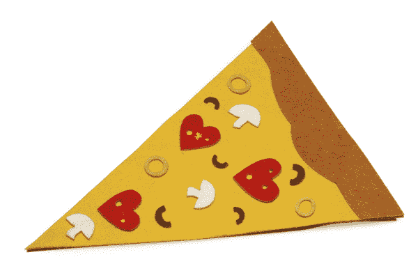
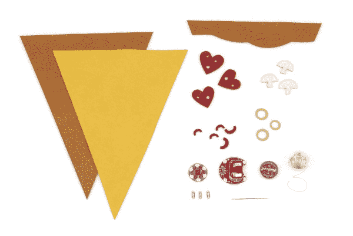

# 软电路:LED 感觉披萨

> 原文：<https://learn.sparkfun.com/tutorials/soft-circuits-led-feelings-pizza>

## 介绍

爱是一种不可避免的人类状态，无论是对一个人的爱还是美味的小吃。所以，无论你是把它送给比披萨更爱你的人，还是把它留给自己，作为你对披萨永恒热爱的象征，这里都有详细的指导，告诉你如何制作自己的 LED-ridked，felt Feelings Pizza。很傻吗？是的。它有作用吗？除了娱乐，没有特别的。那么我们为什么要这样做呢？我们这样做是因为这比看《爱的摇滚》重播更好，为什么不呢。

作为一个额外的奖励，这也是一个向孩子们介绍电子产品的好项目，因为供应不贵，电子元件简单，危险程度低。

### 推荐阅读

如果你想从头开始，这里有几个教程，涵盖了一些我们用来制作梦想披萨的基本概念:

*   [用导电线缝制](http://learn.sparkfun.com/tutorials/sewing-with-conductive-thread)
*   [缝制基本电路](https://learn.sparkfun.com/tutorials/ldk-experiment-1-lighting-up-a-basic-circuit)

## 食谱

以下是本教程需要遵循的电子元件清单: