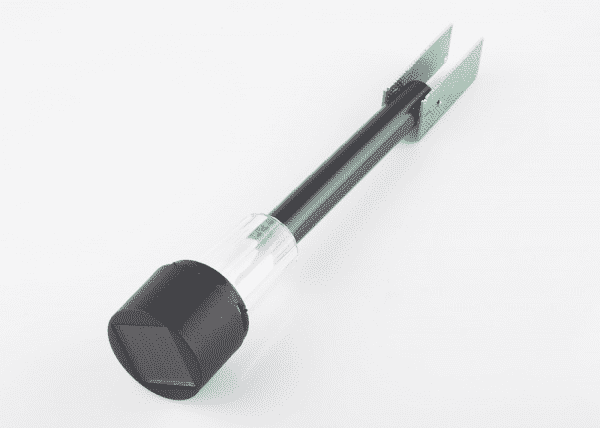
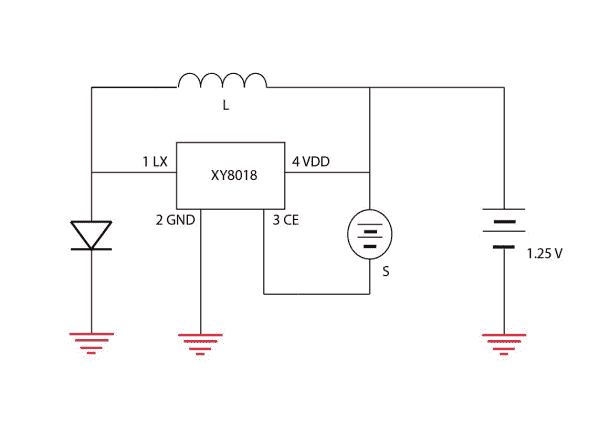
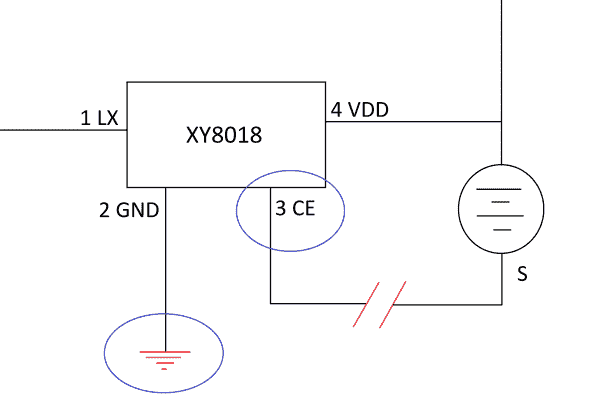
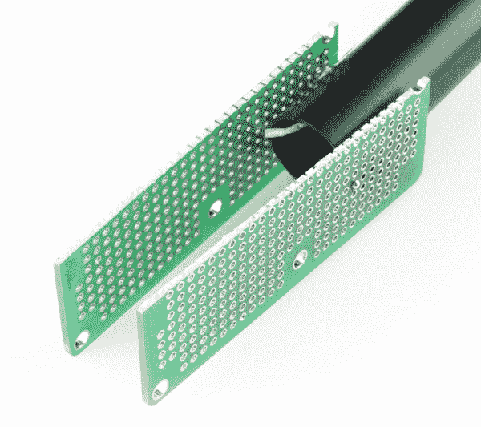
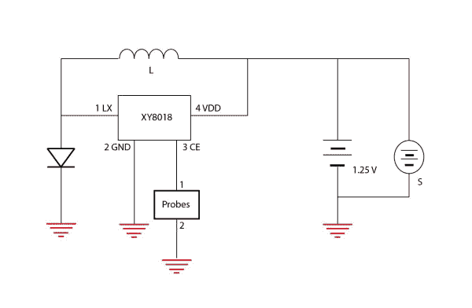
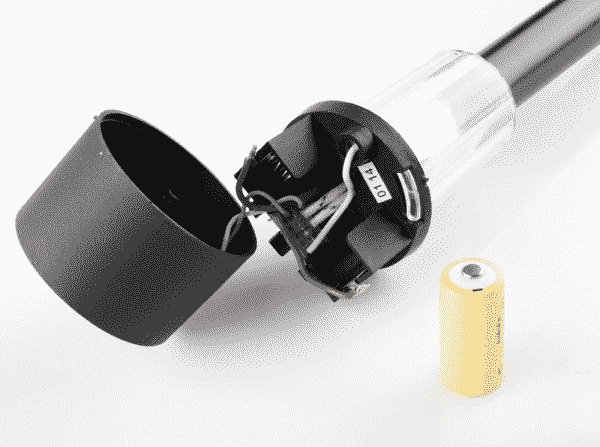

# 通过破解太阳光来检测土壤湿度

> 原文：<https://learn.sparkfun.com/tutorials/soil-moisture-sensing-by-hacking-a-solar-light>

## 介绍

在本教程中，我们将从一家百货商店购买一个简单的太阳能路灯，并将其改装成土壤湿度传感器。当土壤变干时，完成的设计会打开一个 LED。

对于本教程，我从 McGuckins 硬件购买了 2 美元的太阳能通道灯，但大多数任何标准的太阳能通道灯应该做到这一点。至于电路，大多数道路灯使用非常专业的芯片，很难找到数据表。我的路径灯中的芯片是 XY8018，它由电感器、太阳能电池板、LED 和镍镉充电电池组成。似乎其他人也遇到了同样的识别 IC 的问题。虽然知道自己在做什么总是明智的，但是没有这些信息，这个项目也很容易完成。

### 使用的材料:

*   [路径灯](https://store.mcguckin.com/inet/storefront/store.php?mode=showproductdetail&product=-1&link_id=-1&link_itemcode=95123&category=)
*   [穿孔板-所有孔一起布线，在两侧](https://www.sparkfun.com/products/8812)

### 使用的工具:

*   [电线](https://www.sparkfun.com/products/11367)
*   [烙铁](https://www.sparkfun.com/products/9507)
*   [焊接](https://www.sparkfun.com/products/9325)
*   热胶枪

### 您可以使用的其他材料:

*   镀锌钉子
*   钢棒
*   [铜带](https://www.sparkfun.com/products/11081)
*   石膏灰泥

### 推荐阅读

*   [理解示意图符号](https://learn.sparkfun.com/tutorials/how-to-read-a-schematic)
*   [如何焊接](https://learn.sparkfun.com/tutorials/how-to-solder-through-hole-soldering)
*   [集成电路](https://learn.sparkfun.com/tutorials/integrated-circuits)

## 电路

*Schematic of the original solar light circuit.*

pathway light 芯片(此处为 XY8018)在其原始电路中旨在当太阳能电池板接收不到光时打开 LED，表现为短路(或“高”)，当太阳能电池板接收到光时关闭 LED 并让太阳能电池板为电池充电(或“低”)。利用关于芯片如何工作的这一信息，我们可以将我们的探针重新连接到芯片上，作为决定 LED 是否打开的因素。

为了建立一个在土壤干燥时打开 LED 的电路，我们可以将一个探针连接到芯片的引脚 3(太阳能电池板连接的地方)，另一个连接到地，这样当地和引脚 3 之间存在高电阻时(当探针之间的水较少时)，LED 就会打开。当探针之间有更多的水，并且引脚 3 和地之间的电阻降低，从而拉低时，LED 将关闭。

## 探针

对于我的探针，我选择使用一个小的[穿孔板](https://www.sparkfun.com/products/8812)，它的所有孔都在两侧一起布线。我之所以选择它，是因为我把它放在周围，它有很大的导电表面积。我把它切成两半来做两个探针。然后将这两半热粘在通道灯的末端。最后，电线穿过轴，焊接到主电路的探针上。

探针也可以由许多其他东西制成。镀锌钉、一个上面有铜带的 PCB 板、两根钢棒和其他类似的东西也可以用作探针。在选择探头时，你应该考虑土壤的湿度，以及腐蚀是否会成为一个重要因素。如果是这样的话，你可能想用一种不太可能被腐蚀的金属，比如镀锌钢。此外，您可以将探头包裹在石膏中，以帮助防止腐蚀并保持探头在设定的距离。

## 再打电报

好消息是，即使我们进行了修改，这个 IC 仍然可以正常工作，因此不需要重新编程。这也是一个坏消息，因为你不能改变 LED 将点亮的阈值。要更改阈值，您可以将探头移近或移远。它们离得越近，就越能感应到少量的水，所以 LED 只有在土壤非常非常干燥的时候才会亮。探针之间的距离越远，关闭 LED 所需的水就越多。试验一下你的土壤类型，你希望你的 LED 开关在什么水平，然后决定间距，可能的话，你想用什么类型的探测器。

我想让这个电路做的另一件事就是让太阳能电池板一直给电池充电。要实现这一点，通过将连接到引脚 3 的太阳能电池板导线焊接到电池的接地侧，将太阳能电池板与电池并联。这使得最终电路看起来像这样:

*Final hacked soil sensor circuit.*

通常对于更复杂的电路，或不同的电池，如锂离子电池，你不会想直接连接电源来为电池充电，因为过度充电是一个问题。这里问题很小，即使电池被过度充电，它也不会爆炸或什么的，只是减少了电池的寿命。因此，像这样将太阳能电池板连接到电池上并不是很好的做法，但对于我们的目的来说，这是可行的。

## 把所有的放在一起

*The insides of the hacked soil sensor.*

我保留了在通道灯中找到的相同 PCB，并将太阳能电池板直接重新连接到电路板上。我添加了一些电线直接从印刷电路板导致我的电路板探针，我热粘在路径灯架。这对我来说很有效，但你当然可以在路径灯中使用新的电路板，使焊接部件更容易，尽管空间是一个限制。

如果你愿意，你可以在这个简单的电路中加入许多其他的东西。主要的限制是由于它依靠太阳能电池板和电池运行，不能产生大量的电流。如果您决定构建自己的版本，请记住这一点。

## 资源和更进一步

有数不清的太阳路径灯和许多破解它们的方法。我们很想看看你能想出什么样的太阳能黑客。

想要更多阳光下的乐趣？查看其他 SparkFun 产品和教程。

*   当你的植物变得太干燥时，它可以给你发微博。
*   阳光伙伴连接指南将教你如何将太阳能充电和电力整合到你的下一个电子项目中。
*   利用你在本教程中学到的知识，将土壤湿度读数添加到你的[气象站](https://learn.sparkfun.com/tutorials/weather-station-wirelessly-connected-to-wunderground)中。