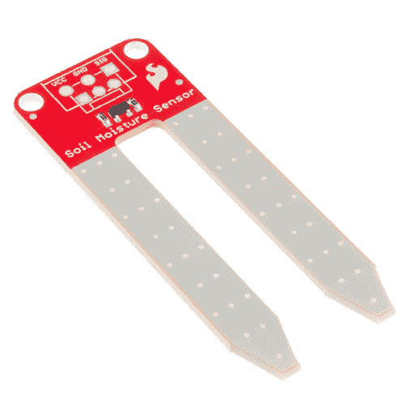
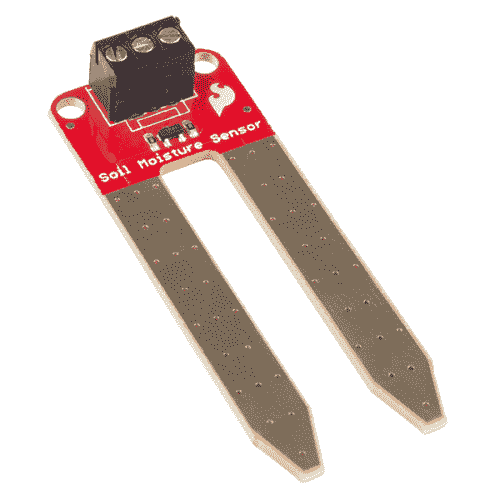
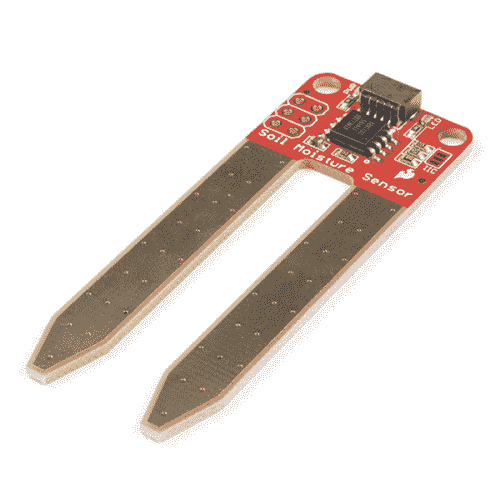

# 土壤湿度传感器连接指南

> 原文：<https://learn.sparkfun.com/tutorials/soil-moisture-sensor-hookup-guide>

## 介绍

你曾经想要你的植物告诉你什么时候需要浇水吗？或者知道你花园里的土壤有多饱和？有了 [SparkFun 土壤湿度传感器](https://www.sparkfun.com/products/13322)，你就可以做到这一点！本教程将向您展示如何开始使用土壤湿度传感器，以及如何建立自己的土壤湿度传感项目。如果您不喜欢焊接，可以购买预先焊接在电路板上的带 3 引脚螺丝端子的传感器。

 

将**添加到您的[购物车](https://www.sparkfun.com/cart)中！**

### [SparkFun 土壤水分传感器](https://www.sparkfun.com/products/13322)

[In stock](https://learn.sparkfun.com/static/bubbles/ "in stock") SEN-13322

用于测量土壤和类似材料中水分的简单装置。裸露焊盘共同充当一个阀门…

$6.5016[Favorited Favorite](# "Add to favorites") 74[Wish List](# "Add to wish list")**** 

将**添加到您的[购物车](https://www.sparkfun.com/cart)中！**

### [【spark fun 土壤湿度传感器(带螺丝端子)](https://www.sparkfun.com/products/13637)

[In stock](https://learn.sparkfun.com/static/bubbles/ "in stock") SEN-13637

用于测量土壤和类似材料中水分的简单装置。裸露焊盘共同充当一个阀门…

$7.504[Favorited Favorite](# "Add to favorites") 37[Wish List](# "Add to wish list")**** ****如果你真的很急，使用我们即插即用的 Qwiic 土壤湿度传感器！

 

将**添加到您的[购物车](https://www.sparkfun.com/cart)中！**

### [SparkFun Qwiic 土壤水分传感器](https://www.sparkfun.com/products/17731)

[In stock](https://learn.sparkfun.com/static/bubbles/ "in stock") SEN-17731

用于测量土壤和类似材料中水分的简单装置。裸露焊盘共同充当一个阀门…

$9.502[Favorited Favorite](# "Add to favorites") 9[Wish List](# "Add to wish list")** **### 所需材料

要在本教程结束时完成项目，您将需要以下内容。不过，你可能不需要所有东西，这取决于你已经有的东西和你喜欢的传感器。点击下面的按钮将其全部添加到您的购物车中，并根据需要进行修改。******