# 声音反应 EL 线服装

> 原文：<https://learn.sparkfun.com/tutorials/sound-reactive-el-wire-costume>

## 介绍

用个性化的灯光装备将科幻小说带入生活！EL wire 是一种看起来很未来的发光电线，具有保持凉爽的额外好处，使其成为可穿戴项目的理想选择。将传感器和微控制器与 EL 线相结合，可以提供广泛的反馈和控制选项。

这个项目使用 [SparkFun 声音检测器](https://www.sparkfun.com/products/12642)和 [EL 音序器](https://www.sparkfun.com/products/11323)来使 EL 线随着环境声音的节奏闪烁，包括音乐、鼓掌和说话。你可以用 [EL Escudo DOS Arduino 盾](https://www.sparkfun.com/products/10878)完成同样的任务。

[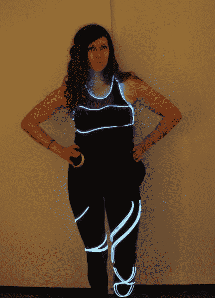](https://cdn.sparkfun.com/assets/learn_tutorials/4/5/9/FinalCostume_Demo_copy.JPG)

关于服装的视频分析，请看下面的视频。

[https://www.youtube.com/embed/XRmp_RBcDeg/?autohide=1&border=0&wmode=opaque&enablejsapi=1](https://www.youtube.com/embed/XRmp_RBcDeg/?autohide=1&border=0&wmode=opaque&enablejsapi=1)

### 材料

#### 电子学

[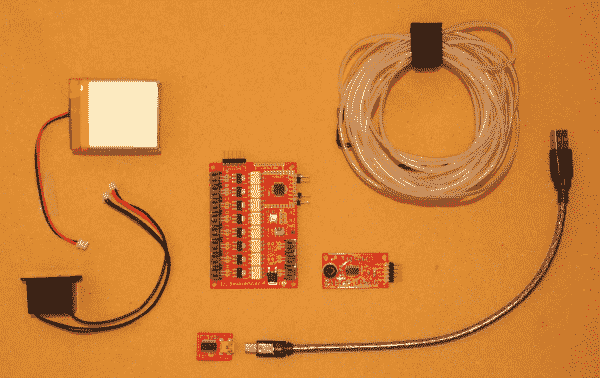](https://cdn.sparkfun.com/assets/learn_tutorials/4/5/9/Materials_Electronics_copy.JPG)

*   [EL 电线](https://www.sparkfun.com/search/results?term=el+wire)
    *   El Wire 有多种颜色，挑选你最喜欢的吧！
*   [EL 序列发生器](https://www.sparkfun.com/products/11323)
*   [锂离子电池](https://www.sparkfun.com/products/8483)
*   [5V FTDI 分线点](https://www.sparkfun.com/products/9716)(或电缆)
*   [DC 至交流逆变器- 3V](https://www.sparkfun.com/products/10201)
*   [声音检测器](https://www.sparkfun.com/products/12642)
*   [可堆叠插头引脚](https://www.sparkfun.com/products/553)(总共 15 个:5 个用于 FTDI BOB，5 个用于 EL 序列器，5 个用于声音检测器)
*   [五(5)根母到母试验板线](https://www.sparkfun.com/products/10898)(或者普通线也可以)
*   注意:如果 EL 线、电池和逆变器没有连接器，请购买三(3)个 JST 连接器 。

#### 服装

[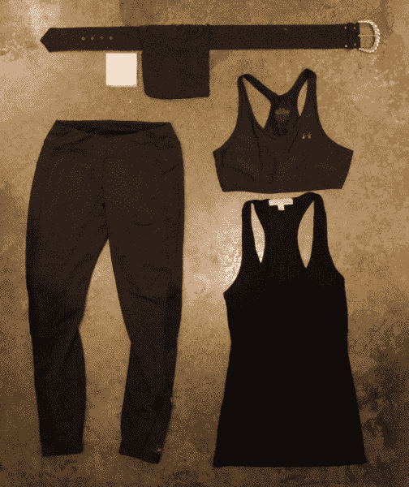](https://cdn.sparkfun.com/assets/learn_tutorials/4/5/9/WearableLights_OutfitMaterials_copy.JPG)

*   衣物
    *   想要一个创风格的外观，选择有弹性的黑色材料。瑜伽裤和其他运动装备非常好用！
*   腰带
*   旧夹克与大口袋，最好是拉链或其他密封。
    *   这个口袋将容纳电子设备。如果你打算在可能潮湿的天气在户外穿这种服装，选择一个防水的口袋(即从防水夹克上剪一个口袋)。
*   一块包装泡沫或聚苯乙烯泡沫(隔离声音探测器)

### 工具

[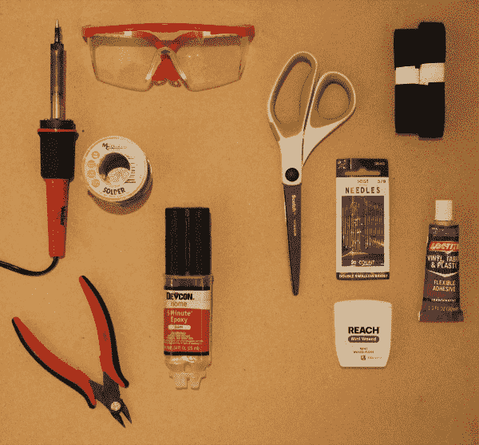](https://cdn.sparkfun.com/assets/learn_tutorials/4/5/9/Tools_copy.JPG)

*   防护眼镜
*   烙铁
*   钢丝钳/剥线钳
*   环氧树脂(防水)
*   剪刀
*   针+线或织物粘合剂

### 推荐阅读

*   不熟悉 EL 电线和/或 EL 音序器？查看这篇关于如何设置 EL 序列器的教程。
*   为了全面了解本项目中使用的声音检测器，这里有一个很棒的教程。
*   最后，该项目使用高容量锂离子电池(“LIB”)。安全处理这些电池非常重要。这里有一个关于正确护理和处理 LIBs 的教程。

## 建造它！

**CAUTION:** Although it is low current, EL wire runs on high voltage AC (100 VAC). There are exposed connections on the EL Sequencer board so BE CAREFUL when handling the board. Always double (and triple) check that the power switch is OFF before touching any part of the board. For final projects, it is recommended to coat all exposed connections in epoxy, hot glue, electrical tape, or other insulating material.

1.  用 EL 线测试 EL 序列器。

    [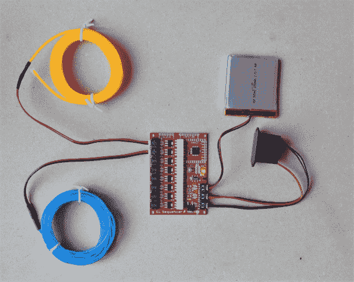](https://cdn.sparkfun.com/assets/learn_tutorials/4/5/9/ELSeqTest_copy.JPG)

    将逆变器、电池和至少一股 EL 电线连接到 EL 序列器。(注意逆变器的两根黑线对应交流侧。)

    确保在电池模式下给 EL 音序器供电时，EL 线亮起并闪烁。

2.  将接头引脚焊接到 EL 序列器上的 **5V FTDI 针孔**以及 **VCC、地和 A2 输入引脚**上。

    [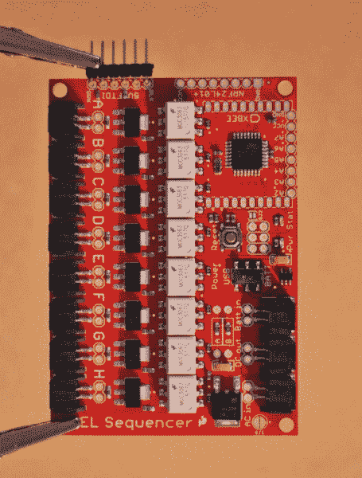](https://cdn.sparkfun.com/assets/learn_tutorials/4/5/9/ELSeq_HeaderPins1_copy.JPG)
3.  将接头引脚焊接到声音检测器。

    [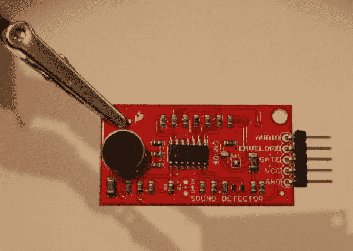](https://cdn.sparkfun.com/assets/learn_tutorials/4/5/9/SoundDetector_HeaderPins_copy.JPG)
4.  通过母-母跳线将声音检测器连接至 EL 音序器(您也可以跳过接头安装，直接将电线焊接至接头引脚)。

    [](https://cdn.sparkfun.com/assets/learn_tutorials/4/5/9/SoundDetector_HeaderPins_copy.JPG)

    将声音检测器 VCC 和接地引脚连接到 EL 音序器上的 VCC 和接地引脚。将声音检测器**门输出**连接到 EL 序列器上的 **A2 输入**引脚。如果您使用的是包络和/或音频输出信号，请将这些信号连接到 EL 音序器上的 A3 和 A4 引脚(在 Program It！下一节)。

5.  使用包装泡沫或聚苯乙烯泡沫为声音探测器制作一个保护外壳，以防止推挤或其他物理振动(也称为碰撞)触发它。

    [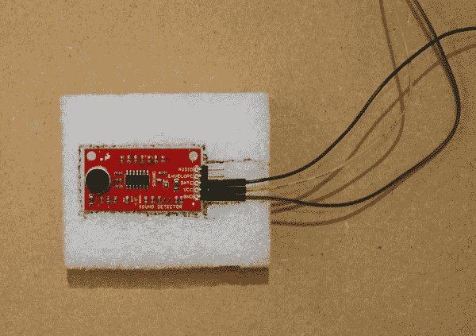](https://cdn.sparkfun.com/assets/learn_tutorials/4/5/9/SD_CaseOutline_copy.JPG)[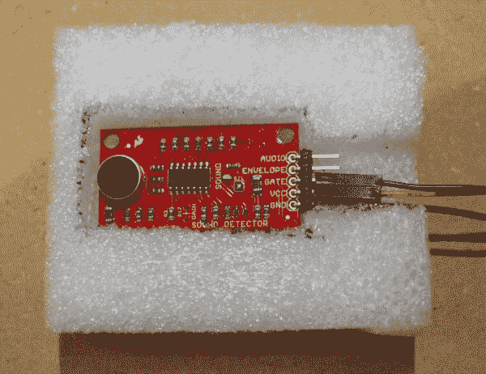](https://cdn.sparkfun.com/assets/learn_tutorials/4/5/9/SD_CaseCloseUp4_copy.JPG)

    将声音探测器放在泡沫上，用笔勾勒出电路板的轮廓，并在泡沫上切出一个洞，让探测器紧贴在里面。还建议您将电线用环氧树脂粘合到泡沫上(但不是声音检测板)。

6.  从夹克上剪下一个口袋，缝在腰带上。

    [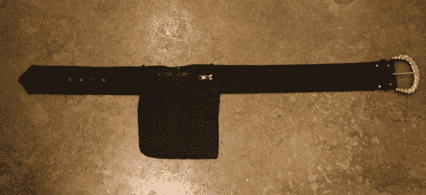](https://cdn.sparkfun.com/assets/learn_tutorials/4/5/9/BeltPocket_Full_copy.JPG)[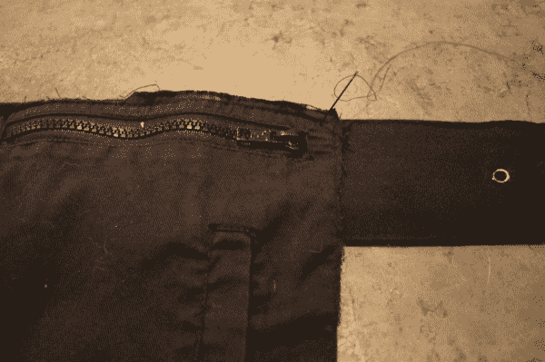](https://cdn.sparkfun.com/assets/learn_tutorials/4/5/9/BeltPocket_Attaching_copy.JPG)
7.  系上安全带，将 EL 线连接到 EL 序列器，并将 EL 序列器放入口袋中。根据电子设备的位置，确定每个 EL 线束的大致位置。

    [](https://cdn.sparkfun.com/assets/learn_tutorials/4/5/9/Pocket_CloseUp_copy.JPG)
8.  在衣服上标记和/或粘贴 EL wire JST 连接器的底座，允许连接器全长弯曲。确保 JST 连接器可以很容易地到达 EL 序列器。

    [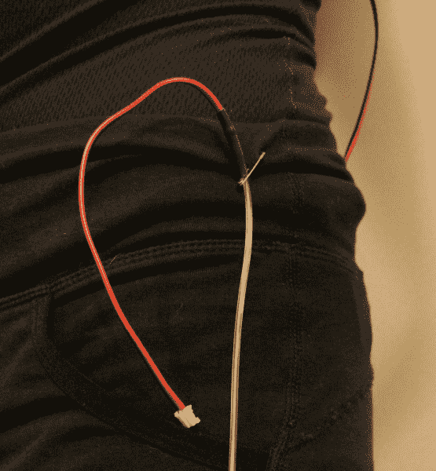](https://cdn.sparkfun.com/assets/learn_tutorials/4/5/9/ELWire_JST_SafetyPin_copy.JPG)
9.  从 JST 连接器的底部开始，将 EL 线束连接到您选择的衣服上。

    [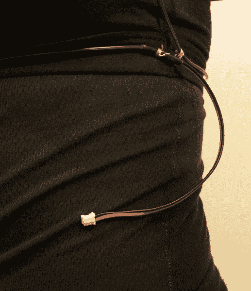](https://cdn.sparkfun.com/assets/learn_tutorials/4/5/9/ELWire_JST_copy.JPG)

    使用结实的线或牙线，或使用合适的织物粘合剂，将 EL 线缝在衣服上。

    [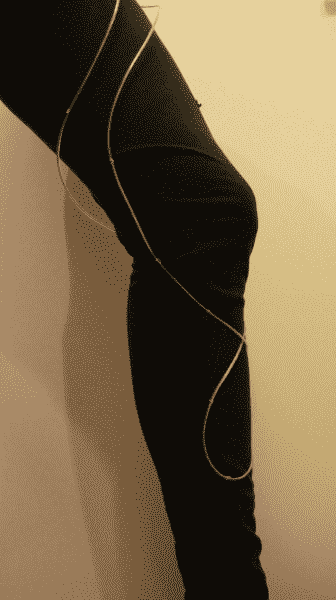](https://cdn.sparkfun.com/assets/learn_tutorials/4/5/9/ELWire_Attached_copy.JPG)

    在粘上 EL 线之前，建议使用安全别针来确定您穿着时 EL 线在每件衣服上的位置。电线是有弹性的，但没有弹性，所以给自己一些回旋的空间。

    还建议在不同的衣物上使用单独的 EL 线股，以便于穿上/脱下。

## 编程吧！

1.  通过 5V FTDI 分线板或电缆将 EL Sequencer 连接到计算机。

2.  使用 Arduino 平台对 EL 序列器进行编程；EL 序列发生器在 8 MHz 和 3.3V 下运行 ATmega328p。

3.  确定如何使用声音检测器输出来控制 EL 线。如果检测到声音，下面的示例程序利用门通道输出来打开 el 线。

对于一个简单的示例草图，你可以复制下面的代码或者访问下面的[链接](https://raw.githubusercontent.com/jenfoxbot/WearableSoundActivatedLights/master/build)。

```
language:c
// Sound Activated EL Wire Costume
// Blink EL Wire to music and other ambient sound.
//JenFoxBot
void setup() {
  Serial.begin(9600);  
  // The EL channels are on pins 2 through 9
  // Initialize the pins as outputs
  pinMode(2, OUTPUT);  // channel A  
  pinMode(3, OUTPUT);  // channel B   
  pinMode(4, OUTPUT);  // channel C
  pinMode(5, OUTPUT);  // channel D    
  pinMode(6, OUTPUT);  // channel E
  pinMode(7, OUTPUT);  // channel F
  pinMode(8, OUTPUT);  // channel G
  pinMode(9, OUTPUT);  // channel H
//Initialize input pins on EL Sequencer
  pinMode(A2, INPUT);
}
void loop() 
{
  int amp = digitalRead(A2);

  //If Gate output detects sound, turn EL Wire on
  if(amp == HIGH){

    digitalWrite(2, HIGH); //turn EL channel on
    digitalWrite(3, HIGH);
    digitalWrite(4, HIGH);
    delay(100);
  }

    digitalWrite(2, LOW); //turn EL channel off
    digitalWrite(3, LOW);
    digitalWrite(4, LOW);

} 
```

这个程序只是 SparkFun 声音检测器的一个例子。根据您的需要，使用声音检测器的“包络”和“音频”输出可以实现不同的响应。EL 音序器可以使用三个声音检测器输出信号单独控制多达 8 个不同的 EL 线股，因此有大量的可能性来定制您的声音激活装备！

### 有关声音检测器输出信号的更多信息:

门通道输出是一个数字信号，检测到声音时为高电平，安静时为低电平。包络通道输出跟踪声音的幅度，音频输出是直接来自麦克风的电压。查看下图，了解声音检测器的实际输出电压。

[](https://cdn.sparkfun.com/assets/learn_tutorials/2/0/7/waves.png)

在上面的照片中，红色轨迹对应于门信号输出，浅绿色轨迹对应于包络信号输出，深绿色轨迹对应于音频信号输出。更多信息可在[声音检测器连接指南](https://learn.sparkfun.com/tutorials/sound-detector-hookup-guide)中找到。

## 测试、保护和展示！

1.  将所有组件连接到 EL 音序器(逆变器、电池、声音检测器)，并放入腰带袋中。打开系统，制造一些噪音(例如拍手声、啪嗒声或音乐)，并检查 EL 线在有声音时是否闪烁。

2.  如果装备工作正常，在所有连接处涂上一层(薄的)环氧树脂。让它干燥至少 24 小时。

    **环氧树脂是一种非常持久的粘合剂**，所以如果你想重复使用任何组件，请尝试其他粘合剂，如热熔胶或电工胶带(不太安全，但可调节和移除)。

    通过确保电线牢固地固定在距离所有连接约一英寸(1”)的皮带和/或袋子上，您可以减少单个连接的整体张力。目标是在保持电连接刚性的同时允许 EL 线弯曲，因为电连接是最有可能断裂的点。

3.  穿上你独一无二的高科技装备，向全世界炫耀吧！

[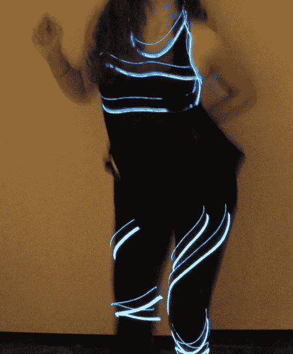](https://cdn.sparkfun.com/assets/learn_tutorials/4/5/9/FinalCostume_Dance_copy.JPG)

你也可以在下面的视频中看到这套服装。

[https://www.youtube.com/embed/W2ooz4xrNh0/?autohide=1&border=0&wmode=opaque&enablejsapi=1](https://www.youtube.com/embed/W2ooz4xrNh0/?autohide=1&border=0&wmode=opaque&enablejsapi=1)

[https://www.youtube.com/embed/OqTmi7z6jeE/?autohide=1&border=0&wmode=opaque&enablejsapi=1](https://www.youtube.com/embed/OqTmi7z6jeE/?autohide=1&border=0&wmode=opaque&enablejsapi=1)

## 资源和更进一步

*   EL 电线有无数令人难以置信的实用用途。看看这个 [EL 电线发光狗挽具](https://learn.sparkfun.com/tutorials/el-wire-light-up-dog-harness)给你最喜欢的毛茸茸的朋友添加匹配的灯！
*   探索不同的[传感器](https://www.sparkfun.com/categories/23)以使用 EL 序列器触发 EL 线！

你可以在 Jen FoxBot 的博客和 T2 的 YouTube 频道上找到更多她的项目。