# SparkFun 绝对数字气压计- LPS28DFW (Qwiic)连接指南

> 原文：<https://learn.sparkfun.com/tutorials/sparkfun-absolute-digital-barometer---lps28dfw-qwiic-hookup-guide>

## 介绍

SparkFun Absolute 数字气压计- LPS28DFW (Qwiic) ( [标准尺寸](https://www.sparkfun.com/products/21221)和[微型尺寸](https://www.sparkfun.com/products/21222))提供独特的气压计突破，采用意法半导体^(T5 的 LPS28DFW。LPS28DFW 是一款绝对气压计，具有防水封装，非常适合传感器暴露于甚至浸没在水中的压力测量应用 ^([1](#LPS28DFW_Note1)) 。)

[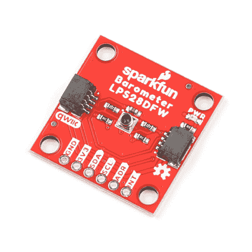](https://www.sparkfun.com/products/21221) 

将**添加到您的[购物车](https://www.sparkfun.com/cart)中！**

### [【spark fun 绝对数字气压计- LPS28DFW (Qwiic)](https://www.sparkfun.com/products/21221)

[Out of stock](https://learn.sparkfun.com/static/bubbles/ "out of stock") SEN-21221

SparkFun Qwiic LPS28DFW 绝对数字气压计提供了一个独特的气压计突破，具有来自意法半导体的 LPS 28 dfw…

$24.95[Favorited Favorite](# "Add to favorites") 2[Wish List](# "Add to wish list")****[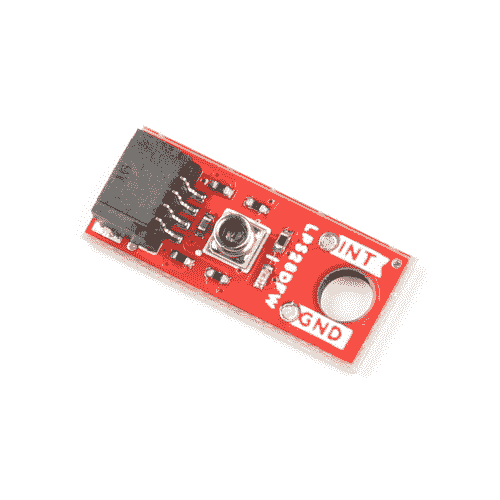](https://www.sparkfun.com/products/21222) 

将**添加到您的[购物车](https://www.sparkfun.com/cart)中！**

### [【spark fun 微型绝对数字气压计- LPS28DFW (Qwiic)](https://www.sparkfun.com/products/21222)

[In stock](https://learn.sparkfun.com/static/bubbles/ "in stock") SEN-21222

SparkFun Qwiic LPS28DFW 微型绝对数字气压计提供了一个独特的气压计突破，具有来自 S…

$25.951[Favorited Favorite](# "Add to favorites") 1[Wish List](# "Add to wish list")**** ****[https://www.youtube.com/embed/8SMQW4ZwFnE/?autohide=1&border=0&wmode=opaque&enablejsapi=1](https://www.youtube.com/embed/8SMQW4ZwFnE/?autohide=1&border=0&wmode=opaque&enablejsapi=1)

该传感器具有 260 - 1260hPa 和 260 - 4060hPa 两个满量程测量范围，绝对压力精度为±0.5 HPA。LPS 28 dfw 由一个带金属盖和凝胶外壳的压阻压力传感器组成，以保护传感元件免受水和其他环境危害。

在本指南中，我们将介绍 LPS28DFW 和这些 Qwiic 分线点上的其他硬件的特性和规格，以及我们编写的用于与传感器交互的 Arduino 库。

[**1.**](https://learn.sparkfun.com/tutorials/sparkfun-absolute-digital-barometer---lps28dfw-qwiic-hookup-guide#LPS28DFW_Note1) **Important!** While the LPS28DFW is protected from water, the rest of the components on these breakouts are not protected by any conformal coating and can be damaged by exposure to liquids. Users who intend to use these breakouts in applications where the board may be exposed to water or other liquids should apply conformal coating to the board prior to use.

### 所需材料

按照本指南，您需要一个微控制器来与 LPS28DFW 通信。以下是一些开箱即用的 Qwiic 选项:

[](https://www.sparkfun.com/products/15663) 

将**添加到您的[购物车](https://www.sparkfun.com/cart)中！**

### [【spark fun Thing Plus-ESP32 WROOM(微-B)](https://www.sparkfun.com/products/15663)

[Out of stock](https://learn.sparkfun.com/static/bubbles/ "out of stock") WRL-15663

SparkFun ESP32 Thing Plus 是开始使用 Espressif 物联网概念的下一步，同时还可以享受所有的便利设施

$22.5010[Favorited Favorite](# "Add to favorites") 48[Wish List](# "Add to wish list")****[](https://www.sparkfun.com/products/18158) 

将**添加到您的[购物车](https://www.sparkfun.com/cart)中！**

### [SparkFun RedBoard 加](https://www.sparkfun.com/products/18158)

[In stock](https://learn.sparkfun.com/static/bubbles/ "in stock") DEV-18158

RedBoard Plus 是一款兼容 Arduino 的开发板，拥有 Arduino Uno 所需的一切，并具有额外的额外功能…

$21.504[Favorited Favorite](# "Add to favorites") 12[Wish List](# "Add to wish list")****[](https://www.sparkfun.com/products/15574) 

将**添加到您的[购物车](https://www.sparkfun.com/cart)中！**

### [火花趣事 Plus——阿尔忒弥斯](https://www.sparkfun.com/products/15574)

[25 available](https://learn.sparkfun.com/static/bubbles/ "25 available") WRL-15574

SparkFun Artemis Thing Plus 采用了我们流行的羽毛足迹，并添加了强大的 Artemis 模块，以实现终极功能

$22.50[Favorited Favorite](# "Add to favorites") 28[Wish List](# "Add to wish list")****[](https://www.sparkfun.com/products/15444) 

将**添加到您的[购物车](https://www.sparkfun.com/cart)中！**

### [SparkFun RedBoard Artemis](https://www.sparkfun.com/products/15444)

[In stock](https://learn.sparkfun.com/static/bubbles/ "in stock") DEV-15444

RedBoard Artemis 采用 SparkFun 的功能强大的 Artemis 模块，并将其包装在一个易于使用和熟悉的环境中…

$21.509[Favorited Favorite](# "Add to favorites") 32[Wish List](# "Add to wish list")******** ********如果您选择的微控制器尚未启用 Qwiic，您可以添加以下一项或多项功能:

[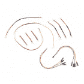](https://www.sparkfun.com/products/15081) 

将**添加到您的[购物车](https://www.sparkfun.com/cart)中！**

### [SparkFun Qwiic 线缆套件](https://www.sparkfun.com/products/15081)

[In stock](https://learn.sparkfun.com/static/bubbles/ "in stock") KIT-15081

为了更容易上手，我们用 50 毫米到 500 毫米的各种 Qwiic 电缆组装了 Qwiic 电缆套件…

$8.9516[Favorited Favorite](# "Add to favorites") 58[Wish List](# "Add to wish list")****[](https://www.sparkfun.com/products/14495) 

将**添加到您的[购物车](https://www.sparkfun.com/cart)中！**

### [SparkFun Qwiic 适配器](https://www.sparkfun.com/products/14495)

[In stock](https://learn.sparkfun.com/static/bubbles/ "in stock") DEV-14495

SparkFun Qwiic 适配器提供了将任何旧 I ² C 板改造成支持 Qwiic 的板的完美方法。

$1.601[Favorited Favorite](# "Add to favorites") 53[Wish List](# "Add to wish list")****[](https://www.sparkfun.com/products/14352) 

将**添加到您的[购物车](https://www.sparkfun.com/cart)中！**

### [ArduinoT3 的 SparkFun Qwiic 盾](https://www.sparkfun.com/products/14352)

[In stock](https://learn.sparkfun.com/static/bubbles/ "in stock") DEV-14352

SparkFun Qwiic Shield 是一种易于组装的板，它提供了一种简单的方法来将 Qwiic Connect 系统与

$7.508[Favorited Favorite](# "Add to favorites") 39[Wish List](# "Add to wish list")****[](https://www.sparkfun.com/products/16790) 

将**添加到您的[购物车](https://www.sparkfun.com/cart)中！**

### [SparkFun Qwiic 盾为物加](https://www.sparkfun.com/products/16790)

[In stock](https://learn.sparkfun.com/static/bubbles/ "in stock") DEV-16790

SparkFun Qwiic Shield for Thing Plus 使您可以使用 spark fun 的 Qwiic connect 生态系统和开发板来测试

$4.95[Favorited Favorite](# "Add to favorites") 7[Wish List](# "Add to wish list")******** ********您还需要至少一根 Qwiic 电缆将分线点连接到您的微控制器。

[](https://www.sparkfun.com/products/14427) 

将**添加到您的[购物车](https://www.sparkfun.com/cart)中！**

### [Qwiic 线缆- 100mm](https://www.sparkfun.com/products/14427)

[In stock](https://learn.sparkfun.com/static/bubbles/ "in stock") PRT-14427

这是一条 100 毫米长的 4 芯电缆，带有 1 毫米 JST 端接。它旨在将支持 Qwiic 的组件连接在一起…

$1.50[Favorited Favorite](# "Add to favorites") 32[Wish List](# "Add to wish list")****[](https://www.sparkfun.com/products/14429) 

将**添加到您的[购物车](https://www.sparkfun.com/cart)中！**

### [Qwiic 线缆- 500mm](https://www.sparkfun.com/products/14429)

[In stock](https://learn.sparkfun.com/static/bubbles/ "in stock") PRT-14429

这是一根 500mm 长的 4 芯电缆，带有 1mm JST 端接。它旨在将支持 Qwiic 的组件连接在一起…

$1.951[Favorited Favorite](# "Add to favorites") 25[Wish List](# "Add to wish list")****[](https://www.sparkfun.com/products/14426) 

将**添加到您的[购物车](https://www.sparkfun.com/cart)中！**

### [Qwiic 线缆- 50mm](https://www.sparkfun.com/products/14426)

[In stock](https://learn.sparkfun.com/static/bubbles/ "in stock") PRT-14426

这是一根 50 毫米长的 4 芯电缆，带有 1 毫米 JST 端接。它旨在将支持 Qwiic 的组件连接在一起…

$0.95[Favorited Favorite](# "Add to favorites") 29[Wish List](# "Add to wish list")****[](https://www.sparkfun.com/products/14428) 

### [Qwiic 线缆- 200mm](https://www.sparkfun.com/products/14428)

[Out of stock](https://learn.sparkfun.com/static/bubbles/ "out of stock") PRT-14428

这是一根 200 毫米长的 4 芯电缆，带有 1 毫米 JST 端接。它旨在将支持 Qwiic 的组件连接在一起…

[Favorited Favorite](# "Add to favorites") 21[Wish List](# "Add to wish list")****** ******### 推荐阅读

如果你不熟悉 Qwiic 系统，我们推荐你在这里阅读[以获得一个概述](https://www.sparkfun.com/qwiic)。

| [](https://www.sparkfun.com/qwiic) |

如果你不熟悉以下教程中的概念，我们也建议你看一看它们。如果您正在使用上面列出的 Qwiic Shields 之一，在开始使用 spark fun Absolute Digital Barometer-LPS 28 dfw(qw IIC)之前，您可能也想通读它们各自的连接指南。

[](https://learn.sparkfun.com/tutorials/i2c) [### I2C](https://learn.sparkfun.com/tutorials/i2c) An introduction to I2C, one of the main embedded communications protocols in use today.[Favorited Favorite](# "Add to favorites") 128[](https://learn.sparkfun.com/tutorials/terminal-basics) [### 串行终端基础知识](https://learn.sparkfun.com/tutorials/terminal-basics) This tutorial will show you how to communicate with your serial devices using a variety of terminal emulator applications.[Favorited Favorite](# "Add to favorites") 46[](https://learn.sparkfun.com/tutorials/qwiic-shield-for-arduino--photon-hookup-guide) [### Arduino 和光子连接指南的 Qwiic 屏蔽](https://learn.sparkfun.com/tutorials/qwiic-shield-for-arduino--photon-hookup-guide) Get started with our Qwiic ecosystem with the Qwiic shield for Arduino or Photon.[Favorited Favorite](# "Add to favorites") 5[](https://learn.sparkfun.com/tutorials/sparkfun-qwiic-shield-for-arduino-nano-hookup-guide) [### Arduino Nano 连接指南的 SparkFun Qwiic 盾](https://learn.sparkfun.com/tutorials/sparkfun-qwiic-shield-for-arduino-nano-hookup-guide) Hookup Guide for the SparkFun Qwiic Shield for Arduino Nano.[Favorited Favorite](# "Add to favorites") 1

## 硬件概述

在本节中，我们将进一步了解 LPS28DFW 和这些 Qwiic 分线点上的其它硬件。

### LPS28DFW 绝对压力传感器

意法半导体的 LPS28DFW 是一款数字输出绝对压力传感器，配有填充凝胶的金属盖，保护传感元件免受潮湿影响，非常适合水深测量或潮湿环境中的其他压力传感项目等应用。

| [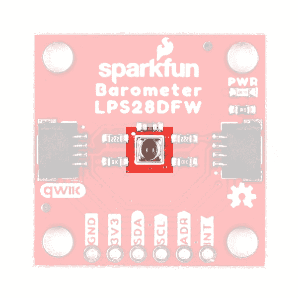](https://cdn.sparkfun.com/assets/learn_tutorials/2/7/6/0/Qwiic_LPS28DFW_-_Sensor.jpg) | [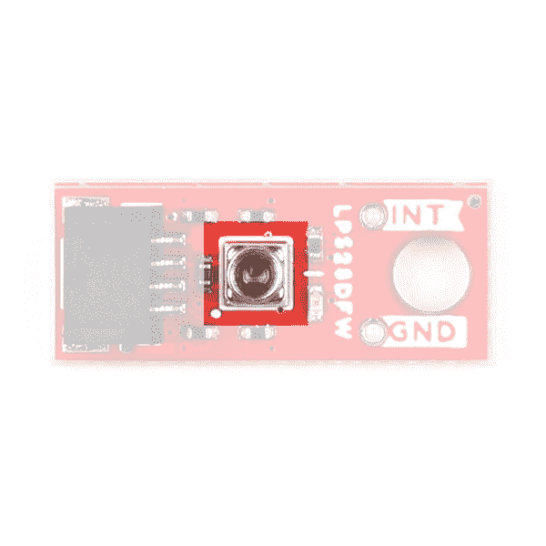](https://cdn.sparkfun.com/assets/learn_tutorials/2/7/6/0/Qwiic_Micro_LPS28DFW_-_Sensor.jpg) |

LPS28DFW 有两个用户可选的测量范围(260 至 1260hPa 和 260 至 4060hPa ),绝对压力精度为 0.5hPa，支持 1 至 200Hz 的输出数据速率。该传感器支持通过 I2C 和 MIPI I3C T2 SM T3 接口进行通信(尽管 I3C 通信不在本指南或 Arduino 库中)。下表列出了 LPS28DFW 的一些参数。关于传感器的完整概述，请参考[数据表](https://cdn.sparkfun.com/assets/a/4/0/b/b/LPS28DFW-Datasheet.pdf)。

| 参数 | 量滴 | 典型。 | 最大值 | 单位 | 笔记 |
| 电源电压 | One point seven | - | Three point six | V | 分线点在 3.3V 下运行传感器 |
| 源电流 | - | One point seven | - | A | 平均选择(AVG)=4，输出数据速率(ODR)=1Hz。 |
| - | Nine point four | - | AVG=128 赫兹，ODR = 1 赫兹。 |
| - | Zero point nine | - | 传感器处于掉电模式。 |
| 工作温度范围 | -40 | - | +85 | C |  |
| 工作压力范围 |
| 模式 1 | Two hundred and sixty | - | One thousand two hundred and sixty | 高功率放大器（high-power amplifier 的缩写） |  |
| 模式 2 | Two hundred and sixty | - | Four thousand and sixty |  |
| 声压灵敏度 |
| 模式 1 | - | Four thousand and ninety-six | - | LSB/hPa |  |
| 模式 2 | - | Two thousand and forty-eight | - |  |
| 相对压力准确度 | 测试条件: |
| 模式 1 | - | ±0.015 | - | 高功率放大器（high-power amplifier 的缩写） | 在…之时= 25°C 压力。= 800～1100 百帕 |
| 模式 2 | - | ±1 | - | 在…之时= 25°C 压力。= 2060～4060 百帕 |

### I ² C 接口

标准尺寸将 I ² C 接口连接到一对 Qwiic 连接器和一个 0.1 英寸间距的 PTH 接头，适合喜欢传统焊接连接的用户。两个分线点都将传感器的中断(INT)引脚连接到 PTH 引脚。

| [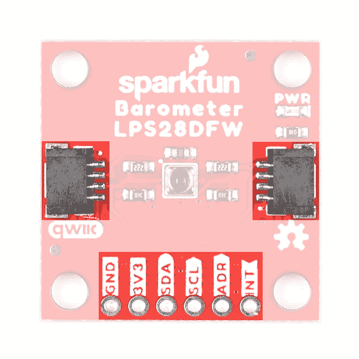](https://cdn.sparkfun.com/assets/learn_tutorials/2/7/6/0/Qwiic_LPS28DFW_-_Interfaces.jpg) | [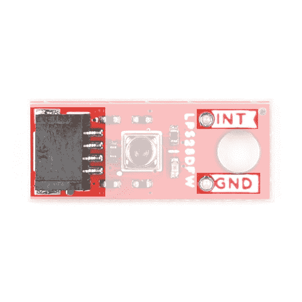](https://cdn.sparkfun.com/assets/learn_tutorials/2/7/6/0/Qwiic_Micro_LPS28DFW_-_Interfaces.jpg) |

两块板默认设置 LPS28DFW 的 I ² C 地址为 **0x5C** 。调整 ADR 跳线以更改到备用地址( **0x5D** )或将其完全打开以使用 ADR PTH 引脚切换地址(仅标准尺寸)。有关该跳线的更多信息，请参见下面的“焊料跳线”部分。

### 焊料跳线

两个 LPS28DFW Qwiic 分线点都有三个焊接跳线，标记为: **PWR** 、 **I2C** 和 **ADR** 。下表概述了跳线的标签、默认状态、功能以及关于其行为的任何注释。

| [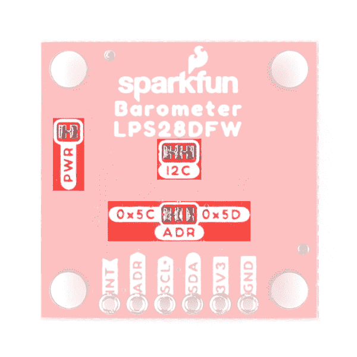](https://cdn.sparkfun.com/assets/learn_tutorials/2/7/6/0/Qwiic_LPS28DFW_-_Solder_Jumpers.jpg) | [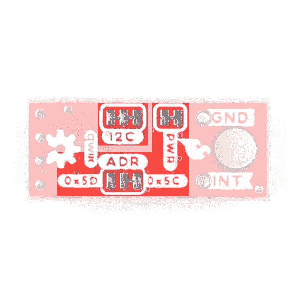](https://cdn.sparkfun.com/assets/learn_tutorials/2/7/6/0/Qwiic_Micro_LPS28DFW_-_Solder_Jumpers.jpg) |

| 标签 | 默认状态 | 功能 | 笔记 |
| 压水反应堆 | 关闭的 | 完成电源 LED 电路。 | 打开以禁用电源指示灯。 |
| I2C | 关闭的 | 通过一对 10k &ohm;电阻将 SDA/SCL 线拉至 VCC (3.3V)。 | 打开以禁用 I ² C 线上的上拉电阻。 |
| 纠纷调解 | 参见注释 | 设置 LPS28DFW 的 I ² C 地址。 | I ² C 地址默认为 0x5C。切断将中心焊盘连接到标有 0x5C 的焊盘的走线，并将其连接到标有 0x5D 的焊盘，以更改地址。 |

### 电路板尺寸

这些板符合 Qwiic 分线点的标准和微型外形规格，尺寸为 1 英寸 x 1 英寸(标准)和 0.5 英寸 x 0.3 英寸(微型)。标准分接头有四个安装孔，微型有一个。所有安装孔都适合一个尺寸为 [4-40](https://www.sparkfun.com/products/10453) 的螺钉。

| [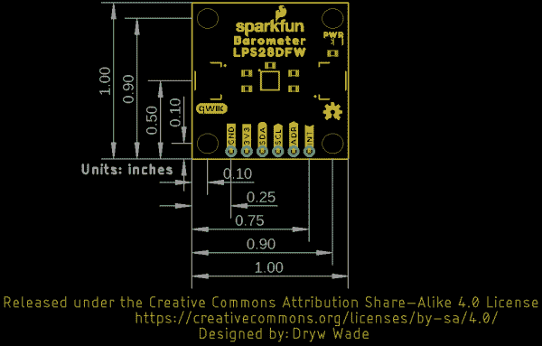](https://cdn.sparkfun.com/assets/1/c/b/d/c/SparkFun_Absolute_Digital_Barometer-LPS28DFW_Qwiic_Dimensions.png) | [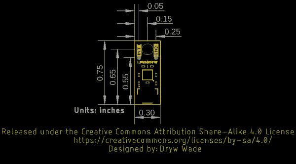](https://cdn.sparkfun.com/assets/7/5/e/6/2/SparkFun_Micro_Absolute_Digital_Barometer-LPS28DFW_Qwiic_Dimensions.png) |

## 硬件装配

现在我们已经熟悉了 LPS28DFW 分线点，可以开始组装电路了。

### Qwiic/I ² C 总成

开始使用分线点最快、最简单的方法是将分线点上的 Qwiic 连接器连接到支持 Qwiic 的开发板，如 SparkFun RedBoard Artemis，使用 Qwiic 电缆，如下图所示。

[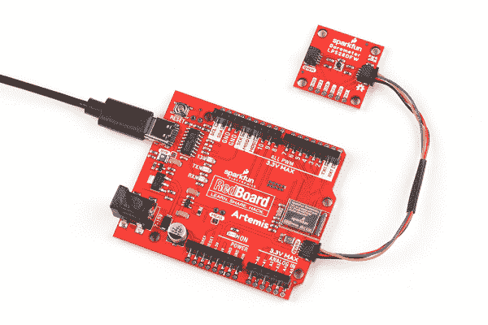](https://cdn.sparkfun.com/assets/learn_tutorials/2/7/6/0/Qwiic_LPS28DFW_-_Assembly.jpg)

如果您希望与标准尺寸的分线点实现更安全、更持久的连接，您可以将接头焊接或接线至电路板上的 PTH 接头。

### 防水保形涂料

虽然 LPS28DFW 的凝胶填充帽保护传感元件免受液体和其他环境影响，但分线板没有任何涂层来保护其他组件免受因接触液体而造成的损坏。将电路板暴露在液体中的应用需要保护涂层。这篇关于[定制 LilyPad LED 颜色的教程](https://learn.sparkfun.com/tutorials/customizing-lilypad-led-colors#coat-your-leds)提供了如何使用保形涂层的技巧。

## LPS28DFW Arduino 库

**注意:**该库假设您在桌面上使用的是最新版本的 Arduino IDE。如果这是你第一次使用 Arduino，请回顾我们关于[安装 Arduino IDE 的教程。](https://learn.sparkfun.com/tutorials/installing-arduino-ide)如果您之前没有安装 Arduino 库，请查看我们的[安装指南。](https://learn.sparkfun.com/tutorials/installing-an-arduino-library)

SparkFun LPS28DFW Arduino 库提供了一种快速、简单的方法来开始配置和测量来自传感器的压力数据。通过搜索**“spark fun LPS 28 dfw”**，使用 Arduino 库管理器工具安装库。喜欢手动安装这个库的用户可以点击下面的按钮从 [GitHub 库](https://github.com/sparkfun/SparkFun_LPS28DFW_Arduino_Library)下载一个副本:

[SparkFun LPS28DFW Arduino Library](https://github.com/sparkfun/SparkFun_LPS28DFW_Arduino_Library/archive/refs/heads/main.zip)

### 库函数

下面的列表概述并描述了 SparkFun LPS28DFW Arduino 库中可用的函数。有关参数和所有功能使用的详细信息，请参考[。库](https://github.com/sparkfun/SparkFun_LPS28DFW_Arduino_Library/blob/main/src/SparkFun_LPS28DFW_Arduino_Library.cpp)中的 cpp 文件。

#### 设备初始化和配置

*   int 32 _ t begin(uint 8 _ t ADDRESS = LPS 28 dfw _ I2C _ ADDRESS _ DEFAULT，two Wire & Wire port = Wire)；'-通过 I ² 在定义的地址和定义的端口开始与传感器通信。如果没有错误发生，执行软复位并初始化传感器。
*   int 32 _ t init()；'-使能控制寄存器中的 BDU 和 IF_ADD_INC 位。
*   int 32 _ t boot()；'-启用控制寄存器中的引导位
*   int 32 _ t reset()；'-重置传感器。
*   int 32 _ t setModeConfig(LPS 28 dfw _ MD _ t * mode)；'-配置传感器的操作模式设置，包括范围和 ODR。
*   int 32 _ t getModeConfig(LPS 28 dfw _ MD _ t * mode)；'-返回操作模式设置。
*   int 32 _ t get status(LPS 28 dfw _ stat _ t * status)；'-返回传感器状态位，如数据就绪、溢出等。

#### 传感器数据

*   int 32 _ t getSensorData()；'-从传感器获取压力数据。

#### 中断控制和功能选择

*   int 32 _ t setinterrupt mode(LPS 28 dfw _ int _ mode _ t * int mode)；'-将中断引脚配置为高/低和锁存/脉冲。
*   int 32 _ t enable interrupts(LPS 28 dfw _ pin _ int _ route _ t * intRoute)；'-启用数据就绪和 FIFO 中断条件。
*   ' int 32 _ t getInterruptStatus(LPS 28 dfw _ all _ sources _ t * status)；'-返回中断标志的状态。

#### FIFO 缓冲控制

*   int 32 _ t setFIFOConfig(LPS 28 dfw _ FIFO _ MD _ t * FIFO config)；'-设置 FIFO 配置参数。
*   int 32 _ t getFIFOConfig(LPS 28 dfw _ FIFO _ MD _ t * fifoConfig)；'-返回 FIFO 缓冲区的设置。
*   int 32 _ t getFIFOLength(uint 8 _ t * numData)；'-返回存储在 FIFO 缓冲区中的样本数(最多 128)。
*   int 32 _ t get FIFO data(LPS 28 dfw _ FIFO _ data _ t * data，uint 8 _ t numData)；'-从 FIFO 缓冲器中获取压力数据。
*   int 32 _ t flush FIFO()；'-清除 FIFO 缓冲器中的所有数据。

#### 参考模式控制

*   int 32 _ t setReferenceMode(LPS 28 dfw _ ref _ MD _ t * mode)；'-设置传感器在参考模式下运行。当被调用时，它存储最新的压力数据作为参考压力。参考压力可与阈值模式一起用于触发中断。
*   int 32 _ t setThresholdMode(LPS 28 dfw _ int _ th _ MD _ t * mode)；'-将传感器配置为当测量的压力超过相对于定义的参考压力的阈值时触发中断。
*   int 32 _ t get reference pressure(int 16 _ t * press raw)；'-返回存储的参考压力值。

## Arduino 示例

现在让我们仔细看看 LPS28DFW Arduino 库中包含的几个例子。

### 例 1 -基本阅读

第一个示例涵盖了在 I ² C 范围内轮询 LPS28DFW 的压力和温度数据的基础知识。通过导航到**文件>示例> SparkFun LPS28DFW Arduino 库>示例 1_BasicReadings** 打开该示例。选择您的主板和端口，然后单击上传按钮。上传完成后，打开[串行监视器](https://learn.sparkfun.com/tutorials/terminal-basics)，波特率设置为 **115200** ，观察压力和温度数据打印输出。

代码假定传感器使用默认的 I ² C 地址，因此，如果您已经调整 ADR 跳线以切换到备用地址，则使用列出的正确值注释/取消注释该行:

```
language:c
uint8_t i2cAddress = LPS28DFW_I2C_ADDRESS_DEFAULT; // 0x5C
//uint8_t i2cAddress = LPS28DFW_I2C_ADDRESS_SECONDARY; // 0x5D 
```

该示例尝试使用 I ² C 中指定地址的默认设置初始化传感器。如果无法正确初始化，代码会在 over serial 中打印出一个错误:

```
language:c
while(pressureSensor.begin(i2cAddress) != LPS28DFW_OK)
    {
        // Not connected, inform user
        Serial.println("Error: LPS28DFW not connected, check wiring and I2C address!");

        // Wait a bit to see if connection is established
        delay(1000);
    } 
```

如果您看到此错误，请仔细检查传感器是否连接正确，是否设置了正确的 I ² C 地址，并重置开发板或重新上传代码。

主循环每秒从传感器获得温度和压力数据测量值:

```
language:c
{
    // Get measurements from the sensor. This must be called before accessing
    // the pressure data, otherwise it will never update
    pressureSensor.getSensorData();

    // Print temperature and pressure
    Serial.print("Temperature (C): ");
    Serial.print(pressureSensor.data.heat.deg_c);
    Serial.print("\t\t");
    Serial.print("Pressure (hPa): ");
    Serial.println(pressureSensor.data.pressure.hpa);

    // Only print every second
    delay(1000);
} 
```

尝试上下移动传感器，查看压力数据的变化。

### 示例 3 -中断

示例 3 显示了如何设置和使用由传感器触发的数据就绪中断。代码默认使用`D2`作为连接开发板的中断引脚。如果您的电路板不支持`D2`上的外部中断，请调整该行:

```
language:c
int interruptPin = 2 
```

如果您不确定开发板上的哪些引脚支持外部中断，[该参考页](https://www.arduino.cc/reference/en/language/functions/external-interrupts/attachinterrupt/)列出了大多数常见 Arduino 开发板可用的数字引脚。

初始化 LPS28DFW 后，代码将 ODR 设置为 1Hz，将中断引脚配置为数据就绪模式，并将中断连接到上面定义的引脚(`D2`:

```
language:c
ps28dfw_md_t modeConfig =
    {
        .fs  = LPS28DFW_1260hPa,    // Full scale range
        .odr = LPS28DFW_1Hz,        // Output data rate
        .avg = LPS28DFW_4_AVG,      // Average filter
        .lpf = LPS28DFW_LPF_DISABLE // Low-pass filter
    };
    pressureSensor.setModeConfig(&modeConfig);

    // Configure the LPS28DFW interrupt pin mode
    lps28dfw_int_mode_t intMode =
    {
        .int_latched  = 0, // Latching mode (not including data ready condition)
        .active_low   = 1, // Signal polarity
        .drdy_latched = 0  // Latching mode (data ready condition only)
    };
    pressureSensor.setInterruptMode(&intMode);

    // Configure the LPS28DFW to trigger interrupts when measurements finish
    lps28dfw_pin_int_route_t intRoute =
    {
        .drdy_pres = 1, // Trigger interrupts when measurements finish
        .fifo_th   = 0, // Trigger interrupts when FIFO threshold is reached
        .fifo_ovr  = 0, // Trigger interrupts when FIFO overrun occurs
        .fifo_full = 0  // Trigger interrupts when FIFO is full
    };
    pressureSensor.enableInterrupts(&intRoute);

    // Setup interrupt handler
    attachInterrupt(digitalPinToInterrupt(interruptPin), lps28dfwInterruptHandler, RISING);
} 
```

主循环等待数据就绪中断事件发生，然后通过串行打印出来自传感器的数据。

### 示例 5 -参考模式

示例 5 演示了如何设置和使用参考测量来触发来自 LPS28DFW 的中断。参考模式允许您存储一个压力值作为参考，然后监控传感器的输出，如果输出高于或低于阈值一个指定的量，则触发中断。

参考值寄存器是只读的，因此我们不能在代码中手动设置阈值。相反，代码等待用户输入他们准备好设置阈值，然后输入任意键来触发事件。

该代码将过压和欠压阈值设置为高于/低于存储的参考压力 1hPa。如果您想调整它，请在此处更改设置:

```
language:c
lps28dfw_int_th_md_t thresholdMode =
    {
        .threshold = 16, // Threshold above/below the reference pressure (eg. 16 = 1hPa in 1260hPa range)
        .over_th = true, // Enable the "over pressure" interrupt condition
        .under_th = true // Enable the "under pressure" interrupt condition
    };
    pressureSensor.setThresholdMode(&thresholdMode); 
```

注意，在模式 1 下，阈值必须设置为 16 的倍数(260-1260hPa)，在模式 2 下，阈值必须设置为 8 的倍数(260-4060hPa)。例如，要将压力阈值设置为高于/低于 1hPa，将`.threshold`设置为 16。

上传后，打开串行监视器，将波特率设置为 **115200** ，并让传感器准备好进行阈值测量。等待提示，然后按任意键设置值。如果成功，您应该会看到下面的串行打印输出:

[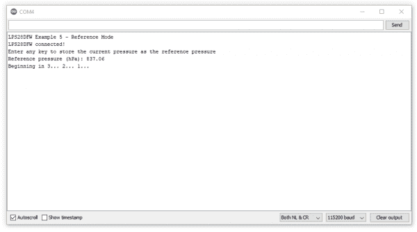](https://cdn.sparkfun.com/assets/learn_tutorials/2/7/6/0/Qwiic_LPS28DFW_-_Example_5.png)

一旦设置了阈值，主循环打印出温度和压力数据，并等待如果压力读数高于或低于阈值压力 1hPa 时触发中断事件。

## 解决纷争

### 防水突破

如前所述，这些分接头上没有任何涂层来保护组件免受水损害，因此打算利用 LPS28DFW 防水设计的用户需要在分接头上涂上防水涂层，如保形涂层。这篇关于[定制 LilyPad LED 颜色的教程](https://learn.sparkfun.com/tutorials/customizing-lilypad-led-colors#coat-your-leds)提供了如何使用保形涂层的技巧。

### 作为高度的压力数据

如果您想要使用来自 LSP28DFW 的压力数据来确定传感器的高度，请参考我们的 MPL3115A2 分线连接指南的[本节](https://learn.sparkfun.com/tutorials/mpl3115a2-pressure-sensor-hookup-guide#pressure-vs-altimeter-setting)以了解更多关于如何操作和正确解释压力数据的信息。

### 常规故障排除

**Not working as expected and need help?**

If you need technical assistance and more information on a product that is not working as you expected, we recommend heading on over to the [SparkFun Technical Assistance](https://www.sparkfun.com/technical_assistance) page for some initial troubleshooting.

[SparkFun Technical Assistance Page](https://www.sparkfun.com/technical_assistance)

If you don't find what you need there, the [SparkFun Forums](https://forum.sparkfun.com/index.php) are a great place to find and ask for help. If this is your first visit, you'll need to [create a Forum Account](https://forum.sparkfun.com/ucp.php?mode=register) to search product forums and post questions.

[Create New Forum Account](https://forum.sparkfun.com/ucp.php?mode=register)   [Log Into SparkFun Forums](https://forum.sparkfun.com/index.php)

## 资源和更进一步

这是这个连接指南的总结。此时，您应该已经启动分线点并运行 I ² C 以上的返回压力数据。查看以下参考资料，了解有关分线点和 LPS28DFW 的更多信息:

*   图表
    *   [标准](https://cdn.sparkfun.com/assets/a/0/b/5/b/SparkFun_Absolute_Digital_Barometer-LPS28DFW_Qwiic.pdf)
    *   [微](https://cdn.sparkfun.com/assets/9/c/5/e/0/SparkFun_Micro_Absolute_Digital_Barometer-LPS28DFW_Qwiic.pdf)
*   Eagle 文件
    *   [标准](https://cdn.sparkfun.com/assets/2/3/3/3/a/SparkFun_Absolute_Digital_Barometer-LPS28DFW_Qwiic.zip)
    *   [微](https://cdn.sparkfun.com/assets/c/a/a/d/e/SparkFun_Micro_Absolute_Digital_Barometer-LPS28DFW_Qwiic.zip)
*   电路板尺寸
    *   [标准](https://cdn.sparkfun.com/assets/1/c/b/d/c/SparkFun_Absolute_Digital_Barometer-LPS28DFW_Qwiic_Dimensions.png)
    *   [微](https://cdn.sparkfun.com/assets/7/5/e/6/2/SparkFun_Micro_Absolute_Digital_Barometer-LPS28DFW_Qwiic_Dimensions.png)
*   [数据表](https://cdn.sparkfun.com/assets/a/4/0/b/b/LPS28DFW-Datasheet.pdf) (LPS28DFW)
*   [Qwiic 信息页面](https://www.sparkfun.com/qwiic)
*   [LPS28DFW Arduino 库](https://github.com/sparkfun/SparkFun_LPS28DFW_Arduino_Library)
*   [硬件 GitHub 回购](https://github.com/sparkfun/SparkFun_Qwiic_Barometer_LPS28DFW)**************************