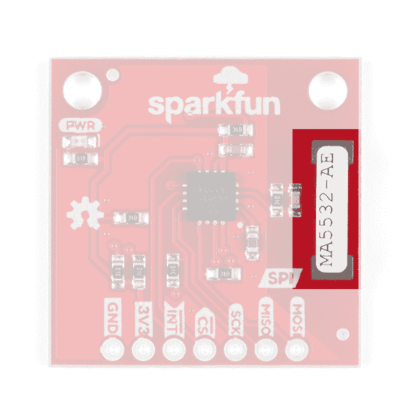
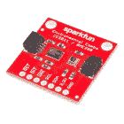
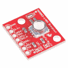

# SparkFun AS3935 闪电探测器连接指南(v20)

> 原文：<https://learn.sparkfun.com/tutorials/sparkfun-as3935-lightning-detector-hookup-guide-v20>

## 介绍

**Note:** This tutorial was written for v20 of the AS3935 lightning detector. For information on the previous version of the hookup guide, you will need to [head over to the older tutorial](https://learn.sparkfun.com/tutorials/sparkfun-qwiic-as3935-lightning-detector-hookup-guide).

SparkFun AS3935 闪电探测器为您的下一个气象站或下一次骑自行车增加了闪电探测功能。你是否担心远处若隐若现的乌云，那场风暴到底有多远？闪电探测器可以告诉你 40 公里外的风暴前沿的距离，精度为 1 公里。它有假阳性拒绝，并带有许多可配置的功能。为了获得这些功能，我们编写了一个库，让您可以访问各种设置，如风暴感应灵敏度，检测室内还是室外，或者触发中断所需的雷击次数！该板的 2.0 版仅支持 **SPI** ，但警告称，如果你想使用 I C，所有器件都在那里，但它是由 SparkFun 支持的**而不是**。

[](https://www.sparkfun.com/products/15441) 

将**添加到您的[购物车](https://www.sparkfun.com/cart)中！**

### [斯帕克芬闪电探测器- AS3935](https://www.sparkfun.com/products/15441)

[34 available](https://learn.sparkfun.com/static/bubbles/ "34 available") SEN-15441

SparkFun 闪电探测器为你的下一个气象站增加了闪电探测功能，以确保你意识到任何恶劣天气…

$28.502[Favorited Favorite](# "Add to favorites") 35[Wish List](# "Add to wish list")** **[https://www.youtube.com/embed/txJ-x6xisYY/?autohide=1&border=0&wmode=opaque&enablejsapi=1](https://www.youtube.com/embed/txJ-x6xisYY/?autohide=1&border=0&wmode=opaque&enablejsapi=1)

### 所需材料

为了理解本教程中使用的示例代码，您还需要以下材料。你可能不需要所有的东西，这取决于你拥有什么。将它添加到您的购物车，通读指南，并根据需要调整购物车。

[](https://www.sparkfun.com/products/15123) 

将**添加到您的[购物车](https://www.sparkfun.com/cart)中！**

### [spark fun RedBoard Qwiic](https://www.sparkfun.com/products/15123)

[In stock](https://learn.sparkfun.com/static/bubbles/ "in stock") DEV-15123

SparkFun RedBoard Qwiic 是一款 Arduino 兼容开发板，内置 Qwiic 连接器，无需…

$21.5014[Favorited Favorite](# "Add to favorites") 49[Wish List](# "Add to wish list")****[](https://www.sparkfun.com/products/116) 

将**添加到您的[购物车](https://www.sparkfun.com/cart)中！**

### [破开头球——直击](https://www.sparkfun.com/products/116)

[In stock](https://learn.sparkfun.com/static/bubbles/ "in stock") PRT-00116

一排标题-打破适应。40 个引脚，可切割成任何尺寸。用于定制 PCB 或通用定制接头。

$1.7520[Favorited Favorite](# "Add to favorites") 133[Wish List](# "Add to wish list")****[](https://www.sparkfun.com/products/10215) 

将**添加到您的[购物车](https://www.sparkfun.com/cart)中！**

### [USB micro-B 线- 6 脚](https://www.sparkfun.com/products/10215)

[In stock](https://learn.sparkfun.com/static/bubbles/ "in stock") CAB-10215

USB 2.0 型到微型 USB 5 针。这是一种新的、更小的 USB 设备连接器。微型 USB 连接器大约是…

$5.5014[Favorited Favorite](# "Add to favorites") 21[Wish List](# "Add to wish list")****[](https://www.sparkfun.com/products/12794) 

将**添加到您的[购物车](https://www.sparkfun.com/cart)中！**

### [【跳线-连接 6”(M/F，20 个装)](https://www.sparkfun.com/products/12794)

[In stock](https://learn.sparkfun.com/static/bubbles/ "in stock") PRT-12794

这些是 6 英寸长的跳线，端接为公母连接。使用这些从任何板上的任何公头或母头跳线。…

$2.101[Favorited Favorite](# "Add to favorites") 29[Wish List](# "Add to wish list")******** ********### 工具

根据你的设置，你可能需要一个烙铁、焊料和[通用焊接附件](https://www.sparkfun.com/categories/49)。

[](https://www.sparkfun.com/products/14456) 

将**添加到您的[购物车](https://www.sparkfun.com/cart)中！**

### [【烙铁- 60W(可调温度)](https://www.sparkfun.com/products/14456)

[In stock](https://learn.sparkfun.com/static/bubbles/ "in stock") TOL-14456

当你不想倾家荡产，但又需要一个可靠的烙铁时，这个可调节温度的烙铁是一个很好的工具…

$16.5016[Favorited Favorite](# "Add to favorites") 43[Wish List](# "Add to wish list")****[](https://www.sparkfun.com/products/9163) 

将**添加到您的[购物车](https://www.sparkfun.com/cart)中！**

### [无铅焊料- 15 克管](https://www.sparkfun.com/products/9163)

[In stock](https://learn.sparkfun.com/static/bubbles/ "in stock") TOL-09163

这是你的无铅焊料的基本管，带有不干净的水溶性树脂芯。0.031 英寸规格，15 克

$3.954[Favorited Favorite](# "Add to favorites") 14[Wish List](# "Add to wish list")**** ****### 推荐阅读

如果你不熟悉下面的教程，我们也建议你看一看。

[](https://learn.sparkfun.com/tutorials/serial-peripheral-interface-spi) [### 串行外设接口(SPI)](https://learn.sparkfun.com/tutorials/serial-peripheral-interface-spi) SPI is commonly used to connect microcontrollers to peripherals such as sensors, shift registers, and SD cards.[Favorited Favorite](# "Add to favorites") 91[](https://learn.sparkfun.com/tutorials/i2c) [### I2C](https://learn.sparkfun.com/tutorials/i2c) An introduction to I2C, one of the main embedded communications protocols in use today.[Favorited Favorite](# "Add to favorites") 128[](https://learn.sparkfun.com/tutorials/how-to-work-with-jumper-pads-and-pcb-traces) [### 如何使用跳线焊盘和 PCB 走线](https://learn.sparkfun.com/tutorials/how-to-work-with-jumper-pads-and-pcb-traces) Handling PCB jumper pads and traces is an essential skill. Learn how to cut a PCB trace, add a solder jumper between pads to reroute connections, and repair a trace with the green wire method if a trace is damaged.[Favorited Favorite](# "Add to favorites") 11[](https://learn.sparkfun.com/tutorials/redboard-qwiic-hookup-guide) [### RedBoard Qwiic 连接指南](https://learn.sparkfun.com/tutorials/redboard-qwiic-hookup-guide) This tutorial covers the basic functionality of the RedBoard Qwiic. This tutorial also covers how to get started blinking an LED and using the Qwiic system.[Favorited Favorite](# "Add to favorites") 5

## 硬件概述

### 力量

您可以通过产品侧面接头上标有`3V3`的通孔提供 **3.3V** 。当主板通电时，主板上的红色电源指示灯将会亮起。

[](https://cdn.sparkfun.com/assets/learn_tutorials/9/2/1/lightning_Power_NEW.jpg)

### 发光二极管

产品上有一个 LED 指示灯，当主板通电时，它会亮起。您可以通过切断产品底部标有`LED`的跳线来断开此 LED。

[](https://cdn.sparkfun.com/assets/learn_tutorials/9/2/1/LIghtning_Power_LED_NEW.jpg)

### 精力

电路板边缘接头上的 SPI 数据引脚分别标有使用 SPI 所需的功能:`MOSI`、`MISO`、`CS`和`SCK`。我们将通过下面的**示例 1-闪电基础知识**在示例代码中演示如何使用这些引脚。

[](https://cdn.sparkfun.com/assets/learn_tutorials/9/2/1/lightning_SPI.jpg)

### 中断引脚

**Heads up!** There is a minor silkscreen error on the PCB for the interrupt pin. The interrupt pin is an **active high** as opposed to an active low as indicated image. The silkscreen has been updated.

当闪电探测器检测到一个事件时，中断引脚**变高**，无论是闪电、干扰还是噪声。确保连接到此引脚，以检查是否检测到事件。

[](https://cdn.sparkfun.com/assets/learn_tutorials/9/2/1/lightning_interrupt.jpg)

### 天线

SparkFun 闪电探测器上最大的部分是闪电天线。保持天线周围的空间畅通，以便进行最佳闪电探测。

[](https://cdn.sparkfun.com/assets/learn_tutorials/9/2/1/LIghtning_antenna_NEW.jpg)

### 针织套衫

**Heads up!** We left the I²C features on the board for those that were interested in using the board with the I²C bus. However, we recommend using this with SPI [due to the lack active support of the product](https://learn.sparkfun.com/tutorials/sparkfun-as3935-lightning-detector-hookup-guide-v20#spi-only).

本产品底部有四个跳线。从左下角开始是标记为`I2C PU`的三重上拉跳线，用于 I C 数据线(检查部分:*关于 I C* 的说明见下文)。如果你有很多 I C 设备连在一起，你需要让这些跳线打开。

[](https://cdn.sparkfun.com/assets/learn_tutorials/9/2/1/Lightning_-_BOTTOM_PU_Jumper.jpg)

在`I2C PU`跳线旁边是两个标有`ADR`的地址跳线，允许您更改 SparkFun 闪电探测器的 I C 地址。默认的 I C 地址是 **0x03** ，但是可以更改为另外两个地址: **0x02、0x01** 。

[](https://cdn.sparkfun.com/assets/learn_tutorials/9/2/1/Lightning_-_BOTTOM_ADR_Jumper_NEW.jpg)

右上方是电源 LED 断开跳线；切断这个以断开红色电源 LED。

[](https://cdn.sparkfun.com/assets/learn_tutorials/9/2/1/Lightning_-_BOTTOM_LED_disconnect.jpg)

最后，靠近顶部的是 I C 跳线，它做两件事:将`CS`引脚接地并启用 **I C** 。SparkFun】不支持这种特定产品的 I C(检查部分:*下面 I C* 的注释)。

[](https://cdn.sparkfun.com/assets/learn_tutorials/9/2/1/Lightning_-_BOTTOM_I2C_EN_Jumper.jpg)

### [关于 I C 的一个注记](#spi-only)

SparkFun does not actively support I²C on this product due to the inconsistency of its' implementation by its' manufacturer AMS and their lack of active support of the product.

SparkFun 闪电探测器的原始设计支持 I C，但购买该产品的一小部分客户对其可靠性提出了质疑。我们的工程师对这个问题进行了调查，不幸的是，我们决定不正式支持它。然而，如果你想使用它，所有的商品都在那里。只需知道 SparkFun 不会支持使用时可能出现的问题。

要启用 I C:关闭`I2C EN`跳线的`CS`侧并切断`SI`侧。然后关闭`I2C PU`跳线的右侧。图片见上面的**跳线**。你必须深入研究[数据表](https://cdn.sparkfun.com/assets/learn_tutorials/9/2/1/AS3935_Datasheet_EN_v2.pdf)，看看哪些线路是 I C 数据线。黑客快乐！

### 假阳性和噪音

有许多可能导致假阳性的来源，但默认情况下，闪电探测器本身可以可靠地过滤掉这些来源。如果没有，您可以使用 SparFun 的 Lightning Detector 库轻松配置许多设置，以提高芯片对噪声和误报的鲁棒性(参见**示例 2 更多 Lightning 功能 SPI** )。然而，它可以帮助了解一些潜在的噪声源:荧光灯、微波炉、智能手机和智能手表显示屏、DC-DC 转换器、冰箱和/或通常可以切换大电压的东西。

## 硬件装配

⚡**Oh snap!** I specifically used the RedBoard Qwiic because of its ability to switch its' logic level between 3.3V and 5V, and I'm utilizing the **3.3V Logic** for our following examples. Just keep in mind that with whichever micro-controller you use, that you use one that runs at 3.3V or use a logic level converter.

[](https://www.sparkfun.com/products/12009) 

将**添加到您的[购物车](https://www.sparkfun.com/cart)中！**

### [SparkFun 逻辑电平转换器-双向](https://www.sparkfun.com/products/12009)

[In stock](https://learn.sparkfun.com/static/bubbles/ "in stock") BOB-12009

SparkFun 双向逻辑电平转换器是一个小型设备，可以安全地将 5V 信号降压至 3.3V，并升压 3。…

$3.50116[Favorited Favorite](# "Add to favorites") 146[Wish List](# "Add to wish list")****[](https://www.sparkfun.com/products/11771) 

将**添加到您的[购物车](https://www.sparkfun.com/cart)中！**

### [SparkFun 电压电平转换器分线点- TXB0104](https://www.sparkfun.com/products/11771)

[In stock](https://learn.sparkfun.com/static/bubbles/ "in stock") BOB-11771

这是德州仪器 TXB0104 模块的分线板。TXB0104 是一款 4 位双向电压电平转换器

$4.957[Favorited Favorite](# "Add to favorites") 28[Wish List](# "Add to wish list")**** ****为此，你必须[焊接](https://learn.sparkfun.com/tutorials/how-to-solder-through-hole-soldering) [断开头部](https://www.sparkfun.com/products/116)到火花闪电探测器的头部。将它插入试验板后，您将按照以下顺序将 RedBoard Qwiic 连接到闪电探测器。

| 红板 Qwiic(设为 3.3V 逻辑) | 火花闪电探测器 |
| 3.3V | 3.3V |
| GND | GND |
| Thirteen | 血清肌酸激酶 |
| Twelve | 军事情报部门组织(Military Intelligence Service Organization) |
| Eleven | MOSI |
| Ten | 特许测量员 |
| four | （同 Internationalorganizations）国际组织 |

[](https://cdn.sparkfun.com/assets/learn_tutorials/9/2/1/AS3935-lightning-detector-sensor-spi-Arduino-Fritzing_SFE.jpg)

## Arduino 库安装

**Note:** This example assumes you are using the latest version of the Arduino IDE on your desktop. If this is your first time using Arduino, please review our tutorial on [installing the Arduino IDE.](https://learn.sparkfun.com/tutorials/installing-arduino-ide) If you have not previously installed an Arduino library, please check out our [installation guide.](https://learn.sparkfun.com/tutorials/installing-an-arduino-library)

If you've never connected an CH340 device to your computer before, you may need to install drivers for the USB-to-serial converter. Check out our section on [How to Install CH340 Drivers](https://www.sparkfun.com/ch340) for help with the installation.

我们为 SparkFun 闪电探测器提供了一个库，可以配置 IC 提供的所有可用设置。一些功能包括修改天线的灵敏度，无论您是在室内还是室外，当 IC 触发中断时进行微调，或者修改天线的谐振频率。你可以在 Arduino 库管理器中搜索“**SparkFun Lightning Detector**”，也可以点击下面的按钮获取库并手动安装。最后，你也可以从 [GitHub Repo](https://github.com/sparkfun/SparkFun_AS3935_Lightning_Detector_Library) 手动下载。

[SparkFun AS3935 Lightning Detector Library (ZIP)](https://github.com/sparkfun/SparkFun_AS3935_Lightning_Detector_Library/archive/master.zip)

## 示例 1 -基本 Lightning SPI

下面的例子将从*example 1 _ BasicLightning _ SPI . ino*中的基本功能开始。打开示例继续学习。

#### 示例 1 -基本 Lightning SPI

在顶部，我们有几个定义，可以帮助我们区分 SparkFun 闪电探测器检测到的事件类型。有三种可能的“事件”。首先当然是**闪电**，但我们也可能得到一个*假*闪电事件，称为**干扰**，最后我们可能听到**噪音**。同样值得注意的是**噪声**和**干扰**变量。我们将在主循环中讨论这些。

```
language:c
#include <SPI.h>
#include <Wire.h>
#include "SparkFun_AS3935.h"

#define INDOOR 0x12 
#define OUTDOOR 0xE
#define LIGHTNING_INT 0x08
#define DISTURBER_INT 0x04
#define NOISE_INT 0x01

SparkFun_AS3935 lightning;

// Interrupt pin for lightning detection 
const int lightningInt = 4; 
int spiCS = 10; //SPI chip select pin

// This variable holds the number representing the lightning or non-lightning
// event issued by the lightning detector. 
int intVal = 0;
int noise = 2; // Value between 1-7 
int disturber = 2; // Value between 1-10 
```

默认情况下，SparkFun 闪电探测器被设置为在内部运行，因为我假设你在你的计算机上运行这段代码。如果您在室外，请将参数更改为`OUTDOOR`。

```
language:c
void setup()
{
  // When lightning is detected the interrupt pin goes HIGH.
  pinMode(lightningInt, INPUT); 

  Serial.begin(115200); 
  Serial.println("AS3935 Franklin Lightning Detector"); 

  SPI.begin(); 

  if( !lightning.beginSPI(spiCS, 2000000) ){ 
    Serial.println ("Lightning Detector did not start up, freezing!"); 
    while(1); 
  }
  else
    Serial.println("Schmow-ZoW, Lightning Detector Ready!");

  // The lightning detector defaults to an indoor setting at 
  // the cost of less sensitivity, if you plan on using this outdoors 
  // uncomment the following line:
  //lightning.setIndoorOutdoor(OUTDOOR); 
} 
```

在主循环中，监测中断引脚是否有来自闪电探测器的闪电事件。如果中断引脚**变高**，我们检查这个*事件*是**闪电**，还是**干扰**，还是**噪声**与`lightning.readInterruptReg()`函数调用。这些事件中的每一个都在[串行窗口](https://learn.sparkfun.com/tutorials/terminal-basics/arduino-serial-monitor-windows-mac-linux)中以 **115200 波特**打印出来。如果检测到闪电，那么我们用`lightning.distanceToStorm()`检查到风暴的距离，并打印到窗口。还有另外两种可能:**噪音**和**干扰**。如果您看到大量噪音或干扰，请检查上面的**误报和噪音**部分，以帮助指导您降低环境中的噪音。我们还可以通过调用`lightning.setNoiseLevel()`函数来增加 SparkFun 闪电探测器对噪声的鲁棒性。同样，我们可以用`lightning.watchdogThreshold()`增加 SparkFun 闪电探测器对假闪电事件的抵抗力。

```
language:c
void loop()
{
   // Hardware has alerted us to an event, now we read the interrupt register
  if(digitalRead(lightningInt) == HIGH){
    intVal = lightning.readInterruptReg();
    if(intVal == NOISE_INT){
      Serial.println("Noise."); 
      // Too much noise? Uncomment the code below, a higher number means better
      // noise rejection.
      //lightning.setNoiseLevel(noise); 
    }
    else if(intVal == DISTURBER_INT){
      Serial.println("Disturber."); 
      // Too many disturbers? Uncomment the code below, a higher number means better
      // disturber rejection.
      //lightning.watchdogThreshold(disturber);  
    }
    else if(intVal == LIGHTNING_INT){
      Serial.println("Lightning Strike Detected!"); 
      // Lightning! Now how far away is it? Distance estimation takes into
      // account any previously seen events in the last 15 seconds. 
      byte distance = lightning.distanceToStorm(); 
      Serial.print("Approximately: "); 
      Serial.print(distance); 
      Serial.println("km away!"); 
    }
  }
  delay(100); // Slow it down.
} 
```

当感应到闪电时，您会在 Arduino 串行窗口中看到以下内容。

[](https://cdn.sparkfun.com/assets/learn_tutorials/9/2/1/Serial_Readout_Lightning.JPG)

## 示例 2 -更多闪电传感器特性 SPI

在下面的例子中，我们将探索 SparkFun 闪电探测器 Arduino 库中的一些其他可用功能。这个例子实际上与上面的例子功能完全相同，因为它监视主环路中的闪电事件；所以我们将重点放在`setup`上，看看它如何演示您可以设置的不同设置。

在顶部，我们有一些更多的变量用于一些设置。前两个`noiseFloor`和`watchDogVal`分别保存用于增加闪电探测器对*噪声*和*假闪电事件*的鲁棒性的值。以下变量`spike`包含一个值，以进一步提高 SparkFun 闪电探测器对错误事件的鲁棒性。最后`lightningThresh`保存在 SparkFun 闪电探测器向您发出警报之前需要发生的闪电事件的数量。

```
language:c
// Values for modifying the IC's settings. All of these values are set to their
// default values. 
byte noiseFloor = 2;
byte watchDogVal = 2;
byte spike = 2;
byte lightningThresh = 1; 
```

第一个函数调用`lightning.maskDisturber(true)`将阻止闪电探测器向你*发出任何*错误事件的警告。我们用`lightning.readMaskDisturber()`检查设置是否正确

```
language:c
lightning.maskDisturber(true); 

int maskVal = lightning.readMaskDisturber();
Serial.print("Are disturbers being masked: "); 
if (maskVal == 1)
    Serial.println("YES"); 
else if (maskVal == 0)
    Serial.println("NO"); 
```

接下来的两个函数调用通过`lightning.setNoiseLevel()`增加了 SparkFun 闪电探测器对噪声的鲁棒性，通过`lightning.watchdogThreshold()`增加了对假闪电事件的鲁棒性。我们给这些函数上面提到的变量:`noiseFloor`和`watchDogVal`中的值。在这些功能的下面是读取我们刚刚设置的设置的功能:`lightning.readNoiseLevel()`和`lightning.readWatchdogThreshold()`。

```
language:c
lightning.setNoiseLevel(noiseFloor);  

int noiseVal = lightning.readNoiseLevel();
Serial.print("Noise Level is set at: ");
Serial.println(noiseVal);

// Watchdog threshold setting can be from 1-10, one being the lowest. Default setting is
// two. If you need to check the setting, the corresponding function for
// reading the function follows.    

lightning.watchdogThreshold(watchDogVal); 

int watchVal = lightning.readWatchdogThreshold();
Serial.print("Watchdog Threshold is set to: ");
Serial.println(watchVal); 
```

下一个设置对数据手册中的细节稍有改动，但通过*减少*闪电探测器内验证程序分析的尖峰，有助于提高 SparkFun 闪电探测器拒绝误报的能力。这将使闪电探测器不太灵敏。

```
language:c
// Spike Rejection setting from 1-11, one being the lowest. Default setting is
// two. If you need to check the setting, the corresponding function for
// reading the function follows.    
// The shape of the spike is analyzed during the chip's
// validation routine. You can round this spike at the cost of sensitivity to
// distant events. 

lightning.spikeRejection(spike); 

int spikeVal = lightning.readSpikeRejection();
Serial.print("Spike Rejection is set to: ");
Serial.println(spikeVal); 
```

`lightning.lightningThreshold()`功能可以增加闪电探测器在发出中断之前感应到的雷击次数。可能的设置是 1、5、9 或 16 次雷击。

```
language:c
// This setting will change when the lightning detector issues an interrupt.
// For example you will only get an interrupt after five lightning strikes
// instead of one. Default is one, and it takes settings of 1, 5, 9 and 16\.   
// Followed by its corresponding read function. Default is zero. 

lightning.lightningThreshold(lightningThresh); 

uint8_t lightVal = lightning.readLightningThreshold();
Serial.print("The number of strikes before interrupt is triggerd: "); 
Serial.println(lightVal); 
```

你设置了太多的设置，只是想让它回到默认设置？那么函数`lightning.resetSettings()`就会这么做。

如上所述，这个示例代码与上面的第一个示例完全相同，但是提供了更多的设置来为您的项目定制 SparkFun 闪电探测器。

## 更多示例代码

如果你想调整 SparkFun 闪电探测器的天线频率，请查看 SparkFun 闪电探测器库中的**示例 3-调整天线 SPI** 。你需要一些读取至少 4kHz 方波的方法:一个[示波器](https://www.sparkfun.com/products/11702)，或者[逻辑分析仪](https://www.sparkfun.com/products/15033)。作为一个很好的起点，我们发现我们制造的电路板的谐振频率大约从 496kHz 开始。数据表规定，对于*最佳*闪电探测，谐振频率应在 500mHz 上下 3.5%的范围内。我们的主板出货不到该价值的百分之一。

## 资源和更进一步

有关 AS3935 的更多信息，请查看以下链接:

*   [示意图(PDF)](https://cdn.sparkfun.com/assets/2/0/7/d/6/Qwiic_AS3935_Lightning_Detector-v20.pdf)
*   [老鹰文件(ZIP)](https://cdn.sparkfun.com/assets/d/b/9/a/e/Qwiic_AS3935_Lightning_Detector-v20.zip)
*   [数据表(PDF)](https://cdn.sparkfun.com/assets/learn_tutorials/9/2/1/AS3935_Datasheet_EN_v2.pdf)
*   开源代码库
    *   [SparkFun AS3935 闪电探测器库](https://github.com/sparkfun/SparkFun_AS3935_Lightning_Detector_Arduino_Library)
    *   [产品报告](https://github.com/sparkfun/SparkFun_AS3935_Lightning_Detector/tree/v1.1) -设计文件和更多数据表！
*   [SFE 产品展示区](https://youtu.be/txJ-x6xisYY)

您的项目需要一些其他的[天气感应部件](https://www.sparkfun.com/categories/152)？看看下面列出的一些。

[](https://www.sparkfun.com/products/14348) 

### [【spark fun 环保组合 Breakout-CCS 811/BME 280(Qwiic)](https://www.sparkfun.com/products/14348)

[Out of stock](https://learn.sparkfun.com/static/bubbles/ "out of stock") SEN-14348

SparkFun CCS811/BME280 环境组合突破满足您所有的大气质量感测需求

20[Favorited Favorite](# "Add to favorites") 63[Wish List](# "Add to wish list")[](https://www.sparkfun.com/products/12909) 

将**添加到您的[购物车](https://www.sparkfun.com/cart)中！**

### [火花压力传感器分接头- MS5803-14BA](https://www.sparkfun.com/products/12909)

[In stock](https://learn.sparkfun.com/static/bubbles/ "in stock") SEN-12909

这是 MS5803-14BA 压力传感器分线点，一款高分辨率压力传感器，具有 I2C 和 SPI 接口。

$64.507[Favorited Favorite](# "Add to favorites") 23[Wish List](# "Add to wish list")****[](https://www.sparkfun.com/products/13956) 

将**添加到您的[购物车](https://www.sparkfun.com/cart)中！**

### [SparkFun 天气防护罩](https://www.sparkfun.com/products/13956)

[Out of stock](https://learn.sparkfun.com/static/bubbles/ "out of stock") DEV-13956

SparkFun Weather Shield 是一个易于使用的 Arduino shield，它允许您访问气压、相对湿度…

$42.956[Favorited Favorite](# "Add to favorites") 39[Wish List](# "Add to wish list")****[](https://www.sparkfun.com/products/retired/8942) 

### [气象仪](https://www.sparkfun.com/products/retired/8942)

[Retired](https://learn.sparkfun.com/static/bubbles/ "Retired") SEN-08942

无论你是农学家、专业气象学家还是气象爱好者，建立自己的气象站都可以…

26 **Retired**[Favorited Favorite](# "Add to favorites") 84[Wish List](# "Add to wish list")**** ****你的下一个项目需要一些灵感吗？查看一些相关的教程来感受你的环境！

[](https://learn.sparkfun.com/tutorials/photon-remote-temperature-sensor) [### 光子远程温度传感器](https://learn.sparkfun.com/tutorials/photon-remote-temperature-sensor) Learn how to build your own Internet-connect, solar-powered temperature collection station using the Photon from Particle.[Favorited Favorite](# "Add to favorites") 11[](https://learn.sparkfun.com/tutorials/environmental-monitoring-with-the-tessel-2) [### 使用 Tessel 2 进行环境监控](https://learn.sparkfun.com/tutorials/environmental-monitoring-with-the-tessel-2) Build an air-conditioner monitoring device to collect environment information and store it in the cloud.[Favorited Favorite](# "Add to favorites") 7[](https://learn.sparkfun.com/tutorials/tmp102-digital-temperature-sensor-hookup-guide) [### TMP102 数字温度传感器连接指南](https://learn.sparkfun.com/tutorials/tmp102-digital-temperature-sensor-hookup-guide) How to connect and use the SparkFun Digital Temperature Sensor Breakout - TMP102 with an Arduino.[Favorited Favorite](# "Add to favorites") 3[](https://learn.sparkfun.com/tutorials/weather-meter-hookup-guide) [### 气象计连接指南](https://learn.sparkfun.com/tutorials/weather-meter-hookup-guide) How to assemble your very own weather meter 10

或者看看这篇相关的博文。

[](https://www.sparkfun.com/news/2968 "July 25, 2019: Prototyping an outdoor lightning warning system.") [### Enginursday:步道的闪电探测器

July 25, 2019](https://www.sparkfun.com/news/2968 "July 25, 2019: Prototyping an outdoor lightning warning system.")[Favorited Favorite](# "Add to favorites") 9[](https://www.sparkfun.com/news/3086 "September 5, 2019: The trail-ready lightning detector has been out in the wild getting some good use. As summer nears its end, it is a great time to take the project back to the drawing board and figure out what should be upgraded, what should be added and what can be removed – just in time for some fall outdoor adventures!") [### 今日英语:升级闪电探测器

September 5, 2019](https://www.sparkfun.com/news/3086 "September 5, 2019: The trail-ready lightning detector has been out in the wild getting some good use. As summer nears its end, it is a great time to take the project back to the drawing board and figure out what should be upgraded, what should be added and what can be removed – just in time for some fall outdoor adventures!")[Favorited Favorite](# "Add to favorites") 3**********************