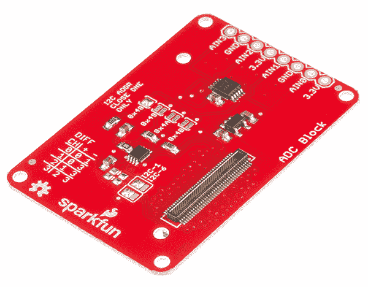
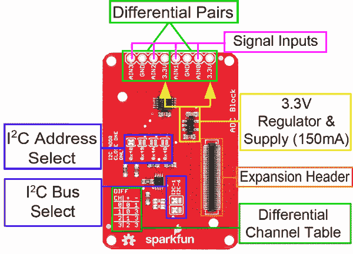
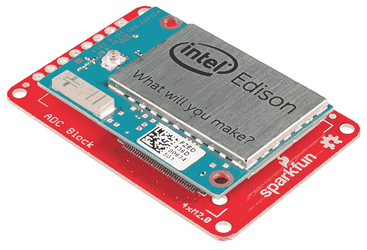
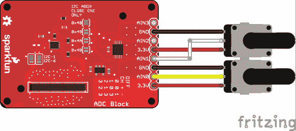

# 英特尔 Edison - ADC V20 的 SparkFun 模块

> 原文：<https://learn.sparkfun.com/tutorials/sparkfun-blocks-for-intel-edison---adc-v20>

## 介绍

**NOTE:** This tutorial applies to **V20** and **V21** of the ADC Block. V21 corrects the voltage noise and adds a locking header footprint for easier assembly with the [Edison SIK](https://www.sparkfun.com/edisonsik).

SparkFun 用于英特尔 Edison 的 [ADC 模块允许您向 Edison 堆栈添加四个 I2C 控制的 ADC 输入通道。这四个通道可以用作单端输入，也可以成对用作差分输入。每个通道都有一个接地基准。](https://www.sparkfun.com/products/13327)

转换器的最大分辨率为 12 位，或差分模式下的 11 位双极性。步长范围从每计数 125uV 到每计数 3mV。

[](https://cdn.sparkfun.com/assets/learn_tutorials/4/4/0/13327-01New.jpg)*ADC Block*

### 推荐阅读

如果你不熟悉积木，看看英特尔爱迪生的[spark fun 积木通用指南。](https://learn.sparkfun.com/tutorials/general-guide-to-sparkfun-blocks-for-intel-edison)

其他可能对您的爱迪生之旅有所帮助的教程包括:

*   本教程假设你是使用 Arduino IDE 的**而不是**，所以你需要熟悉 Edison 上的 C++开发。
*   [为您的项目提供动力](https://learn.sparkfun.com/tutorials/how-to-power-a-project)
*   [连接器基础知识](https://learn.sparkfun.com/tutorials/connector-basics)
*   [模数转换](https://learn.sparkfun.com/tutorials/analog-to-digital-conversion?_ga=1.102293383.725448541.1330116044)

## 主板概述

[](https://cdn.sparkfun.com/assets/learn_tutorials/4/4/0/Edison_ADC_New2.png)*ADC Block Functional Diagram*

*   信号输入-四路单输入可用。每个基准电压在软件控制下在 ADC 内部产生；这些引脚的输入不要超过 3.3V！

*   差分通道设置表-使用两个输入来创建一个差分对。适用于消除某些传感器中的噪声或测量非常小的信号。下表显示了“getDiffResult(channel)”函数的通道选项。

*   I2C 地址选择-仅将焊料涂在四个跳线中的一个上以选择地址。**不要同时做空这两样东西。不好的事情会发生。**

*   I2C 总线选择-改变这些跳线的**和**以选择将 I ² C 信号发送至总线 6 或总线 1。总线 1 是默认(也是首选)通道，因为它没有其他系统设备。总线 6 与一些内部器件共享，但如果您希望将该模块与 Arduino IDE 一起使用，您需要更改这些跳线，以便焊点连接底部焊盘和中心焊盘。

*   3.3V 150mA 电源——该电源为 ADC 提供片上基准电压，并可为小型传感器(例如电位计或温度传感器)供电。

## 使用 ADC 模块

要使用 ADC 模块，只需在电路板背面安装一个 Intel Edison 或将其添加到当前堆栈中。块可以不用硬件堆叠，但是它使扩展连接器不受机械应力的保护。

[](https://cdn.sparkfun.com/assets/learn_tutorials/4/4/0/ADCBlockInstalledCrop.jpg)*ADC Block Installed*

我们有一个很好的[硬件包](https://www.sparkfun.com/products/13187)可以提供足够的硬件来保护三个街区和一个爱迪生。

[](https://cdn.sparkfun.com/assets/learn_tutorials/2/8/6/EdisonHardware_1.jpg)[*Intel Edison Hardware Pack*](https://www.sparkfun.com/products/13187)

注:ADC 模块没有控制台入口或稳压器。建议将控制台通信模块与该模块结合使用，就像在[英特尔 Edison](https://learn.sparkfun.com/tutorials/general-guide-to-sparkfun-blocks-for-intel-edison#console-communication-blocks)spark fun 模块通用指南中找到的模块一样。

## C++代码示例

我们假设您正在使用 Eclipse IDE，详见我们的[超越 Arduino](https://learn.sparkfun.com/tutorials/programming-the-intel-edison-beyond-the-arduino-ide) 教程。如果你不是，你需要去那个教程来加快速度。

#### 入门指南

按照[编程教程](https://learn.sparkfun.com/tutorials/programming-the-intel-edison-beyond-the-arduino-ide#hello-world)中的说明创建一个名为“spark fun _ ADC _ Edison _ Block _ Example”的新项目。一旦创建了项目，打开磁盘上的项目文件(提示:您可以通过从项目菜单中选择“属性”来找到项目的路径)，并将在[Edison ADC Block CPP library GitHub repository](https://github.com/sparkfun/SparkFun_ADC_Block_for_Edison_CPP_Library)中找到的三个源文件复制到“src”目录中。

[Download a zip file of the repository](https://github.com/sparkfun/SparkFun_ADC_Block_for_Edison_CPP_Library/archive/master.zip)

#### 硬件连接

本例中，我们在 3.3V 和 GND 之间连接了两个 5k 电位计，游标连接到通道 0 和 1。

该板的 V20 增加了一个 3.3V 基准电源(能够提供高达 150mA 的电流，因此可以直接为小型传感器供电！).

[](https://cdn.sparkfun.com/assets/learn_tutorials/4/4/0/edison_adc_v20_example.png)

当然，您可以连接任何其他模拟电压信号来代替电位计；我们使用它们是因为它们便于展示概念。

#### 密码

你需要知道的一切都在评论里。

```
language:cplusplus
/****************************************************************
Example file for SparkFun ADC Edison Block Support

1 Jun 2015- Mike Hord, SparkFun Electronics
Code developed in Intel's Eclipse IOT-DK

This code requires the Intel mraa library to function; for more
information see https://github.com/intel-iot-devkit/mraa

This code is beerware; if you use it, please buy me (or any other
SparkFun employee) a cold beverage next time you run into one of
us at the local.
****************************************************************/

#include "mraa.hpp"

#include <iostream>
#include <unistd.h>
#include "SparkFunADS1015.h"

using namespace std;

// Declare a variable for our i2c object. You can create an
//  arbitrary number of these, and pass them to however many
//  slave devices you wish.
mraa::I2c* adc_i2c;

int main()
{
    // The ADC is (by default) connected to I2C channel 1\. Here, we create
    //  a device to pass to the ads1015 object constructor.
    adc_i2c = new mraa::I2c(1);

    // Now, pass that I2C object and the address of the ADC block in your
    //  system to the ads1015 object constructor. Note that there are up to
    //  four different addresses available here, settable by jumper on the
    //  board. You'll need to create an ads1015 object for each one.
    ads1015 adc(adc_i2c, 0x48);

    // There are 6 settable ranges:
    //  _0_256V - Range is -0.256V to 0.255875V, and step size is 125uV.
    //  _0_512V - Range is -0.512V to 0.51175V, and step size is 250uV.
    //  _1_024V - Range is -1.024V to 1.0235V, and step size is 500uV.
    //  _2_048V - Range is -2.048V to 2.047V, and step size is 1mV.
    //  _4_096V - Range is -4.096V to 4.094V, and step size is 2mV.
    //  _6_144V - Range is -6.144V to 6.141V, and step size is 3mV.
    // The default setting is _2_048V.
    // NB!!! Just because FS reading is > 3.3V doesn't mean you can take an
    //  input above 3.3V! Keep your input voltages below 3.3V to avoid damage!
    adc.setRange(_0_512V);
    // getResult() returns a normalized floating point value representing the
    //  current voltage of the passed channel. User is responsible for
    //  logic to determine whether the value is at min or max.
    cout<<"Ch 0: "<<adc.getResult(0)<<endl;
    cout<<"Ch 1: "<<adc.getResult(1)<<endl;
    // getDiffResult() returns a normalized fp value representing the
    //  difference between two channels. Options are
    //  0 - Ch0 - Ch1
    //  1 - Ch0 - Ch3
    //  2 - Ch1 - Ch3
    //  3 - Ch2 - Ch3
    cout<<"Ch 0 - ch 1: "<<adc.getDiffResult(0)<<endl;

    // If you want to do the math yourself, you can determine the current gain
    //  setting by using the getScaler() command.
    cout<<"Current scaler: "<<adc.getScaler()<<"V per bit"<<endl;
    // The current voltage is the scaler/1000 multiplied by the raw value. You
    //  can get the raw ADC readings using the getRawResult() and
    //  getRawDiffResult() functions.
    cout<<"Ch 0 raw: "<<adc.getRawResult(0)<<endl;
    cout<<"Ch 1 raw: "<<adc.getRawResult(1)<<endl;
    cout<<"Ch 0 - ch 1 raw: "<<adc.getRawDiffResult(0)<<endl;

    // If you want to get *really* crazy, you can always go look up the
    //  datasheet and read and write the configuration register directly.
    cout<<"Config register: "<<hex<<adc.getConfigRegister()<<endl;
    // There's a "setConfigRegister()" function, too, which expects an
    //  unsigned 16-bit integer. Just FYI.

    return MRAA_SUCCESS;
} 
```

## 资源和更进一步

现在，您已经对 ADC 模块有了一个简单的概述，让我们来看看其他一些教程。这些教程涵盖编程、模块堆叠以及与英特尔 Edison 生态系统的接口。

## 爱迪生通用主题:

*   [英特尔爱迪生 Sparkfun 模块通用指南](https://learn.sparkfun.com/tutorials/general-guide-to-sparkfun-blocks-for-intel-edison)
*   [爱迪生入门指南](https://learn.sparkfun.com/tutorials/edison-getting-started-guide)
*   [在 Edison 上加载 Debian(Ubilinix)](https://learn.sparkfun.com/tutorials/loading-debian-ubilinux-on-the-edison)

## 阻止特定主题:

*   [ADC 模块 Git Repo](https://github.com/sparkfun/Edison_ADC_Block)
*   [ADC 模块 CPP 库 Git Repo](https://github.com/sparkfun/SparkFun_ADC_Block_for_Edison_CPP_Library)

查看 SparkFun 的其他爱迪生相关教程:

[](https://learn.sparkfun.com/tutorials/sparkfun-blocks-for-intel-edison---microsd-block) [### 英特尔 Edison - microSD 模块的 SparkFun 模块](https://learn.sparkfun.com/tutorials/sparkfun-blocks-for-intel-edison---microsd-block) A quick overview of the features of the microSD Block.[Favorited Favorite](# "Add to favorites") 2[](https://learn.sparkfun.com/tutorials/sparkfun-blocks-for-intel-edison---pwm) [### 英特尔 Edison - PWM 火花模块](https://learn.sparkfun.com/tutorials/sparkfun-blocks-for-intel-edison---pwm) A quick overview of the features of the PWM Block.[Favorited Favorite](# "Add to favorites") 2[](https://learn.sparkfun.com/tutorials/sparkfun-blocks-for-intel-edison---i2c-breakout-block) [### 英特尔爱迪生 I2C 分线块的火花块](https://learn.sparkfun.com/tutorials/sparkfun-blocks-for-intel-edison---i2c-breakout-block) A quick overview of the features of the I2C Breakout Block.[Favorited Favorite](# "Add to favorites") 2[](https://learn.sparkfun.com/tutorials/sparkfun-blocks-for-intel-edison---console-block) [### 英特尔 Edison 的 SparkFun 模块-控制台模块](https://learn.sparkfun.com/tutorials/sparkfun-blocks-for-intel-edison---console-block) A quick overview of the features of the Console Block.[Favorited Favorite](# "Add to favorites") 2