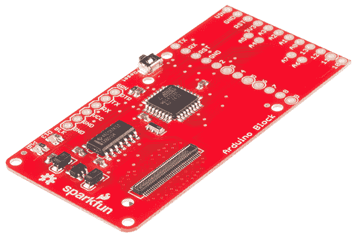
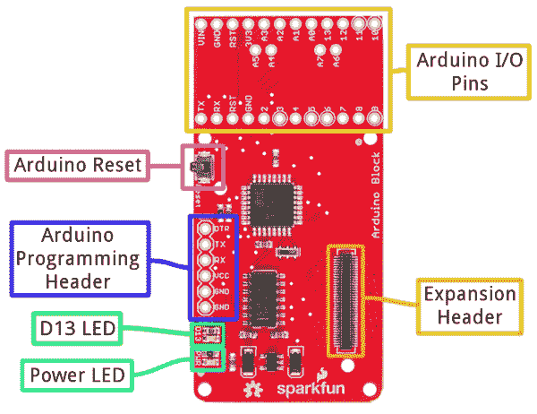
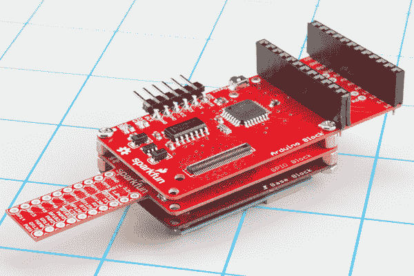
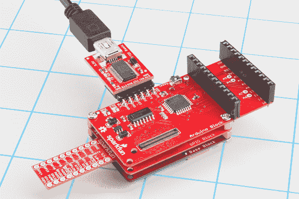
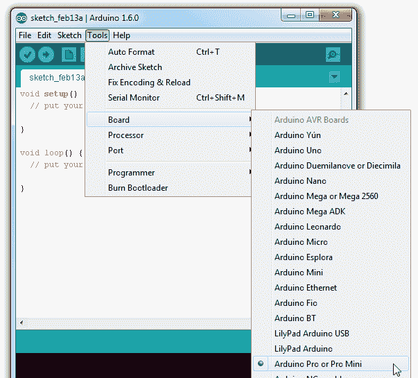
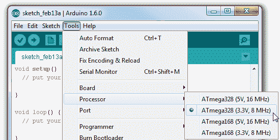
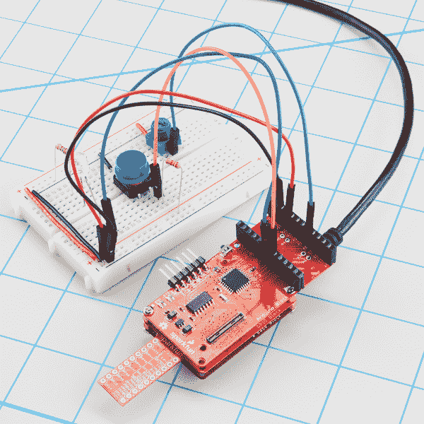

# 英特尔 Edison - Arduino 模块的 SparkFun 模块

> 原文：<https://learn.sparkfun.com/tutorials/sparkfun-blocks-for-intel-edison---arduino-block>

## 介绍

Edison 的 [Arduino 模块为](https://www.sparkfun.com/products/13036)[英特尔(R) Edison](https://www.sparkfun.com/products/13024) 提供了与兼容 Arduino 的 ATmega328 微处理器的直接串行链接。

[](https://cdn.sparkfun.com/assets/learn_tutorials/2/7/6/deafultarduino_block_iso.jpg)

为什么你需要一个 Arduino 连接到你的爱迪生？难道它没有足够的力量来处理任何可能扔向它的东西吗？这就是问题所在——它几乎太强大了。因为它运行的是操作系统，所以无法进行实时处理——这是 ATmega328 等小型微控制器的基本功能。需要精确计时的组件——如[ws 2812 led](https://www.sparkfun.com/products/11820)或[伺服电机](https://www.sparkfun.com/categories/245)——可能与 Edison 不兼容，因为它无法可靠地产生时钟信号。

Arduino 模块允许 Edison 卸载那些底层硬件任务。除此之外，如果你已经为一个外部组件编写了 Arduino 代码，你不需要把代码移植到 Edison 上——只需要在 Arduino 块上运行它！

### 推荐阅读

如果你不熟悉积木，看看英特尔爱迪生的[spark fun 积木通用指南。](https://learn.sparkfun.com/tutorials/general-guide-to-sparkfun-blocks-for-intel-edison)

其他可能对您的 Arduino 积木冒险有所帮助的教程包括:

*   [爱迪生入门指南](https://learn.sparkfun.com/tutorials/edison-getting-started-guide)
*   [为您的项目提供动力](https://learn.sparkfun.com/tutorials/how-to-power-a-project)
*   什么是 Arduino？
*   [使用 Arduino Pro Mini 3.3V](https://learn.sparkfun.com/tutorials/using-the-arduino-pro-mini-33v)

## 主板概述

[](https://cdn.sparkfun.com/assets/learn_tutorials/2/7/6/annotated.png)

*   **扩展接头**-70 针扩展接头发挥了英特尔 Edison 的功能。该头部还在整个电池组中传递信号和电力。这些功能很像一个 [Arduino 盾牌](https://learn.sparkfun.com/tutorials/arduino-shields)。
*   **Arduino I/O 引脚** -所有 Arduino 的 I/O 引脚都被分成一对接头(加上中间的一对)。这个头部的足迹与 [Arduino Pro Mini](https://www.sparkfun.com/products/11114) 的足迹完全匹配——如果你有任何迷你盾牌，它们应该与这个头部完全匹配。
*   **Arduino 编程接口** -标准 6 针 FTDI 接口用于对 Arduino 的串行引导程序进行编程。插入一个 [3.3V FTDI Basic](https://www.sparkfun.com/products/9873) 对你的 Arduino 进行编程。
*   **D13 LED**——每一个好的 Arduino 都需要一个 LED！这个绿色的小 LED 被系在 Arduino 的 13 号插脚上。伟大的闪烁“你好，世界”或调试。
*   **电源 LED**-Arduino 模块有一个板载 3.3V 调节器，该 LED 与该调节器的输出相连。
*   **Arduino 复位按钮** -该复位按钮连接到 Arduino 的复位线上。它只会重置 Arduino 这对爱迪生没有影响。

### 示意图概述

Arduino 模块通过两个 UARTs 之一将 ATmega328 与您的 Edison 配对。该板默认通过 UART1 将 Arduino 连接到 Edison。如果您的应用需要，跳线(见下文)允许您选择 UART2。不过，使用 UART2 时要小心，它的默认实用程序是用于控制台访问 Edison 的。

Arduino 模块有一个板载 3.3V 电压调节器，其输入来自 Edison 的 VSYS 总线。由于 Arduino 运行在 3.3V，其**时钟速度被限制在 8MHz** 。

如果你想仔细看看原理图，请点击下载 PDF 文件[。](https://cdn.sparkfun.com/datasheets/Dev/Edison/arduino_block.pdf)

### 针织套衫

在 Arduino 模块的背面，有一些跳线，为电路板增加了额外的实用性。

[](https://cdn.sparkfun.com/assets/learn_tutorials/2/7/6/jumpers.png)

三个双向跳线-用于 RX、TX 和 DTR -允许您在 UART1(默认)和 UART2 之间进行选择。要切换这些跳线，抓住一把[业余爱好刀](https://www.sparkfun.com/products/9200)，切断默认走线，并在您选择的中间焊盘和外部焊盘之间滴下一滴焊料。

标有 **VIN/VSYS** 的跳线允许您移除为 Arduino 模块供电的 VSYS 线路。如果您需要将 Arduino 模块的电源与 Edison 隔离，这非常方便。在这种情况下，您需要通过“VIN”引脚从外部供电(3.3-12V)。

## 使用 Arduino 模块

要使用 Arduino 积木，请将其连接到爱迪生积木上，或者将其添加到其他 SparkFun 积木堆中。

[](https://cdn.sparkfun.com/assets/learn_tutorials/2/7/6/stack.jpg)*Arduino block stacked on top of a [GPIO Block](https://www.sparkfun.com/products/13038) and a [Base Block](https://www.sparkfun.com/products/13045).*

为了给你的爱迪生供电，你至少需要一个附加模块。例如，您可以使用[基块](https://www.sparkfun.com/products/13045)或[电池块](https://www.sparkfun.com/products/13037)。

### Arduino 编程

Arduino 模块上的 Arduino 可以在 Edison 打开或关闭时进行编程。不过，根据您的应用，建议您在 Arduino 与 Edison 堆栈断开连接时在 Arduino 上加载代码，然后再将其添加到系统的其余部分。

如果你曾经上传过 Arduino 草图到 Arduino Pro 或 T2 Pro Mini，你就已经熟悉上传代码到 Arduino 模块。将一个 [3.3V 基本 FTDI](https://www.sparkfun.com/products/9873)连接到板上的 6 针 FTDI 接头。

[](https://cdn.sparkfun.com/assets/learn_tutorials/2/7/6/programming.jpg)*Using a 3.3V FTDI Basic to program the Arduino on the Arduino Block.*

在 Arduino(Arduino 的非爱迪生版本！)，从工具>主板菜单中选择“Arduino Pro 或 Pro Mini 3.3V/8MHz”。如果您使用的是 Arduino 的最新版本(1.6 或更高版本)，请先从“Board”菜单中选择 **Arduino Pro 或 Pro Mini** 。

[](https://cdn.sparkfun.com/assets/learn_tutorials/2/7/6/board_selection_01.png)

然后从“处理器”菜单中选择 **ATmega328 (3.3V，8MHz)** 。

[](https://cdn.sparkfun.com/assets/learn_tutorials/2/7/6/board_selection_02.png)

然后上传走！

### 使用 Arduino 引脚

Arduino 的 I/O 引脚都被分成一对接头。这些接头与 Arduino Pro Mini 完全匹配。如果你有 Pro Mini 的任何屏蔽或背负板，它应该可以与 Arduino 块无缝地工作。

您可以将[接头](https://www.sparkfun.com/products/115)、[导线](https://www.sparkfun.com/products/11367)或任何其他连接器焊接到这些引脚上。

[](https://cdn.sparkfun.com/assets/learn_tutorials/2/7/6/in-action.jpg)

如果要将接头焊接到引脚上，要格外小心地决定焊接到哪一侧。根据 Edison 堆栈的其他部分，这些接头可能会妨碍其他板上的连接器(尤其是底座和控制台块上的 USB 连接器)。

### 将爱迪生连接到 Arduino

Arduino 模块通过串行(UART)连接将 Arduino 连接到 Edison。电路板背面的跳线允许您选择 Edison 的两个 UARTs 中的哪一个与 Arduino 配对。除非无法避免，否则我们建议让跳线保持默认配置 Edison 的 UART2 通常专用于控制台访问。

要对 Edison 进行编程以控制 Arduino 并与之交互，您需要使用 UART 来建立设备之间的通信协议。Arduino 和 Edison 之间 UART 通信的简单示例见下一节。

## 用 Firmata 控制 Arduino 模块

Firmata 是一个[建立的协议](https://github.com/firmata/protocol),在 Arduino 领域中流行，用于需要单独的机器(通常是计算机)来控制 Arduino 的应用。这是一个基于串行的协议，它使用定义的信息来设置数字引脚，读取模拟引脚，以及执行 Arduino 的所有其他操作。

Firmata 非常有用，标准的 Arduino IDE 甚至附带了 Firmata 库。这里有一个例子，说明如何使用 Edison 来控制运行 Firmata 的 Arduino 并与之交互。

### 将标准固件数据上传到 Arduino

在上传任何代码到 Edison 之前，让我们加载一些东西到 Arduino。一旦 Firmata 代码在你的 Arduino 上运行，你可能再也不用上传代码了。

使用标准 Arduino IDE(即*不是*为 Edison 构建的 IDE)，通过进入**文件** > **示例**>**Firmata**>**StandardFirmata**加载“StandardFirmata”草图。

```
language:c
    /*
 * Firmata is a generic protocol for communicating with microcontrollers
 * from software on a host computer. It is intended to work with
 * any host computer software package.
 *
 * To download a host software package, please clink on the following link
 * to open the download page in your default browser.
 *
 * http://firmata.org/wiki/Download
 */

/*
  Copyright (C) 2006-2008 Hans-Christoph Steiner.  All rights reserved.
  Copyright (C) 2010-2011 Paul Stoffregen.  All rights reserved.
  Copyright (C) 2009 Shigeru Kobayashi.  All rights reserved.
  Copyright (C) 2009-2011 Jeff Hoefs.  All rights reserved.

  This library is free software; you can redistribute it and/or
  modify it under the terms of the GNU Lesser General Public
  License as published by the Free Software Foundation; either
  version 2.1 of the License, or (at your option) any later version.

  See file LICENSE.txt for further informations on licensing terms.

  formatted using the GNU C formatting and indenting
*/

/* 
 * TODO: use Program Control to load stored profiles from EEPROM
 */

#include <Servo.h>
#include <Wire.h>
#include <Firmata.h>

// move the following defines to Firmata.h?
#define I2C_WRITE B00000000
#define I2C_READ B00001000
#define I2C_READ_CONTINUOUSLY B00010000
#define I2C_STOP_READING B00011000
#define I2C_READ_WRITE_MODE_MASK B00011000
#define I2C_10BIT_ADDRESS_MODE_MASK B00100000

#define MAX_QUERIES 8
#define MINIMUM_SAMPLING_INTERVAL 10

#define REGISTER_NOT_SPECIFIED -1

/*==============================================================================
 * GLOBAL VARIABLES
 *============================================================================*/

/* analog inputs */
int analogInputsToReport = 0; // bitwise array to store pin reporting

/* digital input ports */
byte reportPINs[TOTAL_PORTS];       // 1 = report this port, 0 = silence
byte previousPINs[TOTAL_PORTS];     // previous 8 bits sent

/* pins configuration */
byte pinConfig[TOTAL_PINS];         // configuration of every pin
byte portConfigInputs[TOTAL_PORTS]; // each bit: 1 = pin in INPUT, 0 = anything else
int pinState[TOTAL_PINS];           // any value that has been written

/* timer variables */
unsigned long currentMillis;        // store the current value from millis()
unsigned long previousMillis;       // for comparison with currentMillis
int samplingInterval = 19;          // how often to run the main loop (in ms)

/* i2c data */
struct i2c_device_info {
  byte addr;
  byte reg;
  byte bytes;
};

/* for i2c read continuous more */
i2c_device_info query[MAX_QUERIES];

byte i2cRxData[32];
boolean isI2CEnabled = false;
signed char queryIndex = -1;
unsigned int i2cReadDelayTime = 0;  // default delay time between i2c read request and Wire.requestFrom()

Servo servos[MAX_SERVOS];
/*==============================================================================
 * FUNCTIONS
 *============================================================================*/

void readAndReportData(byte address, int theRegister, byte numBytes) {
  // allow I2C requests that don't require a register read
  // for example, some devices using an interrupt pin to signify new data available
  // do not always require the register read so upon interrupt you call Wire.requestFrom()  
  if (theRegister != REGISTER_NOT_SPECIFIED) {
    Wire.beginTransmission(address);
    #if ARDUINO >= 100
    Wire.write((byte)theRegister);
    #else
    Wire.send((byte)theRegister);
    #endif
    Wire.endTransmission();
    delayMicroseconds(i2cReadDelayTime);  // delay is necessary for some devices such as WiiNunchuck
  } else {
    theRegister = 0;  // fill the register with a dummy value
  }

  Wire.requestFrom(address, numBytes);  // all bytes are returned in requestFrom

  // check to be sure correct number of bytes were returned by slave
  if(numBytes == Wire.available()) {
    i2cRxData[0] = address;
    i2cRxData[1] = theRegister;
    for (int i = 0; i < numBytes; i++) {
      #if ARDUINO >= 100
      i2cRxData[2 + i] = Wire.read();
      #else
      i2cRxData[2 + i] = Wire.receive();
      #endif
    }
  }
  else {
    if(numBytes > Wire.available()) {
      Firmata.sendString("I2C Read Error: Too many bytes received");
    } else {
      Firmata.sendString("I2C Read Error: Too few bytes received"); 
    }
  }

  // send slave address, register and received bytes
  Firmata.sendSysex(SYSEX_I2C_REPLY, numBytes + 2, i2cRxData);
}

void outputPort(byte portNumber, byte portValue, byte forceSend)
{
  // pins not configured as INPUT are cleared to zeros
  portValue = portValue & portConfigInputs[portNumber];
  // only send if the value is different than previously sent
  if(forceSend || previousPINs[portNumber] != portValue) {
    Firmata.sendDigitalPort(portNumber, portValue);
    previousPINs[portNumber] = portValue;
  }
}

/* -----------------------------------------------------------------------------
 * check all the active digital inputs for change of state, then add any events
 * to the Serial output queue using Serial.print() */
void checkDigitalInputs(void)
{
  /* Using non-looping code allows constants to be given to readPort().
   * The compiler will apply substantial optimizations if the inputs
   * to readPort() are compile-time constants. */
  if (TOTAL_PORTS > 0 && reportPINs[0]) outputPort(0, readPort(0, portConfigInputs[0]), false);
  if (TOTAL_PORTS > 1 && reportPINs[1]) outputPort(1, readPort(1, portConfigInputs[1]), false);
  if (TOTAL_PORTS > 2 && reportPINs[2]) outputPort(2, readPort(2, portConfigInputs[2]), false);
  if (TOTAL_PORTS > 3 && reportPINs[3]) outputPort(3, readPort(3, portConfigInputs[3]), false);
  if (TOTAL_PORTS > 4 && reportPINs[4]) outputPort(4, readPort(4, portConfigInputs[4]), false);
  if (TOTAL_PORTS > 5 && reportPINs[5]) outputPort(5, readPort(5, portConfigInputs[5]), false);
  if (TOTAL_PORTS > 6 && reportPINs[6]) outputPort(6, readPort(6, portConfigInputs[6]), false);
  if (TOTAL_PORTS > 7 && reportPINs[7]) outputPort(7, readPort(7, portConfigInputs[7]), false);
  if (TOTAL_PORTS > 8 && reportPINs[8]) outputPort(8, readPort(8, portConfigInputs[8]), false);
  if (TOTAL_PORTS > 9 && reportPINs[9]) outputPort(9, readPort(9, portConfigInputs[9]), false);
  if (TOTAL_PORTS > 10 && reportPINs[10]) outputPort(10, readPort(10, portConfigInputs[10]), false);
  if (TOTAL_PORTS > 11 && reportPINs[11]) outputPort(11, readPort(11, portConfigInputs[11]), false);
  if (TOTAL_PORTS > 12 && reportPINs[12]) outputPort(12, readPort(12, portConfigInputs[12]), false);
  if (TOTAL_PORTS > 13 && reportPINs[13]) outputPort(13, readPort(13, portConfigInputs[13]), false);
  if (TOTAL_PORTS > 14 && reportPINs[14]) outputPort(14, readPort(14, portConfigInputs[14]), false);
  if (TOTAL_PORTS > 15 && reportPINs[15]) outputPort(15, readPort(15, portConfigInputs[15]), false);
}

// -----------------------------------------------------------------------------
/* sets the pin mode to the correct state and sets the relevant bits in the
 * two bit-arrays that track Digital I/O and PWM status
 */
void setPinModeCallback(byte pin, int mode)
{
  if (pinConfig[pin] == I2C && isI2CEnabled && mode != I2C) {
    // disable i2c so pins can be used for other functions
    // the following if statements should reconfigure the pins properly
    disableI2CPins();
  }
  if (IS_PIN_SERVO(pin) && mode != SERVO && servos[PIN_TO_SERVO(pin)].attached()) {
    servos[PIN_TO_SERVO(pin)].detach();
  }
  if (IS_PIN_ANALOG(pin)) {
    reportAnalogCallback(PIN_TO_ANALOG(pin), mode == ANALOG ? 1 : 0); // turn on/off reporting
  }
  if (IS_PIN_DIGITAL(pin)) {
    if (mode == INPUT) {
      portConfigInputs[pin/8] |= (1 << (pin & 7));
    } else {
      portConfigInputs[pin/8] &= ~(1 << (pin & 7));
    }
  }
  pinState[pin] = 0;
  switch(mode) {
  case ANALOG:
    if (IS_PIN_ANALOG(pin)) {
      if (IS_PIN_DIGITAL(pin)) {
        pinMode(PIN_TO_DIGITAL(pin), INPUT); // disable output driver
        digitalWrite(PIN_TO_DIGITAL(pin), LOW); // disable internal pull-ups
      }
      pinConfig[pin] = ANALOG;
    }
    break;
  case INPUT:
    if (IS_PIN_DIGITAL(pin)) {
      pinMode(PIN_TO_DIGITAL(pin), INPUT); // disable output driver
      digitalWrite(PIN_TO_DIGITAL(pin), LOW); // disable internal pull-ups
      pinConfig[pin] = INPUT;
    }
    break;
  case OUTPUT:
    if (IS_PIN_DIGITAL(pin)) {
      digitalWrite(PIN_TO_DIGITAL(pin), LOW); // disable PWM
      pinMode(PIN_TO_DIGITAL(pin), OUTPUT);
      pinConfig[pin] = OUTPUT;
    }
    break;
  case PWM:
    if (IS_PIN_PWM(pin)) {
      pinMode(PIN_TO_PWM(pin), OUTPUT);
      analogWrite(PIN_TO_PWM(pin), 0);
      pinConfig[pin] = PWM;
    }
    break;
  case SERVO:
    if (IS_PIN_SERVO(pin)) {
      pinConfig[pin] = SERVO;
      if (!servos[PIN_TO_SERVO(pin)].attached()) {
          servos[PIN_TO_SERVO(pin)].attach(PIN_TO_DIGITAL(pin));
      }
    }
    break;
  case I2C:
    if (IS_PIN_I2C(pin)) {
      // mark the pin as i2c
      // the user must call I2C_CONFIG to enable I2C for a device
      pinConfig[pin] = I2C;
    }
    break;
  default:
    Firmata.sendString("Unknown pin mode"); // TODO: put error msgs in EEPROM
  }
  // TODO: save status to EEPROM here, if changed
}

void analogWriteCallback(byte pin, int value)
{
  if (pin < TOTAL_PINS) {
    switch(pinConfig[pin]) {
    case SERVO:
      if (IS_PIN_SERVO(pin))
        servos[PIN_TO_SERVO(pin)].write(value);
        pinState[pin] = value;
      break;
    case PWM:
      if (IS_PIN_PWM(pin))
        analogWrite(PIN_TO_PWM(pin), value);
        pinState[pin] = value;
      break;
    }
  }
}

void digitalWriteCallback(byte port, int value)
{
  byte pin, lastPin, mask=1, pinWriteMask=0;

  if (port < TOTAL_PORTS) {
    // create a mask of the pins on this port that are writable.
    lastPin = port*8+8;
    if (lastPin > TOTAL_PINS) lastPin = TOTAL_PINS;
    for (pin=port*8; pin < lastPin; pin++) {
      // do not disturb non-digital pins (eg, Rx & Tx)
      if (IS_PIN_DIGITAL(pin)) {
        // only write to OUTPUT and INPUT (enables pullup)
        // do not touch pins in PWM, ANALOG, SERVO or other modes
        if (pinConfig[pin] == OUTPUT || pinConfig[pin] == INPUT) {
          pinWriteMask |= mask;
          pinState[pin] = ((byte)value & mask) ? 1 : 0;
        }
      }
      mask = mask << 1;
    }
    writePort(port, (byte)value, pinWriteMask);
  }
}

// -----------------------------------------------------------------------------
/* sets bits in a bit array (int) to toggle the reporting of the analogIns
 */
//void FirmataClass::setAnalogPinReporting(byte pin, byte state) {
//}
void reportAnalogCallback(byte analogPin, int value)
{
  if (analogPin < TOTAL_ANALOG_PINS) {
    if(value == 0) {
      analogInputsToReport = analogInputsToReport &~ (1 << analogPin);
    } else {
      analogInputsToReport = analogInputsToReport | (1 << analogPin);
    }
  }
  // TODO: save status to EEPROM here, if changed
}

void reportDigitalCallback(byte port, int value)
{
  if (port < TOTAL_PORTS) {
    reportPINs[port] = (byte)value;
  }
  // do not disable analog reporting on these 8 pins, to allow some
  // pins used for digital, others analog.  Instead, allow both types
  // of reporting to be enabled, but check if the pin is configured
  // as analog when sampling the analog inputs.  Likewise, while
  // scanning digital pins, portConfigInputs will mask off values from any
  // pins configured as analog
}

/*==============================================================================
 * SYSEX-BASED commands
 *============================================================================*/

void sysexCallback(byte command, byte argc, byte *argv)
{
  byte mode;
  byte slaveAddress;
  byte slaveRegister;
  byte data;
  unsigned int delayTime; 

  switch(command) {
  case I2C_REQUEST:
    mode = argv[1] & I2C_READ_WRITE_MODE_MASK;
    if (argv[1] & I2C_10BIT_ADDRESS_MODE_MASK) {
      Firmata.sendString("10-bit addressing mode is not yet supported");
      return;
    }
    else {
      slaveAddress = argv[0];
    }

    switch(mode) {
    case I2C_WRITE:
      Wire.beginTransmission(slaveAddress);
      for (byte i = 2; i < argc; i += 2) {
        data = argv[i] + (argv[i + 1] << 7);
        #if ARDUINO >= 100
        Wire.write(data);
        #else
        Wire.send(data);
        #endif
      }
      Wire.endTransmission();
      delayMicroseconds(70);
      break;
    case I2C_READ:
      if (argc == 6) {
        // a slave register is specified
        slaveRegister = argv[2] + (argv[3] << 7);
        data = argv[4] + (argv[5] << 7);  // bytes to read
        readAndReportData(slaveAddress, (int)slaveRegister, data);
      }
      else {
        // a slave register is NOT specified
        data = argv[2] + (argv[3] << 7);  // bytes to read
        readAndReportData(slaveAddress, (int)REGISTER_NOT_SPECIFIED, data);
      }
      break;
    case I2C_READ_CONTINUOUSLY:
      if ((queryIndex + 1) >= MAX_QUERIES) {
        // too many queries, just ignore
        Firmata.sendString("too many queries");
        break;
      }
      queryIndex++;
      query[queryIndex].addr = slaveAddress;
      query[queryIndex].reg = argv[2] + (argv[3] << 7);
      query[queryIndex].bytes = argv[4] + (argv[5] << 7);
      break;
    case I2C_STOP_READING:
      byte queryIndexToSkip;      
      // if read continuous mode is enabled for only 1 i2c device, disable
      // read continuous reporting for that device
      if (queryIndex <= 0) {
        queryIndex = -1;        
      } else {
        // if read continuous mode is enabled for multiple devices,
        // determine which device to stop reading and remove it's data from
        // the array, shifiting other array data to fill the space
        for (byte i = 0; i < queryIndex + 1; i++) {
          if (query[i].addr = slaveAddress) {
            queryIndexToSkip = i;
            break;
          }
        }

        for (byte i = queryIndexToSkip; i<queryIndex + 1; i++) {
          if (i < MAX_QUERIES) {
            query[i].addr = query[i+1].addr;
            query[i].reg = query[i+1].addr;
            query[i].bytes = query[i+1].bytes; 
          }
        }
        queryIndex--;
      }
      break;
    default:
      break;
    }
    break;
  case I2C_CONFIG:
    delayTime = (argv[0] + (argv[1] << 7));

    if(delayTime > 0) {
      i2cReadDelayTime = delayTime;
    }

    if (!isI2CEnabled) {
      enableI2CPins();
    }

    break;
  case SERVO_CONFIG:
    if(argc > 4) {
      // these vars are here for clarity, they'll optimized away by the compiler
      byte pin = argv[0];
      int minPulse = argv[1] + (argv[2] << 7);
      int maxPulse = argv[3] + (argv[4] << 7);

      if (IS_PIN_SERVO(pin)) {
        if (servos[PIN_TO_SERVO(pin)].attached())
          servos[PIN_TO_SERVO(pin)].detach();
        servos[PIN_TO_SERVO(pin)].attach(PIN_TO_DIGITAL(pin), minPulse, maxPulse);
        setPinModeCallback(pin, SERVO);
      }
    }
    break;
  case SAMPLING_INTERVAL:
    if (argc > 1) {
      samplingInterval = argv[0] + (argv[1] << 7);
      if (samplingInterval < MINIMUM_SAMPLING_INTERVAL) {
        samplingInterval = MINIMUM_SAMPLING_INTERVAL;
      }      
    } else {
      //Firmata.sendString("Not enough data");
    }
    break;
  case EXTENDED_ANALOG:
    if (argc > 1) {
      int val = argv[1];
      if (argc > 2) val |= (argv[2] << 7);
      if (argc > 3) val |= (argv[3] << 14);
      analogWriteCallback(argv[0], val);
    }
    break;
  case CAPABILITY_QUERY:
    Serial.write(START_SYSEX);
    Serial.write(CAPABILITY_RESPONSE);
    for (byte pin=0; pin < TOTAL_PINS; pin++) {
      if (IS_PIN_DIGITAL(pin)) {
        Serial.write((byte)INPUT);
        Serial.write(1);
        Serial.write((byte)OUTPUT);
        Serial.write(1);
      }
      if (IS_PIN_ANALOG(pin)) {
        Serial.write(ANALOG);
        Serial.write(10);
      }
      if (IS_PIN_PWM(pin)) {
        Serial.write(PWM);
        Serial.write(8);
      }
      if (IS_PIN_SERVO(pin)) {
        Serial.write(SERVO);
        Serial.write(14);
      }
      if (IS_PIN_I2C(pin)) {
        Serial.write(I2C);
        Serial.write(1);  // to do: determine appropriate value 
      }
      Serial.write(127);
    }
    Serial.write(END_SYSEX);
    break;
  case PIN_STATE_QUERY:
    if (argc > 0) {
      byte pin=argv[0];
      Serial.write(START_SYSEX);
      Serial.write(PIN_STATE_RESPONSE);
      Serial.write(pin);
      if (pin < TOTAL_PINS) {
        Serial.write((byte)pinConfig[pin]);
    Serial.write((byte)pinState[pin] & 0x7F);
    if (pinState[pin] & 0xFF80) Serial.write((byte)(pinState[pin] >> 7) & 0x7F);
    if (pinState[pin] & 0xC000) Serial.write((byte)(pinState[pin] >> 14) & 0x7F);
      }
      Serial.write(END_SYSEX);
    }
    break;
  case ANALOG_MAPPING_QUERY:
    Serial.write(START_SYSEX);
    Serial.write(ANALOG_MAPPING_RESPONSE);
    for (byte pin=0; pin < TOTAL_PINS; pin++) {
      Serial.write(IS_PIN_ANALOG(pin) ? PIN_TO_ANALOG(pin) : 127);
    }
    Serial.write(END_SYSEX);
    break;
  }
}

void enableI2CPins()
{
  byte i;
  // is there a faster way to do this? would probaby require importing 
  // Arduino.h to get SCL and SDA pins
  for (i=0; i < TOTAL_PINS; i++) {
    if(IS_PIN_I2C(i)) {
      // mark pins as i2c so they are ignore in non i2c data requests
      setPinModeCallback(i, I2C);
    } 
  }

  isI2CEnabled = true; 

  // is there enough time before the first I2C request to call this here?
  Wire.begin();
}

/* disable the i2c pins so they can be used for other functions */
void disableI2CPins() {
    isI2CEnabled = false;
    // disable read continuous mode for all devices
    queryIndex = -1;
    // uncomment the following if or when the end() method is added to Wire library
    // Wire.end();
}

/*==============================================================================
 * SETUP()
 *============================================================================*/

void systemResetCallback()
{
  // initialize a defalt state
  // TODO: option to load config from EEPROM instead of default
  if (isI2CEnabled) {
    disableI2CPins();
  }
  for (byte i=0; i < TOTAL_PORTS; i++) {
    reportPINs[i] = false;      // by default, reporting off
    portConfigInputs[i] = 0;    // until activated
    previousPINs[i] = 0;
  }
  // pins with analog capability default to analog input
  // otherwise, pins default to digital output
  for (byte i=0; i < TOTAL_PINS; i++) {
    if (IS_PIN_ANALOG(i)) {
      // turns off pullup, configures everything
      setPinModeCallback(i, ANALOG);
    } else {
      // sets the output to 0, configures portConfigInputs
      setPinModeCallback(i, OUTPUT);
    }
  }
  // by default, do not report any analog inputs
  analogInputsToReport = 0;

  /* send digital inputs to set the initial state on the host computer,
   * since once in the loop(), this firmware will only send on change */
  /*
  TODO: this can never execute, since no pins default to digital input
        but it will be needed when/if we support EEPROM stored config
  for (byte i=0; i < TOTAL_PORTS; i++) {
    outputPort(i, readPort(i, portConfigInputs[i]), true);
  }
  */
}

void setup() 
{
  Firmata.setFirmwareVersion(FIRMATA_MAJOR_VERSION, FIRMATA_MINOR_VERSION);

  Firmata.attach(ANALOG_MESSAGE, analogWriteCallback);
  Firmata.attach(DIGITAL_MESSAGE, digitalWriteCallback);
  Firmata.attach(REPORT_ANALOG, reportAnalogCallback);
  Firmata.attach(REPORT_DIGITAL, reportDigitalCallback);
  Firmata.attach(SET_PIN_MODE, setPinModeCallback);
  Firmata.attach(START_SYSEX, sysexCallback);
  Firmata.attach(SYSTEM_RESET, systemResetCallback);

  Firmata.begin(57600);
  systemResetCallback();  // reset to default config
}

/*==============================================================================
 * LOOP()
 *============================================================================*/
void loop() 
{
  byte pin, analogPin;

  /* DIGITALREAD - as fast as possible, check for changes and output them to the
   * FTDI buffer using Serial.print()  */
  checkDigitalInputs();  

  /* SERIALREAD - processing incoming messagse as soon as possible, while still
   * checking digital inputs.  */
  while(Firmata.available())
    Firmata.processInput();

  /* SEND FTDI WRITE BUFFER - make sure that the FTDI buffer doesn't go over
   * 60 bytes. use a timer to sending an event character every 4 ms to
   * trigger the buffer to dump. */

  currentMillis = millis();
  if (currentMillis - previousMillis > samplingInterval) {
    previousMillis += samplingInterval;
    /* ANALOGREAD - do all analogReads() at the configured sampling interval */
    for(pin=0; pin<TOTAL_PINS; pin++) {
      if (IS_PIN_ANALOG(pin) && pinConfig[pin] == ANALOG) {
        analogPin = PIN_TO_ANALOG(pin);
        if (analogInputsToReport & (1 << analogPin)) {
          Firmata.sendAnalog(analogPin, analogRead(analogPin));
        }
      }
    }
    // report i2c data for all device with read continuous mode enabled
    if (queryIndex > -1) {
      for (byte i = 0; i < queryIndex + 1; i++) {
        readAndReportData(query[i].addr, query[i].reg, query[i].bytes);
      }
    }
  }
} 
```

上传 Firmata 固件后，您可以断开 FTDI Basic，并将 Arduino 模块连接到 Edison 堆栈。

### Arduino 客户的 Edison Firmata

这个等式中更难的部分是编写一些在 Edison 上执行的东西，这些东西与我们运行 Firmata 的 Arduino 交互。Firmata GitHub 简介中有大量优秀的客户实例，但没有一个是为 Edison 设计的。

根据 [Firmata 处理示例](https://github.com/firmata/processing/blob/master/src/Firmata.java)，我们写了这个草图来实现一个 Edison Firmata 客户端。

**Arduino version alert!** This Arduino sketch is intended to run on the Edison. You'll need to download the [Edison Arduino IDE](http://www.intel.com/support/edison/sb/CS-035180.htm), and use that to upload this code to your Edison. For more help programming the Edison in Arduino, check out our [Getting Started with Edison tutorial](https://learn.sparkfun.com/tutorials/edison-getting-started-guide#programming-the-edison-in-arduino).

这是草图。从下面复制/粘贴，或从[获取最新版本此要点](https://gist.github.com/jimblom/71a06b6493e5ef927f0c):

```
language:c
/****************************************************************
   Edison Firmata Client
   by: Jim Lindblom @ SparkFun Electronics
   created on: Februrary 12, 2015
   github: 

   This is an Firmata client sketch for the Edison. It can
   communicate with an Arduino running Firmata over a Serial
   connection.

   Support for the following functions is written:
     firmata_init() -- set up firmata and pin reporting
     firmata_pinMode([pin], [0, 1, 2, 3, 4, 5, 6])
     firmata_digitalWrite([pin], [LOW/HIGH])
     firmata_analogWrite([pin], [0-255])
     firmata_analogRead([0-7])
     firmata_digitalRead([pin])
     firmata_servoWrite([pin], [value])

   Development Environment Specifics:
   Arduino 1.5.3 (for Edison)
   Intel Edison rev C
   Arduino Block for Edison
     Arduino should be running StandardFirmata

   This sketch is based on Firmata's processing client:
   https://github.com/firmata/processing
   As such, it is released under the same, free license. You can 
   redistribute it and/or modify it under the terms of the GNU 
   Lesser General Public License as published by the Free 
   Software Foundation; either version 2.1 of the License, or 
   (at your option) any later version.

   Distributed as-is; no warranty is given. 
****************************************************************/
// SerialEvent1 isn't defined in the Edison core (I think).
// To get some form of interrupt-driven Serial input, we'll read
// serial in on a timer.
#include <TimerOne.h>

#define MAX_DATA_BYTES 4096
#define MAX_PINS 128

// Pin Mode definitons:
// Use any of these six values to set a pin to INPUT, OUTPUT,
// ANALOG, PWM, SERVO, SHIFT, or I2C.
enum const_pin_mode {
  MODE_INPUT,  // 0
  MODE_OUTPUT, // 1
  MODE_ANALOG, // 2
  MODE_PWM,    // 3
  MODE_SERVO,  // 4
  MODE_SHIFT,  // 5
  MODE_I2C     // 6
};

// Message Types
// Used by the low-level Firmata functions to set up the 
// Firmata messages.
#define ANALOG_MESSAGE  0xE0
#define DIGITAL_MESSAGE 0x90
#define REPORT_ANALOG   0xC0
#define REPORT_DIGITAL  0xD0
#define START_SYSEX     0xF0
#define SET_PIN_MODE    0xF4
#define END_SYSEX       0xF7
#define REPORT_VERSION  0xF9
#define SYSTEM_RESET    0xFF

// Extended Commands:
// Used by the low-level Firmata functions to set up the 
// Firmata messages.
#define SERVO_CONFIG            0x70
#define STRING_DATA             0x71
#define SHIFT_DATA              0x75
#define I2C_REQUEST             0x76
#define I2C_REPLY               0x77
#define I2C_CONFIG              0x78
#define EXTENDED_ANALOG         0x6F
#define PIN_STATE_QUERY         0x6D
#define PIN_STATE_RESPONSE      0x6E
#define CAPABILITY_QUERY        0x6B
#define CAPABILITY_RESPONSE     0x6C
#define ANALOG_MAPPING_QUERY    0x69
#define ANALOG_MAPPING_RESPONSE 0x6A
#define REPORT_FIRMWARE         0x79
#define SAMPLING_INTERVAL       0x7A
#define SYSEX_NON_REALTIME      0x7E
#define SYSEX_REALTIME          0x7F

// Flags and variables to keep track of message reading status:
boolean parsingSysex = false;
int waitForData = 0;
int storedInputData[MAX_DATA_BYTES];
int sysexBytesRead = 0;
int executeMultiByteCommand = 0;
int multiByteChannel = 0;
// Variable arrays to keep track of pin values read in.
int digitalInputData[] = {0, 0, 0, 0, 0, 0, 0, 0, 
                          0, 0, 0, 0, 0, 0, 0, 0};
int analogInputData[] = {0, 0, 0, 0, 0, 0, 0, 0, 
                         0, 0, 0, 0, 0, 0, 0, 0};
int analogChannel[MAX_PINS];
boolean blinkFlag = false;

void setup()
{
  // Debug messages are sent out Serial. Use the Serial monitor
  // at 9600 bps to read pin values.
  Serial.begin(9600);

  // firmata_init sets up our firmata client. It tells the 
  // Firmata device to begin streaming analog values and any
  // digital pin value changes.
  firmata_init();

  // Use firmata_pinMode([pin], [value]) to set up pins on the
  // Firmata host:
  firmata_pinMode(13, MODE_OUTPUT); // LED tied to pin 13
  firmata_pinMode(4, MODE_INPUT);   // Digital input on pin 4
  firmata_pinMode(A0, MODE_ANALOG); // Analog input on pin 0
  firmata_pinMode(3, MODE_PWM);     // PWM LED on pin 3
}

void loop() 
{
  // Print the value of our Firmata Arduino's A0 pin:
  int a0Value = firmata_analogRead(0);
  Serial.print("A0: ");
  Serial.println(a0Value);

  // Print the value of our digital input on pin 4:
  int d4Value = firmata_digitalRead(4);
  Serial.print("Pin 4: ");
  Serial.println(d4Value);

  if (d4Value == LOW)
  {
    // Scale the value of A0 to write a PWM output on pin 3:
    firmata_analogWrite(3, firmata_analogRead(0) / 4);
  }
  else
  {
    // Scale the value of A0 to write a PWM output on pin 3:
    firmata_analogWrite(3, 0);
  }

}

///////////////////////////////////
// Upper Level Firmata Functions //
///////////////////////////////////
// Firmata functions that you should use in your sketch above.
// If this was a class, these'd be public functions.

// firmata_init() -- 
// - Initialize our Firmata Serial port. 
// - Set up a timer to read in Serial messages outside of loop().
// - Configure our Firmata Arduino to report all digital outputs
// - Configure our Firmata Arduino to report all analog outputs
void firmata_init()
{
  Serial1.begin(57600);
  // set a timer of length 100,000 microseconds ( 0.1 sec - or 10Hz)
  Timer1.initialize(1000); 
  Timer1.attachInterrupt( checkSerial ); // attach the service routine here

  // Turn on reporting for all digital ports
  for (int i=0; i<16; i++)
  {
    Serial1.write(REPORT_DIGITAL | i);
    Serial1.write(1);
  }
  // This function will check for analog channels and set them
  // to REPORTING
  firmata_queryAnalogMapping();
}

// firmata_digitalRead([pin]) --
// - Returns the latest digital input value we've read on the
//   requested pin.
// - digitalInputData[] is updated in firmata_processInput()
//   as serial messages come in.
int firmata_digitalRead(int pin)
{
  return (digitalInputData[pin >> 3] >> (pin & 0x07)) & 0x01;
}

// firmata_analogRead([pin])
// - Returns the latest analog value we've read on the requested
//   pin.
// - analogInputData[] is updated in firmata_processInput()
//   as serial messages come in.
int firmata_analogRead(int pin)
{
  return analogInputData[pin];
}

// firmata_pinMode([pin], [mode])
// - Set an Arduino pin to input, output, analog in, PWM, servo,
//   shift register, or i2c.
// - [pin] - can be any Arduino pin 0-13, A0-A7
// - [mode] - should be one of these defined values:
//          - MODE_INPUT  - Digital input
//          - MODE_OUTPUT - Digital output
//          - MODE_ANALOG - Analog input
//          - MODE_PWM    - Analog output
//          - MODE_SERVO  - Servo output
//          - MODE_SHIFT  - Shift register output
void firmata_pinMode(int pin, int mode)
{
  Serial1.write(SET_PIN_MODE);
  Serial1.write(pin);
  Serial1.write(mode);
}

// firmata_digitalWrite([pin], [value])
// - Set an Arduino digital pin to HIGH or LOW
// - [pin] - Any digital pin 0-18
// - [value] - LOW or HIGH
void firmata_digitalWrite(int pin, int value)
{
  int port = (pin >> 3) & 0x0F;
  int data;

  if (value)
    data |= (1 << (pin & 0x07));
  else
    data &= ~(1 << (pin & 0x07));

  Serial1.write(DIGITAL_MESSAGE | port); // Digital data
  Serial1.write(data & 0x7F); // Digital pins 0-6 bitmask
  Serial1.write(data >> 7);   // Digital pin 7 bitmask
}

// firmata_analogWrite([pin], [value])
// - Set an Arduino pin - CONFIGURED AS PWM (!) - to an
//   analog output value.
// - [pin] - Any analog output capable pin (3, 5, 6, 9, 10, 11
// - [value] - 0-255
void firmata_analogWrite(int pin, int value)
{

  Serial1.write(ANALOG_MESSAGE | (pin& 0x0F)); // Analog pin
  Serial1.write(value & 0x7F); // Analog LS 7 bits
  Serial1.write(value >> 7);   // Analog MS 7 bits
}

// firmata_servoWrite([pin], [value])
// - Set an Arduino pin - CONFIGURED AS SERVO (!) - to output
//   a servo signal.
void firmata_servoWrite(int pin, int value)
{
  Serial1.write(ANALOG_MESSAGE | (pin & 0x0F));
  Serial1.write(value & 0x7F);
  Serial1.write(value >> 7);
}

/////////////////////////////////
// Low level Firmata functions //
/////////////////////////////////
// Firmata helper functions you probably won't need to call in
// your sketch. If this was a class, these'd be private functions.

// checkSerial()
// Interrupt-recurring function. Checks for available serial data
// and processes any serial messages that come in.
void checkSerial()
{
  while (Serial1.available())
  {
    //Serial.write(Serial1.read());
    firmata_processInput((unsigned char) Serial1.read());
  }
  if (blinkFlag)
  {
    firmata_digitalWrite(13, HIGH); // Tell Arduino to write 13 HIGH
    blinkFlag = false;
  }
  else
  {
    firmata_digitalWrite(13, LOW); // Tell Arduino to write 13 HIGH
    blinkFlag = true;
  }
}

// firmata_processInput([inputData])
// Handles all Firmata messages - everything from version checks
// to analog and digital readings.
void firmata_processInput(unsigned char inputData)
{
  int command;

  if (parsingSysex) // If we're parsing a system message
  {
    if (inputData == END_SYSEX)
    { // Received end of system message, process it
      parsingSysex = false;
      firmata_processSysexMessage();
    }
    else
    { // In the system message, add to it
      storedInputData[sysexBytesRead] = inputData;
      sysexBytesRead++;
    }
  }
  else if (waitForData > 0 && inputData < 128)
  { // Else waiting for data
    waitForData--; // Decrement wait for data
    storedInputData[waitForData] = inputData;

    if (executeMultiByteCommand != 0 && waitForData == 0)
    {
      switch(executeMultiByteCommand)
      {
      case DIGITAL_MESSAGE:
        firmata_setDigitalInputs(multiByteChannel, 
                 (storedInputData[0] << 7) + storedInputData[1]);
        break; 
      case ANALOG_MESSAGE:
        firmata_setAnalogInput(multiByteChannel, 
                 (storedInputData[0] << 7) + storedInputData[1]);
        break; 
      case REPORT_VERSION:
        firmata_setVersion(storedInputData[1], storedInputData[0]);
        break; 
      }
    }
  }
  else // Beginning of a message
  {
    if (inputData < 0xF0)
    {
      command = inputData & 0xF0;
      multiByteChannel = inputData & 0x0F;
    }
    else
    {
      command = inputData;
    }
    switch (command)
    {
    case DIGITAL_MESSAGE:
    case ANALOG_MESSAGE:
    case REPORT_VERSION:
      waitForData = 2;
      executeMultiByteCommand = command;
      break;
    case START_SYSEX:
      parsingSysex = true;
      sysexBytesRead = 0;
      break;
    }
  }
}

// firmata_processSysexMessage()
// - Process a system message.
// - Mostly just handles defining which pins are analog channels.
void firmata_processSysexMessage()
{
  switch (storedInputData[0])
  {
  case ANALOG_MAPPING_RESPONSE:
    // Begin by setting every channel to NOT analog (127)
    for (int pin = 0; pin < sizeof(analogChannel); pin++)
      analogChannel[pin] = 127;
    // Enumerate analog channels:
    for (int i = 1; i < sysexBytesRead; i++)
      analogChannel[i - 1] = storedInputData[i];
    // Set each analog output to reporting
    for (int pin = 0; pin < sizeof(analogChannel); pin++)
    {
      if (analogChannel[pin] != 127)
      {
        Serial1.write(REPORT_ANALOG | analogChannel[pin]);
        Serial1.write(1);
      }
    }
    break;
  }
}

// firmata_queryAnalogMapping()
// - Send the ANALOG_MAPPING_QUERY request message.
// - Called in init to keep track of which pins are analog ins
void firmata_queryAnalogMapping()
{
  Serial1.write(START_SYSEX);
  Serial1.write(ANALOG_MAPPING_QUERY);
  Serial1.write(END_SYSEX);
}

// firmata_setDigitalInputs()
// - Set a value in the digitalInputData array to portData
void firmata_setDigitalInputs(int portNumber, int portData)
{
  digitalInputData[portNumber] = portData;
}

// firmata_setAnalogInput
// - Set an analog pin value to [value].
void firmata_setAnalogInput(int pin, int value)
{
  analogInputData[pin] = value;
}

void firmata_setVersion(int majorVersion, int minorVersion)
{
  //! Todo
} 
```

将草图上传到 Edison 后，Arduino 模块应该开始闪烁 D13 引脚。您还可以打开串行监视器，查看 Arduino 模块在 D4 和 A0 上读取了哪些值。

这是 Edison 的一个简单的 Firmata 客户端，但是它应该很容易扩展。尝试使用以下任何功能(在草图的下部定义)为您的 Edison Firmata 客户端添加更多功能:

*   **`firmata_pinMode([pin], [mode])`** -与任何 Arduino 草图一样，设置引脚的模式至关重要。Firmata 需要额外的信息。对`[pin]`变量使用任何 Arduino 引脚。对于`[mode]`变量，使用`MODE_INPUT`、`MODE_OUTPUT`、`MODE_ANALOG`、`MODE_PWM`、`MODE_SERVO`或`MODE_SHIFT`。
*   **`firmata_digitalRead([pin])`** -读入一个管脚的数字值。该函数将返回一个介于 0 和 1 之间的值。在调用该函数之前，该引脚应设置为`MODE_INPUT`。
*   **`firmata_analogRead([pin])`** -读入一个模拟管脚的值。该函数将返回一个介于 0 和 1023 之间的值。在读取之前，引脚应设置为`MODE_ANALOG`。
*   **`firmata_digitalWrite([pin], [value])`** -写一个数字引脚或高或低。在调用该函数之前，应将引脚设置为`MODE_OUTPUT`。
*   **`firmata_analogWrite([pin], [value])`** -将模拟输出引脚写入 0 到 255 之间的值。该引脚必须支持 PWM，即引脚 3、5、6、9、10 或 11。而且要配置成一个`MODE_PWM`在手前。
*   **`firmata_servoWrite([pin], [value])`** -设置一个管脚输出一个伺服信号。这里的值是一个介于 0 和伺服高端角度之间的角度。在调用该函数之前，记得将 pin 设置为`MODE_SERVO`！

* * *

在 Edison 上使用 Arduino 模块时，不要觉得必须使用 Firmata。但是，如果您正在寻找一种简单的串行接口通信协议，这是一个很好的起点。

## 资源和更进一步

现在您已经对 Arduino 模块有了一个简要的概述，让我们来看看其他一些教程。这些教程涵盖编程、模块堆叠以及与英特尔 Edison 生态系统的接口。

## 爱迪生通用主题:

*   [英特尔爱迪生 Sparkfun 模块通用指南](https://learn.sparkfun.com/tutorials/general-guide-to-sparkfun-blocks-for-intel-edison)
*   [爱迪生入门指南](https://learn.sparkfun.com/tutorials/edison-getting-started-guide)
*   [在 Edison 上加载 Debian(Ubilinix)](https://learn.sparkfun.com/tutorials/loading-debian-ubilinux-on-the-edison)

查看 SparkFun 的其他爱迪生相关教程:

[](https://learn.sparkfun.com/tutorials/sparkfun-blocks-for-intel-edison---uart-block) [### 英特尔 Edison - UART 模块的 SparkFun 模块](https://learn.sparkfun.com/tutorials/sparkfun-blocks-for-intel-edison---uart-block) A quick overview of the features of the UART Block.[Favorited Favorite](# "Add to favorites") 1[](https://learn.sparkfun.com/tutorials/sparkfun-blocks-for-intel-edison---microsd-block) [### 英特尔 Edison - microSD 模块的 SparkFun 模块](https://learn.sparkfun.com/tutorials/sparkfun-blocks-for-intel-edison---microsd-block) A quick overview of the features of the microSD Block.[Favorited Favorite](# "Add to favorites") 2[](https://learn.sparkfun.com/tutorials/installing-libmraa-on-ubilinux-for-edison) [### 在 Edison 的 Ubilinux 上安装 libmraa](https://learn.sparkfun.com/tutorials/installing-libmraa-on-ubilinux-for-edison) libmraa is a tool kit for interacting with various Intel single board computers.[Favorited Favorite](# "Add to favorites") 2[](https://learn.sparkfun.com/tutorials/sparkfun-inventors-kit-for-edison-experiment-guide) [### 爱迪生实验指南](https://learn.sparkfun.com/tutorials/sparkfun-inventors-kit-for-edison-experiment-guide) Learn how to harness the power of the Intel® Edison using JavaScript to post data to the cloud, control electronics from smartphones, and host web pages that interact with circuits.[Favorited Favorite](# "Add to favorites") 4