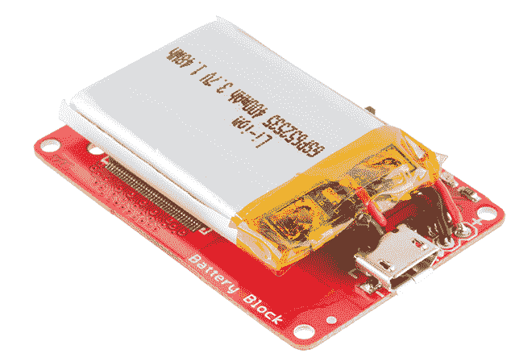
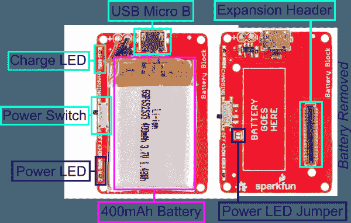
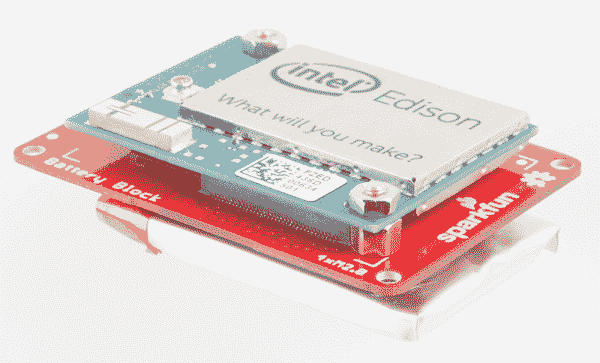
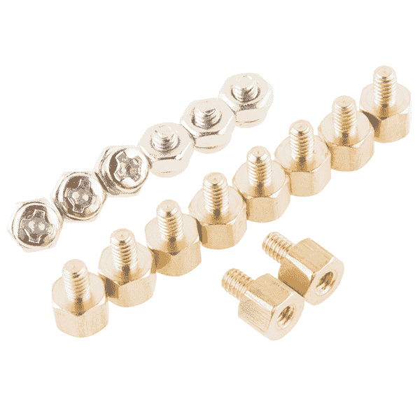
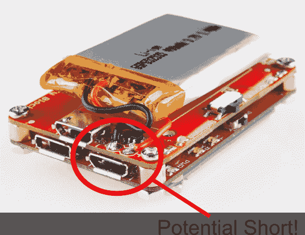
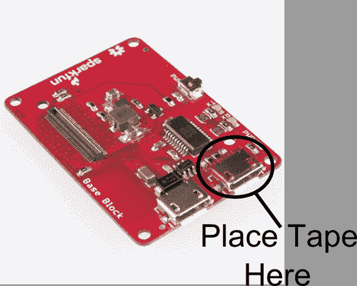
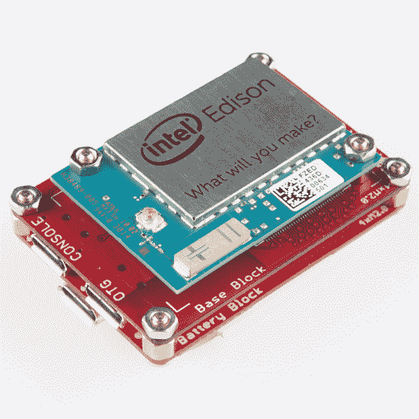

# 英特尔爱迪生公司的 SparkFun 模块-电池模块

> 原文：<https://learn.sparkfun.com/tutorials/sparkfun-blocks-for-intel-edison---battery-block>

## 介绍

[电池块](https://www.sparkfun.com/products/13037)是一种为英特尔爱迪生堆栈供电的简单方式。使用 400mah 锂聚合物电池，我们已经看到运行速度超过一小时。根据您的配置，您可能会看到更多或更少的运行时间。电池块还提供了一个微型 USB 端口，可以在给电池充电的同时为电池组供电。如果您需要更长的电池寿命，可以轻轻剥下电池，拆下电线，换上更大的电池。如果您移除电池，也有可能暴露扩展接头以继续堆叠块。在这种情况下，可能需要为您的电池找到一个替代的安装点。

*Battery Block*

### 推荐阅读

如果你不熟悉积木，看看英特尔爱迪生的[spark fun 积木通用指南。](https://learn.sparkfun.com/tutorials/general-guide-to-sparkfun-blocks-for-intel-edison)

其他可能对您的爱迪生之旅有所帮助的教程包括:

*   [为您的项目提供动力](https://learn.sparkfun.com/tutorials/how-to-power-a-project)
*   [电池技术](https://learn.sparkfun.com/tutorials/battery-technologies)
*   [连接器基础知识](https://learn.sparkfun.com/tutorials/connector-basics)

## 主板概述

*Battery Block Functional Diagram TOP*

*   USB Micro B——为电池组供电，并为电池充电

*   电源开关-移除堆栈的所有电源，其他电源仍可为堆栈供电

*   电源 LED -当 VSYS 线路有电时点亮；如果另一个模块供电，该指示灯可能会亮起

*   电源指示灯跳线-如果功耗是一个问题，请切断跳线以禁用指示灯

*   充电 LED -充电时 LED 点亮；如果没有充电电源或充电完成，则 LED 熄灭

*   扩展接头-70 针扩展接头发挥了英特尔 Edison 的功能。该头部还在整个电池组中传递信号和电力。这些功能很像一个 Arduino 盾牌。

## 使用电池块

电池块使用起来非常简单。您可以使用我们的[硬件包](https://www.sparkfun.com/products/13187)安全地安装 Edison 模块。*注:可能需要轻轻取下电池，以便为螺丝留出空间。只有当电池块是电池组中唯一的**T4 块时，才需要这样做。***

*Battery Block Installed*

我们有一个很好的[硬件包](https://www.sparkfun.com/products/13187)可以提供足够的硬件来保护三个街区和一个爱迪生。

[*Intel Edison Hardware Pack*](https://www.sparkfun.com/products/13187)

电源开关将电源连接到堆栈。关闭时，电池与电池组断开连接，但仍能充电。开关打开时，您可以给电池充电。再简单不过了！

## 将电池块与底座一起使用

我们试图考虑所有可能来自混合和匹配块的潜在冲突。有一个我们无法回避。堆叠电池块和基座块时，可能会发生潜在短路。电池连接直接在微型 USB 连接器位于基座上的上方。

解决这个问题的最简单的方法是重新排列块的顺序，在中间多放一个块。如果这不可能，一切都不会失去。用一点点[电工胶带](https://www.sparkfun.com/products/10689)或 [Kapton 胶带](https://www.sparkfun.com/products/10687)，你可以在 USB 连接器的顶部贴一小块。这将防止连接器接触到两个蓄电池连接。 [Kapton 胶带](https://www.sparkfun.com/products/10687)是首选方法，因为它具有更高的耐高温性和耐用性。

*Kapton Tape Installed*

通过这个简单的修改，你就安全了，并准备好创造下一个伟大的东西！

## 资源和更进一步

现在，您已经对电池模块有了一个简要的概述，让我们来看看其他一些教程。这些教程涵盖编程、模块堆叠以及与英特尔 Edison 生态系统的接口。

## 爱迪生通用主题:

*   [英特尔爱迪生 Sparkfun 模块通用指南](https://learn.sparkfun.com/tutorials/general-guide-to-sparkfun-blocks-for-intel-edison)
*   [爱迪生入门指南](https://learn.sparkfun.com/tutorials/edison-getting-started-guide)
*   [在 Edison 上加载 Debian(Ubilinix)](https://learn.sparkfun.com/tutorials/loading-debian-ubilinux-on-the-edison)

## 阻止特定主题:

*   [电池技术](https://learn.sparkfun.com/tutorials/battery-technologies)
*   [电池块 Github Repo](https://github.com/sparkfun/Edison_Battery_Block)

查看 SparkFun 的其他爱迪生相关教程:

 [### 英特尔爱迪生有机发光二极管模块的 SparkFun 模块](https://learn.sparkfun.com/tutorials/sparkfun-blocks-for-intel-edison---oled-block-) A quick overview of the features of the OLED Block for the Edison.[Favorited Favorite](# "Add to favorites") 3 [### 面向英特尔 Edison 的 SparkFun 模块-基本模块](https://learn.sparkfun.com/tutorials/sparkfun-blocks-for-intel-edison---base-block-) A quick overview of the features of the Base Block.[Favorited Favorite](# "Add to favorites") 2 [### 爱迪生入门指南](https://learn.sparkfun.com/tutorials/edison-getting-started-guide) An introduction to the Intel® Edison. Then a quick walk through on interacting with the console, connecting to WiFi, and doing...stuff.[Favorited Favorite](# "Add to favorites") 12 [### 英特尔 Edison spark fun 模块通用指南](https://learn.sparkfun.com/tutorials/general-guide-to-sparkfun-blocks-for-intel-edison) A general guide for using SparkFun Blocks for Intel® Edison in your next project 5