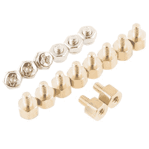

# 英特尔 Edison 的 SparkFun 模块-双 H 桥

> 原文：<https://learn.sparkfun.com/tutorials/sparkfun-blocks-for-intel-edison---dual-h-bridge>

## 介绍

SparkFun 的 [H-Bridge Block for Edison](https://www.sparkfun.com/products/13043) 为你的堆栈增加了一个双通道低压小电流 H-Bridge(T2 东芝 TB6612 )。该块可以被配置为从电池组的 VSYS 电源或者从连接到该块上的头部的外部电源获取功率。

[](https://cdn.sparkfun.com/assets/learn_tutorials/2/8/2/13043-01Cropped.jpg)*Dual H-Bridge Block*

### 推荐阅读

如果你不熟悉积木，看看英特尔爱迪生的[spark fun 积木通用指南。](https://learn.sparkfun.com/tutorials/general-guide-to-sparkfun-blocks-for-intel-edison)

其他可能对您的爱迪生之旅有所帮助的教程包括:

*   本教程假设你是使用 Arduino IDE 的**而不是**，所以你需要熟悉 Edison 上的 C++开发。
*   [为您的项目提供动力](https://learn.sparkfun.com/tutorials/how-to-power-a-project)
*   [连接器基础知识](https://learn.sparkfun.com/tutorials/connector-basics)
*   [脉宽调制](https://learn.sparkfun.com/tutorials/pulse-width-modulation?_ga=1.68681495.725448541.1330116044)

## 主板概述

[](https://cdn.sparkfun.com/assets/learn_tutorials/2/8/2/H-bridgeAnnotated.png)*Dual H-Bridge Block Functional Diagram*

*   电机输出-两个 DC 电机输出。电机 A 和 B

*   电机电源输入-DC 电机的外部电源输入。限于 15v DC。

*   VSYS -> VIN -关闭该跳线，为 VSYS 的电机供电。小心不要过度使用电源。

*   扩展接头-70 针扩展接头发挥了英特尔 Edison 的功能。该头部还在整个电池组中传递信号和电力。这些功能很像一个 Arduino 盾牌。

## 使用双 H 桥模块

要使用双 H 桥模块，只需将 Intel Edison 连接到主板背面，或者将其添加到您当前的堆栈中。块可以不用硬件堆叠，但是它使扩展连接器不受机械应力的保护。

[](https://cdn.sparkfun.com/assets/learn_tutorials/2/8/2/13043-04.jpg)*Dual H-Bridge Block Installed*

我们有一个很好的[硬件包](https://www.sparkfun.com/products/13187)可以提供足够的硬件来保护三个街区和一个爱迪生。

[](https://cdn.sparkfun.com/assets/learn_tutorials/2/8/6/EdisonHardware_1.jpg)[*Intel Edison Hardware Pack*](https://www.sparkfun.com/products/13187)

注:双 H 形电桥模块没有控制台入口或电压调节器。建议将控制台通信模块与该模块结合使用，就像在[英特尔 Edison](https://learn.sparkfun.com/tutorials/general-guide-to-sparkfun-blocks-for-intel-edison#console-communication-blocks)spark fun 模块通用指南中找到的模块一样。

## C++代码示例

我们假设您正在使用 Eclipse IDE，详见我们的[超越 Arduino](https://learn.sparkfun.com/tutorials/programming-the-intel-edison-beyond-the-arduino-ide) 教程。如果你不是，你需要去那个教程来加快速度。

### 入门指南

按照[编程教程](https://learn.sparkfun.com/tutorials/programming-the-intel-edison-beyond-the-arduino-ide#hello-world)中的说明创建一个名为“spark fun _ H-Bridge _ Edison _ Block _ Example”的新项目。一旦你创建了项目，打开磁盘上的项目文件(提示:你可以通过从项目菜单中选择“属性”来找到项目的路径)，并将在[Edison H-Bridge Block CPP library GitHub repository](https://github.com/sparkfun/SparkFun_H-Bridge_Block_for_Edison_CPP_Library)中找到的三个源文件复制到“src”目录。

[Download a zip file of the repository](https://github.com/sparkfun/SparkFun_H-Bridge_Block_for_Edison_CPP_Library/archive/master.zip)

### 硬件连接

对于这个例子，我们有两个[小型 DC 电机，齿轮箱](https://www.sparkfun.com/products/12143)连接到输出端。下图显示了如何构建电路。这取决于你是否想用外部电源驱动电机。我在这里展示了一个，但我非常幸运地关闭了电源跳线，并直接从电池组的 VSYS 轨为这些电机拉电流，即使是通过 USB 供电。

[](https://cdn.sparkfun.com/assets/learn_tutorials/2/8/2/h-bridge.png)

### 密码

你需要知道的一切都在评论里。

```
language:c
#include <unistd.h>

#include "mraa.h"
#include "SparkFun_TB6612_Edison.h"
#include <iostream>
#include <iomanip>
using namespace std;

int main()
{

  // The constructor for the tb6612 class object configures all the necessary
  //  pins, exporting them if they aren't already exported, etc. Note that only
  //  one tb6612 class object may exist at a time, as they share hardware
  //  resources!
  tb6612 motors;

  // The constructor disables the outputs of the tb6612 by asserting the standby
  //  pin on the controller. You *must* use the standby() function to enable
  //  them before proceeding!
  motors.standby(false);

  // diffDrive() accepts a floating point number for channel A and channel B, in
  //  the range -1.0 to 1.0 inclusive.
  motors.diffDrive(0.5,0.5);
  sleep(5);
  motors.diffDrive(-0.5,-0.5);
  sleep(5);

  // "short brake" literally means the two outputs are shorted together. This
  //  drags the motor to a halt in a very short time and then holds it still
  //  (albeit fairly weakly). The shortBrake() function doesn't change the
  //  PWM output settings, so when shortBrake() is released by sending a "false"
  //  parameter, the motor will immediately resume its previous speed.
  motors.shortBrake(true, true);

  // Return the motors to hi-z state. This also doesn't affect the PWM output,
  //  so when standby is released (by passing false to this function) the motors
  //  will immediately resume their former speeds. This also doesn't provide any
  //  braking, so the motors will coast to a stop much more slowly than with
  //  shortBrake().
  motors.standby(true);

  bool brakeA = false;
  bool brakeB = false;
  float dcA = 0;
  float dcB = 0;
  bool onStandby = false;

  // We've provided a number of "get" functions, to check the current status of
  //  the device.

  // getStandby() returns true if the motors are on standby, false otherwise.
  //  This function checks the actual status of the gpio pin used for setting
  //  the standby mode on the chip, so it will always match reality.
  onStandby = motors.getStandby();

  // getDiffDrive() checks the *stored* speed value, rather than the current
  //  value. Thus, if another process alters the PWM output duty cycle without
  //  actually touching the class object, this may return invalid data. It also
  //  doesn't return any information about standby or brake status.
  motors.getDiffDrive(&dcA, &dcB);

  // getShortBrake() checks the pins used for setting the direction/brake mode,
  //  so the values placed into the pointer parameters by the function are
  //  accurate at the time the function is called.
  motors.getShortBrake(&brakeA, &brakeB);

  cout<<"Motor standby status: "<< boolalpha << onStandby << endl;
  cout<<"Motor A brake status: "<< brakeA << endl;
  cout<<"Motor B brake status: "<< brakeB << endl;
  cout<<"Channel A speed: "<< fixed << setprecision(3)<<dcA<<endl;
  cout<<"Channel B speed: "<<dcB<<endl;

  return 0;
} 
```

## 资源和更进一步

现在，您已经对双 H 桥模块有了一个简要的了解，接下来看看其它一些教程。这些教程涵盖编程、模块堆叠以及与英特尔 Edison 生态系统的接口。

## 爱迪生通用主题:

*   [英特尔爱迪生 Sparkfun 模块通用指南](https://learn.sparkfun.com/tutorials/general-guide-to-sparkfun-blocks-for-intel-edison)
*   [爱迪生入门指南](https://learn.sparkfun.com/tutorials/edison-getting-started-guide)
*   [在 Edison 上加载 Debian(Ubilinix)](https://learn.sparkfun.com/tutorials/loading-debian-ubilinux-on-the-edison)

## 阻止特定主题:

*   [双 H 桥块 Git Repo](https://github.com/sparkfun/Edison_H-Bridge_Block)
*   [Edison c++库的 SparkFun H 桥模块](https://github.com/sparkfun/SparkFun_H-Bridge_Block_for_Edison_CPP_Library)

查看 SparkFun 的其他爱迪生相关教程:

[](https://learn.sparkfun.com/tutorials/programming-the-intel-edison-beyond-the-arduino-ide) [### 英特尔 Edison 编程:超越 Arduino IDE](https://learn.sparkfun.com/tutorials/programming-the-intel-edison-beyond-the-arduino-ide) Intel's Edison module goes beyond being just another Arduino clone. Check this tutorial for advice on how to get the most out of your Edison by writing code in C++ 7[](https://learn.sparkfun.com/tutorials/general-guide-to-sparkfun-blocks-for-intel-edison) [### 英特尔 Edison spark fun 模块通用指南](https://learn.sparkfun.com/tutorials/general-guide-to-sparkfun-blocks-for-intel-edison) A general guide for using SparkFun Blocks for Intel® Edison in your next project 5[](https://learn.sparkfun.com/tutorials/sparkfun-inventors-kit-for-edison-experiment-guide) [### 爱迪生实验指南](https://learn.sparkfun.com/tutorials/sparkfun-inventors-kit-for-edison-experiment-guide) Learn how to harness the power of the Intel® Edison using JavaScript to post data to the cloud, control electronics from smartphones, and host web pages that interact with circuits.[Favorited Favorite](# "Add to favorites") 4[](https://learn.sparkfun.com/tutorials/interactive-smart-mirror) [### 交互式智能镜子](https://learn.sparkfun.com/tutorials/interactive-smart-mirror) Build a smart mirror that displays weather data using the Intel® Edison.[Favorited Favorite](# "Add to favorites") 24