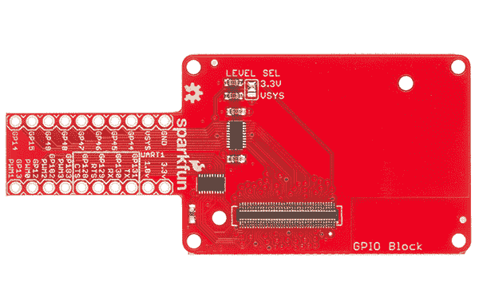
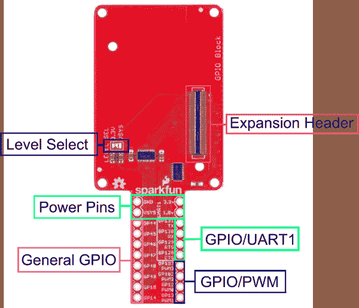
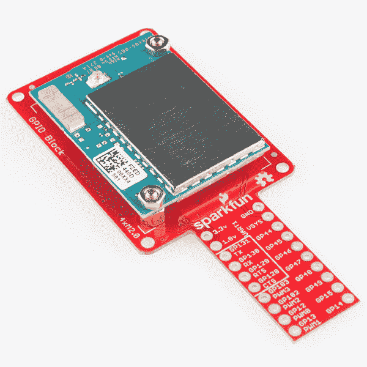

# 英特尔 Edison - GPIO 模块的 SparkFun 模块

> 原文：<https://learn.sparkfun.com/tutorials/sparkfun-blocks-for-intel-edison---gpio-block>

## 导言和概述

[通用输入/输出(GPIO)模块](https://www.sparkfun.com/products/13038)突破了英特尔 Edison 的简单 GPIO 功能。使用可选电平转换器，该模块可以使用 VSYS 或 3.3v 逻辑电平。

[](https://cdn.sparkfun.com/assets/learn_tutorials/2/8/6/gpio.jpg)*GPIO Block*

### 推荐阅读

如果你不熟悉积木，看看英特尔爱迪生的[spark fun 积木通用指南。](https://learn.sparkfun.com/tutorials/general-guide-to-sparkfun-blocks-for-intel-edison)

其他可能对您的爱迪生之旅有所帮助的教程包括:

*   [爱迪生入门指南](/tutorials/edison-getting-started-guide)
*   [逻辑电平](/learn_tutorials/62)

## 主板概述

[](https://cdn.sparkfun.com/assets/learn_tutorials/2/8/6/GPIOBlockAnnotated.png)*GPIO Block Functional Diagram*

*   电平选择-跳线选择 GPIO 参考电压，可设置为 3.3v 或 VSYS
*   电源引脚-爱迪生电源引脚的原始访问
    *   GND -所有块和爱迪生的接地引脚
    *   VSYS-Edison 和所有模块的原始输入。
    *   正常输出(带电源模块)4.0V-4.1V
    *   你可以通过这个插脚给爱迪生供电。可接受的电压 3.3V-4.5V
    *   1.8v - 1.8v 由爱迪生内部电源提供
    *   3.3v - 3.3v 由爱迪生内部电源供电
*   通用 GPIO -通用使用 GPIO 引脚。
*   GPIO/UART1 - GPIO 引脚也可用作第二个 UART。(适用于 GPS 接收器和其他串行设备)
*   GPIO/PWM - GPIO 引脚能够产生 PWM 波形。(适用于 LED 调光和电机控制)
*   扩展接头-70 针扩展接头发挥了英特尔 Edison 的功能。该头部还在整个电池组中传递信号和电力。这些功能很像一个 Arduino 盾牌。

## 使用 GPIO 模块

要使用 GPIO 模块，请在主板背面安装一个 Intel Edison，或者将其添加到您当前的堆栈中。块可以在没有硬件的情况下堆叠，但是这使得扩展连接器不受机械应力的保护。

[](https://cdn.sparkfun.com/assets/learn_tutorials/2/8/6/Edison_Block_Tutorial-05.jpg)*GPIO Block Installed*

我们有一个很好的[硬件包](https://www.sparkfun.com/products/13187)可以提供足够的硬件来保护三个街区和一个爱迪生。

[](https://cdn.sparkfun.com/assets/learn_tutorials/2/8/6/EdisonHardware_1.jpg)[*Intel Edison Hardware Pack*](https://www.sparkfun.com/products/13187)

注意:GPIO 模块没有控制台入口或电压调节器。建议将控制台通信模块与该模块结合使用，就像在[英特尔 Edison](https://learn.sparkfun.com/tutorials/general-guide-to-sparkfun-blocks-for-intel-edison#console-communication-blocks)spark fun 模块通用指南中找到的模块一样。

### 将 GPIO 模块用作输出设备

如果您想要使用 GPIO 模块来控制高功率 LED 或继电器，则需要一个外部晶体管或 MOSFET。可以直接从电平转换器点亮小 LED。它可能没有那么亮，因为 TXB0108 电平转换器的电流输出非常低(~5ma)。

[](https://cdn.sparkfun.com/assets/learn_tutorials/2/8/6/GPIOLoadDiagram.png)*Connection Diagram for Load (LED, Motor, or Relay)*

在终端中，我们将演示如何激活和使用 GPIO 引脚作为输出。

首先导航到 Edison 上的 GPIO 目录。

```
cd /sys/class/gpio 
```

选择要启用的 GPIO 引脚。在这种情况下，我们使用 GPIO 14。

```
echo 14 > export 
```

导航到新创建的 GPIO 目录。

```
cd gpio14 
```

如果你输入“ls”，你应该会看到一堆变量。

```
active_low  direction   power       uevent
device      edge        subsystem   value 
```

让我们将端口的“方向”设置为输出

```
echo out > direction 
```

为了证实这一点，我们将“猫”的价值

```
cat direction 
```

您应该在命令行中看到“out”。现在，设备被配置为输出。“值”是设置引脚状态的位置，1 表示高电平，0 表示低电平。

```
echo 1 > value 
```

使用万用表、小型 led 或示波器进行测试，您应该会在 gpio14 上看到“高”状态(3.3V)。

### 使用 GPIO 模块作为输入设备。

如果希望 GPIO 模块读取开关、按钮或其它逻辑电平输入，必须注意上拉和下拉电阻。船上的电平转换器很弱。下面解释两种情况:

[](https://cdn.sparkfun.com/assets/learn_tutorials/2/8/6/ActiveHighCircuit.png)*Connection Diagram for Active High Push Button*[](https://cdn.sparkfun.com/assets/learn_tutorials/2/8/6/ActiveLowCircuit.png)*Connection Diagram for Active Low Push Button*

在终端中，我们将演示如何激活和使用 GPIO 引脚作为配置为高电平有效的输入。

首先，导航到 Edison 上的 GPIO 目录。

```
cd /sys/class/gpio 
```

选择要启用的 GPIO 引脚。在这种情况下，让我们使用 GPIO 14。

```
echo 14 > export 
```

导航到新创建的 GPIO 目录。

```
cd gpio14 
```

如果你输入“ls”，你应该会看到一堆变量。

```
active_low  direction   power       uevent
device      edge        subsystem   value 
```

让我们将端口的“方向”设置为输出。

```
echo in > direction 
```

为了证实这一点，我们将“猫”的价值。

```
cat direction 
```

您应该在命令行中看到“in”。现在，设备被配置为输入。“值”是设置引脚状态的位置，1 表示高电平，0 表示低电平。

```
cat value 
```

按下按钮后，您应该会看到 1。当按钮未按下时，您应该会看到 0。使用向上箭头，您可以调用以前运行的命令。

## 资源和更进一步

现在您已经对 GPIO 模块有了一个简要的了解，让我们来看看其他一些教程。这些教程涵盖编程、模块堆叠以及与英特尔 Edison 生态系统的接口。

## 爱迪生通用主题:

*   [英特尔爱迪生 Sparkfun 模块通用指南](https://learn.sparkfun.com/tutorials/general-guide-to-sparkfun-blocks-for-intel-edison)
*   [Edison 入门指南-使用 Arduino 编程](https://learn.sparkfun.com/tutorials/edison-getting-started-guide)
*   [在 Edison 上加载 Debian(Ubilinix)](https://learn.sparkfun.com/tutorials/loading-debian-ubilinux-on-the-edison)

## 阻止特定主题:

*   [逻辑电平](https://learn.sparkfun.com/tutorials/logic-levels)
*   [GPIO 块 Github 回购](https://github.com/sparkfun/Edison_GPIO_Block)

查看 SparkFun 的其他爱迪生相关教程:

[](https://learn.sparkfun.com/tutorials/sparkfun-blocks-for-intel-edison---battery-block) [### 英特尔爱迪生公司的 SparkFun 模块-电池模块](https://learn.sparkfun.com/tutorials/sparkfun-blocks-for-intel-edison---battery-block) A quick overview of the features of the Battery Block.[Favorited Favorite](# "Add to favorites") 7[](https://learn.sparkfun.com/tutorials/edison-getting-started-guide) [### 爱迪生入门指南](https://learn.sparkfun.com/tutorials/edison-getting-started-guide) An introduction to the Intel® Edison. Then a quick walk through on interacting with the console, connecting to WiFi, and doing...stuff.[Favorited Favorite](# "Add to favorites") 12[](https://learn.sparkfun.com/tutorials/installing-libmraa-on-ubilinux-for-edison) [### 在 Edison 的 Ubilinux 上安装 libmraa](https://learn.sparkfun.com/tutorials/installing-libmraa-on-ubilinux-for-edison) libmraa is a tool kit for interacting with various Intel single board computers.[Favorited Favorite](# "Add to favorites") 2[](https://learn.sparkfun.com/tutorials/sparkfun-blocks-for-intel-edison---adc-v20) [### 英特尔 Edison - ADC V20 的 SparkFun 模块](https://learn.sparkfun.com/tutorials/sparkfun-blocks-for-intel-edison---adc-v20) A quick overview of the features of the ADC Block.[Favorited Favorite](# "Add to favorites") 1