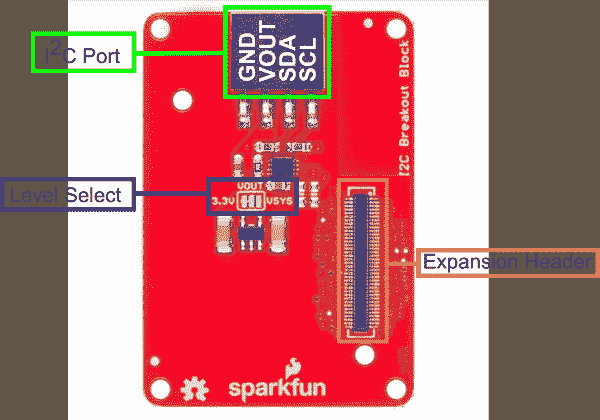

# 英特尔爱迪生 I2C 分线块的火花块

> 原文：<https://learn.sparkfun.com/tutorials/sparkfun-blocks-for-intel-edison---i2c-breakout-block>

## 导言和概述

[I2C 分线点](https://www.sparkfun.com/products/13034)是一种将 I2C 设备与英特尔 Edison 堆栈集成的简单方法。I2C 模块能够为外部 I2C 传感器提供 3.3V 或 VSYS 电源。这使得爱迪生向我们和其他人提供的各种各样的 I2C 装置敞开了大门。

[](https://cdn.sparkfun.com/assets/learn_tutorials/3/1/1/I2CBlockTop.jpg)*I2C Breakout Block*

### 推荐阅读

如果你不熟悉积木，看看英特尔爱迪生的[spark fun 积木通用指南。](https://learn.sparkfun.com/tutorials/general-guide-to-sparkfun-blocks-for-intel-edison)

其他可能对您的爱迪生之旅有所帮助的教程包括:

*   [爱迪生入门指南](/tutorials/edison-getting-started-guide)
*   [I2C](/tutorials/i2c)

## 主板概述

[](https://cdn.sparkfun.com/assets/learn_tutorials/3/1/1/I2CBlockAnnotated.png)*I2C Block Functional Diagram TOP*

*   I2C 港-标准 I2C 港破土而出。VOUT 根据电平选择位置提供电源。

*   电平选择-在 VOUT 上提供 3.3V 和 VSYS 电平之间的电平选择。默认 3.3V

*   扩展接头-70 针扩展接头发挥了英特尔 Edison 的功能。该头部还在整个电池组中传递信号和电力。这些功能很像一个 Arduino 盾牌。

## 使用 I2C 分线块

要使用 I2C 分线块，请在主板背面安装一个英特尔 Edison，或者将其添加到当前堆栈中。块可以在没有硬件的情况下堆叠，但是这使得扩展连接器不受机械应力的保护。

[](https://cdn.sparkfun.com/assets/learn_tutorials/3/1/1/I2CBlockISO.jpg)*I2C Block Installed*

我们有一个很好的[硬件包](https://www.sparkfun.com/products/13187)可以提供足够的硬件来保护三个街区和一个爱迪生。

[](https://cdn.sparkfun.com/assets/learn_tutorials/2/8/6/EdisonHardware_1.jpg)[*Intel Edison Hardware Pack*](https://www.sparkfun.com/products/13187)

注意:I2C 分线块没有控制台入口或电源。建议将控制台通信模块与该模块结合使用，就像在[英特尔 Edison](https://learn.sparkfun.com/tutorials/general-guide-to-sparkfun-blocks-for-intel-edison#console-communication-blocks)spark fun 模块通用指南中找到的模块一样。

#### 例子

在我们的例子中，我们将展示如何连接和扫描 [SparkFun RGB 和手势传感器](https://www.sparkfun.com/products/12787)。[焊接](https://learn.sparkfun.com/tutorials/how-to-solder-through-hole-soldering)我们的[直角分离公接头](https://www.sparkfun.com/products/553)的 4 针部分到分线板。将电路板插入 into 布雷克奥特模块，就完成了硬件连接。

[](https://cdn.sparkfun.com/assets/learn_tutorials/3/1/1/SensorInstalled.jpg)*SparkFun RGB and Gesture Sensor Installed*

要在控制台中查找 I2C 设备，请键入以下命令。请注意，我们将乘坐的 I2C 公共汽车是 1 路。

```
i2cdetect -y -r 1 
```

我们看到该器件如预期出现在地址 0x39 上。

```
 0  1  2  3  4  5  6  7  8  9  a  b  c  d  e  f
00:          -- -- -- -- -- -- -- -- -- -- -- -- --
10: -- -- -- -- -- -- -- -- -- -- -- -- -- -- -- --
20: -- -- -- -- -- -- -- -- -- -- -- -- -- -- -- --
30: -- -- -- -- -- -- -- -- -- 39 -- -- -- -- -- --
40: -- -- -- -- -- -- -- -- -- -- -- -- -- -- -- --
50: -- -- -- -- -- -- -- -- -- -- -- -- -- -- -- --
60: -- -- -- -- -- -- -- -- -- -- -- -- -- -- -- --
70: -- -- -- -- -- -- -- -- 
```

要在您的项目中使用 SparkFun RGB 和手势传感器，您可以修改 [RGB 和手势传感器连接指南](/tutorials/apds-9960-rgb-and-gesture-sensor-hookup-guide)中的代码，以便在您的 Edison 上运行。使用 Edison 的 Arduino IDE，演示应该开箱即用！

### 使用 5V 设备

有一种方法可以修改 I2C 模块以接受 5V 逻辑。切断电压选择跳线，但不要重新连接到 VSYS 或 3.3V。您现在需要从外部提供自己的 5V 电压(用于传感器)。您可以将 5V 电源焊接到中心焊盘，或者使用连接器上的 VOUT 引脚。通过 VOUT 走线提供 5V 电压将允许您无需修改即可插入传感器。

[](https://cdn.sparkfun.com/assets/learn_tutorials/3/1/1/5Vhack.png)

## 资源和更进一步

现在，您已经对 I2C 分组讨论有了一个简要的概述，让我们来看看其他一些教程。这些教程涵盖编程、模块堆叠以及与英特尔 Edison 生态系统的接口。

## 爱迪生通用主题:

*   [英特尔爱迪生 Sparkfun 模块通用指南](https://learn.sparkfun.com/tutorials/general-guide-to-sparkfun-blocks-for-intel-edison)
*   [Edison 入门指南-使用 Arduino 编程](https://learn.sparkfun.com/tutorials/edison-getting-started-guide)
*   [在 Edison 上加载 Debian(Ubilinix)](https://learn.sparkfun.com/tutorials/loading-debian-ubilinux-on-the-edison)

## 阻止特定主题:

*   [I2C](/tutorials/i2c)
*   [PCA9306 连接指南](/tutorials/pca9306-level-translator-hookup-guide)
*   [APDS-9960 RGB 和手势传感器连接指南](/tutorials/apds-9960-rgb-and-gesture-sensor-hookup-guide)
*   [I2C 突破块 Git 回购](https://github.com/sparkfun/Edison_I2C_Breakout_Block)

查看 SparkFun 的其他爱迪生相关教程:

[](https://learn.sparkfun.com/tutorials/sparkfun-blocks-for-intel-edison---9-degrees-of-freedom-block-) [### 英特尔 Edison 的 SparkFun 模块- 9 自由度模块](https://learn.sparkfun.com/tutorials/sparkfun-blocks-for-intel-edison---9-degrees-of-freedom-block-) A quick overview of the features of the 9 Degrees of Freedom Block.[Favorited Favorite](# "Add to favorites") 1[](https://learn.sparkfun.com/tutorials/sparkfun-blocks-for-intel-edison---pwm) [### 英特尔 Edison - PWM 火花模块](https://learn.sparkfun.com/tutorials/sparkfun-blocks-for-intel-edison---pwm) A quick overview of the features of the PWM Block.[Favorited Favorite](# "Add to favorites") 2[](https://learn.sparkfun.com/tutorials/installing-libmraa-on-ubilinux-for-edison) [### 在 Edison 的 Ubilinux 上安装 libmraa](https://learn.sparkfun.com/tutorials/installing-libmraa-on-ubilinux-for-edison) libmraa is a tool kit for interacting with various Intel single board computers.[Favorited Favorite](# "Add to favorites") 2[](https://learn.sparkfun.com/tutorials/single-board-computer-benchmarks) [### 单板计算机基准](https://learn.sparkfun.com/tutorials/single-board-computer-benchmarks) How to set up different benchmarking programs on single board computers or computing modules and run them. The results for various generations are shown on the subsequent pages.[Favorited Favorite](# "Add to favorites") 7